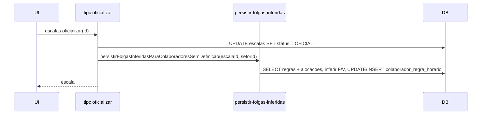

# Plano: Fonte verdade F/V no colaborador — persistir só ao oficializar

## Objetivo

- **Fonte da verdade:** Ao oficializar, o que vale é o que está no **colaborador** (regra padrão). Não existe edição pós-geração na escala que altere F/V.
- **Só ao oficializar** gravamos no colaborador os F/V inferidos (para quem ainda não tinha definido). **Ao gerar e ao salvar rascunho** não alteramos o colaborador — o RH pode gerar, ajustar e salvar à vontade; continua sendo rascunho. **A única forma de “mudar de verdade”** (travar a escala e gravar F/V no colaborador) **é oficializar.**
- **UI escala:** Dropdowns Variável/Fixo na vista do ciclo ficam **somente leitura** em todas as telas.
- **UI Equipe:** Variável/Fixo na aba Equipe do Setor tornam-se **editáveis**, com **salvar imediato** no colaborador (sem botão Salvar nem "Sair sem salvar" para esses campos).

---

## 0. Migração de schema (se necessário)

- **Verificar** se a tabela `colaborador_regra_horario` já possui as colunas `folga_fixa_dia_semana` e `folga_variavel_dia_semana` e os tipos/constraints corretos (ex.: CHECK para SEG..SAB em variável). O schema atual em [src/main/db/schema.ts](src/main/db/schema.ts) já usa `addColumnIfMissing` para essas colunas.
- **Se faltar** coluna, constraint ou índice em algum ambiente, adicionar um passo de migração no mesmo estilo do projeto (ex.: script ou bloco em schema.ts que roda `addColumnIfMissing` / `execDDL`). Incluir esse passo na ordem de implementação antes de depender desses campos no novo módulo.

---

## 1. Backend: persistir F/V inferidos **somente ao oficializar**

Hoje existe em [src/main/tipc.ts](src/main/tipc.ts) a função `autoDefinirFolgasPendentesPosOficializacao(escalaId, setorId)`: ela lê as alocações da escala, infere folga fixa e folga variável por colaborador (dias mais frequentes de folga) e grava em `colaborador_regra_horario` apenas para quem ainda não tinha F/V definido. Ela é chamada **só ao oficializar** (linha 1180). Isso permanece: **não** persistir F/V no colaborador ao gerar, para o RH poder testar rascunhos à vontade.

- **Extrair** a lógica para um módulo reutilizável (ex.: `src/main/motor/persistir-folgas-inferidas.ts`) que exporte `persistirFolgasInferidasParaColaboradoresSemDefinicao(escalaId: number, setorId: number): Promise<void>`. Mover para esse módulo as funções auxiliares (`detectarFolgaFixaPelaEscala`, `detectarFolgaVariavelPelaEscala`, helpers de dia da semana, etc.) a partir de tipc.ts.
- **Chamar** essa função **apenas** no handler de **oficializar** em [tipc.ts](src/main/tipc.ts) (substituir a chamada atual por essa nova função). **Não** chamar em `persistirSolverResult` nem em nenhum fluxo de geração.
- **Tratamento de erro:** Se a persistência de F/V falhar, não abortar a oficialização; logar e seguir (try/catch e `console.warn`).

Fluxo:

**Quando persiste F/V inferidos?** **Somente ao oficializar.** Ao gerar ou ao salvar (rascunho) não alteramos o colaborador; o RH pode testar e salvar o que está ali como rascunho. A única forma de consolidar de verdade e gravar F/V no colaborador é clicar em **Oficializar**. A edição manual de F/V continua na Equipe (e na ficha do colaborador), com salvar imediato (seção 2b).

---

## 2a. Frontend: dropdowns Variável/Fixo somente leitura na escala

O componente [EscalaCicloResumo](src/renderer/src/componentes/EscalaCicloResumo.tsx) já desabilita os selects quando não recebe `onFolgaChange` (`disabled={!onFolgaChange}`, linha 125). Ou seja, onde não se passa `onFolgaChange`, os dropdowns já ficam desabilitados (EscalaPagina e EscalasHub).

- Em [SetorDetalhe.tsx](src/renderer/src/paginas/SetorDetalhe.tsx): remover a prop `onFolgaChange={handleFolgaChange}` das **três** ocorrências de `EscalaCicloResumo` (abas Simulação, Oficial e Histórico — linhas ~1596, 1650, 1719). Com isso, os dropdowns passam a ser somente leitura também no Setor.
- Remover o callback `handleFolgaChange` e as dependências associadas (ex.: `colaboradoresService.salvarRegraHorario`, `reloadRegrasPadrao`) se não forem mais usados em outro lugar nessa página.

Assim, em **todas** as vistas de escala (EscalaPagina, EscalasHub, SetorDetalhe) os campos Variável e Fixo ficam apenas exibindo o que está na regra do colaborador, sem edição.

---

## 2b. Frontend: edição de F/V na aba Equipe (Setor) com salvar imediato

Na aba **Equipe** do SetorDetalhe as colunas Variável e Fixo hoje são Badges somente leitura. Torná-las editáveis e **salvar imediatamente** no colaborador (sem botão Salvar nem "Sair sem salvar").

- Trocar Badge por Select (dias SEG–SAB ou "-"). Ao mudar, chamar `colaboradoresService.salvarRegraHorario` e atualizar estado (refetch ou otimista).
- Edição só quando o posto tem titular; sem titular, exibir "-" sem dropdown.

---

## 3. Documentação e testes

- Atualizar documentação que descreve o fluxo de geração e oficialização (ex.: [docs/SISTEMA_ESCALAFLOW.md](docs/SISTEMA_ESCALAFLOW.md) ou doc de motor) para deixar explícito que:
  - A fonte de verdade para folga fixa/variável é a regra do colaborador.
  - **Ao oficializar**, colaboradores sem F/V definido têm esses valores inferidos a partir da escala e **persistidos na regra do colaborador**; ao gerar ou salvar (rascunho) o colaborador não é alterado.
  - Salvar mantém **rascunho**; a única forma de consolidar de verdade (travar a escala e gravar F/V no colaborador) é **oficializar**.
- Opcional: teste automatizado que oficializa uma escala com pelo menos um colaborador sem F/V, verifica que a regra padrão desse colaborador foi atualizada com os dias inferidos.

---

## Resumo dos arquivos

| Área     | Arquivo                                                                                | Alteração                                                                                                                                                                          |
| -------- | -------------------------------------------------------------------------------------- | ---------------------------------------------------------------------------------------------------------------------------------------------------------------------------------- |
| Schema   | [src/main/db/schema.ts](src/main/db/schema.ts) (se necessário)                         | Verificar colunas F/V em colaborador_regra_horario; adicionar migração se faltar algo                                                                                              |
| Motor    | Novo `src/main/motor/persistir-folgas-inferidas.ts`                                    | Extrair lógica de inferência e persistência de F/V a partir das alocações                                                                                                          |
| Main     | [src/main/tipc.ts](src/main/tipc.ts)                                                   | No handler **oficializar**, chamar `persistirFolgasInferidasParaColaboradoresSemDefinicao`; remover implementação local duplicada. Não alterar solver-bridge nem fluxo de geração. |
| Frontend | [src/renderer/src/paginas/SetorDetalhe.tsx](src/renderer/src/paginas/SetorDetalhe.tsx) | 2a: Remover `onFolgaChange` dos 3 usos de EscalaCicloResumo; remover `handleFolgaChange`. 2b: Na aba Equipe, tornar Variável/Fixo editáveis com Select e salvar imediato           |
| Docs     | Ex.: docs/SISTEMA_ESCALAFLOW.md                                                        | Fonte de verdade F/V no colaborador; persistência dos inferidos somente ao oficializar; salvar = rascunho; única forma de consolidar é oficializar                                 |

---

## Ordem sugerida de implementação

1. Verificar schema (colaborador_regra_horario: folga_fixa_dia_semana, folga_variavel_dia_semana). Se faltar algo, adicionar migração.
2. Criar `persistir-folgas-inferidas.ts` e mover/adaptar a lógica de tipc (incluindo tratamento de erro).
3. Em `tipc.ts`, importar a nova função e no handler **oficializar** chamá-la (substituir `autoDefinirFolgasPendentesPosOficializacao`); remover a implementação local duplicada. Não alterar solver-bridge.
4. Em `SetorDetalhe.tsx`: (2a) remover `onFolgaChange` e `handleFolgaChange`; (2b) na aba Equipe, tornar Variável/Fixo editáveis com salvar imediato.
5. Atualizar documentação e, se desejado, adicionar teste (ex.: oficializar escala e verificar regra do colaborador).

