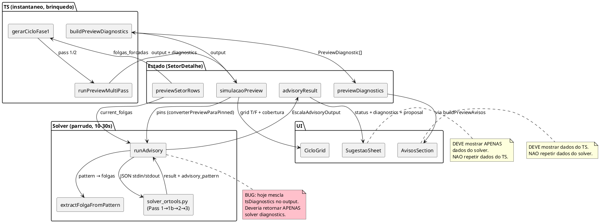
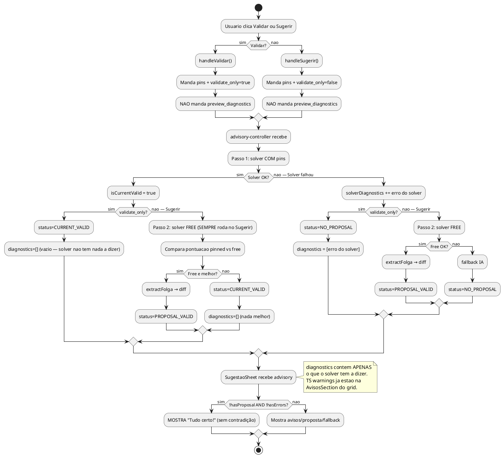

# ANALYST — Mapa Semantico + Bugs da Pipeline Advisory/Preview

## TL;DR

O sistema tem **5 fontes de verdade desconectadas** que deveriam ser 1. O TS computa folgas num mundo, o solver computa em outro, o SugestaoSheet mostra resultados misturados de ambos, e o estado do React nao limpa corretamente quando o usuario muda algo. Resultado: "Tudo certo!" com avisos, advisory stale apos editar folgas, Validar = Sugerir no happy path, e "Voltar ao automatico" que nao volta.

---

## PARTE 0: Mapa Semantico — O que e cada peca, pra que serve, com quem fala

### Pecas do sistema e sua identidade

---

#### 1. `gerarCicloFase1` (simula-ciclo.ts)

**O QUE E:** Gerador greedy de ciclos T/F. Brinquedo rapido. Sub-segundo.

**PRA QUE SERVE:** Dar ao RH uma VISUALIZACAO INSTANTANEA de como ficaria o ciclo de folgas. E o "rascunho de guardanapo" — rapido e util, mas nao e a verdade final.

**COMO FUNCIONA:**
- Recebe N pessoas, K no domingo, folgas forcadas (ou null = auto)
- Step 1: distribui domingos com anti-TT
- Step 2: distribui folgas semanais com `pickBestFolgaDay` (demand-aware)
- Step 3: repara H1 (max 6 consecutivos)
- Retorna grid T/F + cobertura + warnings

**LIMITACOES:**
- Greedy sequencial (pessoa por pessoa, sem visao global)
- Nao sabe de horarios, turnos, almoco, interjornada
- Nao sabe de datas reais, feriados, excecoes
- Pode falhar onde o solver resolve (por ser local, nao global)

**COM QUEM FALA:**
- Consumido por `runPreviewMultiPass` (wrapper de 2 passes)
- Consumido direto pelo `handleSugerir` do SetorDetalhe (TS liberado)
- Output vira `simulacaoPreview.resultado` no React
- Output alimenta `buildPreviewDiagnostics` pra gerar avisos
- Output converte pra pins via `converterPreviewParaPinned` pra mandar pro solver

**SEMANTICA CORRETA:** E o PREVIEW. Mostra no grid. Gera avisos na AvisosSection. NAO e verdade final. NAO deveria ser misturado com resultado do solver.

---

#### 2. `buildPreviewDiagnostics` (preview-diagnostics.ts)

**O QUE E:** Analisador de problemas do output do gerador TS.

**PRA QUE SERVE:** Olhar o grid T/F que o TS gerou e dizer "aqui tem deficit", "aqui tem conflito de folga", "aqui tem domingos demais".

**COMO FUNCIONA:**
- Recebe output do gerarCicloFase1 + demanda + participantes + regras
- Checa: CAPACIDADE_DIARIA_INSUFICIENTE, DEMANDA_FAIXA_INSUFICIENTE, FOLGA_FIXA_CONFLITO, FOLGA_VARIAVEL_CONFLITO, H3_DOM_CICLO_EXATO, H3_DOM_MAX_CONSEC_M/F
- Retorna array de PreviewDiagnostic (code, severity, gate, title, detail, source)

**LIMITACOES:**
- Analisa APENAS o output do TS (nao do solver)
- Checks sao estaticos (nao otimiza, so detecta)
- Nao sabe de horarios/turnos

**COM QUEM FALA:**
- Consumido por `runPreviewMultiPass` (gera diagnostics do multi-pass)
- Consumido pelo `handleSugerir` (gera tsDiagnostics do TS liberado)
- Output vira `previewDiagnostics` no React → alimenta `buildPreviewAvisos` → AvisosSection
- Output vira `previewGate` (ALLOW/CONFIRM_OVERRIDE/BLOCK) → borda do grid + guard do Gerar

**SEMANTICA CORRETA:** Sao avisos do PREVIEW TS. Pertencem a AvisosSection embaixo do grid. NAO devem ir pro SugestaoSheet (que e do solver).

---

#### 3. `runPreviewMultiPass` (preview-multi-pass.ts)

**O QUE E:** Wrapper de 2 passes do gerador TS.

**PRA QUE SERVE:** Se o TS falha no pass strict (preflight=true, anti-TT), tenta pass relaxed (preflight=false, permite TT) quando regras H3 permitem.

**COMO FUNCIONA:**
- Pass 1: `gerarCicloFase1({ preflight: true })`
- Se falhou e causa e TT e regras sao SOFT → Pass 2: `gerarCicloFase1({ preflight: false })`
- Retorna output + diagnostics + pass_usado + relaxed

**COM QUEM FALA:**
- Consumido pelo `simulacaoPreview` useMemo no SetorDetalhe
- Output e o que o CicloGrid renderiza
- Output alimenta previewDiagnostics e previewGate

**SEMANTICA CORRETA:** E a camada de resiliencia do TS. Tenta strict, fallback relaxed. Nada a ver com solver.

---

#### 4. `runAdvisory` (advisory-controller.ts)

**O QUE E:** Pipeline de validacao/proposta do solver Python.

**PRA QUE SERVE:** Responder duas perguntas:
- VALIDAR: "O arranjo do TS rola no mundo real (com horarios, CLT, feriados)?"
- SUGERIR: "Se nao rola, tem algo melhor?"

**COMO FUNCIONA (ESTADO ATUAL — BUGADO):**
- Recebe pins do TS + current_folgas + preview_diagnostics + validate_only
- Passo 1: solver com pins → valida arranjo
- Passo 2 (se falhou e !validate_only): solver free → propoe
- Retorna status + diagnostics (MISTURADO: TS + solver) + proposal

**COMO DEVERIA FUNCIONAR:**
- NAO recebe preview_diagnostics (esses ficam na AvisosSection)
- NAO retorna TS diagnostics no output
- Validar: Passo 1 apenas
- Sugerir: Fase A (com pins) → Fase B (free OFFICIAL) → Fase C (free EXPLORATORY)
- Retorna APENAS diagnostics do solver + proposal (se houver)

**COM QUEM FALA:**
- Chamado pelo SetorDetalhe via IPC `escalas.advisory`
- Chama `buildSolverInput` + `runSolver` (solver Python)
- Chama `extractFolgaFromPattern` pra converter pattern → folgas
- Output vira `advisoryResult` no React → SugestaoSheet renderiza

**SEMANTICA CORRETA:** E o SOLVER falando. Output e EXCLUSIVO do solver. Sem misturar com TS.

---

#### 5. `SugestaoSheet` (SugestaoSheet.tsx)

**O QUE E:** Sheet bottom que mostra resultado do solver.

**PRA QUE SERVE:** Mostrar ao RH o que o solver tem a dizer: validou OK, propoe mudancas, ou nao conseguiu.

**COMO FUNCIONA:**
- Recebe `EscalaAdvisoryOutput` (status, diagnostics, proposal, fallback)
- CURRENT_VALID → "Tudo certo!"
- PROPOSAL_VALID → tabela diff (FF/FV atual vs proposta) + botao Aceitar
- NO_PROPOSAL → erro + fallback IA

**BUG ATUAL:** Mostra TS diagnostics (que vieram misturados no advisory.diagnostics) junto com o resultado do solver. "Tudo certo!" + avisos do TS = contradicao.

**SEMANTICA CORRETA:** Mostra APENAS o que o solver disse. Se o solver disse CURRENT_VALID e nao tem diagnostics proprios, mostra "Tudo certo!" LIMPO. Sem avisos do TS (esses ja estao na AvisosSection).

---

#### 6. `buildPreviewAvisos` (build-avisos.ts)

**O QUE E:** Merger de avisos de 4+ fontes pra AvisosSection.

**PRA QUE SERVE:** Unificar todos os avisos que aparecem EMBAIXO do CicloGrid.

**FONTES:**
1. `previewDiagnostics` — do TS (CAPACIDADE, FOLGA_CONFLITO, H3)
2. `storePreviewAvisos` — do AppDataStore (derivados)
3. `avisosOperacao` — preflight blockers, solver feedback
4. semTitular / foraDoPreview — counters
5. `advisoryDiagnostics` — do solver (ADICIONA ao merge)

**BUG ATUAL:** A fonte 5 (advisoryDiagnostics) adiciona diagnostics do solver que JA incluem os diagnostics do TS (porque o advisory mistura). Resultado: duplicacao. O mesmo aviso aparece 2x.

**SEMANTICA CORRETA:** A AvisosSection mostra avisos do TS (fontes 1-4). O SugestaoSheet mostra resultado do solver (fonte separada). Nao cruzar.

---

#### 7. `handleResetarSimulacao` (SetorDetalhe.tsx)

**O QUE E:** "Voltar ao automatico" — limpar overrides e deixar o TS decidir.

**BUG ATUAL:** Limpa `overrides_locais` mas o preview continua usando `regrasMap` (banco) como base. Se o banco tem `folga_fixa = DOM`, "automatico" = DOM. Deveria ser null (TS decide).

**SEMANTICA CORRETA:** "Automatico" = `folgas_forcadas = all null`. O TS decide via `pickBestFolgaDay`. Override explicito `{fixa: null, variavel: null}` pra CADA colaborador anula o banco.

---

#### 8. `advisoryResult` + `previewSetorRows` + `useEffect` invalidation (SetorDetalhe.tsx)

**O QUE E:** Estado React que guarda o ultimo resultado do solver.

**BUG ATUAL:** `setAdvisoryResult(null)` roda quando `previewSetorRows` muda, mas o SugestaoSheet continua aberto mostrando estado vazio. E o advisory nao se invalida quando `simulacaoPreview.resultado` muda (so quando rows mudam).

**SEMANTICA CORRETA:** Advisory invalida quando QUALQUER input muda (folgas, demanda, N, K). Sheet fecha ou mostra "resultado desatualizado".

---

### Diagrama de Relacionamento



---

## Mapa dos Arquivos Envolvidos

```
src/shared/simula-ciclo.ts          ← GERADOR TS (greedy, sub-segundo)
src/shared/preview-diagnostics.ts   ← DIAGNOSTICS TS (analisa output do gerador)
src/shared/preview-multi-pass.ts    ← MULTI-PASS (strict → relaxed)
src/shared/advisory-types.ts        ← TIPOS (EscalaAdvisoryInput/Output)
src/main/motor/advisory-controller.ts ← PIPELINE SOLVER (valida + propoe)
src/renderer/src/componentes/SugestaoSheet.tsx ← UI (mostra resultado)
src/renderer/src/lib/build-avisos.ts ← MERGE de avisos (4+ fontes → 1 lista)
src/renderer/src/paginas/SetorDetalhe.tsx ← ORQUESTRADOR (tudo conecta aqui)
```

---

## BUG 1: "Tudo certo!" aparece COM avisos

### Onde acontece
`SugestaoSheet.tsx` linhas 293-305

### O que acontece

```
advisory.status = CURRENT_VALID (solver validou com pins → OK)
advisory.diagnostics = [
  { code: 'CAPACIDADE_DIARIA_INSUFICIENTE', severity: 'error', source: 'capacity' },  ← TS
  { code: 'FOLGA_FIXA_CONFLITO', severity: 'warning', source: 'capacity' },            ← TS
]
```

O sheet renderiza:
1. Header: "Tudo certo!" (porque status = CURRENT_VALID)
2. Avisos: mostra os diagnostics do TS que foram passados pelo pipeline

**Resultado visual:** "Tudo certo!" e avisos vermelhos/amarelos ao mesmo tempo.

### Por que acontece

O `advisory.diagnostics` e um MERGE de TS + solver:
```ts
// advisory-controller.ts linha 354
return { diagnostics: [...tsDiagnostics, ...solverDiagnostics] }
```

Os `tsDiagnostics` sao passados pelo renderer via `preview_diagnostics`. O solver diz "CURRENT_VALID" (ele conseguiu resolver), mas os diagnostics do TS continuam no array. O SugestaoSheet mostra TUDO.

### Raiz do problema

**TS diagnostics e solver diagnostics estao no mesmo array sem distincao de contexto.** O sheet nao sabe quais sao do TS (pre-existentes) e quais sao do solver (novos). Mostra tudo junto.

### O que deveria acontecer

Se solver validou OK (`CURRENT_VALID`), o sheet deveria mostrar APENAS:
- "Tudo certo! O arranjo foi validado." (sem avisos do TS — esses ja estao na AvisosSection embaixo do grid)
- Ou no minimo, separar visualmente: "O solver validou OK, mas o preview TS tem estes avisos: ..."

---

## BUG 2: Validar e Sugerir dao o MESMO resultado

### Onde acontece
`SetorDetalhe.tsx` — `handleValidar` (linha 1993) vs `handleSugerir` (linha 1895)

### O que acontece

No happy path (arranjo bom, sem block):
- **Validar**: manda `validate_only: true` → passo 1 (solver com pins) → CURRENT_VALID → "Tudo certo!"
- **Sugerir**: roda TS liberado primeiro, manda sem `validate_only` → passo 1 (solver com pins) → CURRENT_VALID → "Tudo certo!"

**Ambos mostram a mesma coisa.** O passo 2 (free solve) so roda quando passo 1 FALHA. Se o arranjo e valido, Sugerir nao tem nada pra sugerir.

### Raiz do problema

O Sugerir foi desenhado pra: (1) validar, (2) se invalido, propor. Mas quando valido, ele nao tem diferencial do Validar. O RH clica "Sugerir" esperando uma sugestao MELHOR e recebe "Tudo certo!".

### O que deveria acontecer

- **Validar**: "Este arranjo rola? Sim/Nao + por que nao."
- **Sugerir**: "Tem algo melhor? Se sim, aqui esta. Se nao, o arranjo atual ja e bom."

O Sugerir deveria SEMPRE rodar o free solve (passo 2), independente do passo 1. E comparar: se o free solve encontrar algo com melhor pontuacao que o pinned, mostrar a diferenca. Se nao, "Nao encontrei nada melhor."

---

## BUG 3: "Voltar ao automatico" nao volta de verdade

### Onde acontece
`SetorDetalhe.tsx` — `handleResetarSimulacao` linha 1601

### O que acontece

```ts
atualizarSimulacaoConfig((prev) => ({
  ...prev,
  setor: { ...prev.setor, overrides_locais: {} },  // limpa overrides locais
}))
```

Limpa `overrides_locais` mas NAO limpa as regras salvas no banco (`regrasMap`). O `previewSetorRows` resolve assim:

```ts
const baseFixa = regra?.folga_fixa_dia_semana ?? null  // ← VEM DO BANCO
const fixaAtual = resolveOverrideField(overrideLocal, 'fixa', baseFixa)  // override vazio → usa banco
```

Se o banco tem `folga_fixa_dia_semana = 'DOM'` (porque a gente setou via MCP), "Voltar ao automatico" continua usando DOM.

### Raiz do problema

"Automatico" deveria significar: **TS decide tudo via `pickBestFolgaDay`** (todas as folgas_forcadas sao `null`). Mas o sistema usa `regrasMap` (banco) como base, nao null.

### O que deveria acontecer

"Voltar ao automatico" deveria setar `folgas_forcadas` inteiro como `null` para cada pessoa, ignorando banco. Ou seja, `overrides_locais` com `fixa: null, variavel: null` EXPLICITO para cada colaborador (override que anula o banco).

---

## BUG 4: Advisory stale apos editar folgas

### Onde acontece
`SetorDetalhe.tsx` — `useEffect` linha 2047

### O que acontece

```ts
useEffect(() => { setAdvisoryResult(null) }, [previewSetorRows])
```

Quando o usuario muda uma folga no dropdown, `previewSetorRows` recomputa, `advisoryResult` e setado pra null. **Isso funciona.** O problema e que o `SugestaoSheet` continua `open = true` com `advisory = null` — mostra o sheet vazio (sem loading, sem conteudo).

### Raiz do problema

Fechar o sheet quando o advisory e invalidado. Ou: nao mostrar o sheet se `advisory === null && !loading`.

---

## BUG 5: TS diagnostics misturados com solver diagnostics

### Onde acontece

```
handleSugerir/handleValidar (SetorDetalhe.tsx)
  → manda preview_diagnostics (TS)
    → advisory-controller mescla: [...tsDiagnostics, ...solverDiagnostics]
      → SugestaoSheet mostra TUDO
        → build-avisos.ts TAMBEM mostra previewDiagnostics na AvisosSection

RESULTADO: O mesmo aviso aparece 2 vezes — na AvisosSection (embaixo do grid) E no SugestaoSheet.
```

### Raiz do problema

O advisory nao deveria repassar TS diagnostics no output. Eles ja estao na AvisosSection. O advisory deveria retornar APENAS diagnostics PROPRIOS (solver-generated). O SugestaoSheet mostraria so o que o solver tem a dizer.

---

## Diagrama: Fluxo Atual (QUEBRADO)

```plantuml
@startuml
start
:Usuario clica Validar ou Sugerir;

if (Validar?) then (sim)
  :handleValidar();
  :Manda preview_diagnostics (TS) + pins + validate_only=true;
else (nao)
  :handleSugerir();
  :Roda TS liberado (tudo null);
  :Monta tsDiagnostics do TS liberado;
  :Manda preview_diagnostics (TS liberado) + pins;
endif

:advisory-controller recebe;
:tsDiagnostics = input.preview_diagnostics;

if (skipSolver?) then (sim)
  :Retorna tsDiagnostics + "Validacao pulada";
  stop
else (nao)
  :Passo 1: solver COM pins;

  if (Solver OK?) then (sim)
    :isCurrentValid = true;
    #pink:RETORNA status=CURRENT_VALID
    + diagnostics=[...tsDiagnostics]
    (TS warnings DENTRO do advisory output!);
  else (nao)
    :isCurrentValid = false;
    :Adiciona VALIDACAO_INVIAVEL;

    if (validate_only?) then (sim)
      :Retorna diagnostics;
      stop
    else (nao)
      :Passo 2: solver FREE;
      if (Free OK?) then (sim)
        :extractFolgaFromPattern;
        :Monta diff;
        :status=PROPOSAL_VALID;
      else (nao)
        :fallback IA;
        :status=NO_PROPOSAL;
      endif
    endif
  endif
endif

:SugestaoSheet recebe advisory;

#pink:MOSTRA diagnosticsToShow = advisory.diagnostics
.filter(severity != 'info')
(INCLUI TS diagnostics!);

if (status = CURRENT_VALID E !hasErrors?) then (sim)
  #pink:MOSTRA "Tudo certo!"
  + avisos do TS ao mesmo tempo!;
else (nao)
  :Mostra avisos/proposta/fallback;
endif

stop
@enduml
```

---

## Diagrama: Fluxo Correto (PROPOSTO)



---

## Resumo das Correcoes Necessarias

| # | Bug | Arquivo | Correcao |
|---|-----|---------|----------|
| 1 | "Tudo certo!" + avisos | `advisory-controller.ts` | NAO passar `tsDiagnostics` no output. Retornar APENAS diagnostics do solver. |
| 2 | Validar = Sugerir | `advisory-controller.ts` | Sugerir: SEMPRE rodar passo 2 (free solve), mesmo quando passo 1 OK. Comparar pontuacoes. |
| 3 | "Voltar ao automatico" | `SetorDetalhe.tsx` | handleResetarSimulacao modo 'automatico': setar override explicito `fixa: null, variavel: null` pra CADA colaborador (anula banco). |
| 4 | Advisory stale | `SetorDetalhe.tsx` | Fechar sugestaoSheet quando advisoryResult e invalidado (ou nao mostrar se null e !loading). |
| 5 | Diagnostics duplicados | `advisory-controller.ts` + `build-avisos.ts` | Remover `preview_diagnostics` do input/output do advisory. TS avisos ficam SO na AvisosSection. |

---

## REDESIGN: O que o Sugerir DEVERIA ser

### O Sugerir e um RESOLVEDOR, nao um diagnosticador

O RH clica "Sugerir" quando o arranjo nao ta funcionando. Ele nao quer ver ERROS — quer ver SOLUCAO. O solver Python ja tem multi-pass com degradacao graciosa (Pass 1 → 1b → 2 → 3). O advisory deveria espelhar isso.

### Multi-pass do solver Python (ja existe em `solver_ortools.py:1584`)

```
Pass 1:  Resolve COM pins (folgas do TS) + TODAS as regras
Pass 1b: Mantém padrão de folgas, relaxa DIAS_TRABALHO + MIN_DIARIO
Pass 2:  Remove pins de folga, relaxa regras de produto
Pass 3:  Ultimo recurso — relaxa FOLGA_FIXA, FOLGA_VARIAVEL, TIME_WINDOW
```

Cada pass e mais agressivo. Se Pass 1 falha, tenta 1b. Se 1b falha, tenta 2. Se 2 falha, tenta 3. Retorna o PRIMEIRO que funciona. O advisory hoje so roda Pass 1 (pinned) ou free solve (sem pins). Nao aproveita a degradacao graciosa.

### Pipeline correta do Sugerir

```
SUGERIR (o resolvedor)
│
├── Fase A: Solver com pins do TS + regras normais
│   └── Se OK → CURRENT_VALID ("Tudo certo, seu arranjo funciona!")
│
├── Fase B: Solver FREE (sem pins) + regras normais
│   ├── Se OK e diferente → PROPOSAL_VALID (diff: "Mude X pra Y")
│   └── Se OK e igual → CURRENT_VALID
│
├── Fase C: Solver FREE + generation_mode=EXPLORATORY
│   (permite relaxar FOLGA_FIXA, FOLGA_VARIAVEL, TIME_WINDOW)
│   ├── Se OK → PROPOSAL_VALID (diff + aviso: "Precisei mexer nas folgas fixas")
│   └── Se falhou → NO_PROPOSAL
│
└── Se TUDO falhou → fallback IA + mostrar POR QUE
```

Nota: o solver Python ja faz Pass 1→1b→2→3 DENTRO de cada chamada. Nao precisa replicar isso no TS. O que o advisory controla e:
- **Fase A**: solver com `pinned_folga_externo` (valida arranjo atual)
- **Fase B**: solver sem pins, `generation_mode=OFFICIAL` (propoe dentro das regras)
- **Fase C**: solver sem pins, `generation_mode=EXPLORATORY` (propoe relaxando regras de produto)

### Pipeline correta do Validar

```
VALIDAR (o conferidor)
│
├── Solver com pins do TS
│   ├── Se OK → "Tudo certo!"
│   └── Se falhou → Mostra o erro do solver (sem proposta, sem free solve)
│
└── NAO roda free solve. NAO propoe. So confere.
```

### Diferenca clara

| | Validar | Sugerir |
|---|---------|---------|
| **Objetivo** | "Meu arranjo rola?" | "Tem algo melhor (ou que funcione)?" |
| **Solver com pins** | Sim | Sim (Fase A) |
| **Solver free** | Nao | Sim (Fases B e C) |
| **Proposta** | Nunca | Quando encontra algo melhor/viavel |
| **Relaxacao** | Nao | Sim (Fase C = EXPLORATORY) |
| **Resultado OK** | "Tudo certo!" | "Tudo certo!" (se Fase A OK) OU diff |
| **Resultado falha** | "Nao rola + por que" | Tenta B, C, so falha se TUDO falha |

---

## Resumo das Fontes de Verdade (PROBLEMA CENTRAL)

Hoje existem 5 fontes de dados que deveriam ser coerentes mas nao sao:

```
1. regrasMap (banco)           → folga_fixa/variavel SALVA do colaborador
2. overridesLocaisSetor        → folga_fixa/variavel TEMPORARIA (so na sessao)
3. previewSetorRows            → merge de 1 + 2 (o que o dropdown mostra)
4. simulacaoPreview.resultado  → output do gerarCicloFase1 (grid T/F computado)
5. advisoryResult              → output do solver (diagnostics, proposal)
```

O fluxo de dados correto deveria ser:
```
[1 + 2] → 3 (previewSetorRows)
  → 4 (gerarCicloFase1 usa folgas de 3)
    → mostra no CicloGrid
    → gera previewDiagnostics
      → mostra na AvisosSection

[4] → pins → 5 (solver valida/propoe)
  → mostra no SugestaoSheet (SÓ dados do solver, sem repetir TS)
```

Cada camada deveria consumir APENAS a camada anterior, nao pular camadas. O SugestaoSheet nao deveria ter dados do TS (esses ja estao na AvisosSection).

---

---

## DESIGN: 4 Botoes para Debug + Producao

O RH (e o dev durante debug) precisa de acoes separadas pra entender quem faz o que. Os 4 botoes:

### Layout

```
Header da secao Escala:
┌─────────────────────────────────────────────────────────────────────┐
│ [Simulacao] [Oficial] [Historico ∨]                                 │
│                                                                     │
│                    [🛡 Validar] [⚡ Sugerir Solver] [⚙] [▶ Gerar]  │
└─────────────────────────────────────────────────────────────────────┘

CicloGrid (linha COBERTURA):
┌─────────────────────────────────────────────────────────────────────┐
│ COBERTURA  [💡 Sugerir TS]  [↺]    3/3  3/3  5/3  ...             │
└─────────────────────────────────────────────────────────────────────┘
```

### 1. Sugerir TS (💡 no CicloGrid — ja existe)

**O que faz:** Roda `gerarCicloFase1` com TUDO automatico (`folgas_forcadas = all null`). Mostra o resultado que o TS greedy escolheria se pudesse decidir sozinho.

**Resultado:** Aplica as folgas do TS no preview. Se o TS resolveu, o grid atualiza e os avisos somem. Se nao resolveu, mostra os avisos do TS.

**NAO chama solver. NAO abre SugestaoSheet.** Apenas recalcula o preview com folgas automaticas e atualiza o grid in-place.

IMPORTANTE: Hoje o handleSugerir roda TS liberado E depois chama o solver. Isso precisa ser separado:
- O botao "Sugerir" do CicloGrid vira APENAS TS (aplica folgas automaticas no preview)
- O botao "Sugerir Solver" no header faz a pipeline completa (solver Fases A→B→C)

### 2. Sugerir Solver (⚡ no header)

**O que faz:** Pipeline completa solver:

```
Fase A: Solver com pins do arranjo atual
  → OK? "Seu arranjo funciona!" (sem avisos do TS)

Fase B: Solver free (OFFICIAL)
  → Diferente? Mostra diff. Igual? "Nao encontrei nada melhor."

Fase C: Solver free (EXPLORATORY — pode mexer em folga fixa/variavel)
  → Encontrou? Mostra diff com aviso "precisei mexer nas folgas fixas"
  → Falhou? fallback IA + motivo
```

**SEMPRE roda, independente do que o TS diz.** O TS pode dizer "impossivel" mas o solver consegue resolver. O guard `tsHasBlock` NAO se aplica aqui.

**Output:** SugestaoSheet com resultado EXCLUSIVO do solver (sem TS diagnostics misturados).

### 3. Validar (🛡 no header — ja existe)

**O que faz:** Solver com pins. So confere. Sem proposta.

**Guard:** Se TS tem BLOCK, o Validar pode pular (o TS ja sabe). O RH deveria corrigir ou usar Sugerir Solver.

### 4. Gerar Escala (▶ no header — ja existe)

**O que faz:** Gera escala real com o solver Phase 2 completo.

---

## DECISAO CRITICA: Separar "Sugerir TS" de "Sugerir Solver"

Hoje o botao "Sugerir" no CicloGrid faz DUAS coisas:
1. Roda TS liberado (sub-segundo)
2. Chama solver advisory (10-30s)

Isso precisa virar 2 botoes:
- **Sugerir TS** (CicloGrid): instantaneo, recalcula preview, atualiza grid in-place
- **Sugerir Solver** (header): lento, abre SugestaoSheet, mostra diff do solver

O "Sugerir TS" e o equivalente a "Voltar ao automatico" mas inteligente — o TS decide as folgas por demanda.

---

---

## INSIGHTS DE RACIOCINIO PROFUNDO

### Insight 1: A raiz de TODOS os bugs visuais e UMA linha

```ts
// advisory-controller.ts — return do runAdvisory
return { diagnostics: [...tsDiagnostics, ...solverDiagnostics] }
//                      ^^^^^^^^^^^^^^^^^
//                      ISSO AQUI contamina tudo
```

Remover `tsDiagnostics` do return resolve: "Tudo certo!" + avisos, duplicacao na AvisosSection, sheet mostrando coisas do TS.

### Insight 2: build-avisos.ts JA funciona corretamente pra o novo design

Se o advisory retorna APENAS solver diagnostics:
- AvisosSection mostra: TS diagnostics (fonte 1) + solver diagnostics (fonte 5 = advisoryDiagnostics)
- SugestaoSheet mostra: APENAS advisory.diagnostics (solver)
- Zero duplicacao. build-avisos ja faz o merge + dedup correto.

### Insight 3: "Sugerir TS" e "Voltar ao automatico" sao a MESMA acao

Ambos fazem: "deixa o TS decidir as folgas". A implementacao e setar override explicito `{fixa: null, variavel: null}` pra cada colaborador. O useMemo do `simulacaoPreview` recomputa instantaneamente.

O botao "Sugerir" no CicloGrid pode continuar existindo mas agora = "Voltar ao automatico" (limpo). NAO chama solver.

### Insight 4: handleSugerir ATUAL faz trabalho desnecessario

Hoje:
1. Roda TS liberado (sub-segundo) ← DESNECESSARIO pro solver
2. Monta tsDiagnostics do TS liberado ← DESNECESSARIO (nao vai pro output)
3. Converte TS result → pins ← DEVERIA usar pins do PREVIEW ATUAL
4. Chama solver

O "Sugerir Solver" simplifica pra:
1. Pega pins do preview atual (converterPreviewParaPinned do simulacaoPreview.resultado)
2. Monta currentFolgas do preview grid
3. Chama advisory SEM preview_diagnostics
4. Sheet mostra resultado LIMPO do solver

### Insight 5: As Fases A→B→C NAO sao 3 chamadas de solver separadas

O solver Python JA faz multi-pass interno (Pass 1→1b→2→3) em CADA chamada. Entao:
- Fase A = 1 chamada solver(pins, OFFICIAL) → Python tenta 4 passes com pins
- Fase B = 1 chamada solver(sem pins, OFFICIAL) → Python tenta 4 passes livre
- Fase C = 1 chamada solver(sem pins, EXPLORATORY) → Python tenta 4 passes relaxado

Total maximo: 3 chamadas × 4 passes internos = 12 tentativas. Na pratica Fase A resolve 95%.

### Insight 6: O override null anula o banco na resolucao de folgas

```ts
function resolveOverrideField(override, field, fallback) {
  return hasOwnOverrideField(override, field) ? override?.[field] ?? null : fallback
}
```

Se `override = {fixa: null}`, `hasOwnProperty('fixa')` = true → retorna null. O banco e anulado. Funciona.

### Insight 7: Invalidacao do advisory precisa cobrir MAIS dependencias

Hoje:
```ts
useEffect(() => { setAdvisoryResult(null) }, [previewSetorRows])
```

Falta: `simulacaoPreview.resultado` (quando N, K, demanda mudam mas folgas nao). E falta fechar o sheet:
```ts
useEffect(() => {
  setAdvisoryResult(null)
  setSugestaoOpen(false)
}, [previewSetorRows, simulacaoPreview.resultado])
```

---

## PLANO DE EXECUCAO (7 passos, nesta ordem)

### Passo 1: advisory-controller.ts — remover tsDiagnostics do output
- Linha do return: `diagnostics: [...solverDiagnostics]` (sem tsDiagnostics)
- Remover `preview_diagnostics` do processamento (nao usar mais)
- O campo continua no tipo (backward compat) mas e ignorado

### Passo 2: advisory-controller.ts — implementar Fases A→B→C pro Sugerir
- Fase A: solver com pins (OFFICIAL) — ja existe como passo 1
- Fase B: solver free (OFFICIAL) — existe parcialmente como passo 2, mas so roda quando A falha
- MUDAR: Sugerir (!validate_only) SEMPRE roda Fase B apos Fase A, mesmo quando A OK
  - Se A OK e B diferente → PROPOSAL_VALID (solver encontrou algo melhor)
  - Se A OK e B igual → CURRENT_VALID
  - Se A falhou e B OK → PROPOSAL_VALID
  - Se A e B falharam → Fase C
- Fase C: solver free (EXPLORATORY) — novo, so roda quando A e B falharam
  - Manda `rules_override` ou `generation_mode: 'EXPLORATORY'` na config
  - Se OK → PROPOSAL_VALID + aviso "precisou mexer em folgas fixas"
  - Se falhou → NO_PROPOSAL + fallback IA

### Passo 3: SetorDetalhe.tsx — separar Sugerir TS de Sugerir Solver
- "Sugerir" no CicloGrid → vira `handleSugerirTS` (= resetar automatico com override null)
  - Itera previewSetorRows, seta override `{fixa: null, variavel: null}` pra cada um
  - Preview recomputa instantaneamente
  - NAO abre SugestaoSheet
- "Sugerir Solver" no header → novo botao `handleSugerirSolver`
  - Pega pins do preview ATUAL (nao do TS liberado)
  - Chama advisory SEM preview_diagnostics
  - Abre SugestaoSheet

### Passo 4: SetorDetalhe.tsx — fix "Voltar ao automatico"
- handleResetarSimulacao('automatico') = handleSugerirTS (mesma logica)
- Override explicito null pra todos

### Passo 5: SetorDetalhe.tsx — invalidacao do advisory
- useEffect depende de `previewSetorRows` + `simulacaoPreview.resultado`
- Fecha sugestaoOpen junto

### Passo 6: SetorDetalhe.tsx — handleSugerirSolver (simplificado)
- Remove TS liberado (gerarCicloFase1 + buildPreviewDiagnostics)
- Usa pins do preview atual
- Nao manda preview_diagnostics

### Passo 7: Typecheck + verificacao visual
