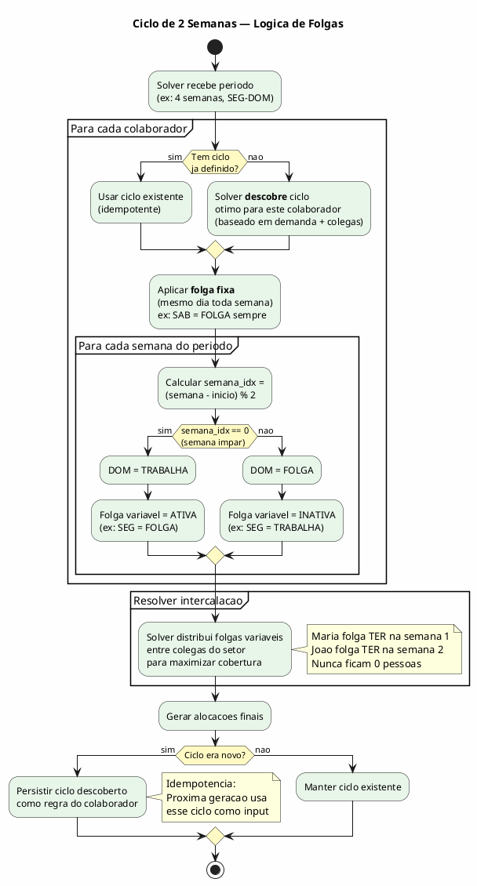
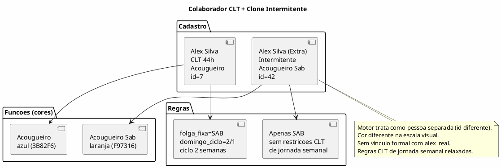
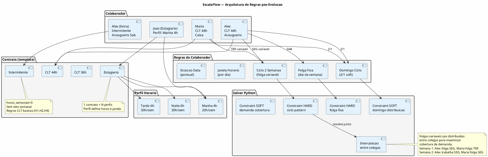
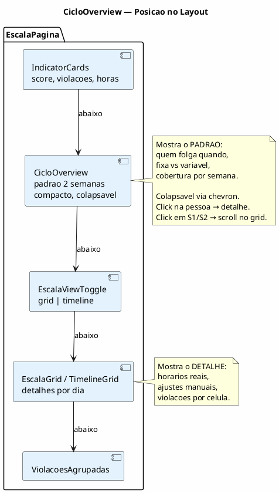

# ANALYST — Ciclos Multi-Semana, Contrato Intermitente & Simplificacao de Contratos

> Destilacao de logica de negocio para evolucao do motor EscalaFlow.
> Data: 2026-02-25 | Status: SPEC PRONTA

---

## TL;DR EXECUTIVO

O Supermercado Fernandes precisa de 4 evolucoes interdependentes:

1. **Ciclo de 2 semanas por funcionario** — folga fixa (sempre mesmo dia) + folga variavel (condicional ao domingo, intercalada entre colegas). O solver descobre o padrao SE nao existe, respeita SE ja existe (idempotencia).
2. **Contrato Intermitente** — tipo de contrato real (seed), permite cadastrar o mesmo funcionario como "extra" com regras CLT relaxadas.
3. **Simplificacao de Estagiario** — 3 contratos vira 1 contrato + N perfis de horario. Dropdown condicional na UI.
4. **Remocao de `trabalha_domingo` do contrato** — campo fantasma, nunca usado pelo solver. Controle real ja vive nas regras do colaborador.

---

## 1. O CICLO DE 2 SEMANAS

### 1.1 O que e

Cada colaborador CLT 44h tem um padrao de folgas que se repete a cada 2 semanas:

- **Folga FIXA**: sempre o mesmo dia da semana (ex: SAB). Nunca muda.
- **Folga VARIAVEL**: um dia que depende do domingo. Se trabalhou DOM, folga nesse dia. Se nao trabalhou DOM, trabalha nesse dia.

Isso cria naturalmente um ciclo de 2 semanas onde o colaborador alterna entre 2 patterns.

### 1.2 Exemplo concreto — Alex

```
CICLO DO ALEX (folga fixa = SAB, folga variavel = SEG)

Semana 1 (trabalha domingo):
  SEG  TER  QUA  QUI  SEX  SAB  DOM
  [F]  [T]  [T]  [T]  [T]  [F]  [T]   ← 5 dias trabalho, 2 folgas

Semana 2 (nao trabalha domingo):
  SEG  TER  QUA  QUI  SEX  SAB  DOM
  [T]  [T]  [T]  [T]  [T]  [F]  [F]   ← 5 dias trabalho, 2 folgas

Semana 3 = repete Semana 1
Semana 4 = repete Semana 2
```

**Regra:** A semana inicia na SEGUNDA e termina no DOMINGO.

### 1.3 Interacao entre funcionarios

A folga variavel NAO e isolada — ela e resolvida em conjunto com os colegas do setor.

```
Exemplo: Acougue com 3 funcionarios (Alex, Maria, Joao)

                    Semana 1                    Semana 2
Funcionario   SEG TER QUA QUI SEX SAB DOM   SEG TER QUA QUI SEX SAB DOM
Alex          [F]  T   T   T   T  [F]  T     T   T   T   T   T  [F] [F]
Maria          T  [F]  T   T   T   T  [F]   [F]  T   T   T   T   T   T
Joao           T   T  [F]  T   T   T   T     T  [F]  T   T   T   T  [F]

Legenda: [F] = folga, T = trabalha
- Folgas FIXAS: Alex=SAB, Maria=nenhuma(6x1), Joao=nenhuma(6x1)
- Folgas VARIAVEIS intercalam entre colegas para cobrir demanda
- O solver encontra essa distribuicao otima automaticamente
```

O ponto chave: **mais de um funcionario pode folgar no mesmo dia, desde que em semanas diferentes do ciclo**. A intercalacao garante cobertura.

### 1.4 Diagrama do ciclo



### 1.5 Idempotencia

O ciclo funciona como **cache de padrao**:

| Situacao | Comportamento |
|----------|---------------|
| Colaborador SEM ciclo definido | Solver descobre o melhor encaixe e **persiste** como regra |
| Colaborador COM ciclo definido (auto ou manual) | Solver **respeita** como constraint HARD |
| RH altera ciclo manualmente | Nova definicao sobrescreve. Proxima geracao usa a nova |
| Periodo mais longo que o ciclo | Ciclo repete (modulo). 4 semanas com ciclo 2 = repete 2x |

**Dentro do mesmo periodo:** O solver ja aplica o ciclo consistentemente. Semana 1 e 3 sao identicas. Semana 2 e 4 sao identicas. Nao e "proxima geracao" — e dentro da mesma escala.

### 1.6 Regras de negocio do ciclo

- **PODE:** Ciclo de 1, 2, 3, 4 semanas (N configuravel)
- **PODE:** Cada colaborador ter ciclo diferente
- **PODE:** Combinar folga fixa + ciclo (SAB fixo + resto via ciclo)
- **NAO PODE:** Ciclo com mais de 6 dias consecutivos de trabalho entre semanas (H1)
- **NAO PODE:** Ciclo que resulta em 0 cobertura em algum dia (solver rejeita)
- **SEMPRE:** Folga fixa tem precedencia sobre ciclo
- **SEMPRE:** Excecao por data (ferias, atestado) tem precedencia sobre tudo
- **NUNCA:** Ciclo sem ao menos 1 folga por semana
- **SE** ciclo impossivel com demanda → INFEASIBLE (solver avisa)

---

## 2. CONTRATO INTERMITENTE

### 2.1 O problema

O acougueiro Alex trabalha 44h CLT de segunda a sexta. Mas o RH paga um extra por fora pra ele trabalhar sabado. Isso nao pode aparecer na escala CLT dele — seria hora extra ilegal. Solucao: cadastrar como segunda pessoa com contrato intermitente.

### 2.2 O que e

Um **tipo de contrato** real no sistema (seed, nao fixture):

| Campo | Valor |
|-------|-------|
| nome | Intermitente |
| horas_semanais | 0 (variavel) |
| regime_escala | 6X1 |
| dias_trabalho | 1-6 (variavel) |
| max_minutos_dia | 585 (9h45 CLT) |

### 2.3 Como funciona no sistema



### 2.4 Regras do contrato intermitente no solver

| Regra | Comportamento |
|-------|---------------|
| H1 (max 6 consecutivos) | **APLICA** — CLT geral |
| H2 (11h descanso) | **APLICA** — CLT geral |
| H4 (max horas dia) | **APLICA** — max_minutos_dia do contrato |
| H10 (horas semanais) | **RELAXA** — horas_semanais=0, sem teto semanal |
| domingo_ciclo | **NAO APLICA** — nao tem ciclo, trabalha quando alocado |
| folga_fixa | **CONFIGURAVEL** — RH define se tem folga fixa ou nao |

### 2.5 Seed necessario

```sql
INSERT INTO tipos_contrato (nome, horas_semanais, regime_escala, dias_trabalho, max_minutos_dia)
VALUES ('Intermitente', 0, '6X1', 1, 585);
```

**E** adicionar `'INTERMITENTE'` ao enum `TIPOS_TRABALHADOR` em constants.ts:

```typescript
export const TIPOS_TRABALHADOR = ['CLT', 'ESTAGIARIO', 'APRENDIZ', 'INTERMITENTE'] as const
```

---

## 3. SIMPLIFICACAO DE CONTRATOS — ESTAGIARIO

### 3.1 O problema atual

Hoje existem **3 contratos** de estagiario que so diferem em horas e turno:

| Contrato | Horas | Max/dia | Perfil |
|----------|-------|---------|--------|
| Estagiario Manha | 20h | 4h | MANHA_08_12 |
| Estagiario Tarde | 30h | 6h | TARDE_1330_PLUS |
| Estagiario Noite-Estudo | 30h | 6h | ESTUDA_NOITE_08_14 |

Mas o sistema **ja tem perfis de horario** (`contrato_perfis_horario`) exatamente pra isso. A diferenciacao deveria ser:

- 1 contrato "Estagiario" (com as regras legais: H11-H16)
- N perfis de horario vinculados (manha, tarde, noite-estudo)
- `horas_semanais` e `max_minutos_dia` derivados do perfil selecionado

### 3.2 Como ficaria

```
ANTES (3 contratos):
  Estagiario Manha (20h, 240min) → 1 perfil fixo
  Estagiario Tarde (30h, 360min) → 1 perfil fixo
  Estagiario Noite-Estudo (30h, 360min) → 1 perfil fixo

DEPOIS (1 contrato + perfis):
  Estagiario (30h default, 360min default)
    ├── Perfil: Manha 4h (08:00-12:00) → horas_semanais=20, max_min=240
    ├── Perfil: Tarde 6h (13:30-20:00) → horas_semanais=30, max_min=360
    └── Perfil: Noite-Estudo 6h (08:00-14:00) → horas_semanais=30, max_min=360
```

### 3.3 Mudanca necessaria

O `contrato_perfis_horario` precisa de 2 campos novos:

```sql
ALTER TABLE contrato_perfis_horario
  ADD COLUMN horas_semanais INTEGER,       -- override do contrato
  ADD COLUMN max_minutos_dia INTEGER;      -- override do contrato
```

**Precedencia na bridge:**
```
perfil.horas_semanais ?? contrato.horas_semanais
perfil.max_minutos_dia ?? contrato.max_minutos_dia
```

### 3.4 UI — Dropdown condicional

Na tela de cadastro/edicao do colaborador:

```
[Tipo de Contrato: Estagiario v]

  ↓ (aparece SE contrato tem perfis cadastrados)

[Perfil de Horario: Manha 4h (08:00-12:00) v]
  - Manha 4h (08:00-12:00)        → 20h/sem
  - Tarde 6h (13:30-20:00)        → 30h/sem
  - Noite-Estudo 6h (08:00-14:00) → 30h/sem
```

O dropdown so aparece se o contrato selecionado tiver perfis vinculados. CLT 44h nao tem perfis → nao aparece.

---

## 4. REMOCAO DE `trabalha_domingo` DO CONTRATO

### 4.1 Evidencia de redundancia

| Onde | Usa `trabalha_domingo`? |
|------|------------------------|
| Python solver (solver_ortools.py) | **NAO** |
| Python constraints (constraints.py) | **NAO** — H11 usa `tipo_trabalhador` direto |
| Validador TS (validador.ts) | **NAO** |
| Bridge (solver-bridge.ts) | Le mas **so passa pro JSON**, solver ignora |
| UI (ContratoLista.tsx) | Checkbox, mas **sem efeito real** |

O controle REAL de domingo ja vive em:

| Mecanismo | Onde | Tipo |
|-----------|------|------|
| `tipo_trabalhador = 'APRENDIZ'` | constraints.py H11 | HARD — aprendiz nunca domingo |
| `folga_fixa_dia_semana = 'DOM'` | constraints.py add_folga_fixa_5x2 | HARD — colaborador nunca domingo |
| `domingo_ciclo_trabalho/folga` | constraints.py add_domingo_ciclo_soft | SOFT — distribui domingos |
| `domingo_forcar_folga` (excecao) | bridge inline | HARD — data especifica |

### 4.2 Acao

1. **Remover** `trabalha_domingo` da DDL de `tipos_contrato`
2. **Remover** da interface `TipoContrato` em types.ts
3. **Remover** da UI de ContratoLista.tsx
4. **Remover** da bridge (solver-bridge.ts) — nao ler, nao passar
5. **Migration** SQL: `ALTER TABLE tipos_contrato DROP COLUMN trabalha_domingo`
6. **Estagiario:** regra H11 (aprendiz nao trabalha DOM) ja cobre via `tipo_trabalhador`
7. **Para estagiarios especificamente:** adicionar constraint similar a H11 que bloqueia domingo se `tipo_trabalhador = 'ESTAGIARIO'`

---

## 5. SEED FINAL DOS CONTRATOS

### Como ficaria apos todas as mudancas:

```
tipos_contrato:
  1. CLT 44h        → 44h, 5X2, 5 dias, 585min
  2. CLT 36h        → 36h, 5X2, 5 dias, 585min
  3. Estagiario     → 30h, 5X2, 5 dias, 360min  (1 contrato, N perfis)
  4. Intermitente   → 0h,  6X1, 1 dia,  585min  (novo)

contrato_perfis_horario (vinculados ao Estagiario):
  1. Manha 4h       → 08:00-12:00, horas_semanais=20, max_min=240
  2. Tarde 6h       → 13:30-20:00, horas_semanais=30, max_min=360
  3. Noite-Estudo   → 08:00-14:00, horas_semanais=30, max_min=360

REMOVIDO:
  - Estagiario Manha (contrato separado) → virou perfil
  - Estagiario Tarde (contrato separado) → virou perfil
  - Estagiario Noite-Estudo (contrato separado) → virou perfil
  - trabalha_domingo (campo do contrato) → removido
```

---

## 6. VISAO GERAL — ARQUITETURA POS-EVOLUCAO



---

## 7. VISUALIZACAO DE CICLOS — Componente CicloOverview

### 7.1 Problema com o layout atual

| View | O que mostra | Por que nao serve pra ciclos |
|------|-------------|------------------------------|
| Grid (EscalaGrid) | 1 semana por vez, 7 colunas | Nunca ve ciclo de 2 semanas lado a lado |
| Timeline (TimelineGrid) | 1 dia por vez, slots 15min | Pior ainda — zero contexto de padrao |
| Card ciclo detectado | Texto metadata embaixo | Ninguem olha, nao e visual |
| Folga | Blob cinza "FOLGA" | Nao distingue fixa de variavel |

### 7.2 Solucao: CicloOverview

Componente compacto que mostra o **padrao de rotacao** de cada pessoa do setor.
Nao substitui o Grid — vive ACIMA dele como header contextual.

**Onde:** Entre os IndicatorCards e o EscalaGrid/TimelineGrid.
**Quando:** Sempre que escala tiver ciclo detectado ou definido.

### 7.3 Layout visual (ASCII mockup)

```
┌──────────────────────────────────────────────────────────────────────────┐
│  CICLO DO SETOR: ACOUGUE            2 semanas  │  ● Trabalha  ○ Folga  │
├──────────────────────────────────────────────────────────────────────────┤
│                │ SEG  TER  QUA  QUI  SEX  SAB  DOM │ Horas │ Folgas    │
│                ├───────────────────────────────────-┤       │           │
│  Alex      S1  │  ○    ●    ●    ●    ●   [○]   ●  │ 44h   │ [○]F +○V │
│            S2  │  ●    ●    ●    ●    ●   [○]   ○  │ 44h   │ [○]F +○V │
│                │                                    │       │           │
│  Mateus    S1  │  ●    ○    ●    ●    ●   [○]   ●  │ 44h   │ [○]F +○V │
│            S2  │  ●    ●    ●    ●    ●   [○]   ○  │ 44h   │ [○]F +○V │
│                │                                    │       │           │
│  Jose L.   S1  │  ●    ●    ●   [○]   ●    ●    ○  │ 44h   │ [○]F +○V │
│            S2  │  ○    ●    ●   [○]   ●    ●    ●  │ 44h   │ [○]F +○V │
│                │                                    │       │           │
│  Jessica   S1  │  ●    ●   [○]   ●    ●    ●    ○  │ 44h   │ [○]F +○V │
│            S2  │  ●    ○   [○]   ●    ●    ●    ●  │ 44h   │ [○]F +○V │
│                │                                    │       │           │
│  Robert    S1  │  ●    ●    ●    ●   [○]   ●    ●  │ 44h   │ [○]F +○V │
│            S2  │  ●    ●    ●    ●   [○]   ●    ○  │ 44h   │ [○]F +○V │
├──────────────────────────────────────────────────────────────────────────┤
│  COBERTURA S1  │  4    4    4    3    4    4    3  │       │           │
│            S2  │  4    4    4    4    4    4    2  │       │           │
└──────────────────────────────────────────────────────────────────────────┘

Legenda:
  [○] = Folga FIXA (mesmo dia TODA semana — atribuida pelo RH ou pelo solver)
   ○  = Folga VARIAVEL (alterna por semana do ciclo, ligada ao domingo)
   ●  = Trabalha
  Todos sao 5x2: SEMPRE 1 folga fixa + 1 folga variavel por semana = 5 dias trabalho

Intercalacao (o solver resolve):
  Alex var=SEG, Jose Luiz var=SEG (fases opostas: quando Alex folga SEG, JL trabalha SEG)
  Mateus var=TER, Jessica var=TER (fases opostas: mesma logica)
  Robert var isolado (QUA ninguem mais folga variavel)

Fixas (definidas pelo RH ou descobertas pelo solver):
  Alex=[SAB]  Mateus=[SAB]  Jose Luiz=[QUI]  Jessica=[QUA]  Robert=[SEX]
```

### 7.4 Detalhes do componente

**Anatomia:**

```
CicloOverview
├── Header: nome setor, N semanas, legenda
├── Grid: pessoas × dias × semanas
│   ├── Coluna fixa: nome + avatar (sticky left)
│   ├── Label S1/S2: badge da semana
│   ├── Celulas: ● ou ○ com cores
│   │   ├── Folga FIXA: circulo com borda forte + tooltip "Folga fixa"
│   │   ├── Folga VARIAVEL: circulo vazio + tooltip "Folga variavel (ciclo)"
│   │   └── Trabalha: circulo preenchido
│   ├── Coluna horas: total semanal
│   └── Coluna tipo folga: F, V, F+V
├── Footer: linha COBERTURA por semana (soma de ● por dia)
└── Estado vazio: "Ciclo nao definido. Gere uma escala para descobrir o padrao."
```

**Regras visuais:**

| Elemento | Visual | Cor |
|----------|--------|-----|
| Trabalha | ● circulo preenchido | emerald-500 |
| Folga fixa | [○] circulo com borda grossa | slate-400 + ring |
| Folga variavel | ○ circulo vazio | amber-400 |
| Domingo trabalhando | ● com fundo sky-50 | sky (consistente com grid) |
| Domingo folga | ○ com fundo sky-50 | sky + amber |
| Cobertura OK | numero | emerald |
| Cobertura baixa | numero + warning | amber |

**Interatividade:**

- **Hover** na celula: tooltip com detalhes ("Alex - Segunda S1: Folga variavel (trabalhou DOM)")
- **Click** no nome: navega pro ColaboradorDetalhe
- **Click** na linha S1/S2: destaca essa semana no Grid abaixo (scroll + highlight)
- **Toggle** colapsar/expandir: pra nao ocupar tela quando nao precisa

### 7.5 Diagrama do componente



### 7.6 O que NAO muda no Grid existente

O EscalaGrid e o TimelineGrid **continuam como estao**. O CicloOverview nao substitui nada.

| Componente | Funcao | Muda? |
|------------|--------|-------|
| EscalaGrid | Ver horarios, ajustar alocacoes, ver violacoes | NAO |
| TimelineGrid | Ver dia detalhado, Gantt 15min | NAO |
| CicloOverview (NOVO) | Ver padrao de rotacao, fixa vs variavel | NOVO |

O Grid continua mostrando 1 semana por vez — pra ajuste fino de horarios.
O CicloOverview mostra o PADRAO completo (todas as semanas do ciclo) — pra entender a rotina.

### 7.7 EscalaGrid — Melhoria minima necessaria

O Grid atual mostra folga como "FOLGA" cinza generico. Uma melhoria pequena:

| Antes | Depois |
|-------|--------|
| Celula cinza "FOLGA" | Celula cinza "FOLGA" + badge "F" (fixa) ou "V" (variavel) |
| Nenhuma indicacao de ciclo | Label sutil "S1" ou "S2" no header da semana |

Isso e **opcional** — o CicloOverview ja mostra o padrao. Mas ajuda na consistencia visual.

---

## 8. MAPA DE IMPLEMENTACAO

| # | O que | Impacto | Depende de |
|---|-------|---------|------------|
| 1 | Remover `trabalha_domingo` do contrato | Schema, types, bridge, UI | Nada |
| 2 | Unificar 3 estagiarios → 1 + perfis | Schema (add campos perfil), seed, bridge, UI | #1 (migration conjunta) |
| 3 | Adicionar contrato Intermitente (seed) | Seed, constants, types | #1 |
| 4 | Relaxar H10 para intermitente no solver | constraints.py | #3 |
| 5 | Adicionar `corte_semanal` na empresa | Schema, bridge | Nada |
| 6 | Implementar ciclo 2 semanas na bridge | solver-bridge.ts (resolve ciclo → regras por data) | #5 |
| 7 | Implementar constraint de ciclo no Python | constraints.py (novo: add_ciclo_pattern) | #6 |
| 8 | Idempotencia: persistir ciclo descoberto | solver-bridge.ts (pos-solve persist) | #7 |
| 9 | UI: config ciclo no ColaboradorDetalhe | ColaboradorDetalhe.tsx | #6 |
| 10 | UI: dropdown condicional perfil estagiario | ColaboradorLista.tsx / ColaboradorDetalhe | #2 |
| 11 | Tools IA: atualizar para ciclos | tools.ts, system-prompt.ts | #6-#8 |
| 12 | UI: CicloOverview (visualizacao de padrao) | Componente NOVO entre IndicatorCards e Grid | #8 |
| 13 | UI: Badge F/V nas folgas do EscalaGrid | EscalaGrid.tsx (melhoria minima) | #8 |

### Fases sugeridas

**Fase 0 — Limpeza (riscos: zero)**
- Items #1, #2, #3 (schema + seed + types)
- Migration SQL conjunta

**Fase 1 — Motor ciclos (coracao)**
- Items #5, #6, #7, #8 (bridge + solver + idempotencia)

**Fase 2 — UI ciclos + visualizacao**
- Items #9, #12, #13 (config ciclo + CicloOverview + badge F/V no grid)

**Fase 3 — UI complementar**
- Items #10, #11 (dropdown perfil estagiario + tools IA)

**Fase 4 — Intermitente no solver**
- Item #4 (relaxar constraints)

---

## 8. DISCLAIMERS CRITICOS

- Se o ciclo de muitos colaboradores for muito restritivo + demanda alta → INFEASIBLE
- Intermitente sem vinculo formal com o "real" — se Alex entra de ferias, o clone nao sabe
- Ciclo de 2 semanas exige periodo minimo de 2 semanas na geracao (obvio, mas vale registrar)
- `horas_semanais=0` no intermitente precisa de guard no solver pra nao dividir por zero
- A unificacao de estagiarios e uma migration destrutiva (3 contratos → 1) — precisa migrar colaboradores existentes
