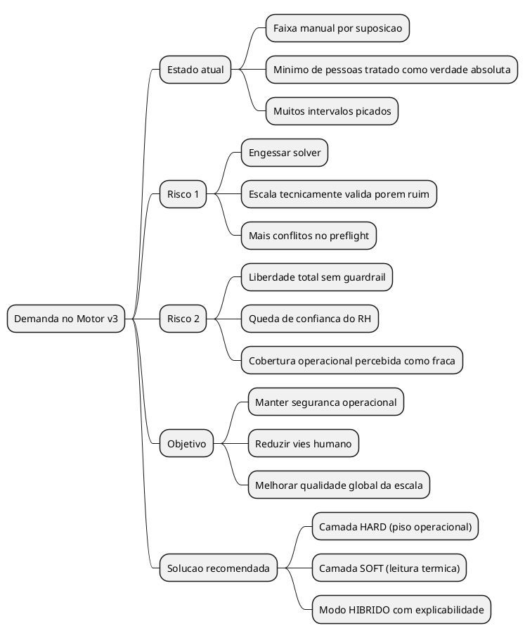
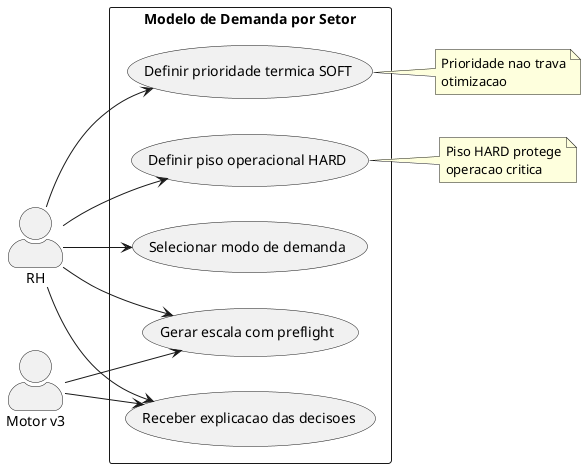
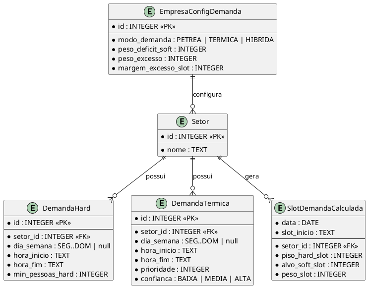
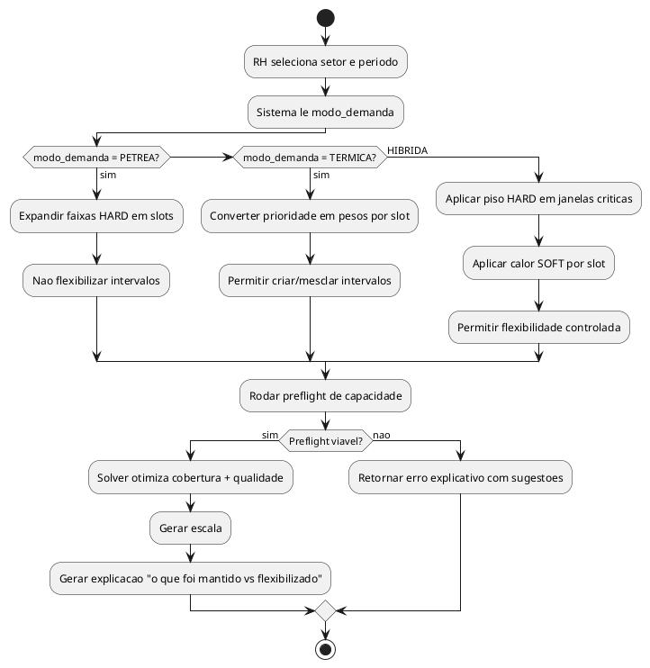

# LOGICA - Demanda do Motor v3 (Petrea vs Termica vs Hibrida)

> Data: 2026-02-18
> Modo: ANALYST (destilacao de logica)
> Objetivo: transformar intuicao humana de demanda em modelo executavel sem engessar o motor.

---

## TL;DR EXECUTIVO

Hoje a demanda por faixa (`07:00-10:00 = 3 pessoas`) mistura necessidade real com suposicao humana.
Se tudo vira regra petrea, o motor perde liberdade e gera escala pior.
Se tudo vira liberdade, o motor pode tomar decisoes que o RH considera arriscadas.

A solucao mais robusta e **Modelo Hibrido**:
- Camada HARD: piso operacional minimo em janelas criticas.
- Camada SOFT: leitura termica de prioridade por slot.
- Solver com liberdade controlada para ajustar blocos e horarios.

---

## Briefing Destilado

### O que tu quer que aconteca no final

Tu quer que o motor:
1. Nao seja escravo da ignorancia enviesada do humano.
2. Nao vire uma caixa-preta doida que ignora operacao real.
3. Encontre escala melhor que a manual, sem perder seguranca de cobertura.

### Quem usa isso

- RH / Gestora operacional de setor (nao tecnica).
- Motor v3 como decisor de alocacao.

### Input -> Output

- **Input atual:** faixas manuais com `min_pessoas`.
- **Output desejado:** escala otimizada que respeita leis + cobertura real + qualidade operacional.

### Escopo

Faz parte:
- Modelagem de demanda do setor.
- Como o motor interpreta demanda manual.
- Como evitar que intervalos picados sabotem o solver.

Nao faz parte:
- Alterar regras legais HARD (CLT/CCT).
- Resolver forecast estatistico com dados externos (sem telemetria historica neste passo).

---

## O Problema Real (explicado com exemplos)

O problema nao e "falta de campo na UI". O problema e de **epistemologia da demanda**:
quem define a demanda (humano) nem sempre sabe a demanda real.

### Exemplo 1: Rigidez por achismo

```
Setor Acougue
07:00-10:00 = 3 (fixo)
10:00-12:00 = 2
12:00-15:00 = 2
15:00-17:00 = 3 (fixo)
```

Se esses "3" forem achismo, o preflight pode declarar impossivel ou forcar distribuicao ruim.
O motor deixa de otimizar o todo porque ficou preso em blocos humanos possivelmente errados.

### Exemplo 2: Liberdade total sem guardrail

Sem piso minimo, o motor pode priorizar slots de pico e deixar abertura com cobertura insuficiente
na percepcao operacional do RH ("na pratica nao da pra abrir com 1 so").

### Exemplo 3: Picado manual contra o solver

Quanto mais faixas pequenas e duras, menor o espaco de busca util.
Resultado comum:
- mais conflito com folga/descanso/interjornada;
- mais alocacao artificial;
- mais ajuste manual pos-geracao.

---

## Visao Geral (Mind Map)



---

## Use Case (Quem faz o que)



---

## Elementos do Sistema (ER)



---

## Fluxo Principal (Activity)



---

## Maquina: Regra Fixa vs Dado Mutavel

### Regras fixas (maquina)

- Regras legais HARD (CLT/CCT) continuam imutaveis.
- Grid de 30 min continua fixo.
- Preflight continua obrigatorio.
- Se modo tiver piso HARD, deficit de piso HARD nao pode passar.

### Dados mutaveis (combustivel)

- Faixas de demanda criadas pelo RH.
- Prioridade termica por horario.
- Confianca da entrada humana (baixa/media/alta).
- Modo de demanda por setor (petrea/termica/hibrida).

---

## As 3 Formas (pedido respondido)

## 1) Modo PETREO (tudo hard)

Como funciona:
- `min_pessoas` vira restricao dura em todas as faixas.
- Motor nao cria novos intervalos nem flexibiliza bordas.

Quando serve:
- Operacao muito sensivel, baixa tolerancia a experimento.

Riscos:
- Congela vies humano.
- Eleva chance de "impossivel".
- Piora otimizacao global.

## 2) Modo TERMICO (quase tudo soft)

Como funciona:
- RH informa prioridade por horario (calor), nao minima dura.
- Motor decide quantas pessoas por slot dentro da capacidade.

Quando serve:
- Time quer maximizar eficiencia e aceita variacao operacional.

Riscos:
- Pode cair confianca do RH no inicio.
- Sem piso minimo, abertura/fechamento podem parecer subcobertos.

## 3) Modo HIBRIDO (recomendado)

Como funciona:
- RH define **poucos pisos HARD** (janelas criticas).
- RH define **prioridade termica SOFT** para o resto.
- Motor pode criar/mesclar blocos para otimizar.

Quando serve:
- Quase sempre. Equilibra seguranca operacional com inteligencia do solver.

---

## Regras de Negocio (formato executavel)

REGRAS DE NEGOCIO - MODELO DE DEMANDA V3

- ✅ PODE: RH definir piso HARD em janelas criticas.
- ✅ PODE: RH definir prioridade termica por faixa.
- ✅ PODE: Motor ajustar inicio/fim de blocos dentro do grid para otimizar.
- ❌ NAO PODE: Motor violar piso HARD em slot derivado.
- ❌ NAO PODE: RH transformar toda suposicao em regra dura sem impacto no preflight.

- 🔄 SEMPRE: Preflight explica conflito de capacidade antes de gerar.
- 🔄 SEMPRE: Motor retorna explicacao do que flexibilizou.
- 🚫 NUNCA: Regra legal HARD virar soft.
- 🚫 NUNCA: Escala final esconder deficit de cobertura.

- 🔀 SE modo = PETREA ENTAO toda faixa vira piso duro.
- 🔀 SE modo = TERMICA ENTAO faixa vira peso de prioridade.
- 🔀 SE modo = HIBRIDA ENTAO piso duro + calor soft convivem.

CALCULOS:

- `deficit_hard_slot = max(0, piso_hard_slot - alocados_slot)`
- `deficit_soft_slot = max(0, alvo_soft_slot - alocados_slot)`
- `excesso_slot = max(0, alocados_slot - alvo_soft_slot - margem_excesso_slot)`

- `penalidade_slot = (W1 * deficit_hard_slot) + (W2 * deficit_soft_slot) + (W3 * excesso_slot)`

Regra de severidade:
- Se `deficit_hard_slot > 0` -> falha de viabilidade (erro/preflight ou backtrack).
- Se apenas `deficit_soft_slot > 0` -> queda de score, nao bloqueia.

---

## Jornada do RH (experiencia)

1. RH entra no setor e escolhe modo de demanda.
2. RH define pisos HARD minimos (poucos, so criticos).
3. RH desenha prioridade termica da operacao.
4. RH clica gerar.
5. Sistema mostra escala + explicacao:
   - "Pisos HARD mantidos: 100%"
   - "Ajustes de otimização aplicados em 4 janelas"
   - "Deficits SOFT residuais: 2 slots"

---

## Casos Praticos

### Caso 1 - Vies humano alto

- Antes: RH trava `07-10=3` e `15-17=3` por habito antigo.
- Acao: Modo HIBRIDO com piso `>=2` nessas janelas e prioridade alta.
- Resultado: motor mantem seguranca e redistribui melhor sem quebrar tudo.

### Caso 2 - Operacao critica de abertura

- Antes: modo termico puro subestima abertura.
- Acao: piso HARD obrigatorio na abertura + termico no restante.
- Resultado: confianca operacional preservada.

### Caso 3 - Setor com excesso de picados

- Antes: 9 faixas pequenas e conflitantes.
- Acao: reduzir para 3 pisos criticos + curva termica.
- Resultado: solver ganha liberdade, menos conflito no preflight.

---

## Proposta Recomendada (objetiva)

SOLUCAO RECOMENDADA: **Modo HIBRIDO como default**

Parametros iniciais:
1. Piso HARD obrigatorio apenas para:
   - abertura do setor,
   - janelas de risco operacional,
   - fechamento (quando aplicavel).
2. Restante da demanda em prioridade termica.
3. Limite de complexidade de entrada:
   - max 3 janelas HARD por dia por setor.
4. Explicabilidade obrigatoria no output da escala.

---

## Decisoes que precisam fechar agora

1. Quais janelas sao "criticas" por setor para piso HARD obrigatorio?
2. Escala de prioridade termica: 1-5 ou 0-100?
3. Qual default de modo no onboarding: PETREA legado ou HIBRIDA direto?
4. Qual limite maximo de blocos manuais por dia para evitar picado inutil?

---

## Disclaimers Criticos

- Sem telemetria real (venda/fluxo/fila), "demanda" continua sendo inferencia humana.
- Modelo termico melhora, mas nao adivinha mundo real sozinho.
- Se explicabilidade nao existir, RH perde confianca no motor.
- Se piso HARD for usado em excesso, sistema volta a ser "manual com maquiagem".

---

## Validacao Final

- A logica fecha? **Sim**: separa restricao dura de preferencia.
- Executavel por time tecnico? **Sim**: regras, entidades e fluxo estao formalizados.
- Entendivel por negocio? **Sim**: 3 modos claros com trade-offs diretos.

