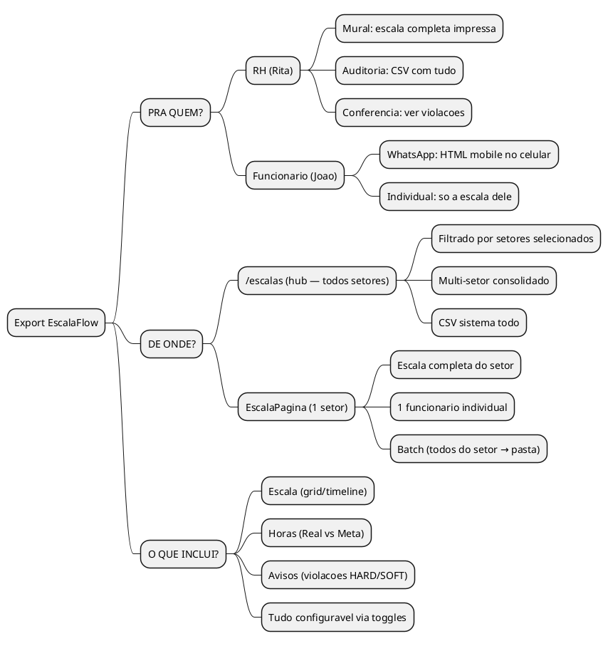
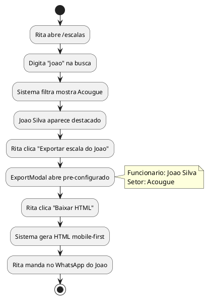
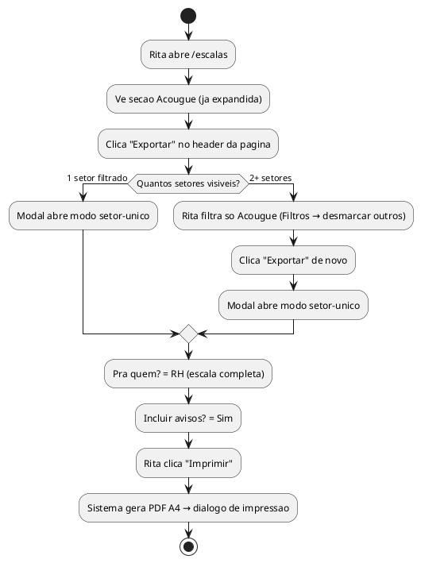
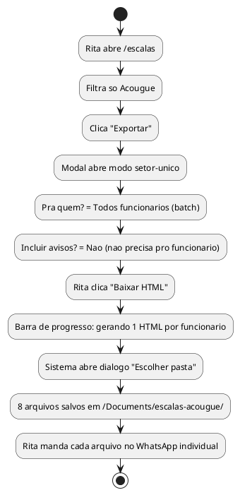
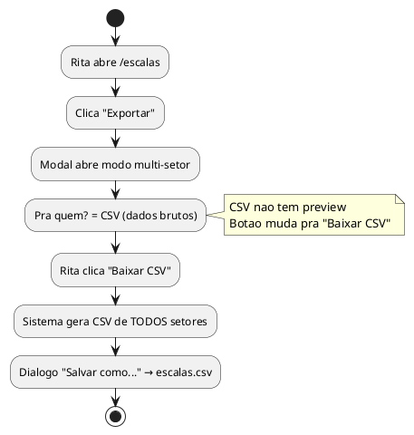
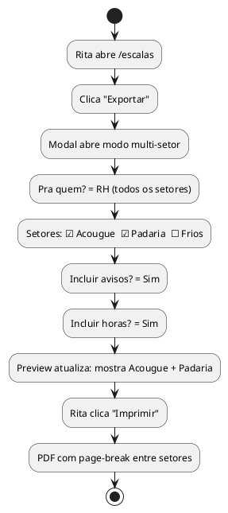
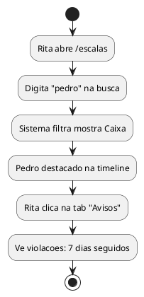
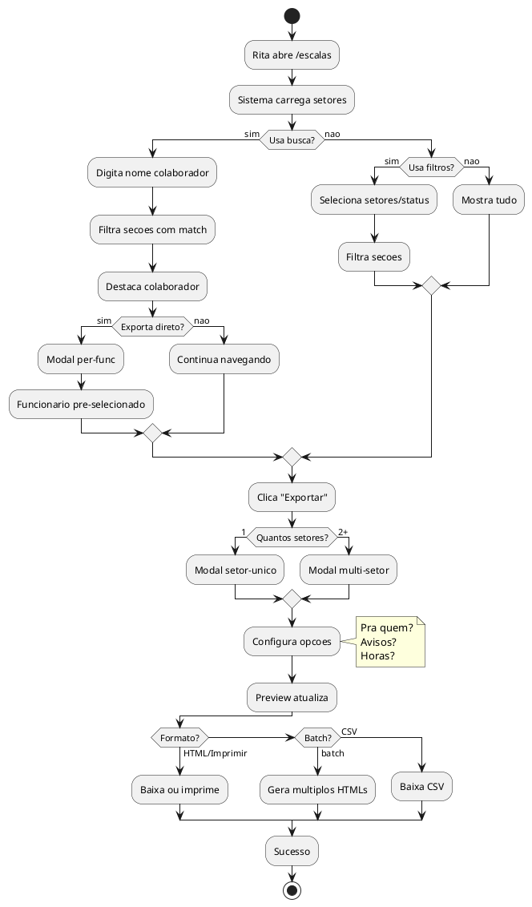

# FLUXO DE EXPORTACAO — EscalaFlow v2

> **Data:** 2026-02-16
> **Contexto:** O WARLOG desenhou o export com filtros, multi-select, busca. A implementacao
> entregou a MECANICA (IPC handlers, captura HTML, modal split-screen) mas sem o CEREBRO
> (filtros, selecao, busca por colaborador). Este documento corrige isso.
>
> **Principio:** A Rita nao pensa em "formatos de export". Ela pensa em PERGUNTAS:
> "Onde ta a escala do Joao?", "Manda pro pessoal do Acougue", "Imprime pro mural".
> O sistema tem que responder a PERGUNTAS, nao oferecer menus tecnicos.

---

## 1. VISAO GERAL — Os 7 cenarios reais



---

## 2. O QUE FALTA (Gap Analysis)

### Na pagina /escalas (Hub)

| Item | WARLOG | Implementado | Status |
|------|--------|-------------|--------|
| Filtro por setor (multi-select) | D8 | Nao | ❌ FALTA |
| Filtro por status (Oficial/Rascunho/Todos) | D8 | Nao | ❌ FALTA |
| Busca por colaborador (nome) | Implicito | Nao | ❌ FALTA |
| Multi-select setores no export | Wireframe hub | Nao | ❌ FALTA |
| Export HTML multi-setor filtrado | E6 | Export tudo ou nada | ❌ PARCIAL |
| Export CSV | E4 | Funciona | ✅ OK |
| Export batch de 1 setor desde hub | E6 | Nao | ❌ FALTA |
| Export per-func desde hub | E1 | Nao (so na EscalaPagina) | ❌ FALTA |

### No ExportModal

| Item | WARLOG | Implementado | Status |
|------|--------|-------------|--------|
| Split-screen preview + opcoes | X1 | Sim | ✅ OK |
| RadioGroup formato | X4/X5 | Sim | ✅ OK |
| Toggle avisos/horas | X7 | Sim | ✅ OK |
| Select funcionario | X6 | Sim (so context=escala) | ⚠️ PARCIAL |
| Select setores (hub) | Wireframe | Nao | ❌ FALTA |
| Batch com progress | X10 | Sim | ✅ OK |
| PDF via printToPDF | X9 | Sim | ✅ OK |

### Resumo

```
MECANICA (ja funciona):        CEREBRO (falta):
─────────────────────          ────────────────
✅ 4 IPC handlers export       ❌ Filtro por setor no hub
✅ captureExportHTML            ❌ Filtro por status
✅ gerarCSV                     ❌ Busca por colaborador
✅ gerarHTMLFuncionario         ❌ Multi-select setores no export
✅ ExportModal split-screen     ❌ Export per-func desde hub
✅ ExportPreview                ❌ Export batch de 1 setor desde hub
✅ useExportController          ❌ Opcoes de formato completas no hub
✅ Progress bar batch
```

---

## 3. FLUXO REDESENHADO — Pagina /escalas

### 3.1 Header com filtros

```
╔══════════════════════════════════════════════════════════════════════╗
║  Escalas                                                            ║
║  Visualize e exporte escalas de todos os setores                    ║
║                                                                      ║
║  [🔍 Buscar colaborador...]  [Filtros ▾]  [Grid|Timeline] [Exportar]║
╚══════════════════════════════════════════════════════════════════════╝

BUSCA:
  Input com debounce 300ms
  Busca por nome do colaborador em TODAS as escalas carregadas
  Ao digitar, filtra as secoes: so mostra setores que tem match
  Highlight no colaborador encontrado dentro da grid/timeline

FILTROS (Popover):
  ┌─────────────────────────────┐
  │ Setores                     │
  │ ☑ Acougue                   │
  │ ☑ Caixa                     │
  │ ☑ Padaria                   │
  │ ☐ Frios (sem escala)        │
  │                             │
  │ Status                      │
  │ ◉ Todos                     │
  │ ○ Oficial                   │
  │ ○ Rascunho                  │
  │                             │
  │ [Limpar filtros]            │
  └─────────────────────────────┘

  Filtros afetam:
  1. Quais secoes aparecem na pagina
  2. O que o Export pega (exporta o FILTRADO)
```

### 3.2 Botao Exportar — Inteligente

O botao "Exportar" no hub precisa saber o CONTEXTO:

```
SE 0 setores filtrados com escala:
  → Botao desabilitado

SE 1 setor filtrado:
  → Abre ExportModal com context='setor-unico'
  → Mostra TODAS as opcoes (Completa RH, Per-Func, Batch, CSV)
  → Identico ao export da EscalaPagina, mas sem sair do hub

SE 2+ setores filtrados:
  → Abre ExportModal com context='multi-setor'
  → Opcoes: HTML multi-setor, CSV, Batch multi-setor
  → Multi-select de setores (pre-selecionados pelo filtro)
```

---

## 4. FLUXO REDESENHADO — ExportModal (unificado)

### 4.1 Modos do modal

O ExportModal precisa de **4 modos**, nao 2:

```
MODO              CONTEXTO              FORMATOS DISPONIVEIS
───────────────   ──────────────────    ────────────────────────────────
setor-unico       EscalaPagina OU       • Completa (RH) — grid/timeline
                  hub com 1 setor       • Por Funcionario — mobile-first
                                        • Batch (todos → pasta)

multi-setor       Hub com 2+ setores    • Multi-setor consolidado (HTML)
                                        • Batch multi-setor (todos func de todos setores → pasta)

csv               Qualquer              • CSV alocacoes + violacoes

per-func          Atalho direto         • Selecionar funcionario → HTML mobile
                  (busca ou click)
```

### 4.2 Wireframe — Modo setor-unico (igual WARLOG original)

```
╔══════════════════════════════════════════════════════════════════════╗
║  Exportar — Acougue (15/02-28/02)                            [X]    ║
╠═══════════════════════════════════════╤══════════════════════════════╣
║                                       │                              ║
║   PREVIEW                             │  Pra quem?                   ║
║   ┌───────────────────────────┐      │  ◉ RH (escala completa)      ║
║   │                           │      │  ○ Funcionario (individual)   ║
║   │  [escala renderizada      │      │  ○ Todos funcionarios (batch) ║
║   │   em miniatura]           │      │                              ║
║   │                           │      │  ── se "Funcionario" ──      ║
║   └───────────────────────────┘      │  Quem? [Select: Joao ▾]     ║
║                                       │                              ║
║                                       │  Incluir                     ║
║                                       │  [✓] Avisos                  ║
║                                       │  [✓] Horas (Real vs Meta)   ║
║                                       │                              ║
╠═══════════════════════════════════════╧══════════════════════════════╣
║                     [Cancelar]     [Baixar HTML]     [Imprimir]      ║
╚══════════════════════════════════════════════════════════════════════╝
```

**Mudanca chave vs implementacao atual:**
- Label "Pra quem?" no lugar de "Formato" (linguagem da Rita)
- "RH (escala completa)" no lugar de "Escala Completa (RH)"
- "Funcionario (individual)" no lugar de "Por Funcionario"
- "Todos funcionarios (batch)" — mais claro

### 4.3 Wireframe — Modo multi-setor (hub com 2+ setores)

```
╔══════════════════════════════════════════════════════════════════════╗
║  Exportar Escalas                                            [X]    ║
╠═══════════════════════════════════════╤══════════════════════════════╣
║                                       │                              ║
║   PREVIEW                             │  Pra quem?                   ║
║   ┌───────────────────────────┐      │  ◉ RH (todos os setores)     ║
║   │  ┌── Acougue ─────────┐  │      │  ○ Funcionarios (batch geral) ║
║   │  │  [grid miniatura]   │  │      │  ○ CSV (dados brutos)        ║
║   │  └────────────────────┘  │      │                              ║
║   │  ┌── Padaria ─────────┐  │      │  Setores                     ║
║   │  │  [grid miniatura]   │  │      │  ☑ Acougue                   ║
║   │  └────────────────────┘  │      │  ☑ Padaria                   ║
║   └───────────────────────────┘      │  ☐ Frios                     ║
║                                       │  [Todos] [Nenhum]           ║
║                                       │                              ║
║                                       │  Incluir                     ║
║                                       │  [✓] Avisos                  ║
║                                       │  [✓] Horas (Real vs Meta)   ║
║                                       │                              ║
╠═══════════════════════════════════════╧══════════════════════════════╣
║                     [Cancelar]     [Baixar HTML]     [Imprimir]      ║
╚══════════════════════════════════════════════════════════════════════╝
```

**Mudancas vs implementacao atual:**
- Checkbox de setores (multi-select)
- "Funcionarios (batch geral)" gera 1 HTML por func de TODOS setores selecionados
- Preview mostra APENAS os setores marcados
- [Todos] [Nenhum] pra facilitar

### 4.4 Wireframe — Busca por colaborador (atalho direto)

```
╔══════════════════════════════════════════════════════════════════════╗
║  Escalas                                                            ║
║  [🔍 Buscar colaborador...]  [Filtros ▾]  [Grid|Timeline] [Exportar]║
╠══════════════════════════════════════════════════════════════════════╣
║                                                                      ║
║  Busca: "joao"                                                       ║
║                                                                      ║
║  ┌─────────────────────────────────────────────────────────────────┐ ║
║  │ [▼] Acougue    15/02-28/02  [89]  ⚠2                           │ ║
║  │  [Escala]  [Horas]  [Avisos(2)]                                 │ ║
║  │                                                                 │ ║
║  │  >> Joao Silva << (highlighted)   [████████████]                │ ║
║  │     08:00 ──── 13:00                                            │ ║
║  │  Maria Santos            [████████████]                         │ ║
║  │     11:00 ──── 17:00                                            │ ║
║  │                                                                 │ ║
║  │  [📤 Exportar escala do Joao]  ← botao contextual               │ ║
║  └─────────────────────────────────────────────────────────────────┘ ║
║                                                                      ║
║  Caixa, Padaria, Frios → OCULTOS (nao tem "joao")                  ║
║                                                                      ║
╚══════════════════════════════════════════════════════════════════════╝

COMPORTAMENTO DA BUSCA:
  1. Input com debounce 300ms
  2. Busca case-insensitive no nome do colaborador
  3. Filtra secoes: so mostra setores onde tem match
  4. Destaca o colaborador encontrado (bg-yellow ou ring)
  5. Mostra botao contextual "Exportar escala do [Nome]"
  6. Clicar no botao → abre ExportModal pre-configurado:
     - Modo: per-func
     - Funcionario: pre-selecionado
     - Setor: inferido do match
```

---

## 5. JORNADA DO USUARIO — Cenarios completos

### Cenario 1: "Preciso mandar a escala pro Joao no WhatsApp"



**Clicks: 4** (busca → exportar → baixar → mandar)

### Cenario 2: "Imprime a escala do Acougue pro mural"



**Clicks: 3-4** (filtrar → exportar → configurar → imprimir)

### Cenario 3: "Manda a escala de todo mundo do Acougue no WhatsApp"



**Clicks: 5** (filtrar → exportar → batch → pasta → mandar)

### Cenario 4: "Quero os dados de tudo pra auditoria"



**Clicks: 3** (exportar → csv → salvar)

### Cenario 5: "Quero imprimir Acougue e Padaria juntos, sem Frios"



**Clicks: 4** (exportar → configurar setores → configurar opcoes → imprimir)

### Cenario 6: "Onde ta o Pedro? Quero ver se ele tem problema"



**Clicks: 2** (busca → avisos)

---

## 6. REGRAS DE NEGOCIO

```
PODE/NAO PODE:
- ✅ PODE: Exportar qualquer combinacao de setores
- ✅ PODE: Exportar 1 funcionario especifico de qualquer setor
- ✅ PODE: Exportar batch de 1 setor OU de todos setores filtrados
- ✅ PODE: Incluir ou excluir avisos e horas em qualquer formato
- ❌ NAO PODE: Exportar setor SEM escala (botao desabilitado)
- ❌ NAO PODE: Exportar funcionario inativo

SEMPRE/NUNCA:
- 🔄 SEMPRE: Export pega o que esta FILTRADO (nao tudo)
- 🔄 SEMPRE: Busca filtra setores automaticamente (oculta sem match)
- 🔄 SEMPRE: Preview atualiza quando opcoes mudam
- 🚫 NUNCA: Modal abre vazio (sempre pre-configura baseado no contexto)
- 🚫 NUNCA: CSV inclui setores sem escala (pula silenciosamente)

CONDICIONAIS:
- 🔀 SE 1 setor filtrado ENTAO modal = modo setor-unico (todas opcoes)
- 🔀 SE 2+ setores ENTAO modal = modo multi-setor (checkbox setores)
- 🔀 SE busca ativa e 1 match ENTAO botao "Exportar escala de [Nome]" aparece
- 🔀 SE formato = CSV ENTAO preview desaparece, botao = "Baixar CSV"
- 🔀 SE formato = batch ENTAO botao = "Baixar Todos", progress bar aparece
- 🔀 SE formato = per-func ENTAO Select funcionario aparece
```

---

## 7. MUDANCAS NECESSARIAS

### 7.1 EscalasHub.tsx — Adicionar filtros e busca

```
NOVO STATE:
  searchQuery: string (debounced 300ms)
  filtroSetores: Set<number> (IDs dos setores selecionados, default = todos)
  filtroStatus: 'todos' | 'OFICIAL' | 'RASCUNHO' (default = todos)

NOVO NO HEADER:
  <Input placeholder="Buscar colaborador..." />
  <Popover> filtros (checkboxes setores + radio status) </Popover>

LOGICA DE FILTRO:
  1. Aplicar filtroSetores (ocultar secoes desmarcadas)
  2. Aplicar filtroStatus (ocultar secoes que nao batem)
  3. Aplicar searchQuery:
     a. Para cada secao com escala carregada, buscar nos colaboradores
     b. Se match → manter secao, destacar colaborador
     c. Se no match → ocultar secao
     d. Se escala nao carregada → expandir e buscar (lazy)

BOTAO EXPORTAR:
  onClick:
    const setoresFiltrados = setoresComEscala.filter(aplicarFiltros)
    if (setoresFiltrados.length === 0) return // desabilitado
    if (setoresFiltrados.length === 1) setExportMode('setor-unico')
    else setExportMode('multi-setor')
    setExportOpen(true)
```

### 7.2 ExportModal.tsx — Expandir pra 4 modos

```
PROPS NOVAS:
  mode: 'setor-unico' | 'multi-setor' | 'csv' | 'per-func'
  setores?: { id: number; nome: string; checked: boolean }[]  // pra multi-setor
  onSetoresChange?: (setores: ...) => void
  searchMatch?: { colaboradorId: number; setorId: number }  // pra per-func direto

OPCOES POR MODO:

  setor-unico:
    Pra quem?
      ◉ RH (escala completa)
      ○ Funcionario (individual)
      ○ Todos funcionarios (batch)
    [Select funcionario] (se individual)
    [✓] Incluir avisos
    [✓] Incluir horas

  multi-setor:
    Pra quem?
      ◉ RH (todos os setores)
      ○ Funcionarios (batch geral)
      ○ CSV (dados brutos)
    Setores:
      ☑/☐ cada setor  [Todos] [Nenhum]
    [✓] Incluir avisos
    [✓] Incluir horas

  per-func (atalho da busca):
    Funcionario: [Nome] (pre-selecionado, read-only)
    Setor: [Nome] (pre-selecionado, read-only)
    [✓] Incluir avisos
    [✓] Incluir horas
```

### 7.3 SetorEscalaSection.tsx — Suportar highlight de busca

```
PROP NOVA:
  searchHighlight?: string  // nome do colaborador pra destacar

COMPORTAMENTO:
  Se searchHighlight passado:
    1. Auto-expandir secao
    2. Na grid/timeline, aplicar bg-yellow-100/20 no row do colaborador
    3. Mostrar botao inline "Exportar escala de [Nome]"
```

### 7.4 Componentes novos

```
NENHUM COMPONENTE NOVO. Tudo e refatoracao dos existentes:

  ExportModal.tsx    → expandir de 2 modos pra 4, adicionar checkbox setores
  EscalasHub.tsx     → adicionar Input busca + Popover filtros + logica de filtro
  SetorEscalaSection → adicionar prop searchHighlight
  useExportController → adicionar logica per-func desde hub + multi-setor filtrado

  Componentes shadcn necessarios (JA INSTALADOS):
    Input, Popover, PopoverTrigger, PopoverContent, Checkbox, RadioGroup, Select, Switch

  Unico shadcn que PODE faltar:
    Checkbox → verificar se esta instalado
```

---

## 8. ORDEM DE IMPLEMENTACAO

```
FASE A — Filtros no Hub (3 itens)
  A1. State + UI: Input busca + Popover filtros no header
  A2. Logica de filtro: filtrar secoes por setor/status/busca
  A3. Highlight de busca: auto-expand + destaque do colaborador

FASE B — ExportModal inteligente (3 itens)
  B1. Modo setor-unico: detectar quando 1 setor filtrado, abrir com todas opcoes
  B2. Modo multi-setor: checkbox de setores + "batch geral"
  B3. Modo per-func (atalho): botao contextual na busca → modal pre-configurado

FASE C — Conectar export ao filtro (2 itens)
  C1. Export HTML multi-setor pega APENAS setores selecionados no modal
  C2. Export batch multi-setor gera HTML por func de todos setores selecionados

QG — Quality Gate
  • tsc 0 erros
  • Build OK
  • Motor 10/10 PASS
  • Testar: busca → encontra → exporta → HTML correto
  • Testar: filtro 1 setor → export → so esse setor
  • Testar: multi-setor → desmarca 1 → export → sem ele
  • Testar: batch 1 setor → gera N arquivos
  • Testar: CSV → todos setores → arquivo correto
```

---

## 9. FLUXO PRINCIPAL (Activity Diagram)



---

## 10. DISCLAIMERS CRITICOS

```
🚨 BUSCA SO FUNCIONA COM ESCALAS CARREGADAS
   A busca client-side so encontra colaboradores em secoes que ja foram
   lazy-loaded (expandidas). Secoes fechadas nao tem dados de colaboradores.
   SOLUCAO: Ao buscar, o sistema expande TODAS as secoes pra garantir busca completa.
   Ou: criar IPC handler "colaboradores.buscarNome(query)" que retorna setor_id direto.
   RECOMENDACAO: IPC handler e melhor (nao precisa carregar tudo na memoria).

🚨 MULTI-SELECT SETORES AFETA O QUE EXPORTA
   Se Rita desmarca "Frios" e clica "Exportar", o HTML/CSV NAO inclui Frios.
   Mas se ela voltar e marcar "Frios", o proximo export inclui.
   A regra e: EXPORTA O QUE ESTA VISIVEL/SELECIONADO, nunca mais.

🚨 PER-FUNC DESDE HUB PRECISA DE DADOS CARREGADOS
   Pra gerar HTML mobile-first de 1 funcionario, precisa das alocacoes dele.
   Se a secao nao foi expandida, precisamos buscar sob demanda.
   SOLUCAO: useExportController faz escalas.buscar() se necessario antes de gerar.

🚨 PREVIEW DO MULTI-SETOR PODE SER PESADO
   Se todos os 5+ setores estao selecionados, o preview renderiza TODOS em miniatura.
   Pode travar em PCs lentos.
   SOLUCAO: Limitar preview a 2-3 setores + "...e mais N setores".
```

---

## 11. DECISAO ARQUITETURAL: BUSCA

```
OPCAO A: Busca client-side (mais simples)
  - Busca nos dados ja carregados (setoresComEscala + colaboradores de secoes expandidas)
  - Problema: secoes fechadas nao tem dados
  - Fix: ao buscar, expand all (carrega tudo)
  - Risco: lento se muitos setores

OPCAO B: IPC handler dedicado (mais robusto)
  - Novo handler: colaboradores.buscarPorNome(query) → { colaborador, setor_id, escala_id }[]
  - Busca no banco direto, rapido
  - Hub recebe resultado, expande so a secao certa
  - Mais trabalho (novo handler + logica)

RECOMENDACAO: OPCAO A primeiro (simples, funciona pro caso do supermercado — 3-5 setores).
Se precisar escalar pra muitos setores → migrar pra OPCAO B.
Justificativa: Supermercado Fernandes tem ~5 setores, ~30 colaboradores. Expand all e trivial.
```
