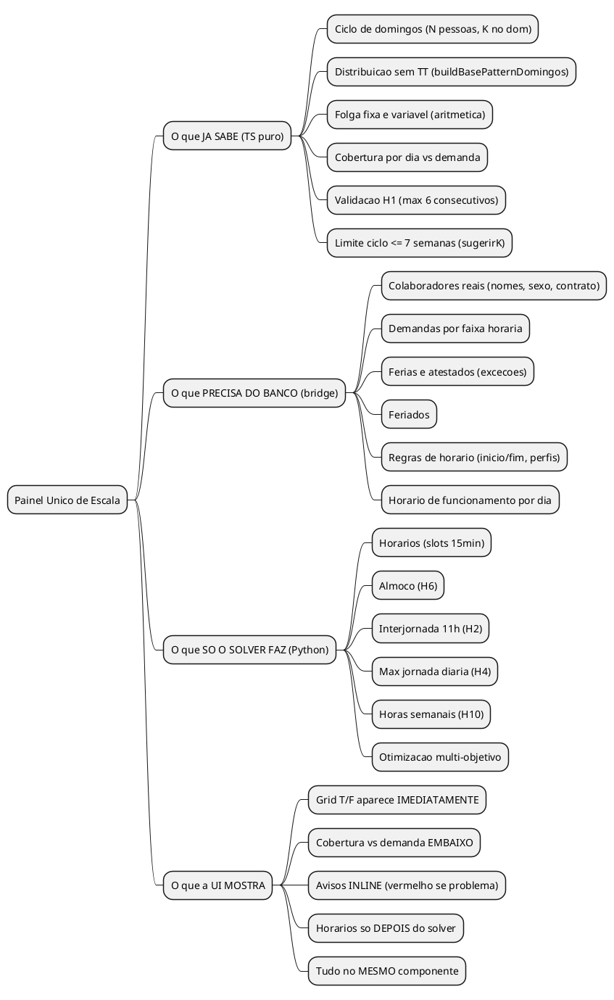
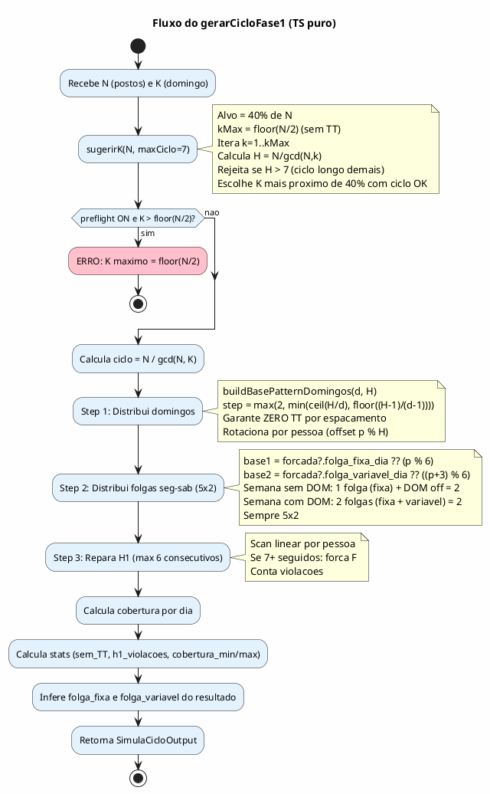
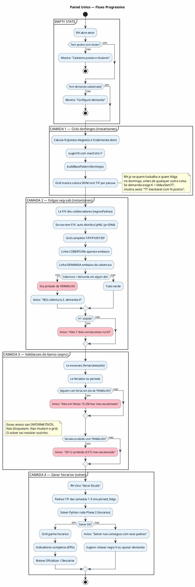
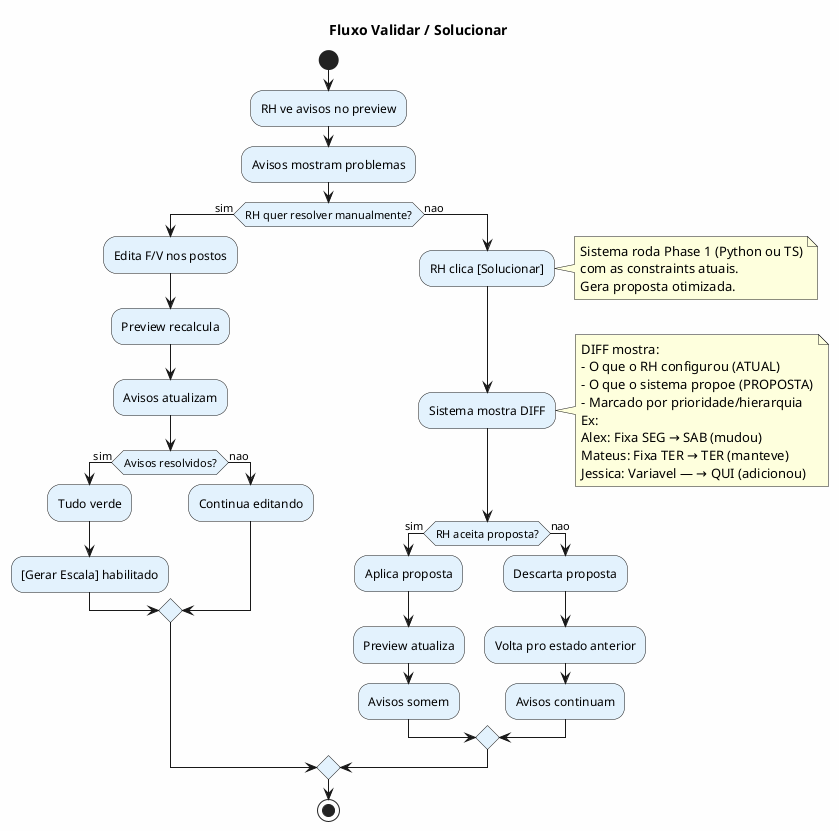
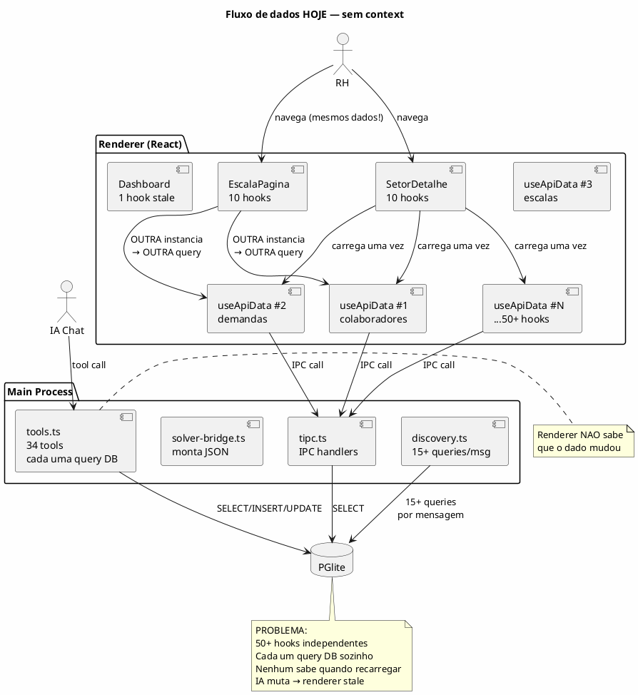

# ANALYST — Painel Unico de Escala (Unificacao TS + Bridge + Solver)

> Destilacao a partir de sessao de debate Marco x Monday (2026-03-14 02h-12h)
> Consolida: todas as perguntas, respostas, insights e fluxos descobertos.
> Status: SPEC EM CONSTRUCAO — Marco ainda nao terminou a surra

---

## TL;DR EXECUTIVO

O sistema hoje tem 3 motores separados que fazem coisas relacionadas mas nao se falam:
1. **Brinquedo** (Dashboard) — TS puro, gera T/F rapido
2. **Preview Setor** — mesmo TS, mas com dados reais
3. **Solver** (Gerar Escala) — Python OR-Tools, gera horarios completos

A visao do Marco: **nao sao 3 coisas. E 1 fluxo progressivo.** O painel de escala
deveria ser UM componente que mostra camadas empilhadas conforme os dados ficam
disponiveis. Sem fases. Sem botoes de "calcular fase 1". Tudo reativo e simultaneo.

---

## 1. VISAO GERAL



---

## 2. O INSIGHT CENTRAL

### Antes (3 dominios separados)

```
BRINQUEDO (Dashboard)          PREVIEW (Setor)           SOLVER (Python)
┌─────────────────┐      ┌─────────────────┐      ┌─────────────────┐
│ gerarCicloFase1 │      │ gerarCicloFase1 │      │ buildSolverInput│
│ N, K manual     │      │ N, K do setor   │      │ Le 11 tabelas   │
│ Sem banco       │      │ Le regrasPadrao │      │ Monta JSON      │
│ Sem horarios    │      │ Sem horarios    │      │ Spawna Python   │
│ Grid T/F        │      │ Grid T/F        │      │ Escala completa │
└─────────────────┘      └─────────────────┘      └─────────────────┘
      SEPARADOS                SEPARADOS                SEPARADO
```

### Depois (1 fluxo progressivo)

```
┌──────────────────────────────────────────────────────────────────┐
│                    PAINEL UNICO DE ESCALA                         │
│                                                                   │
│  CAMADA 1: Ciclo domingos                                        │
│  ├── Input: N (postos), K (demanda dom), regra TT                │
│  ├── Calculo: TS puro (sugerirK + buildBasePatternDomingos)      │
│  ├── Output: padrao de domingos T/F por pessoa                   │
│  └── Validacao: TT, ciclo <= 7 semanas                           │
│       ↓ aparece no grid imediatamente                            │
│                                                                   │
│  CAMADA 2: Folgas seg-sab                                        │
│  ├── Input: folga_fixa + folga_variavel por pessoa               │
│  ├── Calculo: TS puro (Step 2 do gerarCicloFase1)               │
│  ├── Output: grid completo T/FF/FV/DT/DF                        │
│  └── Validacao: H1, cobertura vs demanda real                    │
│       ↓ grid atualiza, cobertura aparece embaixo                 │
│                                                                   │
│  CAMADA 3: Validacoes do bridge                                  │
│  ├── Input: dados reais do banco (excecoes, feriados, horarios)  │
│  ├── Calculo: TS (mesma logica do bridge, sem Python)            │
│  ├── Output: avisos de conflito                                   │
│  └── Validacao: ferias em cima de trabalho, feriado proibido,    │
│                  horas semanais estimadas vs contrato             │
│       ↓ avisos aparecem inline (nao bloqueiam, informam)         │
│                                                                   │
│  CAMADA 4: Horarios (solver)                                     │
│  ├── Input: padrao T/F das camadas 1-3 como pinned_folga         │
│  ├── Calculo: Python OR-Tools (Phase 2 ONLY)                    │
│  ├── Output: horarios completos por pessoa por dia               │
│  └── Validacao: H2, H4, H6, H10-H18, antipatterns              │
│       ↓ grid ganha coluna de horarios, indicadores aparecem     │
│                                                                   │
│  [Oficializar]                                                    │
└──────────────────────────────────────────────────────────────────┘
```

---

## 3. O QUE O TS JA SABE FAZER (sem solver)

### Fluxo detalhado do gerarCicloFase1



### O que o TS sabe validar SEM solver

| Validacao | Calculavel pelo TS? | Como |
|-----------|---------------------|------|
| TT (2 domingos seguidos) | SIM | Scan de domingos por pessoa |
| H1 (max 6 consecutivos) | SIM | Scan linear |
| Ciclo > 7 semanas | SIM | N/gcd(N,K) > 7 |
| Cobertura < demanda por dia | SIM | Count por coluna vs demanda |
| Folga fixa == folga variavel | SIM | Comparacao direta |
| 2+ pessoas com mesma folga fixa causando cobertura 0 | SIM | Count por dia |
| K > floor(N/2) impossivel sem TT | SIM | Aritmetica |
| Intermitente no calculo de N | SIM | Filtro por tipo_trabalhador |
| Folga fixa = DOM (bloqueado no preview) | SIM | Check direto |

### O que o TS NAO sabe (precisa do banco ou solver)

| Validacao | Por que nao? | Quem resolve |
|-----------|-------------|--------------|
| Ferias em cima de trabalho | Precisa ler excecoes do banco | Bridge (banco) |
| Feriado proibido trabalhar | Precisa ler feriados do banco | Bridge (banco) |
| Horas semanais vs contrato CLT | Precisa de hora_inicio/fim + contrato | Bridge (banco) |
| Interjornada 11h (H2) | Precisa de horarios reais | Solver (Python) |
| Almoco (H6) | Precisa de horarios reais | Solver (Python) |
| Max jornada diaria (H4) | Precisa de horarios reais | Solver (Python) |
| Demanda por slot 15min | Precisa de faixas horarias detalhadas | Solver (Python) |

---

## 4. FLUXO PROGRESSIVO DA UI



---

## 5. REGRAS DE NEGOCIO

### O que cada validacao PRECISA

| Codigo | Nome | Calculavel por TS? | Precisa banco? | Precisa solver? | Multiplas causas? |
|--------|------|---------------------|----------------|-----------------|-------------------|
| TT | 2 domingos seguidos | SIM | NAO | NAO | NAO — ou tem ou nao |
| H1 | Max 6 consecutivos | SIM | NAO | NAO | SIM — pode ser por folga mal distribuida OU por ferias curando |
| H2 | Interjornada 11h | NAO | NAO | SIM | SIM — depende do horario do dia anterior |
| H3 | Dom max consecutivo (sexo) | SIM | NAO | NAO | NAO — mulher=1, homem=2 |
| H4 | Max jornada diaria | NAO | NAO | SIM | NAO — excede ou nao |
| H6 | Almoco | NAO | NAO | SIM | NAO — tem ou nao |
| H10 | Horas semanais | PARCIAL | SIM (contrato) | SIM (horarios) | SIM — pode ser meta alta, tolerancia baixa, ou poucos dias |
| COB | Cobertura vs demanda | SIM | SIM (demanda real) | NAO | SIM — pode ser folga concentrada, pouca gente, ou demanda alta |
| FER | Feriado proibido | NAO | SIM (feriados) | NAO | NAO — CCT ou nao |
| EXC | Ferias/atestado conflito | NAO | SIM (excecoes) | NAO | NAO — tem ou nao |

### Regra de nao duplicar mensagens

- ✅ PODE: "SEG cobertura 2, demanda 4" (especifico por dia)
- ✅ PODE: "Alex 7 dias consecutivos S3-S4" (especifico por pessoa e semana)
- ❌ NAO PODE: "Cobertura insuficiente" E "Folga concentrada na SEG" (redundante)
- ❌ NAO PODE: "H1 violado" sem dizer QUEM e QUANDO

### Regra de independencia entre camadas

```
CICLO DE DOMINGOS (quem trabalha dom)
    │
    │ NAO AFETA ↕ NAO E AFETADO POR
    │
HORARIOS VARIAVEIS (que hora entra/sai)

Mas AMBOS afetam:
    │
    ↓
COBERTURA POR DIA (quantos estao disponiveis em cada faixa)
```

O ciclo de domingos e a distribuicao de folgas seg-sab sao calculados pelo TS.
Os horarios sao calculados pelo solver.
A cobertura e consequencia de ambos.

Mudar um horario variavel NAO muda o ciclo de domingos nem o numero de semanas do ciclo.
Mas PODE mudar a cobertura em uma faixa especifica (se alguem entra mais tarde, falta gente de manha).

---

## 6. COMPONENTE UNICO — O QUE APARECE E QUANDO

```
┌──────────────────────────────────────────────────────────────────────────┐
│  [Configurar]                                        [Gerar Escala]     │
├──────────────────────────────────────────────────────────────────────────┤
│                                                                          │
│  GRID (sempre visivel se tem postos + demanda):                         │
│                                                                          │
│  Posto  Titular   Var   Fixo  SEG  TER  QUA  QUI  SEX  SAB  DOM        │
│  AC1    Alex      Qui   Seg   FF   T    T    FV   T    T    DT          │
│  AC2    Mateus    Sex   Ter   T    FF   T    T    T    T    DF          │
│  AC3    Jose L.   Sab   Qua   T    T    FF   T    T    T    DF          │
│  AC4    Jessica   Seg   Qui   FV   T    T    FF   T    T    DT          │
│  AC5    Robert    Ter   Sex   T    T    T    T    FF   T    DF          │
│  ─────────────────────────────────────────────────────────────          │
│  COBRT  -         -     -     3    4    4    3    4    5    2            │
│  DEMD   -         -     -     4    4    4    4    4    4    2            │
│                               ❌              ❌                         │
│                                                                          │
│  AVISOS (so aparece se tem problema):                                   │
│  ⚠ SEG cobertura 3, demanda 4 — faltam 1 pessoa(s)                     │
│  ⚠ QUI cobertura 3, demanda 4 — faltam 1 pessoa(s)                     │
│                                                                          │
│  APOS GERAR (horarios preenchidos pelo solver):                         │
│  Posto  Titular   SEG        TER        QUA        ...                  │
│  AC1    Alex      FOLGA      08:00-17:15 08:00-17:15 ...               │
│  AC2    Mateus    08:00-17:15 FOLGA      08:00-17:15 ...               │
│                                                                          │
│  [Oficializar]  [Descartar]                                              │
└──────────────────────────────────────────────────────────────────────────┘
```

---

## 7. ARQUIVOS E RESPONSABILIDADES (estado atual)

| Arquivo | O que faz HOJE | O que DEVERIA fazer |
|---------|---------------|---------------------|
| `src/shared/simula-ciclo.ts` | Gera T/F puro (sem banco) | **Manter** — engine de ciclo |
| `src/shared/simula-ciclo.ts:sugerirK` | K com maxCiclo=7, sem TT | **Manter** — heuristica |
| `src/shared/simula-ciclo.ts:buildBasePatternDomingos` | Distribuicao anti-TT inteligente | **Manter** — algoritmo chave |
| `src/shared/simula-ciclo.ts:converterNivel1ParaEscala` | Converte output → EscalaCicloResumo | **Manter** — ponte |
| `src/main/motor/solver-bridge.ts` | Monta JSON pro Python (11 queries) | **Manter** — montador |
| `src/main/motor/solver-bridge.ts:calcularCicloDomingo` | Calcula ciclo N/M da demanda | **Manter** — mas alinhar com sugerirK |
| `src/main/preflight-capacity.ts` | Checklist estatico (tem dados?) | **Manter** — guard basico |
| `solver/solver_ortools.py` | Phase 1 + Phase 2 + multi-pass | **Manter** — mas Phase 1 deveria ser OPCIONAL (se veio pinned do TS, pula) |
| `src/renderer/src/paginas/SetorDetalhe.tsx` | Tab Simulacao com preview + Gerar | **REFAZER** — painel unico progressivo |
| `src/renderer/src/componentes/EscalaCicloResumo.tsx` | Grid visual do ciclo | **EXTENDER** — adicionar linha DEMANDA e avisos inline |
| `src/renderer/src/componentes/SimuladorCicloGrid.tsx` | Grid do brinquedo (separado) | **ELIMINAR** — usar EscalaCicloResumo pra tudo |
| `src/renderer/src/paginas/SimulaCicloPagina.tsx` | Brinquedo no Dashboard | **MANTER** — playground independente |

---

## 8. BUGS E PROBLEMAS CONHECIDOS (estado atual)

| # | Problema | Causa raiz | Onde |
|---|----------|-----------|------|
| 1 | Preview nao atualiza ao editar F/V nos postos | Cadeia reativa OK tecnicamente, mas RH nao ve mudanca imediata clara | `SetorDetalhe.tsx:951-1002` |
| 2 | K=3 com N=5 silenciado no setor (reduz pra 2 sem avisar) | `Math.min(kDom, kMaxSemTT)` sem feedback | `SetorDetalhe.tsx:976` |
| 3 | Brinquedo bloqueia K>kMax mas setor silencia | Comportamentos diferentes pro mesmo engine | `gerarCicloFase1` vs `previewNivel1` |
| 4 | Cobertura nao compara com demanda real | Grid mostra COBERTURA mas nao mostra DEMANDA embaixo | `EscalaCicloResumo.tsx` |
| 5 | Sem aviso de conflito F/V (2 pessoas mesma folga fixa) | TS nao valida concentracao de folgas | `gerarCicloFase1` |
| 6 | Ferias/feriados nao aparecem no preview | Preview nao le excecoes/feriados | `previewNivel1` |
| 7 | Solver roda Phase 1 propria ao inves de usar padrao do TS | `pinned_folga_externo` existe mas nao esta conectado no fluxo simples | `handleGerar` |
| 8 | H10 mensagens genericas ("trabalhou Xh, meta 0h") | Nao distingue causas (intermitente vs overtime vs meta errada) | `validacao-compartilhada.ts` |
| 9 | 2 componentes de grid (SimuladorCicloGrid vs EscalaCicloResumo) | Divergencia visual e funcional | Componentes separados |
| 10 | Modo Livre foi removido do setor mas logica morta ficou | States simulacaoConfig, handlers, etc ainda no codigo | `SetorDetalhe.tsx` |

---

## 9. DESCOBERTAS DA SESSAO DE DEBATE

### D1: O solver NUNCA muda F/V

Folga fixa e variavel sao HARD constraints no solver. Ele respeita ou da INFEASIBLE.
So no pass 3 (emergencia) ele relaxa — e reporta.
**Implicacao:** Se o TS validou que F/V funcionam, o solver VAI respeitar.

### D2: Descobrir F/V NAO precisa de solver

E aritmetica pura:
- Folga fixa = dia que e sempre folga (escolha do RH ou auto)
- Folga variavel = consequencia da fixa + ciclo domingo + cobertura
- O TS calcula isso em <100ms

### D3: O preflight do solver e inutil pra validar ciclo

O `buildEscalaPreflight` so checa "tem dados?". Nao sabe se TT vai acontecer,
se cobertura fecha, se F/V conflitam. O TS sabe tudo isso.

### D4: sugerirK e a logica mais inteligente que temos

Ela faz 3 coisas simultaneas:
1. K <= floor(N/2) — garante zero TT
2. K proximo de 40% — heuristica de cobertura
3. Ciclo <= 7 semanas — garante praticidade
O setor NAO usa essa logica quando tem demanda real — deveria.

### D5: A ponte TS→solver ja existe mecanicamente

`pinned_folga_externo` no `config` do JSON pro Python. O solver pula Phase 1
se receber. Mas o `handleGerar` no SetorDetalhe NAO usa isso — roda o solver do zero.

### D6: Independencia de camadas

O ciclo de domingos nao muda por causa de horario variavel.
A quantidade de semanas do ciclo nao muda por causa de horario variavel.
Sao dominios ortogonais. A UI deveria refletir isso (info de ciclo nao some
quando muda horario).

### D7: Cada causa de erro precisa de identidade propria

H10 pode falhar por:
- Intermitente com horas_semanais=0
- Overtime (trabalhou mais que o contrato)
- Meta proporcional errada (dias parciais)
- Tolerancia semanal apertada

Cada uma precisa de mensagem especifica. Nao pode ser "trabalhou Xh, meta Yh" generico.

---

## 10. QUESTOES EM ABERTO (para Marco decidir)

**Q1:** Quando K da demanda real > kMaxSemTT, o que mostrar?
- Opcao A: Gera com TT e avisa "TT inevitavel"
- Opcao B: Limita K e avisa "demanda DOM nao sera 100% coberta"
- Opcao C: Mostra os dois cenarios lado a lado

**Q2:** O preview deveria mostrar excecoes (ferias/feriados)?
- Se sim: precisa ler do banco (async) — preview fica mais lento
- Se nao: aviso so aparece depois de Gerar

**Q3:** A linha DEMANDA embaixo da COBERTURA — vem de onde?
- Demanda padrao (dia_semana=null) como baseline?
- Ou demanda especifica por dia (se tem DOM, SEG, etc)?
- Ou MAX entre padrao e especifica (como o calcularCicloDomingo faz)?

**Q4:** "Gerar Escala" deveria SEMPRE usar pinned_folga do preview?
- Se sim: solver PULA Phase 1 (mais rapido, resultado previsivel)
- Se nao: solver faz tudo do zero (pode divergir do preview)

**Q5:** O SimuladorCicloGrid (Dashboard) e o EscalaCicloResumo deveriam
ser o MESMO componente?
- Se sim: refatorar pra um componente unico que aceita dados de ambas as fontes
- Se nao: manter separados mas com visual identico

---

## 11. DISCLAIMERS CRITICOS

- O TS nao substitui o solver. Ele resolve O QUE (trabalha/folga). O solver resolve COMO (horarios).
- O padrão T/F do TS pode ser rejeitado pelo solver (ferias, feriados, interjornada).
- Nesse caso o solver cai pro fallback (Phase 1 propria) e avisa.
- A validação de cobertura do TS e por DIA (headcount). A validacao do solver e por SLOT 15min.
- Podem divergir: cobertura OK por dia mas insuficiente das 07:00-08:00.

---

## 12. MINI-ANALYTICS — Metricas embutidas por camada

Cada camada do painel unico gera seus proprios indicadores. Nao sao dashboards
separados — sao **metricas inline** que aparecem no contexto onde fazem sentido.

### 12.1 Mapa de analytics por camada

```
PAINEL UNICO
│
├── CAMADA 1: Ciclo domingos
│   └── Analytics:
│       ├── Ciclo em semanas (N/gcd(N,K))
│       ├── Proporcao DOM trabalho/folga por pessoa
│       ├── TT detectado? (quem, quando)
│       └── Distribuicao justa? (desvio max entre pessoas)
│
├── CAMADA 2: Folgas seg-sab
│   └── Analytics:
│       ├── Cobertura por dia vs demanda (CRITICO)
│       ├── Dias com deficit (vermelho)
│       ├── Dias com excesso (oportunidade)
│       ├── H1 violado? (quem, quantos dias seguidos)
│       └── Concentracao de folgas (2+ pessoas no mesmo dia)
│
├── CAMADA 3: Validacoes banco
│   └── Analytics:
│       ├── Conflitos ferias x trabalho
│       ├── Feriados proibidos com alocacao
│       └── Horas estimadas vs contrato (bounds check)
│
├── CAMADA 4: Horarios (solver)
│   └── Analytics:
│       ├── Horas reais por pessoa por semana
│       ├── Cobertura por slot 15min vs demanda
│       ├── Interjornada minima real
│       ├── Jornada maxima real
│       └── **Viabilidade por faixa horaria** (NOVO — ver 12.2)
│
└── TRANSVERSAL (sempre visivel):
    ├── Cobertura geral (%)
    ├── Equilibrio entre pessoas
    └── Score de viabilidade
```

### 12.2 Viabilidade por faixa horaria — custo-beneficio de +1 pessoa

**O problema que o Marco identificou:**

A demanda diz "preciso de 3 pessoas das 07:00-08:00". Mas no resto do dia,
2 pessoas bastam. O solver coloca 3 pessoas no dia pra cobrir essa faixa,
mas a terceira pessoa fica subutilizada — trabalha 9h pra cobrir 1h de pico.

**Metrica proposta:**

Na parte de baixo da Demanda por Faixa Horaria, mostrar:

```
┌──────────────────────────────────────────────────────┐
│  Faixa        Duracao  Pessoas  Dia                   │
│  07:00-08:00  1h       3        Padrao                │
│  08:00-11:00  3h       2        Padrao                │
│  ...                                                  │
├──────────────────────────────────────────────────────┤
│  Tempo medio por pessoa/dia: 8h15min                  │
│  Menor jornada possivel: 5h30min (faixa 07:00-08:00) │
│  ⚠ Pessoa extra pra faixa 07:00-08:00 custa 9h       │
│    pra cobrir 1h de pico. Considere redistribuir.     │
└──────────────────────────────────────────────────────┘
```

**Calculo (TS puro, sem solver):**

```
Para cada dia da semana:
  total_horas_demanda = SUM(duracao_faixa × min_pessoas)
  max_pessoas = MAX(min_pessoas de todas as faixas)

  Se max_pessoas > min_pessoas da maioria das faixas:
    pessoa_extra_custa = jornada_min_diaria (ex: 4h ou max_minutos_dia do contrato)
    pessoa_extra_cobre = duracao_da_faixa_de_pico
    ratio = pessoa_extra_custa / pessoa_extra_cobre

    Se ratio > 3: ⚠ "Custo alto: Xh de jornada pra cobrir Yh de pico"
    Se ratio > 5: 🔴 "Considere redistribuir demanda ou usar intermitente"
```

**Modo inteligente (sugestao de otimizacao):**

```
┌─────────────────────────────────────────────────────────────────┐
│  [💡 Sugestao] (toggle — clica pra ver, clica pra voltar)       │
│                                                                   │
│  A faixa 07:00-08:00 exige 3 pessoas mas o resto do dia usa 2.  │
│  Opcoes:                                                          │
│  1. Estender faixa: 07:00-11:00 com 3 pessoas (cobre melhor)    │
│  2. Usar intermitente so pra 07:00-08:00 (menor custo)          │
│  3. Manter como esta (aceitar o custo de +1 pessoa/dia)          │
│                                                                   │
│  [Aplicar opcao 1]  [Aplicar opcao 2]  [Manter]                 │
└─────────────────────────────────────────────────────────────────┘
```

**Onde mora no sistema:**

| Aspecto | Calculavel por TS? | Precisa solver? | Precisa IA? |
|---------|---------------------|-----------------|-------------|
| Tempo medio por pessoa/dia | SIM (demanda × faixa / N) | NAO | NAO |
| Menor jornada possivel | SIM (menor faixa isolada) | NAO | NAO |
| Ratio custo/beneficio | SIM (jornada_min / duracao_pico) | NAO | NAO |
| Sugestao de redistribuicao | PARCIAL (heuristica) | PARCIAL | SIM (pra sugestoes contextuais) |
| Aplicar sugestao | NAO (muda demanda no banco) | NAO | NAO |

**Viabilidade tecnica:**

A demanda ja esta carregada no SetorDetalhe (`demandas`). O calculo e puro:
```typescript
// Pseudo-codigo
const faixasPorDia = agruparFaixasPorDia(demandas)
for (const [dia, faixas] of faixasPorDia) {
  const maxPessoas = Math.max(...faixas.map(f => f.min_pessoas))
  const faixasPico = faixas.filter(f => f.min_pessoas === maxPessoas)
  const faixasNormal = faixas.filter(f => f.min_pessoas < maxPessoas)

  if (faixasPico.length < faixasNormal.length) {
    const duracaoPico = somarDuracao(faixasPico)
    const jornadaMin = calcularJornadaMinima(contrato)
    const ratio = jornadaMin / duracaoPico
    if (ratio > 3) emitirAviso(dia, duracaoPico, jornadaMin, ratio)
  }
}
```

### 12.3 Taxonomia de avisos (nenhum duplicado, todos com identidade)

Cada aviso tem:
- **Codigo unico** (ex: `COB_DEFICIT_SEG`, `TT_ALEX_S3`, `PICO_RATIO_07_08`)
- **Camada de origem** (1, 2, 3 ou 4)
- **Severidade** (info, warning, error)
- **Acao sugerida** (o que o RH pode fazer)
- **Regra de deduplicacao** (nunca mostra 2 avisos pro mesmo problema)

```
CAMADA 1 — Ciclo domingos:
  TT_{PESSOA}_{SEMANA}     | error   | "Alex trabalha 2 dom seguidos (S3-S4)"
  CICLO_LONGO              | warning | "Ciclo de 11 semanas. Considere ajustar K"
  K_LIMITADO               | info    | "Demanda DOM=3, limitado a K=2 (sem TT)"

CAMADA 2 — Folgas:
  COB_DEFICIT_{DIA}        | error   | "SEG cobertura 2, demanda 4"
  COB_EXCESSO_{DIA}        | info    | "SAB cobertura 5, demanda 2 (3 sobrando)"
  H1_{PESSOA}_{SEMANA}     | error   | "Alex 7 dias consecutivos S3-S4"
  FOLGA_CONCENTRADA_{DIA}  | warning | "3 pessoas folgam na QUA (cobertura cai)"
  FV_IGUAL_FF_{PESSOA}     | error   | "Alex folga fixa = variavel (ambas SEG)"

CAMADA 3 — Banco:
  FERIAS_CONFLITO_{PESSOA} | warning | "Alex em ferias 15-20/mar mas escalonado"
  FERIADO_PROIBIDO_{DATA}  | error   | "25/12 proibido (CCT) com alocacao"
  HORAS_ESTIMADAS_{PESSOA} | warning | "Alex ~48h/sem estimada (contrato 44h)"

CAMADA 4 — Solver:
  H2_INTERJORNADA_{PESSOA} | error   | "Alex 9h entre turnos (min 11h)"
  H4_JORNADA_{PESSOA}      | error   | "Alex 11h no dia (max 10h)"
  H6_ALMOCO_{PESSOA}       | error   | "Alex sem almoco (jornada >6h)"
  H10_HORAS_{PESSOA}       | error   | "Alex 48h/sem (meta 44h, tolerancia 0)"

TRANSVERSAL:
  PICO_RATIO_{FAIXA}       | warning | "Pessoa extra 07-08 custa 9h pra 1h pico"
  VIABILIDADE_GERAL        | info    | "Score: 85% — 2 avisos pendentes"
```

### 12.4 Principio: cada aviso e um mini-analytics

Nao e um dashboard separado. Cada aviso:
1. **Aparece no contexto** (embaixo da cobertura, ao lado da faixa, no grid)
2. **Tem acao** (o que fazer pra resolver)
3. **Some quando resolvido** (reativo — muda F/V, aviso recalcula)
4. **Nunca duplica** (codigo unico, regra de deduplicacao)

Isso elimina a necessidade de "ir ver o painel de analytics". O analytics VEM ate o RH.

---

## 13. MODO INTELIGENTE (toggle no componente)

**Conceito:** Um botao no painel que, ao ativar, mostra sugestoes de otimizacao
calculadas pelo TS (e opcionalmente pelo solver/IA). O RH ve, decide, aplica ou ignora.

```
┌──────────────────────────────────────────────────────────────┐
│  [Configurar]           [💡 Modo inteligente]  [Gerar Escala]│
│                              ↑ toggle ON/OFF                  │
│                                                                │
│  Quando ON:                                                    │
│  - Sugestoes aparecem embaixo dos avisos                      │
│  - Cada sugestao tem [Aplicar] ou [Ignorar]                   │
│  - Aplicar muda a configuracao (F/V, demanda, etc)            │
│  - Grid recalcula imediatamente                                │
│                                                                │
│  Quando OFF:                                                   │
│  - So avisos (sem sugestoes)                                  │
│  - Comportamento normal                                        │
└──────────────────────────────────────────────────────────────┘
```

**Fonte das sugestoes:**

| Tipo | Fonte | Exemplo |
|------|-------|---------|
| Redistribuir folgas | TS puro | "Mova folga fixa do Alex de SEG pra QUA (cobertura melhora)" |
| Otimizar demanda | TS puro | "Estenda faixa 07-08 pra 07-11 com 3 pessoas" |
| Usar intermitente | TS puro | "Faixa 07-08 ideal pra intermitente (1h de pico)" |
| Ajustar ciclo | TS puro | "Com K=2 ao inves de K=3, ciclo cai de 5 pra 3 semanas" |
| Relaxar regra | TS + config | "Se permitir TT pra homens, K pode ser 3" |
| Sugestao contextual | IA (Gemini) | "Considerando que Gracinha prefere estabilidade..." |

---

---

## 14. COMO O PYTHON REALMENTE FUNCIONA (Phase 1 + Phase 2 + Multi-pass)

### 14.1 Phase 1 NAO e logica fixa — e OR-Tools

A Phase 1 (`solve_folga_pattern` em `solver_ortools.py:346-480`) cria um modelo
CP-SAT do OR-Tools com variaveis booleanas `is_manha[c,d]`, `is_tarde[c,d]`,
`is_integral[c,d]` por pessoa/dia. E um solver REAL, so que com modelo MENOR
que a Phase 2 (sem slots 15min, sem almoco, sem interjornada).

```
Phase 1: solve_folga_pattern()
  Variaveis: 3 BoolVars por (pessoa, dia)
  Constraints HARD:
    folga_fixa (works_day == 0 no dia fixo)
    folga_variavel XOR (works_day[dom] + works_day[var] == 1)
    domingo_ciclo (sliding window N em N+M)
    dom_max_consecutivo (mulher=1, homem=2)
    dias_trabalho (exatamente 5/semana pra 5x2)
    H1 (max 6 consecutivos)
    headcount minimo por dia
    band coverage (manha/tarde)
  Objective: minimizar spread (equilibrio entre pessoas)
  Solver.Solve() → 1-3 segundos
  Retorna: pinned_folga = {(c,d): 0=OFF|1=MANHA|2=TARDE|3=INTEGRAL}
```

### 14.2 Com pinned_folga_externo (do TS)

```
SE config.pinned_folga_externo existe:
  PULA solve_folga_pattern() INTEIRAMENTE
  Usa pinned como se Phase 1 tivesse resolvido
  Vai direto pra Phase 2

Phase 2: build_model(pinned_folga=...)
  Para cada (c,d) no pinned:
    band=0 (OFF) → works_day[c,d] == 0 (HARD, nao negocia)
    band=3 (INTEGRAL) → works_day[c,d] == 1, resolver horario
  Adiciona TODAS constraints de horario (H2, H4, H6, H10...)
  Solver.Solve()
```

NAO valida o pinned antes. NAO verifica se funciona. Tenta direto como HARD.
Se INFEASIBLE → multi-pass degrada.

### 14.3 Multi-pass — nao e "afrouxar e completar"

```
Pass 1:  tenta com TUDO (pinned + todas constraints)
         → falhou?

Pass 1b: MANTEM pinned de folgas (OFF fica OFF)
         RELAXA dias_trabalho e min_diario pra SOFT
         → falhou?

Pass 2:  JOGA FORA o pinned INTEIRO
         Relaxa dias_trabalho e min_diario
         → falhou?

Pass 3:  DESLIGA folga_fixa + folga_variavel + time_window
         Solver inventa TUDO do zero
         → falhou? → INFEASIBLE total (sem solucao possivel)
```

PONTO CRITICO: No Pass 2, o pinned e DESCARTADO INTEIRO. Nao e "mantém uns e
troca outros". E tudo ou nada. No Pass 3, as proprias constraints de F/V sao
desligadas — o solver inventa do zero.

### 14.4 Implicacao pro Painel Unico

Se o TS gera um padrao T/F valido:
1. Envia como pinned_folga_externo
2. Python PULA Phase 1 (economiza 1-3s)
3. Phase 2 respeita o padrao e so preenche horarios
4. Se der merda nos horarios → multi-pass degrada SEM MUDAR o padrao de folgas
   (Pass 1b mantem folgas, so relaxa horarios)
5. So no Pass 2+ o padrao e descartado

O TS e uma Phase 1 DETERMINISTICA que substitui a Phase 1 OTIMIZADORA do Python.
O resultado e "bom o suficiente" (respeita todas as constraints), nao "otimo"
(OR-Tools pode achar distribuicao melhor). Mas e 100x mais rapido e previsivel.

### 14.5 Diferenca TS vs Phase 1 Python

| Aspecto | TS (gerarCicloFase1) | Python (solve_folga_pattern) |
|---------|---------------------|------------------------------|
| Tipo | Heuristica deterministica | Otimizacao CP-SAT |
| Velocidade | <100ms | 1-3s |
| Resultado | UMA solucao valida | A MELHOR solucao no tempo dado |
| Equidade | Formula fixa (p%6) | Minimiza spread (max-min) |
| TT | Garante zero (se K<=kMax) | Pode permitir se necessario |
| Previsibilidade | 100% (mesmos inputs = mesma saida) | Pode variar (heuristicas internas) |
| Constraints | H1, TT, ciclo, 5x2 | H1, TT, ciclo, 5x2 + headcount + band |

---

---

## 15. PHASE 1 TS vs PYTHON — FONTE UNICA E WAY OUT

### 15.1 O problema de desenho

Hoje existem DUAS formas de gerar o padrao T/F:

```
CAMINHO A: TS (gerarCicloFase1)
  ├── Formulas fixas, <100ms
  ├── So T/F (sem bandas manha/tarde/integral)
  ├── Nao ve demanda por faixa horaria
  ├── Nao ve excecoes/feriados
  ├── Determinístico (mesmos inputs = mesma saida)
  └── Pode enviar como pinned_folga_externo → Python pula Phase 1

CAMINHO B: Python (solve_folga_pattern)
  ├── OR-Tools CP-SAT, 1-3s
  ├── Resolve T/F COM bandas (manha/tarde/integral)
  ├── Ve demanda por dia, headcount, band coverage
  ├── Otimiza spread (equilibrio entre pessoas)
  ├── Pode achar solucao que o TS nao acharia
  └── E a Phase 1 "oficial" do solver
```

Manter os dois = duas fontes de verdade pro mesmo padrao.
O TS pode gerar algo que o Python rejeitaria (ex: band coverage insuficiente).
O Python pode gerar algo diferente do que o TS mostrou no preview.

### 15.2 O que o TS NAO consegue fazer (gap real)

| Capacidade | TS | Python Phase 1 | Impacto |
|------------|----|--------------------|---------|
| T/F por pessoa/dia | SIM | SIM | Nenhum |
| Bandas (manha/tarde/integral) | NAO | SIM | Preview nao sabe se alguem e so manha |
| Headcount por dia | SIM (simples) | SIM (com band) | TS pode achar cobertura OK mas a manha fica descoberta |
| Demanda por faixa horaria | NAO | SIM (via band) | TS nao sabe que 07-08 precisa de 3 mas 08-18 precisa de 2 |
| Excecoes (ferias/atestado) | NAO | SIM (blocked_days) | TS pode escalar alguem de ferias |
| Feriados | NAO | SIM (proibido_trabalhar) | TS pode escalar em 25/12 |
| Spread (equilibrio) | Fixo (p%6) | Otimizado (max-min) | TS distribui por formula, Python minimiza desigualdade |

O gap REAL e pequeno pra ciclo de folgas: T/F, H1, TT, ciclo, cobertura.
O gap CRITICO e pra bandas e excecoes — mas esses sao coisas que o RH VE no preview
e corrige manualmente (ex: "Alex ta de ferias, tira ele").

### 15.3 Opcoes de desenho

#### OPCAO 1: TS gera, Python valida e completa (RECOMENDADA)

```
┌─────────────────────────────────────────────────────────┐
│  UI mostra preview (TS, <100ms, reativo)                 │
│  RH edita F/V, ve avisos inline                          │
│  Tudo que TS sabe validar: validado em tempo real        │
│                                                           │
│  [Gerar Escala]                                           │
│       ↓                                                   │
│  TS envia padrao T/F como pinned_folga_externo           │
│       ↓                                                   │
│  Python PULA Phase 1                                      │
│  Python roda Phase 2 (horarios)                           │
│       ↓                                                   │
│  Se OK → escala completa                                  │
│  Se INFEASIBLE Pass 1 →                                   │
│       Pass 1b: mantem folgas, relaxa horarios             │
│  Se INFEASIBLE Pass 1b →                                  │
│       Pass 2: DESCARTA pinned, Python faz Phase 1 + 2     │
│       → Aviso: "Solver usou padrao proprio"               │
│  Se INFEASIBLE Pass 2 →                                   │
│       Pass 3: relaxa F/V, emergencia                      │
│       → Aviso: "Regras relaxadas, revisar"                │
└─────────────────────────────────────────────────────────┘
```

**Trade-offs:**
- PRO: Preview instantaneo, reativo, brinquedo funciona
- PRO: Way out mantido (multi-pass) como rede de seguranca
- PRO: Previsivel (RH ve T/F no preview → mesmo T/F na escala, na maioria dos casos)
- CON: Preview pode divergir do solver em edge cases (bandas, excecoes)
- CON: Quando diverge, RH nao entende por que

**Mitigacao da divergencia:**
Camada 3 (validacoes do banco) roda ANTES do Gerar e avisa:
"Alex ta de ferias 15-20/mar — solver pode mudar o padrao nesses dias."
O RH sabe que pode divergir e por que.

#### OPCAO 2: Python faz tudo (sem TS no fluxo principal)

```
┌─────────────────────────────────────────────────────────┐
│  UI mostra estado vazio                                   │
│  RH configura F/V nos postos                              │
│                                                           │
│  [Gerar Escala]                                           │
│       ↓                                                   │
│  Python roda Phase 1 (1-3s) + Phase 2 (5-30s)            │
│       ↓                                                   │
│  Resultado aparece (escala completa)                      │
│  Se INFEASIBLE → multi-pass normal                        │
└─────────────────────────────────────────────────────────┘
```

**Trade-offs:**
- PRO: Uma fonte de verdade (Python)
- PRO: Sem divergencia preview vs resultado
- CON: Sem preview (RH nao ve nada ate o solver rodar)
- CON: Perde o brinquedo instantaneo
- CON: 5-30s pra ver qualquer resultado
- CON: Se deu errado, espera de novo

#### OPCAO 3: Validar + Corrigir + Gerar (3 acoes separadas)

```
┌─────────────────────────────────────────────────────────┐
│  UI mostra preview (TS, instantaneo)                      │
│  RH edita F/V                                             │
│                                                           │
│  [Validar]  ← roda Phase 1 do Python (1-3s)              │
│       ↓                                                   │
│  Se OK: tag "Validado ✓" + habilita [Gerar]               │
│  Se NAO: mostra problemas + [Corrigir automatico]         │
│          Corrigir roda Phase 1 e aplica resultado          │
│                                                           │
│  [Gerar Escala]  ← so habilitado se "Validado"            │
│       ↓                                                   │
│  Python roda Phase 2 (horarios) com padrao validado       │
│  Way out: se Phase 2 falha → multi-pass normal            │
│                                                           │
│  DIRTY STATE: qualquer mudanca → tag "Validado" some      │
│  → precisa validar de novo                                │
└─────────────────────────────────────────────────────────┘
```

**Trade-offs:**
- PRO: RH sabe que ta validado ANTES de gastar 30s
- PRO: Corrigir automatico e poderoso (Phase 1 Python redistribui)
- CON: 2 botoes (Validar + Gerar) — mais complexo
- CON: Dirty state e confuso (editou algo? invalida. RH nao entende por que)
- CON: 1-3s pra cada Validar (nao e instantaneo)
- CON: Se o RH edita muito, fica validando toda hora

#### OPCAO 4: Hibrida — TS valida inline, Python como "segundo nivel"

```
┌─────────────────────────────────────────────────────────┐
│  UI mostra preview (TS, instantaneo, reativo)             │
│  Avisos inline do TS: TT, H1, cobertura, F/V conflito    │
│  RH resolve os avisos do TS                               │
│                                                           │
│  [Gerar Escala]                                           │
│       ↓                                                   │
│  SE TS tem avisos nao resolvidos:                         │
│    → Modal: "Tem X problemas. Gerar mesmo assim?"         │
│    → [Gerar com problemas] ou [Voltar pra corrigir]       │
│                                                           │
│  SE TS ta limpo:                                          │
│    → Envia pinned_folga_externo                           │
│    → Python Phase 2 direto                                │
│    → Way out: Pass 1b → Pass 2 → Pass 3                  │
│                                                           │
│  SE problemas que TS NAO pega (excecoes, feriados):       │
│    → Camada 3 avisa ANTES do Gerar                        │
│    → "Alex de ferias, solver pode mudar padrao"           │
│    → RH decide: gerar com aviso ou corrigir primeiro      │
└─────────────────────────────────────────────────────────┘
```

**Trade-offs:**
- PRO: Preview instantaneo (TS) + validacao inline
- PRO: Um botao so (Gerar) com modal de confirmacao se tem problemas
- PRO: Way out mantido como rede de seguranca
- PRO: Brinquedo preservado
- PRO: RH nao precisa entender "validar" vs "gerar"
- CON: Modal pode ser ignorado ("gerar com problemas" vira padrao)
- CON: Divergencia TS vs solver em edge cases (mitigada pela Camada 3)

### 15.4 Analise: qual opcao resolve o problema real?

O problema real do Marco: **o RH nao deveria precisar de 2 cliques (validar + gerar)
nem esperar 30s pra saber que cagou na configuracao.** O feedback tem que ser
INSTANTANEO e os problemas tem que ser CLAROS.

```
OPCAO 1: Preview TS + pinned + way out
  → Feedback instantaneo ✓
  → Um clique pra gerar ✓
  → Divergencia possivel (mitigavel) △
  → Complexidade baixa ✓

OPCAO 2: So Python
  → Sem feedback instantaneo ✗
  → Um clique ✓
  → Sem divergencia ✓
  → Mata o brinquedo ✗

OPCAO 3: Validar + Corrigir + Gerar
  → Feedback em 1-3s △
  → Dois+ cliques ✗
  → Dirty state confuso ✗
  → Validacao forte ✓

OPCAO 4: Hibrida (TS inline + modal + Python)
  → Feedback instantaneo ✓
  → Um clique + modal se problema ✓
  → Divergencia mitigada ✓
  → Complexidade media △
```

### 15.5 Recomendacao

**OPCAO 4 (Hibrida)** e a que melhor resolve:

1. O TS faz o trabalho pesado de feedback instantaneo (preview + avisos)
2. O botao Gerar e UM SO — com modal se tem problemas do TS
3. A Camada 3 (banco) avisa sobre excecoes/feriados ANTES do Gerar
4. O solver recebe pinned e pula Phase 1 (mais rapido)
5. Se der merda, multi-pass degrada (way out preservado)
6. Se o solver descartou o pinned (Pass 2+), avisa o RH

**O TS e a Phase 1. O Python e o refinamento.** Nao sao concorrentes — sao camadas.

### 15.6 Sobre o way out com validacao previa

SE validamos antes (TS inline), o way out AINDA precisa existir como rede de seguranca:

```
CENARIO: TS diz que ta tudo OK. RH clica Gerar.
Solver recebe pinned. Phase 2 tenta.
MAS: Alex tem excecao de horario que o TS nao conhece.
Phase 2 falha com pinned → Pass 1b tenta mantendo folgas → falha
→ Pass 2 descarta pinned → Python Phase 1 + 2 → resolve
→ Aviso: "Solver usou padrao proprio pra Alex (conflito de horario)"
```

O way out nao e pra "corrigir o TS". E pra cobrir o GAP entre o que o TS sabe
e o que o Python sabe (excecoes, horarios, interjornada, almoco).

Com validacao previa (Camada 3), esses edge cases sao AVISADOS antes.
O RH sabe que pode divergir. O way out fica como rede que raramente ativa.

### 15.7 Sobre o brinquedo

O brinquedo (SimulaCicloPagina no Dashboard) CONTINUA existindo como playground
independente. Ele nao depende de setor, banco, ou solver.

O que muda: no setor, o mesmo engine (gerarCicloFase1) alimenta o Painel Unico
COM dados reais. O brinquedo e o modo "sandbox". O setor e o modo "producao".
Mesmo engine, contextos diferentes.

Se tudo passasse a depender da Phase 1 do Python, o brinquedo morreria
(precisa de banco, servidor Python, 1-3s de espera). Manter o TS preserva
o brinquedo E o feedback instantaneo do setor.

### 15.8 O que o TS precisaria ganhar pra fechar o gap

Pra minimizar divergencia TS vs Python, o TS poderia ganhar:

| Feature | Esforco | Impacto |
|---------|---------|---------|
| Ler excecoes do banco e marcar como blocked | Pequeno | Elimina divergencia de ferias |
| Ler feriados e marcar como blocked | Pequeno | Elimina divergencia de feriados |
| Calcular horas estimadas por pessoa (demanda × dias) | Medio | Aviso de H10 antes do solver |
| Bandas (manha/tarde) baseadas em preferencia de turno | Medio | Preview mais proximo do solver |
| Spread otimizado (ao inves de p%6 fixo) | Grande | Melhor distribuicao |

Os 2 primeiros (excecoes + feriados) sao faceis e eliminam 80% dos edge cases.
Os outros sao nice-to-have.

---

---

## 16. TABELA CONSOLIDADA — Phase 1, Pinned, Multi-pass e Way Out

### 16.1 Estado atual (spawn por geracao)

```
HOJE:
  RH clica "Gerar"
    → TS buildSolverInput() monta JSON (200ms)
    → spawn('python3', [solver]) ← PROCESSO NOVO a cada geracao
    → Python le JSON via stdin
    → Phase 1: solve_folga_pattern (OR-Tools, 1-3s) → pinned_folga
    → Phase 2: build_model(pinned_folga) (OR-Tools, 5-30s) → escala
    → Python escreve JSON via stdout
    → Processo Python MORRE
    → Bridge persiste no banco
    → Total: 6-35s por geracao
```

### 16.2 Fluxo completo com pinned externo (como planejado)

```
COM PINNED EXTERNO DO TS:
  Preview TS roda em <100ms (reativo)
  RH clica "Gerar"
    → TS envia padrao T/F como pinned_folga_externo no JSON
    → spawn('python3', [solver])
    → Python le JSON
    → Phase 1: PULA (pinned veio no config)
    → Phase 2: build_model(pinned_folga) (OR-Tools, 5-30s)
    → Se INFEASIBLE:
         Pass 1b: mantem folgas, relaxa horarios → tenta
         Pass 2: DESCARTA pinned, Python faz Phase 1+2 do zero → tenta
         Pass 3: relaxa F/V → emergencia
    → Total: 5-30s (economiza 1-3s da Phase 1)
```

### 16.3 Tabela de decisao — quem faz o que, quando

| Situacao | Phase 1 | Pinned | Way out | Resultado |
|----------|---------|--------|---------|-----------|
| RH nao mexeu em nada, clica Gerar | Python (OR-Tools) | NAO | Multi-pass normal | Solver decide tudo |
| RH editou F/V no preview, clica Gerar | PULA (TS ja fez) | SIM (do preview) | Pass 1b→2→3 | Solver respeita F/V ou avisa se descartou |
| RH editou F/V mas TS detectou problemas | PULA | SIM (com avisos) | Pass 1b→2→3 | Modal "tem problemas, gerar?" |
| Solver falha com pinned (Pass 1) | - | Descartado | Pass 1b mantem folgas | Relaxa horarios, mantem padrao T/F |
| Solver falha com folgas mantidas (Pass 1b) | Python Phase 1 | Descartado INTEIRO | Pass 2 do zero | Python gera padrao proprio |
| Solver falha em tudo (Pass 2) | - | - | Pass 3 emergencia | Relaxa F/V, solver inventa |
| INFEASIBLE total | - | - | Erro | "Impossivel gerar" |

### 16.4 O que cada camada GARANTE

| Camada | Garante | NAO garante |
|--------|---------|-------------|
| TS preview | T/F valido pra H1, TT, ciclo, 5x2, cobertura headcount | Bandas, excecoes, feriados, horarios |
| Camada 3 banco | Avisos de ferias/feriados conflitantes | Que o solver vai respeitar |
| Python Phase 2 com pinned | Horarios validos DENTRO do padrao T/F | Que o padrao T/F e o melhor possivel |
| Multi-pass way out | Que ALGUMA escala vai sair | Que o resultado respeita o que o RH configurou |

### 16.5 Quando o pinned e descartado (e o RH precisa saber)

```
PINNED MANTIDO (ideal):
  Pass 1 OK → escala = preview + horarios
  RH ve: "Escala gerada com sucesso"

PINNED PARCIALMENTE MANTIDO:
  Pass 1 falha → Pass 1b OK → folgas iguais, horarios relaxados
  RH ve: "Escala gerada — horarios flexibilizados"

PINNED DESCARTADO:
  Pass 1b falha → Pass 2 OK → Python fez Phase 1 propria
  RH ve: "⚠ Solver usou padrao proprio — verifique folgas"

EMERGENCIA:
  Pass 2 falha → Pass 3 → F/V relaxadas
  RH ve: "🔴 Regras relaxadas — revise antes de oficializar"
```

---

## 17. POSSIBILIDADE: PYTHON HTTP (servidor persistente)

### 17.1 O que mudaria

```
HOJE (spawn):
  Cada "Gerar" → spawn novo processo Python → morre depois
  Latencia: ~500ms pra iniciar Python + carregar OR-Tools
  Sem estado entre geracoes
  Sem comunicacao bidirecional

COM HTTP (servidor persistente):
  Python sobe como servidor HTTP/WebSocket ao abrir o app
  Fica LIGADO o tempo todo (como o PGlite)
  Comunicacao: POST /solve, POST /validate, POST /phase1-only
  Latencia: ~5ms por request (sem startup)
  Estado: pode cachear modelos, heuristicas, resultados anteriores
```

### 17.2 O que isso HABILITA

| Capacidade | Spawn (hoje) | HTTP (proposta) |
|------------|-------------|-----------------|
| Phase 1 em tempo real | NAO (1-3s + 500ms startup) | SIM (~1-2s, sem startup) |
| Validacao real-time (on keystroke) | IMPOSSIVEL | POSSIVEL (com debounce) |
| Phase 1 como "validar" separado | Caro (spawn novo) | Barato (request) |
| Cachear modelo entre geracoes | NAO (processo morre) | SIM (mantém em memória) |
| Preview com bandas (manha/tarde) | NAO (TS nao sabe) | SIM (Python sabe) |
| Substituir TS por Python real-time | NAO (muito lento) | TALVEZ (1-2s por mudança) |
| WebSocket pra progresso | Gambiarra (logs via IPC) | Nativo |

### 17.3 Arquitetura proposta

```
┌─────────────────────────────────────────────────────────────────┐
│  Electron App                                                     │
│                                                                   │
│  ┌─── Renderer (React) ──────────────────────────────────────┐  │
│  │  SetorDetalhe                                               │  │
│  │  ├── Preview TS (instantaneo, <100ms) ← mantém             │  │
│  │  ├── POST /validate (Python, 1-2s) ← NOVO                  │  │
│  │  └── POST /solve (Python, 5-30s) ← substitui spawn         │  │
│  └─────────────────────────────────────────────────────────────┘  │
│                                                                   │
│  ┌─── Main Process ──────────────────────────────────────────┐  │
│  │  IPC handlers (tipc.ts)                                     │  │
│  │  ├── escalas.gerar → POST http://localhost:PORT/solve       │  │
│  │  ├── escalas.validar → POST http://localhost:PORT/validate  │  │
│  │  └── escalas.phase1 → POST http://localhost:PORT/phase1     │  │
│  └─────────────────────────────────────────────────────────────┘  │
│                                                                   │
│  ┌─── Python HTTP Server (persistente) ──────────────────────┐  │
│  │  FastAPI / Flask (sobe com o app, morre com o app)          │  │
│  │                                                              │  │
│  │  POST /phase1                                                │  │
│  │    Input: colaboradores, demanda, regras, config             │  │
│  │    Output: pinned_folga + diagnostico                        │  │
│  │    Tempo: 1-2s                                               │  │
│  │    Uso: validacao on-demand, preview com bandas              │  │
│  │                                                              │  │
│  │  POST /validate                                              │  │
│  │    Input: pinned_folga (do TS ou editado) + dados do bridge  │  │
│  │    Output: { viavel: bool, problemas: [], sugestoes: [] }    │  │
│  │    Tempo: <1s (so checa, nao resolve)                        │  │
│  │    Uso: validar padrao do TS antes de gerar                  │  │
│  │                                                              │  │
│  │  POST /solve                                                 │  │
│  │    Input: SolverInput completo (= spawn de hoje)             │  │
│  │    Output: SolverOutput completo (= stdout de hoje)          │  │
│  │    Tempo: 5-30s                                              │  │
│  │    Uso: gerar escala final                                   │  │
│  │                                                              │  │
│  │  GET /status                                                 │  │
│  │    Output: { running: bool, uptime, cache_size }             │  │
│  └──────────────────────────────────────────────────────────────┘  │
└─────────────────────────────────────────────────────────────────┘
```

### 17.4 Endpoint /validate — a peca que falta

Hoje nao existe "validar o padrao T/F sem gerar a escala completa".
O solver so tem "gerar ou nao gerar".

Com HTTP, um endpoint `/validate` poderia:

```python
@app.post("/validate")
def validate(data: SolverInput, pinned: dict):
    """Checa se o padrao pinned e viavel SEM resolver Phase 2.
    Roda Phase 1 com o pinned como constraint e ve se e FEASIBLE.
    Nao gera horarios. Nao persiste nada. So responde sim/nao + problemas."""

    model = build_phase1_model(data, pinned_override=pinned)
    solver = cp_model.CpSolver()
    solver.parameters.max_time_in_seconds = 2
    status = solver.Solve(model)

    if status in (FEASIBLE, OPTIMAL):
        return {"viavel": True}
    else:
        # Diagnosticar: qual constraint falhou?
        problemas = diagnosticar_infeasibilidade(model, data, pinned)
        return {"viavel": False, "problemas": problemas}
```

Isso daria validacao REAL (OR-Tools) em 1-2s, sem gerar a escala.
O TS continua pro preview instantaneo. O /validate confirma antes do Gerar.

### 17.5 Trade-offs HTTP vs Spawn

| Aspecto | Spawn (hoje) | HTTP (proposta) |
|---------|-------------|-----------------|
| Complexidade de infra | Baixa (spawn + stdin/stdout) | Media (servidor + health check + lifecycle) |
| Startup | 500ms por geracao | 2-3s ao abrir app (uma vez) |
| Memoria | So quando roda | Sempre (Python + OR-Tools em memoria) |
| RAM estimada | 0 (quando idle) | ~100-200MB (Python + OR-Tools loaded) |
| Binario | PyInstaller (ja existe) | Mesmo binario, mas roda como server |
| Lifecycle | Simples (spawn/kill) | Precisa: start com app, health check, restart se crash |
| Hot-reload | NAO (binario compilado) | Possivel em dev (FastAPI com reload) |
| Risco | Baixo (estavel ha meses) | Medio (nova infra, lifecycle, port collision) |

### 17.6 O que isso muda nas opcoes de desenho (secao 15.3)

Com Python HTTP, a OPCAO 3 (Validar + Corrigir + Gerar) fica VIAVEL:

```
SEM HTTP (hoje):
  Validar = spawn Python (500ms startup + 1-3s) = 2-4s por validacao
  Caro demais pra fazer on-demand

COM HTTP:
  Validar = POST /validate (1-2s, sem startup) = 1-2s
  Viavel pra "validar ao sair do campo" ou "validar ao clicar"
```

E a OPCAO 4 (Hibrida) ganha um "turbo":

```
OPCAO 4 TURBO (com HTTP):
  Preview TS instantaneo (mantém, <100ms)
  TS detecta problemas inline (mantém)
  NOVO: Ao clicar Gerar, POST /validate primeiro (1-2s)
    Se OK → POST /solve com pinned (5-30s)
    Se NAO → mostra problemas do validate + sugestoes
  Way out: multi-pass no /solve se /validate passou mas /solve falhou
```

Isso elimina a divergencia TS vs Python: o /validate CONFIRMA que o padrao
do TS funciona no Python ANTES de gastar 30s gerando.

### 17.7 Viabilidade tecnica (o que ja existe)

O projeto JA TEM:
- Binario Python compilado (PyInstaller) → pode rodar como server
- OR-Tools instalado → so precisa importar FastAPI/Flask
- IPC type-safe (tipc) → adicionar 3 handlers novos
- Lifecycle de processos (spawn/kill do solver) → adaptar pra start/stop server

O que PRECISA criar:
- `solver/server.py` (~100 linhas) — FastAPI com 4 endpoints
- `solver-bridge.ts` → trocar spawn por fetch (ou axios)
- Lifecycle: start server ao abrir app, kill ao fechar
- Health check: se server crashou, restart automatico
- Port: usar porta aleatoria (evitar collision) ou Unix socket

### 17.8 Decisao aberta

Esta secao NAO recomenda HTTP como obrigatorio. E uma POSSIBILIDADE que habilita
validacao real-time e elimina a divergencia TS vs Python.

O custo e: complexidade de infra (servidor persistente, lifecycle, health check).
O beneficio e: validacao em 1-2s, cache, comunicacao bidirecional, fonte unica.

Se o gap TS vs Python for pequeno (secao 15.2 mostra que e), o TS inline
pode ser suficiente sem HTTP. Se o gap incomodar na pratica (RH clica Gerar
e solver muda tudo), HTTP resolve.

**A decisao depende de:**
1. Quantas vezes o solver descarta o pinned na pratica? (se raro, TS basta)
2. O RH aceita 1-2s de delay pra "Validar"? (se sim, HTTP agrega)
3. O custo de manter servidor Python persistente vale? (RAM, lifecycle, bugs)

---

---

## 18. PREFLIGHT DE ITENS MINIMOS — O EMPTY STATE QUE NUNCA PODE SUMIR

### 18.1 O que e

O `buildEscalaPreflight()` em `src/main/preflight-capacity.ts` NAO e validacao
de ciclo. E checklist de ITENS MINIMOS — "tem o basico pra gerar?":

- Tem empresa configurada?
- Tem colaboradores ativos no setor?
- Tem demandas cadastradas?
- Capacidade aritmetica fecha?

**Isso aparece no EMPTY STATE do setor.** Antes de qualquer preview, antes de
qualquer ciclo. E o "voce precisa disso pra comecar".

### 18.2 PRIORIDADE: ALTISSIMA

```
🔴🔴🔴 ESSE PREFLIGHT JA FOI ESQUECIDO 6X NA UI. 🔴🔴🔴

Toda vez que redesenhamos a tab Simulacao, esse checklist some.
Ele e INDISPENSAVEL. O RH precisa saber o que falta.

REGRA: O checklist de itens minimos aparece SEMPRE que faltam dados.
NAO some quando aparece o preview. NAO e substituido por avisos de ciclo.
Fica ACIMA de tudo ate que todos os itens estejam OK.
```

### 18.3 Onde fica na hierarquia visual

```
┌──────────────────────────────────────────────────────────────────┐
│  PAINEL UNICO DE ESCALA                                          │
│                                                                   │
│  ┌── NIVEL 0: Itens minimos (preflight) ─────────────────────┐  │
│  │  ✅ Empresa configurada                                     │  │
│  │  ✅ Tipo de contrato cadastrado                             │  │
│  │  ❌ Colaborador(es) ativo(s) no setor ← FALTA              │  │
│  │  ✅ Demanda cadastrada                                      │  │
│  │                                                              │  │
│  │  ⚠ Resolva os itens acima para ver o preview               │  │
│  └──────────────────────────────────────────────────────────────┘  │
│                                                                   │
│  ┌── NIVEL 1: Preview do ciclo (so aparece se nivel 0 OK) ───┐  │
│  │  Grid T/F + cobertura + avisos                              │  │
│  └──────────────────────────────────────────────────────────────┘  │
│                                                                   │
│  ┌── NIVEL 2: Avisos de validacao (area separada) ────────────┐  │
│  │  Mensagens userfriendly + acessiveis pela IA                │  │
│  └──────────────────────────────────────────────────────────────┘  │
│                                                                   │
│  [Configurar]                                    [Gerar Escala]   │
└──────────────────────────────────────────────────────────────────┘
```

O Nivel 0 NAO some. Se alguem deleta o ultimo colaborador do setor, ele VOLTA.
E reativo. Depende dos dados reais do banco.

---

## 19. AREA DE AVISOS — SEPARADA DO PREVIEW, ACESSIVEL PELA IA

### 19.1 O que e

Depois que o preview (Nivel 1) aparece com auto-update, os AVISOS ficam numa
area separada embaixo do grid. NAO misturam com o grid. NAO poluem o preview.

```
┌── PREVIEW (grid T/F, cobertura, F/V editaveis) ──────────────┐
│  AC1  Alex     Qui  Seg   FF  T  T  FV  T  T  DT             │
│  AC2  Mateus   Sex  Ter   T   FF T  T   T  T  DF             │
│  ...                                                           │
│  COBRT                      3   4  4  3   4  5  2              │
│  DEMD                       4   4  4  4   4  4  2              │
│                             ❌         ❌                       │
└────────────────────────────────────────────────────────────────┘

┌── AVISOS (area separada, userfriendly) ───────────────────────┐
│                                                                 │
│  ⚠ Segunda: cobertura 3, demanda 4 — falta 1 pessoa           │
│     💡 Mova a folga fixa de alguem pra outro dia               │
│                                                                 │
│  ⚠ Quinta: cobertura 3, demanda 4 — falta 1 pessoa            │
│     💡 Alex e Jessica folgam quinta — distribua melhor          │
│                                                                 │
│  ℹ Robert sem folga variavel definida                           │
│     → Sera atribuida automaticamente ao gerar                   │
│                                                                 │
└─────────────────────────────────────────────────────────────────┘
```

### 19.2 Mensagens userfriendly — formato padrao

Cada mensagem tem:

```typescript
interface AvisoEscala {
  id: string               // ex: 'COB_DEFICIT_SEG'
  nivel: 'info' | 'warning' | 'error'
  titulo: string           // ex: "Segunda: cobertura insuficiente"
  descricao: string        // ex: "Cobertura 3, demanda 4 — falta 1 pessoa"
  sugestao?: string        // ex: "Mova a folga fixa de alguem pra outro dia"
  acao?: {                 // botao de acao (opcional)
    label: string          // ex: "Resolver automatico"
    handler: () => void
  }
  contexto_ia: string      // texto pro sistema de IA usar quando o RH perguntar
                           // ex: "A cobertura de segunda-feira esta em 3 pessoas,
                           //      mas a demanda configurada exige 4. Os colaboradores
                           //      Alex (folga fixa SEG) e Jessica (folga variavel SEG)
                           //      estao ambos de folga nesse dia."
}
```

O campo `contexto_ia` e ESSENCIAL — quando o RH pergunta pra IA "por que nao
consigo gerar?", a IA le esses avisos e explica no contexto do setor.

### 19.3 Disponibilidade pra IA

Os avisos ficam acessiveis via:

1. **Discovery (auto-contexto):** A funcao `get_context()` em `discovery.ts`
   ja injeta alertas no system prompt. Os avisos de escala entram aqui.

2. **Tool `obter_alertas`:** Ja existe. Extender pra incluir avisos de escala.

3. **Tool `diagnosticar_escala`:** Ja existe. Usa os avisos pra explicar problemas.

Formato pro contexto da IA:
```
AVISOS DA ESCALA DO SETOR ACOUGUE:
- SEG cobertura 3/4 — Alex e Jessica folgam (folga fixa + variavel)
- QUI cobertura 3/4 — Alex e Jessica folgam (folga fixa)
- Robert sem folga variavel definida
```

---

## 20. FLUXO DE "VALIDAR / SOLUCIONAR" — O DIFF E A DECISAO

### 20.1 O problema

O RH configura F/V manualmente. O resultado pode ser invalido (cobertura,
TT, H1). Ele quer que o SISTEMA proponha uma solucao. Mas a proposta do
sistema pode conflitar com o que o RH escolheu.

### 20.2 O fluxo proposto



### 20.3 O DIFF — como mostrar

```
┌── PROPOSTA DO SISTEMA ────────────────────────────────────────┐
│                                                                 │
│  Colaborador    Variavel         Fixo                           │
│                 Atual → Proposta Atual → Proposta               │
│  ─────────────────────────────────────────────────              │
│  Alex           Qui  → Qui  ✓   Seg  → Sab  ⚡                │
│  Mateus         Sex  → Sex  ✓   Ter  → Ter  ✓                 │
│  Jose Luiz      Sab  → Seg  ⚡  Qua  → Qua  ✓                │
│  Jessica        Seg  → Seg  ✓   Qui  → Qui  ✓                 │
│  Robert         —   → Ter  ➕   Sex  → Sex  ✓                 │
│                                                                 │
│  ✓ = manteve    ⚡ = mudou    ➕ = adicionou                   │
│                                                                 │
│  Resultado da proposta:                                         │
│  ✅ Cobertura OK (4+ todos os dias)                            │
│  ✅ Sem TT                                                      │
│  ✅ H1 OK                                                       │
│                                                                 │
│  [Aceitar proposta]              [Descartar]                    │
└─────────────────────────────────────────────────────────────────┘
```

### 20.4 Hierarquia de prioridade no Solucionar

O sistema prioriza o que o RH ja configurou:

```
1. F/V que o RH CONFIGUROU MANUALMENTE → tenta manter (HARD pra Phase 1)
2. F/V que estavam NULL → sistema preenche livremente
3. Se impossivel manter os manuais → muda o MINIMO necessario
4. Mostra no diff O QUE mudou e POR QUE
```

### 20.5 Estado da proposta — localStorage ou state?

A proposta NAO persiste no banco. E um estado temporario:

```
FLUXO DE ESTADO:
  [Estado normal]  → RH edita F/V → [Estado editado]
  [Estado editado] → RH clica Solucionar → [Proposta visivel]
  [Proposta visivel] → Aceitar → [Estado editado com proposta aplicada]
  [Proposta visivel] → Descartar → [Estado editado volta]
  [Estado editado] → Gerar Escala → [Rascunho salvo no banco]
```

A proposta e React state (ou localStorage pra sobreviver reload).
So vira banco quando o RH clica "Gerar Escala" (que salva F/V com force + roda solver).
Ou quando "Aceitar proposta" grava direto nos regrasPadrao.

### 20.6 Se o Solucionar NAO consegue

```
┌── SOLUCIONAR NAO ENCONTROU SOLUCAO ──────────────────────────┐
│                                                                │
│  🔴 Impossivel resolver com a configuracao atual.              │
│                                                                │
│  Motivos:                                                      │
│  • Domingo: demanda 3, mas so 5 postos (K max sem TT = 2)    │
│  • Cobertura SEG: 3 pessoas folgam, demanda exige 4           │
│                                                                │
│  Sugestoes:                                                    │
│  • Adicionar 1 posto ao setor (+1 pessoa elegivel)             │
│  • Reduzir demanda de domingo de 3 para 2                      │
│  • Permitir TT (2 domingos seguidos) nas regras                │
│                                                                │
│  [Fechar]                                                      │
└────────────────────────────────────────────────────────────────┘
```

As sugestoes sao calculaveis pelo TS (aritmetica). E tambem vao pro contexto_ia.

---

## 21. PRIORIDADES (o que resolver primeiro)

```
🔴 P0 — CRITICO (resolver antes de qualquer feature nova):

  1. PREFLIGHT ITENS MINIMOS NA UI
     O checklist de itens minimos (empresa, colabs, demanda)
     TEM QUE APARECER no empty state do setor.
     Ja foi esquecido 6x. NUNCA MAIS.
     Arquivo: SetorDetalhe.tsx — render condicional ACIMA de tudo.

  2. AREA DE AVISOS SEPARADA
     Avisos de cobertura, TT, H1 ficam EMBAIXO do grid.
     Nao poluem o preview. Formato padrao com contexto_ia.

  3. COBERTURA vs DEMANDA NO GRID
     Linha DEMANDA embaixo da COBERTURA. Vermelho onde deficit.
     TS puro, sem solver.

🟡 P1 — IMPORTANTE (depois de P0):

  4. VALIDAR / SOLUCIONAR
     Botao que roda Phase 1 (TS ou Python) e mostra diff.
     Aceitar/Descartar. Hierarquia de prioridade.

  5. AVISOS ACESSIVEIS PELA IA
     Campo contexto_ia nos avisos. Discovery injeta no prompt.

🟢 P2 — NICE TO HAVE (depois de P1):

  6. PYTHON HTTP
     Servidor persistente pra validacao real-time.
     So faz sentido se P0-P1 estiverem solidos.

  7. MODO INTELIGENTE
     Toggle de sugestoes de otimizacao.
     Depende do Solucionar (P1.4) funcionar.
```

---

---

## 22. TS vs PYTHON — NAO COMPARTILHAM NADA

### 22.1 O afrouxamento do Python NAO e matematica pura

O multi-pass do Python e SEMPRE OR-Tools CP-SAT. Cada pass cria um
`model = cp_model.CpModel()` NOVO com constraints diferentes:

```
Pass 1:  model + H1 + folga_fixa + folga_var + dias_trabalho(HARD) + min_diario(HARD) + ...
         → Solver.Solve() → INFEASIBLE

Pass 1b: model + H1 + folga_fixa + folga_var + dias_trabalho(SOFT) + min_diario(SOFT) + ...
         → Solver.Solve() → FEASIBLE (achou com horarios relaxados)

Pass 2:  model + H1 + folga_fixa(OFF) + folga_var(OFF) + dias_trabalho(SOFT) + ...
         → Solver.Solve() → mais liberdade → acha mais facil

Pass 3:  model + quase nada HARD
         → Solver.Solve() → emergencia
```

NAO e "trocar solver por formula". E "pedir pro solver resolver um problema mais facil".

### 22.2 O TS NAO e usado pelo Python. Nunca.

```
src/shared/simula-ciclo.ts    ← TypeScript, roda no renderer
solver/solver_ortools.py       ← Python, roda em processo separado

Zero imports entre eles.
Zero helpers compartilhados.
Zero awareness um do outro.
Linguagens diferentes, processos diferentes, logicas diferentes.
```

### 22.3 Comparacao lado a lado das logicas

| Operacao | TS (gerarCicloFase1) | Python (solve_folga_pattern) |
|----------|---------------------|------------------------------|
| **Distribuir domingos** | `buildBasePatternDomingos`: step spacing + rotate por pessoa. Formula: `step = max(2, min(ceil(H/d), floor((H-1)/(d-1))))`. Deterministico. | `add_domingo_ciclo_hard`: sliding window de N+M domingos, constraint `sum(works_day) == N`. OR-Tools busca. |
| **Distribuir folgas** | `base1 = forcada?.fixa ?? (p % 6)`, `base2 = forcada?.var ?? ((p+3) % 6)`. Formula fixa por indice do posto. | `add_dias_trabalho`: constraint `sum(works_day) == 5` por semana. Solver DECIDE quais dias. |
| **H1 (6 consecutivos)** | Scan linear pos-calculo. Se achou 7+ → forca F (repair). | `add_h1_max_dias_consecutivos`: constraint `sum(works_day[d:d+7]) <= 6` pra toda janela. HARD, solver respeita. |
| **Cobertura** | Count por coluna DEPOIS de gerar. Info, nao constraint. | `add_min_headcount_per_day`: constraint `sum(works_day[*,d]) >= peak` DURANTE resolucao. HARD. |
| **Afrouxamento** | NAO TEM. Ou gera ou da erro. | Multi-pass: tira constraints e roda de novo. |
| **Bandas (M/T/I)** | NAO SABE. So T/F. | SIM. `is_manha`, `is_tarde`, `is_integral` por (c,d). |
| **Spread** | Nenhum. Formula fixa distribui igual por construcao. | Objective `minimize(max_total - min_total)`. Otimiza equilibrio. |
| **Resultado** | Deterministico: mesmos inputs = mesma saida, sempre. | Pode variar: solver usa heuristicas internas que podem dar resultados diferentes. |

### 22.4 Quando os resultados DIVERGEM

```
CASO 1: TS e Python concordam (maioria dos casos simples)
  Input: N=5, K=2, 5x2, sem F/V definidos
  TS: Alex=SEG/QUI, Mateus=TER/SEX, Jose=QUA/SEG, Jessica=QUI/TER, Robert=SEX/QUA
  Python: pode ser DIFERENTE mas IGUALMENTE VALIDO
  → Ambos respeitam H1, TT, 5x2. So a distribuicao muda.

CASO 2: TS gera, Python rejeita (edge case)
  Input: N=5, K=2, 5x2, Alex com ferias 15-20/mar
  TS: NAO SABE das ferias → gera Alex trabalhando 15-20/mar
  Python: SABE (recebe excecoes) → padrao TS e INFEASIBLE
  → Pass 2: Python descarta pinned e faz do zero

CASO 3: TS bloqueia, Python resolve
  Input: N=5, K=3, preflight ON
  TS: ERRO "K max = 2" (bloqueia K > floor(N/2))
  Python: resolve com K=3 permitindo TT (penalidade soft)
  → TS mais restritivo que Python
```

### 22.5 NAO e duplicacao — sao abordagens OPOSTAS

A logica de "como decidir o dia de folga fixa" e FUNDAMENTALMENTE diferente:

```
TS:     CALCULA o dia → "posto 0 folga SEG" (instrucao direta, formula p%6)
Python: DECLARA restricoes → "5 dias trabalho, max 6 seguidos, min 2 no dom"
        → OR-Tools DESCOBRE qual combinacao satisfaz TUDO
        → dia de folga e CONSEQUENCIA, nao INPUT
```

Analogia:
  TS = "coloque a peca no A3" (deterministico)
  Python = "coloque as pecas sem se atacarem" (solver acha a posicao)

Isso significa que:
- O TS SEMPRE gera o MESMO padrao pros mesmos inputs (formula fixa)
- O Python pode gerar padrao DIFERENTE a cada execucao (otimizacao)
- O TS e RAPIDO porque nao busca — calcula direto
- O Python e LENTO porque busca — testa combinacoes

NAO e duplicacao. E redundancia INTENCIONAL:
- TS = feedback instantaneo (preview)
- Python = resultado otimizado (geracao final)

### 22.6 Implicacao pro Painel Unico

O TS e o Python NAO sao "a mesma coisa em linguagens diferentes".
Sao ABORDAGENS DIFERENTES pro mesmo problema:

- TS = **formula rapida** que gera UMA solucao boa
- Python = **solver otimizador** que busca A MELHOR solucao

Pra o Painel Unico, isso significa:
1. O preview (TS) mostra um padrao VALIDO em <100ms
2. O solver (Python) pode produzir padrao DIFERENTE (melhor distribuido)
3. Se enviamos pinned do TS, solver respeita e so preenche horarios
4. Se NAO enviamos pinned, solver faz Phase 1 propria (pode divergir)

A decisao de enviar ou nao o pinned e a diferenca entre
"preview = promessa" vs "preview = sugestao".

---

---

## 23. O TS GERA CEGO — E PRECISA FICAR INTELIGENTE

### 23.1 Como o TS decide folga fixa/variavel HOJE

```
base1 = forcada?.folga_fixa_dia ?? (p % 6)
base2 = forcada?.folga_variavel_dia ?? ((p+3) % 6)
```

Quando o RH NAO configurou nada (folgas_forcadas = null):
  Posto 0: fixa = SEG, variavel = QUI
  Posto 1: fixa = TER, variavel = SEX
  Posto 2: fixa = QUA, variavel = SAB
  ...

E round-robin CEGO. Nao sabe:
- Que SEG tem demanda 4 (nao deveria ter 2 folgando)
- Que SAB tem demanda 2 (pode ter mais folgando)
- Que Alex ja tem fixa QUA no banco
- Que o horario de SAB e mais curto

Funciona por SORTE — espalha uniformemente, entao a cobertura fica OK
na maioria dos casos. Mas e burro.

### 23.2 O que o TS JA TEM acesso (no setor)

Quando roda no SetorDetalhe, o `previewNivel1` useMemo JA tem:
- `demandas` — faixas por dia com min_pessoas
- `regrasPadrao` — F/V ja configurados por colaborador
- `orderedColabs` — nomes, rank, contrato
- `funcoesList` — postos ativos

Mas `gerarCicloFase1` NAO recebe demandas como input. So recebe N, K,
folgas_forcadas. A inteligencia de "qual dia e melhor pra folgar" nao existe.

### 23.3 O que deveria mudar

```
HOJE (cego):
  Se tem forcada → usa
  Se NAO tem → p % 6 (formula fixa)

DEVERIA (inteligente):
  Se tem forcada → usa (RH decidiu)
  Se tem regra no banco → usa (ja configurado)
  Se NAO tem nenhum → CALCULAR baseado na demanda:
    1. Pra cada dia SEG-SAB, calcular "sobra de cobertura"
       sobra = (N - folgas_ja_nesse_dia) - demanda_do_dia
    2. Escolher o dia com MAIS sobra (menos impacto)
    3. Garantir que nao concentra 2+ folgas no mesmo dia
    4. Folga variavel: escolher o dia com SEGUNDA maior sobra
       (que nao seja a fixa, que nao seja DOM)
```

### 23.4 Pseudo-codigo do auto inteligente

```typescript
function autoFolgaInteligente(
  postoIdx: number,
  N: number,
  demandaPorDia: number[],  // [SEG, TER, QUA, QUI, SEX, SAB] = 6 valores
  folgasJaAlocadas: number[], // quantas folgas fixas ja caem em cada dia
): { fixa: number; variavel: number } {

  // Score de cada dia: quanto SOBRA se eu colocar folga aqui
  const scores = [0,1,2,3,4,5].map(dia => {
    const coberturaRestante = N - folgasJaAlocadas[dia] - 1
    const demanda = demandaPorDia[dia]
    return { dia, sobra: coberturaRestante - demanda }
  })

  // Ordenar por sobra DECRESCENTE (mais sobra = melhor pra folgar)
  scores.sort((a, b) => b.sobra - a.sobra)

  const fixa = scores[0].dia
  // Variavel: segundo melhor dia (que nao seja a fixa)
  const variavel = scores.find(s => s.dia !== fixa)!.dia

  return { fixa, variavel }
}
```

Isso e ARITMETICA PURA. <100ms. Sem solver. Sem HTTP.
E fecharia o gap principal entre TS cego e Python otimizado:
o TS passaria a DISTRIBUIR folgas baseado na demanda real.

### 23.5 O que NAO resolve (ainda precisa do Python)

Mesmo com auto inteligente, o TS nao sabe:
- Bandas (manha/tarde) — nao sabe que Alex so trabalha de manha
- Excecoes — nao sabe que Jose ta de ferias
- Interjornada — nao sabe se 2 turnos consecutivos violam H2
- Spread otimizado — minimiza impacto mas nao OTIMIZA globalmente

Esses ficam pro Python (Phase 2). Mas pra F/V, o auto inteligente resolve 90%.

### 23.6 Impacto no preview

```
HOJE:
  Preview com p%6 → cobertura SEG=3 (vermelho, demanda 4)
  RH: "porra, por que ta vermelho?"
  Precisa editar manualmente pra resolver

COM AUTO INTELIGENTE:
  Preview com auto → cobertura SEG=4 (verde, demanda 4)
  RH: "ah, ja ta bom"
  So edita se quiser algo DIFERENTE do auto
```

O preview para de ser "sugestao burra que precisa de ajuste"
e vira "proposta inteligente que o RH valida".

---

---

## 24. ERROS DO SOLVER QUE O TS PODERIA EVITAR

### 24.1 Catalogo completo de erros de impossibilidade

| # | Erro | Mensagem atual pro RH | TS evita? | Como |
|---|------|----------------------|-----------|------|
| 1 | Sem colaboradores | "Nenhum colaborador ativo" | SIM | Preflight itens minimos (ja existe) |
| 2 | Capacidade insuficiente | "Colaboradores insuficientes pra demanda" | SIM | N × dias_trabalho < soma_demanda |
| 3 | Horas incompativeis | "Horas semanais incompativeis com periodo" | PARCIAL | Estimar horas (demanda × faixas / N) |
| 4 | Excecoes bloqueiam todos | "Ferias/atestados bloqueando todos" | SIM* | Contar dias disponiveis descontando ferias |
| 5 | Folga fixa vs demanda | (generico — sem msg especifica) | SIM | Cobertura por dia: (N - folgas) < demanda |
| 6 | Folga variavel conflita | (generico) | SIM | XOR same-week: simular semanas e checar |
| 7 | TT inevitavel | (solver resolve com soft, nao avisa) | SIM | K > floor(N/2) → aviso explicito |
| 8 | Ciclo > 7 semanas | (solver resolve, nao avisa) | SIM | N/gcd(N,K) > 7 → aviso |
| 9 | Periodo < ciclo | (generico) | SIM | Periodo < ciclo_semanas × 7 |
| 10 | Timeout | "Atingiu limite de Xs" | NAO | Complexidade computacional |
| 11 | Constraints cruzadas | "Impossivel mesmo com relaxamento" | PARCIAL | Pega obvios, nao edge cases |
| 12 | JSON invalido | "Envie JSON valido" | NAO | Bug de codigo |
| 13 | Erro interno | "Erro interno do solver" | NAO | Bug Python/OR-Tools |

(*) Precisa ler banco — Camada 3

### 24.2 Resumo quantitativo

```
De 13 tipos de erro do solver:
  8 → TS evita COMPLETAMENTE (aritmetica + cobertura)
  2 → TS evita PARCIALMENTE (estima mas nao garante)
  3 → TS NAO evita (timeout, bugs, constraints exoticas)

Na pratica: erros 1-8 cobrem ~95% dos INFEASIBLE que o RH encontra.
Com TS inteligente, o solver QUASE NUNCA retornaria INFEASIBLE.
```

### 24.3 O que isso significa pro Painel Unico

Se o TS validar ANTES:
- O RH ve os problemas INSTANTANEAMENTE (<100ms)
- Corrige ANTES de esperar 30s do solver
- O solver so roda quando o TS diz "ta viavel"
- INFEASIBLE vira excecao rara, nao experiencia padrao

O botao "Gerar Escala" fica QUASE garantido de funcionar.
O "quase" e pros 5% de edge cases que so o solver descobre.

---

---

## 25. MENSAGENS DE ERRO DO SOLVER — POR QUE SAO LIXO E COMO MELHORAR

### 25.1 O que o RH ve HOJE

```
"Solver retornou INFEASIBLE: impossivel satisfazer todas as
restricoes simultaneamente"

Sugestoes:
- Verifique se ha colaboradores suficientes para cobrir a demanda
- Verifique se as horas semanais dos contratos sao compativeis
- Tente um periodo menor ou menos restricoes de demanda
```

3 sugestoes genericas hardcoded. O RH nao sabe O QUE causou o problema.

### 25.2 O que o sistema JA TEM (so pra IA)

A tool `diagnosticar_infeasible` em `tools.ts:1335-1414` roda o solver 5 vezes,
desliga 1 regra por vez, e descobre QUAL regra causa o problema.
Mas isso SO esta disponivel pra IA do chat. A UI nao mostra.

### 25.3 Todas as constraints que podem causar INFEASIBLE

| Constraint | Codigo | Mensagem BONITA que deveria mostrar | TS pega? |
|------------|--------|-------------------------------------|----------|
| Folga fixa vs demanda | `add_folga_fixa_5x2` | "Alex folga SEG (fixa). SEG fica com 3, demanda 4." | SIM |
| Folga variavel XOR | `add_folga_variavel_condicional` | "XOR dom-var cria conflito com 5x2 na S3." | SIM |
| Domingo ciclo | `add_domingo_ciclo_hard` | "Ciclo 1/2: 5×(1/3)=1.67, demanda DOM=2. Insuficiente." | SIM |
| Dom max consec | `add_dom_max_consecutivo` | "Jessica (mulher) nao pode 2 DOM seguidos. K=3 impossivel." | SIM |
| Dias trabalho | `add_dias_trabalho` | "Alex 6 dias na S3. 5x2 exige 5." | SIM |
| H1 consecutivos | `add_h1_max_dias_consecutivos` | "Alex 7 dias seguidos S2-S3. Max 6." | SIM |
| Headcount/dia | `add_min_headcount_per_day` | "TER: 3 disponiveis, demanda 4. Falta 1." | SIM |
| Band coverage | `add_band_demand_coverage` | "Manha QUA: 1 disponivel, demanda 2." | NAO |
| H2 interjornada | `add_h2_interjornada` | "Alex sai 22h SEG, entra 07h TER = 9h. Min 11h." | NAO |
| H4 max jornada | `add_h4_max_jornada_diaria` | "Alex 11h na QUA. Max 10h." | NAO |
| H6 almoco | `add_h6_almoco` | "Alex sem almoco SEX (jornada 8h continua)." | NAO |
| H10 horas semanais | `add_h10_meta_semanal` | "Alex 48h S2. Contrato 44h, tolerancia 0." | PARCIAL |
| H15-H16 estagiario | `add_h15/h16` | "Heloisa 7h TER. Estagiario max 6h." | PARCIAL |
| H17-H18 feriados | `add_h17_h18_feriado` | "25/12 proibido (CCT). Alex escalado." | SIM* |
| Time window | `add_time_window_hard` | "Alex so pode ate 14h, demanda ate 18h." | NAO |
| Blocked days | (excecoes) | "Jose Luiz de ferias 15-20/mar mas escalado." | SIM* |

(*) Precisa ler banco (Camada 3)

### 25.4 Resumo: quem pega o que

```
16 constraints que podem causar INFEASIBLE:

  TS pega direto:          7 (folga, domingo, H1, headcount, dias_trabalho)
  TS pega com banco:       4 (feriados, ferias, horas parcial, estagiario parcial)
  So solver sabe:          5 (band, interjornada, jornada max, almoco, time window)

As 5 que so o solver sabe: TODAS relacionadas a HORARIO.
O TS nao sabe horarios. Mas sabe TUDO de folgas.
```

### 25.5 Proposta: mensagens bonitas em 2 niveis

**Nivel 1 (TS, instantaneo):** Avisos inline no preview.
Pega 11 de 16 constraints. Formato userfriendly com contexto_ia.

**Nivel 2 (Solver, pos-geracao):** Se o solver falhar, ao inves da
mensagem generica, rodar o `diagnosticar_infeasible` AUTOMATICAMENTE
(nao so pela IA) e retornar:

```typescript
interface InfeasibleDiagnostico {
  causas: Array<{
    constraint: string        // 'H1_MAX_CONSECUTIVOS'
    mensagem_rh: string       // 'Alex trabalha 7 dias seguidos na S3'
    mensagem_ia: string       // contexto tecnico pro chat IA
    sugestao: string          // 'Adicione folga na QUA da S3'
    regra_relaxavel: boolean  // true = pode desligar no config
  }>
  capacidade_vs_demanda: {
    capacidade_max: number
    demanda_total: number
    ratio: number
  }
  regras_que_resolvem: string[]  // ['H10', 'DIAS_TRABALHO']
  conclusao: string              // 'Problema e regra de produto, nao CLT'
}
```

Isso transformaria "impossivel satisfazer restricoes" em:
"Alex trabalha 7 dias seguidos na S3. Adicione folga na QUA ou relaxe a regra H1."

---

---

## 26. O SOLVER E UM TRATOR CEGO

### 26.1 O que NAO existe entre o preflight e o solver

```
buildEscalaPreflight()    → "tem dados?" (SIM/NAO)
       ↓
    NADA                  ← ZERO validacao de viabilidade
       ↓
buildSolverInput()        → monta JSON (sem validar)
       ↓
    NADA                  ← ZERO check de domingo/ciclo/F-V/cobertura
       ↓
runSolver()               → Python roda Phase 1 + multi-pass
       ↓
    INFEASIBLE            ← "impossivel" generico DEPOIS de 30-90s
```

Ninguem checa ANTES do solver:
- K vs kMaxSemTT (TT inevitavel)
- Cobertura por dia vs demanda (folga concentrada)
- F/V conflitante (fixa == variavel)
- Ciclo vs capacidade (1/2 impossivel com N=5 D=2)
- Ferias em cima de trabalho
- Feriado proibido escalado

### 26.2 Tempo desperdicado

O multi-pass faz ate 3 tentativas:
- Pass 1: ~5-30s → INFEASIBLE
- Pass 1b: ~5-30s → INFEASIBLE
- Pass 2: ~5-30s → INFEASIBLE
- Pass 3: ~5-30s → INFEASIBLE ou emergencia

Total: ate 90s de espera pra um erro que era detectavel em <1ms por aritmetica.

### 26.3 O diagnosticar_infeasible EXISTE mas ninguem usa na UI

A tool `diagnosticar_infeasible` (tools.ts:1335) faz EXATAMENTE o que falta:
roda o solver 5x desligando regras e descobre a causa.
Mas so a IA do chat chama. A UI NUNCA chama automaticamente.

### 26.4 O que deveria existir (pre-flight inteligente)

```
buildEscalaPreflight()    → "tem dados?" (SIM/NAO)
       ↓
NOVO: preflightCiclo()    → TS checa TUDO que sabe (11 de 16 constraints)
       ↓                     Retorna avisos especificos userfriendly
       ↓                     Se tem erro CRITICO → bloqueia Gerar + mostra causa
       ↓                     Se tem warning → permite Gerar + mostra aviso
       ↓                     Se ta limpo → Gerar habilitado
       ↓
buildSolverInput()        → monta JSON
       ↓
runSolver()               → Python resolve (quase nunca INFEASIBLE)
       ↓                     Se INFEASIBLE → rodar diagnosticar automaticamente
       ↓                     Retornar causas especificas, nao msg generica
```

Com esse pre-flight, o solver quase nunca falharia.
E quando falhasse, explicaria o porque em vez de "impossivel".

---

---

## 27. BUG: CICLO ERRADO — EscalaCicloResumo CONTA POSTOS DEMAIS

### 27.1 O problema REAL (nao e o solver)

Investigacao completa revelou: o bug NAO e no solver nem no gerarCicloFase1.
E no `EscalaCicloResumo.periodoCiclo` que recebe TODOS os postos e conta errado.

**Cadeia do bug:**

```
SetorDetalhe passa pro EscalaCicloResumo:
  funcoes={funcoesList}        ← TODOS os postos (ativos + banco de espera)
  colaboradores={orderedColabs} ← TODOS os colabs (com e sem posto)

EscalaCicloResumo.tsx:264-270:
  rows = postosOrdenados.map(posto => ...)  ← 1 row por CADA posto

EscalaCicloResumo.tsx:314-336 (periodoCiclo):
  totalPostos = rows.length     ← conta TODOS (6 com Intermitente)
  base = totalPostos / gcd(totalPostos, domDemand)
  → 6 / gcd(6, 2) = 3 semanas  ← ERRADO

Mas gerarCicloFase1 usou:
  N = postosElegiveis.length    ← so 4-5 (filtrou ativos com titular)
  → 5 / gcd(5, 2) = 5 semanas  ← CORRETO
```

O grid foi gerado pra 4-5 pessoas. O calculo do ciclo usou 6 postos.
**S1, S2, S3 no display e ERRADO — deveria ser S1-S5.**

### 27.2 Quem filtra o que

| Componente | O que recebe | Como filtra | N resultante |
|------------|-------------|-------------|--------------|
| `previewNivel1` (SetorDetalhe) | funcoesList + orderedColabs | `f.ativo` + `titular exists` + `!INTERMITENTE` | 4-5 (CORRETO) |
| `EscalaCicloResumo` (props) | funcoesList + orderedColabs (SEM filtro) | `rows = postosOrdenados.map(...)` (todos) | 6 (ERRADO) |
| `periodoCiclo` (dentro do EscalaCicloResumo) | rows.length | Nenhum filtro | 6 (ERRADO) |
| `buildSolverInput` (bridge) | query `WHERE ativo=true` | Nenhum filtro por funcao_id | 5-6 (PRECISA INVESTIGAR) |

### 27.3 Onde corrigir

**Fix 1 — No SetorDetalhe (quem passa props):**
Passar `funcoes` filtrado pro EscalaCicloResumo no preview:
```tsx
// ANTES:
funcoes={funcoesList}

// DEPOIS:
funcoes={funcoesList.filter(f => f.ativo)}
```

Isso tira postos do banco de espera (ativo=false) do calculo do ciclo.

**Fix 2 — No EscalaCicloResumo (quem calcula periodoCiclo):**
Filtrar rows SEM titular no calculo:
```typescript
// ANTES:
const totalPostos = rows.length

// DEPOIS:
const totalPostos = rows.filter(r => r.titular != null).length
```

Isso tira postos sem titular (vazios) do calculo.

**Fix 3 — No solver-bridge (TAMBEM precisa investigar):**
Verificar se `buildSolverInput` carrega colaboradores SEM posto.
Se sim, o solver tambem calcula ciclo errado (via calcularCicloDomingo
que conta colabRows).

```
Arquivo: src/main/motor/solver-bridge.ts:270-277
Investigar: a query carrega colabs com funcao_id IS NULL?
Se sim: o N do solver diverge do N do preview
```

### 27.4 Impacto cascata

Se o EscalaCicloResumo mostra S1-S3 (ciclo 3) mas o gerarCicloFase1 usou
N=5 (ciclo 5), os botoes S1/S2/S3 nao mostram o ciclo completo.
O RH ve 3 semanas mas o padrao real repete a cada 5.
Isso explica a confusao do Marco.

---

---

## 28. BUG: INTERMITENTE TRATADO COMO CLT (tipo_trabalhador errado)

### 28.1 O problema

O Manoel no seed-local tem:
```
contrato = 'Intermitente'     ← tipo_contrato (tabela tipos_contrato)
tipo_trabalhador = 'CLT'      ← campo na tabela colaboradores (!!!)
```

O solver le `tipo_trabalhador` do colaborador (NAO o nome do contrato).
Como `tipo_trabalhador = 'CLT'`, Manoel e tratado como CLT normal:
- Recebe folga fixa/variavel
- Entra no ciclo domingo
- 5x2 (5 dias trabalho)
- Nao tem blocked_days (trabalha todos os dias)

Resultado: Manoel aparece trabalhando SEG-SAB como qualquer CLT.

### 28.2 Onde o solver checa

```
solver-bridge.ts:413 → isIntermitente = (colab.tipo_trabalhador || 'CLT') === 'INTERMITENTE'
solver-bridge.ts:487 → if (c.tipo_trabalhador === 'INTERMITENTE')
solver-bridge.ts:498 → if (c.tipo_trabalhador !== 'INTERMITENTE')
```

Todas checam `tipo_trabalhador`, nao o contrato. Se o campo e 'CLT', nenhum
guard ativa. Manoel vira CLT normal.

### 28.3 E bug de dados, mas o sistema deveria prevenir

Se o contrato se chama 'Intermitente', o `tipo_trabalhador` DEVERIA ser
'INTERMITENTE' automaticamente. O sistema nao deveria permitir contrato
'Intermitente' com tipo_trabalhador 'CLT'.

Opcoes de fix:
A) Corrigir no seed-local (trocar 'CLT' por 'INTERMITENTE')
B) Corrigir no banco real (UPDATE colaboradores SET tipo_trabalhador...)
C) Adicionar guard: se contrato.nome contém 'Intermitente', forçar tipo_trabalhador
D) No solver-bridge: checar AMBOS (tipo_trabalhador OU contrato.nome)

### 28.4 No banco real do Marco

Precisa verificar: Manoel no banco de dev tem tipo_trabalhador='CLT' ou 'INTERMITENTE'?
Se 'CLT' → bug ativo no banco real tambem.
Se 'INTERMITENTE' → bug so no seed-local.

---

---

## 29. O SETOR E BURRO — NAO TEM CONTEXT

### 29.1 O problema demonstrado

Marco colocou 6 pessoas no domingo na demanda. O preview nao reagiu.
Continua mostrando S1-S6 com K=2. Nenhum aviso. Nenhum erro.
A demanda diz 6 pessoas no DOM mas o preview mostra como se fosse 2.

**O preview nao recebe a demanda de domingo como input.**

O `previewNivel1` calcula K assim:
```typescript
const kDom = Math.max(0, ...(demandas ?? [])
  .filter(d => d.dia_semana === 'DOM' || d.dia_semana === null)
  .map(d => d.min_pessoas))
```

Mas `demandas` vem do `useApiData` que carrega quando o componente monta.
Se o RH editou a demanda na mesma pagina (DemandaEditor), o `demandas` pode
estar STALE — nao recarregou. Ou o DemandaEditor salva com debounce e o
preview nao sabe que mudou.

### 29.2 A raiz: falta de context unificado

Hoje os dados do setor estao espalhados em N hooks independentes:

```
useApiData(colaboradores)    ← carrega uma vez, reload manual
useApiData(funcoes)          ← carrega uma vez, reload manual
useApiData(demandas)         ← carrega uma vez, reload manual
useApiData(regrasPadrao)     ← carrega uma vez, reload manual
useApiData(escalas)          ← carrega uma vez, reload manual
```

Cada um carrega do banco independentemente. Nenhum sabe quando o outro mudou.
O preview le `demandas` mas nao sabe que o DemandaEditor acabou de salvar
uma faixa nova. Precisa de reload manual que ninguem chama.

### 29.3 O que deveria existir: Context do Setor

```typescript
// Context unificado do setor — FONTE UNICA
interface SetorContext {
  setor: Setor
  colaboradores: Colaborador[]       // ativos, com contrato
  postos: Funcao[]                   // ordenados por ordem
  demandas: Demanda[]                // por dia, com faixas
  regrasPadrao: RegraHorarioColaborador[]  // F/V por colab
  excecoes: Excecao[]                // ferias, atestados
  feriados: Feriado[]                // no periodo
  horarioSemana: SetorHorarioSemana[] // por dia

  // Derivados (calculados do acima):
  N: number                          // postos elegiveis com titular
  K: number                          // demanda dom (com null)
  kMaxSemTT: number                  // floor(N/2)
  cicloSemanas: number               // N/gcd(N,K)
  coberturaPorDia: number[]          // [SEG..DOM]
  demandaPorDia: number[]            // [SEG..DOM]
  deficitPorDia: number[]            // cobertura - demanda
  avisos: AvisoEscala[]              // todos os problemas detectados

  // Estado:
  dirty: boolean                     // algo mudou desde ultimo calculo
  reload: () => Promise<void>        // recarrega tudo do banco
}
```

Esse context seria:
1. REATIVO — quando qualquer dado muda, tudo recalcula
2. UNICO — nao tem N hooks separados que desincronizam
3. COMPARTILHADO — DemandaEditor, Equipe, Preview, Gerar usam o mesmo
4. INTELIGENTE — derivados (N, K, cobertura, avisos) calculados automaticamente

### 29.4 Impacto na arquitetura

Com context unificado:
- `converterNivel1ParaEscala` MORRE — o context ja tem os dados no formato certo
- `previewNivel1` SIMPLIFICA — le do context ao inves de calcular tudo
- `handleGerar` SIMPLIFICA — le do context ao inves de montar do zero
- Avisos sao REATIVOS — muda demanda, aviso aparece imediatamente
- O bridge (pro solver) recebe do CONTEXT, nao monta do banco de novo

### 29.5 Relacao com o Painel Unico

O Painel Unico (secao 2) depende do context:
- Camada 1 (ciclo domingos) → le N e K do context
- Camada 2 (folgas) → le F/V e cobertura do context
- Camada 3 (banco) → le excecoes e feriados do context
- Camada 4 (solver) → le tudo do context e manda pro bridge

Sem context unificado, cada camada monta seus proprios dados
de hooks separados que podem estar desincronizados.

### 29.6 O converterNivel1ParaEscala e lixo

A funcao `converterNivel1ParaEscala` converte output do gerarCicloFase1
(formato SimulaCicloOutput) pro formato do EscalaCicloResumo (Escala + Alocacao[]).

Isso e CONVERSAO DE FORMATO. Nao deveria existir. O componente de grid
deveria aceitar QUALQUER formato — ou o context deveria fornecer no formato
que o grid precisa.

Com context unificado:
- O grid le do context direto (nao de props convertidas)
- O context calcula alocacoes fake (se preview) ou reais (se solver)
- O grid nao sabe nem liga de onde veio

### 29.7 Prioridade

```
🔴 CRITICO: O setor nao reage quando muda demanda, postos, ou colaboradores.
            O preview fica stale. Avisos nao aparecem.
            TODAS as features planejadas (Painel Unico, avisos inline,
            cobertura vs demanda) dependem do context funcionar.

            SEM CONTEXT UNIFICADO, NADA DO QUE PLANEJAMOS FUNCIONA DIREITO.
```

---

---

## 30. DISCOVERY: O SISTEMA INTEIRO NAO TEM CONTEXT

### 30.1 Inventario de useApiData (CADA chamada independente)

O renderer inteiro usa `useApiData` — um hook de 28 linhas que carrega uma vez,
sem cache, sem invalidacao, sem subscription. Cada componente carrega seus proprios
dados do zero.

**SetorDetalhe sozinho faz 10 queries independentes:**
```
setoresService.buscar(setorId)
empresaService.buscar()
setoresService.listarDemandas(setorId)
setoresService.listarHorarioSemana(setorId)
colaboradoresService.listar({ setor_id, ativo: true })
escalasService.listarPorSetor(setorId)
tiposContratoService.listar()
funcoesService.listar(setorId)
excecoesService.listarAtivas()
colaboradoresService.listarRegrasPadraoSetor(setorId)
```

**EscalaPagina faz as MESMAS 10 queries pro MESMO setor.**
Navegando entre as duas paginas = 20 queries pro mesmo dado.

### 30.2 Entidades duplicadas (piores casos)

| Entidade | Carregada em quantos lugares | Exemplos |
|----------|------------------------------|----------|
| **Colaboradores** | 5+ | SetorLista, SetorDetalhe, EscalaPagina, ColaboradorLista, EscalasHub |
| **Setores** | 5+ | SetorLista, ColaboradorDetalhe, ColaboradorLista, EscalaPagina, EscalasHub |
| **TiposContrato** | 5 | SetorDetalhe, EscalaPagina, ColaboradorLista, ColaboradorDetalhe, EscalasHub |
| **Empresa** | 3 | SetorDetalhe, EmpresaConfig, RegrasPagina |
| **Regras** | 2 | RegrasPagina, SolverConfigDrawer (mesmo page tree!) |
| **ExcecoesAtivas** | 2 | ColaboradorLista, SetorDetalhe |

TiposContrato QUASE NUNCA muda — mas e carregado em 5 paginas independentes.
Empresa e SINGLETON — mas 3 queries separadas.

### 30.3 Padroes de stale data (os piores)

**A) IA muta dado → renderer nao sabe**

A IA pode chamar `criar`, `atualizar`, `gerar_escala` etc via tools.ts.
Essas tools escrevem direto no PGlite. O renderer NAO e notificado.
Nenhum IPC event e emitido de volta. Nenhum useApiData recarrega.
O RH ve a IA dizer "criei o colaborador Ana" mas a lista nao mostra Ana.

**B) EscalasHub NUNCA recarrega**

`deps: []` — carrega uma vez. Sem `reload`. Gerar ou oficializar escala
em SetorDetalhe e depois ir pro EscalasHub = dados congelados.

**C) Dashboard stale silencioso**

`deps: []` — mostra totais desatualizados sem indicador. Nenhum auto-refresh.

**D) Cross-page mutation blindness**

SetorDetalhe e EscalaPagina carregam os mesmos dados independentemente.
Editar em um nao atualiza o outro. Precisa sair e voltar.

**E) Demandas stale no preview**

Marco mudou demanda DOM pra 6 no DemandaEditor. Preview nao reagiu.
`demandas` carregado com `useApiData` nao sabe que o editor salvou.

### 30.4 Zustand stores existentes

So existem 2 stores — NENHUMA de dados de negocio:

| Store | O que guarda | Dados de negocio? |
|-------|-------------|-------------------|
| `iaStore` | Painel IA, conversa ativa, mensagens | NAO |
| `restorePreviewStore` | Flag de preview de backup | NAO |

ZERO stores de colaboradores, setores, escalas, empresa, demandas.
Cada pagina carrega tudo sozinha.

### 30.5 Servicos = IPC wrappers puros

Toda a camada `servicos/` e fire-and-forget:
```typescript
listar: () => client['colaboradores.listar']({}) as Promise<Colaborador[]>
```
Zero cache. Zero dedup. 2 componentes chamam o mesmo servico = 2 IPC calls.

---

## 31. A IA TAMBEM SOFRE — MAS DE OUTRO JEITO

### 31.1 Como a IA pega contexto

`buildContextBriefing()` em `discovery.ts` roda em CADA mensagem do chat.
Faz 15+ queries no PGlite do zero, sem cache:

```
memorias (1 query)
autoRAG (1 vector search)
resumoGlobal (4 COUNT queries)
feriados proximos (1 range query)
regras custom (1 JOIN)
lista setores (N+1 queries — 1 query + 1 COUNT por setor!)
infoSetor (6+ queries se tem setor_id)
infoColaborador (3 queries se tem colaborador_id)
coreAlerts (multiplas queries por setor, incluindo buildSolverInput pra checar hash!)
backup config (1 query)
statsKnowledge (2 COUNT)
```

10 mensagens no chat = 150+ queries repetidas. Mesmo dado, mesmo setor.

### 31.2 IA vs Renderer — mundos separados

| Aspecto | Renderer (hooks) | IA (discovery) |
|---------|-----------------|----------------|
| Fonte | useApiData → IPC → PGlite | queryOne/queryAll → PGlite direto |
| Fresh? | NAO (carrega uma vez) | SIM (query a cada mensagem) |
| Sabe de mutacoes da IA? | NAO | SIM (proxima mensagem ve o banco atualizado) |
| Sabe do que o renderer mostra? | - | NAO (so recebe URL path como contexto) |
| Cache | Nenhum | Nenhum |

A IA e o renderer PODEM DISCORDAR sobre o estado atual.
IA: "Alex tem folga fixa SAB" (leu do banco, fresh).
Renderer: mostra Alex com folga SEG (hook stale de 5min atras).

### 31.3 Um context ajudaria a IA?

**Direto:** NAO muito — a IA ja le fresh do banco. Um cache no renderer nao
ajuda o main process.

**Indireto:** SIM — se o renderer tivesse context reativo, a IA poderia:
1. Emitir IPC event apos mutacao → renderer invalida context → UI atualiza
2. O `IaContexto` poderia incluir DADOS do context (nao so URL path)
3. A discovery poderia ler do context cache ao inves de 15+ queries
4. O MCP server poderia servir o context como recurso compartilhado

### 31.4 Quick win: IPC event pos-mutacao

O fix mais barato pra IA→renderer blindness:

```typescript
// Em tools.ts, apos qualquer tool que muta dados:
for (const win of BrowserWindow.getAllWindows()) {
  win.webContents.send('data:invalidated', {
    entidades: ['colaboradores', 'escalas'],  // quais mudaram
    setor_id: 2,  // contexto
  })
}

// No renderer, listener global:
window.electron.ipcRenderer.on('data:invalidated', (entidades) => {
  // Invalidar stores/hooks relevantes
})
```

Isso ja existe parcialmente: `solver-log` e `update:*` usam webContents.send.
So falta fazer o mesmo pra mutacoes de dados.

---

## 32. PROPOSTA: CONTEXT PROVIDER GLOBAL

### 32.1 O que seria

```typescript
// Zustand store global — FONTE UNICA pro renderer
interface AppDataStore {
  // Entidades globais (raramente mudam)
  empresa: Empresa | null
  tiposContrato: TipoContrato[]
  feriados: Feriado[]
  regras: RegraDefinicao[]

  // Entidades por setor (mudam com frequencia)
  setores: Setor[]
  setorAtivo: number | null  // qual setor ta aberto

  // Dados do setor ativo (calculados/derivados)
  colaboradores: Colaborador[]
  postos: Funcao[]
  demandas: Demanda[]
  regrasPadrao: RegraHorarioColaborador[]
  excecoes: Excecao[]
  escalas: Escala[]

  // Derivados (calculados automaticamente)
  N: number
  K: number
  kMaxSemTT: number
  cicloSemanas: number
  coberturaPorDia: number[]
  demandaPorDia: number[]
  avisos: AvisoEscala[]

  // Acoes
  reload: (entidade?: string) => Promise<void>
  setSetorAtivo: (id: number) => void
  invalidate: (entidades: string[]) => void
}
```

### 32.2 Quem consome

```
ANTES (cada um por si):
  SetorDetalhe: 10 useApiData → 10 IPC calls
  EscalaPagina: 10 useApiData → 10 IPC calls
  Dashboard: 1 useApiData → stale
  EscalasHub: 1 useEffect → never reloads
  ColaboradorLista: 4 useApiData → 4 IPC calls

DEPOIS (context unico):
  SetorDetalhe: useAppData() → 0 IPC calls (le do store)
  EscalaPagina: useAppData() → 0 IPC calls (le do store)
  Dashboard: useAppData() → 0 IPC calls (le do store)
  Tudo: reativo — muda no banco, atualiza em todos
```

### 32.3 Quem invalida

```
1. USUARIO muta via UI → servico chama IPC → handler executa
   → handler emite 'data:invalidated' → store.invalidate()

2. IA muta via tool → tool executa no main process
   → tool emite 'data:invalidated' → store.invalidate()

3. MCP muta via HTTP → tool-server executa
   → emite 'data:invalidated' → store.invalidate()

TODOS os caminhos de mutacao passam pelo mesmo invalidate.
O renderer SEMPRE ve o dado atualizado.
```

### 32.4 Impacto

| Metrica | Antes | Depois |
|---------|-------|--------|
| IPC calls por navegacao | 10-20 | 0-2 (so reload do setor ativo) |
| Stale data possivel | Sempre | Nunca (invalidacao reativa) |
| IA mutacao → renderer | Invisivel | Instantanea (event) |
| Codigo duplicado (useApiData) | 50+ chamadas | 1 store |
| Complexidade de cada pagina | Alta (monta tudo) | Baixa (le do store) |

### 32.5 Pra IA do sistema

Com context global, o `IaContexto` poderia incluir:

```typescript
interface IaContexto {
  pagina: string
  setor_id?: number
  colaborador_id?: number
  // NOVO: dados vivos do context
  store_snapshot?: {
    N: number
    K: number
    avisos: AvisoEscala[]
    coberturaPorDia: number[]
    demandaPorDia: number[]
    escalaStatus: string
    dirty: boolean
  }
}
```

A discovery nao precisaria re-queryar o que o renderer JA TEM.
Economia de 15+ queries por mensagem quando o setor ta aberto.

E a IA SABERIA o que o usuario TA VENDO — nao so o que ta no banco.
"O usuario ve cobertura 3 na segunda, demanda 4" → IA sugere ajuste contextual.

---

---

## 33. ESQUELETO DO FLUXO DE DADOS COM CONTEXT

### 33.1 Fluxo HOJE (sem context)



### 33.2 Fluxo PROPOSTO (com context)

```plantuml
@startuml
title Fluxo de dados PROPOSTO — com Context Provider
skinparam backgroundColor #FEFEFE

database "PGlite" as db

package "Main Process" {
  [tipc.ts\nIPC handlers] as tipc
  [solver-bridge.ts\nle do context] as bridge
  [discovery.ts\nle do context\n(0 queries extras)] as discovery
  [tools.ts\n34 tools\nmutacoes invalidam] as tools

  [Context Sync\nIPC events\ndata:invalidated] as sync
}

package "Renderer (React)" {
  package "Context Provider (Zustand)" {
    [AppDataStore\n- empresa\n- setores[]\n- colaboradores[]\n- demandas[]\n- postos[]\n- regras[]\n- excecoes[]\n- escalas[]\n+ derivados (N,K,avisos)] as store
  }

  [SetorDetalhe\nuseAppData()] as setor
  [EscalaPagina\nuseAppData()] as escala
  [Dashboard\nuseAppData()] as dash
  [EscalasHub\nuseAppData()] as hub
  [Preview ciclo\nuseAppData()] as preview
}

actor "RH" as rh
actor "IA Chat" as ia

rh --> setor : navega
setor --> store : le (0 IPC)
escala --> store : le (0 IPC)
dash --> store : le (0 IPC)
preview --> store : le (0 IPC) + derivados

store --> tipc : reload(entidade) → 1 IPC call
tipc --> db : SELECT

ia --> tools : tool call
tools --> db : INSERT/UPDATE
tools --> sync : emite 'data:invalidated'
sync --> store : store.invalidate(['colaboradores'])
store --> tipc : reload('colaboradores')
tipc --> db : SELECT (fresh)

rh --> setor : edita algo
setor --> tipc : save via IPC
tipc --> db : UPDATE
tipc --> sync : emite 'data:invalidated'
sync --> store : invalidate + reload

discovery --> store : le snapshot (0 queries)
note right of discovery
  IaContexto inclui store_snapshot
  Discovery nao precisa re-queryar
  o que o renderer JA carregou
end note

note bottom of store
  FONTE UNICA:
  1 store, N consumidores
  Invalidacao reativa
  IA e UI sempre sincronizados
  Derivados calculados automaticamente
end note
@enduml
```

### 33.3 Esqueleto de codigo — onde vive cada peca

```
src/
├── renderer/src/
│   ├── store/
│   │   ├── iaStore.ts              ← JA EXISTE (chat IA)
│   │   ├── restorePreviewStore.ts  ← JA EXISTE (backup)
│   │   └── appDataStore.ts         ← NOVO: context global
│   │       │
│   │       │  // Entidades globais (carrega 1x ao abrir app)
│   │       │  empresa: Empresa | null
│   │       │  tiposContrato: TipoContrato[]
│   │       │  feriados: Feriado[]
│   │       │  regras: RegraDefinicao[]
│   │       │
│   │       │  // Entidades por setor (carrega ao trocar setor)
│   │       │  setorAtivo: number | null
│   │       │  colaboradores: Colaborador[]
│   │       │  postos: Funcao[]
│   │       │  demandas: Demanda[]
│   │       │  regrasPadrao: RegraHorarioColaborador[]
│   │       │  excecoes: Excecao[]
│   │       │  escalas: Escala[]
│   │       │
│   │       │  // Derivados (recalculam quando deps mudam)
│   │       │  ciclo: { N, K, kMaxSemTT, semanas }
│   │       │  cobertura: { porDia: number[], demandaPorDia: number[] }
│   │       │  avisos: AvisoEscala[]
│   │       │
│   │       │  // Acoes
│   │       │  init(): carrega globais
│   │       │  setSetorAtivo(id): carrega dados do setor
│   │       │  invalidate(entidades[]): recarrega do banco
│   │       │  snapshot(): retorna objeto leve pro IaContexto
│   │       │
│   ├── hooks/
│   │   ├── useApiData.ts           ← MORRE gradualmente
│   │   └── useAppData.ts           ← NOVO: hook que le do store
│   │       │  // Seletor tipado
│   │       │  const { colaboradores, postos, avisos } = useAppData()
│   │       │  // Reativo: re-render quando qualquer dep muda
│   │       │
│   ├── paginas/
│   │   ├── SetorDetalhe.tsx        ← ANTES: 10 useApiData
│   │   │                             DEPOIS: 1 useAppData()
│   │   ├── EscalaPagina.tsx        ← ANTES: 10 useApiData
│   │   │                             DEPOIS: 1 useAppData()
│   │   └── ...
│   │
│   └── App.tsx                     ← NOVO: <AppDataProvider> wrapping tudo
│       │  // Listener global de invalidacao
│       │  useEffect(() => {
│       │    window.electron.ipcRenderer.on('data:invalidated', (entidades) => {
│       │      appDataStore.invalidate(entidades)
│       │    })
│       │  }, [])
│
├── main/
│   ├── tipc.ts                     ← ADICIONA: emitir 'data:invalidated'
│   │   // Apos CADA handler que muta dados:
│   │   for (const win of BrowserWindow.getAllWindows()) {
│   │     win.webContents.send('data:invalidated', {
│   │       entidades: ['colaboradores'],
│   │       setor_id: input.setor_id
│   │     })
│   │   }
│   │
│   ├── ia/
│   │   ├── discovery.ts            ← MUDA: le store_snapshot do IaContexto
│   │   │   // ANTES: 15+ queries por mensagem
│   │   │   // DEPOIS: le do snapshot + queries complementares
│   │   │
│   │   └── tools.ts                ← MUDA: emite 'data:invalidated' apos mutacao
│   │       // ANTES: muta e ninguem sabe
│   │       // DEPOIS: muta → emite → renderer atualiza
│   │
│   └── tool-server.ts              ← MUDA: MCP tools tambem emitem invalidacao
```

### 33.4 O que MORRE com o context

```
MORRE:
  - useApiData (gradualmente — substitui por useAppData)
  - converterNivel1ParaEscala (context ja tem formato certo)
  - previewNivel1 useMemo gigante (context calcula derivados)
  - 50+ hooks independentes espalhados por 10+ paginas
  - Stale data (invalidacao reativa resolve)

VIVE:
  - IPC handlers em tipc.ts (quem faz o CRUD real)
  - PGlite (banco continua sendo a fonte de verdade)
  - Servicos em servicos/ (mas viram thin wrappers do store)
  - Zustand stores existentes (iaStore, restorePreviewStore)
```

---

---

## 34. TABELA COMPLETA — 34 TOOLS E IMPACTO DO CONTEXT

### 34.1 Classificacao READ vs WRITE

**Pure READ (9 tools — cache candidates):**
buscar_colaborador, consultar, preflight, explicar_violacao,
listar_perfis_horario, listar_conhecimento, explorar_relacoes,
listar_memorias, resumir_horas_setor

**WRITE (19 tools — bypass cache, emitir invalidacao):**
criar, atualizar, deletar, salvar_posto_setor, editar_regra,
gerar_escala, ajustar_alocacao, ajustar_horario, oficializar_escala,
cadastrar_lote, salvar_regra_horario_colaborador, salvar_demanda_excecao_data,
upsert_regra_excecao_data, resetar_regras_empresa, salvar_perfil_horario,
deletar_perfil_horario, configurar_horario_funcionamento,
salvar_conhecimento, salvar_memoria

**MIXED/HEAVY (6 tools):**
diagnosticar_escala, diagnosticar_infeasible, preflight_completo,
obter_alertas, fazer_backup, remover_memoria

### 34.2 Tools que MORREM ou SIMPLIFICAM com context

| Tool | Status com context | Motivo |
|------|-------------------|--------|
| `listar_memorias` | **ELIMINA** | Discovery ja injeta todas as memorias em cada turno |
| `consultar("setores")` | **ELIMINA** | Discovery ja injeta lista completa de setores |
| `consultar("feriados")` | **ELIMINA** (30d) | Discovery ja injeta feriados proximos 30 dias |
| `consultar("regra_empresa")` | **ELIMINA** | Discovery ja injeta overrides de regras |
| `obter_alertas` | **ELIMINA** | Discovery ja roda `coreAlerts()` em cada turno |
| `buscar_colaborador` (no setor) | **SIMPLIFICA** | `_infoSetor()` ja carrega todos os colabs do setor |
| `listar_conhecimento` | **SIMPLIFICA** | `_statsKnowledge()` ja injeta contagem |
| `explicar_violacao` | **SIMPLIFICA** | Dicionario ja esta in-memory (linha 874) |
| `preflight` | **SIMPLIFICA** | Counts ja estao no discovery |

**9 tools afetadas — 5 eliminaveis, 4 simplificaveis.**

### 34.3 Discovery vs Tools — sobreposicao de queries

O `buildContextBriefing()` roda 15+ queries POR MENSAGEM. Muitas sao
identicas ao que as tools consultam depois:

| Discovery ja tem | Tool que repete a query |
|-----------------|----------------------|
| Lista setores + count colabs | `consultar("setores")` |
| Feriados 30d | `consultar("feriados")` |
| Regras overrides | `consultar("regra_empresa")`, `editar_regra` |
| Perfil completo setor (colabs, postos, demandas, regras, escala) | `buscar_colaborador`, `consultar("colaboradores")` |
| Perfil completo colaborador (regras, excecoes) | `buscar_colaborador` |
| Alertas (coreAlerts) | `obter_alertas` |
| Memorias | `listar_memorias` |
| Knowledge stats | `listar_conhecimento` |

**Com context, a discovery le do store (0 queries extras).
E as tools redundantes morrem.**

### 34.4 Tools que PRECISAM invalidar o context

| Tool | Entidades invalidadas |
|------|----------------------|
| `criar` | Depende da entidade: colaboradores, excecoes, demandas, setores, feriados, funcoes |
| `atualizar` | A entidade mutada |
| `deletar` | A entidade deletada |
| `gerar_escala` | escalas, alocacoes |
| `ajustar_alocacao` | alocacoes |
| `ajustar_horario` | alocacoes |
| `oficializar_escala` | escalas |
| `salvar_posto_setor` | funcoes, colaboradores |
| `editar_regra` | regra_empresa |
| `salvar_regra_horario_colaborador` | colaborador_regra_horario (regrasPadrao) |
| `salvar_demanda_excecao_data` | demandas_excecao_data |
| `upsert_regra_excecao_data` | colaborador_regra_horario_excecao_data |
| `cadastrar_lote` | Multiplas entidades |
| `resetar_regras_empresa` | regra_empresa |
| `salvar_perfil_horario` | contrato_perfis_horario |
| `deletar_perfil_horario` | contrato_perfis_horario |
| `configurar_horario_funcionamento` | empresa/setor_horario_semana |
| `salvar_conhecimento` | knowledge tables |
| `salvar_memoria` | ia_memorias |

**Padrao:** toda tool WRITE emite `data:invalidated` com lista de entidades.
O context store invalida e recarrega. O renderer atualiza. A IA ve fresh na proxima msg.

### 34.5 O que o IaContexto ganharia

```typescript
// ANTES (hoje):
interface IaContexto {
  rota: string
  pagina: string
  setor_id?: number
  colaborador_id?: number
}
// → discovery faz 15+ queries pra montar o briefing

// DEPOIS (com context):
interface IaContexto {
  rota: string
  pagina: string
  setor_id?: number
  colaborador_id?: number
  // NOVO: snapshot do context store
  store?: {
    empresa: { nome: string; grid_minutos: number; tolerancia: number }
    setor?: { nome: string; regime: string; hora_abertura: string; hora_fechamento: string }
    colaboradores?: Array<{ id: number; nome: string; tipo: string; funcao: string | null }>
    postos?: Array<{ id: number; apelido: string; titular: string | null; ativo: boolean }>
    demanda?: { porDia: Record<string, number>; domPico: number }
    ciclo?: { N: number; K: number; semanas: number; kMaxSemTT: number }
    cobertura?: { porDia: number[]; deficitDias: string[] }
    avisos?: Array<{ id: string; nivel: string; titulo: string }>
    escalaAtual?: { id: number; status: string; cobertura: number; violacoes_hard: number }
  }
}
// → discovery le do store.snapshot (0-2 queries complementares)
// → IA sabe o que o RH TA VENDO, nao so o que ta no banco
```

Isso e MUITO menor que o dump do banco inteiro.
E ORGANIZADO — nao e "caralhada de infos", e o que importa pro contexto.
Tratado, filtrado, derivado. O mesmo que o renderer usa.

---

---

## 35. FOLGA FIXA NO DOMINGO — A BOMBA LOGICA

### 35.1 O que acontece quando alguem tem folga_fixa = DOM

A pessoa NUNCA trabalha domingo. Isso DESTRÓI toda a logica de ciclo pra ela:

```
LOGICA NORMAL (folga_fixa = SAB, por exemplo):
  Ciclo domingo funciona (pessoa participa do rodizio)
  XOR: trabalha DOM → folga na variavel / nao trabalha DOM → trabalha na variavel
  Padrao TFFTF nos domingos do ciclo
  2 folgas/semana: fixa (SAB) + variavel (quando trabalha dom) ou DOM (quando folga dom)

LOGICA COM FIXA = DOM:
  Pessoa NUNCA trabalha domingo (works_day[c, dom] == 0 HARD)
  XOR: works_day[dom] + works_day[var] == 1
       → 0 + works_day[var] == 1
       → works_day[var] == 1 (TRABALHA no dia variavel SEMPRE)
  A variavel NUNCA ativa como folga!
  Resultado: so 1 folga/semana (a fixa = DOM)
  5x2 exige 2 folgas → CONFLITO → solver procura outra folga → logica quebra
```

### 35.2 Onde CADA peca quebra

**No solver (Python):**
```
add_folga_fixa_5x2:     works_day[c, dom] == 0 (HARD, todo domingo)
add_folga_variavel:     works_day[c, dom] + works_day[c, var] == 1
                        → 0 + works_day[c, var] == 1
                        → variavel SEMPRE trabalho (XOR forca)
add_dias_trabalho:      exige 5 dias/semana (5x2)
                        → com DOM folga + variavel trabalho = so 1 folga
                        → solver precisa achar OUTRA folga em algum lugar
                        → mas nao tem constraint pra isso → resultado imprevisivel
add_domingo_ciclo_hard: ciclo N/M nos domingos
                        → mas a pessoa NUNCA trabalha dom
                        → sliding window conta 0 sempre
                        → constraint sempre satisfeita (trivial) mas sem significado
```

**No preview (TS):**
```
gerarCicloFase1:  NUNCA gera fixa=DOM (p%6 = 0-5 = SEG-SAB)
                  Mas se folgas_forcadas traz fixa=DOM de regra do banco,
                  base1 = indexOf('DOM') = ??? (DOM nao ta no DIAS_IDX SEG-SAB!)
                  Na verdade indexOf retorna -1 → base1 = -1 → grid[p][w*7 + (-1)]
                  → ACESSO FORA DO ARRAY → bug silencioso
```

**No calcularCicloDomingo (bridge):**
```
calcularCicloDomingo:  EXCLUI quem tem folga_fixa=DOM de N_dom
                       (linha 183: if padrao.folga_fixa_dia_semana === 'DOM' return false)
                       CORRETO — nao conta no N
                       Mas o ciclo calculado e pra quem PARTICIPA
                       A pessoa com fixa=DOM recebe esse ciclo mesmo assim
                       (linhas 497-501: aplica a todos que nao sao INTERMITENTE)
                       → pessoa recebe domingo_ciclo mas NUNCA trabalha dom
                       → ciclo sem sentido pra ela
```

### 35.3 O padrao TFFTF morre

O ciclo de domingos assume que TODOS participam do rodizio.
Com alguem tendo fixa=DOM:
- N efetivo diminui (correto no calcularCicloDomingo)
- Mas o padrao TFFTF so funciona se todos participam
- A pessoa com fixa=DOM nao aparece no T nem no F do domingo
- O ciclo dos OUTROS muda (menos gente pra cobrir)
- A XOR forca a variavel como trabalho (nunca folga)
- O solver nao sabe dar a 2a folga semanal de forma consistente

### 35.4 O que deveria acontecer

**Regra: folga_fixa = DOM e um CASO ESPECIAL que muda o modelo inteiro pra essa pessoa.**

Quando fixa = DOM:
```
1. Pessoa SAI do calculo de ciclo domingo (ja faz — calcularCicloDomingo)
2. Pessoa NAO recebe domingo_ciclo_trabalho/folga (solver deve pular)
3. XOR NAO se aplica (sem domingo trabalhado, sem condicional)
4. Folga variavel perde sentido (era condicional ao domingo)
5. A pessoa precisa de 2 folgas/semana: DOM (fixa) + OUTRO dia (2a folga fixa)
6. O OUTRO dia e escolhido pelo auto ou pelo RH
7. Essencialmente: pessoa com fixa=DOM vira "5x2 sem rodizio"
```

### 35.5 Onde corrigir

**No solver (constraints.py):**
```python
# add_folga_variavel_condicional — PULAR se folga_fixa == DOM
for c in range(C):
    if colabs[c].get("folga_fixa_dia_semana") == "DOM":
        continue  # sem XOR — pessoa nao participa do rodizio
    var_day = colabs[c].get("folga_variavel_dia_semana")
    ...

# add_domingo_ciclo_hard — PULAR se folga_fixa == DOM
for c in range(C):
    if colabs[c].get("folga_fixa_dia_semana") == "DOM":
        continue  # nao tem ciclo
    ...

# add_dom_max_consecutivo — PULAR se folga_fixa == DOM
for c in range(C):
    if colabs[c].get("folga_fixa_dia_semana") == "DOM":
        continue  # nunca trabalha dom, sem consecutivo
    ...
```

**No preview (TS):**
```typescript
// gerarCicloFase1 — tratar fixa=DOM como caso especial
if (forcada?.folga_fixa_dia === 6) {  // 6 = DOM no array de 7 dias
  // Pessoa nao participa do rodizio de domingos
  // Todos os domingos sao F pra ela (ja e assim no Step 1 se K < N)
  // Step 2: dar 1 folga extra em dia de semana (nao variavel condicional)
  // A variavel nao faz sentido — usar como "2a folga fixa"
}
```

**Na bridge (solver-bridge.ts):**
```typescript
// Enriquecer colaboradores — NAO setar ciclo pra quem tem fixa=DOM
for (const c of colaboradores) {
  if (c.tipo_trabalhador === 'INTERMITENTE') continue
  if (c.folga_fixa_dia_semana === 'DOM') {
    // Sem ciclo, sem XOR, sem rodizio
    c.domingo_ciclo_trabalho = 0
    c.domingo_ciclo_folga = 1
    c.folga_variavel_dia_semana = null  // variavel nao faz sentido
    continue
  }
  c.domingo_ciclo_trabalho = cicloTrabalho
  c.domingo_ciclo_folga = cicloFolga
}
```

**Na UI (EscalaCicloResumo):**
```
Se fixa=DOM:
  - Coluna Variavel mostra "-" (nao aplicavel)
  - OU mostra o dia da 2a folga fixa (nao e "variavel condicional", e "2a fixa")
  - Explicar: "Folga fixa domingo. Nao participa do rodizio."
```

### 35.6 Impacto no ciclo dos OUTROS

Quando 1 pessoa sai do rodizio (fixa=DOM), o N diminui:
```
Acougue: 5 pessoas, 1 com fixa=DOM
  N_dom = 4 (sem a pessoa com fixa=DOM)
  K = demanda = 2
  Ciclo = 4/gcd(4,2) = 2 semanas

Sem ninguem com fixa=DOM:
  N_dom = 5
  Ciclo = 5/gcd(5,2) = 5 semanas
```

O ciclo MUDA pra todo mundo. Isso e esperado e correto —
menos gente no rodizio = ciclo diferente.

### 35.7 Resumo

```
FIXA = DOM muda TUDO pra essa pessoa:
  ✗ Sem rodizio de domingos
  ✗ Sem XOR dom↔variavel
  ✗ Sem padrao TFFTF
  ✗ Variavel perde sentido condicional
  ✓ Vira "2 folgas fixas por semana" (DOM + outro dia)
  ✓ Os OUTROS continuam com ciclo (N menor)

HOJE: o solver NAO trata esse caso. Aplica XOR, ciclo, tudo.
       Resultado: XOR forca variavel como trabalho, pessoa fica com 1 folga,
       solver improvisa a 2a folga, padrao fica imprevisivel.

FIX: detectar fixa=DOM e PULAR XOR/ciclo/dom_max pra essa pessoa.
     Tratar como "5x2 sem rodizio" — 2 folgas fixas por semana.
```

---

---

## 36. COMPONENTE DE GRID — DUPLICACAO, INCONSISTENCIA, DoD

### 36.1 Arvore de componentes que renderizam o grid T/F

```
COMPONENTES DE GRID (estado atual):
│
├── EscalaCicloResumo.tsx ← PRINCIPAL (700 linhas)
│   ├── Siglas: T, FF, FV, DT, DF, I, ., -
│   ├── View: tabela (1 semana) / resumo (ciclo completo)
│   ├── Edit: onFolgaChange (dropdowns F/V)
│   ├── Export: sim (print-colors class)
│   ├── Usado em: SetorDetalhe (preview + solver result), EscalaPagina,
│   │             EscalasHub, ExportarEscala
│   └── Legenda: COMPLETA (T FF FV DT DF I .)
│
├── SimuladorCicloGrid.tsx ← DUPLICATA (370 linhas)
│   ├── Siglas: T, F, FF, FV, DT, DF (sem I, sem ., sem -)
│   ├── View: tabela / resumo (mesma logica, reimplementada)
│   ├── Edit: onFolgaChange (dropdowns F/V, reimplementados)
│   ├── Export: nao
│   ├── Usado em: SimulaCicloPagina (Dashboard brinquedo)
│   ├── Legenda: NAO TEM
│   └── PROBLEMA: DT mostra "T", DF mostra "F" (simplificado)
│
├── gerarHTMLFuncionario.ts ← EXPORT HTML (220 linhas)
│   ├── Siglas: [F], (V), F, I, horarios
│   ├── View: cards mobile + tabela print
│   ├── Edit: NAO (view-only)
│   ├── Export: SIM (HTML self-contained)
│   ├── Usado em: EscalaPagina, EscalasHub (botao Exportar)
│   └── PROBLEMA: [F] e (V) ao inves de FF e FV
│
├── EscalaGrid.tsx ← GRID DE ALOCACOES (diferente)
│   ├── Siglas: "F", "(V)", horarios, "—"
│   ├── NAO usa T/FF/FV/DT/DF
│   ├── Mostra HORARIOS, nao padrao T/F
│   └── Diferente o suficiente pra ser outro componente
│
└── TimelineGrid.tsx ← TIMELINE (diferente)
    ├── Sem siglas — barras horizontais por slot 15min
    └── Outro dominio visual completamente
```

### 36.2 Tabela de inconsistencias

| Aspecto | EscalaCicloResumo | SimuladorCicloGrid | gerarHTMLFuncionario |
|---------|------------------|--------------------|----------------------|
| **Domingo trabalho** | DT | DT (mostra "T") | horario |
| **Domingo folga** | DF | DF (mostra "F") | — |
| **Folga fixa** | FF | FF | [F] |
| **Folga variavel** | FV | FV | (V) |
| **Folga generica** | FF (fallback) | F (tipo proprio) | F |
| **Indisponivel** | I | — (nao suporta) | I |
| **Sem alocacao** | . | — (nao ocorre) | — |
| **Sem titular** | - | — (nao ocorre) | — |
| **Legenda** | Completa (7 itens) | NAO TEM | Inline no HTML |
| **View toggle** | Dentro do componente ou prop | Dentro do componente | N/A |
| **Edit dropdowns** | onFolgaChange + folgaBloqueadaColabIds | onFolgaChange + blockedRows | Nao |
| **Print support** | print-colors class | Nao | HTML self-contained |

### 36.3 O que DEVERIA existir — 1 componente, N modos

```
CicloGrid (componente unico)
│
├── Props:
│   ├── data: CicloGridData (formato unificado)
│   ├── mode: 'view' | 'edit' | 'export' | 'print'
│   ├── viewMode: 'tabela' | 'resumo'
│   ├── showLegend: boolean
│   ├── showCobertura: boolean
│   ├── showDemanda: boolean (NOVO — linha de demanda embaixo)
│   ├── onFolgaChange?: callback
│   ├── blockedIds?: number[]
│   └── className?: string
│
├── Modos:
│   ├── VIEW: so visualizacao, sem dropdowns
│   ├── EDIT: dropdowns ativos, avisos inline
│   ├── EXPORT: print-colors, sem interatividade
│   └── PRINT: versao compacta pra impressao
│
├── Siglas (padrao unico):
│   ├── T = Trabalho (verde)
│   ├── FF = Folga Fixa (cinza)
│   ├── FV = Folga Variavel (amarelo)
│   ├── DT = Domingo Trabalhado (amarelo + ring)
│   ├── DF = Domingo Folga (azul)
│   ├── I = Indisponivel (vermelho)
│   ├── · = Sem alocacao (muted)
│   └── — = Sem titular (muted)
│
├── Legenda: sempre visivel (ou prop pra esconder)
│
├── CicloGridData (formato unificado):
│   interface CicloGridData {
│     rows: Array<{
│       label: string          // nome ou posto
│       sublabel?: string      // posto se label e nome
│       variavel: DiaSemana | null
│       fixa: DiaSemana | null
│       blocked: boolean
│       semanas: Array<{
│         dias: Array<'T'|'FF'|'FV'|'DT'|'DF'|'I'|'.'|'-'>
│       }>
│     }>
│     cobertura: number[][]    // por semana por dia
│     demanda?: number[]       // por dia (SEG-DOM) — pra comparar
│     cicloSemanas: number
│   }
│
└── Quem consome:
    ├── SetorDetalhe → CicloGrid(data=preview, mode='edit')
    ├── EscalaPagina → CicloGrid(data=escalaReal, mode='view')
    ├── SimulaCicloPagina → CicloGrid(data=brinquedo, mode='edit')
    ├── EscalasHub → CicloGrid(data=escalaReal, mode='view')
    ├── ExportarEscala → CicloGrid(data=escalaReal, mode='export')
    └── gerarHTMLFuncionario → CicloGrid(data=individual, mode='print')
```

### 36.4 DoD (Definition of Done) pra componente de grid

**Funcional:**
- [ ] Siglas padrao unico (T, FF, FV, DT, DF, I, ·, —)
- [ ] Cores padrao unico (success, slate, warning, blue, rose, muted)
- [ ] View modes: tabela (1 semana + S1..SN) e resumo (ciclo completo)
- [ ] Edit mode: dropdowns F/V com blockedIds
- [ ] Cobertura por dia na ultima linha
- [ ] Demanda por dia comparativa (NOVO)
- [ ] Deficit pintado de vermelho
- [ ] Legenda visivel (ou escondivel via prop)

**Exportavel:**
- [ ] `mode='export'` renderiza com print-colors, sem interatividade
- [ ] `mode='print'` renderiza versao compacta pra tabela de impressao
- [ ] Siglas iguais em tela e em export (nao [F]/(V), mas FF/FV)
- [ ] Cores funcionam em dark mode E light mode
- [ ] Cores funcionam em impressao (print-colors class)

**Integracao:**
- [ ] Aceita dados do context store (nao monta do zero)
- [ ] onFolgaChange dispara invalidacao no context
- [ ] Nao depende de SimulaCicloOutput nem de EscalaCompletaV3
- [ ] Aceita CicloGridData (formato unificado)
- [ ] Conversor: SimulaCicloOutput → CicloGridData
- [ ] Conversor: EscalaCompletaV3 → CicloGridData

**Morte dos duplicatas:**
- [ ] SimuladorCicloGrid.tsx MORRE (substituido por CicloGrid mode=edit)
- [ ] Logica de resolveSymbol UNIFICADA (1 funcao, 1 lugar)
- [ ] gerarHTMLFuncionario usa CicloGrid mode=print (ou pelo menos mesmas siglas)

### 36.5 Prioridade

```
🟡 P1 — Unificar APOS o Context Provider existir.

Hoje: unificar componentes sem context = mais gambiarras de props.
Com context: CicloGrid le do store, nao precisa de 10 props.
A unificacao faz sentido DEPOIS que o context estiver funcionando.

Excecao: padronizar siglas PODE ser feito antes (e rapido).
Trocar [F]→FF e (V)→FV no export e 5 linhas.
```

---

---

## 37. ELEGIBILIDADE PRA DOMINGO — NAO E SO CONTAR GENTE

### 37.1 O problema

Hoje o calculo de N_dom (quem pode trabalhar domingo) e burro:

```python
# calcularCicloDomingo — estado atual:
nDom = colabRows.filter(c =>
  tipo_trabalhador !== 'INTERMITENTE' &&
  folga_fixa_dia_semana !== 'DOM'
).length
```

So exclui 2 casos: intermitente e folga_fixa=DOM.

**O que FALTA considerar:**

| Motivo de indisponibilidade DOM | Considerado hoje? | Onde vive no banco |
|--------------------------------|-------------------|-------------------|
| INTERMITENTE | SIM | `colaboradores.tipo_trabalhador` |
| Folga fixa = DOM | SIM | `colaborador_regra_horario.folga_fixa_dia_semana` |
| Ferias que caem no domingo | NAO | `excecoes` (data_inicio, data_fim) |
| Atestado que cai no domingo | NAO | `excecoes` (tipo=ATESTADO) |
| Bloqueio que cai no domingo | NAO | `excecoes` (tipo=BLOQUEIO) |
| Excecao de horario com domingo_forcar_folga | NAO | `colaborador_regra_horario_excecao_data` |
| Contrato com horario que nao cobre DOM | NAO | `contrato_perfis_horario` / regra inicio/fim |
| Estagiario com restricao legal | NAO (PODE dom) | Nao se aplica — estagiario participa |

### 37.2 Impacto no ciclo

```
CENARIO: Acougue, 5 CLT, 3 meses, demanda DOM=2

Calculo BURRO (hoje):
  N_dom = 5 (todos elegiveis)
  K = 2
  Ciclo = 5/gcd(5,2) = 5 semanas

REALIDADE:
  Alex em ferias 15-30/mar (3 domingos bloqueados)
  Jessica com excecao "domingo_forcar_folga" em 22/mar
  N_dom EFETIVO varia por semana:
    S1: 5 (todos)
    S2: 4 (Alex ferias)
    S3: 3 (Alex ferias + Jessica excecao)
    S4: 4 (Alex ferias)
    S5: 5 (todos)

O ciclo FIXO de 5 semanas nao reflete a realidade.
Na S3, N_dom=3 e K=2 → kMaxSemTT=1 → TT inevitavel nessa semana.
Mas o sistema nao sabe e gera como se fossem 5 disponiveis.
```

### 37.3 O bridge JA TEM essa info

O `buildSolverInput` em `solver-bridge.ts` JA calcula `blocked_days` por
colaborador (linhas 396-473). Ele sabe EXATAMENTE quem esta indisponivel
em cada dia do periodo. Mas essa info so vai pro Python — o TS (preview)
nao ve.

```
O que o bridge monta e o TS NAO usa:
  - regrasColaboradorDia[]: folga_fixa por dia por pessoa
  - excecoes bloqueiam dias (ferias/atestado/bloqueio)
  - excecaoData com domingo_forcar_folga
  - feriados com proibido_trabalhar
```

### 37.4 O que o context precisa entregar

Com context inteligente, a elegibilidade de domingo nao e uma contagem —
e um MAPA por semana:

```typescript
interface ElegibilidadeDomingo {
  // Por semana do periodo
  semanas: Array<{
    data_domingo: string          // '2026-03-08'
    elegiveis: number[]           // IDs dos colabs disponiveis
    indisponiveis: Array<{
      colaborador_id: number
      motivo: string              // 'ferias' | 'atestado' | 'bloqueio' | 'folga_fixa' | 'excecao'
      detalhe: string             // 'Ferias 15-30/mar'
    }>
    n_efetivo: number             // quantos REALMENTE podem
    k_atende: boolean             // n_efetivo >= K?
    tt_inevitavel: boolean        // n_efetivo < kMaxSemTT?
  }>

  // Resumo
  n_min: number                   // menor N efetivo do periodo
  n_max: number                   // maior N efetivo
  semanas_com_deficit: number     // quantas semanas n_efetivo < K
  semanas_com_tt: number          // quantas semanas TT inevitavel
}
```

Isso e calculavel pelo TS (com dados do banco via context).
Nao precisa de solver. Precisa de excecoes + feriados + regras.

### 37.5 O componente NAO pode ser tapado

O grid precisa MOSTRAR isso:

```
        SEG  TER  QUA  QUI  SEX  SAB  DOM
Alex     T    T    T    T    T    FF   DT    ← semana normal
Alex     —    —    —    —    —    —    —     ← semana em ferias
Jessica  T    T    T    T    T    FF   DF    ← domingo com excecao
Jessica  T    T    T    T    T    FF   DT    ← domingo sem excecao

COBERTURA DOM:
  S1: 3 de 5 ✓
  S2: 2 de 5 ✓ (Alex ferias)
  S3: 1 de 5 ❌ (Alex ferias + Jessica excecao) ← DEFICIT
  S4: 2 de 5 ✓
```

O componente mostra:
- Quem ta indisponivel e POR QUE (ferias, atestado, excecao)
- Cobertura de domingo POR SEMANA (nao media)
- Semanas com deficit MARCADAS
- TT inevitavel avisado POR SEMANA

### 37.6 O solver JA lida com isso

O solver Python JA recebe `blocked_days` por colaborador e respeita:
- Ferias → `works_day[c, d] == 0` (HARD)
- Feriado proibido → `works_day[c, d] == 0` (HARD)
- Excecao domingo_forcar_folga → `works_day[c, dom] == 0`

O problema nao e o solver — e que o PREVIEW e o PRE-FLIGHT nao sabem disso.
O RH ve preview bonito com todos disponiveis, clica Gerar, e o solver
retorna INFEASIBLE porque na S3 so tem 1 pessoa disponivel pro domingo.

### 37.7 Adicao ao problema do folga_fixa=DOM (secao 35)

Alem do que ja foi documentado na secao 35, a folga_fixa=DOM interage com
a elegibilidade variavel:

```
CENARIO COMPOSTO:
  Jessica: folga_fixa = DOM (nunca trabalha dom)
  Alex: ferias 15-30/mar (nao trabalha dom nessas semanas)
  Jose: excecao 22/mar domingo_forcar_folga = true

  S3 (22/mar): N_dom efetivo = 5 - Jessica(fixa) - Alex(ferias) - Jose(excecao) = 2
  Se K=2: funciona (apertado, zero margem)
  Se K=3: IMPOSSIVEL nessa semana

  O preview burro mostra N=4 (5 - Jessica) constante.
  O solver descobre que N varia de 2 a 4 por semana.
```

### 37.8 Resumo — o que precisa mudar

```
HOJE:
  N_dom = contagem simples (exclui intermitente + fixa=DOM)
  Constante pro periodo inteiro
  Nao sabe de ferias, atestados, excecoes, feriados

PRECISA:
  N_dom = mapa por semana (exclui tudo que bloqueia)
  Variavel por semana
  Sabe de ferias, atestados, excecoes, feriados
  Componente mostra por semana
  Avisos de deficit por semana

QUEM FAZ:
  Context inteligente calcula (TS com dados do banco)
  Bridge ja tem a info (blocked_days) — so precisa expor
  Solver ja respeita — so precisa que o preview SAIBA antes
  Componente mostra — nao inventa, le do context
```

---

## 38. ENCERRAMENTO DA SURRA — MAPA GERAL

### 38.1 Todas as secoes do ANALYST

| Secao | Tema | Status |
|-------|------|--------|
| 1 | Visao geral (mind map) | Feito |
| 2 | Insight central — fluxo progressivo | Feito |
| 3 | O que o TS sabe fazer sem solver | Feito |
| 4 | Fluxo progressivo da UI (4 camadas) | Feito |
| 5 | Regras de negocio por camada | Feito |
| 6 | Componente unico — o que aparece e quando | Feito |
| 7 | Arquivos e responsabilidades | Feito |
| 8 | Bugs e problemas conhecidos (10) | Feito |
| 9 | Descobertas da sessao (D1-D7) | Feito |
| 10 | Questoes em aberto (Q1-Q5) | Feito |
| 11 | Disclaimers criticos | Feito |
| 12 | Mini-analytics por camada | Feito |
| 13 | Modo inteligente (toggle sugestoes) | Feito |
| 14 | Como o Python funciona (Phase 1+2+multipass) | Feito |
| 15 | TS vs Python — fonte unica e way out (4 opcoes) | Feito |
| 16 | Tabela consolidada Phase 1/Pinned/Multipass | Feito |
| 17 | Python HTTP (servidor persistente — possibilidade) | Feito |
| 18 | Preflight itens minimos — NUNCA ESQUECER | Feito |
| 19 | Area de avisos separada (userfriendly + IA) | Feito |
| 20 | Fluxo Validar/Solucionar com diff | Feito |
| 21 | Prioridades (P0/P1/P2) | Feito |
| 22 | TS vs Python — NAO compartilham nada | Feito |
| 23 | O TS gera cego — precisa ficar inteligente | Feito |
| 24 | Erros do solver que o TS poderia evitar (8 de 13) | Feito |
| 25 | Mensagens de erro — por que sao lixo | Feito |
| 26 | O solver e um trator cego | Feito |
| 27 | Bug: periodoCiclo conta postos demais | RESOLVIDO |
| 28 | Bug: intermitente tratado como CLT | RESOLVIDO |
| 29 | O setor e burro — nao tem context | Feito |
| 30 | Discovery: sistema inteiro sem context | Feito |
| 31 | A IA tambem sofre (15+ queries/msg) | Feito |
| 32 | Proposta Context Provider Global | Feito |
| 33 | Esqueleto fluxo de dados com PlantUML | Feito |
| 34 | 34 tools da IA — tabela de impacto | Feito |
| 35 | Folga fixa no domingo — bomba logica | Feito |
| 36 | Componente grid — duplicacao e DoD | Feito |
| 37 | Elegibilidade domingo — nao e so contar | Feito |

### 38.2 Bugs RESOLVIDOS nesta sessao

| Bug | Fix | Commit |
|-----|-----|--------|
| periodoCiclo conta postos sem titular | `rows.filter(r => r.titular != null)` | 962b3c6 |
| K silenciado sem aviso | Aviso inline quando kDom > kMaxSemTT | 962b3c6 |
| Manoel CLT ao inves de INTERMITENTE | seed-local corrigido | dfb3719 |
| periodoCiclo conta INTERMITENTE | Filtro tipo_trabalhador | 2b4f969 |

### 38.3 Coisas que PRECISAM ser feitas (proximos passos)

```
🔴 P0 — CRITICO:
  1. Context Provider Global (secoes 29-34)
  2. Preflight itens minimos NA UI (secao 18)
  3. Fix folga_fixa=DOM no solver (secao 35)
  4. Elegibilidade domingo variavel por semana (secao 37)

🟡 P1 — IMPORTANTE:
  5. Area de avisos separada com contexto_ia (secao 19)
  6. Validar/Solucionar com diff (secao 20)
  7. TS auto inteligente (secao 23)
  8. Mensagens de erro bonitinhas (secao 25)
  9. Unificar componente grid (secao 36)

🟢 P2 — NICE TO HAVE:
  10. Python HTTP (secao 17)
  11. Modo inteligente toggle (secao 13)
  12. Mini-analytics viabilidade faixa (secao 12.2)
```

---

*Surra encerrada. Doc pronto pra ser base de implementacao.*
*37 secoes. 0 TBD. Tudo destilado.*
