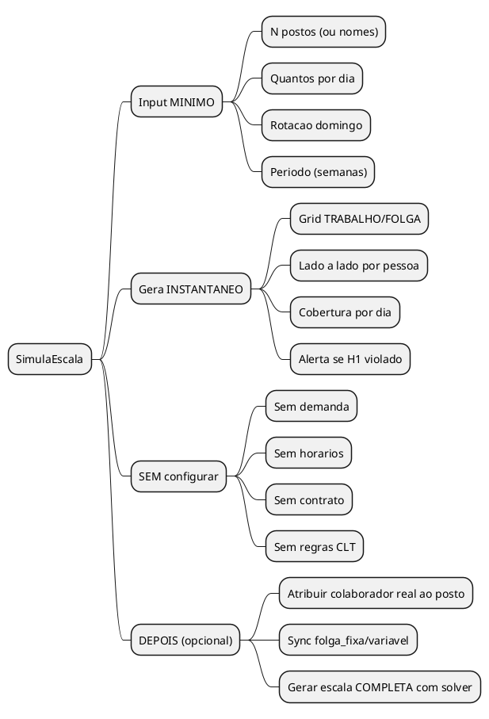
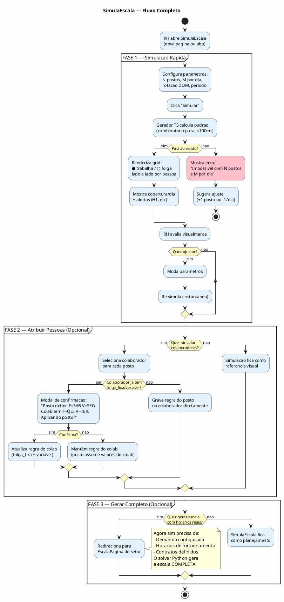
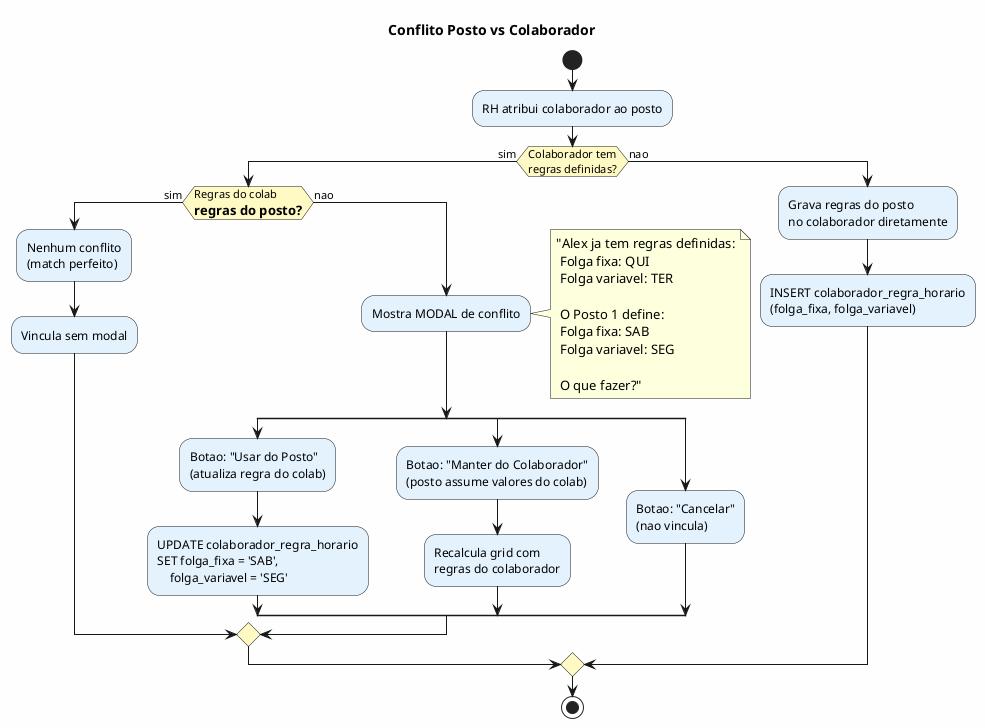

# ANALYST — Simulador de Ciclo Rapido (SimulaEscala)

> Spec para simulacao de escalas de folga/trabalho sem atrito.
> Origem: Proposta da Gracinha (RH Fernandes) — "quero ver o padrao RAPIDO, sem cadastrar nada"
> Data: 2026-03-12 | Status: SPEC v2 (arquitetura TS→Python via pinned_folga)

---

## TL;DR EXECUTIVO

O solver completo OBRIGA cadastrar demanda, horarios, contratos e colaboradores antes de gerar qualquer escala. A Gracinha quer o CONTRARIO: ver o padrao de quem trabalha e quem folga **antes de configurar qualquer coisa**. Ela tentou na mao e bateu no H1 (max 6 consecutivos) — gente trabalhando 12 dias seguidos.

**Solucao:** Um **Simulador de Ciclo** leve que gera padroes TRABALHO/FOLGA usando apenas:

1. Quantos postos (ex: 6)
2. Quantos trabalham por dia (ex: 3)
3. Rotacao de domingo (ex: 1 sim / 1 nao)
4. Periodo (ex: 4 semanas)

Sem Python. Sem demanda. Sem horarios. Sem CLT. Puro TypeScript. Sub-segundo.

**Integracao com solver:** O padrao T/F gerado pelo TS alimenta o solver Python como `pinned_folga`,
SUBSTITUINDO a Phase 1 do solver (`solve_folga_pattern`). Uma fonte de verdade por camada:
TS = padrao de folgas, Python = horarios e slots.

---

## 1. VISAO GERAL



---

## 2. O PROBLEMA QUE RESOLVE

### Hoje (atrito alto)

```
RH quer ver padrao de folgas
    |
    v
Cadastrar empresa ──> Cadastrar setores ──> Cadastrar colaboradores
    |                     |                      |
    v                     v                      v
Config horarios ──> Config demanda (7 timelines!) ──> Gerar escala (solver Python)
    |
    v
FINALMENTE ve o padrao (30+ min depois)
```

### Com SimulaEscala (atrito zero)

```
RH quer ver padrao de folgas
    |
    v
"6 postos, 3 por dia, domingo 1/1"
    |
    v
VE O PADRAO (< 1 segundo)
```

---

## 3. FLUXO COMPLETO



---

## 4. O GERADOR — Matematica Pura em TypeScript

### 4.1 Input

```typescript
interface SimulaCicloInput {
  // Obrigatorios
  num_postos: number              // ex: 6
  trabalham_por_dia: number       // ex: 3 (seg-sab), pode ser diferente no domingo
  trabalham_domingo: number       // ex: 2 (quantos no DOM)
  num_semanas: number             // ex: 4

  // Opcionais (defaults razoaveis)
  max_consecutivos?: number       // default: 6 (H1 CLT)
  domingo_max_consecutivos?: number // default: 2 (H3 homem) ou 1 (H3 mulher)
  nomes_postos?: string[]         // ex: ["Alex","Maria"...] ou auto "Posto 1","Posto 2"
  regime?: '5X2' | '6X1'         // default: '6X1' — define folgas/semana
}
```

### 4.2 Output

```typescript
interface SimulaCicloOutput {
  sucesso: boolean
  erro?: string
  sugestao?: string

  // Grid principal
  grid: SimulaCicloRow[]          // 1 row por posto
  cobertura_dia: CoberturaRow[]   // 1 row por semana (cobertura por dia)

  // Metadata
  ciclo_semanas: number           // ciclo minimo de repeticao (N/gcd(N,D))
  stats: {
    folgas_por_pessoa_semana: number  // ex: 1 (6x1) ou 2 (5x2)
    cobertura_min: number             // menor cobertura em qualquer dia
    cobertura_max: number             // maior cobertura
    h1_violacoes: number              // quantos trechos > max_consecutivos
  }
}

interface SimulaCicloRow {
  posto: string                   // "Alex" ou "Posto 1"
  semanas: SimulaCicloSemana[]    // 1 por semana do periodo
}

interface SimulaCicloSemana {
  dias: ('T' | 'F')[]            // 7 valores: SEG a DOM. T=trabalha, F=folga
  trabalhou_domingo: boolean
  dias_trabalhados: number
  consecutivos_max: number        // maior trecho consecutivo DESTA semana
}

interface CoberturaRow {
  semana: number
  cobertura: number[]             // 7 valores: quantos trabalham SEG a DOM
}
```

### 4.3 Algoritmo (alto nivel)

```
FUNCAO gerarCiclo(input):

  1. VALIDAR:
     - trabalham_por_dia <= num_postos (senao impossivel)
     - trabalham_domingo <= num_postos
     - Calcular folgas_semana = 7 - dias_trabalho_por_regime
       (6x1 = 1 folga, 5x2 = 2 folgas)
     - Capacidade: num_postos * dias_trabalho >= trabalham_por_dia * 7
       (senao impossivel: nao tem gente suficiente)

  2. CALCULAR ciclo minimo:
     ciclo = num_postos / gcd(num_postos, trabalham_domingo)
     (5 pessoas, 2 DOM = ciclo 5; 6 pessoas, 2 DOM = ciclo 3)

  3. DISTRIBUIR domingos (round-robin justo):
     Para cada semana, selecionar quem trabalha domingo
     respeitando max_consecutivos_domingo (H3)

  4. DISTRIBUIR folgas seg-sab:
     Para cada pessoa, para cada semana:
       - Se 6x1: 1 folga/semana (alem do possivel DOM folga)
       - Se 5x2: 2 folgas/semana
       - Espalhar folgas para maximizar cobertura diaria
       - NUNCA ultrapassar max_consecutivos (H1)
       - Priorizar dias de MENOR demanda para folgas

  5. VALIDAR H1 cross-semana:
     Verificar transicoes entre semanas
     (fim da semana N + inicio da semana N+1 <= max_consecutivos)

  6. CALCULAR cobertura:
     Para cada dia, contar quantos trabalham
     Alertar se cobertura < trabalham_por_dia

  7. RETORNAR grid + stats
```

### 4.4 Sobre o ciclo emergente

A formula `N / gcd(N, D)` da o ciclo minimo de repeticao:

| N postos | D no DOM | Ciclo real | Funciona com S1/S2? |
|----------|----------|------------|---------------------|
| 4        | 2        | 2 semanas  | SIM                 |
| 5        | 2        | 5 semanas  | NAO                 |
| 6        | 2        | 3 semanas  | NAO                 |
| 6        | 3        | 2 semanas  | SIM                 |
| 8        | 2        | 4 semanas  | NAO                 |

O simulador MOSTRA o ciclo completo e depois REPETE. O RH ve exatamente quantas semanas
precisa pra o padrao se repetir.

---

## 5. UX — A PAGINA DO SIMULADOR

### 5.1 Layout

```
┌──────────────────────────────────────────────────────────────────────────┐
│  SimulaEscala — Simulador de Ciclos                                      │
├──────────────────────────────────────────────────────────────────────────┤
│                                                                          │
│  ┌─ PARAMETROS ─────────────────────────────────────────────┐           │
│  │                                                           │           │
│  │  Postos: [6]   Por dia: [3]   No domingo: [2]            │           │
│  │                                                           │           │
│  │  Regime: (●) 6x1  ( ) 5x2    Semanas: [4]               │           │
│  │                                                           │           │
│  │  Max consecutivos: [6]   DOM max seguidos: [2]           │           │
│  │                                                           │           │
│  │  [Simular]                                                │           │
│  └───────────────────────────────────────────────────────────┘           │
│                                                                          │
│  ┌─ RESULTADO ──────────────────────────────────────────────┐           │
│  │                                                           │           │
│  │  Ciclo: 3 semanas   ● Trabalha  ○ Folga                  │           │
│  │                                                           │           │
│  │            │ SEG  TER  QUA  QUI  SEX  SAB  DOM │ Dias │   │           │
│  │  ──────────┼─────────────────────────────────────┼──────│   │           │
│  │  Posto 1   │                                     │      │   │           │
│  │    Sem 1   │  ●    ●    ●    ●    ●    ●    ○   │  6   │   │           │
│  │    Sem 2   │  ●    ○    ●    ●    ●    ●    ●   │  6   │   │           │
│  │    Sem 3   │  ●    ●    ●    ○    ●    ●    ●   │  6   │   │           │
│  │  ──────────┼─────────────────────────────────────┼──────│   │           │
│  │  Posto 2   │                                     │      │   │           │
│  │    Sem 1   │  ●    ●    ●    ●    ○    ●    ●   │  6   │   │           │
│  │    Sem 2   │  ●    ●    ○    ●    ●    ●    ●   │  6   │   │           │
│  │    Sem 3   │  ●    ●    ●    ●    ●    ○    ●   │  6   │   │           │
│  │  ... (mais postos)                                │      │   │           │
│  │  ──────────┼─────────────────────────────────────┼──────│   │           │
│  │  COBERTURA │                                     │      │   │           │
│  │    Sem 1   │  5    5    5    5    4    5    3   │      │   │           │
│  │    Sem 2   │  5    4    4    5    5    5    4   │      │   │           │
│  │    Sem 3   │  5    5    5    4    5    4    4   │      │   │           │
│  │                                                   │      │   │           │
│  │  ℹ Ciclo repete a cada 3 semanas                  │      │   │           │
│  │  ⚠ Cobertura minima: 3 (DOM Sem1) — abaixo de 4  │      │   │           │
│  └───────────────────────────────────────────────────────────┘           │
│                                                                          │
│  ┌─ ATRIBUIR COLABORADORES (opcional) ──────────────────────┐           │
│  │                                                           │           │
│  │  Setor: [Acougue v]                                       │           │
│  │                                                           │           │
│  │  Posto 1: [Alex Silva v]     F=SAB  V=—                  │           │
│  │  Posto 2: [Maria Santos v]   F=—    V=—                  │           │
│  │  Posto 3: [Jose Luiz v]      F=QUI  V=—                  │           │
│  │  Posto 4: [Sem colaborador]                               │           │
│  │  Posto 5: [Sem colaborador]                               │           │
│  │  Posto 6: [Sem colaborador]                               │           │
│  │                                                           │           │
│  │  [Aplicar Padrao nos Colaboradores]                       │           │
│  └───────────────────────────────────────────────────────────┘           │
│                                                                          │
└──────────────────────────────────────────────────────────────────────────┘
```

### 5.2 Interatividade

| Acao | Comportamento |
|------|---------------|
| Muda qualquer parametro | Re-simula instantaneo (debounce 200ms) |
| Hover na celula | Tooltip: "Posto 3 — Quarta Sem2: Folga" |
| Click em celula folga/trabalho | Toggle manual (recalcula cobertura em tempo real) |
| Click em "Atribuir" | Abre secao de vinculacao com dropdown de colaboradores |
| Click "Aplicar Padrao" | Modal de confirmacao (ver secao 6) |

### 5.3 Validacoes em tempo real

| Validacao | Quando | Visual |
|-----------|--------|--------|
| H1 violado | Trecho > max_consecutivos | Celulas com borda vermelha + tooltip |
| Cobertura < target | Dia com menos que `trabalham_por_dia` | Numero em vermelho na linha COBERTURA |
| DOM > max seguidos | Pessoa com 3+ domingos seguidos | Badge warning no DOM |
| Impossivel | Parametros matematicamente impossiveis | Banner vermelho no topo |

---

## 6. CONFLITO: POSTO vs COLABORADOR — A Pergunta da Gracinha

### 6.1 O cenario

A simulacao gera um padrao para "Posto 1":
- Folga fixa = SAB (folga toda semana no sabado)
- Folga variavel = SEG (condicional ao domingo)

O RH atribui Alex ao Posto 1. Mas Alex JA TEM regras:
- folga_fixa = QUI
- folga_variavel = TER

**Quem vence?**

### 6.2 A resposta



### 6.3 Resumo da decisao

| Cenario | Acao | Modal? |
|---------|------|--------|
| Colab SEM regras | Posto grava no colab | NAO |
| Colab COM regras = posto | Vincula direto | NAO |
| Colab COM regras != posto | Modal 3 opcoes | SIM |

### 6.4 O que NUNCA acontece

- **NUNCA** sobrescreve silenciosamente as regras do colaborador
- **NUNCA** ignora o padrao do posto sem avisar
- **NUNCA** cria estado inconsistente (colab com regra X mas alocado segundo padrao Y)

---

## 7. ARQUITETURA: TS + PYTHON (UMA FONTE POR CAMADA)

### 7.1 O solver Python JA tem 2 fases internas

```
HOJE (solver_ortools.py):

  Phase 1: solve_folga_pattern()         ← modelo LEVE (N×D booleans)
    → Decide OFF/MANHA/TARDE/INTEGRAL por (pessoa, dia)
    → Aplica H1, folga_fixa, folga_variavel, domingo_ciclo, headcount
    → ~1-3s

  Phase 2: build_model(pinned_folga=...)  ← modelo PESADO (N×D×S vars)
    → Recebe pinned_folga da Phase 1
    → Aloca slots 15min, almoco, interjornada, demanda por faixa
    → ~5-30s
```

O `build_model` ja aceita `pinned_folga: Dict[Tuple[int,int], int]` como parametro
(solver_ortools.py linha 572). Quando presente, Phase 2 usa o pattern como seed.

### 7.2 A nova arquitetura

```
COM SimulaEscala:

  ┌─────────────────────────────────────────────────────────────────┐
  │  TypeScript (SimulaEscala)                                       │
  │  FONTE DE VERDADE: padrao T/F (quem trabalha/folga cada dia)     │
  │  Roda no renderer, <100ms, sem Python, sem banco                 │
  │                                                                   │
  │  Input: N postos, M/dia, DOM rotation, regime                    │
  │  Output: grid T/F + cobertura + stats + ciclo                    │
  └───────────────────────────┬─────────────────────────────────────┘
                              │
                  2 caminhos possíveis:
                              │
          ┌───────────────────┼─────────────────────┐
          ▼                                         ▼
  ┌───────────────────┐                 ┌─────────────────────────┐
  │  Caminho A:        │                 │  Caminho B:              │
  │  Aplicar Padrao    │                 │  Gerar Completo          │
  │                    │                 │                           │
  │  Grava folga_fixa  │                 │  Bridge converte grid TS  │
  │  + folga_variavel  │                 │  → pinned_folga dict      │
  │  nos colaboradores │                 │  → passa ao Python        │
  │  (IPC existente)   │                 │                           │
  │                    │                 │  Python PULA Phase 1      │
  │  Solver le depois  │                 │  (solve_folga_pattern)    │
  │  via regras HARD   │                 │  → roda direto Phase 2    │
  └───────────────────┘                 │  (build_model c/ pinned)  │
                                        │                           │
                                        │  Escala completa:         │
                                        │  horarios + almoco + CLT  │
                                        └─────────────────────────┘
```

### 7.3 Uma fonte de verdade por camada

| Camada | Fonte | Motor | Responsabilidade |
|--------|-------|-------|------------------|
| **Padrao T/F** (quem trabalha/folga) | TypeScript | Combinatoria pura | H1, H3, cobertura, ciclo |
| **Scheduling** (horarios, almoco, CLT) | Python | OR-Tools CP-SAT | H2, H4, H6, H10-H18, APs, demanda slot |

**NAO sao 2 fontes de verdade.** Sao 2 CAMADAS com responsabilidades distintas:
- TS decide O QUE (trabalha ou folga)
- Python decide COMO (que horas, almoco onde, interjornada)

### 7.4 Caminho B: pinned_folga (a ponte tecnica)

O grid TS precisa virar o `pinned_folga` que o Python ja aceita.

**Formato Python existente:**
```python
pinned_folga: Dict[Tuple[int, int], int]
# (c_index, d_index) → 0=OFF, 1=MANHA, 2=TARDE, 3=INTEGRAL
```

**Conversao TS→Python (no bridge):**
```typescript
// SimulaEscala output: grid[posto][semana].dias = ['T','F','T',...]
// Converter para pinned_folga dict:

function gridToPinnedFolga(
  grid: SimulaCicloRow[],
  colaboradorIds: number[],  // mapeamento posto→colab_id
  dataInicio: string,
): Record<string, number> {
  const pinned: Record<string, number> = {}
  for (let c = 0; c < grid.length; c++) {
    let dayIndex = 0
    for (const semana of grid[c].semanas) {
      for (const dia of semana.dias) {
        const key = `${c},${dayIndex}`
        pinned[key] = dia === 'F' ? 0 : 3  // 0=OFF, 3=INTEGRAL (Python decide banda real)
        dayIndex++
      }
    }
  }
  return pinned
}
```

**No Python (solver_ortools.py):**
```python
# Mudanca minima: se pinned_folga vier no input, PULAR solve_folga_pattern()
if "pinned_folga" in data and data["pinned_folga"]:
    log("Phase 1 SKIP — usando padrao externo (SimulaEscala)")
    pinned = data["pinned_folga"]
else:
    log("Phase 1 — calculando padrao de folgas...")
    result = solve_folga_pattern(data)
    pinned = result["pattern"] if result else None
```

### 7.5 O que cada um valida

| Regra | SimulaEscala (TS) | Solver Phase 2 (Python) |
|-------|-------------------|-------------------------|
| H1 (max 6 consecutivos) | SIM | SIM (re-valida) |
| H3 (domingo max seguidos) | SIM | SIM (re-valida) |
| H2 (11h interjornada) | NAO | SIM |
| H4 (max horas/dia) | NAO | SIM |
| H6 (almoco) | NAO | SIM |
| H10 (horas semanais) | NAO | SIM |
| H11-H18 (aprendiz/estagiario/feriado) | NAO | SIM |
| Demanda (cobertura) | BASICO (N por dia) | COMPLETO (por slot 15min) |
| Antipatterns | NAO | SIM |
| SOFT preferences | NAO | SIM |

### 7.6 Safety net: se Python rejeitar o padrao TS

O Python pode achar o padrao TS INFEASIBLE (ex: colab com ferias nao foi considerado no TS).

**Fallback:**
1. Python tenta Phase 2 com pinned_folga
2. Se INFEASIBLE → Python roda sua propria Phase 1 (solve_folga_pattern) como fallback
3. Retorna diagnostico: `"padrao_externo_rejeitado": true, "motivo": "..."`
4. UI mostra aviso: "Padrao simulado incompativel com restricoes CLT. Solver usou padrao proprio."

**O usuario NUNCA fica sem escala.** O pior caso e o solver ignorar o padrao TS e fazer o dele.

### 7.7 Isolamento total (revert safety)

```
SE o Caminho B quebrar:
  → git revert das mudancas no bridge/solver
  → SimulaEscala TS continua funcionando standalone (Caminho A)
  → Solver Python volta ao comportamento original (Phase 1 + 2)
  → Zero impacto no sistema existente

Arquivos afetados pelo Caminho B:
  solver-bridge.ts  → +1 funcao (gridToPinnedFolga) + condicional no buildSolverInput
  solver_ortools.py → +1 condicional (if pinned_folga: skip Phase 1)
  Ambos revertiveis com 1 git revert
```

---

## 8. REGRAS DE NEGOCIO

### PODE / NAO PODE

- ✅ **PODE:** Simular com apenas postos numericos (sem colaboradores)
- ✅ **PODE:** Dar nomes aos postos sem vincular a colaboradores reais
- ✅ **PODE:** Toggle manual de celulas (trocar T↔F e recalcular)
- ✅ **PODE:** Simular quantas vezes quiser (efemero, nao salva)
- ✅ **PODE:** Vincular colaborador a posto a qualquer momento
- ❌ **NAO PODE:** Gerar horarios reais (isso e do solver)
- ❌ **NAO PODE:** Oficializar como escala (nao e escala, e padrao)
- ❌ **NAO PODE:** Sobrescrever regras de colaborador sem confirmacao

### SEMPRE / NUNCA

- 🔄 **SEMPRE:** Validar H1 (max consecutivos) em tempo real
- 🔄 **SEMPRE:** Mostrar cobertura por dia
- 🔄 **SEMPRE:** Mostrar ciclo minimo de repeticao
- 🚫 **NUNCA:** Salvar automaticamente no banco (simulacao e efemera)
- 🚫 **NUNCA:** Bloquear por falta de dados (o ponto e SER rapido)

### CONDICIONAIS

- 🔀 **SE** parametros impossiveis **ENTAO** erro + sugestao
- 🔀 **SE** H1 violado **ENTAO** highlight vermelho + tooltip
- 🔀 **SE** cobertura < target **ENTAO** numero vermelho
- 🔀 **SE** atribuir colab com regras **ENTAO** modal de conflito
- 🔀 **SE** "Aplicar Padrao" **ENTAO** UPDATE nas regras do colab no banco

---

## 9. ONDE MORA NO SISTEMA

### 9.1 Nova pagina ou aba?

**Recomendacao: NOVA PAGINA no sidebar.**

| Opcao | Pro | Contra |
|-------|-----|--------|
| Pagina no sidebar | Acesso direto, independente de setor | +1 item na nav |
| Aba dentro de SetorDetalhe | Proximo do contexto do setor | Precisa selecionar setor antes (atrito!) |
| Modal dentro de EscalaPagina | Zero navegacao | Muito complexo pra modal |

A pagina fica no sidebar, abaixo de "Escalas":

```
Sidebar:
├── Dashboard
├── Setores
├── Colaboradores
├── Escalas
├── Simular Ciclos    ← NOVO
├── Feriados
├── Regras
└── Configuracoes
```

### 9.2 Arquivos novos

```
src/renderer/src/
├── paginas/
│   └── SimulaCicloPagina.tsx      ← Pagina principal (UI)
├── componentes/
│   └── SimulaCicloGrid.tsx        ← Grid visual T/F
│   └── SimulaCicloConfig.tsx      ← Painel de parametros
│   └── SimulaCicloAtribuir.tsx    ← Secao de atribuicao de colaboradores
│   └── SimulaCicloConflito.tsx    ← Modal de conflito posto vs colab
├── servicos/
│   └── simulaCiclo.ts             ← Wrapper IPC (ou logica local)

src/shared/
└── simula-ciclo.ts                ← Gerador puro (TypeScript, sem deps)
                                      Pode rodar no main OU no renderer
```

### 9.3 Onde roda o gerador?

**RENDERER.** Nao precisa de IPC. O gerador e puro TypeScript, sem acesso a banco,
sem Python, sem I/O. Roda direto no processo do React. Sub-segundo.

A UNICA parte que precisa de IPC e "Atribuir Colaboradores" (ler colabs do banco)
e "Aplicar Padrao" (UPDATE regra no banco).

### 9.4 IPC handlers necessarios

| Handler | Ja existe? | O que faz |
|---------|-----------|-----------|
| `colaboradores.listarPorSetor` | SIM | Lista colabs pra dropdown |
| `colaboradores.obterRegrasPadrao` | SIM | Regras atuais do colab |
| `colaboradores.salvarRegraHorario` | SIM | UPDATE folga_fixa/variavel |

**Zero handlers novos.** Tudo ja existe. So a UI e o gerador sao novos.

---

## 10. IMPACTO NO SISTEMA EXISTENTE

```
ARQUIVOS QUE MUDAM:
─────────────────────────────────────────
src/renderer/src/App.tsx              ← +1 rota (/simular-ciclos)
src/renderer/src/componentes/
  AppSidebar.tsx                      ← +1 item no menu

ARQUIVOS NOVOS:
─────────────────────────────────────────
src/shared/simula-ciclo.ts            ← Gerador TypeScript puro
src/renderer/src/paginas/
  SimulaCicloPagina.tsx               ← Pagina + config + grid + atribuicao
(componentes inline na pagina OU extraidos depois se ficar grande)

ARQUIVOS QUE NAO MUDAM:
─────────────────────────────────────────
src/main/tipc.ts                      ← Zero handlers novos
src/main/motor/solver-bridge.ts       ← Nao tocado
solver/constraints.py                 ← Nao tocado
src/main/db/schema.ts                 ← Nao tocado
Tudo do solver/validador/bridge       ← Intocado
```

**Impacto: MINIMO. 2 linhas em arquivos existentes + 2 arquivos novos.**

---

## 11. CASO DE USO DA GRACINHA (O problema original)

### Cenario

"Tenho 6 funcionarios. Quero 3 por dia. Domingo 1 sim 1 nao."

### Na SimulaEscala

```
Input:
  Postos: 6
  Por dia: 3
  No domingo: 3
  Regime: 6x1
  Semanas: 4
  Max consecutivos: 6
  DOM max seguidos: 1

Resultado (ciclo = 2 semanas):

            SEG  TER  QUA  QUI  SEX  SAB  DOM    Dias
Posto 1
  Sem 1      ●    ●    ●    ●    ●    ●    ○      6
  Sem 2      ●    ●    ●    ○    ●    ●    ●      6
Posto 2
  Sem 1      ●    ●    ●    ●    ●    ○    ●      6
  Sem 2      ●    ●    ○    ●    ●    ●    ●      6
Posto 3
  Sem 1      ●    ●    ●    ●    ○    ●    ●      6
  Sem 2      ○    ●    ●    ●    ●    ●    ●      6
Posto 4
  Sem 1      ●    ●    ○    ●    ●    ●    ○      5  ← 2 folgas
  Sem 2      ●    ●    ●    ●    ●    ○    ●      6
Posto 5
  Sem 1      ●    ○    ●    ●    ●    ●    ●      6
  Sem 2      ●    ●    ●    ●    ○    ●    ○      5
Posto 6
  Sem 1      ○    ●    ●    ●    ●    ●    ●      6
  Sem 2      ●    ○    ●    ●    ●    ●    ●      6

COBERTURA:
  Sem 1      5    5    5    5    5    5    3     ✓ (>= 3)
  Sem 2      5    5    5    4    5    5    4     ✓ (>= 3)

Ciclo: 2 semanas
H1: ✓ Nenhuma violacao (max 6 consecutivos)
DOM: ✓ Ninguem trabalha 2 domingos seguidos
```

### O que a Gracinha VE

Um grid limpo, lado a lado, mostrando EXATAMENTE o padrao de folgas.
Sem ter configurado demanda. Sem horarios. Sem contratos. Sem nada.

**E o que ela queria desde o inicio.**

---

## 12. CHECKLIST DE IMPLEMENTACAO

### Fase unica (escopo minimo — zero over-engineering)

- [ ] `src/shared/simula-ciclo.ts` — Gerador TypeScript puro (~150 linhas)
  - [ ] Validacao de input (impossibilidade matematica)
  - [ ] Distribuicao de domingos (round-robin justo)
  - [ ] Distribuicao de folgas seg-sab (maximizar cobertura)
  - [ ] Validacao H1 cross-semana
  - [ ] Calculo de cobertura e stats
- [ ] `SimulaCicloPagina.tsx` — Pagina completa
  - [ ] Painel de parametros (inputs numericos + selects)
  - [ ] Grid visual T/F (tabela com cores)
  - [ ] Linha de cobertura
  - [ ] Alertas (H1, cobertura baixa)
  - [ ] Toggle manual de celulas (click → recalcular)
- [ ] `App.tsx` — +1 rota
- [ ] `AppSidebar.tsx` — +1 item
- [ ] `npm run typecheck` — 0 erros

### Fase 2 (depois, se validar com a Gracinha)

- [ ] Secao "Atribuir Colaboradores" (dropdown + modal conflito)
- [ ] "Aplicar Padrao" (UPDATE regras no banco)
- [ ] Link "Gerar Completo" (redireciona pra EscalaPagina)

---

## 13. DISCLAIMERS CRITICOS

- 🚨 O simulador NAO substitui o solver. Ele gera PADROES de folga, nao escalas com horarios.
- 🚨 O padrao gerado pode nao ser 100% reproduzido pelo solver (o solver tem mais restricoes).
- 🚨 A Gracinha pode querer editar manualmente e criar padroes impossiveis — o sistema AVISA mas NAO BLOQUEIA (ela decide).
- 🚨 O gerador e DETERMINISTICO (mesmos inputs = mesma saida). Se quiser variacao, precisa de seed random.
- 🚨 Com muitos postos (>15) e regimes complexos (5x2 + domingos), a combinatoria pode ter multiplas solucoes validas. O gerador retorna A PRIMEIRA valida, nao "a melhor".

---

*Referencia: `docs/ANALISE_MATEMATICA_CICLOS.md` — prova matematica de ciclos*
*Referencia: `docs/BUILD_CICLOS_V2.md` — modelo de folga condicional (solver completo)*
