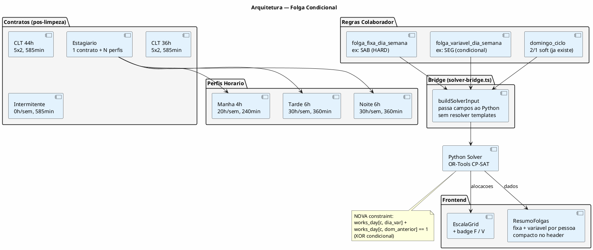
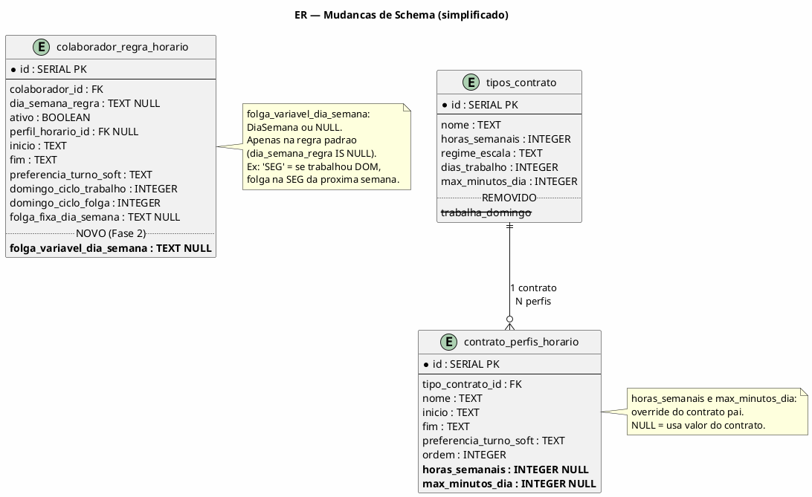
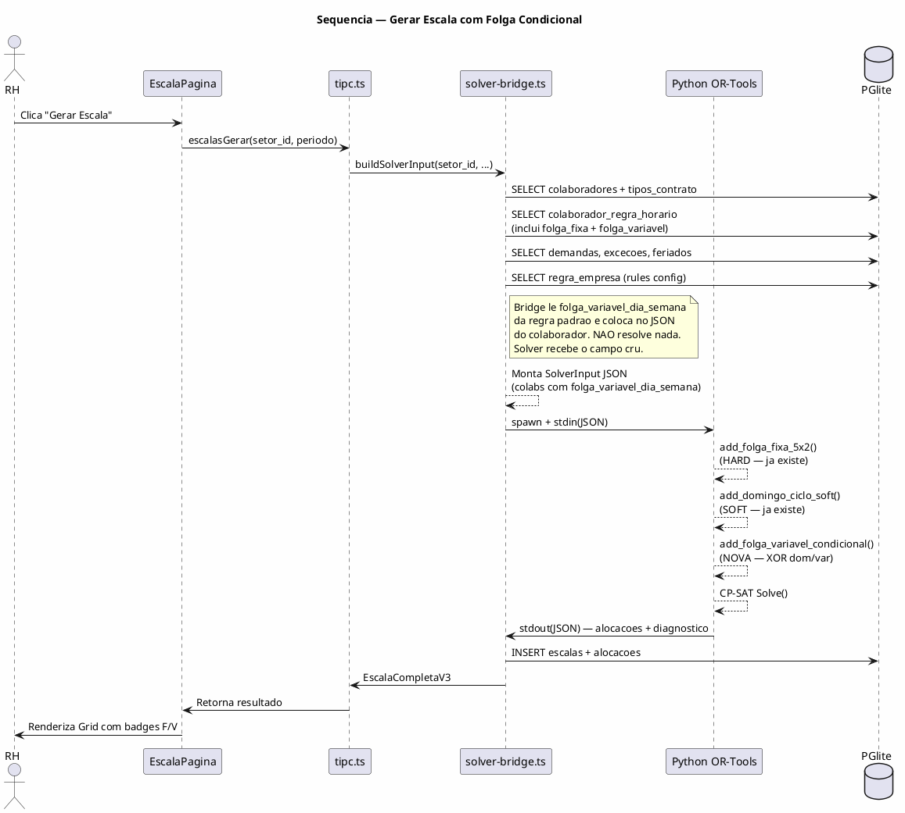
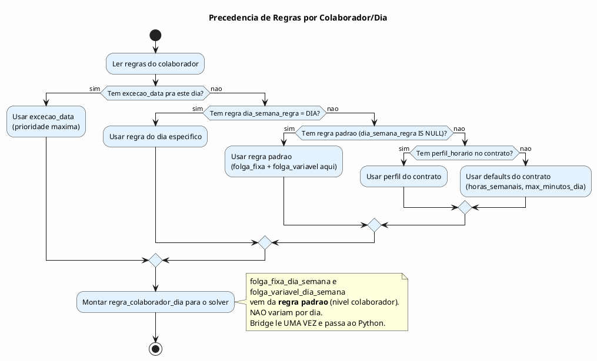

# BUILD — Folga Condicional + Limpeza de Contratos v2

> Arquitetura final para implementacao. Sem ciclos estaticos — regra condicional pura.
> Data: 2026-02-25 | Status: FASE 1 COMPLETA — Fase 2 pronta pra implementar

---

## TL;DR

3 mudancas no sistema, nesta ordem:

1. **Limpeza de contratos** — remover `trabalha_domingo`, unificar estagiarios, add Intermitente
2. **Folga condicional no solver** — 1 campo novo + 1 constraint Python. O solver resolve tudo.
3. **Badge F/V no Grid + resumo de regras** — visualizar folga fixa vs variavel

**O que foi DESCARTADO da v1:** escala_ciclo_modelos, escala_ciclo_itens, bridge resolvendo
templates, idempotencia, CicloOverview como tabela S1/S2. Tudo isso era over-engineering
baseado num modelo matematicamente errado (ciclo de 2 semanas nao funciona com 5 pessoas).

---

## 1. MODELO CONCEITUAL

### 1.1 As 2 folgas do 5x2

Todo CLT 5x2 tem **2 folgas por semana**, sempre:
- **Folga FIXA**: mesmo dia toda semana (ex: SAB). HARD constraint. Ja existe no sistema.
- **Folga VARIAVEL**: dia que depende do domingo da semana ANTERIOR.

### 1.2 A regra condicional

```
Semana = SEG a DOM

SE trabalhou domingo(semana N)
  → folga no dia variavel da semana N+1 (ex: SEG)

SE NAO trabalhou domingo(semana N)
  → trabalha no dia variavel da semana N+1
```

O domingo e o ULTIMO dia da semana. A variavel e um dia da semana SEGUINTE.
A decisao do domingo DITA o que acontece na proxima semana.

### 1.3 Por que nao e um ciclo de 2 semanas

Com 5 pessoas e 2 no domingo, o ciclo minimo de repeticao e **5 semanas**:

```
Formula: Ciclo = N / gcd(N, D)

| N pessoas | D no DOM | Ciclo real |
|-----------|----------|------------|
| 4         | 2        | 2 semanas  |
| 5         | 2        | 5 semanas  |
| 6         | 2        | 3 semanas  |
| 6         | 3        | 2 semanas  |
```

O ciclo EMERGE da distribuicao de domingos. Nao e definido a priori.
O solver descobre o padrao otimo naturalmente.

### 1.4 Exemplo 5 semanas (5 pessoas, 2 no DOM)

```
Fixas: Alex=SAB  Mateus=SAB  JoseL=QUI  Jessica=QUA  Robert=SEX
Var:   Alex=SEG  Mateus=TER  JoseL=SEG  Jessica=TER  Robert=QUA

F=fixa  V=variavel  .=trabalha  DOM sublinhado=trabalha domingo

         SEG  TER  QUA  QUI  SEX  SAB  DOM    DOM?  Folgas
         ─────────────────────────────────────────────────────
Alex  1:  .    .    .    .    .   [F]   T      T     1
      2: (V)   .    .    .    .   [F]   T      T     2  ← DOM sem1=T → var ativa
      3: (V)   .    .    .    .   [F]   .      .     2  ← DOM sem2=T → var ativa
      4:  .    .    .    .    .   [F]   .      .     1  ← DOM sem3=. → var inativa
      5:  .    .    .    .    .   [F]   .      .     1  ← DOM sem4=. → var inativa
         ─────────────────────────────────────────────────────
Mateus 1: .    .    .    .    .   [F]   .      .     1
      2:  .    .    .    .    .   [F]   T      T     1  ← DOM sem1=. → var inativa
      3:  .   (V)   .    .    .   [F]   .      .     2  ← DOM sem2=T → var ativa
      4:  .    .    .    .    .   [F]   T      T     1  ← DOM sem3=. → var inativa
      5:  .   (V)   .    .    .   [F]   .      .     2  ← DOM sem4=T → var ativa
         ─────────────────────────────────────────────────────
JoseL  1: .    .    .   [F]   .    .    .      .     1
      2:  .    .    .   [F]   .    .    .      .     1  ← DOM sem1=. → var inativa
      3:  .    .    .   [F]   .    .    T      T     1  ← DOM sem2=. → var inativa
      4: (V)   .    .   [F]   .    .    T      T     2  ← DOM sem3=T → var ativa
      5: (V)   .    .   [F]   .    .    .      .     2  ← DOM sem4=T → var ativa
         ─────────────────────────────────────────────────────
Jessica 1: .   .   [F]   .    .    .    .      .     1
      2:  .    .   [F]   .    .    .    .      .     1  ← DOM sem1=. → var inativa
      3:  .    .   [F]   .    .    .    T      T     1  ← DOM sem2=. → var inativa
      4:  .   (V) [F]    .    .    .    .      .     2  ← DOM sem3=T → var ativa
      5:  .    .   [F]   .    .    .    T      T     1  ← DOM sem4=. → var inativa
         ─────────────────────────────────────────────────────
Robert 1: .    .    .    .   [F]   .    T      T     1
      2:  .    .   (V)   .   [F]   .    .      .     2  ← DOM sem1=T → var ativa
      3:  .    .    .    .   [F]   .    .      .     1  ← DOM sem2=. → var inativa
      4:  .    .    .    .   [F]   .    .      .     1  ← DOM sem3=. → var inativa
      5:  .    .    .    .   [F]   .    T      T     1  ← DOM sem4=. → var inativa

COBERTURA POR DIA (quantos trabalham):
      SEG  TER  QUA  QUI  SEX  SAB  DOM
  1:   5    5    4    4    4    3    2  ✓
  2:   4    5    4    4    4    3    2  ✓
  3:   4    4    4    4    4    3    2  ✓
  4:   4    4    4    3    4    3    2  ✓
  5:   4    4    4    4    4    3    2  ✓
```

### 1.5 Semana = SEG a DOM

Configuracao da empresa (`corte_semanal = 'SEG_DOM'`). Ja existe no schema.

---

## 2. DIAGRAMA DE COMPONENTES



---

## 3. DIAGRAMA ER — Mudancas no Schema



**Nota:** `escala_ciclo_modelos` e `escala_ciclo_itens` continuam existindo no schema
mas NAO sao usados pela folga condicional. Ficam como legado para possivel uso futuro
(deteccao de pattern pos-geracao, que e outra feature).

---

## 4. DIAGRAMA DE SEQUENCIA — Geracao com Folga Condicional



---

## 5. DIAGRAMA DE ATIVIDADE — Precedencia de Regras



---

## 6. ESTRUTURA DE CODIGO — Mudancas por Arquivo

```
ARQUIVOS QUE MUDAM:
─────────────────────────────────────────
src/main/db/
├── schema.ts           ← migration v17 (limpeza ✅) + v18 (folga_variavel)
└── seed.ts             ← contratos unificados + Intermitente ✅

src/main/motor/
└── solver-bridge.ts    ← passar folga_variavel_dia_semana no JSON

solver/
├── constraints.py      ← add_folga_variavel_condicional() NOVA
└── solver_ortools.py   ← chamar a nova constraint

src/shared/
├── types.ts            ← campo em SolverInputColab + TipoContrato
└── constants.ts        ← TIPOS_TRABALHADOR + 'INTERMITENTE'

src/renderer/src/
├── paginas/EscalaPagina.tsx  ← ResumoFolgas no header
└── componentes/EscalaGrid/   ← badge F/V na celula de folga

IMPACTO MINIMO (ajuste pontual):
─────────────────────────────────────────
src/main/ia/
├── tools.ts            ← add folga_variavel_dia_semana em CAMPOS_VALIDOS
│                         + aceitar campo em salvar_regra_horario_colaborador
└── system-prompt.ts    ← mencionar folga variavel no schema ref

ARQUIVOS QUE NAO MUDAM:
─────────────────────────────────────────
escala_ciclo_modelos    ← tabela fica, nao e tocada
escala_ciclo_itens      ← tabela fica, nao e tocada
```

### 6.1 Detalhamento por arquivo

**`schema.ts` — Migration v17 (Limpeza de Contratos) ✅ IMPLEMENTADA**
```sql
-- v17: Limpeza de contratos
ALTER TABLE tipos_contrato DROP COLUMN IF EXISTS trabalha_domingo;
ALTER TABLE contrato_perfis_horario ADD COLUMN IF NOT EXISTS horas_semanais INTEGER;
ALTER TABLE contrato_perfis_horario ADD COLUMN IF NOT EXISTS max_minutos_dia INTEGER;
-- + unificacao de estagiarios (3→1) + INSERT Intermitente
```

**`schema.ts` — Migration v18 (Folga Variavel) — PENDENTE**
```sql
-- v18: Folga variavel condicional
ALTER TABLE colaborador_regra_horario
  ADD COLUMN IF NOT EXISTS folga_variavel_dia_semana TEXT
  CHECK (folga_variavel_dia_semana IN ('SEG','TER','QUA','QUI','SEX','SAB','DOM')
         OR folga_variavel_dia_semana IS NULL);
```

**`solver-bridge.ts` — Enriquecer colaborador**
```typescript
// Depois de ler a regra padrao (ja faz pra folga_fixa):
c.folga_variavel_dia_semana = (padrao.folga_variavel_dia_semana as DiaSemana | null) ?? null
```

**`constraints.py` — Nova constraint**
```python
def add_folga_variavel_condicional(
    model: cp_model.CpModel,
    works_day: WorksDay,
    colabs: List[dict],
    days: List[str],
    C: int, D: int,
) -> None:
    """Folga variavel condicional: XOR entre domingo e dia variavel.

    Se trabalhou domingo(semana N) → folga no dia_var(semana N+1).
    Se nao trabalhou domingo(semana N) → trabalha no dia_var(semana N+1).

    Constraint: works_day[c, dom_idx] + works_day[c, var_idx] == 1
    """
    DAY_LABELS = ["SEG", "TER", "QUA", "QUI", "SEX", "SAB", "DOM"]
    from datetime import date as dt_date
    day_labels = [DAY_LABELS[dt_date.fromisoformat(day).weekday()] for day in days]

    # Offset do DOM ate o dia variavel na proxima semana (SEG-DOM)
    OFFSET = {"SEG": 1, "TER": 2, "QUA": 3, "QUI": 4, "SEX": 5, "SAB": 6}

    for c in range(C):
        var_day = colabs[c].get("folga_variavel_dia_semana")
        if not var_day:
            continue

        offset = OFFSET.get(var_day, 0)
        if offset == 0:
            continue

        for d in range(D):
            if day_labels[d] != "DOM":
                continue
            var_idx = d + offset
            if var_idx < D:
                # XOR: trabalha_dom + trabalha_var == 1
                model.add(works_day[c, d] + works_day[c, var_idx] == 1)
```

**`types.ts` — Campos novos**
```typescript
// Em SolverInputColab:
folga_variavel_dia_semana?: DiaSemana | null

// Em TipoContrato — REMOVER:
// trabalha_domingo: boolean  ← DELETADO
```

**`seed.ts` — Contratos refatorados**
```typescript
// ANTES: 5 contratos (CLT 44h, CLT 36h, Est Manha, Est Tarde, Est Noite)
// DEPOIS: 4 contratos (CLT 44h, CLT 36h, Estagiario, Intermitente)
const tipos = [
  ['CLT 44h',      44, '5X2', 5, 585],
  ['CLT 36h',      36, '5X2', 5, 585],
  ['Estagiario',   20, '5X2', 5, 240],   // 20h default, perfis overridam
  ['Intermitente',  0, '6X1', 6, 585],   // 0h/sem, sob demanda
]
// Perfis: todos vinculados ao Estagiario unico
// Manha: horas_semanais=20, max_minutos_dia=240
// Tarde: horas_semanais=30, max_minutos_dia=360
// Noite: horas_semanais=30, max_minutos_dia=360
```

---

## 7. FRONTEND — Badge F/V + ResumoFolgas

### 7.1 Badge na celula do Grid

Quando uma alocacao e folga, o badge indica o tipo:

```
┌──────────┐   ┌──────────┐   ┌──────────┐
│  FOLGA   │   │  FOLGA   │   │ TRABALHA │
│   [F]    │   │   (V)    │   │ 08-17:15 │
│  fixa    │   │ variavel │   │          │
└──────────┘   └──────────┘   └──────────┘
```

- **[F]** = folga fixa (mesmo dia toda semana). Cor: cinza solido.
- **(V)** = folga variavel (condicional ao domingo anterior). Cor: cinza tracejado/outline.

**Logica de deteccao** (frontend, pos-geracao):
```
Para cada alocacao onde tipo='folga':
  SE dia_da_semana == folga_fixa_dia_semana do colaborador → badge [F]
  SENAO → badge (V)
```

Nao precisa de campo extra na tabela `alocacoes`. O frontend compara o dia com a regra.

### 7.2 ResumoFolgas (header da escala)

Componente compacto entre os IndicatorCards e o Grid:

```
┌─────────────────────────────────────────────────────────┐
│  Folgas Semanais                                        │
│                                                         │
│  Alex      [F] SAB   (V) SEG                           │
│  Mateus    [F] SAB   (V) TER                           │
│  Jose L.   [F] QUI   (V) SEG                           │
│  Jessica   [F] QUA   (V) TER                           │
│  Robert    [F] SEX   (V) QUA                           │
│                                                         │
│  ℹ (V) ativa quando trabalhou domingo na semana anterior│
└─────────────────────────────────────────────────────────┘
```

**Dados vem de:** `colaborador_regra_horario` (regra padrao de cada colab).
Se `folga_variavel_dia_semana` for NULL, mostra apenas `[F]`.

### 7.3 Cobertura de domingos (opcional, mesmo card)

Linha extra no ResumoFolgas mostrando distribuicao de domingos no periodo gerado:

```
│  Domingos no periodo (8 semanas):                       │
│  Alex 3x  Mateus 3x  Jose L. 4x  Jessica 3x  Robert 3x│
```

Derivado das alocacoes (COUNT onde dia=DOM e tipo=trabalho). Sem campo extra.

---

## 8. CONTRATOS — Limpeza e Novos

### 8.1 Remover `trabalha_domingo`

| Onde | Acao |
|------|------|
| `tipos_contrato` DDL | DROP COLUMN |
| `seed.ts` | Remover campo do INSERT |
| `solver-bridge.ts` | Remover leitura (`tc.trabalha_domingo`) |
| `types.ts` TipoContrato | Remover campo |
| `tipc.ts` handlers | Remover refs |
| `tools.ts` IA | Remover de CAMPOS_VALIDOS |

**Por que:** O Python solver NUNCA le `trabalha_domingo`. Quem controla domingo e:
- `tipo_trabalhador` (CLT/ESTAGIARIO/INTERMITENTE) para decisao de constraint
- `folga_fixa_dia_semana` (SAB/DOM) para bloqueio
- `domingo_ciclo_trabalho/folga` para rotacao justa

### 8.2 Unificar Estagiarios

**ANTES (3 contratos):**
```
Estagiario Manha    → 20h, 240min, perfil MANHA_08_12
Estagiario Tarde    → 30h, 360min, perfil TARDE_1330_PLUS
Estagiario Noite    → 30h, 360min, perfil ESTUDA_NOITE_08_14
```

**DEPOIS (1 contrato + 3 perfis):**
```
Estagiario          → 20h (default), 240min (default)
  ├── Perfil Manha  → horas_semanais=20,  max_minutos_dia=240
  ├── Perfil Tarde  → horas_semanais=30,  max_minutos_dia=360
  └── Perfil Noite  → horas_semanais=30,  max_minutos_dia=360
```

O campo `perfil_horario_id` na regra do colaborador define qual perfil ele segue.
Os campos `horas_semanais` e `max_minutos_dia` no perfil fazem override do contrato pai.

**Estagiario e domingo:** Adicionar constraint no solver similar a H11 (aprendiz) que bloqueia
domingo se `tipo_trabalhador = 'ESTAGIARIO'`. Hoje H11 so cobre APRENDIZ — estagiario precisa
do mesmo tratamento. Com a remocao de `trabalha_domingo`, essa constraint e o unico guard.

### 8.3 Adicionar Intermitente

```
Intermitente → horas_semanais=0, regime_escala='6X1', dias_trabalho=6, max_minutos_dia=585
```

- `tipo_trabalhador = 'INTERMITENTE'` no colaborador
- `dias_trabalho=6` e o TETO (maximo que o solver PODE alocar), nao obrigacao. Ele so trabalha quando demanda exige.
- Solver: guard H10 — pula min semanal se tipo_trabalhador == 'INTERMITENTE'
- Solver: guard divisao por zero — `horas_semanais=0` nao pode entrar em calculos de deficit/compensacao
- So trabalha quando demanda exige e nao tem CLT suficiente
- Nao tem folga fixa nem variavel (trabalha sob demanda)

---

## 9. MIGRATIONS SQL

### Migration v17 — Limpeza de Contratos ✅ IMPLEMENTADA

```sql
-- Remover trabalha_domingo
ALTER TABLE tipos_contrato DROP COLUMN IF EXISTS trabalha_domingo;

-- Override de horas no perfil de horario
ALTER TABLE contrato_perfis_horario ADD COLUMN IF NOT EXISTS horas_semanais INTEGER;
ALTER TABLE contrato_perfis_horario ADD COLUMN IF NOT EXISTS max_minutos_dia INTEGER;

-- Unificar estagiarios: renomear Est Manha → Estagiario, mover colabs, mover perfis, deletar vazios
-- Setar horas override nos perfis existentes (20h/240min, 30h/360min, 30h/360min)
-- INSERT Intermitente (0h/sem, 6x1, 585min)
```

### Migration v18 — Folga Variavel (PENDENTE — Fase 2)

```sql
ALTER TABLE colaborador_regra_horario
  ADD COLUMN IF NOT EXISTS folga_variavel_dia_semana TEXT
  CHECK (folga_variavel_dia_semana IN ('SEG','TER','QUA','QUI','SEX','SAB','DOM')
         OR folga_variavel_dia_semana IS NULL);
```

---

## 10. CHECKLIST DE IMPLEMENTACAO

### Fase 1: Limpeza de Contratos (schema + seed) ✅ COMPLETA

- [x] Migration v17 em `schema.ts` (DROP `trabalha_domingo`, ADD perfil overrides, unificar estagiarios, INSERT Intermitente)
- [x] DROP `trabalha_domingo` de `tipos_contrato` (DDL + migration)
- [x] ADD `horas_semanais`, `max_minutos_dia` em `contrato_perfis_horario`
- [x] Refatorar `seed.ts` — 4 contratos (CLT 44h, CLT 36h, Estagiario, Intermitente)
- [x] Perfis vinculados ao Estagiario unico (com override de horas)
- [x] `types.ts` — remover `trabalha_domingo` de `TipoContrato` e `SolverInputColab`
- [x] `constants.ts` — add `'INTERMITENTE'` em `TIPOS_TRABALHADOR`
- [x] `solver-bridge.ts` — remover leitura de `trabalha_domingo` (query, mapping, hash)
- [x] `tipc.ts` — remover refs a `trabalha_domingo` (CRUD handlers + add horas/max perfil handlers)
- [x] `tools.ts` — remover de CAMPOS_VALIDOS, add perfil fields, fix preflight → tipo_trabalhador
- [x] `solver_ortools.py` — trocar check `trabalha_domingo` → `tipo_trabalhador in ("ESTAGIARIO","APRENDIZ")`
- [x] `ContratoLista.tsx` — remover UI inteira (Zod, defaults, edit, table, card, form), fix horas_semanais.min(0)
- [x] `ColaboradorDetalhe.tsx` — remover display text, add INTERMITENTE ao Zod enum
- [x] `system-prompt.ts` — remover do schema de referencia IA
- [x] `validacao-compartilhada.ts` + `validador.ts` — remover de ColabMotor/ColabComContrato
- [x] `npm run typecheck` — 0 erros

### Fase 2: Folga Condicional + Guards (motor)

- [ ] Migration v18 em `schema.ts`
- [ ] ADD `folga_variavel_dia_semana` em `colaborador_regra_horario`
- [ ] `types.ts` — add `folga_variavel_dia_semana` em `SolverInputColab` e `RegraHorarioColaborador`
- [ ] `solver-bridge.ts` — ler `folga_variavel_dia_semana` da regra padrao e passar ao Python
- [ ] `constraints.py` — implementar `add_folga_variavel_condicional()`
- [ ] `constraints.py` — guard H10: pular se `horas_semanais == 0` (Intermitente, divisao por zero)
- [x] ~~`constraints.py` — constraint H11: bloquear DOM se `tipo_trabalhador IN ('ESTAGIARIO', 'APRENDIZ')`~~ (resolvido na Fase 1 — `solver_ortools.py` ja usa `tipo_trabalhador`)
- [ ] `solver_ortools.py` — chamar a nova constraint `add_folga_variavel_condicional()`
- [ ] Testar: gerar escala do acougue (5 pessoas, 5+ semanas) e validar padrao
- [ ] `npm run typecheck` — 0 erros
- [ ] `npm run solver:build` — rebuild binario

### Fase 3: Frontend (badges + resumo)

- [ ] Badge F/V nas celulas de folga do Grid
- [ ] `ResumoFolgas` componente no header da EscalaPagina
- [ ] Cobertura de domingos no ResumoFolgas (COUNT alocacoes DOM=trabalho por pessoa)
- [ ] Logica de deteccao: comparar dia_da_semana com folga_fixa do colab
- [ ] `npm run typecheck` — 0 erros

### Fase 4: UI complementar + IA

- [ ] Dropdown condicional de perfil horario no cadastro de colaborador (aparece SE contrato tem perfis)
- [ ] `tools.ts` — add `folga_variavel_dia_semana` em CAMPOS_VALIDOS
- [ ] `tools.ts` — aceitar campo em `salvar_regra_horario_colaborador`
- [ ] `system-prompt.ts` — mencionar folga variavel no schema de referencia
- [ ] `npm run typecheck` — 0 erros

---

## 11. RISCOS E MITIGACOES

| # | Risco | Impacto | Mitigacao |
|---|-------|---------|-----------|
| 1 | Semana 1 do periodo nao tem domingo anterior | Solver nao sabe se var ativa | **DECISAO: var inativa na semana 1** (default seguro). Constraint so emite XOR quando dom_idx e var_idx estao AMBOS dentro do periodo — semana 1 sem domingo anterior = sem constraint = solver livre pra decidir |
| 2 | Colaborador sem folga_variavel definida | Constraint nao se aplica | Guard: `if not var_day: continue`. Solver distribui folgas normalmente |
| 3 | Dia variavel == domingo | Loop logico impossivel | CHECK constraint impede DOM como valor. Variavel e SEG-SAB |
| 4 | Intermitente no solver sem horas minimas | H10 (min diario) explode | Guard: pular H10 se tipo_trabalhador == 'INTERMITENTE' |
| 5 | Migration quebra seed existente | Colabs sem contrato | Migration e idempotente (IF EXISTS / IF NOT EXISTS) + seed roda depois |
| 6 | Periodo curto (1 semana) sem domingo | XOR nao ativa | OK — sem domingo = sem constraint. Folga variavel nao se aplica |
| 7 | Intermitente horas_semanais=0 entra em divisao | Crash no solver ou deficit infinito | Guard: pular calculo de deficit/compensacao semanal se horas_semanais == 0 |
| 8 | ~~Estagiario sem guard de domingo apos remocao trabalha_domingo~~ | ~~Estagiario alocado no DOM~~ | ✅ Resolvido na Fase 1: `solver_ortools.py` ja bloqueia DOM via `tipo_trabalhador in ("ESTAGIARIO","APRENDIZ")` |

---

## 12. RESUMO EXECUTIVO

```
ANTES (over-engineering):
  6 tabelas novas + bridge resolvendo templates + idempotencia
  + CicloOverview S1/S2 + matematica errada (ciclo de 2 nao funciona com 5 pessoas)

DEPOIS (simplificacao):
  1 campo novo (folga_variavel_dia_semana)
  + 1 constraint Python (~30 linhas)
  + 2 guards (H10 div/zero Intermitente + H11 estagiario DOM)
  + 1 badge no Grid (F/V)
  + 1 componente ResumoFolgas (com cobertura domingos)
  + limpeza de contratos (trabalha_domingo morto, estagiarios unificados, Intermitente)
  + UI dropdown perfil estagiario + ajuste minimo tools IA

4 fases: Limpeza ✅ → Motor+Guards → Frontend → UI complementar+IA

O solver JA SABE distribuir domingos (domingo_ciclo_soft).
So precisa de 1 regra dizendo "se trabalhou dom, folga nesse dia".
O ciclo EMERGE naturalmente. Nao precisa de templates.
```

---

*Referencia: `docs/ANALISE_MATEMATICA_CICLOS.md` — prova matematica de por que S1/S2 nao funciona*
