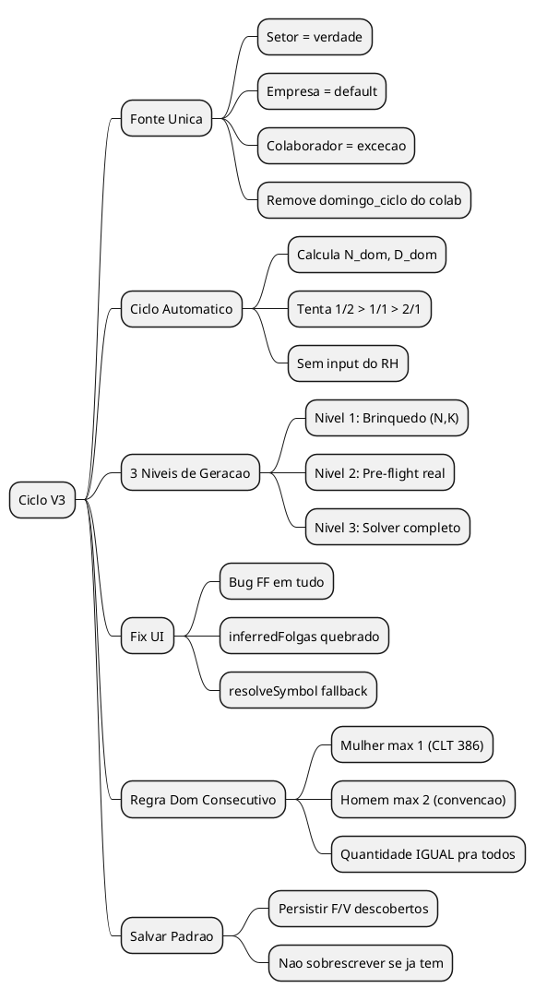
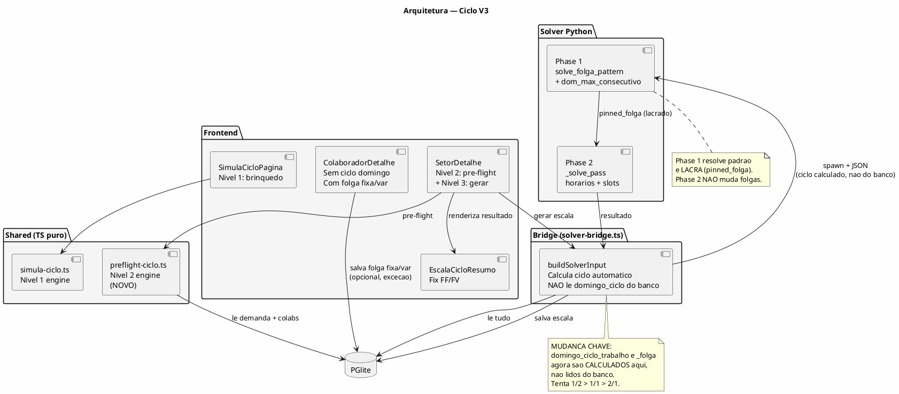
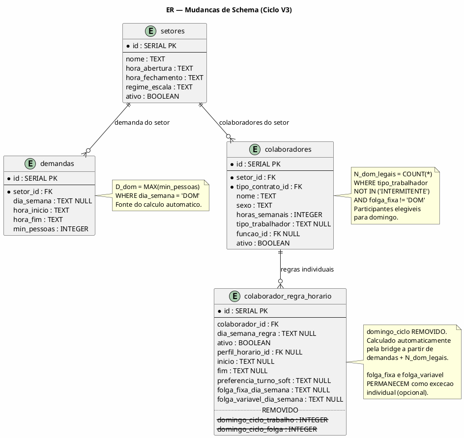
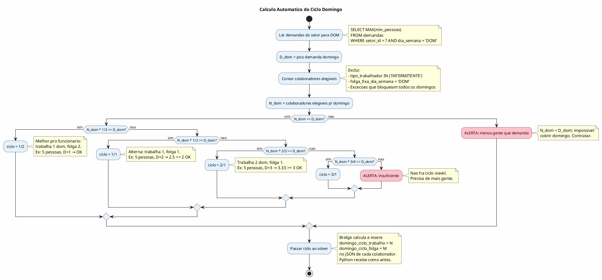
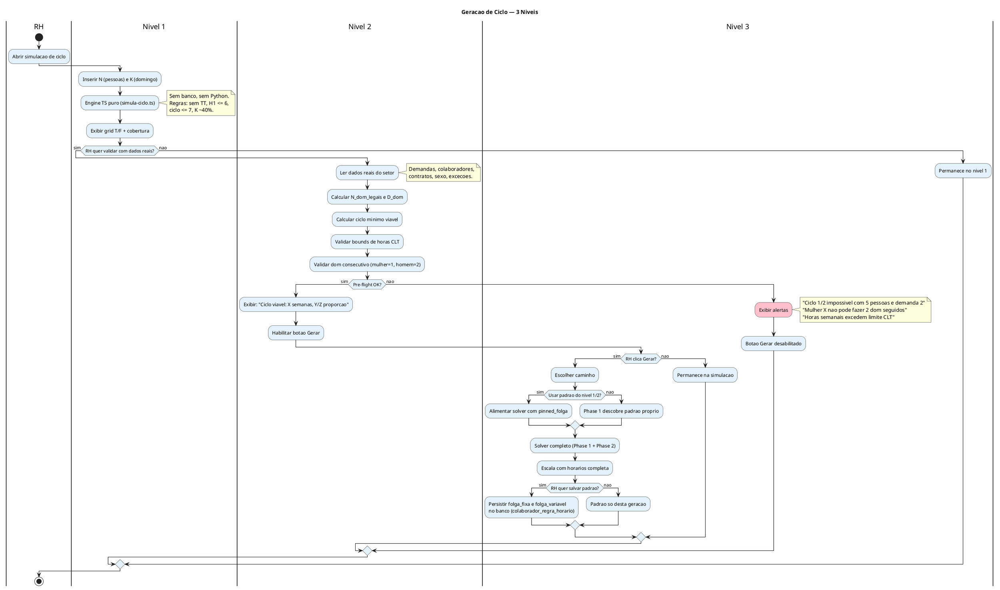
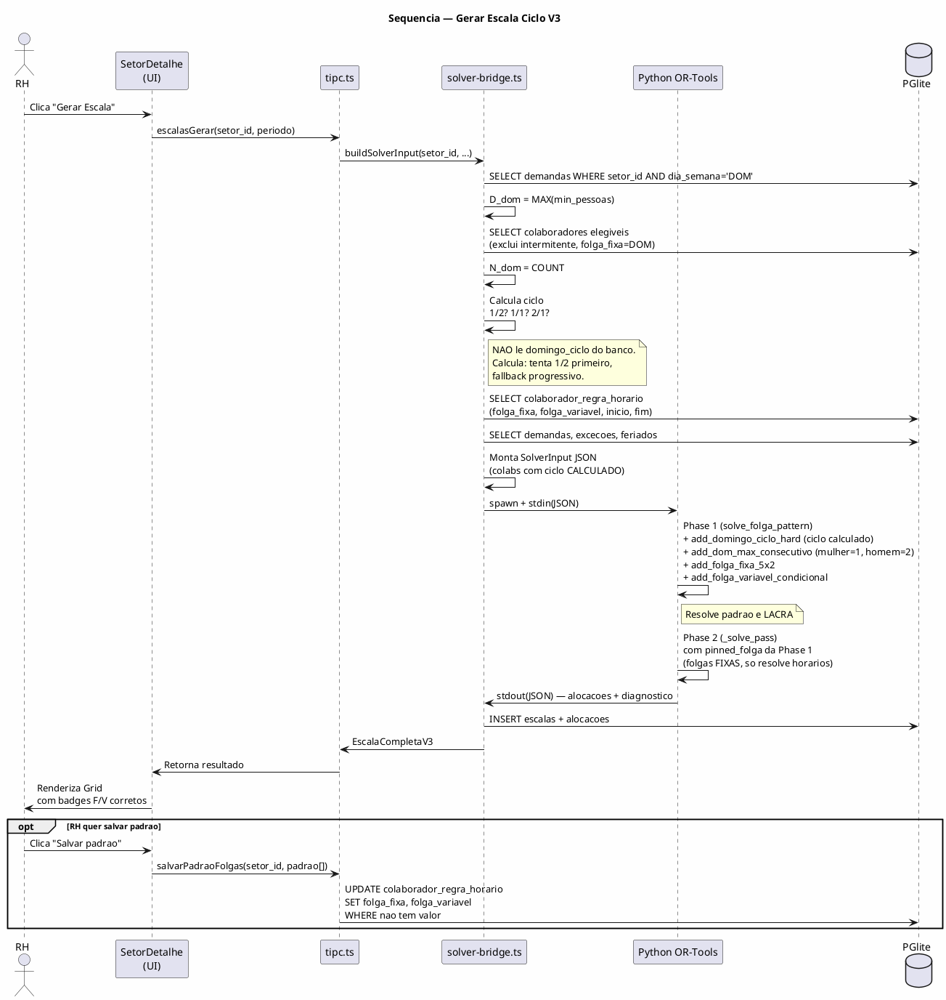
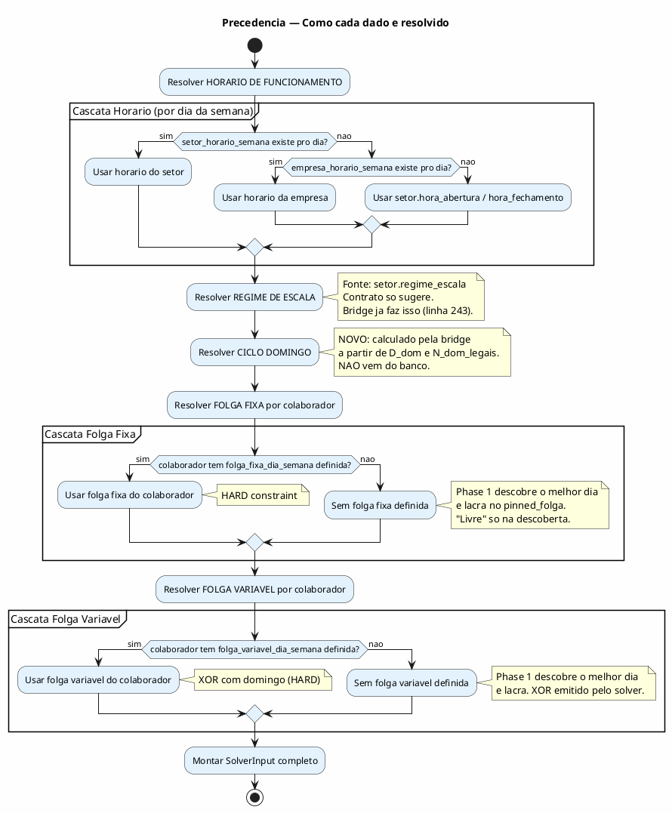

# BUILD — Ciclo V3: Fonte Unica + Geracao em 3 Niveis

> Arquitetura completa para reorganizar fontes de verdade, auto-calcular ciclo domingo,
> corrigir bugs FF/FV, e implementar geracao de ciclo em 3 niveis.
> Data: 2026-03-13 | Atualizado: 2026-03-13 20h
> Status: FASES 1-3 IMPLEMENTADAS — bugs criticos identificados, UI pendente de redesign

---

## 0. STATUS DE IMPLEMENTACAO (atualizado)

### O que JA FOI FEITO

| Item | Arquivo(s) | Status |
|------|-----------|--------|
| Migration v22 (domingo_ciclo nullable) | schema.ts | FEITO |
| calcularCicloDomingo automatico (1/2→1/1→2/1) | solver-bridge.ts | FEITO |
| Remover domingo_ciclo de types/tipc/tools/UI | types.ts, tipc.ts, tools.ts, ColaboradorDetalhe.tsx | FEITO |
| Constraint add_dom_max_consecutivo (mulher=1, homem=2) | constraints.py, solver_ortools.py | FEITO |
| Fix inferredFolgas (3 cenarios) | EscalaCicloResumo.tsx | FEITO |
| Fix resolveSymbol (FF/FV match dia) | EscalaCicloResumo.tsx | FEITO |
| Guard H10 intermitente (horas_semanais=0) | validacao-compartilhada.ts | FEITO |
| Validador H3 por sexo (mulher HARD, homem SOFT) | validacao-compartilhada.ts | FEITO |
| Pinned folga externo (bridge + Python + IPC) | solver-bridge.ts, solver_ortools.py, tipc.ts | FEITO |
| Servico renderer pinnedFolgaExterno | escalas.ts | FEITO |
| Handler salvarPadraoFolgas | tipc.ts, colaboradores.ts | FEITO |
| SimulaCicloSetor componente | SimulaCicloSetor.tsx | FEITO mas ERRADO (ver bugs) |
| Testes: typecheck + parity + rule-policy | - | PASSANDO |

### BUGS CRITICOS IDENTIFICADOS

#### BUG 1: XOR cross-week conflita com dias_trabalho — ✅ RESOLVIDO

**Descricao:** A constraint `add_folga_variavel_condicional` ligava domingo da semana N com
o dia variavel da semana N+1 (offset positivo: DOM + 1 = SEG proxima semana).
**Fix aplicado:** offset negativo (mesma semana). Verificado por code review.

Isso causa:
- Semana que trabalhou DOM: so 1 folga (fixa) = 6 dias de trabalho
- Semana seguinte: 2 folgas (fixa + variavel) = 4 dias de trabalho

Mas `add_dias_trabalho` exige EXATAMENTE 5 por semana (5x2). Conflito direto.

**Efeito observado:** Quando o RH configura folga_variavel pra alguem, o solver
ou remove todos os domingos como trabalho (pra evitar o conflito) ou relaxa
dias_trabalho (pass 2), gerando semanas com 6 ou 4 dias.

**Localizacao:** `solver/constraints.py:960-978` (OFFSET positivo)

**Possivel fix (mesma semana):**
```python
# ANTES: OFFSET = {"SEG": 1, "TER": 2, ...} → proxima semana
# DEPOIS: offset negativo → mesma semana
# DOM(d=6) - 6 = SEG(d=0) da mesma semana
OFFSET_SAME_WEEK = {"SEG": -6, "TER": -5, "QUA": -4, "QUI": -3, "SEX": -2, "SAB": -1}

# XOR mesma semana: se trabalha DOM, descansa no dia variavel da MESMA semana
# Resultado: sempre 2 folgas por semana (fixa + variavel-ou-dom) = 5x2 OK
```

**QUESTAO EM ABERTO:** O BUILD V2 original diz "semana N+1". Mudar pra mesma semana
altera a semantica. Na pratica, o solver resolve de qualquer jeito (otimiza tudo junto),
e o resultado visual é o mesmo pro RH. Mas precisa validar com o Marco.

Com mesma semana:
- Trabalhou DOM → descansou no dia variavel ANTES (ex: SEG da mesma semana)
- NAO trabalhou DOM → trabalhou no dia variavel
- Sempre 2 folgas/semana. 5x2 perfeito.

#### BUG 2: dom_max_consecutivo nao e regra configuravel — ✅ RESOLVIDO

Regra H3_DOM_MAX_CONSEC adicionada no seed, solver (Phase 1 + Phase 2) le do config,
validador usa resolveRuleSeverity. SolverConfigDrawer auto-renderiza.

#### BUG 3: SimulaCicloSetor e um componente tosco — ✅ RESOLVIDO

Componente deletado. Import removido do SetorDetalhe.

### DEBITO TECNICO ACUMULADO

| Item | Impacto | Status |
|------|---------|--------|
| ~~XOR cross-week (Bug 1)~~ | ~~Solver incorreto~~ | ✅ RESOLVIDO |
| ~~system-prompt.ts~~ | ~~IA desatualizada~~ | ✅ RESOLVIDO |
| ~~SimulaCicloSetor tosco (Bug 3)~~ | ~~UI nao funcional~~ | ✅ DELETADO |
| seed-local com domingo_ciclo morto | Campos inseridos que nao sao usados | BAIXO (nao quebra nada) |
| ~~Regra TT nao configuravel (Bug 2)~~ | ~~RH nao pode afrouxar~~ | ✅ RESOLVIDO |
| SOFT H3 no solver = OFF | UX inconsistente (solver ignora, validador reporta) | BAIXO |

### QUESTOES EM ABERTO (para discutir com Marco)

**Q1: XOR mesma semana vs proxima semana**
O BUILD V2 diz "semana N+1" mas isso conflita com 5x2. Mudar pra mesma semana
resolve o conflito matematico. O resultado pro RH seria identico (o solver distribui
as folgas da mesma forma, so a relacao temporal muda). Confirma?

**Q2: UI da simulacao — um layout pra tudo**
O Marco quer que Simulacao, Oficial e Historico usem o MESMO EscalaCicloResumo.
A simulacao seria EscalaCicloResumo alimentado pelo gerarCicloFase1 (sem solver).
Pra isso precisa:
- Converter output do Nivel 1 (grid T/F) pra formato Escala + Alocacao[]
- O EscalaCicloResumo com onFolgaChange ativo (editar F/V inline)
- Botao "Aplicar padrao" que roda auto-calculo e preenche F/V
- Se RH editou manual, auto desliga. Botao "Recalcular" religa.
- Avisos de validacao inline (TT, H1, cobertura insuficiente)

**Q3: Gerar Escala = solver usa o que ta na simulacao**
Quando clica "Gerar Escala", o solver pega as folga_fixa/variavel que estao
na simulacao (nao no banco). Se nao salvou, perdeu. O pinned_folga_externo
ja esta implementado pra isso — mas o mapeamento postos→colaboradores→indices
ainda nao esta feito.

**Q4: "Aplicar padrao" vs "Recalcular" vs editar manual**
Fluxo proposto:
1. Ao entrar na tab Simulacao → gerarCicloFase1 roda automaticamente
2. Grid aparece com T/FF/FV/DT/DF
3. Colunas Variavel e Fixo editaveis (dropdown inline)
4. Se RH edita manualmente → flag "manual_editado = true"
5. Avisos aparecem se a config manual tem problemas (TT, cobertura, etc)
6. Botao "Recalcular automatico" reseta pra gerarCicloFase1 (perde edits manuais)
7. "Gerar Escala" envia pro solver com o padrao atual

**Q5: Simplificar controles**
- Remover seletores de periodo (fixo 3 meses)
- "Configurar" sem texto "rapido" (so icone + "Configurar")
- Oficial, historico mantem como estao

---

## TL;DR

6 mudancas no sistema:

1. **Fonte unica de verdade** — setor manda, empresa = default, colaborador = excecoes
2. **Ciclo domingo automatico** — remove `domingo_ciclo` do colaborador, solver calcula (tenta 1/2 → 1/1 → 2/1)
3. **Fix FF/FV na UI** — corrigir `resolveSymbol` + `inferredFolgas` no EscalaCicloResumo
4. **Regra dom consecutivo** — mulher max 1 (Art. 386 CLT), homem max 2 (convenção)
5. **Geracao em 3 niveis** — Nivel 1 (brinquedo), Nivel 2 (pre-flight real), Nivel 3 (solver)
6. **Salvar padrao** — RH pode persistir folga fixa/variavel descoberta pelo solver

**O que foi DESCARTADO:** configuracao manual de ciclo domingo pelo RH.
O sistema calcula. O RH nao precisa entender a matematica.

---

## 1. MODELO CONCEITUAL

### 1.1 Fonte Unica de Verdade

O problema atual: a escala se monta de pedacos espalhados em 4 lugares.

```
ESTADO ATUAL (Frankenstein):
──────────────────────────────────────────────────────────

EMPRESA
├── hora_abertura / hora_fechamento     → default global
├── tolerancia_semanal_min              → parametro CLT
├── min/max_intervalo_almoco_min        → parametro CLT
├── grid_minutos                        → global
├── corte_semanal                       → global
└── empresa_horario_semana (por dia)    → default por dia

TIPO_CONTRATO
├── horas_semanais                      → lei CLT
├── regime_escala                       → 5X2/6X1 (mas setor sobrescreve!)
├── dias_trabalho                       → derivado do regime
└── max_minutos_dia                     → teto CLT

SETOR
├── hora_abertura / hora_fechamento     → sobrescreve empresa
├── regime_escala                       → sobrescreve contrato (!)
├── setor_horario_semana (por dia)      → sobrescreve empresa
└── demandas                            → cobertura por faixa

COLABORADOR
├── horas_semanais                      → REDUNDANTE com contrato (override)
└── evitar_dia_semana / prefere_turno   → soft preferences

COLABORADOR_REGRA_HORARIO
├── domingo_ciclo_trabalho / folga      → POR COLABORADOR (ERRADO!)
├── folga_fixa_dia_semana               → por colaborador (ok — excecao)
├── folga_variavel_dia_semana           → por colaborador (ok — excecao)
├── inicio / fim                        → restricao de horario
└── preferencia_turno_soft              → soft
```

O modelo correto:

```
MODELO CORRETO:
──────────────────────────────────────────────────────────

SETOR = FONTE DE VERDADE DA ESCALA
├── hora_abertura / hora_fechamento (por dia — via setor_horario_semana)
├── regime_escala (5X2 / 6X1)
├── demandas (cobertura por faixa horaria/dia)
└── O SOLVER CALCULA A PARTIR DAQUI:
    ├── Ciclo domingo: tenta 1/2, fallback 1/1, fallback 2/1
    ├── Folga fixa: Phase 1 descobre e lacra
    └── Folga variavel: Phase 1 descobre e lacra

EMPRESA = DEFAULT (quando setor nao especifica)
├── hora_abertura / hora_fechamento (default)
├── tolerancia, almoco, grid (parametros CLT)
└── NAO TRAVA — so preenche lacuna

TIPO_CONTRATO = LEI CLT (imutavel)
├── horas_semanais, max_minutos_dia
└── regime_escala como SUGESTAO (setor sobrescreve)

COLABORADOR = SO EXCECOES INDIVIDUAIS
├── horas_semanais (override individual — acordo diferente do contrato)
├── Preferencias soft (turno, evitar dia)
├── Folga fixa (HARD individual — opcional, Phase 1 descobre se vazio)
├── Folga variavel (condicional individual — opcional, Phase 1 descobre se vazio)
├── Restricao de horario (entrada fixa, saida maxima)
└── Excecoes por data (ferias, atestado, bloqueio)
```

**Mudanca chave:** `domingo_ciclo_trabalho` e `domingo_ciclo_folga` SAEM do colaborador.
O solver calcula baseado na demanda do setor + numero de pessoas elegiveis.

### 1.2 As 2 Folgas do 5x2 (recap do BUILD V2)

Todo CLT 5x2 tem 2 folgas por semana, sempre:
- **Folga FIXA**: mesmo dia toda semana (ex: SAB). HARD constraint.
- **Folga VARIAVEL**: dia condicional ao domingo da semana anterior.

```
Semana onde TRABALHOU domingo:
  Folgas = FIXA (ex: SAB) + VARIAVEL (ex: SEG) = 2 folgas

Semana onde NAO trabalhou domingo:
  Folgas = FIXA (ex: SAB) + DOMINGO (o proprio dom) = 2 folgas
```

A folga variavel e SEMPRE no mesmo dia da semana. O que muda e se ela ATIVA ou nao:
- Trabalhou DOM → variavel ATIVA (folga nesse dia)
- NAO trabalhou DOM → variavel INATIVA (trabalha nesse dia, dom ja e a folga)

O padrao e 100% deterministico e previsivel. Nunca aleatorio.

Constraint XOR no solver: `works_day[c, dom] + works_day[c, dia_var] == 1`

### 1.3 Calculo Automatico do Ciclo Domingo

O RH NAO configura ciclo. O sistema calcula:

```
ENTRADA:
  D_dom = pico de demanda no domingo (da tabela demandas do setor)
  N_dom = colaboradores que PODEM trabalhar domingo
          (exclui INTERMITENTE e quem tem folga_fixa=DOM)

CALCULO (tenta melhor pro funcionario primeiro):
  1. Tenta 1/2: N_dom × (1/3) >= D_dom? → SIM = usa 1/2
  2. Tenta 1/1: N_dom × (1/2) >= D_dom? → SIM = usa 1/1
  3. Tenta 2/1: N_dom × (2/3) >= D_dom? → SIM = usa 2/1
  4. Tenta 3/1: N_dom × (3/4) >= D_dom? → SIM = usa 3/1
  5. Nenhum funciona → ALERTA: insuficiente

NOTA: Estagiario TRABALHA domingo e entra no calculo de N_dom.
      So INTERMITENTE e quem tem folga_fixa=DOM sao excluidos.
      APRENDIZ nao existe no Fernandes — ignorar.

EXEMPLO (Acougue: 5 pessoas, demanda 2 no dom):
  1/2: 5 × 0.33 = 1.67 < 2 → NAO
  1/1: 5 × 0.50 = 2.50 >= 2 → SIM! Usa 1/1

CICLO EMERGENTE:
  ciclo = N_dom / gcd(N_dom, D_dom) = 5 / gcd(5,2) = 5 semanas
```

Sempre prefere mais folgas de domingo pro funcionario.
Se a equipe muda (entra/sai gente), recalcula automaticamente.

### 1.4 Os 3 Niveis de Geracao

```
┌─────────────────────────────────────────────────────────────┐
│ NIVEL 1 — Brinquedo (N, K)                                  │
│ Input: N pessoas, K no domingo                               │
│ Regras: sem TT, H1 <= 6, ciclo <= 7 semanas, K ~40%        │
│ Output: Grid T/F, fixa/variavel inferidas                    │
│ Sem banco. Sem Python. Sub-segundo.                          │
│ Onde: SimulaCicloPagina.tsx + simula-ciclo.ts                │
├─────────────────────────────────────────────────────────────┤
│ NIVEL 2 — Pre-flight inteligente (dados reais)               │
│ Input: setor real (demanda, colaboradores, contratos, sexo)  │
│ Calcula: N_dom_legais, D_dom, ciclo minimo, bounds horas    │
│ Valida: mulher max 1 dom consec, homem max 2                │
│ Output: "Existe ciclo legal? Quantas semanas? Proporcao?"   │
│ SEM slots de horario. So viabilidade.                        │
│ Onde: TypeScript puro (bridge ou novo modulo)                │
├─────────────────────────────────────────────────────────────┤
│ NIVEL 3 — Solver completo                                    │
│ Input: o que passou em 1 e 2                                 │
│ Solver: Phase 1 (padrao folgas) + Phase 2 (horarios)        │
│ Opcao A: Phase 1 descobre padrao proprio                    │
│ Opcao B: Alimentar com pinned_folga do nivel 1/2            │
│ Botao Gerar so habilita se pre-flight (nivel 2) passar      │
│ Output: Escala completa com horarios                         │
│ Onde: solver_ortools.py (ja existe)                          │
└─────────────────────────────────────────────────────────────┘
```

O nivel 3 NAO sobrescreve folga fixa/variavel se ja estiverem configurados.
O RH pode "salvar padrao" apos simulacao — persiste no banco.

### 1.5 Regra Mulher/Homem (Dom Consecutivo)

Baseado em CLT e convencao:

| Sexo | Max dom consecutivos | Fundamento | Tipo no solver |
|------|---------------------|------------|----------------|
| Mulher | 1 | Art. 386 CLT | HARD |
| Homem | 2 | Convencao/jurisprudencia | HARD (relaxavel em pass 3) |

**IMPORTANTE:** A QUANTIDADE de domingos e IGUAL pra todos (mesmo ciclo N/M).
A diferenca e so no PADRAO consecutivo (mulher nao repete, homem pode ate 2).
Igualitarismo de quantidade, protecao legal de padrao.

Isso substitui o comportamento atual onde H3 (domingo ciclo) e so soft.

### 1.6 O Que Muda vs O Que Fica

```
REMOVE:
  ✗ domingo_ciclo_trabalho do colaborador_regra_horario
  ✗ domingo_ciclo_folga do colaborador_regra_horario
  ✗ Campos de ciclo domingo no ColaboradorDetalhe.tsx
  ✗ Leitura desses campos no solver-bridge.ts

ADICIONA:
  + Calculo automatico de ciclo na bridge (N_dom, D_dom → N/M)
  + Constraint add_dom_max_consecutivo (mulher=1, homem=2)
  + Nivel 2 pre-flight (validacao real do setor)
  + Opcao "salvar padrao" (persiste F/V descobertos)
  + Validacao de viabilidade antes de habilitar Gerar

CORRIGE:
  ~ resolveSymbol no EscalaCicloResumo (bug FF em tudo)
  ~ inferredFolgas no EscalaCicloResumo (inferencia quebrada)
  ~ Phase 1 usa ciclo calculado ao inves de lido do banco

MANTEM:
  ✓ folga_fixa_dia_semana no colaborador (excecao individual)
  ✓ folga_variavel_dia_semana no colaborador (excecao individual)
  ✓ Toda a logica de constraints.py (XOR, folga fixa, etc)
  ✓ Phase 1 / multi-pass do solver
  ✓ Nivel 1 simulacao (SimulaCicloPagina + simula-ciclo.ts)
  ✓ EscalaCicloResumo (apos fix)
  ✓ ResumoFolgas, badges F/V no Grid/Timeline
```

---

## 2. DIAGRAMAS

### 2.1 Escopo (Mind Map)



### 2.2 Componentes (Arquitetura)



### 2.3 Mudancas no Schema (ER)



### 2.4 Calculo Automatico do Ciclo (Activity)



### 2.5 Fluxo dos 3 Niveis (Activity)



### 2.6 Sequencia: Geracao Completa (Nivel 3)



### 2.7 Precedencia de Fontes de Verdade (Activity)



---

## 3. BUGS E FIXES

### 3.1 Fix FF/FV no EscalaCicloResumo

**Bug:** TODAS as folgas aparecem como FF. A folga variavel nunca aparece como FV.

**Causa raiz (EscalaCicloResumo.tsx):**

```
PROBLEMA 1 — inferredFolgas (linha 343):
  if (regra?.folga_fixa_dia_semana && regra?.folga_variavel_dia_semana)
                                   ↑
  So entra se AMBOS existem. Se so 1 existe, cai na inferencia
  por contagem que e fragil e pode retornar variavel=null.

PROBLEMA 2 — resolveSymbol (linha 404-406):
  const inf = inferredFolgas.get(colab.id)
  if (inf?.variavel === dia) return 'FV'
  return 'FF'   ← FALLBACK E SEMPRE FF!
  Se variavel e null, TODA folga vira FF.
```

**Fix:**

```
inferredFolgas — 3 cenarios:

1. AMBOS definidos na regra → usar direto (ja funciona)

2. SO folga_fixa definida, variavel=null:
   → fixa = da regra
   → variavel = null (sem XOR configurado)
   → resolveSymbol: folga no dia fixo = FF, demais folgas = "F" (generica)

3. AMBOS vazios:
   → Tentar inferir da Phase 1 / pinned_folga
   → Se nao tem dados, mostrar "F" generico (nao FF nem FV)
   → NAO adivinhar

resolveSymbol — logica corrigida:
  if (dia === 'DOM') return 'DF'
  if (inf?.fixa && inf.fixa === dia) return 'FF'   ← so se BATE com o dia
  if (inf?.variavel && inf.variavel === dia) return 'FV'  ← so se BATE
  return 'F'  ← folga generica (novo simbolo? ou usar FF com visual diferente)
```

### 3.2 Fix Ciclo Incompativel

**Bug:** Quando o RH configura ciclo 1/2 pra 5 pessoas com demanda 2 no domingo,
o solver produz resultado estranho (todos domingos como folga, ou distribuicao injusta).

**Causa raiz:**

```
1/2 com 5 pessoas e D_dom=2:
  5 × (1/3) = 1.67 < 2 → INFEASIBLE na Phase 1

Phase 1 falha → pinned_folga = null
Pass 2 roda sem pin → domingo_ciclo e so SOFT (penalidade)
Headcount de domingo e HARD (>=2)
Solver viola soft pra cumprir hard → resultado inconsistente
```

**Fix:** Remover ciclo do colaborador. Bridge calcula ciclo viavel automaticamente.
Com 5 pessoas e D_dom=2, bridge calcula 1/1 (que funciona: 5 × 0.5 = 2.5 >= 2).
Phase 1 resolve com ciclo correto → pinned_folga funciona → resultado consistente.

---

## 4. ESTRUTURA DE CODIGO

### 4.1 Arquivos que mudam

```
MUDANCAS PRINCIPAIS:
──────────────────────────────────────────────────

src/main/db/
├── schema.ts           ← migration v19: DROP domingo_ciclo_trabalho/folga
└── (seed.ts nao muda)

src/main/motor/
└── solver-bridge.ts    ← Calcula ciclo automatico (N_dom, D_dom → N/M)
                          Remove leitura domingo_ciclo do banco

solver/
├── constraints.py      ← NOVA: add_dom_max_consecutivo (mulher=1, homem=2)
└── solver_ortools.py   ← Chama nova constraint

src/shared/
├── types.ts            ← Remove domingo_ciclo de RegraHorarioColaborador
└── simula-ciclo.ts     ← Ja existe (Nivel 1)

src/renderer/src/
├── paginas/
│   ├── ColaboradorDetalhe.tsx    ← Remove campos ciclo domingo da UI
│   ├── SetorDetalhe.tsx          ← Integrar Nivel 2 pre-flight
│   └── SimulaCicloPagina.tsx     ← Ja existe (Nivel 1)
├── componentes/
│   └── EscalaCicloResumo.tsx     ← Fix resolveSymbol + inferredFolgas
└── servicos/
    └── colaboradores.ts          ← Remove tipos domingo_ciclo

NOVO:
──────────────────────────────────────────────────

src/shared/
└── preflight-ciclo.ts  ← Nivel 2 engine (TS puro)
                          Calcula N_dom, D_dom, ciclo viavel,
                          bounds horas, dom_max_consec

src/main/ia/
├── tools.ts            ← Remove domingo_ciclo de CAMPOS_VALIDOS
└── system-prompt.ts    ← Atualizar schema ref

IMPACTO MINIMO (ajuste pontual):
──────────────────────────────────────────────────

src/main/tipc.ts        ← Remove domingo_ciclo de handlers
                          Add handler salvarPadraoFolgas
src/main/motor/
└── validacao-compartilhada.ts  ← Remover refs a domingo_ciclo se houver
```

### 4.2 Detalhamento por Arquivo

**`schema.ts` — Migration v19 (Remove domingo_ciclo)**
```sql
-- v19: Ciclo domingo automatico — remove config manual
ALTER TABLE colaborador_regra_horario
  DROP COLUMN IF EXISTS domingo_ciclo_trabalho;
ALTER TABLE colaborador_regra_horario
  DROP COLUMN IF EXISTS domingo_ciclo_folga;
```

**`solver-bridge.ts` — Calculo automatico do ciclo**
```typescript
// ANTES (le do banco):
c.domingo_ciclo_trabalho = padrao.domingo_ciclo_trabalho
c.domingo_ciclo_folga = padrao.domingo_ciclo_folga

// DEPOIS (calcula):
const { cicloTrabalho, cicloFolga } = calcularCicloDomingo(setorId, colabRows)
// Aplica a TODOS os colabs elegiveis (nao intermitente):
c.domingo_ciclo_trabalho = cicloTrabalho
c.domingo_ciclo_folga = cicloFolga

// Funcao:
function calcularCicloDomingo(demandas, colabRows) {
  const dDom = Math.max(...demandas.filter(d => d.dia_semana === 'DOM').map(d => d.min_pessoas), 0)
  const nDom = colabRows.filter(c =>
    !['INTERMITENTE'].includes(c.tipo_trabalhador ?? '') &&
    regraGroupByColab.get(c.id)?.padrao?.folga_fixa_dia_semana !== 'DOM'
  ).length

  if (dDom === 0 || nDom === 0) return { cicloTrabalho: 0, cicloFolga: 1 }

  // Tenta melhor pro funcionario primeiro
  if (nDom * (1/3) >= dDom) return { cicloTrabalho: 1, cicloFolga: 2 }  // 1/2
  if (nDom * (1/2) >= dDom) return { cicloTrabalho: 1, cicloFolga: 1 }  // 1/1
  if (nDom * (2/3) >= dDom) return { cicloTrabalho: 2, cicloFolga: 1 }  // 2/1
  if (nDom * (3/4) >= dDom) return { cicloTrabalho: 3, cicloFolga: 1 }  // 3/1
  return { cicloTrabalho: nDom, cicloFolga: 0 }  // todos trabalham todo domingo
}
```

**`constraints.py` — Nova constraint dom max consecutivo**
```python
def add_dom_max_consecutivo(
    model: cp_model.CpModel,
    works_day: WorksDay,
    colabs: List[dict],
    C: int,
    sunday_indices: List[int],
    blocked_days: Dict[int, set],
) -> None:
    """HARD: max domingos consecutivos trabalhados.

    Mulher (sexo='F'): max 1 (Art. 386 CLT)
    Homem (sexo='M'): max 2 (convencao/jurisprudencia)

    Constraint: sliding window de max+1 domingos, sum <= max.
    """
    for c in range(C):
        sexo = colabs[c].get("sexo", "M")
        max_consec = 1 if sexo == "F" else 2

        available_suns = [d for d in sunday_indices
                         if d not in blocked_days.get(c, set())]

        window = max_consec + 1
        for i in range(len(available_suns) - window + 1):
            suns = available_suns[i : i + window]
            model.add(sum(works_day[c, d] for d in suns) <= max_consec)
```

**`solver_ortools.py` — Integrar nova constraint**
```python
# Em solve_folga_pattern (Phase 1), apos add_domingo_ciclo_hard:
add_dom_max_consecutivo(model, works_day, colabs, C, sunday_indices, blocked_days)

# Em _solve_pass (Phase 2), na secao de constraints hard:
add_dom_max_consecutivo(model, works_day, colabs, C, sunday_indices, blocked_days)
```

**`preflight-ciclo.ts` — Nivel 2 engine (NOVO)**
```typescript
export interface PreflightCicloInput {
  setor_id: number
  demandas: { dia_semana: string; min_pessoas: number }[]
  colaboradores: {
    id: number
    sexo: 'M' | 'F'
    tipo_trabalhador: string | null
    horas_semanais: number
    folga_fixa_dia_semana: string | null
  }[]
}

export interface PreflightCicloOutput {
  viavel: boolean
  ciclo_trabalho: number
  ciclo_folga: number
  ciclo_semanas: number
  n_dom_legais: number
  d_dom: number
  alertas: string[]
  bounds_horas: { min_semanal: number; max_semanal: number }
  dom_max_consecutivo: { mulheres: number; homens: number }
}
```

**`EscalaCicloResumo.tsx` — Fix resolveSymbol**
```typescript
// ANTES:
if (inf?.variavel === dia) return 'FV'
return 'FF'   // tudo vira FF

// DEPOIS:
if (inf?.fixa && inf.fixa === dia) return 'FF'     // so se dia BATE com fixa
if (inf?.variavel && inf.variavel === dia) return 'FV'  // so se dia BATE com var
if (dia === 'DOM') return 'DF'
return 'FF'   // fallback pra folga sem classificacao (ou novo simbolo 'F')
```

**`ColaboradorDetalhe.tsx` — Remove campos ciclo**
```
REMOVER do regraForm:
  - domingo_ciclo_trabalho
  - domingo_ciclo_folga

REMOVER do JSX:
  - <Label>Ciclo domingo (trabalho/folga)</Label>
  - Os 2 inputs numericos
  - O texto "Ex: 2/1 = trabalha 2 dom, folga 1"

MANTER:
  - Folga fixa (5x2) — select SEG-DOM
  - Folga variavel (cond.) — select SEG-SAB
  - Pref. turno (regra) — select
  - Restricao de horario — radio
```

---

## 5. CONSOLIDACAO

### 5.1 Checklist de Implementacao (atualizado)

#### Fase 1: Schema + Bridge (core) ✅ COMPLETA

- [x] Migration v22 em `schema.ts` — domingo_ciclo nullable
- [x] `solver-bridge.ts` — implementar `calcularCicloDomingo()` com strict > (slack)
- [x] `solver-bridge.ts` — substituir leitura do banco por calculo automatico
- [x] `types.ts` — remover `domingo_ciclo_trabalho/folga` de `RegraHorarioColaborador`
- [x] `tipc.ts` — remover domingo_ciclo de handlers CRUD
- [x] `tools.ts` — remover de CAMPOS_VALIDOS e Zod schema
- [ ] `system-prompt.ts` — atualizar schema ref (PENDENTE — prioridade baixa)
- [x] `npm run typecheck` — 0 erros

#### Fase 2: Constraint dom max consecutivo ✅ PARCIAL

- [x] `constraints.py` — implementar `add_dom_max_consecutivo()` (mulher=1, homem=2)
- [x] `solver_ortools.py` — chamar em Phase 1 e Phase 2
- [x] `solver_ortools.py` — relaxar em pass 3 (ALL_PRODUCT_RULES)
- [x] `validacao-compartilhada.ts` — H3 por sexo (mulher HARD, homem SOFT)
- [x] `validacao-compartilhada.ts` — guard H10 para horas_semanais=0
- [ ] **PENDENTE: Regra configuravel no SolverConfigDrawer** (ver Bug 2)
- [x] Testes passando

#### Fase 3: Fix UI ✅ PARCIAL

- [x] `EscalaCicloResumo.tsx` — fix `resolveSymbol()` e `inferredFolgas`
- [x] `ColaboradorDetalhe.tsx` — remover campos ciclo domingo
- [x] `npm run typecheck` — 0 erros
- [ ] **PENDENTE: Remover SimulaCicloSetor.tsx** (componente tosco — ver Bug 3)
- [ ] **PENDENTE: Redesign da tab Simulacao** (ver Questoes Q2-Q5)

#### Fase 4: Pinned folga externo ✅ MECANICA PRONTA

- [x] Python aceita `pinned_folga_externo` no config
- [x] Bridge passa `pinnedFolgaExterno` pro solver
- [x] IPC `escalas.gerar` aceita campo
- [x] Servico renderer `escalasService.gerar` com campo
- [ ] **PENDENTE: Converter output Nivel 1 → formato pinned_folga** (mapeamento postos → indices)

#### Fase 5: Salvar/Aplicar padrao ✅ HANDLER PRONTO, UI PENDENTE

- [x] Handler `colaboradores.salvarPadraoFolgas` em tipc.ts
- [x] Servico renderer `colaboradoresService.salvarPadraoFolgas`
- [ ] **PENDENTE: UI correta** (botao "Aplicar padrao" no contexto certo — ver Q4)

#### PROXIMAS FASES (NOVAS — baseado em feedback do Marco)

##### Fase 6: Fix XOR cross-week (BUG CRITICO) ✅ RESOLVIDO

- [x] Offset negativo (mesma semana) em constraints.py (linha 961)
- [x] Guard `0 <= var_idx < D` (linha 976)
- [x] Docstring atualizada pra "mesma semana"
- [x] Testes passando

##### Fase 7: Regra TT configuravel ✅ COMPLETA

- [x] `H3_DOM_MAX_CONSEC` adicionado no seed.ts (linha 251, HARD, editavel=true, categoria CLT)
- [x] solver_ortools.py Phase 1: guard `h3_status == "HARD"` (linha 430)
- [x] solver_ortools.py Phase 2: guard `rule_is('H3_DOM_MAX_CONSEC', 'HARD')` (linha 835)
- [x] validacao-compartilhada.ts: severidade via `resolveRuleSeverity` (linha 1095)
- [x] SolverConfigDrawer: auto-renderiza da regra_definicao (sem codigo manual)
- **NOTA:** SOFT no solver = mesma coisa que OFF (sem penalty term dedicado). Validador reporta SOFT.

##### Fase 8: Limpeza e simplificacao UI ✅ COMPLETA

- [x] SimulaCicloSetor.tsx deletado + imports removidos
- [x] system-prompt.ts: removidas refs a domingo_ciclo
- [x] Seletor de periodo: labels limpos (so "3 meses" / "6 meses" / "1 ano", sem datas)
- [x] Botao Configurar: sem texto do solveMode (so icone + "Configurar")

##### Fase 8: Redesign UI tab Simulacao

- [ ] Remover `SimulaCicloSetor.tsx`
- [ ] Tab Simulacao usa EscalaCicloResumo com dados do gerarCicloFase1
- [ ] Converter output Nivel 1 → formato Escala + Alocacao[]
- [ ] Colunas Variavel/Fixo editaveis inline
- [ ] Botao "Aplicar padrao" (auto-calculo, desliga com edit manual)
- [ ] Avisos de validacao (TT, H1, cobertura)
- [ ] Simplificar controles (periodo fixo 3m, Configurar sem texto)
- [ ] "Gerar Escala" usa padrao atual como pinned_folga

### 5.2 Fases e Dependencias (atualizado)

```
Fase 1 (Schema + Bridge) ─────────── ✅ COMPLETA
Fase 2 (Constraint dom max consec) ── ✅ PARCIAL (falta config)
Fase 3 (Fix UI basico) ──────────── ✅ PARCIAL (falta redesign)
Fase 4 (Pinned folga externo) ────── ✅ MECANICA PRONTA
Fase 5 (Salvar/Aplicar padrao) ───── ✅ HANDLER PRONTO
    │
    ├── Fase 6 (Fix XOR) ─────────── CRITICO — bloqueia folga variavel
    │
    ├── Fase 7 (Regra TT config) ─── MEDIO — bloqueia config pelo RH
    │
    └── Fase 8 (Redesign UI) ─────── ALTO — a experiencia completa
         (depende de Fase 6 e decisoes Q1-Q5)
```

### 5.3 Riscos e Mitigacoes (atualizado)

| # | Risco | Impacto | Mitigacao |
|---|-------|---------|-----------|
| 1 | XOR cross-week conflita com dias_trabalho | **CRITICO — folga variavel quebrada** | Fase 6: mudar pra mesma semana (Q1) |
| 2 | Setor sem demanda de domingo cadastrada | D_dom = 0, ciclo = 0/1 | Guard ja existe |
| 3 | Todas mulheres + max 1 dom consec | Limita cobertura | Alerta no pre-flight |
| 4 | Phase 1 INFEASIBLE com ciclo calculado | Constraints cruzadas | Multi-pass degrada |
| 5 | Redesign UI sem spec clara | Retrabalho | Validar Q2-Q5 antes de codar |
| 6 | Intermitente no calculo de N_dom | Intermitente nao tem ciclo | Guard ja existe |
| 7 | Debito tecnico crescente | Complexidade acumula | Resolver Fase 6 antes de Fase 8 |

---

## 6. REFERENCIAS

| Documento | Conteudo |
|-----------|----------|
| `docs/BUILD_CICLOS_V2.md` | BUILD anterior — modelo conceitual F/V, XOR, contratos (base) |
| `docs/PRD_GERACAO_CICLO_3_NIVEIS.md` | PRD dos 3 niveis — transcricao original |
| `docs/MOTOR_V3_RFC.md` | RFC canonico do motor (20 HARD, SOFT) |
| `src/shared/simula-ciclo.ts` | Nivel 1 engine (ja implementado) |
| `src/renderer/src/paginas/SimulaCicloPagina.tsx` | Nivel 1 UI (ja implementado) |
| `solver/constraints.py` | Constraints existentes (folga_fixa, folga_variavel, domingo_ciclo) |
| `solver/solver_ortools.py` | Multi-pass + Phase 1 |
| `src/main/motor/solver-bridge.ts` | Bridge TS → Python |

---

*BUILD Ciclo V3 — "O setor manda. O solver calcula. O RH decide se salva."*
