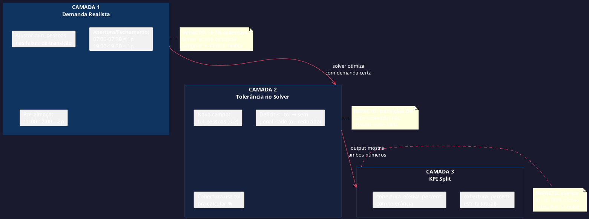
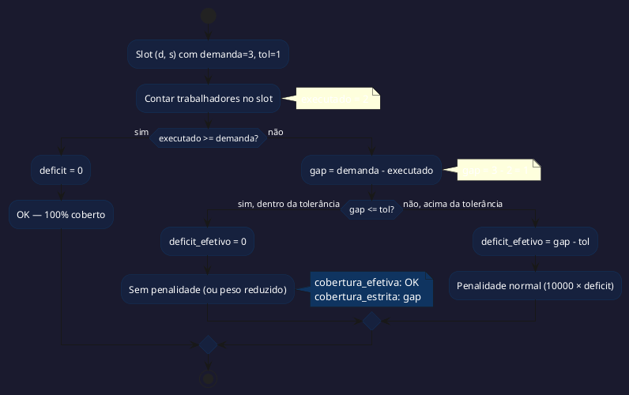

# BUILD: Solver 100% Coverage

> Gerado por BUILD em 2026-03-02
> Input: Análise forense de gaps do solver (balanceado, 8 semanas, Açougue)

---

## 1. Diagnóstico: Por Que Não Bate 100%

### 1.1 Distribuição dos Gaps (478 slots-pessoa de déficit)

```
┌─────────────────────────────────────────────────────┐
│  ABERTURA (07:00-07:30)    ██████ 55 slots (11.5%)  │
│  ALMOÇO PRE (11:00-12:00) ███████ 61 slots (12.8%) │
│  ALMOÇO CORE (12:00-13:30)█████████ 78 slots (16.3%)│
│  ALMOÇO POST (13:30-14:30)████ 39 slots (8.2%)     │
│  FECHAMENTO (19:00-19:30)  ██████ 55 slots (11.5%)  │
│  CORE (resto)              ████████████ 190 (39.7%) │
└─────────────────────────────────────────────────────┘
        ↑ 60.3% dos gaps são em TRANSIÇÕES
```

### 1.2 Causa Raiz

```
┌──────────────────────────────────────────────────────────┐
│  CAFÉ (abertura/fechamento):                             │
│  → Funcionário chega 07:00, café 15min, produtivo 07:15  │
│  → Funcionário sai 19:30, café 15min, produtivo até 19:15│
│  → Demanda pede 2 pessoas nesse intervalo = IMPOSSIVEL   │
│     com 4 trabalhando se 1 tá no café                    │
│                                                          │
│  ALMOÇO (11:00-14:30):                                   │
│  → 4 pessoas trabalhando, todas precisam 1h de almoço    │
│  → Janela 12:00-14:00 = 2h para 4 almoços de 1h         │
│  → Máximo 2 no almoço ao mesmo tempo (demanda=2)         │
│  → MAS o solver não consegue escalonar perfeitamente:    │
│    - Alguém começa almoço às 11:30 (antes da janela)     │
│    - Alguém volta às 14:15 (depois da janela)            │
│    - Esses 15-30min de overlap = gaps                    │
│                                                          │
│  CORE (7 dias pesados):                                  │
│  → Dias onde 2 pessoas têm folga no mesmo dia útil       │
│  → Sobram 3 trabalhadores pro pico de 3 = 0 margem      │
│  → Qualquer almoço/café nesse dia = déficit              │
└──────────────────────────────────────────────────────────┘
```

### 1.3 Conclusão

**O solver NÃO está errado.** A demanda está pedindo o impossível em momentos de transição. 100% de cobertura estrita é matematicamente inviável com 5 pessoas quando:
- Todos precisam de café (15min)
- Todos precisam de almoço (1h)
- E a demanda não abre margem pra isso

---

## 2. Plano: 3 Camadas Para 100%



---

## 3. Camada 1 — Demanda Realista

### 3.1 Perfil Atual vs Proposto (Açougue SEG-SAB)

```
HORA        ATUAL   PROPOSTO   RAZÃO
──────────  ─────   ────────   ─────────────────────────────
07:00-07:30   2        1       Café abertura (15min tolerância)
07:30-08:00   2        2       Chegada normal
08:00-10:00   3        3       Pico manhã (inalterado)
10:00-11:00   3        3       Pico manhã (inalterado)
11:00-12:00   3    →   2       Início stagger almoço
12:00-14:00   2        2       Almoço (inalterado)
14:00-18:00   3        3       Pico tarde (inalterado)
18:00-19:00   2        2       Final expediente
19:00-19:30   2    →   1       Café fechamento (15min tolerância)
```

### 3.2 Pergunta: Expandir almoço pra 11:00-14:00?

```
A questão é: 11:00-12:00 é pico de CLIENTE ou pico de TRANSIÇÃO?

No açougue de supermercado:
  11:00-12:00 = cliente comprando pra almoço (pico!)
  12:00-13:00 = cliente almoçando, loja quieta
  13:00-14:00 = retomada lenta

RECOMENDAÇÃO: 11:00-12:00 demanda = 2 (não 1)
  → Permite que 1 pessoa comece almoço às 11:00
  → Ainda tem 3 trabalhando com 1 no almoço = ok pros clientes
  → Se cliente aparece, 2 pessoas atendem
  → Não precisa de 3 porque 1 tá "se preparando pro rush"

SAÍDA DO ALMOÇO 14:00 — é tarde demais?
  → NÃO. CLT permite almoço até 14:00 sem problema
  → Típico em supermercado: último almoço começa 13:00, volta 14:00
  → O pico de tarde (14:00-18:00) é onde precisa de 3
```

### 3.3 Perfil Domingo (inalterado)

```
DOM 07:00-13:00: 3 pessoas → SEM MUDANÇA
  → Não tem almoço (jornada ≤6h = sem intervalo obrigatório)
  → Não tem café de 15min (só >4h e ≤6h = 1 café, gerenciável)
  → Headcount HARD já garante 3 pessoas
```

### 3.4 Arquivos Afetados

| Arquivo | Mudança |
|---------|---------|
| `src/main/db/seed-local.ts` | Ajustar `acouguePadrao` demandas |

**Nenhuma mudança no solver necessária pra Camada 1.**

---

## 4. Camada 2 — Tolerância no Solver (Opcional)

### 4.1 Conceito

Novo campo opcional em cada segmento de demanda:

```typescript
// src/shared/types.ts — DemandaSegmento
interface DemandaSegmento {
  dia_semana: string
  hora_inicio: string
  hora_fim: string
  min_pessoas: number
  tol_pessoas?: number  // NOVO: 0-2, default 0
  override?: boolean
}
```

```
tol_pessoas = 0 → estrito (padrão): faltou 1 = déficit
tol_pessoas = 1 → tolerante: faltou 1 = OK, faltou 2 = déficit
```

### 4.2 Fluxo no Solver



### 4.3 Impacto no Solver Python

```python
# constraints.py — add_demand_soft() modificado
# Onde hoje:
#   deficit[d,s] >= target - sum(work[c,d,s])
# Passa a ser:
#   deficit[d,s] >= (target - tol) - sum(work[c,d,s])
#
# E adiciona penalidade LEVE pro gap tolerado:
#   soft_gap[d,s] >= target - tol_target - sum(work[c,d,s])  (peso 2000)
```

### 4.4 Arquivos Afetados

| Arquivo | Mudança |
|---------|---------|
| `src/shared/types.ts` | +`tol_pessoas` em `DemandaSegmento` |
| `src/main/motor/solver-bridge.ts` | Passar `tol_pessoas` no JSON |
| `solver/constraints.py` | `add_demand_soft()` usa `tol` |
| `solver/solver_ortools.py` | Parsear `tol_pessoas` da demanda |
| `src/main/db/schema.ts` | +coluna `tol_pessoas` em `demandas` |
| `src/main/db/seed-local.ts` | Setar `tol_pessoas` em faixas de transição |

### 4.5 Quando Usar

```
tol_pessoas = 1 → faixas de transição (café, pré-almoço, pós-almoço)
tol_pessoas = 0 → pico (08:00-11:00, 14:00-18:00)
tol_pessoas = 0 → domingo (já com headcount HARD)
```

---

## 5. Camada 3 — KPI Split

### 5.1 Dois Números de Cobertura

```typescript
// src/shared/types.ts — SolverOutputIndicadores
interface SolverOutputIndicadores {
  cobertura_percent: number          // ESTRITA (atual, inalterada)
  cobertura_efetiva_percent: number  // NOVO: com tolerância
  // ... resto igual
}
```

```
cobertura_percent = (demanda_total - deficit_total) / demanda_total × 100
  → Conta TUDO. Se pediu 3 e tem 2, é déficit de 1. Vai ser ~93%.

cobertura_efetiva_percent = (demanda_total - deficit_efetivo) / demanda_total × 100
  → Ignora gaps dentro da tolerância. Com Camada 1+2, vai ser ~100%.
```

### 5.2 No Output CLI

```
── INDICADORES ─────────────────────
  Cobertura:          93.1%  ███████████████████░
  Cobertura efetiva:  100%   ████████████████████  ← NOVO
```

### 5.3 Arquivos Afetados

| Arquivo | Mudança |
|---------|---------|
| `solver/solver_ortools.py` | `extract_solution()` calcula ambos |
| `src/shared/types.ts` | +`cobertura_efetiva_percent` |
| `scripts/solver-cli.ts` | Exibir ambos indicadores |
| Frontend (`EscalaPagina.tsx`) | Mostrar badge com cobertura efetiva |

---

## 6. Implementação: O Que Fazer Primeiro

### 6.1 Fases Ordenadas por Impacto

| # | Fase | Impacto Esperado | Complexidade | Arquivos |
|---|------|------------------|-------------|----------|
| 1 | **Ajustar demanda seed** | 93% → ~97-98% | Trivial | seed-local.ts |
| 2 | **KPI cobertura_efetiva** | Visibilidade | Baixa | solver_ortools.py, types.ts, CLI |
| 3 | **tol_pessoas no solver** | 98% → ~100% efetiva | Média | schema, bridge, constraints, solver |

### 6.2 Fase 1 — Demanda Seed (5 min)

```
Mudar em seed-local.ts → acouguePadrao:

07:00-07:30: min_pessoas 2 → 1   (café abertura)
07:30-08:00: min_pessoas 2        (inalterado)
08:00-10:00: min_pessoas 3        (inalterado)
10:00-11:00: min_pessoas 3        (inalterado)
11:00-12:00: min_pessoas 3 → 2   (stagger almoço)
12:00-14:00: min_pessoas 2        (inalterado)
14:00-18:00: min_pessoas 3        (inalterado)
18:00-19:00: min_pessoas 2        (inalterado)
19:00-19:30: min_pessoas 2 → 1   (café fechamento)
```

Reset DB → rodar solver → verificar cobertura.

**Se bater 97%+, a Camada 2 (tol_pessoas) pode ficar no backlog.**

### 6.3 Fase 2 — KPI Efetiva (30 min)

Em `extract_solution()`, após calcular `cobertura_percent`:
1. Recalcular deficit ignorando gaps de 1 pessoa em slots com `tol_pessoas > 0`
2. Emitir `cobertura_efetiva_percent` no output

### 6.4 Fase 3 — tol_pessoas Completo (2-3h)

Schema → tipos → bridge → Python → CLI → frontend.

---

## 7. Validação

### Critérios de Sucesso

| Critério | Camada 1 | Camada 1+2 | Camada 1+2+3 |
|----------|----------|------------|-------------|
| Domingos 100% | ✅ (HARD) | ✅ | ✅ |
| Cobertura estrita | >95% | >95% | >95% |
| Cobertura efetiva | — | — | ≥99% |
| Horas semanais | 43h30-44h30 | = | = |
| Violações HARD | 0 | 0 | 0 |

### Riscos

| Risco | Impacto | Mitigação |
|-------|---------|-----------|
| Demanda baixa demais em transições → cliente sem atendimento | Alto | Açougue sempre tem 1+ pessoa, café é rápido (15min) |
| tol_pessoas abre brecha pra solver "relaxar demais" | Médio | tol max 1, peso reduzido (não zero) pra gaps tolerados |
| Solver ainda não bate 100% estrita mesmo com demanda ajustada | Baixo | 7 dias pesados são estruturais (2 folgas no mesmo dia) — aceitável se efetiva = 100% |
