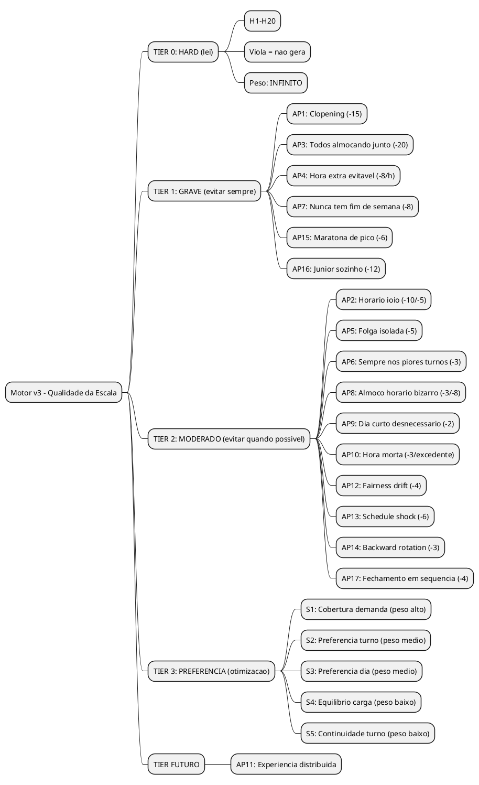

# Motor v3 — Antipatterns: O que e Legal mas Inaceitavel

> **Principio:** Uma escala "legal" pode ser uma merda.
> O motor nao gera so o que a CLT permite. Gera o que FUNCIONA.
> Funcionar = funcionario nao quer pedir demissao + empresa nao perde dinheiro.

> **Base cientifica:** Estes antipatterns sao baseados no **Nurse Scheduling Problem (NSP)**
> — o problema de scheduling mais estudado da pesquisa operacional (NP-hard) — adaptados
> para o contexto de supermercado brasileiro. Fontes incluem:
> - [Springer: Schedules Need to be Fair Over Time](https://link.springer.com/chapter/10.1007/978-3-032-11108-1_3)
> - [Harvard/Kenan-Flagler: Stable Scheduling = +7% vendas](https://www.kenan-flagler.unc.edu/news/stable-scheduling-in-retail-is-good-for-business-and-workers/)
> - [CCOHS/PMC: Forward Rotation e ritmo circadiano](https://www.ccohs.ca/oshanswers/ergonomics/shiftwrk.html)
> - [myshyft: Schedule Fairness Metrics](https://www.myshyft.com/blog/schedule-fairness-metrics/)
> - [Fair Workweek Laws: Predictive Scheduling](https://www.paycom.com/resources/blog/predictive-scheduling-laws/)
> - [Wikipedia: Nurse Scheduling Problem](https://en.wikipedia.org/wiki/Nurse_scheduling_problem)

---

## TL;DR

O motor v3 tem 3 camadas de qualidade:

```
TIER 0 — HARD (lei): 20 regras. Viola = nao gera. Ja definido.

TIER 1 — GRAVE (operacional): Legal mas DESTRUTIVO.
  Motor evita com ALTA prioridade. Se nao conseguir, AVISA.

TIER 2 — MODERADO (inconveniente): Legal mas CHATO.
  Motor evita quando possivel. Nao avisa se nao conseguir.

TIER 3 — PREFERENCIA (otimizacao): Ja existe (S1-S5).
  Motor tenta. Se nao der, ninguem morre.
```

---

## 1. ANTIPATTERNS — RUINS PRA TODO MUNDO

### AP1: CLOPENING (Fechar + Abrir)

**O que e:** Funcionario fecha a loja as 18:00 e abre no dia seguinte as 07:00.
Sao 13h de intervalo — LEGAL (minimo CLT e 11h). Mas...

**Ruim pro funcionario:**
- Chega em casa 18:30. Janta. Toma banho. Dorme 22:00.
- Acorda 05:30 pra chegar as 07:00.
- Dormiu 7h30 NO MAXIMO. Faz isso 3x na semana e vira zumbi.
- Vida social? Zero. Nao da pra sair, nao da pra jantar com a familia com calma.

**Ruim pra empresa:**
- Funcionario cansado = mais erros, mais acidentes, pior atendimento.
- Funcionario que faz clopening toda semana PEDE DEMISSAO. Turnover custa caro.

**Regra do motor:**
```
DESCANSO_CONFORTAVEL: Se possivel, manter >= 13h entre jornadas.
  11h = minimo legal (HARD)
  13h = minimo confortavel (SOFT TIER 1)

  Na pratica com grid 30min:
  - Terminou 18:00 → proximo dia comeca 07:00 (13h) ✅ OK
  - Terminou 18:00 → proximo dia comeca 07:30 (13h30) ✅ MELHOR
  - Terminou 18:00 → proximo dia comeca 06:00 (12h) ⚠️ CLOPENING
```

**Peso: -15 por ocorrencia**

---

### AP2: HORARIO IOIO (Alternancia brutal)

**O que e:** Segunda comeca 07:00, terca comeca 14:00, quarta comeca 08:00.
O corpo nao se adapta. Ritmo circadiano destruido.

**Ruim pro funcionario:**
- Nao consegue criar rotina (academia, escola dos filhos, consulta medica).
- Sono irregular = irritabilidade, problemas de saude.
- Sente que a empresa nao respeita o tempo dele.

**Ruim pra empresa:**
- Funcionario com horario inconsistente rende MENOS.
- Mais absenteismo (atraso, "nao ouvi o despertador").
- Mais reclamacao trabalhista por "jornada variavel sem acordo".

**Regra do motor:**
```
CONTINUIDADE_HORARIO: Manter variacao do hora_inicio <= 1h entre dias consecutivos.

  IDEAL: seg 08:00, ter 08:00, qua 08:00 (variacao 0) ✅✅
  BOM:   seg 08:00, ter 08:30, qua 07:30 (variacao 30min) ✅
  OK:    seg 08:00, ter 09:00, qua 08:00 (variacao 1h) ☑️
  RUIM:  seg 07:00, ter 14:00, qua 08:00 (variacao 7h) ❌ IOIO
```

**Peso: -10 por dia com variacao > 2h, -5 por dia com variacao > 1h**

---

### AP3: TODOS ALMOCANDO JUNTO

**O que e:** 5 funcionarios no setor. Os 5 almocam de 12:00-12:30.
De 12:00-12:30, ZERO pessoas no setor. Cliente chega e ninguem atende.

**Ruim pro funcionario:**
- Nao diretamente, mas indiretamente: se o setor fica vazio, a empresa perde venda,
  pode cortar pessoal, e o funcionario paga o pato.

**Ruim pra empresa:**
- Perda direta de vendas.
- Cliente reclama "fui no acougue e nao tinha ninguem".
- Imagem do supermercado cai.

**Regra do motor:**
```
ESCALONAMENTO_ALMOCO: Nunca mais que 50% dos colaboradores do setor
almocando ao mesmo tempo.

  5 pessoas → max 2 almocando simultaneamente
  4 pessoas → max 2
  3 pessoas → max 1
  2 pessoas → max 1 (NUNCA os 2 juntos)

  Estrategia: escalonar almocos em intervalos de 30min
  Pessoa A: 11:30-12:00
  Pessoa B: 12:00-12:30
  Pessoa C: 12:30-13:00
  Pessoa D: 13:00-13:30
  Pessoa E: 13:30-14:00
```

**Peso: -20 por slot com 0 cobertura por causa de almoco simultaneo**

---

### AP4: HORA EXTRA EVITAVEL

**O que e:** Funcionario A trabalhou 46h (2h extra = custo 50%+).
Funcionario B trabalhou 42h (2h sobrando).
Se B tivesse feito 2h a mais, NINGUEM pagaria extra.

**Ruim pro funcionario (A):**
- Cansaco desnecessario. Ele nao QUERIA fazer extra.
- Se faz extra toda semana, vida pessoal sofre.

**Ruim pra empresa:**
- Cada hora extra custa 50% a mais (minimo). 2h/semana × 4 semanas × R$15/h × 1.5 = R$180/mes
  de gasto evitavel POR FUNCIONARIO.

**Ruim pro funcionario (B):**
- Se trabalha menos que a meta, pode ter desconto. Perde dinheiro.

**Regra do motor:**
```
EQUILIBRIO_META: Minimizar desvio individual da meta semanal.

  META: 44h. TOLERANCIA: +/- 30min.

  IDEAL: Todos entre 43h30 e 44h30 ✅✅
  BOM:   Maioria na meta, 1 ou 2 com +/- 1h ✅
  RUIM:  Alguem com 46h e outro com 42h ❌

  Diferenca: |horasA - horasB| deve ser MINIMA entre todos colabs.
  Metrica: desvio padrao das horas semanais entre colaboradores.
```

**Peso: -8 por hora extra evitavel (que poderia ser redistribuida)**

---

### AP5: FOLGA ISOLADA (Dia perdido)

**O que e:** Trabalha seg-qua, folga qui, trabalha sex-dom.
A folga no meio nao serve pra nada — nao da pra viajar, nao da pra descansar de verdade.

**Ruim pro funcionario:**
- Folga isolada = dia "perdido". Nao descansa mentalmente.
- Preferiria trabalhar qui e folgar sex-sab (bloco de descanso).
- Funcionarios com familia: folga qui sozinho enquanto filhos estao na escola.

**Ruim pra empresa:**
- Funcionario que nunca tem bloco de descanso fica mais estressado.
- Mais chance de burnout e absenteismo.

**Regra do motor:**
```
FOLGA_BLOCO: Preferir folgas adjacentes ou em bloco.

  IDEAL: folga sab + dom (2 dias seguidos) ✅✅
  BOM:   folga sex (1 dia, mas vespera do fim de semana) ✅
  OK:    folga seg (1 dia, comeco da semana — descansou dom) ☑️
  RUIM:  folga qua (isolada no meio da semana) ⚠️

  Se colab tem 2 folgas/semana → JUNTAR em bloco
  Se colab tem 1 folga/semana → preferir adjacente ao domingo
    (dom folga → seg tambem seria otimo, mas CLT nao obriga)
```

**Peso: -5 por folga isolada (sem dia adjacente de folga ou descanso)**

---

## 2. ANTIPATTERNS — RUINS PRO FUNCIONARIO

### AP6: SEMPRE NOS PIORES TURNOS

**O que e:** Jose SEMPRE pega abertura (07:00). Jessica SEMPRE pega fechamento (18:00).
Ninguem pediu pra isso ser assim. O motor "escolheu" e ficou.

**Ruim pro funcionario:**
- Sente injustica. "Por que EU sempre abro a loja?"
- Desmotivacao. Se nao tem rodizio, sente que a empresa nao se importa.
- Se tem preferencia de turno e sempre pega o oposto, e pior ainda.

**Regra do motor:**
```
RODIZIO_ABERTURA_FECHAMENTO: Alternar quem abre e quem fecha.

  Nao precisa ser perfeito. So nao pode ser SEMPRE a mesma pessoa.
  Metrica: ao longo do periodo (mensal), contar quantas vezes cada
  colab pegou abertura e quantas pegou fechamento.
  Diferenca entre max e min deve ser <= 2.

  Jose: 8 aberturas, 4 fechamentos
  Alex: 5 aberturas, 7 fechamentos
  Jessica: 6 aberturas, 6 fechamentos
  → Razoavel ✅

  Jose: 20 aberturas, 0 fechamentos
  Jessica: 0 aberturas, 20 fechamentos
  → INJUSTO ❌
```

**Peso: -3 por desvio acima de 2 na distribuicao de abertura/fechamento**

---

### AP7: NUNCA TEM FINAL DE SEMANA

**O que e:** Funcionario trabalha TODO sabado (legal, CLT 6 dias).
E domingo alternado (legal, rodizio). Na pratica, ele NUNCA tem um sab+dom livre.

**Ruim pro funcionario:**
- Vida social destruida. Churrascos, festas, familia — tudo cai no fim de semana.
- Igreja (se for religioso) — nao consegue ir.
- Filhos em casa — quem cuida?
- Funcionario de supermercado ja sabe que vai trabalhar fim de semana.
  Mas NUNCA ter um sab+dom livre em meses e demais.

**Regra do motor:**
```
FIM_DE_SEMANA_LIVRE: Pelo menos 1 sab+dom livre a cada 4-5 semanas.

  Isso NAO e CLT. E decisao de PRODUTO (humanidade basica).
  O motor tenta combinar: quando o domingo e folga (rodizio),
  colocar o sabado tambem como folga NESSA semana.

  Semana 1: sab trabalha, dom trabalha
  Semana 2: sab trabalha, dom FOLGA (rodizio)
  Semana 3: sab trabalha, dom trabalha
  Semana 4: sab FOLGA, dom FOLGA ← FIM DE SEMANA LIVRE ✅

  Pra compensar: semana 4 tera 5 dias de trabalho com horas maiores.
  44h em 5 dias = 8h48/dia (arredonda pra 9h com grid 30min).
  Viavel se max_minutos_dia = 600 (10h).
```

**Peso: -8 se nenhum fim de semana livre em 5+ semanas**

---

### AP8: ALMOCO EM HORARIO BIZARRO

**O que e:** Almoco as 10:30. Ou as 15:00.
Tecnicamente permitido (H20 diz min 2h antes/depois da jornada).
Mas ninguem almoca as 10:30.

**Ruim pro funcionario:**
- Almoca as 10:30, volta a trabalhar 11:00. As 14:00 ta morrendo de fome de novo.
- Almoca as 15:00, ta morrendo de fome desde 12:00. 3h de sofrimento.
- Nao consegue combinar almoco com colegas/familia.

**Regra do motor:**
```
ALMOCO_HORARIO_NATURAL: Preferir almoco entre 11:00 e 13:30.

  IDEAL: 12:00-12:30 ou 12:00-13:00 ✅✅
  BOM:   11:30-12:00 ou 13:00-13:30 ✅
  OK:    11:00-11:30 ou 13:30-14:00 ☑️
  RUIM:  10:30-11:00 ou 14:00-14:30 ⚠️
  PESSIMO: antes de 10:30 ou depois de 14:30 ❌

  O motor ja posiciona almoco pra maximizar cobertura (spec v3).
  Este AP adiciona: BONUS pra almoco em horario convencional.
```

**Peso: -3 por almoco fora de 11:00-13:30, -8 por almoco fora de 10:30-14:00**

---

### AP9: DIA CURTO QUE NAO VALE A PENA

**O que e:** Funcionario vai trabalhar 4h num sabado. Gasta 30min+30min de transporte.
3h de deslocamento+preparacao pra 4h de trabalho efetivo. Nao compensa.

**Ruim pro funcionario:**
- Gasta gasolina/onibus pra ir e voltar. As vezes o custo do transporte
  come boa parte do salario proporcional daquelas 4h.
- "Perdi o sabado inteiro pra trabalhar meia jornada."
- Preferiria trabalhar 8h na sexta e folgar sabado.

**Ruim pra empresa:**
- Se o funcionario ta infeliz com o dia curto, rende menos.
- Custo de ter o setor aberto com pouca gente pode nao compensar.

**Regra do motor:**
```
DIA_CURTO_JUSTIFICAVEL: Dia curto (4h-5h) so quando a demanda PRECISA.

  Se sabado tem demanda de 2 pessoas so de manha → dia curto faz sentido.
  Se sabado tem demanda o dia inteiro → colocar 8h e dar folga outro dia.

  O motor ja distribui livremente (spec v3).
  Este AP adiciona: preferir POUCOS dias curtos e MAIS dias normais.
  Em vez de 6x 7h20, preferir 5x 8h + 1x 4h OU 4x 9h + 1x 8h.
```

**Peso: -2 por dia curto que poderia ser redistribuido**

---

## 3. ANTIPATTERNS — RUINS PRA EMPRESA

### AP10: HORA MORTA (Sobrelotacao em hora quieta)

**O que e:** 3 funcionarios das 10:00-12:00 quando a demanda e 1 pessoa.
2 funcionarios sendo pagos pra fazer nada.

**Ruim pra empresa:**
- Custo direto: 2 funcionarios × 2h × R$15/h = R$60/dia de hora morta.
- 22 dias uteis = R$1.320/mes jogados fora.

**Regra do motor:**
```
COBERTURA_PROPORCIONAL: Numero de pessoas presente ~ demanda daquele slot.

  Demanda = 1 → max 2 presentes (1 margem)
  Demanda = 2 → max 3 presentes
  Demanda = 3 → max 4 presentes

  O motor ja maximiza cobertura (S1).
  Este AP e o INVERSO: minimizar EXCESSO de cobertura.
  Nao adianta cobrir 15:00-17:00 com 5 pessoas se demanda e 2.
```

**Peso: -3 por pessoa excedente por slot (acima de demanda + 1 margem)**

---

### AP11: EXPERIENCIA MAL DISTRIBUIDA

**O que e:** Todos os funcionarios experientes de manha, todos os novatos a tarde.
Ou pior: novato sozinho abrindo/fechando a loja.

**Ruim pra empresa:**
- Tarde sem experiencia = mais erros, mais desperdicio, pior atendimento.
- Novato sozinho abrindo = risco operacional (nao sabe o protocolo).

**Regra do motor (FUTURO):**
```
Isso exige um campo novo: Colaborador.nivel (junior/pleno/senior) ou rank.
Ja existe campo 'rank' no colaborador. Pode ser usado pra isso.

DISTRIBUICAO_EXPERIENCIA: Em cada turno, pelo menos 1 colab com rank alto.
  Se turno tem 3 pessoas → pelo menos 1 com rank >= 3 (de 1 a 5)

  NOTA: Isso e uma otimizacao futura. Motor v3.0 nao precisa implementar.
  Mas o campo 'rank' ja existe e pode ser usado pra isso.
```

**Peso: -5 por turno com todos juniors (rank <= 2) sem senior (rank >= 4)**

---

## 4. ANTIPATTERNS CIENTIFICOS — DA PESQUISA OPERACIONAL

> Estes antipatterns vem da literatura academica de scheduling (NSP, OR, cronobiologia).
> Sao padroes que o RH NUNCA vai lembrar, mas que a ciencia ja provou que DESTROEM
> a qualidade da escala ao longo do tempo. O motor os detecta automaticamente.

### AP12: FAIRNESS DRIFT (Injustica Acumulada)

**Termo tecnico:** Cumulative Schedule Equity / Preference Accommodation Rate
**Fonte:** [Springer: Schedules Need to be Fair Over Time](https://link.springer.com/chapter/10.1007/978-3-032-11108-1_3)

**O que e:** Cada semana INDIVIDUALMENTE parece justa. Mas ao longo de 4-8 semanas,
um padrao emerge: Maria SISTEMATICAMENTE pega os piores horarios, os piores dias,
as piores combinacoes. Nunca "ruim o suficiente" pra alguem notar numa semana so.
Mas cumulativamente? Ela e a pessoa mais prejudicada do setor.

**Por que e invisivel:**
- O RH olha SEMANA por SEMANA. "Essa semana ta justo." Pronto.
- Ninguem soma as 8 semanas e percebe que Maria SEMPRE saiu perdendo.
- A Maria percebe. Mas nao sabe articular. So sente que "ta injusto".

**Ruim pro funcionario:**
- Desmotivacao silenciosa. Nao e um evento. E uma erosao.
- "Eu sempre pego o pior horario." Ninguem acredita nela porque "cada semana ta justo."
- Principal causa de pedido de demissao em scheduling: perceived unfairness.

**Ruim pra empresa:**
- Perda de bons funcionarios por injustica que ninguem sabia que existia.
- Pesquisa mostra: 87% dos trabalhadores horistas consideram justica de escala
  como fator decisivo pra ficar ou sair da empresa.

**Regra do motor:**
```
JUSTICA_CUMULATIVA: Rastrear indice de satisfacao por colaborador ao longo
do PERIODO INTEIRO (nao semana a semana).

Metricas cumulativas por colaborador:
  - qtd_aberturas vs media do setor
  - qtd_fechamentos vs media do setor
  - qtd_fins_semana_trabalhados vs media
  - qtd_preferencias_atendidas vs total de preferencias
  - horas_extra_acumuladas vs media do setor

INDICE_JUSTICA = media ponderada dessas metricas (0-100)

IDEAL: Todos acima de 60 ✅✅
BOM:   Todos acima de 40 ✅
RUIM:  Alguem abaixo de 40 ❌ (injustica sistematica)
PESSIMO: Alguem abaixo de 20 ❌❌ (discriminacao involuntaria)
```

**O que o motor FAZ:**
- Na geracao: prioriza quem tem indice BAIXO (deve compensacao).
- No reporte: mostra "Maria esta 15% abaixo da media de justica. Considere prioriza-la."

**Peso: -4 por colaborador com indice abaixo de 40**

---

### AP13: SCHEDULE SHOCK (Choque de Escala Semanal)

**Termo tecnico:** Week-to-Week Schedule Instability
**Fonte:** [Harvard Business Review / Kenan-Flagler Study](https://www.kenan-flagler.unc.edu/news/stable-scheduling-in-retail-is-good-for-business-and-workers/)

**O que e:** AP2 cobre ioio DENTRO da semana (seg 07:00, ter 14:00).
Este cobre ioio ENTRE semanas:

```
Semana 1: seg-sex 07:00-15:30 (todo dia manha)
Semana 2: seg-sex 09:30-18:00 (todo dia tarde)
Semana 3: seg-sex 07:00-15:30 (manha de novo)
```

Cada semana INDIVIDUALMENTE e estavel (AP2 nao detecta). Mas o corpo do
funcionario troca de ritmo TODA SEMANA. Na segunda-feira da semana 2, ele
ainda ta no ritmo de acordar 05:30.

**Evidencia cientifica:**
- Estudo Harvard/Gap: estabilidade de scheduling aumentou vendas em 7%
  e sono dos funcionarios em 6-8%.
- 75% dos trabalhadores de varejo nao tem input no horario.
- Instabilidade semanal = principal queixa em pesquisas de satisfacao.

**Ruim pro funcionario:**
- Nao consegue planejar a vida. "Semana que vem eu sou da manha ou da tarde?"
- Academia, escola dos filhos, consulta medica — tudo fica impossivel.
- Sono irregular cronico = irritabilidade, problemas de saude.

**Ruim pra empresa:**
- Funcionario instavel = menos produtivo. Estudo Gap: +7% vendas com estabilidade.
- Mais absenteismo (nao se adapta ao novo horario a tempo).
- Mais erros na abertura (funcionario de tarde fazendo abertura na semana seguinte).

**Regra do motor:**
```
CONTINUIDADE_SEMANAL: Manter padrao SIMILAR entre semanas consecutivas.

Metrica: hora_inicio_media da semana N vs semana N+1.
Se diferenca > 2h → SCHEDULE SHOCK

  Semana 1 media: 07:30 → Semana 2 media: 08:00 = diff 30min ✅✅
  Semana 1 media: 07:30 → Semana 2 media: 09:00 = diff 1h30 ✅
  Semana 1 media: 07:00 → Semana 2 media: 14:00 = diff 7h ❌❌ SHOCK

Se o motor PRECISA trocar o padrao (ex: rodizio de turnos), fazer TRANSICAO
gradual: semana 1 toda manha, semana 2 mista, semana 3 toda tarde.
NAO pular de manha pra tarde direto.
```

**Peso: -6 por semana com choque (diff > 2h da semana anterior)**

---

### AP14: BACKWARD ROTATION (Rotacao Contra o Relogio)

**Termo tecnico:** Backward/Counterclockwise Shift Rotation
**Fonte:** [CCOHS: Rotational Shiftwork](https://www.ccohs.ca/oshanswers/ergonomics/shiftwrk.html),
[PMC: Circadian Principles](https://pmc.ncbi.nlm.nih.gov/articles/PMC5011337/)

**O que e:** Quando o horario PRECISA mudar (porque e impossivel manter estavel),
a DIRECAO da mudanca importa. O ritmo circadiano humano se adapta mais facilmente
a ATRASOS (forward: cedo → tarde) do que a ADIANTAMENTOS (backward: tarde → cedo).

```
FORWARD (bom):  SEG 07:00 → TER 08:00 → QUA 09:00 (atrasa relogio ✅)
BACKWARD (ruim): SEG 14:00 → TER 08:00 → QUA 07:00 (adianta relogio ❌)
```

E o mesmo principio do jet lag: voar pra OESTE (forward) e mais facil de adaptar
do que voar pra LESTE (backward).

**Evidencia cientifica:**
- Rotacao forward reduz niveis de triglicerideos, glicose e catecolaminas (hormonio de estresse).
- Funcionarios em rotacao forward reportam melhor qualidade de sono em 32 meses de follow-up.
- "A forward rotation schedule was prospectively related to less work-family conflict."

**Aplicacao no supermercado:**
Nao temos turno noturno, mas temos manha (07:00-15:30) e tarde (09:30-18:00).
Quando precisar trocar:
- Manha → tarde = forward ✅ (dormiu ate mais tarde, corpo adapta facil)
- Tarde → manha = backward ❌ (precisa acordar 2h mais cedo, corpo sofre)

**Regra do motor:**
```
ROTACAO_FORWARD: Quando mudar horario entre dias, preferir FORWARD.

  hora_inicio[dia N+1] >= hora_inicio[dia N] - 30min → FORWARD ✅
  hora_inicio[dia N+1] < hora_inicio[dia N] - 60min → BACKWARD ⚠️

  Excecoes:
  - Apos folga, reset e aceitavel (o corpo descansou).
  - Variacao <= 30min nao conta (dentro do grid).

Na pratica com grid 30min:
  SEG 08:00 → TER 08:30 → QUA 09:00 → QUI 09:00 → SEX 08:00 (folga sab)
  = Forward progressivo com reset pos-folga ✅✅
```

**Peso: -3 por rotacao backward (diff > 1h pra cedo, sem folga antes)**

---

### AP15: MARATONA DE PICO (Sequencia de Dias Pesados)

**Termo tecnico:** Peak Day Clustering / High-Intensity Stretch
**Contexto:** Varejo tem picos CONHECIDOS: sexta a tarde, sabado dia inteiro,
domingo manha, vespera de feriado, dia 5/pagamento.

**O que e:** Funcionario trabalha SEXTA + SABADO + DOMINGO — os 3 dias de maior
movimento — sem descanso entre eles. Mesmo que as horas estejam OK e o intervalo
entre jornadas seja legal, a INTENSIDADE acumula.

Dia normal = atende 50 clientes. Sabado = atende 150. Domingo = atende 100.
3 dias de pico seguidos = 400 clientes. E como correr uma maratona em 3 dias.

**Ruim pro funcionario:**
- Exaustao fisica e emocional acumulada (3 dias de rush sem pausa).
- A folga na segunda nao compensa porque o corpo/mente precisa de mais
  de 1 dia pra se recuperar de 3 dias de pico.
- Se repetir por varias semanas: burnout.

**Ruim pra empresa:**
- Domingo (3o dia de pico): funcionario ja ta no automatico. Atendimento cai.
- Mais erros no caixa, mais reclamacao de cliente.
- Risco de acidente de trabalho aumenta com fadiga acumulada.

**Regra do motor:**
```
LIMITE_PICO_CONSECUTIVO: Max 2 dias de pico seguidos sem dia leve/folga.

Dias de PICO (definidos por setor):
  - Supermercado generico: sexta tarde, sabado, domingo
  - Acougue: sexta, sabado (churrasco do fds)
  - Padaria: sabado manha, domingo manha

Como o motor sabe o que e pico?
  Demanda[slot] > 80% da max_demanda_semanal → e dia/horario de pico.
  Alternativa: campo configuravel por setor (dias_pico: ['sexta','sabado','domingo']).

Se 3+ dias de pico consecutivos → penaliza.
Se 2 dias de pico + 1 dia leve + mais pico → OK (dia leve = recovery).
```

**Peso: -6 por colaborador com 3+ dias de pico consecutivos**

---

### AP16: JUNIOR SOZINHO (Inexperiente Sem Supervisao)

**Termo tecnico:** Unsupervised Inexperienced Worker / Skill Coverage Gap
**Fonte:** [NSP Constraint: Skill Requirements per Shift](https://en.wikipedia.org/wiki/Nurse_scheduling_problem)

**O que e:** Pessoa com pouca experiencia (rank <= 2) e a UNICA pessoa
no setor em algum slot. Diferente de AP11 (que e sobre distribuicao geral
de experiencia), este e sobre ESTAR SOZINHO.

```
RUIM:
  Acougue, sabado 07:00-08:00:
  Presente: [Joao (rank 1, 2 meses de empresa)]
  → Joao sozinho abrindo o acougue ❌❌
  → Nao sabe o protocolo de abertura completo
  → Se cliente pede corte especial, nao sabe fazer
  → Se equipamento falha, nao sabe o que fazer

BOM:
  Acougue, sabado 07:00-08:00:
  Presente: [Jose (rank 4, 3 anos) + Joao (rank 1)]
  → Jose supervisiona, Joao aprende ✅
```

**Ruim pro funcionario (junior):**
- Estresse. Sabe que nao domina e ta sozinho.
- Se erra, leva bronca. Mas ninguem ensinou direito.
- Pode causar acidente (equipamento pesado no acougue, por exemplo).

**Ruim pra empresa:**
- Risco operacional alto.
- Se o junior estraga mercadoria, prejuizo financeiro.
- Risco trabalhista se houver acidente e empresa escalou sozinho.

**Regra do motor:**
```
COBERTURA_EXPERIENCIA: Se slot tem apenas 1 pessoa, rank deve ser >= 3.
Se slot tem 2+ pessoas, pelo menos 1 com rank >= 3.

  1 pessoa, rank >= 3 → OK ✅ (experiente sozinho, sabe se virar)
  1 pessoa, rank <= 2 → ❌ JUNIOR SOZINHO
  2 pessoas, ambos rank <= 2 → ⚠️ (melhor que sozinho, mas sem lider)
  2 pessoas, 1 rank >= 3 → ✅ (mentoria natural)

  NOTA: Assim como AP11, requer campo 'rank' no colaborador.
  A diferenca: AP11 = distribuicao geral, AP16 = NINGUEM experiente presente.
  AP16 e MAIS GRAVE que AP11.
```

**Peso: -12 por slot com junior sozinho (TIER 1 — risco de seguranca)**

---

### AP17: FECHAMENTO EM SEQUENCIA (Closing Streak)

**Termo tecnico:** Consecutive Closing Shift Pattern
**Contexto:** Fechar a loja = ultima pessoa a sair. Responsabilidade pesada,
horario fixo de saida (18:00), mas com tarefas de encerramento que podem atrasar.

**O que e:** Funcionario fecha a loja 4+ dias seguidos. Diferente de AP6
(que mede DISTRIBUICAO ao longo do mes), este mede CONSECUTIVIDADE.

```
RUIM:
  SEG: 09:30-18:00 (fecha)
  TER: 09:30-18:00 (fecha)
  QUA: 09:30-18:00 (fecha)
  QUI: 09:30-18:00 (fecha)
  SEX: 09:30-18:00 (fecha)
  → 5 fechamentos seguidos ❌
  → Jessica janta todo dia as 19:00. Uma semana sem jantar com a familia.
  → Se tem filhos: uma semana sem ver os filhos antes de dormir.

BOM (com rodizio):
  SEG: 09:30-18:00 (fecha)
  TER: 07:00-15:30 (abre)
  QUA: 08:00-16:30 (meio)
  QUI: 09:30-18:00 (fecha)
  SEX: 07:00-15:30 (abre)
  → Max 1 fechamento seguido ✅
```

**Ruim pro funcionario:**
- Semana inteira sem ver a familia a noite.
- Fadiga mental: fechar exige conferencia de caixa, organizacao, trancamento.
  Fazer isso 5 dias seguidos e mentalmente desgastante.
- Risco de commute noturno (cidades pequenas = ruas escuras).

**Ruim pra empresa:**
- A qualidade do fechamento cai no 4o/5o dia consecutivo (fadiga).
- Erros de caixa, esquecimento de trancar equipamentos.

**Regra do motor:**
```
MAX_FECHAMENTOS_CONSECUTIVOS: Nao mais que 3 fechamentos seguidos.

  1-2 consecutivos → OK ✅
  3 consecutivos → ☑️ aceitavel
  4+ consecutivos → ❌ penaliza

  Folga ou dia de abertura/meio ZERA o contador.
  Ex: fecha, fecha, ABRE, fecha, fecha = OK (max 2 consecutivos)
```

**Peso: -4 por dia apos o 3o fechamento consecutivo**

---

## 5. HIERARQUIA COMPLETA — COMO O MOTOR PESA



### Tabela consolidada de pesos

| Tier | ID | Nome (industria) | Antipattern | Peso | Evita? |
|---|---|---|---|---|---|
| 0 | H1-H20 | Labor Law Compliance | Regras CLT/TST | INFINITO | Obrigatorio. Nao gera se violar. |
| 1 | AP1 | **Clopening** | Descanso < 13h | **-15** | Sim, forte. Avisa se nao conseguir. |
| 1 | AP3 | **Lunch Collision** | Todos almocando junto | **-20** | Sim, escalonamento obrigatorio. |
| 1 | AP4 | **Workload Imbalance** | Hora extra evitavel | **-8/h** | Sim, redistribui antes. |
| 1 | AP7 | **Weekend Starvation** | Sem fim de semana livre 5+ sem | **-8** | Sim, tenta 1x a cada 4 semanas. |
| 1 | AP15 | **Peak Day Clustering** | Maratona de pico (3+ dias pico) | **-6** | Sim, intercala dia leve. |
| 1 | AP16 | **Unsupervised Junior** | Junior sozinho no slot | **-12** | Sim, exige rank >= 3 se sozinho. |
| 2 | AP2 | **Schedule Instability** | Horario ioio (variacao > 2h) | **-10** | Sim, prefere continuidade. |
| 2 | AP2 | — | Horario ioio (variacao > 1h) | **-5** | Sim, penalidade menor. |
| 2 | AP5 | **Isolated Day Off** | Folga isolada no meio da semana | **-5** | Sim, prefere bloco. |
| 2 | AP6 | **Shift Inequity** | Mesma pessoa sempre abre/fecha | **-3** | Sim, rodizio. |
| 2 | AP8 | **Meal Time Deviation** | Almoco fora de 11:00-13:30 | **-3** | Sim, prefere horario natural. |
| 2 | AP8 | — | Almoco fora de 10:30-14:00 | **-8** | Sim, penaliza mais forte. |
| 2 | AP9 | **Commute-to-Work Ratio** | Dia curto desnecessario | **-2** | Sim, prefere redistribuir. |
| 2 | AP10 | **Overstaffing Cost** | Hora morta (excesso cobertura) | **-3/exc** | Sim, minimiza excedente. |
| 2 | AP12 | **Fairness Drift** | Injustica acumulada (indice < 40) | **-4** | Sim, prioriza quem ta devendo. |
| 2 | AP13 | **Schedule Shock** | Choque semanal (diff > 2h) | **-6** | Sim, transicao gradual. |
| 2 | AP14 | **Backward Rotation** | Rotacao contra relogio (> 1h) | **-3** | Sim, prefere forward. |
| 2 | AP17 | **Closing Streak** | 4+ fechamentos consecutivos | **-4** | Sim, max 3 seguidos. |
| 3 | S1 | **Demand Coverage** | Cobertura demanda | **-2/slot** | Sim, maximiza cobertura. |
| 3 | S2 | **Shift Preference** | Preferencia turno nao respeitada | **-1/dia** | Sim, quando possivel. |
| 3 | S3 | **Day Preference** | Dia que quer evitar | **-1/dia** | Sim, quando possivel. |
| 3 | S4 | **Load Balance** | Desequilibrio de carga | **-1/dev** | Sim, minimiza desvio. |
| 3 | S5 | **Schedule Continuity** | Mudanca de horario na semana | **-0.5** | Sim, prefere estabilidade. |
| F | AP11 | **Skill Coverage Gap** | Experiencia mal distribuida | **-5** | Futuro (usa campo rank). |

### Contagem: 17 antipatterns + 5 soft = 22 regras de qualidade

```
TIER 0: 20 regras HARD (lei)
TIER 1:  6 antipatterns graves (AP1, AP3, AP4, AP7, AP15, AP16)
TIER 2: 10 antipatterns moderados (AP2, AP5, AP6, AP8, AP9, AP10, AP12-14, AP17)
TIER 3:  5 soft preferences (S1-S5)
FUTURO:  1 antipattern (AP11 — requer rank)
─────────────────────────────
TOTAL:  42 regras de qualidade no motor v3
```

### Score final

```
SCORE = 100 + soma(penalidades)

Exemplo escala OTIMA:
  100 - 0 - 0 - 0 = 100 ✅✅✅

Exemplo escala BOA:
  100 - 0(tier1) - 5(1 folga isolada) - 3(1 backward rotation) - 1(pref turno) = 91 ✅

Exemplo escala REGULAR:
  100 - 6(maratona pico) - 5(folga isolada) - 6(schedule shock) - 3(almoco) = 80 ☑️

Exemplo escala RUIM:
  100 - 15(clopening) - 20(almoco junto) - 12(junior sozinho) - 10(ioio) = 43 ❌

Exemplo escala CRITICA:
  100 - 15(clopening) - 20(almoco junto) - 12(junior sozinho)
      - 10(ioio) - 6(shock) - 8(sem fds) - 4(fairness) = 25 ❌❌❌
```

---

## 6. COMO O MOTOR USA ISSO NA PRATICA

### Fase 7 atualizada (Pontuar)

A fase de pontuacao do motor v3 agora tem 3 sub-fases:

```
FASE 7.1 — TIER 1 CHECK (graves)
  Varrer todas alocacoes e contar ocorrencias de:
    AP1 (clopening), AP3 (almoco junto), AP4 (hora extra evitavel),
    AP7 (sem fim de semana), AP15 (maratona de pico), AP16 (junior sozinho).
  Se score < 60 por causa de tier 1 → tentar REOTIMIZAR.
  Se nao conseguir melhorar → gerar com AVISO pro RH.
  "Escala gerada, mas tem 2 clopenings e 1 junior sozinho que nao consegui evitar."

FASE 7.2 — TIER 2 CHECK (moderados)
  Varrer:
    AP2 (ioio), AP5 (folga isolada), AP6 (turnos injustos),
    AP8 (almoco bizarro), AP9 (dia curto), AP10 (hora morta),
    AP12 (fairness drift), AP13 (schedule shock),
    AP14 (backward rotation), AP17 (fechamento sequencial).
  Penalizar score. Nao avisa RH (sao otimizacoes silenciosas).

FASE 7.3 — TIER 3 CHECK (preferencias)
  Varrer S1-S5 (ja existia no spec v3).
  Penalizar score.

SCORE FINAL = resultado apos as 3 sub-fases.
```

### Dependencias de dados por antipattern

Nem todo antipattern roda "de graca". Alguns precisam de dados extras:

```
SEM DADOS EXTRAS (rodam com alocacoes basicas):
  AP1, AP2, AP3, AP4, AP5, AP8, AP9, AP10, AP14, AP17

PRECISAM DE CONTEXTO MULTI-SEMANA (olhar semana anterior/historico):
  AP7 (historico de fins de semana)
  AP12 (indice cumulativo — precisa do periodo inteiro)
  AP13 (padrao da semana anterior)

PRECISAM DO CAMPO 'rank' NO COLABORADOR:
  AP11 (futuro — distribuicao geral)
  AP16 (junior sozinho — seguranca)

PRECISAM DE CONFIGURACAO POR SETOR:
  AP6 (saber quem abre/fecha — hora_abertura/hora_fechamento do setor)
  AP15 (dias de pico — pode inferir da demanda ou configurar)
```

### Labels pro RH

| Score | Label | Cor | Significado |
|---|---|---|---|
| 90-100 | Excelente | Verde | Escala limpa, sem antipatterns |
| 75-89 | Boa | Verde claro | Alguns trade-offs mas aceitavel |
| 60-74 | Regular | Amarelo | Tem antipatterns. Vale revisar. |
| 40-59 | Ruim | Laranja | Antipatterns graves. Revisar obrigatorio. |
| 0-39 | Critica | Vermelho | Muitos problemas. Considerar add pessoal. |

---

## 7. EXEMPLOS PRATICOS DO SUPERMERCADO FERNANDES

### Exemplo 1: Clopening no Acougue

```
Jose Luiz (CLT 44h) — Acougueiro A

SEG: 09:00-18:00 (alm 13:00-13:30) = 8h30 permanencia, 8h trabalho
TER: 07:00-15:30 (alm 11:00-11:30) = 8h30 permanencia, 8h trabalho

Intervalo: 18:00 (seg fim) → 07:00 (ter inicio) = 13h ✅ NAO e clopening (>= 13h)

MELHOR:
SEG: 08:00-16:30 (alm 12:00-12:30)
TER: 08:00-16:30 (alm 12:00-12:30)

Intervalo: 16:30 → 08:00 = 15h30 ✅✅ Muito melhor.
Horario continuo: 08:00 ambos os dias ✅✅ Sem ioio.
```

### Exemplo 2: Todos almocando junto

```
RUIM:
  Jose:    alm 12:00-12:30
  Robert:  alm 12:00-12:30
  Jessica: alm 12:00-12:30
  Alex:    alm 12:00-12:30
  Mateus:  alm 12:00-12:30
  → 12:00-12:30: ZERO pessoas no acougue ❌❌❌

BOM (escalonado):
  Jose:    alm 11:30-12:00
  Robert:  alm 12:00-12:30
  Jessica: alm 12:30-13:00
  Alex:    alm 13:00-13:30
  Mateus:  alm 13:30-14:00
  → Sempre 3-4 pessoas no acougue ✅✅
  → Cada um almoca em horario razoavel (11:30-14:00) ✅
```

### Exemplo 3: Horario ioio vs estavel

```
IOIO (ruim):
  SEG: 07:00-15:30
  TER: 09:30-18:00
  QUA: 07:00-15:30
  QUI: 09:30-18:00
  → Variacao de 2h30 entre dias ❌
  → Jose nao sabe se acorda 05:30 ou 08:00

ESTAVEL (bom):
  SEG: 08:00-16:30
  TER: 08:00-16:30
  QUA: 08:00-16:30
  QUI: 08:00-16:30
  → Variacao 0 ✅✅
  → Jose sabe: "meu horario e 08:00, todo dia"
```

### Exemplo 4: Sabado curto desnecessario

```
RUIM:
  SEG: 8h, TER: 8h, QUA: 8h, QUI: 8h, SEX: 8h, SAB: 4h = 44h
  → Sabado 4h: Jose vai pro acougue as 07:00, sai as 11:00.
  → "Perdi meu sabado inteiro pra 4 horas."

MELHOR (se demanda sabado e baixa):
  SEG: 9h, TER: 9h, QUA: 9h, QUI: 9h, SEX: 8h, SAB: FOLGA = 44h
  → Jose folgou sabado ✅
  → Trabalhou um pouco mais nos outros dias, mas dormiu no sabado ✅

ALTERNATIVA (se demanda sabado precisa dele):
  SEG: 8h, TER: 8h, QUA: FOLGA, QUI: 8h, SEX: 8h, SAB: 6h, DOM: 6h = 44h
  → Sabado 6h (vai as 07:00, sai 13:00 — tarde livre) ✅
  → Nao e ideal mas melhor que 4h ☑️
```

### Exemplo 5: Fairness drift invisivel

```
Acougue — 4 semanas de escala:

                    Aberturas  Fechamentos  Sab trab  Dom trab  Indice
Jose (rank 4):         5           7          2         1        72 ✅
Robert (rank 3):       6           6          3         2        65 ✅
Jessica (rank 3):     10           2          4         3        38 ❌ DRIFT!
Alex (rank 2):         4           8          2         2        68 ✅

Jessica: 10 aberturas (acorda 05:30), 4 sabados, 3 domingos.
Cada semana individualmente "parecia justa". Mas acumulou.

O motor percebe isso e na semana 5, PRIORIZA Jessica:
  - Menos aberturas
  - Sabado/domingo folga quando possivel
  - Preferencias dela primeiro

SEM O MOTOR: Ninguem percebe. Jessica fica 3 meses assim e pede demissao.
COM O MOTOR: Na semana 5, Jessica ja comeca a ser compensada automaticamente.
```

### Exemplo 6: Schedule shock entre semanas

```
Robert (CLT 44h) — Padaria:

Semana 1: SEG 07:00, TER 07:00, QUA 07:00, QUI 07:30, SEX 07:00 ← MANHA
  AP2: ✅ (variacao maxima 30min dentro da semana)

Semana 2: SEG 09:30, TER 10:00, QUA 09:30, QUI 10:00, SEX 09:30 ← TARDE
  AP2: ✅ (variacao maxima 30min dentro da semana)

MAS: media semana 1 = 07:06. Media semana 2 = 09:42.
  Diferenca = 2h36 → SCHEDULE SHOCK ❌
  Robert: "Semana passada eu acordava 05:30, agora acordo 08:00.
           Meu corpo ta perdido."

MELHOR (transicao gradual):
Semana 1: todo 07:00 (manha)
Semana 2: SEG 08:00, TER 08:30, QUA 09:00, QUI 09:00, SEX 09:30 (transicao)
  Diferenca media = 1h24 ✅ (abaixo do threshold de 2h)
  Robert adapta gradualmente em vez de levar um choque.
```

### Exemplo 7: Junior sozinho no acougue

```
Sabado 07:00 — Abertura do Acougue:

RUIM:
  Presente: Joao (rank 1, contratado ha 2 meses)
  → Sozinho abrindo o acougue
  → Nao sabe ligar o freezer display corretamente
  → Cliente pede picanha em tiras, Joao nao sabe cortar
  → Equipamento de moer carne trava, Joao nao sabe destravar
  → RISCO: acidente com faca/serra se tentar sem saber

BOM:
  Presente: Jose (rank 4) + Joao (rank 1)
  → Jose abre, Joao observa e aprende
  → Cliente pede corte especial? Jose faz, Joao assiste
  → Equipamento travou? Jose resolve
  → Mentoria natural, zero risco

O motor v3 NUNCA gera a primeira opcao se rank do Joao <= 2.
```

---

## 8. IMPLEMENTACAO — O QUE PRECISA EXISTIR NO MOTOR

### Novos campos em constants.ts

```typescript
export const ANTIPATTERNS = {
  // ═══════════════════════════════════════════════════
  // TIER 1 — Graves (motor AVISA se nao conseguir evitar)
  // ═══════════════════════════════════════════════════
  CLOPENING_MIN_DESCANSO_CONFORTAVEL_MIN: 780,  // 13h (vs 11h legal)
  ALMOCO_MAX_SIMULTANEO_PERCENT: 50,             // max 50% almocando ao mesmo tempo
  HORA_EXTRA_MARGEM_REDISTRIBUICAO_MIN: 60,      // se redistribuivel, penaliza
  MARATONA_PICO_MAX_CONSECUTIVOS: 2,             // max 2 dias de pico seguidos
  JUNIOR_SOZINHO_RANK_MINIMO: 3,                 // rank minimo pra estar sozinho

  // ═══════════════════════════════════════════════════
  // TIER 2 — Moderados (motor penaliza silenciosamente)
  // ═══════════════════════════════════════════════════
  HORARIO_VARIACAO_MAX_IDEAL_MIN: 60,            // 1h variacao max ideal
  HORARIO_VARIACAO_MAX_ACEITAVEL_MIN: 120,       // 2h variacao max aceitavel
  ALMOCO_HORARIO_IDEAL_INICIO: '11:00',
  ALMOCO_HORARIO_IDEAL_FIM: '13:30',
  ALMOCO_HORARIO_ACEITAVEL_INICIO: '10:30',
  ALMOCO_HORARIO_ACEITAVEL_FIM: '14:00',
  DIA_CURTO_MINIMO_PREFERIDO_MIN: 300,           // 5h — abaixo, penaliza
  FAIRNESS_INDICE_MINIMO: 40,                    // abaixo = injustica sistematica
  SCHEDULE_SHOCK_MAX_DIFF_MIN: 120,              // 2h diff entre semanas = shock
  BACKWARD_ROTATION_THRESHOLD_MIN: 60,           // > 1h pra cedo sem folga = backward
  FECHAMENTO_MAX_CONSECUTIVO: 3,                 // max 3 fechamentos seguidos

  // ═══════════════════════════════════════════════════
  // TIER 3 — Preferencias (ja existe, S1-S5)
  // ═══════════════════════════════════════════════════

  // ═══════════════════════════════════════════════════
  // PESOS (penalidades por ocorrencia)
  // ═══════════════════════════════════════════════════

  // Tier 1
  PESO_CLOPENING: -15,
  PESO_ALMOCO_SIMULTANEO: -20,
  PESO_HORA_EXTRA_EVITAVEL: -8,       // por hora extra evitavel
  PESO_SEM_FIM_DE_SEMANA: -8,
  PESO_MARATONA_PICO: -6,             // por colab com 3+ dias pico
  PESO_JUNIOR_SOZINHO: -12,           // por slot com junior sozinho

  // Tier 2
  PESO_IOIO_GRAVE: -10,               // variacao > 2h
  PESO_IOIO_MODERADO: -5,             // variacao > 1h
  PESO_FOLGA_ISOLADA: -5,
  PESO_TURNOS_INJUSTOS: -3,
  PESO_ALMOCO_FORA_IDEAL: -3,
  PESO_ALMOCO_FORA_ACEITAVEL: -8,
  PESO_DIA_CURTO: -2,
  PESO_HORA_MORTA: -3,                // por pessoa excedente por slot
  PESO_FAIRNESS_DRIFT: -4,            // por colab com indice < 40
  PESO_SCHEDULE_SHOCK: -6,            // por semana com choque
  PESO_BACKWARD_ROTATION: -3,         // por rotacao reversa
  PESO_FECHAMENTO_SEQUENCIA: -4,      // por dia apos o 3o fechamento
} as const
```

### Nova interface de retorno

```typescript
interface AntipatternViolacao {
  tier: 1 | 2 | 3
  antipattern: string        // ex: "AP1_CLOPENING", "AP12_FAIRNESS_DRIFT"
  nome_industria: string     // ex: "Clopening", "Fairness Drift"
  peso: number               // ex: -15
  colaborador_id: number
  data?: string              // em que dia (quando aplicavel)
  semana?: number            // em que semana (quando aplicavel, ex: AP13)
  mensagem_rh: string        // linguagem humana pro RH
  sugestao?: string          // o que o motor sugere mudar
  // Exemplos de mensagem_rh:
  // AP1:  "Jose fecha as 18:00 segunda e abre as 07:00 terca (13h). Sugestao: comecar 08:00."
  // AP12: "Maria esta 15% abaixo da media de justica. Priorize-a nas proximas escalas."
  // AP13: "Robert mudou de padrao manha (sem 1) pra tarde (sem 2). Transicao brusca."
  // AP14: "Jessica foi de 14:00 (ter) pra 07:00 (qua) — rotacao contra o relogio."
  // AP15: "Alex trabalhou sex+sab+dom (3 dias de pico seguidos). Intercale dia leve."
  // AP16: "Joao (2 meses) esta sozinho no acougue sab 07:00. Escale alguem experiente."
  // AP17: "Jessica fechou seg-sex (5 dias seguidos). Max recomendado: 3."
}
```

---

## 9. RESUMO FINAL

```
ESCALA LEGAL:  "Ninguem vai preso."
ESCALA BOA:    "Funcionario nao quer pedir demissao."
ESCALA OTIMA:  "Funcionario fala bem da empresa pro vizinho."

O motor v3 gera escala OTIMA. Se nao conseguir, gera BOA e avisa.
Se nao conseguir BOA, gera LEGAL e grita.
Nunca gera ILEGAL.
```

| Nivel | O que garante | Como |
|---|---|---|
| LEGAL | CLT/TST respeitada | 20 regras HARD (H1-H20) |
| BOA | Sem antipatterns graves | 6 regras TIER 1 (AP1, AP3, AP4, AP7, AP15, AP16) |
| OTIMA | Sem antipatterns + preferencias | 10 regras TIER 2 + 5 SOFT |

### O que cada nivel "pensa"

```
TIER 0 (HARD):
  "Isso e ILEGAL? Entao nem gera."
  → 20 regras CLT/TST. Zero tolerancia.

TIER 1 (GRAVE):
  "Isso e LEGAL mas DESTRUTIVO? Entao evita e avisa."
  → Clopening, almoco junto, hora extra, sem fds, maratona pico, junior sozinho.
  → Ciencia: schedule stability (+7% vendas), circadian health, safety.

TIER 2 (MODERADO):
  "Isso e LEGAL e nao destroi, mas INCOMODA? Entao otimiza silenciosamente."
  → Ioio, folga isolada, turnos injustos, almoco bizarro, dia curto,
    hora morta, fairness drift, schedule shock, backward rotation, closing streak.
  → Ciencia: cumulative equity, chronobiology, workload balance.

TIER 3 (PREFERENCIA):
  "Isso seria IDEAL? Entao tenta."
  → Cobertura, preferencia de turno/dia, equilibrio, continuidade.
```

### O iceberg da qualidade

```
                    ┌─────────────────┐
    O que o RH ve → │  Score: 92 ✅   │  ← "Ta otimo"
                    └────────┬────────┘
                             │
    ─────────────────────────┼────────────────────── (superficie)
                             │
    O que o motor faz  →  20 regras HARD verificadas
    por baixo              6 antipatterns graves evitados
                          10 antipatterns moderados otimizados
                           5 preferencias balanceadas
                           Fairness cumulativa rastreada
                           Ritmo circadiano respeitado
                           Rotacao forward preferida
                           Pico intercalado com recovery
                           Junior nunca sozinho
                           ─────────────────────────
                           42 regras de qualidade ao total
```

```
O RH nao sabe nada disso. Ele so ve o score:
  92 = "ta otimo" (verde)
  75 = "ta bom" (verde claro)
  55 = "tem coisa pra melhorar" (amarelo) + lista de sugestoes

E ISSO E O PONTO. O motor faz todo o trabalho pesado.
O RH so aperta "Gerar" e confia no resultado.
Se o score e baixo, a mensagem diz O QUE melhorar — em portugues, nao em codigo.
```

---

## 10. FONTES E REFERENCIAS

| Conceito | Fonte | Link |
|---|---|---|
| Nurse Scheduling Problem (NSP) | Wikipedia / Operations Research | [Link](https://en.wikipedia.org/wiki/Nurse_scheduling_problem) |
| Schedule Stability = +7% vendas | Harvard/Kenan-Flagler (Gap Study) | [Link](https://www.kenan-flagler.unc.edu/news/stable-scheduling-in-retail-is-good-for-business-and-workers/) |
| Cumulative Schedule Fairness | Springer: Fair Over Time | [Link](https://link.springer.com/chapter/10.1007/978-3-032-11108-1_3) |
| Forward Rotation / Circadian | CCOHS: Rotational Shiftwork | [Link](https://www.ccohs.ca/oshanswers/ergonomics/shiftwrk.html) |
| Forward Rotation Health Effects | PMC: Circadian Principles | [Link](https://pmc.ncbi.nlm.nih.gov/articles/PMC5011337/) |
| Schedule Fairness Metrics | myshyft Blog | [Link](https://www.myshyft.com/blog/schedule-fairness-metrics/) |
| Predictive Scheduling / Clopening | Paycom: Fair Workweek Laws | [Link](https://www.paycom.com/resources/blog/predictive-scheduling-laws/) |
| Overstaffing/Understaffing Costs | ScienceDirect: Optimal Workforce | [Link](https://www.sciencedirect.com/science/article/abs/pii/S036083522100560X) |
| Pareto-optimal Scheduling | Springer: Worker Skills & Prefs | [Link](https://link.springer.com/article/10.1007/s12351-025-00903-7) |
| Schedule Stability Research | Aspen Institute | [Link](https://www.aspeninstitute.org/blog-posts/schedule-stability-a-win-for-retail-businesses-and-their-workers/) |
| 87% consider fairness decisive | Shiftboard: Workplace Equity | [Link](https://www.shiftboard.com/blog/balancing-the-scales-how-scheduling-software-promotes-workplace-equity/) |

---

*Atualizado em 18/02/2026 | EscalaFlow Motor v3 — Antipatterns v2.0 (17 APs + 5 SOFT = 42 regras)*
