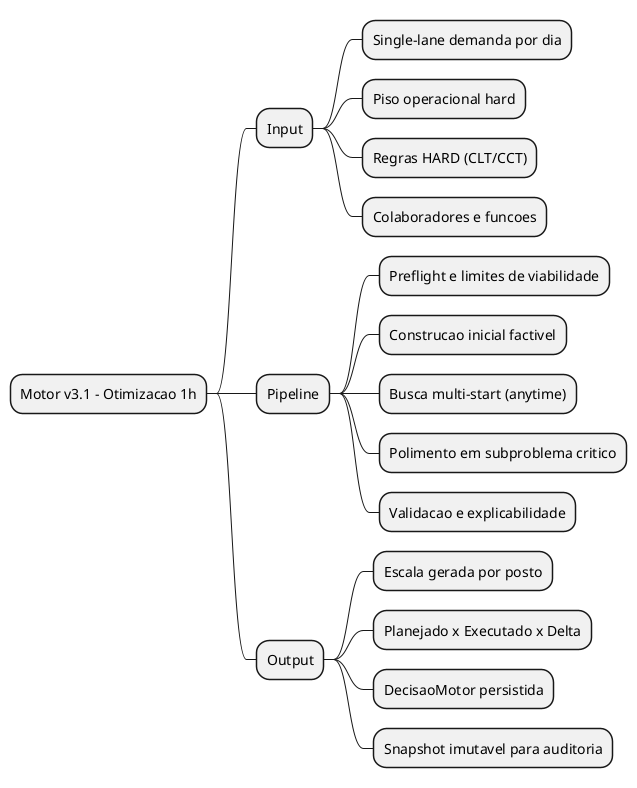
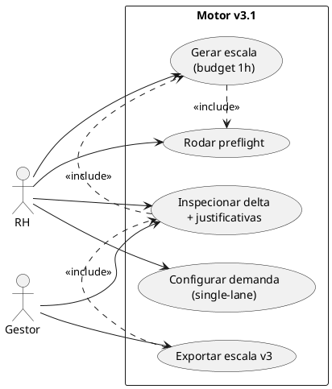
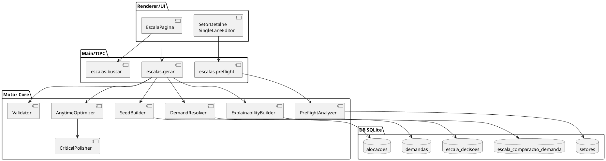
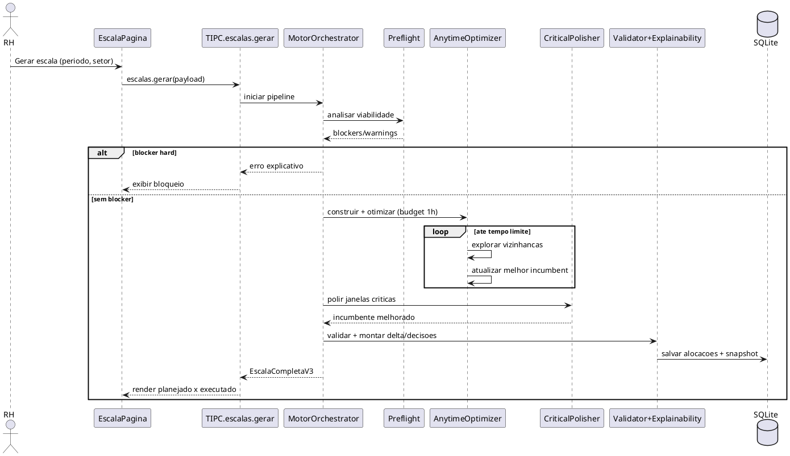
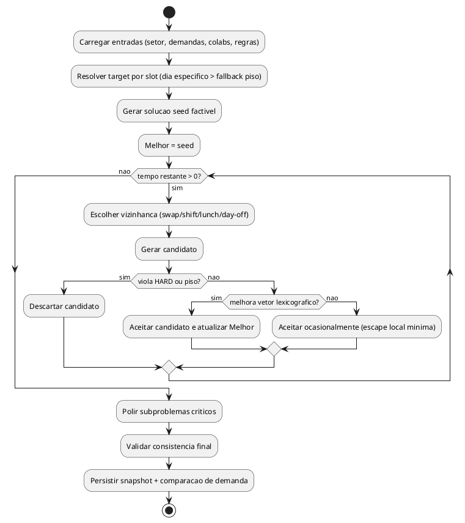
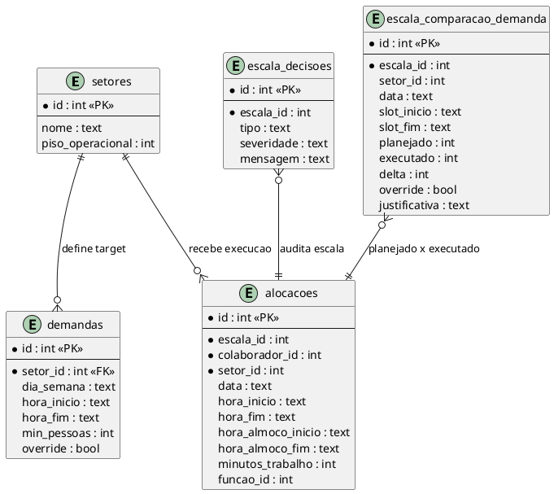
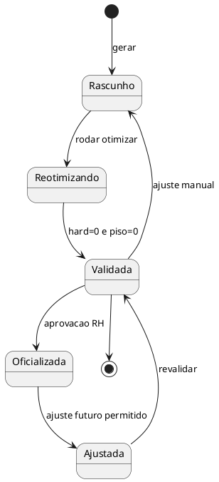

# ARQUITETURA BUILD: Metodo de Otimizacao v3.1 (Budget de 1h por setor)

> Gerado em 2026-02-19  
> Input base: `docs/MOTOR_V3_RFC.md` (v3.1 pragmatico)

---

## 1. Visao Geral

### 1.1 Escopo (Mind Map)


### 1.2 Casos de Uso


### 1.3 Arquitetura de Componentes


---

## 2. Metodo (didatico, ponta a ponta)

### 2.1 O metodo: "Anytime Lexicographic Optimization"

Ideia central: em vez de buscar "perfeito absoluto" de uma vez, o motor roda um ciclo continuo que **sempre melhora** a melhor escala encontrada ate o tempo acabar.

Ordem de prioridade (lexicografica):
1. HARD legal = 0 violacoes (obrigatorio)
2. Piso operacional hard = 0 violacoes (obrigatorio)
3. Demanda target (com `override` acima de target comum)
4. Antipatterns (Tier 1, depois Tier 2)
5. Soft preferences

### 2.2 O que cada fase faz

1. Preflight de viabilidade (rapido):
- Detecta impossibilidade estrutural antes de gastar 1h.
- Exemplo: "demanda pede 4 no pico mas capacidade legal maxima e 3".
- Resultado: `blockers` (nao gera) e `warnings` (gera com delta esperado).

2. Construcao inicial factivel:
- Monta escala base que respeita HARD e piso.
- Prioriza slots mais criticos (`override`, maior deficit, maior penalidade).
- Gera um primeiro incumbent (solucao atual melhor conhecida).

3. Busca anytime multi-start (maior parte da 1h):
- Executa varias trilhas de busca com seeds diferentes.
- Operadores de vizinhanca:
  - troca de pessoa entre slots/dias,
  - ajuste de inicio/fim de turno em grid 30min,
  - reposicionamento de almoco para melhorar cobertura,
  - move de folga entre dias permitidos.
- Aceita movimentos que melhoram score lexicografico.
- Aceita poucos movimentos neutros/piores de forma controlada para escapar de minimo local.

4. Polimento em subproblema critico:
- Congela partes boas da escala.
- Isola janelas com maior delta (hot windows).
- Resolve subproblema menor com busca mais exata.
- Objetivo: fechar ultimo gap sem explodir tempo.

5. Validacao + snapshot:
- Revalida HARD/piso no final.
- Persiste:
  - `escala_decisoes`,
  - `escala_comparacao_demanda`,
  - motivos de delta por slot/faixa.
- Garante auditabilidade e reproducao.

---

## 3. Fluxos Principais

### 3.1 Sequencia de Geracao (1h/setor)


### 3.2 Activity do otimizador


---

## 4. Dados que sustentam o metodo

### 4.1 Modelo ER (subset necessario)


### 4.2 Estado da escala (auditoria)


---

## 5. Estrutura de Codigo Sugerida (sem quebrar motor atual)

### 5.1 Arvore
```text
src/main/motor/
|- gerador.ts                         # pipeline atual (mantem)
|- validador.ts                       # HARD/AP checks atuais (mantem)
|- optimizer-v2/
|  |- orchestrator.ts                 # controla budget e fases
|  |- preflight.ts                    # limites de viabilidade
|  |- objective.ts                    # vetor lexicografico
|  |- seed-builder.ts                 # construcao inicial
|  |- neighborhoods/
|  |  |- swap-colaborador.ts
|  |  |- shift-boundary.ts
|  |  |- lunch-reposition.ts
|  |  `- move-dayoff.ts
|  |- anytime-search.ts               # loop principal de 1h
|  |- critical-polisher.ts            # subproblema de hotspots
|  |- demand-resolver.ts              # resolve target por slot
|  `- metrics.ts                      # tracking de score e gap
`- explainability/
   |- decisions-builder.ts
   `- demand-delta-builder.ts
```

### 5.2 Responsabilidades

| Camada | O que faz | Por que importa |
|---|---|---|
| `preflight.ts` | prova inviabilidade cedo | evita desperdicar 1h em caso impossivel |
| `seed-builder.ts` | cria escala inicial valida | garante ponto de partida consistente |
| `anytime-search.ts` | melhora continuamente ate timeout | sempre devolve melhor encontrado |
| `critical-polisher.ts` | fecha lacunas mais caras | melhora qualidade final sem custo total |
| `objective.ts` | aplica hierarquia HARD>PISO>TARGET>AP>SOFT | impede regressao de prioridade |
| `decisions-builder.ts` | explica o "por que" dos desvios | confianca para RH/operacao |

---

## 6. Por que esse metodo chega em "otimo possivel"

1. Otimo exato global em problema real de escala pode ser caro (NP-hard).  
   Com 1h/setor, a melhor estrategia e **anytime**: sempre melhora e para com a melhor solucao encontrada.

2. Lexicografico preserva negocio:  
   nunca sacrifica HARD/piso para ganhar cosmetica de score.

3. Multi-start + vizinhancas diferentes reduz vies de uma unica heuristica:  
   procura em regioes diferentes do espaco de solucoes.

4. Polimento focado em hotspots maximiza retorno por minuto:  
   em vez de reotimizar tudo, ataca onde o delta pesa mais.

5. Snapshot e metricas por fase permitem evolucao continua:  
   da para comparar versoes do motor por qualidade e tempo, nao por "achismo".

---

## 7. Checklist de Implementacao

| # | Item | Tipo | Dependencia |
|---|---|---|---|
| 1 | Extrair `objective` lexicografico unico | Motor | RFC v3.1 |
| 2 | Implementar `preflight` com blockers/warnings | API/Motor | 1 |
| 3 | Implementar `seed-builder` deterministico | Motor | 1 |
| 4 | Implementar loop `anytime-search` com budget configuravel | Motor | 3 |
| 5 | Implementar 4 operadores de vizinhanca | Motor | 4 |
| 6 | Implementar `critical-polisher` por janelas | Motor | 4 |
| 7 | Persistir metricas de run (tempo, melhor score, iteracoes) | Observabilidade | 4 |
| 8 | Garantir snapshot unico para buscar/hub/export | API/DB | 2, 6 |
| 9 | Testes de regressao (hard/piso/override/delta) | QA | 1..8 |

### Dependencias externas
- Nenhuma obrigatoria para primeira versao (pode ser 100% no stack atual).
- Opcional futuro: solver exato para subproblema (se quiser gap matematico formal).

### Riscos e mitigacoes

| Risco | Impacto | Mitigacao |
|---|---|---|
| Tempo de 1h insuficiente em setor muito grande | Medio | parada anytime + snapshot do melhor incumbent |
| Ficar preso em minimo local | Medio | multi-start + aceitacao controlada de piora |
| Inconsistencia entre telas (hub/export/pagina) | Alto | leitura sempre do mesmo snapshot persistido |
| Regressao de regra hard por refactor | Alto | suite obrigatoria hard/piso no CI |

---

## 8. TL;DR executivo

- O metodo certo para 1h/setor e **Anytime Lexicographic Optimization**.  
- Ele respeita hierarquia de negocio e melhora continuamente ate o timeout.  
- Preflight evita casos impossiveis, busca multi-start aumenta qualidade, polimento fecha gaps criticos.  
- Nao precisa quebrar motor atual: pode entrar como `optimizer-v2` plugavel.  
- Resultado: qualidade alta, explicabilidade forte e evolucao segura em producao.

---

## 9. Backlog (Solver Exato / CP)

Objetivo: avaliar trilha de solver declarativo sem interromper entrega do v3.1 atual.

### 9.1 Spike A — MiniZinc (Gecode)

Status: `BACKLOG`

Escopo do spike:
- Modelar subset do RFC (HARD principal + piso + demanda target + override + almoco).
- Rodar benchmark com dados reais do setor (mesmo periodo de producao).
- Comparar qualidade e tempo contra `optimizer-v2`.

Critérios de aprovacao:
- `hard_violations = 0`
- `piso_violations = 0`
- melhora ou empate em `delta_demanda_total`
- tempo p95 dentro do budget operativo definido

### 9.2 Spike B — Python + OR-Tools (CP-SAT)

Status: `BACKLOG`

Escopo do spike:
- Prototipo isolado de CP-SAT para o mesmo subset do Spike A.
- Wrapper de entrada/saida compativel com `EscalaCompletaV3`.
- Medir custo de empacotamento/distribuicao (Electron + runtime Python).

Critérios de aprovacao:
- mesmos criterios do Spike A
- custo operacional aceitavel de distribuicao e suporte

### 9.3 Decisao de Arquitetura (Go/No-Go)

Status: `BACKLOG`

Regra:
- Manter `optimizer-v2` como baseline.
- Se MiniZinc ou CP-SAT vencer com ganho consistente e risco controlado, habilitar como engine opcional:
  - `solver_engine = heuristic | cp`
- Migracao gradual por feature flag, nunca big-bang.

### 9.4 Sources de estudo (CP/Scheduling)

- Google OR-Tools Employee Scheduling
- CP-SAT Primer
- CP-SAT Rostering Complete Guide
- Timefold Solver
