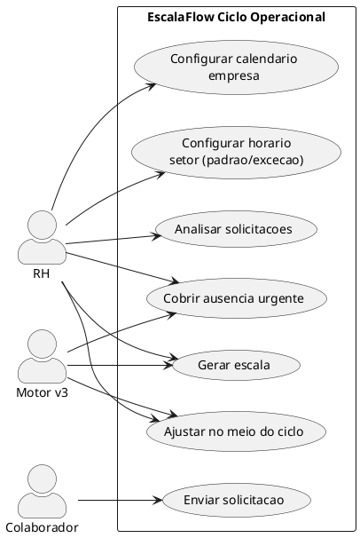
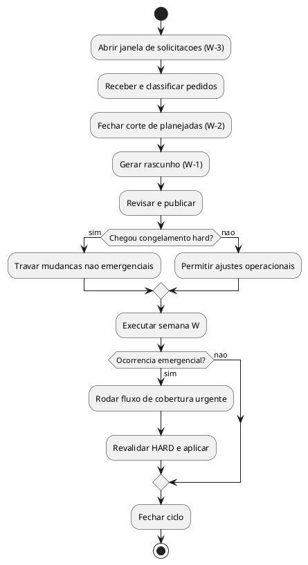
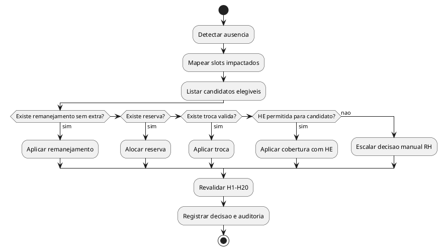

# MOTOR v3 — Calendario Operacional, Ciclo e Solicitacoes

> Status: Proposta de produto para anexar ao RFC v3.1 (pragmatico)
> Data: 2026-02-18
> Objetivo: fechar onde ficam feriados/horarios, como funciona o ciclo, como ajustar no meio, e como tratar solicitacoes e cobertura.

---

## TL;DR

1. Controle de feriado e abertura fica em um **Calendario Operacional da Empresa**.
2. Cada setor herda um horario padrao e pode ter **excecoes por dia**.
3. Escala trabalha em ciclo rolling (6 semanas), com janelas de corte e congelamento.
4. Pode ajustar no meio do ciclo, mas com regra: passado trava, futuro reotimiza.
5. Solicitacoes viram fluxo formal (tipos, prazo minimo, status, SLA).
6. Cobertura segue ordem de custo/risco: remanejamento -> reserva -> troca -> extra (quando legal).
7. v3.1 usa **demanda simplificada** (linha unica segmentada em `demandas`) como target planejado; perfil termico completo fica para evolucao futura.

---

## 0. Alinhamento Fechado com RFC v3.1

## 0.1 Contrato de demanda (sem overengineering)

- RH informa **planejado** (quantas pessoas por trecho da linha unica segmentada).
- Motor produz **executado** (alocacao real por posto/vaga).
- `demandas.min_pessoas` e mantido no schema atual, com semantica de **pessoas_planejadas (target)**.
- Perfil termico completo (`BAIXO/NORMAL/ALTO/PICO`) fica como evolucao opcional de v4+.

## 0.2 Precedencia operacional (solver)

```txt
1) HARD legal (CLT/CCT/feriados/aprendiz)
2) Piso operacional minimo do setor (quando definido)
3) Demanda planejada (target termico soft)
4) Antipatterns/qualidade
5) Preferencias soft
```

## 0.3 Explicabilidade obrigatoria

- Sempre comparar no resultado: `Planejado x Executado x Delta`.
- Todo delta relevante precisa justificativa textual do motor.
- Exemplo: "reduzido de 4 para 3 para evitar clopening e respeitar interjornada".

---

## 1. Onde Fica o Controle de Feriado e Horario

## 1.1 Camadas de calendario

```txt
CAMADA 1: EMPRESA (calendario por data)
- Feriado nacional/estadual/municipal
- Data aberta/fechada
- Janela base da empresa (referencia)

CAMADA 2: SETOR (horario operacional)
- Padrao semanal por dia (SEG..DOM)
- Excecao por data (ex: sabado especial, inventario, fechamento antecipado)

CAMADA 3: DEMANDA (planejado)
- Linha unica segmentada (quantas pessoas por trecho)
- Usa horario do setor daquele dia como limite
- Sem sobreposicao e sem empilhamento de faixas no input
- v3.1: tabela `demandas` com semantica de target (planejado), nao prescricao dura
```

## 1.2 Regra de precedencia do horario

```txt
1) Feriado proibido (CCT/lei) -> FECHADO
2) Excecao de data no setor -> usa excecao
3) Sem excecao -> usa padrao semanal do setor
4) Se setor inativo no dia -> FECHADO
```

## 1.3 Visao de configuracao (ASCII)

```txt
EMPRESA > CALENDARIO OPERACIONAL

2026-12-25 | Natal                | FECHADO (travado)
2026-01-01 | Confraternizacao     | FECHADO (travado)
2026-11-15 | Proclamacao          | ABERTO  (editavel)
2026-03-15 | Evento local         | ABERTO  (editavel)

SETOR > HORARIO SEMANAL

SEG [x] ativo [x] usa padrao 07:00-19:30
TER [x] ativo [x] usa padrao 07:00-19:30
QUA [x] ativo [x] usa padrao 07:00-19:30
QUI [x] ativo [x] usa padrao 07:00-19:30
SEX [x] ativo [ ] excecao   07:00-20:30
SAB [x] ativo [ ] excecao   07:00-12:00
DOM [ ] ativo [ ] excecao   FECHADO
```

---

## 2. Ciclo de Planejamento (Rolling)

## 2.1 Estrutura recomendada

- Horizonte de planejamento: 6 semanas visiveis.
- Unidade de publicacao: semanal.
- Regra: sempre existe uma escala em execucao e 2 semanas futuras quase fechadas.

## 2.2 Janela de ciclo por semana (W)

| Marco | Quando | O que acontece |
|---|---|---|
| Abertura de solicitacoes | W-3 (21 dias antes) | Colaboradores/RH enviam pedidos |
| Corte de solicitacoes planejadas | W-2 (14 dias antes) | Fecha folga programada e indisponibilidade comum |
| Geracao rascunho | W-1 (7 dias antes) | Motor gera proposta inicial |
| Publicacao interna | W-1 (5 dias antes) | RH revisa com lideranca |
| Congelamento soft | W-0 (2 dias antes) | Evita mudancas nao criticas |
| Congelamento hard | W-0 (24h antes) | So urgencia pode mudar |
| Execucao | Semana W | Ajustes pontuais com trilha de auditoria |

## 2.3 Estado da semana

```txt
RASCUNHO -> PUBLICADA -> CONGELADA -> EM_EXECUCAO -> FECHADA
```

---

## 3. Pode Mexer no Meio do Ciclo?

Sim. Mas com limite claro.

## 3.1 O que pode

- Alterar dias futuros ainda nao trabalhados.
- Cobrir falta/atestado/urgencia.
- Trocar turno/folga entre colaboradores validos.
- Rodar reotimizacao parcial do periodo impactado.

## 3.2 O que nao pode

- Reescrever dias ja executados.
- Forcar ajuste que viola HARD (H1-H20).
- Forcar extra para estagiario/aprendiz.

## 3.3 Regra de ajuste no meio

```txt
evento -> identifica impacto (dias/slots/setor)
      -> trava passado
      -> reotimiza apenas faixa impactada
      -> valida HARD
      -> registra decisao e auditoria
```

## 3.4 Niveis de urgencia

| Nivel | Exemplo | Prazo |
|---|---|---|
| Planejado | folga programada | >= 14 dias |
| Operacional | troca de turno | >= 72h |
| Emergencial | atestado/falta no dia | imediato |

---

## 4. Solicitacoes dos Colaboradores

## 4.1 Tipos de solicitacao

| Tipo | Quem usa | Exemplo |
|---|---|---|
| Folga pontual | colaborador/RH | consulta, compromisso |
| Indisponibilidade parcial | colaborador/RH | "nao posso apos 17h na quinta" |
| Troca de turno | colaborador com par | "troco sexta cedo por sabado tarde" |
| Troca de folga | colaborador com par | inverter folga da semana |
| Preferencia recorrente | colaborador/RH | prefere manha, evitar terca |
| Cobertura voluntaria | colaborador | "posso cobrir se necessario" |
| Evento legal | RH | ferias, atestado, afastamento |

## 4.2 Prazos minimos recomendados

| Tipo | Prazo minimo | Tratamento fora do prazo |
|---|---|---|
| Folga pontual | 14 dias | entra como tentativa, sem garantia |
| Indisponibilidade parcial | 7 dias | tentativa se nao quebrar cobertura |
| Troca de turno/folga | 72h | permitido se ambos aceitarem e motor validar |
| Emergencia (atestado) | imediato | gera fluxo de cobertura urgente |
| Preferencia recorrente | antes do corte da semana | vira soft para proximos ciclos |

## 4.3 Status de solicitacao

```txt
ABERTA -> EM_ANALISE -> APROVADA -> APLICADA
                       \-> NEGADA
```

---

## 5. Cobertura e Regra de Hora Extra

## 5.1 Ordem de tentativa para cobrir ausencia

1. Remanejamento dentro da jornada contratada (sem extra).
2. Reserva sem posto fixo (`funcao_id = null`).
3. Troca de turno/folga entre pares validos.
4. Extensao de jornada CLT (hora extra), se legalmente permitido.
5. Escalonar gestor/RH para decisao manual se solver nao fecha.

## 5.2 Regras de elegibilidade para cobertura

- Nunca violar HARD legal.
- Estagiario: nunca hora extra.
- Aprendiz: nunca hora extra, domingo, feriado, noturno.
- Em feriado: so alocar se calendario permitir (CCT/lei).

## 5.3 Hora extra: quando paga e quando nao

Politica de motor (nao folha):
- Se houve cobertura sem passar da meta contratual: sem extra.
- Se passou da jornada regular/limites de compensacao: marca evento de HE.
- Se domingo/feriado sem compensacao: marca adicional 100% para folha.

**Importante:** o motor marca evento; calculo financeiro final e da folha/ponto.

---

## 6. UX Ponta a Ponta (Concepcao)

## 6.1 Modulos

1. `EmpresaConfig > Calendario Operacional`
2. `SetorDetalhe > Horario Semanal + Excecoes`
3. `SetorDetalhe > Demanda (linha unica segmentada)`
4. `EscalaPagina > Solicitacoes`
5. `EscalaPagina > Ajustar/Cobrir`
6. `EscalaPagina > Por que?` (explicabilidade)

## 6.2 Fluxo de uso do RH

```txt
Configura calendario da empresa
-> Ajusta horario padrao/excecoes por setor
-> Abre janela de solicitacoes
-> Gera rascunho
-> Publica/congela
-> Opera semana com ajustes pontuais
-> Fecha ciclo e guarda historico
```

## 6.3 Fluxo de cobertura urgente

```txt
Atestado hoje 09:10
-> RH abre "Cobrir ausencia"
-> Sistema mostra candidatos elegiveis (ranking + impacto)
-> RH escolhe acao
-> Motor revalida e aplica
-> Registro em auditoria + notificacoes
```

---

## 7. Modelo de Dados (proposta minima)

## 7.1 Horario do setor por dia

```sql
CREATE TABLE IF NOT EXISTS setor_horario_semana (
  id INTEGER PRIMARY KEY AUTOINCREMENT,
  setor_id INTEGER NOT NULL REFERENCES setores(id),
  dia_semana TEXT NOT NULL CHECK (dia_semana IN ('SEG','TER','QUA','QUI','SEX','SAB','DOM')),
  ativo BOOLEAN NOT NULL DEFAULT 1,
  hora_abertura TEXT NOT NULL,
  hora_fechamento TEXT NOT NULL,
  usa_padrao BOOLEAN NOT NULL DEFAULT 1
);

CREATE TABLE IF NOT EXISTS setor_horario_excecao (
  id INTEGER PRIMARY KEY AUTOINCREMENT,
  setor_id INTEGER NOT NULL REFERENCES setores(id),
  data TEXT NOT NULL,
  ativo BOOLEAN NOT NULL DEFAULT 1,
  hora_abertura TEXT,
  hora_fechamento TEXT,
  motivo TEXT
);
```

## 7.2 Solicitacoes

```sql
CREATE TABLE IF NOT EXISTS solicitacoes_escala (
  id INTEGER PRIMARY KEY AUTOINCREMENT,
  colaborador_id INTEGER NOT NULL REFERENCES colaboradores(id),
  setor_id INTEGER NOT NULL REFERENCES setores(id),
  tipo TEXT NOT NULL CHECK (tipo IN (
    'FOLGA_PONTUAL',
    'INDISPONIBILIDADE_PARCIAL',
    'TROCA_TURNO',
    'TROCA_FOLGA',
    'PREFERENCIA_RECORRENTE',
    'COBERTURA_VOLUNTARIA',
    'EVENTO_LEGAL'
  )),
  data_inicio TEXT NOT NULL,
  data_fim TEXT,
  payload_json TEXT,
  status TEXT NOT NULL CHECK (status IN ('ABERTA','EM_ANALISE','APROVADA','NEGADA','APLICADA')),
  prioridade TEXT NOT NULL CHECK (prioridade IN ('PLANEJADA','OPERACIONAL','EMERGENCIAL')),
  criada_em TEXT NOT NULL DEFAULT (datetime('now')),
  respondida_em TEXT
);
```

## 7.3 Demanda planejada (reuso da tabela atual)

```txt
Tabela usada no v3.1: demandas
Campos: setor_id, dia_semana, hora_inicio, hora_fim, min_pessoas

Semantica v3.1:
- min_pessoas = pessoas_planejadas (target)
- Nao e hard block de escala
- Serve como referencia termica para o solver

Evolucao v4+ (opcional):
- adicionar camada de perfil termico avancado
- manter migracao assistida sem quebrar input simples do RH
```

---

## 8. Diagramas (PlantUML)

## 8.1 Use Case



## 8.2 Activity — Ciclo Semanal



## 8.3 Activity — Cobertura de Ausencia



---

## 9. Politicas que precisam ser travadas

1. SLA final de cada tipo de solicitacao (14d/7d/72h/imediato).
2. Janela de congelamento hard (24h ou 48h).
3. Limite de reotimizacao no meio do ciclo (apenas setor/dia impactado ou semana inteira).
4. Regra de aprovacao de HE (automatica por motor ou confirmacao RH sempre).
5. Canal de entrada de solicitacao (app colaborador ou RH centraliza manual).

---

## 10. Disclaimers Criticos

- Este doc define **politica operacional de produto**, nao substitui juridico/DP.
- Regras legais hard continuam no motor conforme RFC e SPEC.
- Base legal de feriado/comercio pode variar por CCT/municipio e deve usar calendario configurado.
- Cobranca financeira de HE/DSR/feriado continua no sistema de folha/ponto; motor so classifica eventos.

---

## 11. Fontes de referencia

- `docs/MOTOR_V3_RFC.md`
- `docs/MOTOR_V3_SPEC.md`
- `docs/MOTOR_V3_ENTRADAS_UI.md`
- `docs/RESEARCH_CLT_CCT_MOTOR_V3.md`
- MTE (regra de feriados no comercio, vigencia em 01/03/2026):
  https://www.gov.br/trabalho-e-emprego/pt-br/noticias-e-conteudo/2025/junho/mte-prorroga-para-1o-de-marco-de-2026-regra-sobre-trabalho-em-feriados-no-comercio
