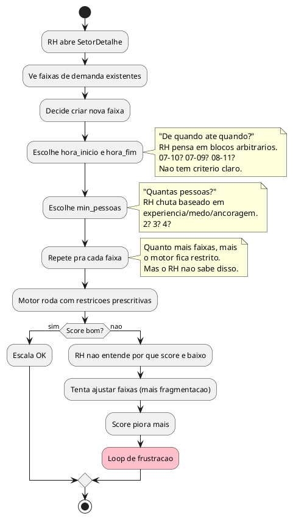
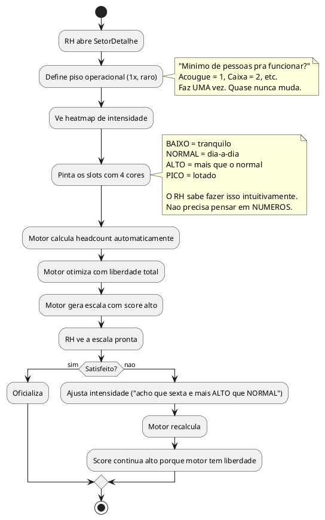
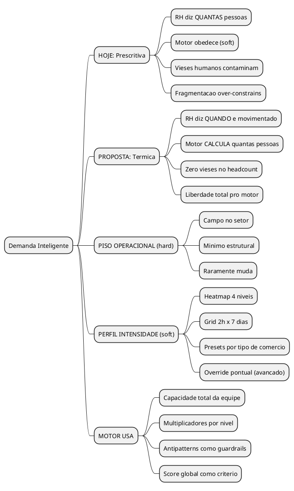

# Motor v3 — O Problema da Demanda: Prescricao Humana vs Otimizacao do Motor

> **Insight original do Marco:**
> "A gente vai adicionando blocos de demanda por suposicao, nao por necessidade.
> A propria ignorancia enviesada do ser humano pode foder uma boa escala.
> Pegar a leitura termica daquilo, saca?"

---

## TL;DR

O sistema atual pede pro RH dizer **QUANTAS PESSOAS** precisam em **CADA HORARIO**.
Isso e pedir pro RH fazer o trabalho do motor — e fazer mal.

O RH sabe QUANDO e movimentado. Nao sabe QUANTAS PESSOAS otimiza aquilo.
Separar essas duas coisas e a chave.

```
HOJE (prescritivo):
  RH diz: "07:00-10:00 = 3 pessoas, 10:00-12:00 = 2 pessoas"
  Motor: "OK, vou tentar satisfazer isso" (mao atada)

PROPOSTA (termico):
  RH diz: "manha = tranquilo, almoco = lotado, sexta = mais que quinta"
  Motor: "Entendi a temperatura. Eu calculo quantas pessoas e onde."
```

---

## 1. O QUE EXISTE HOJE

### Entidade atual: Demanda

```
TABELA demandas:
  id, setor_id, dia_semana, hora_inicio, hora_fim, min_pessoas
```

### Como o RH usa

O RH abre a tela do setor e cria "faixas" arrastando barras coloridas:

```
Acougue (horario: 07:00-18:00)

  ┌─────────────────────────────────────────────────────┐
  │ 07    08    09    10    11    12    13    14    15    16    17    18 │
  │ ████████████████ 3p    ░░░░░░░░ 2p   ██████████████ 3p   ░░░░ 1p │
  └─────────────────────────────────────────────────────┘
          Faixa 1             Faixa 2         Faixa 3        Faixa 4
       07:00-10:00          10:00-12:00    12:00-16:00    16:00-18:00
       min_pessoas=3        min_pessoas=2  min_pessoas=3  min_pessoas=1
```

### Como o motor usa

- SOFT constraint (R8): Se `alocados < min_pessoas` → violacao SOFT (nao bloqueia)
- `demandaTotalDia()`: soma min_pessoas pra decidir onde dar folga
- `demandaMaxFaixa()`: pega o max pra decidir quantos precisam no domingo
- Fase 6 (Horarios): tenta posicionar pessoas pra maximizar cobertura

### O que ja funciona bem

- Cobertura e SOFT (nao HARD) — motor nao trava se nao conseguir
- Motor usa demanda pra priorizar folgas (dia com menos demanda = melhor pra folga)
- DemandaBar na UI e visual e arrastavel

### O que nao funciona

**Tudo o que vem ANTES do motor rodar.** O input humano.

---

## 2. O PROBLEMA: O HUMANO ESTA FAZENDO O TRABALHO DO MOTOR

### A inversao de responsabilidade

```
O QUE O HUMANO SABE (bem):          O QUE O HUMANO NAO SABE:
─────────────────────────           ─────────────────────────
✅ Sexta e mais movimentado          ❌ Quantas pessoas otimiza uma sexta
✅ Sabado de manha lota               ❌ Se 3 ou 4 pessoas faz diferenca real
✅ Segunda e tranquilo                ❌ Se 1 ou 2 pessoas e o ideal
✅ Almoco e pico                      ❌ Onde posicionar o almoco de cada um
✅ O acougue precisa de alguem        ❌ O custo de exigir 3 pessoas vs 2

O QUE O MOTOR SABE (bem):           O QUE O MOTOR NAO SABE:
─────────────────────────           ─────────────────────────
✅ Quantas horas cada colab tem       ❌ Quando o acougue lota
✅ Todas as restricoes CLT            ❌ Qual dia e mais importante
✅ Como distribuir otimamente          ❌ O "feeling" do negocio
✅ Trade-offs (mais aqui = menos ali) ❌ Padrao de fluxo de clientes
```

**O problema e claro:**
- O humano esta fornecendo DECISOES (quantas pessoas onde)
- Quando deveria fornecer INFORMACAO (quando e movimentado)
- O motor deveria receber INFORMACAO e tomar DECISOES

### Analogia: O GPS

```
ERRADO (prescritivo):
  Voce diz pro GPS: "Vira a esquerda na Rua Augusto, depois
  reto 3km, depois direita na Avenida Brasil."
  GPS: "OK, vou seguir suas instrucoes." (mesmo que tenha rota melhor)

CERTO (declarativo):
  Voce diz pro GPS: "Quero ir pro supermercado."
  GPS: "Entendi. A melhor rota e por aqui." (calcula sozinho)
```

O RH ta dando ROTA pro motor, quando deveria dar DESTINO.

---

## 3. A TAXONOMIA DO VIES HUMANO

### Vies 1: ANCORAGEM HISTORICA

```
"A gente sempre colocou 3 pessoas de manha."

Pergunta: POR QUE 3?
Resposta real: "Porque no comeco eramos 3 e funcionou."

Mas FUNCIONOU por causa de 3 pessoas? Ou funcionou APESAR de 3 pessoas?
Talvez 2 desse conta. Talvez 4 fosse muito melhor.
Ninguem testou. Virou "verdade" por repeticao.
```

### Vies 2: GRANULARIDADE ARBITRARIA

```
O RH criou 4 faixas: 07-10, 10-12, 12-16, 16-18.
POR QUE essas divisoes?

Opção A: Porque correspondem a picos reais de movimento.
Opção B: Porque sao numeros redondos faceis de lembrar.
Opção C: Porque foi assim que a planilha do Excel foi montada em 2019.

Na maioria dos casos, e B ou C.

O que acontece as 10:01? Magicamente precisa de 1 pessoa a menos?
Nao. O fluxo de clientes e GRADUAL. Nao cai de 3 pra 2 as 10:00 em ponto.
Mas o sistema trata como se caisse.
```

### Vies 3: MEDO DE SUBDIMENSIONAR

```
"Melhor colocar 3 do que 2. Vai que lota."

Resultado: demanda inflada em TODOS os horarios.
Motor tenta satisfazer demanda inflada → todos trabalham mais horas.
Todos trabalham mais → mais hora extra → mais custo.
Mais custo → "precisamos cortar pessoal" → subdimensiona DE VERDADE.

O medo de subdimensionar CAUSA subdimensionamento.
```

### Vies 4: FRAGMENTACAO EXCESSIVA

```
RH cria 6 faixas no dia:
  07-09: 2 pessoas
  09-11: 3 pessoas
  11-13: 4 pessoas
  13-15: 3 pessoas
  15-17: 2 pessoas
  17-18: 1 pessoa

Cada faixa e uma RESTRICAO pro motor.
6 faixas × 7 dias = 42 restricoes de cobertura.
Mais o dia_semana NULL (padrao) = mais restricoes.

Motor: "Preciso de 4 pessoas de 11-13. Mas tambem 3 de 09-11.
        E 3 de 13-15. E 2 de 07-09..."

O motor PODE satisfazer todas? Depende. Mas cada restricao
TIRA LIBERDADE do motor pra otimizar. Quanto mais faixas,
menos margem de manobra.

E o PIOR: as vezes IMPOSSIBILITA uma escala boa.
4 pessoas de 11-13 OBRIGA gente a comecar cedo (pra estar la as 11).
Mas se comeca cedo, faz clopening com quem fecha.
A faixa de 11-13 com min_pessoas=4 CAUSOU o clopening.
```

### Vies 5: ILUSAO DE CONTROLE

```
"Se eu disser exatamente quantas pessoas em cada horario,
 a escala vai sair perfeita."

Realidade: Quanto MAIS o humano tenta controlar,
PIOR o motor performa. Porque o humano nao ve o TODO.

O humano ve: "preciso de 4 no almoco"
O motor ve: "se colocar 4 no almoco, Jose faz clopening,
             Maria trabalha 9h30, e Robert nao almoca em
             horario decente. Se colocar 3, todos ficam bem
             e a cobertura cai 7% — mas ninguem nota."

O humano otimiza UM slot. O motor otimiza 168 slots (7 dias × 24h).
```

---

## 4. AS ABORDAGENS

### Abordagem A: PETREO (status quo melhorado)

```
O que e: Manter min_pessoas como HARD constraint.
  "Se eu disse 3, TEM que ter 3."

Pros:
  ✅ RH tem controle total
  ✅ Simples de entender
  ✅ Sem surpresas

Cons:
  ❌ Todos os vieses acima permanecem
  ❌ Motor fica com as maos atadas
  ❌ Se o RH errou o input, a escala inteira sofre
  ❌ Pode tornar escalas impossiveis (contradiz CLT)
  ❌ Over-constraint → score baixo → RH acha que o motor e ruim

Quando usar: NUNCA como default. Talvez como opcao avancada
  pra situacoes especificas (ex: "o acougue PRECISA de 1 pessoa, e lei").
```

### Abordagem B: SOFT (atual, mas consciente)

```
O que e: Manter o input de min_pessoas, mas tratar como PREFERENCIA.
  Motor tenta satisfazer, mas pode desviar se encontrar solucao melhor.

Pros:
  ✅ Motor tem liberdade pra otimizar
  ✅ RH ainda tem voz
  ✅ Ja funciona assim (R8 = SOFT)

Cons:
  ❌ O RH ainda fornece DECISOES, nao INFORMACOES
  ❌ Os vieses continuam no input (ancoragem, fragmentacao)
  ❌ O RH nao sabe se o motor seguiu ou ignorou o input
  ❌ "Coloquei 3 mas so tem 2. O motor ta quebrado?"
  ❌ O formato do input (blocos com hora_inicio/hora_fim/min_pessoas)
     continua sendo prescritivo
```

### Abordagem C: AUTONOMO (motor decide tudo)

```
O que e: Motor ignora blocos de demanda. Distribui sozinho
  com base no total de pessoas e nas horas disponiveis.

Pros:
  ✅ Zero vies humano
  ✅ Motor tem liberdade total
  ✅ Simplifica a UI (menos input)

Cons:
  ❌ Motor NAO SABE quando e movimentado
  ❌ Pode colocar todo mundo de manha e ninguem de tarde
  ❌ Ou distribuir uniformemente (que e o que v2 faz — e ruim)
  ❌ O RH perde toda voz. Se nao gostou, nao tem como influenciar.
  ❌ O motor e burro sem contexto de negocio

Quando usar: NUNCA sozinho. Motor precisa de input.
  A questao e QUAL input.
```

---

## 5. ABORDAGEM D: LEITURA TERMICA (A PROPOSTA)

### O conceito

```
O RH nao diz QUANTAS PESSOAS.
O RH diz COMO E O FLUXO.

NAO: "Das 11:00-13:00 preciso de 4 pessoas"
SIM: "Das 11:00-13:00 e o horario mais movimentado"
```

### O que muda: separar DUAS coisas que hoje estao juntas

A Demanda atual conflata (mistura) dois conceitos completamente diferentes:

```
┌─────────────────────────────────────────────────────────────────┐
│                    DEMANDA ATUAL                                │
│                                                                 │
│  "3 pessoas de 11:00 as 13:00"                                 │
│                                                                 │
│  Isso MISTURA:                                                  │
│                                                                 │
│  1. PISO OPERACIONAL ──► "O acougue precisa de pelo menos       │
│     (hard, estrutural)    1 pessoa pra funcionar."              │
│                           Isso e sobre ESTACOES/POSTOS,         │
│     Muda RARO              nao sobre fluxo de clientes.          │
│                                                                 │
│  2. INTENSIDADE ─────► "Das 11 as 13 e quando mais lota."       │
│     (soft, temporal)    Isso e sobre PADRAO DE MOVIMENTO,        │
│                           nao sobre headcount.                   │
│     Muda POR ESTACAO      O motor deveria CALCULAR o headcount. │
│                                                                 │
└─────────────────────────────────────────────────────────────────┘
```

### A separacao

```
PISO OPERACIONAL (campo no Setor — hard):
  "Este setor precisa de pelo menos N pessoas em qualquer horario aberto."
  - Acougue: min 1 (sempre alguem pra atender)
  - Caixa: min 2 (sempre pelo menos 2 caixas abertos)
  - Hortifruti: min 1
  - Padaria: min 1

  Isso NAO muda com o dia da semana. E estrutural.
  Se o setor ta aberto, TEM que ter esse minimo.
  Substitui os "min_pessoas" dos blocos.

PERFIL DE INTENSIDADE (nova entidade — soft):
  "Quando e movimentado vs quando e tranquilo?"
  O RH fornece uma TEMPERATURA, nao um numero de pessoas.

  Niveis: BAIXO | NORMAL | ALTO | PICO

  Acougue:
          SEG  TER  QUA  QUI  SEX  SAB  DOM
  07-09:  ░    ░    ░    ░    ░    ▓    █
  09-11:  ░    ░    ░    ░    ▓    █    █
  11-13:  ▓    ▓    ▓    ▓    █    █    █
  13-15:  ░    ░    ░    ░    ▓    ▓    ░
  15-17:  ░    ░    ░    ░    ▓    ▓    —
  17-18:  ░    ░    ░    ░    ▓    ░    —

  ░ = BAIXO   ▓ = NORMAL/ALTO   █ = PICO   — = fechado
```

### Como o motor USA o perfil termico

```
ENTRADAS:
  - Total de colaboradores no setor: 5 pessoas
  - Horas semanais por pessoa: 44h
  - Capacidade total: 5 × 44h = 220h/semana
  - Horas de operacao do setor: 77h/semana (11h × 7 dias)
  - Piso operacional: 1 pessoa sempre

CALCULO DO MOTOR:
  1. Capacidade media: 220h ÷ 77h = 2.86 pessoas por hora (media)
  2. Ler o heatmap de intensidade
  3. Distribuir ACIMA da media nos horarios PICO
  4. Distribuir ABAIXO da media nos horarios BAIXO
  5. Garantir piso operacional SEMPRE

RESULTADO:
  Slot BAIXO (░):  1-2 pessoas (piso + margem)
  Slot NORMAL (▓): 2-3 pessoas (media)
  Slot ALTO (▓▓):  3-4 pessoas (acima da media)
  Slot PICO (█):   4-5 pessoas (maximo disponivel)

O motor CALCULOU os numeros. O humano so disse a temperatura.
```

### Por que isso e MUITO melhor

```
┌──────────────────────────────────────────────────────────────────────┐
│                                                                      │
│  PRESCRITIVO (hoje):                                                 │
│                                                                      │
│    RH: "Quero 4 pessoas de 11 as 13"                                │
│    Motor: "OK, mas pra ter 4 de 11-13, Jose comecar as 7            │
│            (clopening), Maria faz 9h30 (quase ilegal),              │
│            e Robert nao almoca antes das 14:00."                    │
│    Score: 55 ❌                                                      │
│                                                                      │
│  TERMICO (proposta):                                                 │
│                                                                      │
│    RH: "11 as 13 e PICO"                                            │
│    Motor: "Entendi. Com 5 pessoas, o ideal e 3 nesse slot.          │
│            Se eu botar 3, Jose nao faz clopening,                    │
│            Maria trabalha 8h (legal), e Robert almoca 12:30.        │
│            A cobertura e 75% do pico mas o score geral e 91."       │
│    Score: 91 ✅                                                      │
│                                                                      │
│  O motor TRADE-OFF: 1 pessoa a menos no pico                        │
│  = TODOS com horarios humanos.                                       │
│  Diferenca pro cliente? MINIMA.                                      │
│  Diferenca pro funcionario? ENORME.                                  │
│                                                                      │
└──────────────────────────────────────────────────────────────────────┘
```

---

## 6. A NOVA ENTIDADE: PERFIL DE INTENSIDADE

### Schema proposto

```sql
-- PISO OPERACIONAL: campo no setor (substitui o min da demanda)
ALTER TABLE setores ADD COLUMN piso_operacional INTEGER NOT NULL DEFAULT 1;
-- "Este setor precisa de pelo menos N pessoas em qualquer horario aberto"

-- PERFIL DE INTENSIDADE: substitui demandas
CREATE TABLE IF NOT EXISTS perfil_intensidade (
    id INTEGER PRIMARY KEY AUTOINCREMENT,
    setor_id INTEGER NOT NULL REFERENCES setores(id),
    dia_semana TEXT CHECK (dia_semana IN ('SEG','TER','QUA','QUI','SEX','SAB','DOM') OR dia_semana IS NULL),
    hora_inicio TEXT NOT NULL,
    hora_fim TEXT NOT NULL,
    intensidade TEXT NOT NULL CHECK (intensidade IN ('BAIXO','NORMAL','ALTO','PICO'))
);
```

### Interface TypeScript

```typescript
// Nivel de intensidade — o que o RH sabe
type Intensidade = 'BAIXO' | 'NORMAL' | 'ALTO' | 'PICO'

interface PerfilIntensidade {
  id: number
  setor_id: number
  dia_semana: DiaSemana | null  // null = todos os dias (padrao)
  hora_inicio: string
  hora_fim: string
  intensidade: Intensidade
}

// Piso operacional — campo no Setor
interface Setor {
  // ... campos existentes
  piso_operacional: number  // minimo de pessoas (estrutural)
}
```

### Como o motor converte intensidade em headcount

```typescript
// O motor calcula o target de pessoas por slot baseado em:
// 1. Total de horas disponiveis (workforce capacity)
// 2. Horas de operacao do setor
// 3. Perfil de intensidade
// 4. Piso operacional

function calcularTargetSlot(
  capacidade_media: number,   // ex: 2.86 pessoas/hora
  intensidade: Intensidade,
  piso_operacional: number,
): { min: number; ideal: number; max: number } {

  const MULTIPLICADORES = {
    BAIXO:  { min: 0.4, ideal: 0.6, max: 0.8 },
    NORMAL: { min: 0.7, ideal: 1.0, max: 1.2 },
    ALTO:   { min: 1.0, ideal: 1.3, max: 1.5 },
    PICO:   { min: 1.3, ideal: 1.6, max: 2.0 },
  }

  const mult = MULTIPLICADORES[intensidade]
  return {
    min:   Math.max(piso_operacional, Math.round(capacidade_media * mult.min)),
    ideal: Math.max(piso_operacional, Math.round(capacidade_media * mult.ideal)),
    max:   Math.max(piso_operacional, Math.round(capacidade_media * mult.max)),
  }
}

// Exemplo com capacidade_media = 2.86, piso = 1:
// BAIXO:  { min: 1, ideal: 2, max: 2 }
// NORMAL: { min: 2, ideal: 3, max: 3 }
// ALTO:   { min: 3, ideal: 4, max: 4 }
// PICO:   { min: 4, ideal: 5, max: 6 }  (cap at total_colabs)
```

---

## 7. COMO MUDA A JORNADA DO RH

### Antes (prescritivo)



### Depois (termico)



---

## 8. A UI: HEATMAP DE INTENSIDADE

### Mockup: Tela de Perfil de Intensidade

```
┌──────────────────────────────────────────────────────────────┐
│  Acougue — Perfil de Intensidade                    [Salvar] │
│──────────────────────────────────────────────────────────────│
│  Piso operacional: [1] pessoa  (minimo pra funcionar)       │
│                                                              │
│  Clique nos blocos pra mudar a intensidade:                  │
│  ░ Baixo  ▒ Normal  ▓ Alto  █ Pico                          │
│                                                              │
│       │ SEG │ TER │ QUA │ QUI │ SEX │ SAB │ DOM │            │
│  ─────┼─────┼─────┼─────┼─────┼─────┼─────┼─────│            │
│  07-09│  ░  │  ░  │  ░  │  ░  │  ░  │  █  │  █  │            │
│  09-11│  ░  │  ░  │  ░  │  ░  │  ▒  │  █  │  █  │            │
│  11-13│  ▓  │  ▓  │  ▓  │  ▓  │  █  │  █  │  █  │            │
│  13-15│  ░  │  ░  │  ░  │  ░  │  ▒  │  ▓  │  —  │            │
│  15-17│  ░  │  ░  │  ░  │  ░  │  ▒  │  ▓  │  —  │            │
│  17-18│  ░  │  ░  │  ░  │  ░  │  ▒  │  ░  │  —  │            │
│                                                              │
│  Motor calcula: ░=1-2p  ▒=2-3p  ▓=3-4p  █=4-5p             │
│  (baseado em 5 colaboradores, 44h/sem cada)                  │
│                                                              │
│  ┌─────────────────────────────────────────────────────┐     │
│  │ Preview: Com 5 pessoas de 44h/sem, o motor pode:    │     │
│  │   - Cobrir 100% dos slots PICO com 4-5 pessoas     │     │
│  │   - Cobrir 95% dos slots ALTO com 3+ pessoas       │     │
│  │   - Manter piso operacional (1) em todos os slots   │     │
│  │   - Horas sobrando: ~12h (margem saudavel)          │     │
│  └─────────────────────────────────────────────────────┘     │
│                                                              │
│  [Resetar padrao]  [Copiar de outro setor]                   │
└──────────────────────────────────────────────────────────────┘
```

### Interacao: click-to-cycle

```
Clica no bloco → cicla entre as intensidades:
  ░ BAIXO → ▒ NORMAL → ▓ ALTO → █ PICO → ░ BAIXO → ...

Clica segurando Shift → seleciona coluna inteira (dia todo)
Clica segurando Ctrl → seleciona linha inteira (horario toda semana)

Mobile: tap = muda, long-press = seleciona multiplos
```

### Presets inteligentes

```
Ao criar um setor, o sistema sugere um perfil DEFAULT:

PRESET "Supermercado generico":
  Seg-Qui: baixo manha, normal almoco, baixo tarde
  Sex: normal manha, alto almoco, normal tarde
  Sab: alto manha, pico almoco, alto tarde
  Dom: pico manha, alto almoco (se aberto)

O RH pode usar o preset e ajustar. Ou comecar do zero.
```

---

## 9. EXEMPLOS PRATICOS

### Caso 1: O vies da ancoragem

```
ANTES (prescritivo):
  RH: "O acougue precisa de 3 pessoas de 07 as 12."
  Motor: Precisa encaixar 3 pessoas das 7 as 12 em TODOS os dias.
         Com 5 colabs de 44h, isso e apertado.
         Resultado: clopenings, ioio, score 65.

  POR QUE 3? Porque sempre foram 3. Mas 2 funcionarios experientes
  atendem o mesmo que 3 novatos. O numero nao reflete a realidade.

DEPOIS (termico):
  RH: manha = NORMAL (nao e tranquilo, nao e pico)
  Motor: Com 5 colabs, NORMAL de manha = 2-3 pessoas.
         Motor testa com 2 e com 3. Com 2: score 88.
         Com 3: score 72 (porque forca clopening).
         Motor ESCOLHE 2. Melhor pra todos.
```

### Caso 2: A fragmentacao que mata

```
ANTES (prescritivo):
  RH criou 6 faixas diferentes pra sabado:
    07-09: 2p, 09-11: 3p, 11-12: 4p, 12-14: 4p, 14-16: 3p, 16-18: 2p
  = 6 restricoes. Motor tenta satisfazer TODAS.
  Resultado: Jose comeca 07:00, trabalha 11h (viola CLT).
  Ou: score 45 porque impossivel satisfazer tudo sem violar.

DEPOIS (termico):
  RH pintou sabado:
    07-09: NORMAL, 09-11: ALTO, 11-14: PICO, 14-16: ALTO, 16-18: NORMAL
  Motor: "Sabado e o dia mais quente. Vou concentrar mais gente
         no meio do dia e menos nas pontas. Com 5 colabs:"
    07-09: 2 pessoas (piso + 1)
    09-14: 4 pessoas (pico demanda concentrar forca)
    14-18: 3 pessoas (transicao suave)
  O motor DECIDIU os numeros. E encontrou uma distribuicao que
  ninguem viola CLT e score = 87.
```

### Caso 3: O trade-off invisivel

```
ANTES (prescritivo):
  RH: "Almoco de 11 as 13 precisa de 4 pessoas NO MINIMO."
  Motor: Pra ter 4 de 11-13, precisa que 4 colabs NAO estejam almocando.
         Se tem 5 colabs no setor, 4 trabalhando + 1 almocando.
         MAS: o 1 que almoca nao pode almocar de 11-13 (senao fica 3).
         Entao ele almoca 10:00-10:30 ou 13:30-14:00 (bizarro).
         AP8 (almoco horario bizarro) = -8 pontos.

DEPOIS (termico):
  RH: "11-13 e PICO"
  Motor: "PICO com 5 colabs = ideal 4-5. MAS se eu colocar 4,
          alguem almoca em horario bizarro. Se colocar 3 + escalonar
          almocos naturais, todos almocam 11:30-13:30 e a cobertura
          efetiva e 3.5 pessoas (alguem sempre presente)."
  Trade-off: 3.5 efetivas vs 4 com almoco bizarro.
  Motor escolhe 3.5 porque o score GLOBAL e melhor.
```

### Caso 4: Quando o piso operacional IMPORTA

```
Acougue: piso_operacional = 1

Quarta-feira, 16:00-18:00 (fim do dia, tranquilo):
  Intensidade: BAIXO
  Motor calcula: BAIXO com media 2.86 = 1-2 pessoas.
  PODE colocar 1 (piso). Nao viola nada.

MAS: se o campo rank do colab que esta la for <= 2 (junior)...
  AP16 (junior sozinho) = -12 pontos.
  Motor prefere colocar 2 (1 experiente + 1 junior).

Piso operacional e o HARD. Intensidade e o SOFT.
Os antipatterns adicionam INTELIGENCIA por cima.
```

---

## 10. COMPATIBILIDADE COM O SISTEMA ATUAL

### Migracao suave

O sistema atual ja tem demandas. Nao vamos DELETAR. Vamos MIGRAR.

```
PASSO 1: Converter demandas existentes em perfil de intensidade.

  Regra de conversao:
    min_pessoas = 1       → BAIXO
    min_pessoas = 2       → NORMAL
    min_pessoas = 3       → ALTO
    min_pessoas >= 4      → PICO

  Piso operacional = MIN(min_pessoas) de todas as faixas do setor
  (geralmente 1)

PASSO 2: Manter tabela demandas como fallback (nao deletar).
  Motor v3 checa perfil_intensidade primeiro.
  Se nao existir, faz fallback pra demandas (modo legado).

PASSO 3: UI mostra heatmap se perfil_intensidade existir,
  ou DemandaBar (atual) se estiver no modo legado.
  Botao "Migrar pra modo inteligente" na tela do setor.
```

### Modo avancado: override por slot

```
Pra usuarios avancados que PRECISAM de controle num slot especifico:

"No sabado de 11 as 13, EU QUERO 4 pessoas. Nao discuta."

Isso cria um OVERRIDE que o motor trata como quasi-hard:
  - Tenta satisfazer com prioridade maxima
  - Se nao conseguir sem violar CLT, avisa
  - Mas nao e proibido (diferente de HARD que bloqueia)

Override e a EXCECAO, nao a regra.
A maioria dos slots usa a leitura termica.
```

---

## 11. DECISOES DE PRODUTO

| Decisao | Opcoes | Recomendacao | Razao |
|---|---|---|---|
| Grid temporal do heatmap | 30min / 1h / 2h | **2h** | Menos blocos = menos input = menos erro |
| Dia_semana null (padrao) | Manter / Remover | **Manter** | Util: "toda semana e assim, exceto sexta" |
| Preset ao criar setor | Sim / Nao | **Sim** | Reduz input do RH. Preset "Supermercado" |
| Override por slot | Sim / Nao | **Sim** (modo avancado) | Flexibilidade sem sacrificar simplicidade |
| Preview de headcount | Sim / Nao | **Sim** | RH precisa ver "o que o motor vai fazer" |
| Migracao automatica | Sim / Manual | **Manual** (botao) | RH decide quando migrar |

### Grid temporal: por que 2h e melhor que 30min

```
GRID 30min: 22 slots por dia (07:00-18:00) × 7 dias = 154 blocos pra pintar.
  RH: "Preciso pintar 154 blocos?! Desisto."

GRID 1h: 11 slots × 7 dias = 77 blocos.
  RH: "Ainda e muito..."

GRID 2h: 6 slots × 7 dias = 42 blocos.
  RH: "OK, consigo fazer isso em 2 minutos."
  E a granularidade e suficiente. Ninguem diferencia
  entre "10:00 e movimentado" e "10:30 e movimentado".

EXCECAO: Se o setor opera so 6h (ex: padaria 06:00-12:00),
  grid 2h = 3 slots. Perfeito.
```

---

## 12. COMO ISSO CONECTA COM OS ANTIPATTERNS

O sistema termico AMPLIFICA o poder dos antipatterns:

```
ANTES (prescritivo):
  Motor recebe: "3 pessoas de 11-13"
  Motor gera: clopening pra satisfazer
  Motor detecta: AP1 = -15
  Motor reporta: "Score 70, tem clopening"
  RH: "Mas EU disse 3 pessoas!" (conflito)

DEPOIS (termico):
  Motor recebe: "11-13 e PICO"
  Motor calcula: ideal = 4, mas 3 evita clopening
  Motor PREVINE: AP1 nunca acontece
  Motor gera: score 91
  RH: nunca soube que tinha risco de clopening. Nem precisou.
```

O motor nao so DETECTA antipatterns. Ele os EVITA na raiz,
porque tem liberdade pra trocar "1 pessoa a mais no pico"
por "zero clopening e almoco normal pra todos".

---

## 13. RESUMO: O ICEBERG COMPLETO

```
                    ┌───────────────────────┐
    O que o RH faz →│ Pinta um heatmap      │  ← 2 minutos
                    │ Define piso = 1       │  ← 10 segundos
                    └───────────┬───────────┘
                                │
    ────────────────────────────┼──────────────────────── (superficie)
                                │
    O que o motor faz      Calcula headcount por slot
    por baixo               Distribui horas otimamente
                            Respeita 20 regras CLT
                            Evita 17 antipatterns
                            Balanceia fairness cumulativa
                            Respeita ritmo circadiano
                            Escalona almocos
                            Intercala dias de pico
                            Protege juniors
                            Maximiza score global
                            ───────────────────────────
                            42 regras de qualidade
                            em ~30 segundos de processamento
```

```
O RH pintou um mapa de cores em 2 minutos.
O motor transformou em uma escala que respeita a lei,
cuida do funcionario, otimiza o custo, e evita 17 situacoes
que o RH nem sabia que existiam.

ISSO e o produto.
```

---

## 14. DISCLAIMERS CRITICOS

- **Os multiplicadores (0.4, 0.6, 1.0, 1.3, 1.6, 2.0) sao chutes educados.**
  Precisam ser calibrados com uso real. O preset funciona, mas ajustes
  serao necessarios apos as primeiras escalas geradas.

- **A migracao de demandas → perfil nao e perfeita.** min_pessoas=3 pode
  significar ALTO ou PICO dependendo do tamanho do setor. A regra de
  conversao e uma heuristica, nao uma verdade.

- **O RH pode resistir.** "Eu SABIA que precisava de 3 pessoas."
  Resposta: "O motor vai colocar 3 se puder. Mas se 3 causar clopening
  e 2 nao causar, ele prefere 2. Confia no score."

- **O preview de headcount e ESSENCIAL.** Sem ele, o RH pinta o heatmap
  e nao sabe o que vai acontecer. O preview fecha o loop: "PICO = 4-5 pessoas."
  RH: "Ah, faz sentido."

---



---

*Gerado em 18/02/2026 | EscalaFlow Motor v3 — Demanda Inteligente v1.0*
