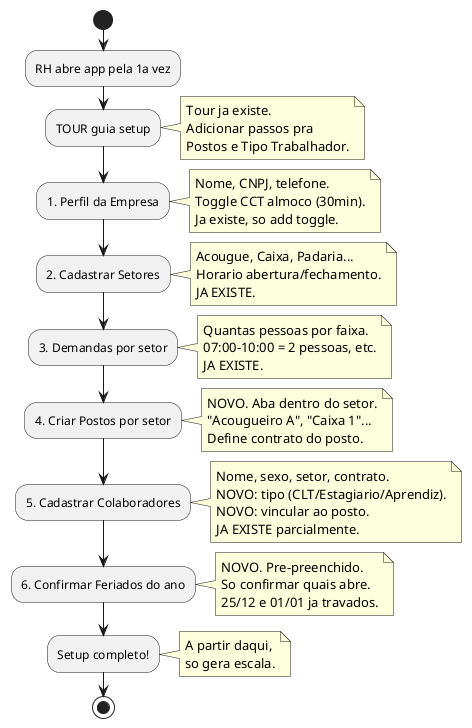
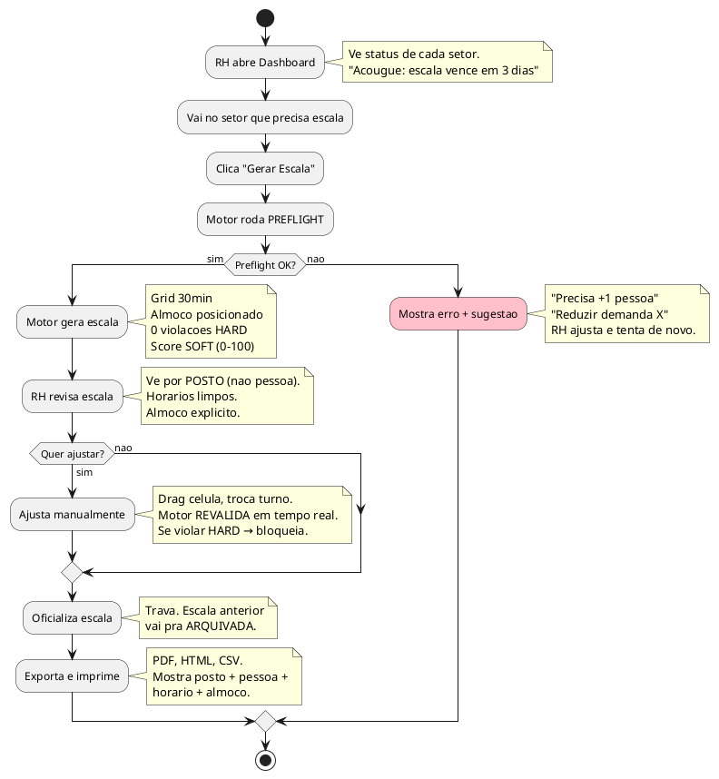

# Motor v3 — Entradas, Configuracao e UI

> **Principio:** Se o RH precisa ENTENDER a regra pra usar o sistema, o sistema FALHOU.
> As 20 regras HARD existem pra proteger o RH, nao pra ele configurar.
> O motor e um guarda-costas invisivel — faz o trabalho sujo sem pedir permissao.

---

## TL;DR

```
O que o RH FAZ:
  1. Cadastra setores, postos e pessoas (setup 1x)
  2. Aperta "Gerar Escala" (toda semana/mes)
  3. Revisa, ajusta se quiser, oficializa
  4. Exporta e imprime

O que o RH NAO FAZ:
  - Configurar regras CLT (hardcoded)
  - Calcular almoco (motor faz)
  - Se preocupar com grid 30min (automatico)
  - Saber o que e H1-H20 (o motor sabe por ele)
```

---

## 1. MAPA DE ENTRADAS — 3 CAMADAS

### Camada 1: HARDCODE (motor sabe, RH nem ve)

Tudo que e lei ou decisao de produto FIXA. Nao tem tela, nao tem config.
Vive em `constants.ts` e no codigo do motor.

```
HARDCODED — NUNCA MUDA, NUNCA APARECE PRO RH
├── CLT
│   ├── Max 8h/dia normal (Art. 58)
│   ├── Max 10h/dia com extra (Art. 59)
│   ├── Min 11h entre jornadas (Art. 66)
│   ├── Max 6 dias consecutivos (Art. 67)
│   ├── DSR + interjornada = 35h (Sumula 110)
│   ├── Almoco: min 1h (CLT) ou 30min (CCT), max 2h (Art. 71)
│   ├── Intervalo 15min se > 4h e <= 6h (Art. 71 ss1)
│   ├── Almoco nunca na 1a/ultima hora (TST)
│   ├── Domingo mulher: max 1 consecutivo (Art. 386)
│   ├── Domingo homem: max 2 consecutivos (Lei 10.101)
│   ├── Folga compensatoria domingo: 7 dias (Lei 605)
│   ├── Aprendiz: nunca domingo, feriado, noturno, HE
│   ├── Estagiario: max 6h/dia, 30h/sem, nunca HE
│   └── Cliff 6h: 6h00 = 15min, 6h01+ = almoco completo (Sum. 437)
├── PRODUTO
│   ├── Grid 30min (fixo)
│   ├── Minimo 4h por dia trabalhado
│   ├── Max 2 blocos de trabalho por dia
│   └── Tolerancia semanal = margem operacional (nao CLT)
└── FERIADOS CCT
    ├── 25/12: PROIBIDO (fixo)
    └── 01/01: PROIBIDO (fixo)
```

**Por que hardcode?** Porque NINGUEM decide se a CLT se aplica ou nao.
Se a lei diz max 6 dias consecutivos, nao tem toggle pra isso.
O motor simplesmente OBEDECE.

### Camada 2: EMPRESA (configura 1x no setup, esquece)

Coisas que variam por empresa mas raramente mudam. O RH configura UMA VEZ
e so mexe se mudar de CCT ou de politica interna.

| Campo | Valor atual | Onde configura | Frequencia |
|---|---|---|---|
| nome, cnpj, telefone | Supermercado Fernandes | Perfil (ja existe) | Nunca muda |
| corte_semanal | SEG_DOM | Perfil (ja existe) | Nunca muda |
| tolerancia_semanal_min | 30 | Perfil (ja existe) | Raramente |
| **usa_cct_intervalo_reduzido** | **true** | **Perfil (NOVO toggle)** | **Nunca muda** |
| **min_intervalo_almoco_min** | **30** (auto-calculado) | **Perfil (NOVO, read-only se CCT on)** | **Nunca muda** |

**UX da CCT:** Um unico toggle com label claro:

```
┌─────────────────────────────────────────────────┐
│ Intervalo de almoco                             │
│                                                 │
│ [x] Usar regra da Convencao Coletiva (CCT)      │
│     Almoco minimo: 30 minutos                   │
│     (CCT FecomercioSP interior autoriza)         │
│                                                 │
│ [ ] Usar regra padrao CLT                        │
│     Almoco minimo: 1 hora                       │
└─────────────────────────────────────────────────┘
```

Se toggle ON → min_almoco = 30. Se OFF → min_almoco = 60. Pronto.
O RH nao precisa saber o que e Art. 611-A III. So precisa saber:
"Meu sindicato deixa 30min de almoco? Sim/Nao."

### Camada 3: OPERACIONAL (usa toda semana/mes)

Dados que o RH manipula regularmente. Ja tem tela pra maioria.

```
OPERACIONAL — O RH MEXE NISSO
├── SETORES (ja existe)
│   ├── Nome, hora abertura/fechamento
│   └── Demandas por faixa horaria (min_pessoas)
│
├── FUNCOES / POSTOS (NOVO)
│   ├── Apelido do posto ("Caixa 1", "Acougueiro A")
│   ├── Tipo de contrato que o posto exige
│   ├── Ordem de exibicao na escala
│   └── Quem ocupa o posto (vincular colaborador)
│
├── COLABORADORES (ja existe, +1 campo)
│   ├── Nome, sexo, setor, contrato, horas (ja existe)
│   ├── Preferencias: turno, dia evitar (ja existe)
│   ├── tipo_trabalhador: CLT / Estagiario / Aprendiz (NOVO)
│   └── funcao_id: qual posto ocupa (NOVO)
│
├── EXCECOES (ja existe)
│   └── Ferias, atestado, bloqueio (ja existe)
│
├── FERIADOS (NOVO)
│   ├── Calendario anual pre-preenchido
│   ├── Marcar se comercio pode abrir
│   └── 25/12 e 01/01 ja vem travados
│
└── ESCALAS (ja existe, motor v3 muda internamente)
    ├── Gerar → Preflight → Resultado
    ├── Revisar → Ajustar (pin) → Revalidar
    ├── Oficializar → Travar
    └── Exportar → PDF/HTML/CSV
```

---

## 2. O QUE MUDA NA UI (delta, nao rewrite)

### 2.1 Paginas NOVAS (2 paginas)

#### A) Funcoes (Postos) — DENTRO do Setor

**NAO e uma pagina separada.** E uma aba/secao dentro de SetorDetalhe.
O RH ja vai no setor pra ver colaboradores e demandas. Postos ficam ali.

```
┌──────────────────────────────────────────────────────────┐
│ SETOR: ACOUGUE                                           │
│                                                          │
│ [Dados]  [Demandas]  [>>Postos<<]  [Colaboradores]       │
│                                                          │
│ ┌──────────────────────────────────────────────────────┐ │
│ │ Postos do setor                           [+ Novo]   │ │
│ │                                                      │ │
│ │  ≡ Acougueiro A    CLT 44h    Jose Luiz       [...]  │ │
│ │  ≡ Acougueiro B    CLT 44h    Robert          [...]  │ │
│ │  ≡ Balconista 1    CLT 44h    Jessica         [...]  │ │
│ │  ≡ Balconista 2    CLT 44h    Alex            [...]  │ │
│ │  ≡ Balconista 3    CLT 44h    — (vago) —      [...]  │ │
│ │                                                      │ │
│ │  ≡ = drag pra reordenar                             │ │
│ │  [...] = editar apelido, trocar pessoa, remover      │ │
│ └──────────────────────────────────────────────────────┘ │
└──────────────────────────────────────────────────────────┘
```

**Dialog "Novo Posto":**
```
┌─────────────────────────────────┐
│ Novo posto                      │
│                                 │
│ Apelido: [__________________]  │
│ Contrato: [CLT 44h         v]  │
│ Pessoa:   [Jose Luiz       v]  │
│           (opcional — pode      │
│            deixar vago)         │
│                                 │
│         [Cancelar]  [Criar]     │
└─────────────────────────────────┘
```

**Por que dentro do Setor e nao pagina separada?**
Porque o RH pensa: "Vou no Acougue → vejo os postos → ajusto".
Nao pensa: "Vou na pagina de funcoes → filtro por setor → ajusto".
Contexto e rei. O posto PERTENCE ao setor.

#### B) Feriados — Pagina nova no menu OU secao em Perfil/Empresa

Duas opcoes:

**Opcao 1: Secao em EmpresaConfig (recomendada)**
Feriados mudam 1x por ano. Nao justifica pagina separada.
Fica em Perfil > aba "Feriados" ou secao rolavel.

**Opcao 2: Pagina separada no menu**
Se quiser dar mais destaque. Mas pra RH de supermercado pequeno, e overkill.

```
┌──────────────────────────────────────────────────────────┐
│ FERIADOS 2026                                  [+ Novo]  │
│                                                          │
│ ┌────────────────────────────────────────────────────┐   │
│ │ 01/01  Confraternizacao Universal   FECHADO  🔒    │   │
│ │ 16/02  Carnaval (ponto facultativo) ABERTO   ✅    │   │
│ │ 21/04  Tiradentes                   ABERTO   ✅    │   │
│ │ 01/05  Dia do Trabalho              ABERTO   ✅    │   │
│ │ 07/09  Independencia                ABERTO   ✅    │   │
│ │ 12/10  N.S. Aparecida               ABERTO   ✅    │   │
│ │ 02/11  Finados                      ABERTO   ✅    │   │
│ │ 15/11  Proclamacao da Republica     ABERTO   ✅    │   │
│ │ 25/12  Natal                        FECHADO  🔒    │   │
│ │                                                    │   │
│ │ 🔒 = CCT proibe. Nao pode alterar.                │   │
│ │ ✅ = CCT autoriza. Comercio pode abrir.            │   │
│ │                                                    │   │
│ │ ⚠️ A partir de 01/03/2026, feriados so podem      │   │
│ │    funcionar com autorizacao da CCT.                │   │
│ └────────────────────────────────────────────────────┘   │
└──────────────────────────────────────────────────────────┘
```

**Seed automatico:** Ao criar o calendario, pre-preencher feriados nacionais do ano.
RH so precisa confirmar quais o comercio abre e adicionar municipais se houver.

### 2.2 Paginas MODIFICADAS (4 paginas)

#### A) EmpresaConfig (Perfil)

**Adicionar:**
- Toggle CCT intervalo reduzido (ver mockup acima)
- Secao de feriados (se opcao 1)
- Display atualizado de regras CLT (agora 20 HARD em vez de 5)

**Nao precisa:**
- Campo `grid_minutos` — e hardcoded (30min fixo), nao aparece

#### B) ColaboradorLista + ColaboradorDetalhe

**Adicionar no form de criacao:**
- Campo `tipo_trabalhador`: select com 3 opcoes (CLT / Estagiario / Aprendiz)
  - Default: CLT (maioria dos funcionarios)
  - Quando seleciona Estagiario ou Aprendiz, contrato auto-filtra pra 30h/6h

**Adicionar no form de detalhe:**
- Campo `funcao_id`: select com postos do setor do colaborador
  - Label: "Posto" (nao "Funcao" — RH nao sabe o que e funcao)
  - Opcoes: lista de postos do setor + "Sem posto (reserva)"

```
┌─────────────────────────────────┐
│ Novo colaborador                │
│                                 │
│ Nome: [__________________]     │
│ Sexo: ( ) Masc  ( ) Fem        │
│ Setor: [Acougue           v]   │
│ Tipo:  [CLT               v]   │  ← NOVO
│ Contrato: [CLT 44h        v]   │
│ Posto: [Acougueiro A      v]   │  ← NOVO
│        (ou "Sem posto")        │
│                                 │
│       [Cancelar]  [Criar]      │
└─────────────────────────────────┘
```

**Comportamento inteligente:**
- Tipo = Estagiario → contrato auto-seleciona "Estagiario 30h" (ou cria se nao existe)
- Tipo = Aprendiz → idem, "Aprendiz 30h"
- Tipo = CLT → mostra todos contratos CLT
- Setor muda → lista de postos atualiza

#### C) EscalaPagina (geracao e visualizacao)

**Mudancas visiveis:**
1. **Preflight modal** — antes de gerar, mostra se e possivel:
   ```
   ┌─────────────────────────────────────────────┐
   │ Verificando viabilidade...                   │
   │                                              │
   │ ✅ Colaboradores suficientes                 │
   │ ✅ Demandas cobertas                         │
   │ ⚠️ 15/03 e feriado — comercio FECHADO        │
   │    (3 dias uteis a menos essa semana)         │
   │ ✅ Capacidade de horas OK                    │
   │                                              │
   │           [Cancelar]  [Gerar escala]          │
   └─────────────────────────────────────────────┘
   ```

2. **Grid mostra almoco** — celula de trabalho agora tem sub-info:
   ```
   ┌─────────────────────────┐
   │ 08:00 - 16:30           │
   │ Trab: 8h | Alm: 30min  │
   │ 12:00 - 12:30           │
   └─────────────────────────┘
   ```

3. **Coluna principal = POSTO** (nao pessoa):
   ```
   Antes (v2):           Depois (v3):
   | Jose Luiz | ...     | Acougueiro A (Jose Luiz) | ...
   | Robert    | ...     | Acougueiro B (Robert)    | ...
   | Jessica   | ...     | Balconista 1 (Jessica)   | ...
   ```

4. **Erros explicativos** — quando motor nao consegue gerar:
   ```
   ┌─────────────────────────────────────────────────────┐
   │ ❌ Nao foi possivel gerar escala                     │
   │                                                     │
   │ Motivo: Faixa 15:00-17:00 precisa de 3 pessoas,    │
   │ mas com 1 folga/dia so sobram 2 disponiveis         │
   │ nesse horario.                                      │
   │                                                     │
   │ Sugestoes:                                          │
   │ • Adicionar 1 colaborador ao setor                  │
   │ • Reduzir demanda 15:00-17:00 pra 2 pessoas         │
   │ • Redistribuir horarios dos colaboradores            │
   │                                                     │
   │                              [Entendi]               │
   └─────────────────────────────────────────────────────┘
   ```

#### D) EscalasHub

**Mudancas:**
- Tab "Avisos" agora diferencia claramente: 0 HARD (garantido), N SOFT (sugestoes)
- Resumo mostra info de almoco (total permanencia vs total trabalho)

### 2.3 Paginas INTACTAS (nao precisa mexer)

| Pagina | Por que nao muda |
|---|---|
| Dashboard | Ja mostra resumo. Dados novos vem do backend. |
| ContratoLista | Contratos nao mudam estruturalmente. Seed pode adicionar Estagiario/Aprendiz. |
| SetorLista | Lista de setores nao muda. |
| NaoEncontrado | 404 e 404. |

---

## 3. FLUXO DO RH — COMO USA

### 3.1 Setup inicial (1x — ou quando contrata/demite alguem)



### 3.2 Operacao semanal/mensal (o dia a dia)



---

## 4. INTERFACE MOTOR ← UI

### 4.1 O que o motor RECEBE (input)

```typescript
interface GerarEscalaInput {
  // Contexto
  setor_id: number
  data_inicio: string          // "2026-03-02"
  data_fim: string             // "2026-03-08" (1 semana)

  // O motor busca internamente do DB:
  // - empresa (almoco config, tolerancia, corte_semanal)
  // - setor (hora_abertura, hora_fechamento)
  // - demandas[] do setor
  // - colaboradores[] do setor (com tipo_trabalhador, funcao_id)
  // - excecoes[] ativas no periodo
  // - feriados[] no periodo
  // - funcoes[] do setor (postos)
  // - escalas anteriores (pra lookback — rodizio domingo, dias consecutivos)

  // Opcoes
  pinned_cells?: PinnedCell[]  // celulas fixadas pelo RH (ajuste manual)
}
```

**O RH NAO monta esse input.** Ele so clica "Gerar" no setor X pro periodo Y.
O motor busca TUDO que precisa do banco. Zero input manual de regras.

### 4.2 O que o motor RETORNA (output)

```typescript
interface GerarEscalaOutput {
  // Sucesso
  sucesso: boolean

  // Se sucesso = true:
  escala?: {
    id: number
    alocacoes: AlocacaoV3[]      // com almoco, intervalo_15min, funcao_id
    indicadores: {
      cobertura_percent: number   // 0-100
      violacoes_hard: 0           // SEMPRE 0 (garantido)
      violacoes_soft: number
      equilibrio: number          // 0-100
      pontuacao: number           // 0-100
    }
    violacoes_soft: Violacao[]    // sugestoes, nao erros
  }

  // Se sucesso = false:
  erro?: {
    tipo: 'PREFLIGHT' | 'CONSTRAINT'
    regra: string                 // ex: "H1_MAX_DIAS_CONSECUTIVOS"
    mensagem: string              // linguagem humana, pro RH ler
    sugestoes: string[]           // o que o RH pode fazer
    colaborador_id?: number       // quem ta causando o conflito
    data?: string                 // em que dia
  }
}

interface AlocacaoV3 {
  id: number
  escala_id: number
  colaborador_id: number
  funcao_id: number | null        // qual posto
  data: string
  status: 'TRABALHO' | 'FOLGA' | 'INDISPONIVEL'
  hora_inicio: string | null      // grid 30min
  hora_fim: string | null         // grid 30min
  minutos_trabalho: number | null
  hora_almoco_inicio: string | null
  hora_almoco_fim: string | null
  minutos_almoco: number | null
  intervalo_15min: boolean
}
```

### 4.3 O que APARECE pro RH (traducao motor → tela)

O RH nao ve "H6 ALMOCO_OBRIGATORIO". Ele ve:

| Motor diz | RH ve |
|---|---|
| `violacoes_hard: 0` | Nada (tudo OK, nao mostra) |
| `violacoes_soft: 3` | "3 sugestoes de melhoria" (colapsavel) |
| `erro.tipo = PREFLIGHT` | Modal com mensagem + sugestoes |
| `erro.tipo = CONSTRAINT` | Modal com "nao foi possivel" + o que ajustar |
| `pontuacao: 87` | Badge "Boa" (verde) |
| `pontuacao: 65` | Badge "Regular" (amarelo) |
| `pontuacao: 40` | Badge "Ruim" (vermelho) |
| `intervalo_15min: true` | Sub-texto na celula: "pausa 15min" |
| `hora_almoco: 12:00-12:30` | Sub-texto: "Alm 12:00-12:30" |
| `funcao_id → apelido` | Coluna principal: "Acougueiro A (Jose Luiz)" |

---

## 5. PRIORIZACAO — O QUE FAZER PRIMEIRO

### Fase 1: Schema + Motor (backend, 0 UI)

**O que:** Migrar banco de dados, reescrever motor, rodar testes.
**Por que primeiro:** Motor e o coracao. Sem ele, nada funciona.
**UI impacto:** Zero. Frontend continua funcionando com motor v2 enquanto v3 e construido.

```
FASE 1:
├── 1.1 Schema migration (adicionar colunas/tabelas)
│   ├── Empresa: +min_intervalo_almoco_min, +usa_cct_intervalo_reduzido
│   ├── Colaboradores: +tipo_trabalhador, +funcao_id
│   ├── Alocacoes: +hora_almoco_*, +minutos_almoco, +intervalo_15min, +funcao_id
│   ├── Nova tabela: funcoes
│   └── Nova tabela: feriados (com seed de feriados nacionais)
│
├── 1.2 constants.ts v3 (novo CLT object)
│
├── 1.3 types.ts v3 (novas interfaces)
│
├── 1.4 Motor v3 — gerador.ts (rewrite)
│   ├── Fase 0: Preflight
│   ├── Fase 1: Grid de slots
│   ├── Fase 2: Distribuir folgas
│   ├── Fase 3: Distribuir horas
│   ├── Fase 4: Alocar horarios
│   ├── Fase 5: Posicionar almoco
│   ├── Fase 6: Validar (20 HARD)
│   └── Fase 7: Pontuar (5 SOFT)
│
├── 1.5 Motor v3 — validador.ts (rewrite)
│
└── 1.6 Testes (25 arquivos de teste)
    ├── h1 a h20 (1 por regra HARD)
    ├── preflight
    ├── integracao
    └── distribuicao livre
```

### Fase 2: IPC + Dados (backend, 0 UI visivel)

**O que:** Novos handlers IPC pra funcoes e feriados, atualizar existentes.
**UI impacto:** Quase zero — prepara dados pro frontend.

```
FASE 2:
├── 2.1 IPC handlers: funcoes (CRUD)
├── 2.2 IPC handlers: feriados (CRUD + seed)
├── 2.3 Atualizar handler: empresaAtualizar (novos campos)
├── 2.4 Atualizar handler: colaboradoresCriar/Atualizar (novos campos)
├── 2.5 Atualizar handler: escalasGerar (chamar motor v3)
├── 2.6 Atualizar handler: escalasAjustar (validador v3)
└── 2.7 Seed: feriados nacionais 2026
```

### Fase 3: UI (frontend)

**O que:** Adicionar campos novos e telas novas.
**Pode ser incremental — uma tela por vez.**

```
FASE 3:
├── 3.1 EmpresaConfig: toggle CCT + display almoco (pequeno)
├── 3.2 ColaboradorLista/Detalhe: campo tipo_trabalhador + funcao_id (medio)
├── 3.3 SetorDetalhe: aba Postos com CRUD funcoes (medio)
├── 3.4 EmpresaConfig ou pagina: calendario feriados (medio)
├── 3.5 EscalaPagina: preflight modal + grid com almoco + coluna posto (grande)
└── 3.6 EscalasHub: ajustar avisos HARD/SOFT + resumo almoco (pequeno)
```

### Fase 4: Polish + QA

```
FASE 4:
├── 4.1 Tour atualizado (novos passos: postos, tipo trabalhador, feriados)
├── 4.2 Export atualizado (mostrar almoco, posto)
├── 4.3 Teste visual completo (gerar escala real, revisar)
└── 4.4 Validar com os pais do Marco (teste de usuario)
```

---

## 6. RESUMO VISUAL

```
┌─────────────────────────────────────────────────────────────┐
│                    ESCALAFLOW v3                             │
│                                                             │
│  ┌─────────────┐    ┌──────────────┐    ┌───────────────┐  │
│  │  HARDCODE    │    │  CONFIGURA   │    │  OPERACIONAL  │  │
│  │  (invisivel) │    │  (1x setup)  │    │  (diario)     │  │
│  │              │    │              │    │               │  │
│  │  20 regras   │    │  CCT toggle  │    │  Setores      │  │
│  │  CLT/TST     │    │  Almoco min  │    │  Postos       │  │
│  │  Grid 30min  │    │  Corte sem.  │    │  Pessoas      │  │
│  │  Feriados    │    │  Tolerancia  │    │  Excecoes     │  │
│  │  fixos       │    │  Feriados    │    │  Gerar escala │  │
│  │              │    │  anuais      │    │  Ajustar      │  │
│  │  O RH nem    │    │              │    │  Oficializar  │  │
│  │  sabe que    │    │  Faz 1x e    │    │  Exportar     │  │
│  │  existe.     │    │  esquece.    │    │               │  │
│  └──────┬───────┘    └──────┬───────┘    └───────┬───────┘  │
│         │                   │                    │          │
│         └───────────────────┼────────────────────┘          │
│                             │                               │
│                      ┌──────▼──────┐                        │
│                      │   MOTOR v3  │                        │
│                      │  (solver)   │                        │
│                      │             │                        │
│                      │  Recebe     │                        │
│                      │  tudo do DB │                        │
│                      │  Gera       │                        │
│                      │  escala     │                        │
│                      │  perfeita   │                        │
│                      │  ou diz     │                        │
│                      │  por que    │                        │
│                      │  nao da.    │                        │
│                      └─────────────┘                        │
└─────────────────────────────────────────────────────────────┘
```

---

*Gerado em 18/02/2026 | EscalaFlow Motor v3 — Entradas, Configuracao e UI*
