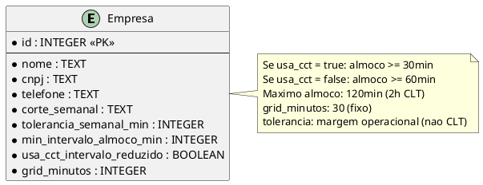
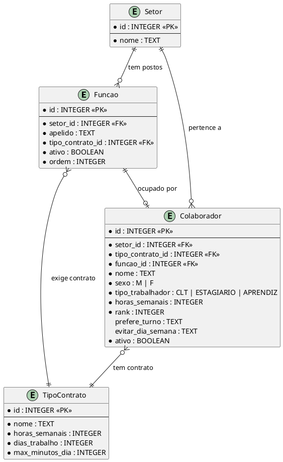
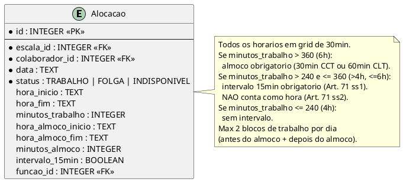
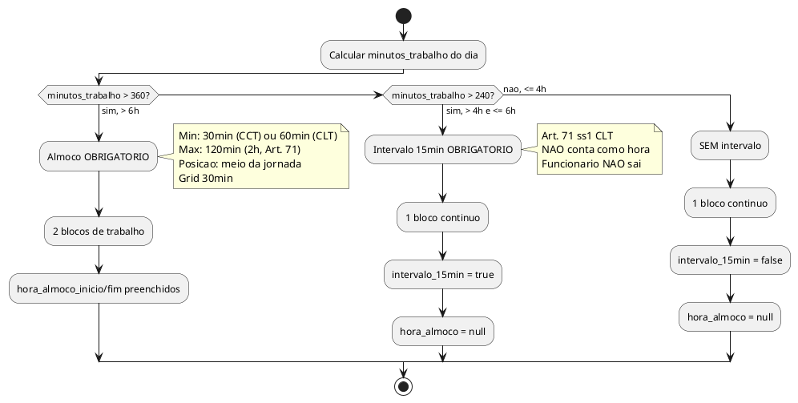
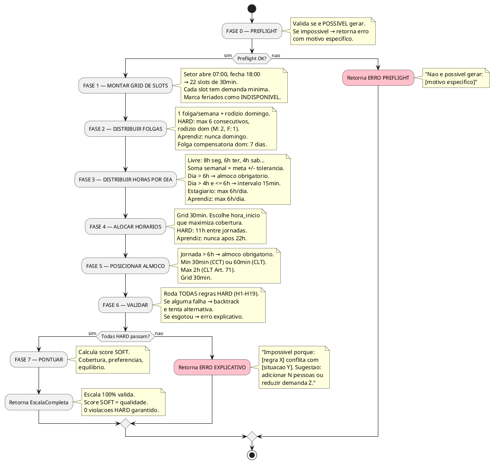

# MOTOR v3 — Especificacao Completa

> **Status:** RASCUNHO — Marco revisando
> **Principio:** O SISTEMA propoe. O RH aprova. Ninguem monta na mao.
> **Filosofia:** Ou compila limpo, ou diz POR QUE nao compila. Nunca gera lixo silencioso.
> **Base legal:** CLT + CCT FecomercioSP x FECOMERCIARIOS (interior/base inorganizada) 2025/2026

---

## TL;DR EXECUTIVO

O motor v2 gera escalas com horarios alienigenas (07:40, 09:50), sem almoco, sem dia curto,
e despeja 38 violacoes pro RH se virar. Motor v3 e um **solver de constraints**:
HARD constraints sao GARANTIDAS (ou retorna erro explicativo), horarios sao em grid de 30min,
almoco e obrigatorio pra jornada > 6h (min 1h CLT, ou 30min com CCT),
intervalo de 15min e obrigatorio pra jornada > 4h e <= 6h (Art. 71 ss1 CLT),
e distribuicao de horas por dia e LIVRE (8h seg, 6h ter, 4h sab — foda-se, desde que feche a meta semanal).

---

## 1. O QUE MUDA: v2 → v3

| Aspecto | Motor v2 (atual) | Motor v3 (novo) |
|---|---|---|
| Horarios | Livres (07:40, 09:50) | **Grid 30min** (07:00, 07:30, 08:00...) |
| Almoco | Nao existe | **Obrigatorio se jornada > 6h** (min 1h CLT, 30min com CCT) |
| Intervalo curto | Nao existe | **15min obrigatorio** se jornada > 4h e <= 6h (Art. 71 ss1) |
| Distribuicao diaria | 44h / 6 = 7h20 todo dia igual | **Livre** — 8h, 6h, 4h, contanto que feche a semana |
| Violacoes HARD | Reporta e segue | **Impossivel gerar. Ponto.** |
| Violacoes SOFT | Misturadas com HARD | Separadas — sao otimizacao, nao erro |
| Saida/volta no dia | Nao modelado | **Max 1 saida/volta** (so pro almoco) |
| Jornada <= 6h > 4h | Mesma que 8h | **Intervalo 15min** (nao conta como hora, Art. 71 ss1) |
| Jornada <= 4h | Mesma que 8h | **Sem intervalo nenhum** |
| Preflight | Nao existe | **Valida ANTES** se e possivel gerar |
| Testes | 10 cenarios | **1 teste por regra HARD** (como npm run test) |
| Feriados | Nao existe | **25/12 e 01/01 proibido** (CCT). Outros: depende CCT |
| Menor aprendiz | Nao diferenciado | **Nunca** domingo, feriado, noturno, hora extra |
| Estagiario | Parcial | **Max 6h/dia, 30h/sem**, nunca hora extra |

---

## 2. MODELO DE DADOS — O QUE MUDA

### 2.1 Empresa (campos novos)

```
Empresa (v3)
├── id, nome, cnpj, telefone         (mantem)
├── corte_semanal                    (mantem)
├── tolerancia_semanal_min           (mantem — decisao de PRODUTO, nao existe na CLT)
├── min_intervalo_almoco_min: number (NOVO — default 60, minimo 30 com CCT)
├── usa_cct_intervalo_reduzido: bool (NOVO — default true pra Supermercado Fernandes)
└── grid_minutos: number             (NOVO — default 30, fixo)
```

**Regras de intervalo (almoco):**
- CLT Art. 71: jornada > 6h → intervalo minimo 1h, maximo 2h
- CCT FecomercioSP interior (Art. 611-A, III): **autoriza reducao pra 30min**
- Se `usa_cct_intervalo_reduzido = true` → `min_intervalo_almoco_min >= 30`
- Se `usa_cct_intervalo_reduzido = false` → `min_intervalo_almoco_min >= 60`
- Maximo SEMPRE 2h (CLT Art. 71 caput). Acima de 2h precisa acordo escrito.

**Sobre tolerancia_semanal_min:**
- A CLT NAO tem tolerancia semanal. Ultrapassou 44h = hora extra, ponto.
- Tolerancia de 5min/batida e 10min/dia existe (Art. 58 ss1), mas e por PONTO, nao semanal.
- O campo `tolerancia_semanal_min` e uma MARGEM OPERACIONAL do produto, nao previsao legal.
- Serve pra o motor ter flexibilidade de encaixe (+/- 30min por semana).



### 2.2 Funcao (NOVA ENTIDADE)

**Conceito central:** O supermercado pensa em POSTOS, nao em pessoas.
"Preciso de alguem no Caixa 1" — nao "preciso da Jessica".

A Funcao e a **vaga na escala**. A pessoa e quem OCUPA a vaga.
Quando Jessica sai de ferias, o posto "Acougueiro A" nao desaparece —
outra pessoa assume aquele ponto especifico.

```
Funcao (NOVA)
├── id: number
├── setor_id: number              (FK — a qual setor pertence)
├── apelido: string               (ex: "Caixa 1", "Acougueiro A", "Balconista Manha")
├── tipo_contrato_id: number      (FK — qual contrato essa vaga exige)
├── ativo: boolean
└── ordem: number                 (ordem de exibicao na escala)
```

**Colaborador ganha campo novo:**
```
Colaborador (v3)
├── ... (tudo que ja tem)
└── funcao_id: number | null      (NOVO — FK pra Funcao. Qual posto ocupa)
```



**Como funciona na pratica:**

```
SETOR: ACOUGUE
├── Posto "Acougueiro A" (CLT 44h) → ocupado por: Jose Luiz
├── Posto "Acougueiro B" (CLT 44h) → ocupado por: Robert
├── Posto "Balconista 1" (CLT 44h) → ocupado por: Jessica
├── Posto "Balconista 2" (CLT 44h) → ocupado por: Alex
└── Posto "Balconista 3" (CLT 44h) → ocupado por: Mateus
```

**Quando Jessica sai de ferias:**
```
├── Posto "Balconista 1" (CLT 44h) → Jessica em FERIAS
│   → Motor sabe: esse posto precisa de cobertura
│   → Pode puxar colaborador de outro setor OU
│   → Redistribuir carga entre os outros postos
│   → Na escala impressa: "Balconista 1: [SUBSTITUTO]"
```

**Regras:**
- Cada Funcao pertence a 1 Setor
- Cada Funcao exige 1 TipoContrato (define as regras de horas)
- Cada Colaborador ocupa 1 Funcao (ou null se nao esta alocado)
- Multiplos colaboradores podem ter `funcao_id = null` (banco de reservas / disponiveis)
- A Funcao e PERSISTENTE — nao morre quando a pessoa sai

### 2.3 Colaborador (campo novo: tipo_trabalhador)

**Novo campo** `tipo_trabalhador` diferencia regras legais:

| Tipo | Jornada max/dia | Jornada max/sem | Domingo | Feriado | Noturno (22h-5h) | Hora extra |
|---|---|---|---|---|---|---|
| **CLT** | 8h (10h com extra) | 44h | Sim (rodizio) | Sim (com CCT) | Sim | Sim (max +2h) |
| **ESTAGIARIO** | 6h | 30h | Pode (se no TCE) | Silencio legislativo | Sim | **NUNCA** |
| **APRENDIZ** | 6h | 30h | **NUNCA** | **NUNCA** | **NUNCA** | **NUNCA** |

```
Colaborador.tipo_trabalhador: 'CLT' | 'ESTAGIARIO' | 'APRENDIZ'
```

Esse campo determina quais regras HARD se aplicam.
O `TipoContrato` define as horas; o `tipo_trabalhador` define as restricoes legais.

### 2.4 TipoContrato (sem mudanca estrutural)

```
TipoContrato (v3) — mantem como esta
├── id, nome
├── horas_semanais: number       (meta semanal — ex: 44, 36, 30, 20)
├── dias_trabalho: number        (quantos dias trabalha — ex: 6, 5)
├── trabalha_domingo: boolean
└── max_minutos_dia: number      (teto legal — ex: 600 = 10h CLT, 360 = 6h estagiario)
```

**Nota importante:** A distribuicao de horas por dia e LIVRE.
O motor decide quanto cada dia tem (4h, 6h, 8h...) para otimizar cobertura.
O que importa:
- Soma semanal = `horas_semanais` x 60 +/- `tolerancia_semanal_min`
- Cada dia <= `max_minutos_dia`
- Jornada > 360min (6h) → almoco obrigatorio
- Jornada > 240min (4h) e <= 360min (6h) → intervalo 15min obrigatorio (Art. 71 ss1)
- Jornada <= 240min (4h) → sem intervalo

### 2.5 Alocacao (campos novos)

```
Alocacao (v3)
├── id, escala_id, colaborador_id, data, status   (mantem)
├── hora_inicio: string | null           (mantem — grid 30min)
├── hora_fim: string | null              (mantem — grid 30min)
├── minutos_trabalho: number | null      (RENOMEIA de 'minutos' — horas efetivas)
├── hora_almoco_inicio: string | null    (NOVO — null se jornada <= 6h)
├── hora_almoco_fim: string | null       (NOVO — null se jornada <= 6h)
├── minutos_almoco: number | null        (NOVO — 0 se jornada <= 6h)
├── intervalo_15min: boolean             (NOVO — true se jornada >4h e <=6h)
└── funcao_id: number | null             (NOVO — qual posto essa alocacao cobre)
```

**Calculos derivados (nao armazenados, calculados em runtime):**
```
minutos_permanencia = (hora_fim - hora_inicio)
minutos_trabalho = minutos_permanencia - minutos_almoco
```

**Nota sobre intervalo 15min (Art. 71 ss1):**
O intervalo de 15min para jornadas > 4h e <= 6h e OBRIGATORIO por lei,
mas NAO e contabilizado como hora de trabalho (Art. 71 ss2).
Na pratica, nao altera o campo `hora_fim` — e uma pausa dentro do bloco continuo.
O motor MARCA que existe (`intervalo_15min = true`) mas nao modela como 2 blocos.
O motivo: essa pausa e curta e o funcionario nao SAI do local (diferente do almoco).

**Exemplos concretos:**

| Tipo de dia | hora_inicio | almoco_ini | almoco_fim | hora_fim | trab. | alm. | perm. | intervalo_15min |
|---|---|---|---|---|---|---|---|---|
| Dia normal 8h | 08:00 | 12:00 | 13:00 | 17:00 | 480 | 60 | 540 | false |
| Dia normal 8h (CCT 30min) | 08:00 | 12:00 | 12:30 | 16:30 | 480 | 30 | 510 | false |
| Dia 6h (com 15min obrig.) | 08:00 | null | null | 14:00 | 360 | 0 | 360 | true |
| Dia 5h (com 15min obrig.) | 08:00 | null | null | 13:00 | 300 | 0 | 300 | true |
| Dia curto 4h (sab) | 08:00 | null | null | 12:00 | 240 | 0 | 240 | false |
| Dia longo 9h | 07:00 | 12:00 | 13:00 | 17:00 | 540 | 60 | 600 | false |
| FOLGA | null | null | null | null | null | null | null | false |



### 2.6 Feriado (NOVA ENTIDADE)

```
Feriado (NOVA)
├── id: number
├── data: string                  (ex: "2026-12-25")
├── nome: string                  (ex: "Natal")
├── tipo: 'NACIONAL' | 'ESTADUAL' | 'MUNICIPAL'
├── proibido_trabalhar: boolean   (true pra 25/12 e 01/01 por CCT)
└── cct_autoriza: boolean         (true se CCT autoriza trabalho nesse feriado)
```

**Regras legais (a partir de 01/03/2026, Portaria MTE 3.665/2023):**
- 25/12 (Natal) e 01/01 (Ano Novo): **PROIBIDO** abrir comercio (CCT FecomercioSP interior)
- Outros feriados: so pode trabalhar **SE a CCT autorizar explicitamente**
- Quem trabalha em feriado sem folga compensatoria: hora extra a 100% (Lei 605/1949)

**Impacto no motor:**
- Se `feriado.proibido_trabalhar = true` → alocacao = INDISPONIVEL pra TODOS
- Se `feriado.cct_autoriza = true` → pode alocar, mas conta como hora especial
- Se `feriado.cct_autoriza = false` (apos 01/03/2026) → INDISPONIVEL
- Menor aprendiz: **NUNCA** trabalha em feriado, independente de CCT (CLT Art. 432)

---

## 3. REGRAS — HARD vs SOFT

### 3.1 Regras HARD (build pass/fail)

Se QUALQUER regra HARD nao pode ser satisfeita → motor NAO gera escala.
Retorna erro explicativo: "Impossivel porque [regra X] conflita com [situacao Y]".

| # | Regra | Descricao | Fundamento Legal | Teste |
|---|---|---|---|---|
| **H1** | MAX_DIAS_CONSECUTIVOS | Max 6 dias seguidos de trabalho | Art. 67 CLT + OJ 410 TST | `diasConsecutivos(c) <= 6` |
| **H2** | DESCANSO_ENTRE_JORNADAS | Min 11h entre fim de uma jornada e inicio da proxima | Art. 66 CLT (inegociavel, Art. 611-B, X) | `inicioHoje - fimOntem >= 660min` |
| **H2b** | DSR_INTERJORNADA | Quando DSR coincide com interjornada, minimo 35h (24+11) | Sumula 110 TST | `descanso >= 2100min quando DSR` |
| **H3** | RODIZIO_DOMINGO_MULHER | Mulher: max 1 domingo consecutivo trabalhado | CLT Art. 386 (STF confirmou) | `domConsecutivos(F) <= 1` |
| **H3b** | RODIZIO_DOMINGO_HOMEM | Homem: max 2 domingos consecutivos trabalhados | Lei 10.101/2000, Art. 6, par. unico | `domConsecutivos(M) <= 2` |
| **H4** | MAX_JORNADA_DIARIA | Jornada normal max 8h (Art. 58). Com extra max 10h (Art. 59) | CLT Art. 58 + Art. 59 | `minutosTrabalho(dia) <= max_minutos_dia` |
| **H5** | EXCECOES_RESPEITADAS | Ferias/atestado = dia indisponivel | CLT | `excecao.data → status INDISPONIVEL` |
| **H6** | ALMOCO_OBRIGATORIO | Jornada > 6h → intervalo >= min_almoco e <= 120min | Art. 71 CLT + Art. 611-A, III | `trab > 360 → almoco >= min_almoco E almoco <= 120` |
| **H7** | INTERVALO_CURTO | Jornada > 4h e <= 6h → intervalo 15min obrigatorio | Art. 71 ss1 CLT | `trab > 240 E trab <= 360 → intervalo_15min = true` |
| **H7b** | SEM_INTERVALO_4H | Jornada <= 4h → nenhum intervalo obrigatorio | Art. 71 ss1 (contrario) | `trab <= 240 → almoco = null E intervalo_15min = false` |
| **H8** | GRID_HORARIOS | Todos horarios multiplos do grid | Decisao de produto | `hora % grid_minutos === 0` |
| **H9** | MAX_SAIDA_VOLTA | Max 1 saida/volta por dia (pro almoco) | Art. 71 CLT (pratica) | `blocos_trabalho(dia) <= 2` |
| **H10** | META_SEMANAL | Soma semanal dentro da tolerancia | CLT Art. 58 (44h) | `\|totalSemana - meta\| <= tolerancia` |
| **H11** | APRENDIZ_DOMINGO | Menor aprendiz NUNCA trabalha domingo | CLT Art. 432 + IN MTE 146 | `aprendiz + domingo = ERRO` |
| **H12** | APRENDIZ_FERIADO | Menor aprendiz NUNCA trabalha feriado | CLT Art. 432 | `aprendiz + feriado = ERRO` |
| **H13** | APRENDIZ_NOTURNO | Menor aprendiz NUNCA trabalha noturno (22h-5h) | CLT Art. 404 + CF Art. 7, XXXIII | `aprendiz + horario >= 22:00 ou < 05:00 = ERRO` |
| **H14** | APRENDIZ_HORA_EXTRA | Menor aprendiz NUNCA faz hora extra | CLT Art. 432 | `aprendiz + minutos > contrato.max = ERRO` |
| **H15** | ESTAGIARIO_JORNADA | Estagiario max 6h/dia e 30h/semana | Lei 11.788/2008, Art. 10 | `estagiario → dia <= 360 E semana <= 1800` |
| **H16** | ESTAGIARIO_HORA_EXTRA | Estagiario NUNCA faz hora extra | Lei 11.788/2008 | `estagiario + minutos > 360 = ERRO` |
| **H17** | FERIADO_PROIBIDO | 25/12 e 01/01: proibido trabalhar (CCT) | CCT FecomercioSP interior | `feriado.proibido → INDISPONIVEL` |
| **H18** | FERIADO_SEM_CCT | Feriado sem autorizacao CCT: proibido (apos 01/03/2026) | Portaria MTE 3.665/2023 | `feriado.cct_autoriza = false → INDISPONIVEL` |
| **H19** | FOLGA_COMPENSATORIA_DOM | Folga compensatoria de domingo dentro de 7 dias | Lei 605/1949 + jurisprudencia | `trabDomingo → folga em ate 7 dias` |
| **H20** | ALMOCO_POSICAO | Almoco NUNCA na 1a ou ultima hora da jornada | TST 5a Turma (RR-1003698) | `almoco_inicio >= hora_inicio + 2h E almoco_fim <= hora_fim - 2h` |

**Sobre H10 (META_SEMANAL):**
- Se o colab esta disponivel a semana inteira: DEVE fechar meta +/- tolerancia
- Se tem excecao (ferias, atestado): meta proporcional aos dias disponiveis
- Semanas parciais (inicio/fim do periodo): meta proporcional
- Na CLT, ultrapassou 44h = hora extra. A tolerancia e margem do PRODUTO.

**Sobre H6 (ALMOCO):**
- CLT Art. 71: minimo 1h, maximo 2h
- CCT FecomercioSP interior autoriza reducao pra 30min (Art. 611-A, III)
- O campo `empresa.usa_cct_intervalo_reduzido` controla isso
- Maximo SEMPRE 2h. Acima de 2h precisa de acordo escrito/CCT (Art. 71 caput)

**Sobre H7 (INTERVALO 15min):**
- CORRECAO da spec anterior que dizia "jornada <= 6h → sem almoco formal"
- A CLT Art. 71 ss1 diz: jornada > 4h e <= 6h → intervalo de 15min OBRIGATORIO
- Esse intervalo NAO conta como hora trabalhada (Art. 71 ss2)
- So jornada <= 4h nao tem intervalo nenhum

**ATENCAO — Sumula 437 IV TST (efeito cliff):**
- Se o funcionario habitualmente trabalha 1 MINUTO alem de 6h, ACIONA o almoco completo
- O limiar de 6h e um CORTE DURO: 6h00 = intervalo 15min. 6h01 = almoco 30/60min
- O motor NUNCA deve gerar jornada entre 6h01 e 6h29 — ou e 6h (com 15min) ou 6h30+ (com almoco)
- Com grid de 30min isso ja e naturalmente respeitado (6h00 ou 6h30, nunca 6h10)

### 3.2 Regras SOFT (otimizacao — nunca bloqueiam)

| # | Regra | Descricao | Peso |
|---|---|---|---|
| **S1** | COBERTURA_DEMANDA | Maximizar pessoas por faixa de demanda | Alto |
| **S2** | PREFERENCIA_TURNO | Respeitar preferencia manha/tarde | Medio |
| **S3** | PREFERENCIA_DIA | Evitar dia da semana que nao quer | Medio |
| **S4** | EQUILIBRIO_CARGA | Distribuicao justa entre colaboradores | Baixo |
| **S5** | CONTINUIDADE_TURNO | Manter mesmo horario durante a semana (estabilidade) | Baixo |

**Diferenca fundamental v2 → v3:**
- v2: SOFT e HARD misturados → RH recebe 38 "violacoes" sem saber o que e grave
- v3: HARD = impossivel existir. SOFT = "poderia ser melhor" com score

---

## 4. LOGICA DE INTERVALOS (ALMOCO + 15min)

### 4.1 Arvore de decisao

```
SE minutos_trabalho > 360 (> 6h):
  → Almoco OBRIGATORIO
  → Duracao: min = empresa.min_intervalo_almoco_min (30 ou 60), max = 120min
  → Posicao: entre os 2 blocos de trabalho
  → Horarios em grid de 30min
  → Funcionario SAI do local (almoco e tempo livre)
  → NAO conta como hora trabalhada

SE minutos_trabalho > 240 E <= 360 (> 4h e <= 6h):
  → Intervalo de 15min OBRIGATORIO (Art. 71 ss1 CLT)
  → NAO conta como hora trabalhada (Art. 71 ss2)
  → Funcionario NAO sai do local (pausa no posto)
  → Alocacao tem 1 bloco continuo (hora_inicio → hora_fim)
  → Flag: intervalo_15min = true
  → SEM almoco formal (hora_almoco = null)
  → Exemplo: estagiario de 6h tem esse intervalo

SE minutos_trabalho <= 240 (<= 4h):
  → SEM intervalo nenhum (Art. 71 ss1, contrario)
  → Bloco continuo puro
  → intervalo_15min = false, almoco = null
```

### 4.2 Posicionamento do almoco (jornada > 6h)

O motor escolhe onde posicionar o almoco considerando:

1. **NUNCA na primeira ou ultima hora** da jornada (TST 5a Turma, RR-100369820175150152:
   almoco no inicio ou fim = equivalente a NAO ter almoco → penalidade Art. 71 ss4)
2. **Perto do meio da jornada** (natural — ninguem almoca as 9h)
3. **Maximizando cobertura** (se demanda pede 3 pessoas as 12h, alocar almoco antes ou depois)
4. **Grid de 30min** (ex: 11:30-12:30, 12:00-13:00, 12:30-13:30)
5. **Min 2h de trabalho antes** e **min 2h de trabalho depois** (jurisprudencia TST consolidada)

**REGRA HARD (H20):** Para jornada de 8h, almoco entre a 3a e 5a hora (ideal: apos 4h).
Para jornada de 6h30-7h, almoco entre a 2a e 4a hora (ideal: apos 3h).
Almoco na primeira ou ultima hora = VIOLACAO HARD.

```
EXEMPLO — Jornada de 8h com almoco de 1h:

Opcao A: 08:00-12:00 [ALMOCO 12:00-13:00] 13:00-17:00
Opcao B: 08:00-12:30 [ALMOCO 12:30-13:30] 13:30-17:30
Opcao C: 08:00-11:30 [ALMOCO 11:30-12:30] 12:30-16:30

Motor escolhe a opcao que maximiza cobertura nas faixas de demanda.
```

**Com CCT intervalo reduzido (30min):**
```
EXEMPLO — Jornada de 8h com almoco de 30min (CCT):

Opcao A: 08:00-12:00 [ALMOCO 12:00-12:30] 12:30-16:30
Opcao B: 08:00-12:30 [ALMOCO 12:30-13:00] 13:00-16:30

Permanencia = 8h30 ao inves de 9h. Funcionario sai 30min mais cedo.
```

### 4.3 A regra da saida/volta

```
REGRA: Funcionario so pode sair e voltar ao trabalho 1 VEZ por dia.

PERMITIDO:
  [trabalho] [almoco] [trabalho]     ← 2 blocos, 1 intervalo

PROIBIDO:
  [trabalho] [pausa] [trabalho] [pausa] [trabalho]   ← 3 blocos, 2 intervalos

Na pratica, isso significa:
  - Com almoco: 2 blocos de trabalho (antes e depois do almoco)
  - Sem almoco: 1 bloco continuo
  - NUNCA mais que 2 blocos
```

**Jornada dividida com intervalo > 2h:**
- Legal (Art. 71 CLT), mas precisa de acordo escrito/CCT
- Motor v3: NAO implementa por enquanto. Limita almoco a max 2h.
- Se futuro precisar: adicionar campo `permite_intervalo_estendido`

### 4.4 Resumo visual



---

## 5. DISTRIBUICAO LIVRE DE HORAS

### 5.1 Como funciona

O motor v2 faz: `44h / 6 dias = 7h20 todo dia`. Uniforme, burro, irrealista.

O motor v3 distribui LIVREMENTE:

```
META SEMANAL: 44h (2640 min)
DIAS DISPONIVEIS: 6 (seg-sab)

POSSIBILIDADE A: 8h + 8h + 8h + 8h + 8h + 4h = 44h  ✅
POSSIBILIDADE B: 9h + 9h + 8h + 8h + 6h + 4h = 44h  ✅
POSSIBILIDADE C: 8h + 7h + 8h + 7h + 8h + 6h = 44h  ✅
POSSIBILIDADE D: 6h + 6h + 8h + 8h + 8h + 8h = 44h  ✅
```

**O motor escolhe a distribuicao que MAXIMIZA a cobertura de demanda.**

Se terca-feira tem demanda alta a tarde → coloca 9h com turno que cobre mais tarde.
Se sabado tem demanda baixa → coloca 4h so de manha.

### 5.2 Constraints na distribuicao

```
PRA CADA DIA:
  - minutos_trabalho <= contrato.max_minutos_dia (ex: 600 = 10h CLT, 360 = 6h estagiario)
  - minutos_trabalho > 360 → almoco obrigatorio (H6)
  - minutos_trabalho > 240 e <= 360 → intervalo 15min obrigatorio (H7)
  - minutos_trabalho <= 240 → sem intervalo (H7b)
  - minutos_trabalho >= 240 (minimo 4h por dia trabalhado — decisao de produto)

PRA SEMANA:
  - soma(minutos_trabalho) = meta +/- tolerancia
  - dias_folga >= (7 - contrato.dias_trabalho)
```

### 5.3 Minimo de horas por dia

**RESPOSTA da pesquisa CLT:** NAO existe minimo legal na CLT.
Pode ser 1h, 2h, qualquer coisa. A lei e silente.

**Decisao de PRODUTO:** Minimo 4h (240min) por dia trabalhado.
Justificativa operacional:
- Abaixo de 4h nao justifica deslocamento do funcionario
- Abaixo de 4h nao tem intervalo nenhum (Art. 71 ss1)
- O motor ganha margem melhor com dias de 4h+ pra fechar a meta semanal

> Marco: Confirmar se 4h e o minimo ou quer outro valor.

---

## 6. GRID DE 30 MINUTOS

### 6.1 Regra

Todos os horarios DEVEM ser multiplos de 30 minutos:

```
VALIDOS:   07:00, 07:30, 08:00, 08:30, 09:00, 09:30, 10:00 ...
INVALIDOS: 07:40, 09:50, 12:10, 14:15, 16:45
```

Isso se aplica a:
- `hora_inicio` (inicio do trabalho)
- `hora_almoco_inicio` (inicio do almoco)
- `hora_almoco_fim` (fim do almoco)
- `hora_fim` (fim do trabalho)

### 6.2 Grid fixo

O grid e **fixo em 30min**. Nao e configuravel pela empresa.
A CLT fala em tolerancia de 5min/batida (Art. 58 ss1), que e sobre PONTO,
nao sobre escala. Grid de 30min e pratica de mercado e decisao de produto.

### 6.3 Impacto na duracao

Com grid de 30min, as duracoes possiveis sao:

```
DURACOES DE TRABALHO (em horas):
4:00, 4:30, 5:00, 5:30, 6:00, 6:30, 7:00, 7:30, 8:00, 8:30, 9:00, 9:30, 10:00

INTERVALOS DE ALMOCO:
0:30 (se CCT), 1:00, 1:30, 2:00 (grid de 30min, CLT max 2h)
```

**Implicacao para meta semanal:**
- CLT 44h = 2640 min / 30 = 88 slots → FECHA PERFEITO
- 36h = 2160 min / 30 = 72 slots → FECHA PERFEITO
- 30h = 1800 min / 30 = 60 slots → FECHA PERFEITO
- 20h = 1200 min / 30 = 40 slots → FECHA PERFEITO

---

## 7. FASES DO MOTOR v3



### 7.0 FASE 0 — PREFLIGHT

Antes de qualquer calculo, valida se e POSSIVEL gerar:

```
CHECKS OBRIGATORIOS:

1. Setor existe e esta ativo?
2. Tem colaboradores ativos no setor? (minimo 1)
3. Tem demandas cadastradas?
4. Empresa tem min_intervalo_almoco configurado?
5. Periodo solicitado tem feriados proibidos? (marca como INDISPONIVEL)

CHECKS DE CAPACIDADE:

6. Horas disponiveis >= horas de demanda?
   → Soma(colabs x horas_semanais) >= Soma(demanda x faixas x dias)
   → Se nao: "Precisa de +N pessoas OU reduzir demanda na faixa X"

7. Pra cada faixa de demanda, tem colabs suficientes pra cobrir?
   → Se faixa pede 3 pessoas e so tem 4 colabs (1 folga = 3 dispo) → apertado mas OK
   → Se faixa pede 3 pessoas e so tem 3 colabs → IMPOSSIVEL (alguem tem folga)

CHECKS DE TIPO:

8. Menor aprendiz no setor? → Validar que nao tem demanda em domingo/feriado/noturno
9. Estagiario no setor? → Validar que nao tem demanda que exige > 6h
```

**Se PREFLIGHT falha → nao tenta gerar. Retorna erro com sugestao.**

### 7.1 FASE 1 — MONTAR GRID DE SLOTS

```
Input: Setor (hora_abertura, hora_fechamento), Demandas, empresa.grid_minutos, Feriados

Exemplo: Setor ACOUGUE, 07:00-18:00, grid 30min

GRID:
| Slot | Hora        | Demanda SEG | Demanda SAB | Feriado? |
|------|-------------|-------------|-------------|----------|
|  0   | 07:00-07:30 |     2       |     2       | N/A      |
|  1   | 07:30-08:00 |     2       |     2       | N/A      |
|  2   | 08:00-08:30 |     3       |     3       | N/A      |
|  3   | 08:30-09:00 |     3       |     3       | N/A      |
| ...  | ...         |   ...       |   ...       |          |
| 21   | 17:30-18:00 |     2       |     2       | N/A      |

Cada slot herda o min_pessoas da faixa de demanda que o contem.
Se slot esta na intersecao de 2 faixas, usa o MAIOR min_pessoas.
Slots em dias de feriado proibido → demanda = 0 (ninguem trabalha).
```

### 7.2 FASE 2 — DISTRIBUIR FOLGAS

```
Pra cada colaborador, pra cada semana do periodo:
  1. Tem direito a (7 - dias_trabalho) folgas na semana
  2. CLT 44h (6 dias) → 1 folga/semana
  3. CLT 36h (5 dias) → 2 folgas/semana
  4. Estagiario 30h (5 dias) → 2 folgas/semana

RODIZIO DE DOMINGO:
  - Mulheres: trabalha 1 domingo, folga o proximo (max 1 consecutivo) — Art. 386 CLT
  - Homens: trabalha ate 2 domingos, folga o terceiro (max 2 consecutivos) — Lei 10.101
  - Menor aprendiz: NUNCA trabalha domingo — Art. 432 CLT
  - Estagiario: pode (se no TCE — Termo de Compromisso de Estagio)

FOLGA COMPENSATORIA (H19):
  - Trabalhou domingo → folga compensatoria dentro de 7 dias (Lei 605/1949)

FERIADOS:
  - Feriado com proibido_trabalhar = true → INDISPONIVEL pra todos
  - Feriado sem autorizacao CCT (apos 01/03/2026) → INDISPONIVEL
  - Menor aprendiz: NUNCA trabalha feriado, mesmo com CCT

CONSTRAINT SOLVER:
  - Distribuir folgas de forma que NENHUM colab trabalhe > 6 dias seguidos (H1)
  - Se domingo e folga, a outra folga da semana pode ser qualquer dia
  - Preferencia: folga no dia que colab quer evitar (S3)
```

### 7.3 FASE 3 — DISTRIBUIR HORAS POR DIA

```
Pra cada colaborador, pra cada semana:
  META: contrato.horas_semanais x 60 (ex: 44h = 2640min)
  DIAS_TRABALHO: dias que nao sao folga nessa semana

  RESTRICOES POR TIPO:
  - CLT: max 10h/dia (Art. 59), meta 44h/sem ou conforme contrato
  - Estagiario: max 6h/dia, max 30h/sem (Lei 11.788, Art. 10)
  - Aprendiz: max 6h/dia, max 30h/sem (CLT Art. 432)

  DISTRIBUICAO LIVRE:
  - Cada dia pode ter duracao diferente
  - Soma dos dias = META +/- tolerancia
  - Cada dia <= contrato.max_minutos_dia
  - Cada dia >= 240min (4h, minimo operacional)
  - Duracoes em multiplos de 30min

  CRITERIO DE ESCOLHA:
  - Dias com ALTA demanda → mais horas (8h, 9h)
  - Dias com BAIXA demanda → menos horas (4h, 5h, 6h)
  - Dia que precisa de cobertura no fim da tarde → turno mais longo

  MARCA INTERVALO:
  - Se minutos_trabalho_dia > 360 → almoco_obrigatorio = true
  - Se minutos_trabalho_dia > 240 e <= 360 → intervalo_15min = true
  - Se minutos_trabalho_dia <= 240 → sem intervalo
```

### 7.4 FASE 4 — ALOCAR HORARIOS

```
Pra cada colaborador, pra cada dia de trabalho:
  DURACAO ja definida na Fase 3 (ex: 480min = 8h)
  ALMOCO? Se > 360min → sim (ex: 60min ou 30min CCT)
  PERMANENCIA = trabalho + almoco (ex: 480 + 60 = 540min = 9h)

  GERAR CANDIDATOS de hora_inicio (grid 30min):
  - Cada hora_inicio possivel dentro do setor
  - hora_inicio tal que hora_inicio + permanencia <= setor.hora_fechamento
  - hora_inicio >= setor.hora_abertura

  CONSTRAINT: DESCANSO ENTRE JORNADAS (H2)
  - Se ontem terminou as 21:00 → hoje so pode comecar as 08:00 (21+11=08)
  - hora_inicio_hoje >= hora_fim_ontem + 660min (convertido)

  CONSTRAINT: DSR + INTERJORNADA (H2b)
  - Se hoje e retorno apos DSR → descanso >= 2100min (35h = 24h DSR + 11h interjornada)

  CONSTRAINT: APRENDIZ NOTURNO (H13)
  - Se aprendiz → hora_fim <= 22:00 E hora_inicio >= 05:00

  SCORING DE CADA CANDIDATO:
  - Quantos slots de demanda deficitarios esse turno cobre?
  - Preferencia de turno (manha/tarde) — bonus se respeita
  - Continuidade — bonus se mantem horario similar ao dia anterior

  ESCOLHE melhor candidato por score.
```

### 7.5 FASE 5 — POSICIONAR ALMOCO

```
Pra cada alocacao com almoco_obrigatorio = true:
  TRABALHO_TOTAL = minutos_trabalho (ex: 480min)
  ALMOCO_DURACAO = empresa.min_intervalo_almoco_min (ex: 30 ou 60min)

  BLOCO_1 = primeira metade do trabalho
  BLOCO_2 = segunda metade do trabalho
  ALMOCO entre BLOCO_1 e BLOCO_2

  GERAR CANDIDATOS de posicao do almoco (grid 30min):
  - hora_almoco_inicio >= hora_inicio + 120min (min 2h antes do almoco)
  - hora_almoco_inicio <= hora_fim - ALMOCO_DURACAO - 120min (min 2h depois)
  - Exemplo: turno 08:00-17:00, almoco 1h → almoco entre 10:00 e 14:00

  MAXIMO DO ALMOCO:
  - Sempre <= 120min (2h, Art. 71 CLT)
  - Acima de 2h precisa de acordo escrito ou CCT (Art. 71 caput)
  - Motor v3 limita a 2h, nao implementa jornada dividida > 2h

  SCORING:
  - Preferir meio da jornada (natural)
  - Maximizar cobertura: se faixa 12:00-14:00 precisa de gente,
    alocar almoco ANTES (11:00-11:30 com CCT) ou DEPOIS (14:00-15:00)

  Pra jornada > 4h e <= 6h:
  - Sem almoco. Bloco continuo.
  - hora_almoco_inicio = null, hora_almoco_fim = null
  - Motor marca intervalo_15min = true (existe, mas nao modela posicao)

  Pra jornada <= 4h:
  - Sem almoco, sem intervalo. Bloco continuo puro.
```

### 7.6 FASE 6 — VALIDAR (suite de testes)

```
RODA TODAS AS REGRAS HARD (H1-H19):

--- JORNADA ---
✅ H1:   Max 6 dias consecutivos?
✅ H2:   Min 11h entre jornadas?
✅ H2b:  DSR + interjornada = 35h quando coincide?
✅ H4:   Max horas/dia respeitado?
✅ H10:  Meta semanal dentro da tolerancia?

--- INTERVALOS ---
✅ H6:   Almoco presente se > 6h? (min 30/60, max 120min)
✅ H7:   Intervalo 15min marcado se > 4h e <= 6h?
✅ H7b:  Sem intervalo se <= 4h?
✅ H9:   Max 2 blocos de trabalho/dia?

--- DOMINGO ---
✅ H3:   Rodizio domingo mulher (max 1 consecutivo)?
✅ H3b:  Rodizio domingo homem (max 2 consecutivos)?
✅ H11:  Aprendiz fora do domingo?
✅ H19:  Folga compensatoria domingo dentro de 7 dias?

--- EXCECOES E FERIADOS ---
✅ H5:   Excecoes respeitadas?
✅ H17:  Feriados proibidos respeitados (25/12, 01/01)?
✅ H18:  Feriados sem CCT respeitados (apos 01/03/2026)?
✅ H12:  Aprendiz fora de feriados?

--- TIPOS ESPECIAIS ---
✅ H13:  Aprendiz fora do noturno (22h-5h)?
✅ H14:  Aprendiz sem hora extra?
✅ H15:  Estagiario max 6h/dia e 30h/sem?
✅ H16:  Estagiario sem hora extra?

--- POSICIONAMENTO ---
✅ H20:  Almoco nunca na 1a ou ultima hora da jornada?

--- GRID ---
✅ H8:   Grid 30min em todos horarios?

SE TODAS PASSAM → Fase 7 (pontuar)
SE ALGUMA FALHA → Backtrack: tenta redistribuir
  - Tenta trocar folga de dia
  - Tenta redistribuir horas
  - Tenta trocar horario
  - Se ESGOTOU tentativas → ERRO com constraint que nao fecha
```

### 7.7 FASE 7 — PONTUAR (score SOFT)

```
SCORE = 100 (base)

Pra cada regra SOFT violada:
  S1 (cobertura): -2 pontos por slot nao coberto
  S2 (pref turno): -1 ponto por dia fora da preferencia
  S3 (pref dia): -1 ponto por dia trabalhado no dia que quer evitar
  S4 (equilibrio): -1 ponto por desvio de carga entre colabs
  S5 (continuidade): -0.5 por mudanca de horario na semana

SCORE FINAL = max(0, score)

RETORNA:
  - Escala com 0 violacoes HARD (garantido)
  - Score SOFT (0-100, quanto maior melhor)
  - Lista de violacoes SOFT (sugestoes, nao erros)
```

---

## 8. ERROS EXPLICATIVOS

Quando o motor NAO CONSEGUE gerar, retorna erro UTIL:

```
PREFLIGHT:
  "Setor ACOUGUE tem 5 colaboradores mas demanda pede minimo 3 pessoas
   das 15:00-17:00. Com 1 folga/dia, sobram 4. Mas 2 precisam estar
   no turno da manha pra cobrir faixa 08:00-10:00. Sobram 2 pra faixa
   15:00-17:00. Impossivel cobrir 3.
   → Sugestao: adicionar 1 colaborador OU reduzir demanda 15:00-17:00 para 2."

CONSTRAINT:
  "Colaborador Jessica nao pode trabalhar mais que 6 dias seguidos (H1),
   mas o rodizio de domingo exige que ela trabalhe DOM 08/03 e DOM 15/03
   com apenas 5 dias de intervalo.
   → Sugestao: trocar rodizio de Jessica com Robert nessa semana."

FERIADO:
  "25/12/2026 (Natal) e PROIBIDO trabalhar por CCT.
   Todos os colaboradores foram marcados como INDISPONIVEL nessa data.
   Semana com feriado: meta semanal proporcional (37.7h ao inves de 44h)."

APRENDIZ:
  "Menor aprendiz Carlos esta escalado pra domingo 15/03.
   Aprendizes NAO podem trabalhar domingo (CLT Art. 432).
   → Sugestao: trocar Carlos com colaborador CLT nesse dia."
```

---

## 9. SUITE DE TESTES

### Estrutura

```
src/main/motor/__tests__/
├── h1-max-dias-consecutivos.test.ts
├── h2-descanso-entre-jornadas.test.ts
├── h2b-dsr-interjornada.test.ts
├── h3-rodizio-domingo-mulher.test.ts
├── h3b-rodizio-domingo-homem.test.ts
├── h4-max-jornada-diaria.test.ts
├── h5-excecoes-respeitadas.test.ts
├── h6-almoco-obrigatorio.test.ts
├── h7-intervalo-15min.test.ts
├── h7b-sem-intervalo-4h.test.ts
├── h8-grid-horarios.test.ts
├── h9-max-saida-volta.test.ts
├── h10-meta-semanal.test.ts
├── h11-aprendiz-domingo.test.ts
├── h12-aprendiz-feriado.test.ts
├── h13-aprendiz-noturno.test.ts
├── h14-aprendiz-hora-extra.test.ts
├── h15-estagiario-jornada.test.ts
├── h16-estagiario-hora-extra.test.ts
├── h17-feriado-proibido.test.ts
├── h18-feriado-sem-cct.test.ts
├── h19-folga-compensatoria-dom.test.ts
├── h20-almoco-posicao.test.ts
├── preflight-capacidade.test.ts
├── integracao-escala-completa.test.ts
└── distribuicao-livre.test.ts
```

### Formato de cada teste

```typescript
// h6-almoco-obrigatorio.test.ts

describe('H6 — Almoco obrigatorio se jornada > 6h', () => {

  test('jornada de 8h DEVE ter almoco >= min_almoco', () => {
    const escala = gerarEscala({
      colaboradores: [colab44h],
      demandas: [demandaPadrao],
      empresa: { min_intervalo_almoco_min: 60, usa_cct_intervalo_reduzido: false },
    })

    for (const aloc of escala.alocacoes) {
      if (aloc.status === 'TRABALHO' && aloc.minutos_trabalho > 360) {
        expect(aloc.minutos_almoco).toBeGreaterThanOrEqual(60)
        expect(aloc.hora_almoco_inicio).not.toBeNull()
        expect(aloc.hora_almoco_fim).not.toBeNull()
      }
    }
  })

  test('jornada de 8h com CCT permite almoco de 30min', () => {
    const escala = gerarEscala({
      colaboradores: [colab44h],
      demandas: [demandaPadrao],
      empresa: { min_intervalo_almoco_min: 30, usa_cct_intervalo_reduzido: true },
    })

    for (const aloc of escala.alocacoes) {
      if (aloc.status === 'TRABALHO' && aloc.minutos_trabalho > 360) {
        expect(aloc.minutos_almoco).toBeGreaterThanOrEqual(30)
      }
    }
  })

  test('almoco NUNCA pode passar de 2h (120min)', () => {
    const escala = gerarEscala({
      colaboradores: [colab44h],
      demandas: [demandaPadrao],
      empresa: { min_intervalo_almoco_min: 60 },
    })

    for (const aloc of escala.alocacoes) {
      if (aloc.minutos_almoco) {
        expect(aloc.minutos_almoco).toBeLessThanOrEqual(120)
      }
    }
  })
})

// h7-intervalo-15min.test.ts

describe('H7 — Intervalo 15min obrigatorio (> 4h e <= 6h)', () => {

  test('jornada de 6h DEVE ter intervalo_15min = true', () => {
    const escala = gerarEscala({
      colaboradores: [colabEstagiario30h],  // 30h/5dias = 6h/dia
      demandas: [demandaPadrao],
    })

    for (const aloc of escala.alocacoes) {
      if (aloc.status === 'TRABALHO' && aloc.minutos_trabalho > 240 && aloc.minutos_trabalho <= 360) {
        expect(aloc.intervalo_15min).toBe(true)
        expect(aloc.hora_almoco_inicio).toBeNull()  // NAO tem almoco formal
      }
    }
  })

  test('jornada de 4h NAO deve ter intervalo_15min', () => {
    const escala = gerarEscala({
      colaboradores: [colab44h],  // pode ter dia curto de 4h
      demandas: [demandaBaixa],
    })

    for (const aloc of escala.alocacoes) {
      if (aloc.status === 'TRABALHO' && aloc.minutos_trabalho <= 240) {
        expect(aloc.intervalo_15min).toBe(false)
        expect(aloc.hora_almoco_inicio).toBeNull()
      }
    }
  })

  test('jornada de 5h (300min) DEVE ter intervalo_15min = true', () => {
    // 5h = 300min, esta entre 240 e 360 → intervalo obrigatorio
    // ...
  })
})
```

### Como rodar

```bash
# Rodar todos os testes do motor
npm run test:motor

# Rodar teste especifico
npm run test:motor -- --filter h6

# Equivalente a "npm run build" — se falhar, motor ta bugado
```

---

## 10. EXEMPLO PRATICO: ACOUGUE (5 postos, CLT 44h)

### Input

```
Empresa: min_intervalo_almoco_min = 30, usa_cct_intervalo_reduzido = true, grid_minutos = 30
Setor: ACOUGUE, 07:00-18:00
Contratos: Todos CLT 44h (6 dias, max 600min/dia)

Funcoes (postos):
  Acougueiro A  (CLT 44h) → Jose Luiz (M, CLT)
  Acougueiro B  (CLT 44h) → Robert (M, CLT)
  Balconista 1  (CLT 44h) → Jessica (F, CLT)
  Balconista 2  (CLT 44h) → Alex (M, CLT)
  Balconista 3  (CLT 44h) → Mateus (M, CLT)

Demandas:
  07:00-08:00: 2 pessoas
  08:00-10:00: 3 pessoas
  10:00-12:00: 2 pessoas
  12:00-15:00: 2 pessoas
  15:00-17:00: 2 pessoas (ajustada de 3 → 2 apos preflight)
  17:00-18:00: 2 pessoas

Feriados no periodo: nenhum
```

### ESCALA GERADA (com almoco 30min CCT)

```
SEMANA 1 (coluna principal = POSTO):

| Posto         | Pessoa    | SEG             | TER             | QUA             | QUI          | SEX             | SAB          |
|---------------|-----------|-----------------|-----------------|-----------------|--------------|-----------------|--------------|
| Acougueiro A  | Jose Luiz | 07:00-15:30     | 07:00-15:30     | 07:00-15:30     | FOLGA        | 07:00-15:30     | 07:00-11:00  |
|               |           | alm 11:00-11:30 | alm 11:00-11:30 | alm 11:00-11:30 |              | alm 11:00-11:30 | sem almoco   |
|               |           | 8h trab         | 8h trab         | 8h trab         |              | 8h trab         | 4h trab      |
| Acougueiro B  | Robert    | 07:00-15:30     | 07:00-15:30     | FOLGA           | 07:00-15:30  | 07:00-15:30     | 07:00-11:00  |
|               |           | alm 11:30-12:00 | alm 11:30-12:00 |                 | alm 11:30-12 | alm 11:30-12:00 | sem almoco   |
|               |           | 8h trab         | 8h trab         |                 | 8h trab      | 8h trab         | 4h trab      |
| Balconista 1  | Jessica   | 09:30-18:00     | 09:30-18:00     | 09:30-18:00     | 09:30-18:00  | FOLGA           | 08:00-12:00  |
|               |           | alm 13:00-13:30 | alm 13:00-13:30 | alm 13:00-13:30 | alm 13:00-13 |                 | sem almoco   |
|               |           | 8h trab         | 8h trab         | 8h trab         | 8h trab      |                 | 4h trab      |
| Balconista 2  | Alex      | 09:30-18:00     | 09:30-18:00     | 09:30-18:00     | 09:30-18:00  | 09:30-18:00     | FOLGA        |
|               |           | alm 13:30-14:00 | alm 13:30-14:00 | alm 13:30-14:00 | alm 13:30-14 | alm 13:30-14:00 |              |
|               |           | 8h trab         | 8h trab         | 8h trab         | 8h trab      | 8h trab         |              |
| Balconista 3  | Mateus    | 08:00-16:30     | FOLGA           | 08:00-16:30     | 08:00-16:30  | 08:00-16:30     | 08:00-14:00  |
|               |           | alm 12:00-12:30 |                 | alm 12:00-12:30 | alm 12:00-12 | alm 12:00-12:30 | sem almoco   |
|               |           | 8h trab         |                 | 8h trab         | 8h trab      | 8h trab         | 6h trab      |

TOTAIS SEMANAIS:
  Jose Luiz: 4x8h + 1x4h = 36h ... faltam 8h → redistribuir (+DOM ou ajustar)
  Robert:    4x8h + 1x4h = 36h ... idem
  Jessica:   4x8h + 1x4h = 36h ... idem
  Alex:      5x8h = 40h ... faltam 4h → ajustar
  Mateus:    4x8h + 1x6h = 38h ... faltam 6h → ajustar

→ Nota: Exemplo simplificado. Motor real otimiza pra fechar 44h
  (inclui domingo na rotacao, ajusta duracao dos dias, etc.)
```

> **NOTA:** Exemplo ilustrativo. O ponto e:
> POSTOS como coluna principal, horarios limpos (grid 30min),
> almoco explicito (30min CCT), permanencia = trabalho + almoco.
> O RH olha e reconhece: "Acougueiro A ta coberto, Balconista 1 ta de ferias sexta".

---

## 11. CONSTANTS.TS PROPOSTO (v3)

```typescript
// --- CLT Constants (imutaveis -- hardcoded no motor) ---
export const CLT = {
  // Jornada
  MAX_JORNADA_NORMAL_MIN: 480,           // 8h em minutos (Art. 58)
  MAX_JORNADA_COM_EXTRA_MIN: 600,        // 10h em minutos (Art. 59)
  MIN_DESCANSO_ENTRE_JORNADAS_MIN: 660,  // 11h em minutos (Art. 66, inegociavel)
  DSR_INTERJORNADA_MIN: 2100,            // 35h em minutos (24h DSR + 11h, Sumula 110)
  MAX_DIAS_CONSECUTIVOS: 6,              // Art. 67 + OJ 410 TST

  // Intervalos
  ALMOCO_MIN_CLT_MIN: 60,               // 1h minimo sem CCT (Art. 71)
  ALMOCO_MIN_CCT_MIN: 30,               // 30min com CCT (Art. 611-A, III)
  ALMOCO_MAX_MIN: 120,                   // 2h maximo (Art. 71 caput)
  INTERVALO_CURTO_MIN: 15,              // 15min pra jornada >4h e <=6h (Art. 71 ss1)
  LIMIAR_ALMOCO_MIN: 360,               // >6h = almoco obrigatorio
  LIMIAR_INTERVALO_CURTO_MIN: 240,      // >4h = intervalo 15min obrigatorio

  // Domingo
  MAX_DOMINGOS_CONSECUTIVOS: {
    M: 2,  // Homem: Lei 10.101/2000
    F: 1,  // Mulher: CLT Art. 386 (STF confirmou)
  },
  FOLGA_COMPENSATORIA_DOM_DIAS: 7,       // Lei 605/1949

  // Estagiario (Lei 11.788/2008)
  ESTAGIARIO_MAX_JORNADA_MIN: 360,       // 6h/dia
  ESTAGIARIO_MAX_SEMANAL_MIN: 1800,      // 30h/semana
  // Art. 10 ss2: periodo de provas → reduz pela METADE (3h/dia, 15h/sem)

  // Menor aprendiz (CLT Art. 432 + CF Art. 7 XXXIII)
  APRENDIZ_MAX_JORNADA_MIN: 360,         // 6h/dia
  APRENDIZ_MAX_SEMANAL_MIN: 1800,        // 30h/semana
  APRENDIZ_HORARIO_NOTURNO_INICIO: '22:00',
  APRENDIZ_HORARIO_NOTURNO_FIM: '05:00',

  // Grid
  GRID_MINUTOS: 30,                       // Fixo, decisao de produto

  // Tolerancia de ponto (nao de escala — NAO e tolerancia semanal)
  TOLERANCIA_PONTO_BATIDA_MIN: 5,        // Art. 58 ss1 (por marcacao)
  TOLERANCIA_PONTO_DIA_MIN: 10,          // Art. 58 ss1 (por dia)
  // ATENCAO Sumula 366 TST: se ultrapassar 10min/dia, TODO o excesso vira HE
  // ATENCAO Sumula 449 TST: tolerancia NAO pode ser ampliada por CCT
} as const

// --- Feriados proibidos por CCT (FecomercioSP interior) ---
export const FERIADOS_CCT_PROIBIDOS = ['12-25', '01-01'] as const  // MM-DD

// --- Tipos de trabalhador ---
export const TIPOS_TRABALHADOR = ['CLT', 'ESTAGIARIO', 'APRENDIZ'] as const
export type TipoTrabalhador = typeof TIPOS_TRABALHADOR[number]
```

---

## 12. PERGUNTAS E RESPOSTAS (pesquisa CLT/CCT aplicada)

| # | Pergunta | Resposta | Fonte |
|---|---|---|---|
| 1 | Minimo de horas por dia trabalhado? | **NAO existe na CLT.** Decisao de produto: 4h (240min). | Silencio legislativo |
| 2 | Maximo de almoco? | **2h (120min).** Acima precisa acordo escrito/CCT. | Art. 71 CLT |
| 3 | Almoco sempre >= 2h apos inicio da jornada? | **CLT nao especifica hora antes do almoco.** Boa pratica: min 2h antes e 2h depois. Jurisprudencia entende "no curso da jornada". | Jurisprudencia |
| 4 | Grid diferente de 30min? | **30min fixo.** Decisao de produto. CLT so fala de tolerancia de ponto (5min/batida). | Art. 58 ss1 CLT |
| 5 | Se preflight falha, mostra modal com sugestoes? | **Sim** — decisao de produto. | — |
| 6 | Manter campo `minutos` como alias? | **Nao, renomear pra `minutos_trabalho`.** | — |
| 7 | Export mostra horario de almoco? | **Sim, coluna separada.** | — |
| 8 | Colaborador pode ocupar mais de 1 posto? | **Nao, 1:1** (versao atual). Futuro: cobertura de ferias. | — |
| 9 | Pode existir posto sem ninguem? | **Sim, motor avisa** "Posto X sem colaborador alocado". | — |
| 10 | Escala por POSTO ou por PESSOA? | **Por POSTO** (coluna principal = posto). | — |
| 11 | Colab sem funcao_id pode ser reserva? | **Sim, banco de reservas.** | — |
| 12 | Motor gera por funcao ou vincula antes? | **Gera ja com pessoa.** Funcao e contexto, nao unidade de geracao. | — |
| 13 | Intervalo de 15min pra jornada de 6h? | **OBRIGATORIO.** Art. 71 ss1 CLT. NAO conta como hora. | Art. 71 ss1 CLT |
| 14 | Almoco pode ser reduzido pra 30min? | **SIM, com CCT.** FecomercioSP interior autoriza. | CCT + Art. 611-A, III |
| 15 | Tolerancia semanal existe na CLT? | **NAO.** Ultrapassou 44h = hora extra. Campo e margem operacional. | — |
| 16 | Intervalo almoco conta como hora? | **NAO.** Art. 71 ss2 CLT. | Art. 71 ss2 CLT |
| 17 | Estagiario pode trabalhar domingo? | **Pode,** se consta no TCE. Silencio legislativo. | Silencio legislativo |
| 18 | Menor aprendiz pode trabalhar domingo? | **NUNCA.** CLT Art. 432 + IN MTE 146. | CLT Art. 432 |
| 19 | Feriados a partir de 01/03/2026? | **So com CCT autorizando.** Portaria MTE 3.665/2023. | Portaria 3.665/2023 |
| 20 | 25/12 e 01/01? | **PROIBIDO** trabalhar. CCT FecomercioSP interior. | CCT |
| 21 | Banco de horas tiers? | **3 niveis:** 12 meses (CCT), 6 meses (individual escrito), mesmo mes (tacito). SP interior = 12 meses. | Art. 59 ss2, ss5, ss6 |
| 22 | Estagiario em periodo de provas? | **Reduz pela METADE** (3h/dia, 15h/sem). Art. 10 ss2 Lei 11.788. | Lei 11.788 Art. 10 ss2 |
| 23 | Almoco na 1a/ultima hora? | **PROIBIDO.** TST 5a Turma: equivale a nao ter almoco. Penalidade Art. 71 ss4. | TST RR-1003698 |
| 24 | Tolerancia de ponto ultrapassa 10min? | **TODO o excesso vira HE** (efeito cliff, nao gradual). CCT nao pode ampliar. | Sumula 366 + 449 TST |

---

## 13. DISCLAIMERS CRITICOS

### Backtracking pode ser lento

Com muitos colaboradores e constraints apertadas, o solver pode demorar.
Mitigacao: timeout (30s atual), heuristicas de poda, cache de solucoes parciais.

### "Impossivel" precisa ser preciso

Quando o motor diz "impossivel", precisa dizer EXATAMENTE qual constraint
nao fecha e o que o RH pode mudar. Senao o RH fica perdido.

### Migracao v2 → v3

- Alocacoes existentes nao tem campos de almoco, intervalo_15min, funcao_id
- Schema migration necessaria (adicionar colunas, migrar dados)
- Escalas v2 podem ser re-validadas com regras v3
- Adicionar tabela `feriados`
- Adicionar tabela `funcoes`
- Adicionar campo `tipo_trabalhador` em colaboradores

### Interacao com pinnedCells

O motor v2 tem conceito de pinnedCells (celulas fixadas pelo usuario no drag-drop).
O v3 deve respeitar pins MAS validar que pins nao violam HARD constraints.
Se pin viola → avisar: "Celula fixada em [X] viola regra [Y]. Deseja remover o pin?"

### 3 itens que precisam confirmar com ligacao

1. **SINCOVARP:** Confirmar que Luis Antonio segue CCT da base inorganizada
2. **Pisos salariais:** Pegar PDF MR066541/2025 com pisos exatos do interior
3. **Camara Municipal:** Verificar se existe lei municipal sobre horario de comercio

### Portaria 3.665/2023

A partir de 01/03/2026, comercio so pode funcionar em feriados com autorizacao por CCT.
Isso impacta TODOS os feriados exceto aqueles ja proibidos pela CCT (25/12, 01/01).
Motor deve ter tabela de feriados e checar `cct_autoriza` antes de alocar.

---

*Atualizado em 17/02/2026 com pesquisa CLT/CCT (RESEARCH_CLT_CCT_MOTOR_V3.md)*
*EscalaFlow Motor v3 Spec — RASCUNHO*
