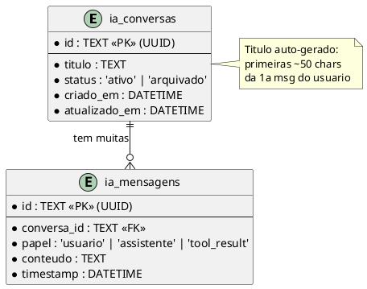
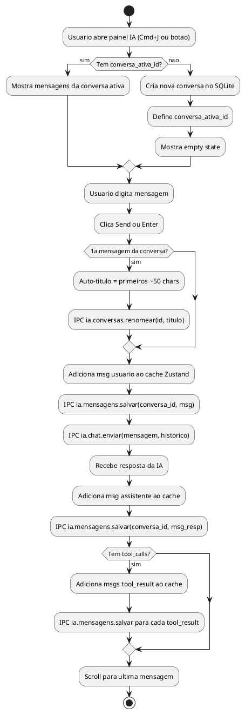
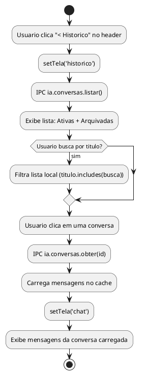
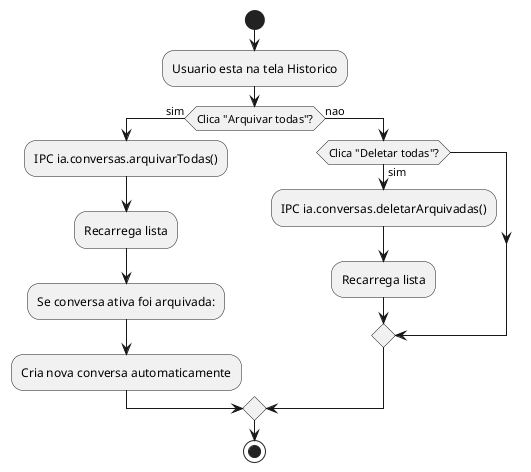

# SPEC-04 — Sistema de Historico de Chats da IA

**Status:** PRONTO PARA IMPLEMENTACAO
**Prioridade:** P1 (Sprint 3 do PRD v3.0)
**Dependencias:** SPEC-01 (OK), SPEC-03 (OK) — ambas implementadas
**Complexidade:** Media (~3-4 sessoes de trabalho)

---

## TL;DR EXECUTIVO

O chat IA do EscalaFlow nao persiste nada. Fechar o app = perder tudo.
Esta spec adiciona persistencia SQLite, historico navegavel **dentro do proprio painel IA**, e gestao de conversas (criar, arquivar, restaurar, deletar, renomear).

A navegacao e INTERNA ao `<aside>` — duas "telas" no mesmo container de 380px:
1. **Tela Chat** — conversa ativa (como hoje, melhorada)
2. **Tela Historico** — lista de conversas com acoes

---

## VISAO GERAL

```
┌─ IaChatPanel (aside 380px) ──────────────────┐
│                                               │
│   ┌─ TELA 1: CHAT ──────────────────────┐    │
│   │ Header: [< Historico] [titulo] [+ ]  │    │
│   │                                      │    │
│   │ ScrollArea: mensagens                │    │
│   │                                      │    │
│   │ Input: textarea + send               │    │
│   └──────────────────────────────────────┘    │
│                                               │
│   ┌─ TELA 2: HISTORICO ─────────────────┐    │
│   │ Header: Historico                    │    │
│   │                                      │    │
│   │ [Buscar por titulo...]               │    │
│   │                                      │    │
│   │ ATIVAS (2)               [📦]        │    │  ← icon-only + tooltip "Arquivar todas"
│   │ ○ Escala Marco Acougue          ... │    │
│   │ ○ Conflito Joao Silva           ... │    │
│   │                                      │    │
│   │ ARQUIVADAS (3)             [🗑]      │    │  ← icon-only + tooltip "Deletar todas"
│   │ ○ Teste inicial                 ... │    │
│   │ ○ Debug solver                  ... │    │
│   └──────────────────────────────────────┘    │
│                                               │
│   (so 1 tela visivel por vez)                 │
└───────────────────────────────────────────────┘
```

---

## MODELO DE DADOS

### Schema SQLite (novas tabelas)

```sql
-- Conversas da IA (pai)
CREATE TABLE IF NOT EXISTS ia_conversas (
  id TEXT PRIMARY KEY,                    -- UUID (crypto.randomUUID)
  titulo TEXT NOT NULL DEFAULT 'Nova conversa',
  status TEXT NOT NULL DEFAULT 'ativo'    -- 'ativo' | 'arquivado'
    CHECK (status IN ('ativo', 'arquivado')),
  criado_em TEXT NOT NULL DEFAULT (datetime('now')),
  atualizado_em TEXT NOT NULL DEFAULT (datetime('now'))
);

-- Mensagens da IA (filhas)
CREATE TABLE IF NOT EXISTS ia_mensagens (
  id TEXT PRIMARY KEY,                    -- UUID
  conversa_id TEXT NOT NULL REFERENCES ia_conversas(id) ON DELETE CASCADE,
  papel TEXT NOT NULL                     -- 'usuario' | 'assistente' | 'tool_result'
    CHECK (papel IN ('usuario', 'assistente', 'tool_result')),
  conteudo TEXT NOT NULL,
  timestamp TEXT NOT NULL DEFAULT (datetime('now'))
);

-- Indices
CREATE INDEX IF NOT EXISTS idx_ia_mensagens_conversa
  ON ia_mensagens(conversa_id, timestamp);
CREATE INDEX IF NOT EXISTS idx_ia_conversas_status
  ON ia_conversas(status, atualizado_em DESC);
```

### ER Diagram



---

## TIPOS TYPESCRIPT

### Novos tipos em `src/shared/types.ts`

```typescript
// Conversa da IA (persistida no SQLite)
export interface IaConversa {
  id: string                        // UUID
  titulo: string
  status: 'ativo' | 'arquivado'
  criado_em: string                 // ISO datetime
  atualizado_em: string             // ISO datetime
}

// IaMensagem ja existe — manter como esta:
// { id, papel, conteudo, timestamp, tool_calls? }
// Adicionar campo conversa_id para persistencia:
export interface IaMensagemDB extends IaMensagem {
  conversa_id: string
}
```

---

## IPC HANDLERS (tipc.ts)

### Novos handlers — 8 no total

```
ia.conversas.listar     → lista conversas (filtro por status, busca titulo)
ia.conversas.obter      → obtem conversa + mensagens por id
ia.conversas.criar      → cria nova conversa (retorna id)
ia.conversas.renomear   → atualiza titulo
ia.conversas.arquivar   → muda status para 'arquivado'
ia.conversas.restaurar  → muda status para 'ativo'
ia.conversas.deletar    → DELETE definitivo (CASCADE deleta mensagens)
ia.mensagens.salvar     → salva mensagem na conversa (INSERT)
```

### Detalhamento

| Handler | Input | Output | SQL Core |
|---------|-------|--------|----------|
| `ia.conversas.listar` | `{ status?: string, busca?: string }` | `IaConversa[]` | `SELECT * FROM ia_conversas WHERE status = ? AND titulo LIKE ? ORDER BY atualizado_em DESC` |
| `ia.conversas.obter` | `{ id: string }` | `{ conversa: IaConversa, mensagens: IaMensagem[] }` | `SELECT` conversa + mensagens por `conversa_id` ORDER BY `timestamp ASC` |
| `ia.conversas.criar` | `{ id?: string, titulo?: string }` | `IaConversa` | `INSERT INTO ia_conversas (id, titulo)` |
| `ia.conversas.renomear` | `{ id: string, titulo: string }` | `void` | `UPDATE ia_conversas SET titulo = ?, atualizado_em = datetime('now')` |
| `ia.conversas.arquivar` | `{ id: string }` | `void` | `UPDATE ia_conversas SET status = 'arquivado', atualizado_em = datetime('now')` |
| `ia.conversas.restaurar` | `{ id: string }` | `void` | `UPDATE ia_conversas SET status = 'ativo', atualizado_em = datetime('now')` |
| `ia.conversas.deletar` | `{ id: string }` | `void` | `DELETE FROM ia_conversas WHERE id = ?` (CASCADE) |
| `ia.mensagens.salvar` | `{ conversa_id: string, mensagem: IaMensagem }` | `void` | `INSERT INTO ia_mensagens` + `UPDATE ia_conversas SET atualizado_em` |

### Bulk actions (2 handlers extras)

| Handler | Input | SQL Core |
|---------|-------|----------|
| `ia.conversas.arquivarTodas` | `void` | `UPDATE ia_conversas SET status = 'arquivado' WHERE status = 'ativo'` |
| `ia.conversas.deletarArquivadas` | `void` | `DELETE FROM ia_conversas WHERE status = 'arquivado'` |

**Total: 10 novos IPC handlers** (67 existentes → 77)

---

## ZUSTAND STORE REDESIGN

### Estado atual (`iaStore.ts`)

```typescript
// ANTES — tudo volatil
{
  aberto: boolean
  historico: IaMensagem[]     // <- perde ao fechar app
  carregando: boolean
}
```

### Novo estado

```typescript
interface IaStore {
  // --- Painel ---
  aberto: boolean
  setAberto: (v: boolean) => void
  toggleAberto: () => void

  // --- View interna ---
  tela: 'chat' | 'historico'        // qual tela esta visivel
  setTela: (t: 'chat' | 'historico') => void

  // --- Conversa ativa ---
  conversa_ativa_id: string | null   // UUID da conversa carregada
  conversa_ativa_titulo: string      // titulo exibido no header
  mensagens: IaMensagem[]            // mensagens da conversa ativa (cache)
  carregando: boolean
  setCarregando: (v: boolean) => void

  // --- Lista de conversas ---
  conversas: IaConversa[]            // cache da lista (recarrega do SQLite)
  busca_titulo: string               // filtro de busca

  // --- Acoes ---
  novaConversa: () => Promise<void>          // cria conversa no SQLite, muda pra chat
  carregarConversa: (id: string) => Promise<void>  // carrega mensagens, muda pra chat
  adicionarMensagem: (msg: IaMensagem) => void     // adiciona local + salva SQLite
  atualizarTitulo: (titulo: string) => void        // auto-titulo na 1a msg
  listarConversas: () => Promise<void>             // recarrega lista do SQLite
  arquivarConversa: (id: string) => Promise<void>
  restaurarConversa: (id: string) => Promise<void>
  deletarConversa: (id: string) => Promise<void>
  renomearConversa: (id: string, titulo: string) => Promise<void>
  arquivarTodas: () => Promise<void>
  deletarArquivadas: () => Promise<void>
  setBuscaTitulo: (busca: string) => void
}
```

### Fluxo de auto-titulo

```
1. Usuario envia 1a mensagem
2. adicionarMensagem() detecta: mensagens.length === 0 && msg.papel === 'usuario'
3. titulo = msg.conteudo.slice(0, 50).trim()
4. Se titulo termina no meio de palavra, corta na ultima palavra completa
5. Chama IPC ia.conversas.renomear(id, titulo)
6. Atualiza conversa_ativa_titulo local
```

---

## COMPONENTES REACT

### Arvore de componentes

```
IaChatPanel.tsx (aside 380px)
├── IaChatHeader.tsx          -- header adaptavel (chat vs historico)
├── IaChatView.tsx            -- tela de chat (mensagens + input)
│   ├── IaMensagemBubble.tsx  -- bolha de mensagem (extraido)
│   └── IaChatInput.tsx       -- textarea + send (extraido)
└── IaHistoricoView.tsx       -- tela de historico
    ├── IaConversaItem.tsx    -- item de conversa com menu
    └── IaSecaoConversas.tsx  -- secao Ativas ou Arquivadas
```

### IaChatPanel.tsx (refatorado)

O componente principal vira um **router interno**:

```
if (tela === 'chat')
  → renderiza IaChatView
else
  → renderiza IaHistoricoView
```

Nao muda a `<aside>` externa. Apenas o conteudo interno alterna.

### IaChatHeader.tsx — Header adaptavel

**Modo Chat:**
```
┌──────────────────────────────────────┐
│ [< Historico]  Titulo da Conversa [+]│
└──────────────────────────────────────┘
```

- `[< Historico]` — botao ghost com `ChevronLeft` + "Historico" → `setTela('historico')`
- `Titulo da Conversa` — texto truncado com ellipsis, flex-1
- `[+]` — botao ghost com `Plus` icon → `novaConversa()`

**Modo Historico:**
```
┌──────────────────────────────────────┐
│ 🧠 Historico                     [+] │
└──────────────────────────────────────┘
```

- `🧠` — `BrainCircuit` icon
- `Historico` — titulo fixo
- `[+]` — novo chat (cria conversa + vai pra tela chat)

### IaChatView.tsx — Tela de Chat

Essencialmente o conteudo atual do `IaChatPanel.tsx`, extraido:
- ScrollArea com mensagens
- Empty state (Bot icon + "Ola!")
- Loading dots
- Input area (Textarea + Send button)

**Mudanca principal:** ao enviar msg, salva no SQLite via IPC (alem do Zustand cache).

### IaHistoricoView.tsx — Tela de Historico

```
┌───────────────────────────────────┐
│  🔍 Buscar conversas...          │   ← Input de busca (filtro por titulo)
├───────────────────────────────────┤
│                                   │
│  ATIVAS (3)              [📦]     │   ← Label + count + icon-only (tooltip: "Arquivar todas")
│                                   │
│  ┌─ ConversaItem ──────────────┐ │
│  │ Escala Marco Acougue    ... │ │   ← click = carregarConversa(id)
│  │ 3 min atras                 │ │     ... = DropdownMenu
│  └─────────────────────────────┘ │
│  ┌─ ConversaItem ──────────────┐ │
│  │ Conflito Joao Silva     ... │ │
│  │ 1h atras                    │ │
│  └─────────────────────────────┘ │
│                                   │
│  ── separador ──                  │
│                                   │
│  ARQUIVADAS (2)          [🗑]     │   ← Collapsible + icon-only (tooltip: "Deletar todas")
│                                   │
│  ┌─ ConversaItem ──────────────┐ │
│  │ Teste inicial           ... │ │
│  │ 2 dias atras                │ │
│  └─────────────────────────────┘ │
│                                   │
│  Empty state se nenhuma conversa  │
│                                   │
└───────────────────────────────────┘
```

### IaConversaItem.tsx — Item de conversa

```
┌──────────────────────────────────┐
│ 💬 Titulo da conversa       ...  │  ← click na row = abrir conversa
│    ha 3 minutos                  │  ← tempo relativo
└──────────────────────────────────┘
```

**Click na row** → `carregarConversa(id)` → muda pra tela chat

**Click no `...`** → `DropdownMenu` com acoes:

| Status Ativa | Status Arquivada |
|-------------|-----------------|
| Renomear | Restaurar |
| Arquivar | Deletar |

**Renomear:** Inline edit (click transforma titulo em input, Enter salva, Esc cancela).

### IaSecaoConversas.tsx — Secao Ativas/Arquivadas

Componente reutilizavel para cada secao:

```typescript
interface IaSecaoConversasProps {
  titulo: string                    // "Ativas" | "Arquivadas"
  count: number                     // badge count ao lado do titulo
  conversas: IaConversa[]
  acaoBulk?: {
    icon: LucideIcon                // Archive ou Trash2
    tooltip: string                 // "Arquivar todas" | "Deletar todas"
    onClick: () => void
    variant?: 'ghost' | 'destructive'  // destructive para Deletar
  }
  collapsible?: boolean            // true para Arquivadas
  onAbrir: (id: string) => void
  acoesPorItem: 'ativa' | 'arquivada'  // define menu contextual
}

// Layout do header da secao:
// ┌──────────────────────────────────┐
// │ TITULO (count)           [icon]  │  ← flex, items-center, justify-between
// └──────────────────────────────────┘
// O icon e Button variant="ghost" size="icon" className="size-6"
// envolto em Tooltip com tooltip text
```

---

## FLUXO PRINCIPAL

### Activity Diagram — Enviar Mensagem



### Activity Diagram — Navegar Historico



### Activity Diagram — Acoes em Massa



---

## COMPORTAMENTOS ESPECIFICOS

### Inicializacao do App

```
1. App abre
2. IaChatPanel monta (mas pode estar fechado)
3. Quando aberto pela primeira vez na sessao:
   a. IPC ia.conversas.listar({ status: 'ativo' })
   b. Se tem conversas ativas:
      - Carrega a mais recente (maior atualizado_em)
      - Mostra tela chat com mensagens dessa conversa
   c. Se nao tem:
      - Cria nova conversa (ia.conversas.criar)
      - Mostra tela chat com empty state
```

### Nova Conversa (botao +)

```
1. Cria conversa no SQLite (ia.conversas.criar)
2. Define conversa_ativa_id = novo id
3. Limpa mensagens do cache
4. Muda para tela chat
5. Focus no textarea
```

### Trocar de Conversa

```
1. Usuario clica em conversa no historico
2. IPC ia.conversas.obter(id) → { conversa, mensagens }
3. Define conversa_ativa_id = id
4. Carrega mensagens no cache Zustand
5. Muda para tela chat
6. Scroll para o fim das mensagens
```

### Auto-Titulo

```
1. Detecta: eh a 1a mensagem do usuario na conversa
   (mensagens.filter(m => m.papel === 'usuario').length === 0 ANTES de adicionar)
2. titulo = msg.conteudo
3. Se titulo.length > 50:
   a. Corta em 50 chars
   b. Se cortou no meio de palavra, volta ate o ultimo espaco
   c. Adiciona "..."
4. IPC ia.conversas.renomear(conversa_ativa_id, titulo)
5. Atualiza conversa_ativa_titulo no store
```

### Confirmacao para Acoes Destrutivas

| Acao | Confirmacao? | Mecanismo |
|------|-------------|-----------|
| Arquivar 1 | NAO | Reversivel (restaurar) |
| Arquivar todas | SIM | AlertDialog: "Arquivar N conversas ativas?" |
| Restaurar 1 | NAO | Acao positiva |
| Deletar 1 | SIM | AlertDialog: "Deletar conversa? Isso nao pode ser desfeito." |
| Deletar todas | SIM | AlertDialog: "Deletar N conversas arquivadas? Isso nao pode ser desfeito." |
| Renomear | NAO | Acao inofensiva |

---

## REGRAS DE NEGOCIO

### PODE / NAO PODE

- PODE: Ter conversas ilimitadas (SQLite aguenta)
- PODE: Ter conversa com 0 mensagens (recem-criada)
- PODE: Renomear conversa para qualquer texto (1-200 chars)
- NAO PODE: Deletar conversa ativa (tem que arquivar primeiro)
- NAO PODE: Enviar mensagem sem conversa ativa
- NAO PODE: Ter mais de 1 conversa ativa "em foco" (so 1 por vez)

### SEMPRE / NUNCA

- SEMPRE: Salvar mensagem no SQLite imediatamente apos enviar/receber
- SEMPRE: Atualizar `atualizado_em` da conversa ao salvar mensagem
- SEMPRE: Manter conversa ativa ao arquivar — se a ativa foi arquivada, criar nova
- NUNCA: Perder mensagem ja salva (SQLite = fonte de verdade)
- NUNCA: Exibir tool_calls raw ao usuario (formatar como "ferramenta" com icone)

### CONDICIONAIS

- SE conversa tem 0 mensagens E usuario fecha/troca → DELETAR silenciosamente (limpar lixo)
- SE usuario abre painel e nao tem nenhuma conversa ativa → CRIAR nova automaticamente
- SE busca esta vazia → mostrar todas as conversas do status
- SE secao Arquivadas tem 0 → esconder secao inteira

---

## COMPONENTES SHADCN UTILIZADOS

| Componente | Onde | Ja instalado? |
|-----------|------|--------------|
| `Button` | Header, acoes bulk | SIM |
| `ScrollArea` | Lista conversas, mensagens | SIM |
| `Separator` | Entre secoes | SIM |
| `Input` | Busca por titulo, rename inline | SIM |
| `Textarea` | Input de mensagem | SIM |
| `DropdownMenu` | Acoes por conversa (...) | SIM |
| `AlertDialog` | Confirmacao deletar | SIM |
| `Tooltip` | Botoes do header, acoes bulk icon-only | SIM |
| `Collapsible` | Secao Arquivadas | VERIFICAR |
| `Badge` | Count de conversas | SIM |

---

## SEQUENCIA DE IMPLEMENTACAO

### Fase 1 — Backend (Schema + IPC)

**Arquivos a criar/editar:**

| Arquivo | Acao | O que fazer |
|---------|------|-------------|
| `src/main/db/schema.ts` | EDITAR | Adicionar DDL das tabelas `ia_conversas` + `ia_mensagens` + indices |
| `src/shared/types.ts` | EDITAR | Adicionar `IaConversa`, `IaMensagemDB` |
| `src/main/tipc.ts` | EDITAR | Adicionar 10 handlers (ia.conversas.* + ia.mensagens.salvar) |

**Validacao Fase 1:** `npm run typecheck` — 0 erros

### Fase 2 — Store Zustand

**Arquivos a criar/editar:**

| Arquivo | Acao | O que fazer |
|---------|------|-------------|
| `src/renderer/src/store/iaStore.ts` | REESCREVER | Novo estado com tela, conversa_ativa, lista, acoes async |

**Validacao Fase 2:** `npm run typecheck` — 0 erros

### Fase 3 — Frontend (Componentes)

**Arquivos a criar/editar:**

| Arquivo | Acao | O que fazer |
|---------|------|-------------|
| `src/renderer/src/componentes/IaChatPanel.tsx` | REFATORAR | Router interno (tela chat vs historico), importa sub-componentes |
| `src/renderer/src/componentes/IaChatHeader.tsx` | CRIAR | Header adaptavel por tela |
| `src/renderer/src/componentes/IaChatView.tsx` | CRIAR | Tela de chat (extraida do IaChatPanel atual) |
| `src/renderer/src/componentes/IaChatInput.tsx` | CRIAR | Textarea + send (extraido) |
| `src/renderer/src/componentes/IaMensagemBubble.tsx` | CRIAR | Bolha de mensagem (extraida) |
| `src/renderer/src/componentes/IaHistoricoView.tsx` | CRIAR | Tela de historico com secoes |
| `src/renderer/src/componentes/IaConversaItem.tsx` | CRIAR | Item de conversa com menu |
| `src/renderer/src/componentes/IaSecaoConversas.tsx` | CRIAR | Secao reutilizavel (Ativas/Arquivadas) |

**Validacao Fase 3:** `npm run typecheck` + teste manual visual

### Fase 4 — Integracao e Polish

| O que | Detalhes |
|-------|---------|
| Ajustar `ia.chat.enviar` | Passar historico do SQLite (nao so cache Zustand) |
| Limpar conversas vazias | Ao trocar/fechar conversa sem mensagens |
| Tempo relativo | "ha 3 min", "ha 1h", "ha 2 dias" — usar `Intl.RelativeTimeFormat` ou lib simples |
| Animacao de transicao | Fade ou slide suave entre tela chat ↔ historico (CSS transition) |
| Keyboard shortcuts | Cmd+J (toggle painel, ja existe), sem shortcut extra necessario |

**Validacao Fase 4:** `npm run typecheck` + `npm run build` + teste manual E2E

---

## EDGE CASES

| Cenario | Comportamento |
|---------|---------------|
| Abrir painel pela 1a vez (nenhuma conversa existe) | Cria nova conversa automaticamente |
| Arquivar a conversa que esta ativa | Cria nova conversa, muda pra ela |
| Deletar conversa arquivada que estava sendo visualizada | Volta pra tela historico |
| Busca sem resultados | Mostrar "Nenhuma conversa encontrada" |
| Conversa com so tool_results (IA respondeu com ferramenta) | Titulo = "Nova conversa" (nao teve msg usuario) |
| 100+ conversas ativas | ScrollArea com scroll, sem paginacao (SQLite ORDER BY atualizado_em DESC) |
| Erro ao salvar mensagem (SQLite) | Manter no cache Zustand, retry no proximo envio (graceful) |
| Conversa vazia (0 msgs) ao trocar | Deletar silenciosamente do SQLite |

---

## O QUE NAO FAZ PARTE (Escopo Negativo)

- Busca full-text no conteudo das mensagens (FTS5) — futuro
- Export de conversas (PDF/TXT) — futuro
- Tags/categorias nas conversas — futuro
- Pinned conversations — futuro
- Markdown rendering nas mensagens — futuro (potencial melhoria)
- Drag-and-drop para reordenar — nao faz sentido

---

## RESUMO DE IMPACTO

| Metrica | Antes | Depois |
|---------|-------|--------|
| Tabelas SQLite | 0 IA chat | +2 (`ia_conversas`, `ia_mensagens`) |
| IPC handlers | 67 | 77 (+10) |
| Componentes novos | 0 | 6 (Header, ChatView, Input, Bubble, HistoricoView, ConversaItem, SecaoConversas) |
| Store Zustand | 5 campos | ~15 campos + ~12 acoes |
| Persistencia | Nenhuma (Zustand volatil) | SQLite (sobrevive restart) |
