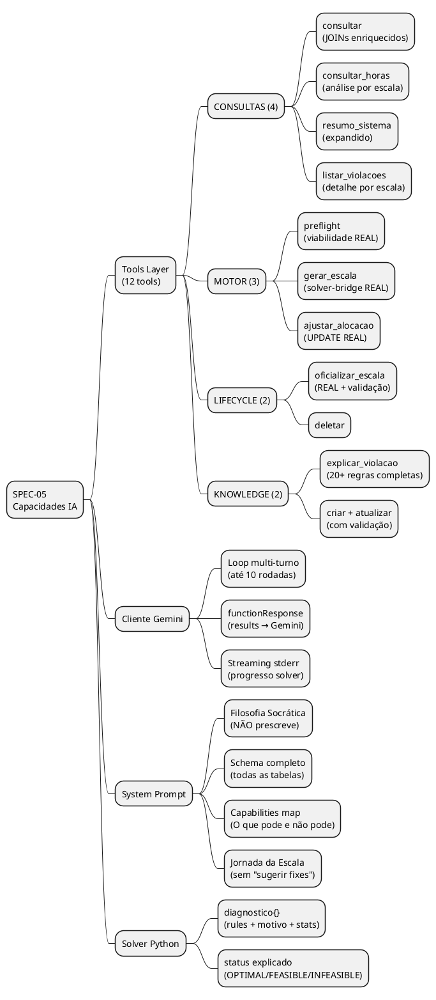
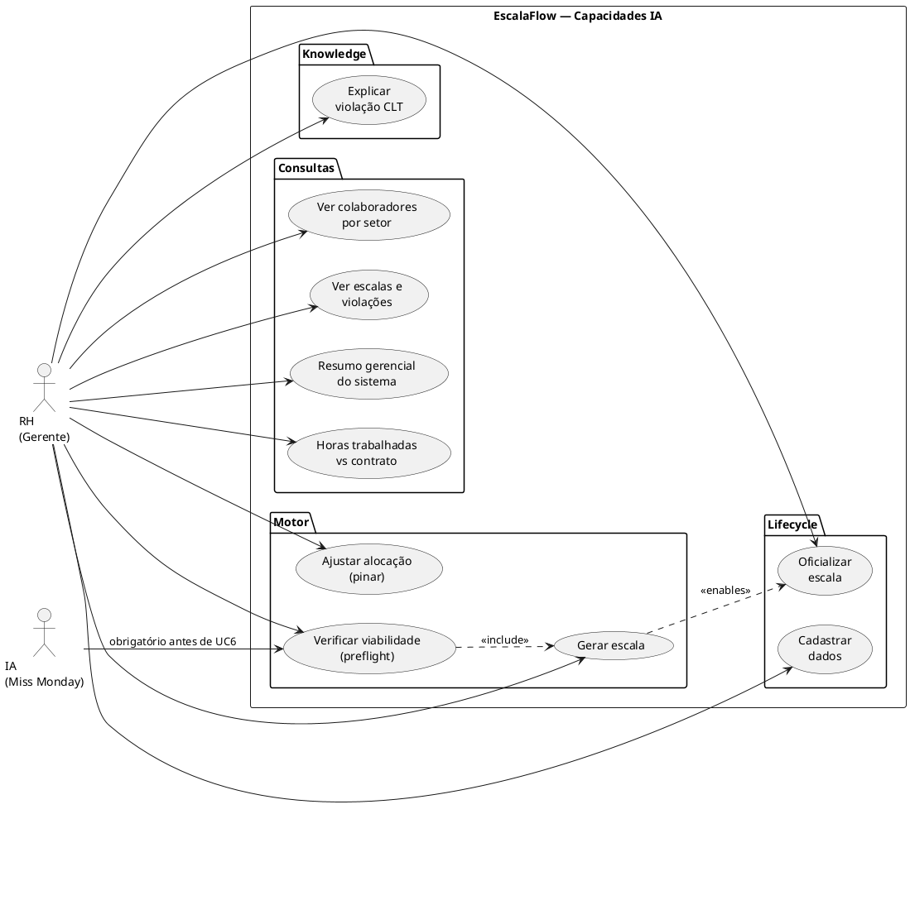
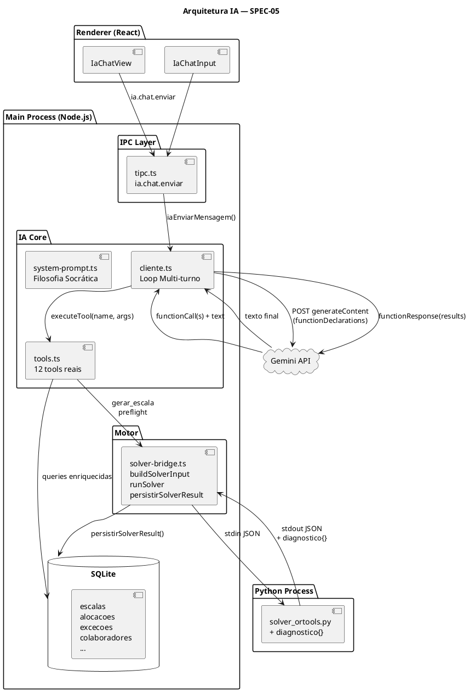
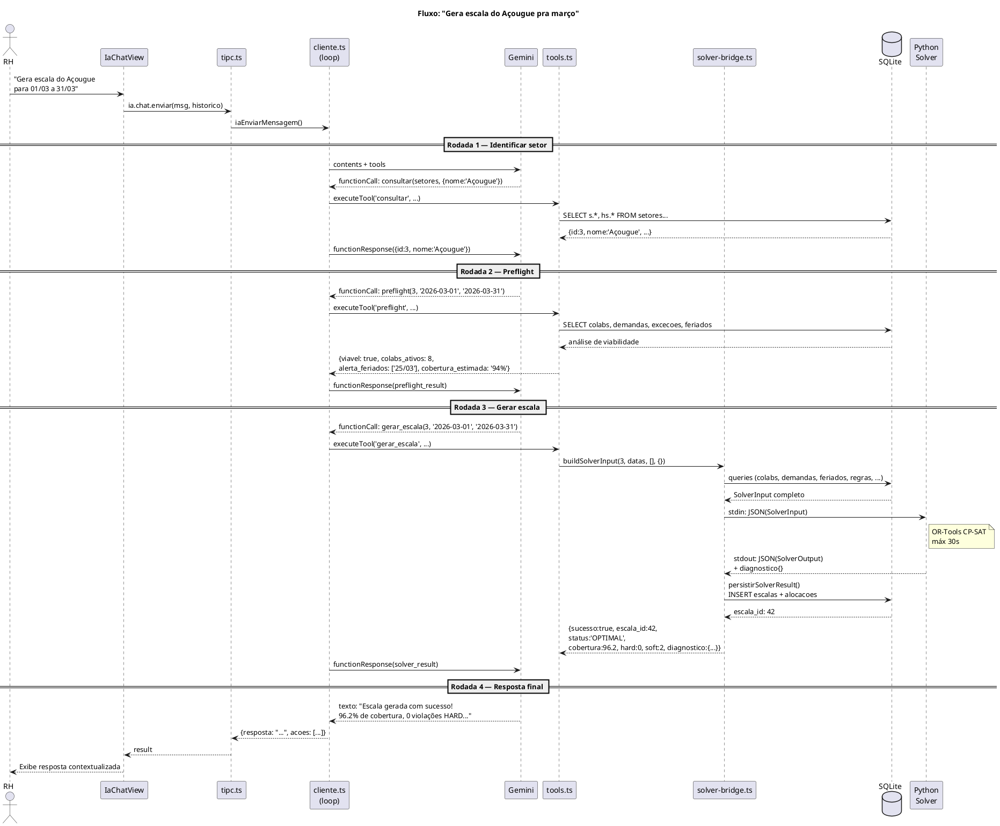
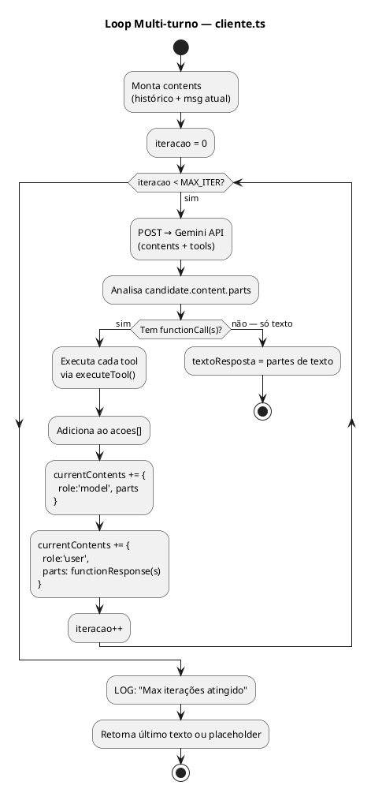

# SPEC-05 — Capacidades Completas da IA no EscalaFlow

> **BUILD** — Arquitetura Visual Completa
> **Data:** 2026-02-21
> **Status:** APROVADO PARA IMPLEMENTAÇÃO
> **Dependências:** SPEC-04 ✅ | SPEC-02B (parcial — 90% independente)

---

## TL;DR Executivo

A IA do EscalaFlow hoje é uma **casca vazia com tools mockadas**. O `gerar_escala` retorna uma string fake. O `preflight` não faz nada. O `ajustar_alocacao` não persiste. O loop de tool calls não volta ao Gemini com os resultados — a IA age no escuro. Esta spec entrega **a IA funcionando de verdade**: 12 tools reais, loop multi-turno, system prompt socrático e diagnóstico do solver.

**5 problemas críticos resolvidos:**
1. `gerar_escala` → REAL via solver-bridge (antes: mock string)
2. Loop multi-turno → Gemini vê resultados das tools (antes: 1 rodada só)
3. `preflight` + `ajustar_alocacao` + `oficializar_escala` → implementados (antes: no-op)
4. System prompt → socrático, atualizado, sem referências mortas
5. `diagnostico` no solver → IA entende por que INFEASIBLE

---

## 1. Gap Analysis — O que Existe vs O que Deve Existir

| Componente | Status Atual | Gap | Prioridade |
|-----------|-------------|-----|------------|
| `gerar_escala` | **MOCK** (retorna string) | Nunca gera escala de verdade | 🔴 P0 |
| Loop multi-turno | **AUSENTE** (1 rodada só) | IA não vê resultados das tools | 🔴 P0 |
| `preflight` | **NÃO IMPLEMENTADO** | Declarado, sem código | 🔴 P0 |
| `ajustar_alocacao` | **NÃO IMPLEMENTADO** | Declarado, sem código | 🔴 P0 |
| `oficializar_escala` | **NÃO IMPLEMENTADO** | Declarado, sem código | 🔴 P0 |
| `consultar` | **PARCIAL** (SELECT * sem JOIN) | Queries pobres, sem joins | 🟡 P1 |
| `explicar_violacao` | **ERRADO** (dict incompleto + errado) | H1 errado, só 4 regras | 🟡 P1 |
| `criar` | **PARCIAL** (sem validação) | Aceita dados inválidos | 🟡 P1 |
| System prompt | **DESATUALIZADO** | piso_operacional removido, step 5 prescreve fix (viola filosofia socrática) | 🟡 P1 |
| `diagnostico` Python | **AUSENTE** | IA não sabe por que INFEASIBLE | 🟡 P1 |
| `resumo_sistema` | **PARCIAL** (3 counts básicos) | Sem breakdown por setor, sem violações | 🟢 P2 |
| `consultar_horas` | **NÃO EXISTE** | Análise de horas trabalhadas | 🟢 P2 |
| `listar_violacoes` | **NÃO EXISTE** | Detalhes de violações de uma escala | 🟢 P2 |

---

## 2. Visão Geral

### 2.1 Escopo



### 2.2 Casos de Uso



### 2.3 Arquitetura de Componentes



---

## 3. Fluxos Críticos

### 3.1 Fluxo Principal: Gerar Escala via IA



### 3.2 Loop Multi-turno (cliente.ts)



### 3.3 Preflight Real — Lógica de Viabilidade

```plantuml
@startuml
title Preflight — Verificação de Viabilidade

start

:Busca setor (id, hora_abertura, hora_fechamento);
if (Setor existe e ativo?) then (não)
  :erro: "Setor não encontrado";
  stop
endif

:Busca colaboradores ativos do setor\n(com tipo_contrato, horas_semanais);
if (colabs_ativos >= 1?) then (não)
  :blocker: "Setor sem colaboradores ativos";
  stop
endif

:Conta dias no período (N dias);
:Calcula horas_disponíveis_total\n= Σ(colabs × horas_semanais / 7 × N);

:Busca demandas do setor + excecoes_data;
:Calcula cobertura_necessária_total\n= Σ(slots × min_pessoas × (slot_minutes/60));

if (horas_disponíveis >= cobertura_necessária × 0.7?) then (não)
  :warning: "Cobertura possivelmente insuficiente\n({X}h disponível vs {Y}h necessária)";
endif

:Busca exceções no período (FERIAS, ATESTADO, BLOQUEIO);
:Calcula colabs_disponiveis_por_dia[];

:Busca feriados no período;
for (feriado : feriados_proibidos) do
  if (demanda_no_feriado > 0?) then
    :warning: "Feriado {X}: demanda configurada\nmas trabalho proibido (CCT)";
  endif
endfor

:Verifica se setor tem demandas configuradas;
if (demandas.count == 0?) then (sim)
  :warning: "Nenhuma demanda configurada para o setor";
endif

:Retorna {
  viavel: bool,
  blockers: string[],
  warnings: string[],
  stats: {
    colabs_ativos, colabs_com_excecao,
    dias_periodo, feriados_proibidos,
    horas_disponiveis_total,
    cobertura_estimada_pct
  }
};

stop

@enduml
```

---

## 4. Contrato das 12 Tools

### 4.1 Mapa Completo

| # | Tool | Status Atual | Status SPEC-05 | Implementação |
|---|------|-------------|----------------|---------------|
| 1 | `consultar` | Parcial (SELECT *) | ✅ JOINs + enriquecida | DB queries por entidade |
| 2 | `criar` | Parcial (sem validação) | ✅ Com validação | validarCampos() + INSERT |
| 3 | `atualizar` | Parcial | ✅ Com validação | validarId() + UPDATE |
| 4 | `deletar` | Parcial | ✅ Com soft-delete | UPDATE ativo=0 onde aplicável |
| 5 | `gerar_escala` | **MOCK** | ✅ **REAL** | buildSolverInput + runSolver + persist |
| 6 | `ajustar_alocacao` | **NO-OP** | ✅ **REAL** | UPDATE/INSERT alocacoes |
| 7 | `oficializar_escala` | **NO-OP** | ✅ **REAL** | verificar hard=0 + UPDATE status |
| 8 | `preflight` | **NO-OP** | ✅ **REAL** | Análise viabilidade completa |
| 9 | `resumo_sistema` | Parcial | ✅ Expandido | Métricas por setor + violações |
| 10 | `explicar_violacao` | Errado (4 regras) | ✅ Completo (20+ regras) | Dicionário correto |
| 11 | `consultar_horas` | **NÃO EXISTE** | ✅ **NOVO** | JOIN escalas+alocacoes |
| 12 | `listar_violacoes` | **NÃO EXISTE** | ✅ **NOVO** | JSON violacoes da escala |

### 4.2 Spec de Cada Tool

#### Tool 1: `consultar` (enriquecida)

```typescript
// PARÂMETROS
{
  entidade: 'colaboradores' | 'setores' | 'escalas' | 'excecoes'
          | 'demandas' | 'tipos_contrato' | 'empresa' | 'feriados'
          | 'funcoes' | 'regras',
  filtros?: Record<string, any>,
  limite?: number  // default 50
}

// QUERIES POR ENTIDADE (com JOINs)
colaboradores → JOIN setores(nome), JOIN tipos_contrato(nome, regime_escala)
                + excecoes ativas (FERIAS/ATESTADO no período corrente)
escalas       → JOIN setores(nome) + {violacoes_hard, violacoes_soft, cobertura_percent}
excecoes      → JOIN colaboradores(nome), JOIN setores(nome via colaboradores)
demandas      → GROUP BY setor + summary de cobertura
regras        → JOIN regra_definicao + regra_empresa → status_efetivo
```

#### Tool 2: `criar` (com validação)

```typescript
// VALIDAÇÕES POR ENTIDADE
colaboradores → nome.length >= 2, setor_id EXISTS, tipo_contrato_id EXISTS,
                horas_semanais IN [20,30,36,44], sexo IN ['M','F']
excecoes      → colaborador_id EXISTS, data_inicio <= data_fim,
                tipo IN ['FERIAS','ATESTADO','BLOQUEIO'],
                sem overlap com outra exceção do mesmo colaborador
feriados      → data válida YYYY-MM-DD, nome.length >= 2,
                tipo IN ['NACIONAL','ESTADUAL','MUNICIPAL']
demandas      → setor_id EXISTS, hora_inicio < hora_fim, min_pessoas >= 1
```

#### Tool 5: `gerar_escala` (REAL)

```typescript
// PARÂMETROS
{ setor_id: number, data_inicio: string, data_fim: string }

// FLUXO
1. SEMPRE executa preflight interno antes
2. Se preflight retorna blockers → retorna preflight_result sem chamar solver
3. buildSolverInput(setor_id, data_inicio, data_fim, [], {})
4. runSolver(input, 35_000)  // 35s timeout
5. persistirSolverResult(input, output, setor_id)
6. Retorna resumo estruturado:
{
  sucesso: boolean,
  escala_id: number | null,
  status: 'OPTIMAL' | 'FEASIBLE' | 'INFEASIBLE' | 'ERRO',
  cobertura_percent: number,
  violacoes_hard: number,
  violacoes_soft: number,
  diagnostico: DiagnosticoSolver,  // novo campo
  preflight: PreflightResult        // sempre incluído
}
```

#### Tool 6: `ajustar_alocacao` (REAL)

```typescript
// PARÂMETROS
{ escala_id: number, colaborador_id: number, data: string,
  status: 'TRABALHO' | 'FOLGA' | 'INDISPONIVEL',
  hora_inicio?: string, hora_fim?: string }

// FLUXO
1. Verifica escala existe e NÃO é OFICIAL (não pinar em oficial)
2. Verifica colaborador pertence ao setor da escala
3. INSERT OR REPLACE INTO alocacoes...
4. Se escala estava OFICIAL → rejeita com erro explicativo
```

#### Tool 7: `oficializar_escala` (REAL)

```typescript
// PARÂMETROS
{ escala_id: number }

// FLUXO
1. Busca escala + seu violacoes_hard
2. Se violacoes_hard > 0 → RECUSA com lista das violações
3. Se status == 'OFICIAL' → informa que já é oficial
4. UPDATE escalas SET status='OFICIAL' WHERE id=?
5. Retorna {sucesso: true, mensagem: "Escala #{id} oficializada com sucesso"}
```

#### Tool 8: `preflight` (REAL)

```typescript
// PARÂMETROS
{ setor_id: number, data_inicio: string, data_fim: string }

// RETORNO
{
  viavel: boolean,
  blockers: string[],   // impedem geração
  warnings: string[],  // alertas não-bloqueantes
  stats: {
    colabs_ativos: number,
    colabs_com_excecao: number,
    dias_periodo: number,
    feriados_no_periodo: number,
    feriados_proibidos: number,
    demandas_configuradas: boolean,
    horas_disponiveis_estimada: number,
    cobertura_estimada_pct: number
  }
}
```

#### Tool 9: `resumo_sistema` (expandido)

```typescript
// RETORNO
{
  empresa: { nome: string },
  setores: { total: number, ativos: number },
  colaboradores: { total: number, ativos: number },
  escalas: {
    rascunho: number,
    oficial: number,
    arquivada: number,
    por_setor: Array<{ setor: string, status: string, cobertura: number, hard: number }>
  },
  excecoes_ativas: number,  // férias/atestado vigentes hoje
  feriados_proximos: Array<{ data: string, nome: string, proibido: boolean }>
}
```

#### Tool 10: `explicar_violacao` (dicionário completo)

```typescript
// Dicionário correto das 20 regras H + SOFTs + APs
const DICIONARIO = {
  'H1': 'Máximo 6 dias consecutivos de trabalho (Art. 67 CLT + OJ 410 TST). '
       + 'Após 6 dias, o colaborador DEVE ter folga.',
  'H2': 'Descanso interjornada de 11 horas (Art. 66 CLT). '
       + 'Entre o fim de um turno e o início do próximo deve haver mínimo 11h.',
  'H4': 'Jornada máxima diária conforme contrato (ex: 8h para CLT 44h). '
       + 'Acima disso é hora extra não autorizada.',
  'H5': 'Exceções ativas (FÉRIAS/ATESTADO/BLOQUEIO) impedem alocação de trabalho. '
       + 'Colaborador em férias não trabalha.',
  'H6': 'Bloqueios de horário humanos: janela de almoço, splits e gaps. '
       + 'Motor deve respeitar janelas configuradas para cada colaborador.',
  'H10': 'Meta semanal de horas ± tolerância configurada. '
        + 'Colaborador deve cumprir carga contratual dentro da janela da semana.',
  'H11': 'Aprendiz NUNCA trabalha aos domingos (Lei 10.097/2000).',
  'H12': 'Aprendiz NUNCA trabalha em feriados.',
  'H13': 'Aprendiz NUNCA trabalha no noturno (22h às 5h) — menores de idade.',
  'H14': 'Aprendiz NUNCA faz hora extra.',
  'H15': 'Estagiário: máximo 6h/dia e 30h/semana (Lei 11.788/2008).',
  'H16': 'Estagiário NUNCA faz hora extra.',
  'H17': '25/12 (Natal) proibido trabalhar — CCT FecomercioSP 2025/2026.',
  'H18': '01/01 (Ano Novo) proibido trabalhar — CCT FecomercioSP 2025/2026.',
  'DEMAND_DEFICIT': 'Cobertura insuficiente: menos pessoas do que o mínimo configurado para o slot horário.',
  'SURPLUS': 'Over-coverage: mais pessoas do que o necessário no slot (custo desnecessário).',
  'DOMINGO_CICLO': 'Rodízio de domingos: colaboradores deveriam alternar domingos trabalhados de forma equitativa.',
  'TIME_WINDOW_PREF': 'Preferência de turno ignorada: colaborador prefere manhã/tarde mas foi alocado diferente.',
  'CONSISTENCIA': 'Inconsistência de horário: colaborador teve horários muito variados ao longo da semana.',
  'AP1': 'Clopening: colaborador fechou a loja e abre no dia seguinte (jornada extenuante).',
  'AP3': 'Almoço simultâneo: mais de 50% da equipe no almoço ao mesmo tempo (setor descoberto).',
  'AP4': 'Desequilíbrio de carga: distribuição muito desigual entre colaboradores.',
  'AP7': 'Fome de fim de semana: colaborador ficou mais de 5 semanas sem folga em sábado ou domingo.',
  'AP16': 'Júnior sozinho em alta demanda: colaborador sem experiência como único responsável em pico.',
}
```

#### Tool 11: `consultar_horas` (NOVA)

```typescript
// PARÂMETROS
{ escala_id: number }

// RETORNO — array por colaborador
[{
  colaborador_id: number,
  nome: string,
  horas_contrato_semana: number,
  horas_trabalhadas_escala: number,
  minutos_trabalhados: number,
  dias_trabalhados: number,
  dias_folga: number,
  saldo_horas: number  // trabalhadas - contrato (positivo = hora extra)
}]
```

#### Tool 12: `listar_violacoes` (NOVA)

```typescript
// PARÂMETROS
{ escala_id: number }

// RETORNO
{
  escala_id: number,
  setor: string,
  periodo: string,
  hard_count: number,
  soft_count: number,
  violacoes: Array<{
    codigo: string,
    severidade: 'HARD' | 'SOFT',
    colaborador_nome: string | null,
    data: string | null,
    descricao: string
  }>
}
```

---

## 5. Diagnóstico do Solver Python

### 5.1 Novo campo `diagnostico` no SolverOutput

```typescript
// src/shared/types.ts — adicionar ao SolverOutput
export interface DiagnosticoSolver {
  status_cp_sat: 'OPTIMAL' | 'FEASIBLE' | 'INFEASIBLE' | 'UNKNOWN'
  solve_time_ms: number
  regras_ativas: string[]        // ex: ['H1','H2','H4','H5','DEMAND_DEFICIT']
  regras_off: string[]           // ex: ['AP3','AP7']
  motivo_infeasible?: string     // descrição em PT-BR quando INFEASIBLE
  constraints_mais_restritivas?: string[]  // quais constraints "ganharam" mais
  num_colaboradores: number
  num_dias: number
  num_variaveis: number
  num_constraints: number
}

// SolverOutput atualizado:
export interface SolverOutput {
  sucesso: boolean
  status: string
  solve_time_ms: number
  alocacoes?: SolverOutputAlocacao[]
  indicadores?: Indicadores
  decisoes?: DecisaoMotor[]
  comparacao_demanda?: SlotComparacao[]
  diagnostico?: DiagnosticoSolver  // ← NOVO
  erro?: { tipo, regra, mensagem, sugestoes }
}
```

### 5.2 Python — output do diagnostico

```python
# solver_ortools.py — ao montar o output final
diagnostico = {
    "status_cp_sat": status_str,  # 'OPTIMAL'|'FEASIBLE'|'INFEASIBLE'|'UNKNOWN'
    "solve_time_ms": round(solve_time * 1000),
    "regras_ativas": [r for r, v in rules.items() if v not in ('OFF',)],
    "regras_off": [r for r, v in rules.items() if v == 'OFF'],
    "num_colaboradores": len(colaboradores),
    "num_dias": num_days,
    "num_variaveis": model.num_variables,  # CP-SAT expõe isso
    "num_constraints": model.num_constraints,
}

if status == cp_model.INFEASIBLE:
    diagnostico["motivo_infeasible"] = (
        "Nenhuma solução encontrada dentro das restrições ativas. "
        "Verifique: colaboradores disponíveis vs demanda, janelas de horário, "
        "e exceções (férias/atestado) no período."
    )
```

---

## 6. System Prompt — Rewrite Completo

### 6.1 Filosofia Socrática (NOVA — obrigatória)

O system prompt ATUAL viola o PRD no Step 5:
```
ATUAL (errado): "Sugira melhorias. 'A regra H3 quebrou. Posso usar ajustar_alocacao
                 para pinar essa moça de folga no domingo e consertar o furo. Que tal?'"

CORRETO (socrático): A IA NUNCA sugere fixes. Ela:
  1. EXPLICA o que está acontecendo (H3 violada = ciclo de domingos desequilibrado)
  2. CONTEXTUALIZA quais constraints estão envolvidas
  3. GUIA com perguntas exploratórias:
     "Quer ver como está o ciclo de domingos da equipe?"
     "Prefere consultar quem está com mais domingos trabalhados?"
  4. O HUMANO decide, a IA executa
```

### 6.2 Seções do Novo System Prompt

```
SEÇÃO 1: IDENTIDADE + FILOSOFIA
- Quem é a Miss Monday do EscalaFlow
- Abordagem socrática (facilitadora, NÃO prescritiva)
- Tom: direto, especialista, nunca robótico

SEÇÃO 2: CAPACIDADES (O QUE PODE)
- Consultar qualquer dado do sistema
- Gerar escalas (com preflight obrigatório antes)
- Ajustar alocações (pinar colaboradores)
- Oficializar escalas (se violacoes_hard == 0)
- Cadastrar/atualizar dados básicos
- Explicar regras CLT/CCT em português claro

SEÇÃO 3: LIMITAÇÕES (O QUE NÃO PODE)
- NÃO pode alterar escalas OFICIAIS (status OFICIAL)
- NÃO suger fixes de compliance — facilita a decisão humana
- NÃO tem acesso à tela do usuário em tempo real
- NÃO pode alterar configurações de regras (só visualizar)
- NÃO pode criar tipos de contrato novos (read-only)

SEÇÃO 4: SCHEMA DO BANCO (COMPLETO — todas as tabelas)
- empresa, setores, empresa_horario_semana
- tipos_contrato, contrato_perfis_horario
- colaboradores, colaborador_regra_horario, colaborador_regra_horario_excecao_data
- excecoes, escalas, alocacoes
- demandas, demandas_excecao_data
- funcoes, feriados
- regra_definicao, regra_empresa
- ia_conversas, ia_mensagens

SEÇÃO 5: JORNADA DA ESCALA PERFEITA (sem "sugira fixes")
Passo 1: consultar → confirmar setor_id
Passo 2: preflight → interpretar blockers e warnings
  - BLOCKERS: "Não posso gerar — {motivo}. O que quer ajustar?"
  - WARNINGS: "Há alertas: {lista}. Quer continuar assim ou ajustar primeiro?"
Passo 3: gerar_escala → interpretar resultado
  - OPTIMAL/FEASIBLE: apresentar métricas + violações soft
  - INFEASIBLE: apresentar diagnostico + perguntas exploratórias
Passo 4: se RH quer ajustes → ajustar_alocacao
Passo 5: confirmar antes de oficializar → oficializar_escala

SEÇÃO 6: REGRAS DO MOTOR (resumo das 20 regras)
- Quais são HARD (inegociáveis)
- Quais são SOFT (preferências)
- Quais são configuráveis vs travadas por lei
- Referência para explicar_violacao

SEÇÃO 7: CONTEXTO DE DIAGNÓSTICO
- Quando o solver retorna diagnostico.motivo_infeasible:
  NÃO traduzir como "você deve fazer X"
  SIM usar para EXPLICAR o problema e GUIAR com perguntas
```

---

## 7. Estrutura de Código — Arquivos Afetados

### 7.1 Árvore de Mudanças

```
escalaflow/
├── src/
│   ├── main/
│   │   ├── ia/
│   │   │   ├── tools.ts          ← REWRITE COMPLETO
│   │   │   │                        + 12 tools implementadas
│   │   │   │                        + validarCampos()
│   │   │   │                        + queryEnriquecida() por entidade
│   │   │   ├── cliente.ts        ← MODIFICAR
│   │   │   │                        + loop multi-turno (max 10 iterações)
│   │   │   │                        + functionResponse correta
│   │   │   └── system-prompt.ts  ← REWRITE COMPLETO
│   │   │                            + filosofia socrática
│   │   │                            + schema completo
│   │   │                            + seções estruturadas
│   │   └── motor/
│   │       └── solver-bridge.ts  ← MODIFICAR (pequeno)
│   │                                + persistirSolverResult() extraído
│   │                                  (para tools.ts usar)
│   └── shared/
│       └── types.ts              ← MODIFICAR (mínimo)
│                                    + DiagnosticoSolver interface
│                                    + SolverOutput.diagnostico
│
└── solver/
    └── solver_ortools.py         ← MODIFICAR
                                     + diagnostico{} no output JSON
```

### 7.2 Responsabilidades por Arquivo

| Arquivo | O que muda | Linhas estimadas |
|---------|-----------|-----------------|
| `ia/tools.ts` | Rewrite completo — 12 tools reais + validação + queries JOINs | ~400 → ~700 |
| `ia/cliente.ts` | Loop multi-turno (while + functionResponse) | ~125 → ~180 |
| `ia/system-prompt.ts` | Rewrite completo — 7 seções estruturadas | ~73 → ~200 |
| `motor/solver-bridge.ts` | Extrair `persistirSolverResult()` (já existe em tipc.ts) | +60 linhas |
| `shared/types.ts` | +DiagnosticoSolver + SolverOutput.diagnostico | +15 linhas |
| `solver_ortools.py` | +diagnostico{} no JSON output | +25 linhas |

### 7.3 Ordem de Implementação (sem dependências cruzadas)

```
[1] types.ts → DiagnosticoSolver (nenhuma dep)
    ↓
[2] solver_ortools.py → diagnostico no output (dep: tipos)
    ↓
[3] solver-bridge.ts → extrair persistirSolverResult (dep: types)
    ↓
[4] ia/tools.ts → rewrite completo (dep: solver-bridge)
    ↓
[5] ia/cliente.ts → loop multi-turno (dep: tools)
    ↓
[6] ia/system-prompt.ts → rewrite (dep: conhecer tools disponíveis)
```

---

## 8. Consolidação

### 8.1 Checklist de Implementação

| # | Item | Arquivo | Tipo | Dep |
|---|------|---------|------|-----|
| 1 | Interface `DiagnosticoSolver` | `shared/types.ts` | Type | — |
| 2 | `SolverOutput.diagnostico?` | `shared/types.ts` | Type | 1 |
| 3 | Output `diagnostico{}` no Python | `solver_ortools.py` | Python | 1 |
| 4 | Extrair `persistirSolverResult()` | `solver-bridge.ts` | TS | 2 |
| 5 | Tool `consultar` com JOINs | `ia/tools.ts` | TS | — |
| 6 | Tool `criar` com validação | `ia/tools.ts` | TS | — |
| 7 | Tool `preflight` REAL | `ia/tools.ts` | TS | — |
| 8 | Tool `gerar_escala` REAL | `ia/tools.ts` | TS | 4 |
| 9 | Tool `ajustar_alocacao` REAL | `ia/tools.ts` | TS | — |
| 10 | Tool `oficializar_escala` REAL | `ia/tools.ts` | TS | — |
| 11 | Tool `resumo_sistema` expandido | `ia/tools.ts` | TS | — |
| 12 | Tool `explicar_violacao` completo | `ia/tools.ts` | TS | — |
| 13 | Tool `consultar_horas` NOVA | `ia/tools.ts` | TS | — |
| 14 | Tool `listar_violacoes` NOVA | `ia/tools.ts` | TS | — |
| 15 | Loop multi-turno | `ia/cliente.ts` | TS | 5..14 |
| 16 | System prompt rewrite | `ia/system-prompt.ts` | TS | 15 |

### 8.2 O que NÃO muda (independência confirmada)

- `src/main/tipc.ts` — handlers existentes não tocados
- `src/main/db/schema.ts` — sem novas tabelas
- `src/main/db/seed.ts` — sem novo seed
- `src/renderer/**` — nenhum componente React
- `solver/constraints.py` — constraints não mudam

### 8.3 Dependência do SPEC-02B

| Funcionalidade | Precisa do 02B? | Por quê |
|---------------|----------------|---------|
| gerar_escala real | ❌ Não | solver-bridge já lê regra_definicao/empresa |
| preflight | ❌ Não | lê diretamente do banco |
| consultar regras | ✅ Sim | 02B precisa ter seedado as regras |
| system prompt mencionar regras configuráveis | ✅ Sim | contexto incompleto sem 02B |

**Estratégia:** Implementar tudo agora. A seção de regras no system prompt usa `if tabela existe`. Tool `consultar` com `entidade:'regras'` retorna `[]` se tabela vazia (graceful degradation).

### 8.4 Riscos

| Risco | Impacto | Mitigação |
|-------|---------|-----------|
| Solver bloqueia o main process por 30s | Alto | runSolver já é Promise + timeout 35s. IPC handler aguarda normalmente. |
| Loop multi-turno sem fim | Médio | MAX_ITER = 10, break explícito com mensagem |
| gerar_escala chama persistirSolverResult que duplica lógica do tipc | Baixo | Extrair para função compartilhada em solver-bridge.ts |
| Gemini não segue filosofia socrática | Médio | System prompt com exemplos de O QUE NÃO FAZER vs O QUE FAZER |
| consultar entidade inválida (SQL injection via entidade) | Alto | Whitelist de entidades permitidas — nunca interpolar diretamente |

### 8.5 Notas para o Implementador

1. **Security:** O `consultar` atual tem SQL injection via `entidade`. A versão nova deve usar whitelist `ENTIDADES_PERMITIDAS = ['colaboradores', 'setores', ...]` e NUNCA interpolar a entidade sem checar.

2. **persistirSolverResult:** A lógica de persistência existe no `tipc.ts` handler `escalas.gerar`. Extrair para `solver-bridge.ts` como função pública — NÃO duplicar.

3. **Loop multi-turno:** O Gemini retorna `functionCall` parts misturadas com `text` parts na mesma resposta. Processar TODOS os function calls da rodada antes de enviar os functionResponses.

4. **gerar_escala tool:** A tool deve SEMPRE rodar preflight interno. Se viavel=false, retorna o preflight_result SEM chamar o solver. Isso força a IA a explicar ao usuário.

5. **consultar_horas:** Calcular com base em `alocacoes.minutos_trabalho` (v3, não `minutos`).

6. **Sistema de diagnóstico Python:** `model.num_variables` e `model.num_constraints` são acessíveis no CP-SAT model antes de chamar solver. Capturar antes do `solver.Solve(model)`.

---

---

## ADDENDUM — Auditoria Pós-SPEC-02B e SPEC-07 (2026-02-21)

> SPEC-02B (Engine de Regras) e SPEC-07 (SolverConfigDrawer) foram implementados pela sessão paralela.
> Auditoria realizada para confirmar o que funciona, o que é mock e o que está desconectado.

### Mapa de Conectividade: UI vs IA vs Motor

| Fluxo | Via UI | Via IA (chat) |
|-------|--------|---------------|
| Ver regras do motor | ✅ `/regras` renderiza `regra_definicao + regra_empresa` | ❌ `consultar` não inclui essas entidades |
| Mudar status de uma regra | ✅ `regras.atualizar` via IPC | ❌ Não existe tool `editar_regra` |
| Gerar escala respeitando regras | ✅ bridge lê `buildRulesConfig()` corretamente | ❌ `gerar_escala` retorna mock — nunca chama bridge |
| Ver status da escala após geração | ✅ UI mostra cobertura + violações | ❌ IA só vê a mensagem fake do mock |
| Configurar drawer de geração | ✅ `SolverConfigDrawer` + `rulesOverride` in-memory | ❌ Irrelevante — IA não gera nada de verdade |

### Bugs Adicionais Identificados na Auditoria

| # | Arquivo | Linha | Bug | Impacto |
|---|---------|-------|-----|---------|
| B1 | `system-prompt.ts` | 11 | Menciona `piso_operacional` — campo REMOVIDO pelo SPEC-02A | IA confunde o contexto com campo fantasma |
| B2 | `system-prompt.ts` | 68 | Orienta usar `consultar` com `entidade:'regras'` | Entidade não está na whitelist → SQL error real |
| B3 | `tools.ts` | 168 | `gerar_escala` retorna mock hardcoded | IA NUNCA gera escala de verdade |
| B4 | `tools.ts` | ~130 | `consultar` não inclui `regra_definicao`/`regra_empresa` | IA cega para regras do motor |
| B5 | `tools.ts` | ~30 | `atualizar` não inclui `regra_empresa` | IA não pode mudar status de nenhuma regra |
| B6 | `tools.ts` | ~180 | `explicar_violacao` dict: H1="HORAS EXTRAS" (ERRADO — H1 é 6 dias consecutivos) | IA ensina CLT errada |
| B7 | `cliente.ts` | ~86 | Sem loop multi-turno — 1 rodada só | IA executa tool mas Gemini nunca vê o resultado |
| B8 | `tools.ts` | — | Tool `editar_regra` não existe | IA não tem como mudar regras mesmo que quisesse |

### O que Funciona Corretamente (confirmar antes de implementar)

| Componente | Status | Notas |
|-----------|--------|-------|
| `tipc.ts` → `regras.listar` | ✅ OK | JOIN correto, status_efetivo via COALESCE |
| `tipc.ts` → `regras.atualizar` | ✅ OK | INSERT OR REPLACE em `regra_empresa` |
| `tipc.ts` → `regras.resetarEmpresa` | ✅ OK | DELETE FROM `regra_empresa` |
| `solver-bridge.ts` → `buildRulesConfig()` | ✅ OK | Lê empresa+sistema, aplica rulesOverride |
| `solver-bridge.ts` → `buildSolverInput()` | ✅ OK | `config.rules` populado corretamente |
| `solver_ortools.py` → `rule_is()` | ✅ OK | Wrappers H1/H6/DIAS_TRABALHO/MIN_DIARIO condicionais |
| `seed.ts` → `regra_definicao` | ✅ OK | 35 regras: 16 CLT + 7 SOFT + 12 ANTIPATTERN |
| `RegrasPagina.tsx` | ✅ OK | UI funcional com toggles, cadeado, bulk actions |
| `SolverConfigDrawer.tsx` | ✅ OK | In-memory override por geração |

### Tool Adicional: `editar_regra` (nova — #13)

Identificada durante a auditoria. Necessária para fechar o gap IA ↔ Regras.

```typescript
// Tool 13: editar_regra
{
  name: 'editar_regra',
  description: 'Atualiza o status de uma regra do motor para esta empresa. '
             + 'Use consultar(entidade:"regras") primeiro para ver o status atual. '
             + 'Regras com editavel=0 NÃO podem ser alteradas (proteção CLT).',
  parameters: {
    type: 'object',
    properties: {
      codigo: { type: 'string', description: 'Código da regra (ex: H1, AP3, S_DEFICIT)' },
      status: { type: 'string', description: 'HARD | SOFT | OFF | ON' }
    },
    required: ['codigo', 'status']
  }
}

// IMPLEMENTAÇÃO em executeTool()
if (name === 'editar_regra') {
  const { codigo, status } = args
  const db = getDb()

  // 1. Verifica se regra existe
  const def = db.prepare('SELECT editavel, nome FROM regra_definicao WHERE codigo = ?').get(codigo) as
    { editavel: number; nome: string } | undefined

  if (!def) return { erro: `Regra '${codigo}' não existe. Use consultar({entidade:'regras'}) para ver os códigos válidos.` }

  // 2. Verifica se é editável (CLT core travada)
  if (!def.editavel) {
    return {
      erro: `A regra '${def.nome}' (${codigo}) é travada por lei — não pode ser alterada.`,
      motivo: 'Proteção CLT/CCT: H2, H4, H5, H11-H18 são inegociáveis legalmente.'
    }
  }

  // 3. Valida status permitido
  const statusValidos = ['HARD', 'SOFT', 'OFF', 'ON']
  if (!statusValidos.includes(status)) {
    return { erro: `Status '${status}' inválido. Use: HARD | SOFT | OFF | ON` }
  }

  // 4. Persiste em regra_empresa
  db.prepare(`
    INSERT INTO regra_empresa (codigo, status, atualizado_em)
    VALUES (?, ?, CURRENT_TIMESTAMP)
    ON CONFLICT(codigo) DO UPDATE SET
      status = excluded.status,
      atualizado_em = excluded.atualizado_em
  `).run(codigo, status)

  return {
    sucesso: true,
    codigo,
    status_anterior: def.editavel,  // já estava no select
    status_novo: status,
    mensagem: `Regra '${def.nome}' atualizada para ${status}. Válida na próxima geração de escala.`
  }
}
```

### `consultar` — Entidades a Adicionar

```typescript
// Adicionar ao whitelist e ao switch de queries:
'regras' → SELECT rd.codigo, rd.nome, rd.descricao, rd.categoria,
                   rd.status_sistema, rd.editavel, rd.aviso_dependencia,
                   COALESCE(re.status, rd.status_sistema) as status_efetivo
            FROM regra_definicao rd
            LEFT JOIN regra_empresa re ON rd.codigo = re.codigo
            ORDER BY rd.ordem

// Também adicionar filtro por categoria:
filtros: { categoria: 'CLT' | 'SOFT' | 'ANTIPATTERN' }
```

### Checklist Atualizado (v2 — pós-auditoria)

| # | Item | Arquivo | Prioridade |
|---|------|---------|------------|
| 1 | Interface `DiagnosticoSolver` | `shared/types.ts` | P1 |
| 2 | `SolverOutput.diagnostico?` | `shared/types.ts` | P1 |
| 3 | Output `diagnostico{}` no Python | `solver_ortools.py` | P1 |
| 4 | Extrair `persistirSolverResult()` | `solver-bridge.ts` | P0 |
| 5 | `consultar` + `regras` na whitelist + JOINs | `ia/tools.ts` | **P0** |
| 6 | `criar` com validação | `ia/tools.ts` | P1 |
| 7 | `preflight` REAL | `ia/tools.ts` | **P0** |
| 8 | `gerar_escala` REAL (via bridge) | `ia/tools.ts` | **P0** |
| 9 | `ajustar_alocacao` REAL | `ia/tools.ts` | P1 |
| 10 | `oficializar_escala` REAL | `ia/tools.ts` | P1 |
| 11 | `resumo_sistema` expandido | `ia/tools.ts` | P2 |
| 12 | `explicar_violacao` dicionário correto (20+ regras) | `ia/tools.ts` | P1 |
| 13 | `consultar_horas` NOVA | `ia/tools.ts` | P2 |
| 14 | `listar_violacoes` NOVA | `ia/tools.ts` | P2 |
| **15** | **`editar_regra` NOVA** | `ia/tools.ts` | **P0** |
| 16 | Loop multi-turno | `ia/cliente.ts` | **P0** |
| 17 | System prompt rewrite (remover piso_operacional, fix step 5, schema completo) | `ia/system-prompt.ts` | **P0** |

**P0 críticos (sem eles a IA não funciona de verdade): items 4, 5, 7, 8, 15, 16, 17**

---

*SPEC-05 v1.1 — Auditoria Pós-02B/07 adicionada — 2026-02-21*
*"Nada existe até estar visível." — Pronto para implementar.*
