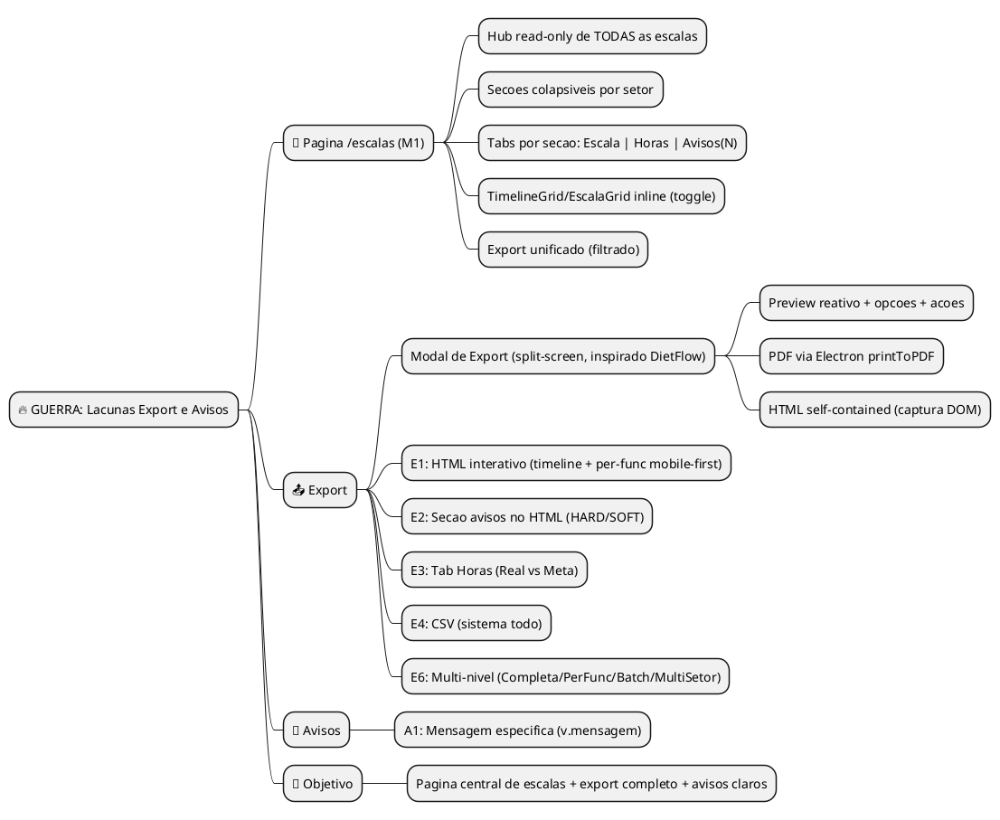
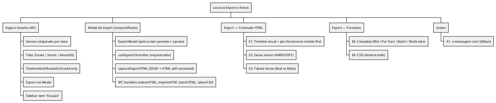

# WARLOG — Lacunas Export e Avisos (EscalaFlow)

> **Objetivo:** Backlog dos itens faltantes para equiparar ao exemplo Caixa/Rita e melhorar clareza dos avisos.
> **Data:** 2026-02-16
> **Fonte:** `docs/COMPARATIVO_RELATORIO_HORARIO_VS_ESCALAFLOW.md`, auditoria multi-setor, transcrição áudios.

---

## FASE 1 — VISÃO GERAL

### Mind Map



### Definicoes

```
MISSAO:
Criar hub central de visualizacao de escalas (/escalas) com export unificado,
completar ciclo de output e melhorar clareza dos avisos.

OBJETIVO:
- Pagina /escalas como vitrine read-only de TODOS os setores
- Export multi-nivel: massa (na /escalas) + individual (na EscalaPagina)
- Avisos com detalhes especificos do motor (valores, limites)
- Violacoes visiveis no print
```

---

## FASE 2 — ITENS COM PROPOSTA E EXPLICAÇÃO

### E1 — Export HTML interativo (timeline + por funcionario) — DESENHADO

| Campo | Conteudo |
|-------|----------|
| **O que e** | Todo export e HTML self-contained (inline CSS + vanilla JS). Nao PDF. HTML abre no celular (WhatsApp), navega entre semanas, e se quiser PDF → Ctrl+P. Serve pra RH (mural) e funcionario (celular). |
| **Proposta** | Dois formatos de export HTML no ExportarEscala: |
| | **1. Escala Completa (RH):** Timeline visual dia × colaboradores com barras de horario, cobertura, page-break por dia. Navegavel por semana. Media print = todas semanas de uma vez. |
| | **2. Por Funcionario:** Card-per-day com barra visual do turno, navegacao semanal (◀ ▶), summary de horas Real vs Meta no footer. Mobile-first. Dark mode auto (prefers-color-scheme). Media print = lista compacta sem JS. |
| **Interatividade (vanilla JS, zero dependencia):** | Navegacao entre semanas, touch-friendly, summary fixo, dark mode auto. Tudo funciona offline — e so um arquivo .html. |
| **Workflow real** | Rita clica "Batch" → sistema gera 1 HTML por colaborador em pasta → Rita manda cada um no WhatsApp individual. Ou "Completa" no grupo. |
| **Por que** | PDF e morto. HTML e vivo — funciona pra impressao E pro celular do funcionario. A gestora imprime pro mural, o funcionario navega no celular. |
| **Tipo** | ✨ Feature |
| **Est.** | G |

---

### E2 — Violações no HTML de impressão

| Campo | Conteúdo |
|-------|----------|
| **O que é** | Seção "Violações" ao final do documento HTML gerado pelo `ExportarEscala`, listando violações HARD e SOFT com nome, regra e data. |
| **Proposta** | Incluir no HTML de impressão (antes do fechamento do body) uma seção condicional: se `escalaCompleta.violacoes.length > 0`, renderizar lista agrupada por colaborador, com `colaborador_nome`, texto da violação e `data` quando existir. Reaproveitar estrutura do `ViolacoesAgrupadas`. |
| **Por que** | Hoje as violações só aparecem na UI; ao imprimir a escala, a gestora não vê os alertas. O Horario inclui violações no HTML. |
| **Tipo** | ✨ Feature |
| **Est.** | P |

---

### E3 — Resumo semanal (Real vs Meta) — DESENHADO

| Campo | Conteudo |
|-------|----------|
| **O que e** | Tabela: Colaborador \| Real \| Meta \| Δ \| Status (✅/⚠️). Mostra se cada colaborador atingiu a meta de horas da semana. |
| **Proposta** | Vive na **tab "Horas"** dentro de cada secao do `/escalas` (ver sistema de tabs abaixo). Calculo client-side: soma de `minutos` das alocacoes TRABALHO por colaborador; meta = `horas_semanais` do tipo_contrato × 60. Tambem renderizado no HTML de impressao (E2) quando toggle "Incluir avisos" ativo. |
| **Onde aparece** | 1) Tab "Horas" na secao do setor no `/escalas`. 2) Secao no HTML de impressao (ExportarEscala). 3) Opcionalmente na EscalaPagina (futuro). |
| **Por que** | A gestora precisa verificar rapidamente quem esta abaixo/acima da meta. O Horario tem isso no `escala_calendario.html`. |
| **Tipo** | ✨ Feature |
| **Est.** | M |

---

### E4 — Export CSV (sistema completo) — FECHADO

| Campo | Conteudo |
|-------|----------|
| **O que e** | Export CSV do **sistema todo** — todas escalas, todos setores. Nao e filtrado. E um dump completo pra integracao com outros sistemas (folha de pagamento, auditoria, BI). |
| **Proposta** | Botao "Exportar CSV" no `/escalas` (header geral). Gera dois arquivos: `alocacoes.csv` (data, colaborador, setor, status, hora_inicio, hora_fim, minutos) e `violacoes.csv` (colaborador, setor, regra, severidade, data, mensagem). Separador `;` (padrao BR pro Excel). UTF-8 com BOM. Client-side: busca todas EscalaCompleta de todos setores, concatena. |
| **Por que** | Integracao com outros sistemas, auditoria, backup estruturado. Nao e pra visualizar — e pra DADOS. |
| **Tipo** | ✨ Feature |
| **Est.** | M |

---

### ~~E5 — Export Markdown~~ — CORTADO

> Removido. HTML cobre visualizacao, CSV cobre dados. Markdown nao serve pra operacao do supermercado.

---

### A1 — Avisos com mensagem específica (v.mensagem)

| Campo | Conteudo |
|-------|----------|
| **O que e** | O motor gera `v.mensagem` com detalhes concretos (ex.: "Ana Julia trabalhou 7 dias seguidos (max 6)"). A UI hoje usa apenas `REGRAS_TEXTO[v.regra]` (texto genérico). |
| **Proposta** | Em `ViolacoesAgrupadas`, exibir `v.mensagem` quando existir; fallback para `REGRAS_TEXTO[v.regra] \|\| v.regra`. Afeta: 1) Tab "Avisos" no `/escalas`, 2) ViolacoesAgrupadas na EscalaPagina, 3) Secao violacoes no HTML de impressao (E2). |
| **Por que** | Texto genérico e menos util que mensagem especifica com valores reais. A mensagem do motor ja esta pronta; so nao e usada. |
| **Tipo** | 🔧 Refactor |
| **Est.** | P |

---

### M1 — Pagina /escalas: Hub de Visualizacao + Export (REDESENHADO)

| Campo | Conteudo |
|-------|----------|
| **O que e** | Pagina dedicada `/escalas` que mostra TODAS as escalas ativas de todos os setores em secoes colapsiveis. Cada secao renderiza a escala real (TimelineGrid ou EscalaGrid read-only). Nao e resumo de indicadores — e a timeline de verdade. Metadados (score, avisos) ficam compactos no header da secao. Para editar/gerenciar → "Editar →" leva pra EscalaPagina do setor. |
| **Proposta** | Ver secao "DESIGN DEFINIDO — Pagina /escalas" abaixo. |
| **Por que** | Fluxo atual: Setores → setor → "Abrir Escala" = 3 cliques. A /escalas da visao geral instantanea de TODOS os setores, serve como hub de export em massa, e responde "quem ta trabalhando quando?" olhando o todo. |
| **Tipo** | ✨ Feature |
| **Est.** | G |

---

### E6 — Multi-nivel de exportacao (REDESENHADO — split em duas paginas)

| Campo | Conteudo |
|-------|----------|
| **O que e** | Sistema de export dividido em dois contextos. Tudo e **HTML self-contained** (nao PDF). HTML abre no celular, navega, e se quiser PDF → Ctrl+P. |
| | **Na pagina `/escalas` (hub):** Export do que esta filtrado/visivel. DropdownMenu com: Imprimir (HTML), CSV. Toggle "Incluir avisos". Multi-setor consolidado com page-break por setor. |
| | **Na `EscalaPagina` (por setor):** Export individual. DropdownMenu com: Escala Completa (RH) → 1 HTML com todos, Por Funcionario → selecionar 1 → HTML individual mobile-first com navegacao semanal, Batch → 1 HTML por colaborador salvo em pasta (pra mandar no WhatsApp). |
| **Por que** | HTML > PDF: serve pra mural (imprime) E pro celular do funcionario (navega). Cada contexto tem sua necessidade: /escalas = visao macro, EscalaPagina = visao micro + per-funcionario. |
| **Tipo** | ✨ Feature |
| **Est.** | G (total, somando os dois contextos) |

---

## DESIGN DEFINIDO — Pagina /escalas

> Decisoes tomadas em sessao de design com time (UX + Frontend + Backend) em 2026-02-16.

### Conceito

```
/escalas = VITRINE READ-ONLY de todas as escalas + HUB DE EXPORT

- NAO e lugar de editar (editar → EscalaPagina)
- NAO e resumo de metadados (e a TIMELINE de verdade)
- E pra VER quem ta trabalhando quando, em todos os setores
- E pra EXPORTAR tudo de uma vez
```

### Wireframe

```
╔═══════════════════════════════════════════════════════════════════╗
║  Escalas                          [Grid|Timeline] [Filtros] [Exportar ▼] ║
║  Visualize e exporte escalas de todos os setores                         ║
╚═══════════════════════════════════════════════════════════════════╝

┌─────────────────────────────────────────────────────────────────┐
│ [▼] 🥩 Acougue    15/02-28/02  [89] OFICIAL  ⚠2  [Editar →]   │
├─────────────────────────────────────────────────────────────────┤
│  [Escala]  [Horas]  [Avisos(2)]                                 │
│  ───────                                                        │
│                                                                 │
│  << Tab Escala (default) >>                                     │
│                                                                 │
│  [ ◀ ]  Segunda, 17/02/2026  [ ▶ ]                             │
│                                                                 │
│  Colaborador      08:00  10:00  12:00  14:00  16:00  18:00     │
│  ─────────────────────────────────────────────────────────────  │
│  Joao Silva       [████████████]                                │
│                   08:00 ──── 13:00                              │
│  Maria Santos            [████████████]                         │
│                          11:00 ──── 17:00                       │
│  Pedro Costa      [████]       [████████]                       │
│                   08:00-10:00  13:00-18:00                      │
│  ─────────────────────────────────────────────────────────────  │
│  Cobertura        3/2    2/2    2/3    2/2    1/2               │
│                                                                 │
│  << Tab Horas >>                                                │
│                                                                 │
│  Colaborador       Real     Meta      Δ      Status             │
│  ─────────────────────────────────────────────────              │
│  Joao Silva        44h00    44h00     0      ✅                  │
│  Maria Santos      38h30    44h00    -5h30   ⚠️                  │
│  Pedro Costa       20h00    20h00     0      ✅                  │
│                                                                 │
│  << Tab Avisos(2) >>                                            │
│                                                                 │
│  🔴 Maria Santos — Trabalhou 7 dias seguidos (max 6)            │
│  🟡 Pedro Costa — So 18h entre 15/02-21/02 (min 20h)           │
│                                                                 │
└─────────────────────────────────────────────────────────────────┘

┌─────────────────────────────────────────────────────────────────┐
│ [▶] 🥖 Padaria    22/02-06/03  [76] RASCUNHO 🔴3  [Editar →]  │
└─────────────────────────────────────────────────────────────────┘

┌─────────────────────────────────────────────────────────────────┐
│ 🧊 Frios                              Sem escala  [Gerar →]    │
│     📅 Nenhuma escala ativa · Gere a primeira para este setor   │
└─────────────────────────────────────────────────────────────────┘
```

### Decisoes de Design

| # | Decisao | Definicao |
|---|---------|-----------|
| D1 | **Corpo da secao** | TimelineGrid ou EscalaGrid **read-only inline** (a escala de verdade, nao resumo) |
| D2 | **Toggle Grid/Timeline** | Global no header da pagina. Aplica a TODOS os setores. Reutiliza `EscalaViewToggle` |
| D3 | **Header da secao** | Compacto: icone + nome + periodo + score (badge) + avisos (badge) + "Editar →" |
| D4 | **Setores sem escala** | Secao aparece com EmptyState + "Gerar Escala →" (leva pra SetorDetalhe) |
| D5 | **Collapsible** | Toggle manual (useState), NAO usar shadcn Accordion/Collapsible |
| D6 | **Default** | Secoes ABERTAS (colapsam manualmente) |
| D7 | **Lazy load** | Dados carregados ao expandir secao (EscalaCompleta + colaboradores + demandas) |
| D8 | **Filtros** | Popover no header: setores (multi-select), status (todos/oficial/rascunho), periodo |
| D9 | **Export** | DropdownMenu no header: Imprimir (HTML), CSV (sistema todo). Toggle "Incluir avisos". |
| D10 | **Sidebar** | Item simples "Escalas" → /escalas (CalendarDays icon). NAO dropdown |
| D11 | **State** | Local (useState). NAO precisa Zustand |
| D12 | **Metadados detalhados** | Indicadores completos (cobertura %, equilibrio) → vivem na EscalaPagina. Aqui so tabs Horas/Avisos |
| D13 | **Tabs por secao** | Cada secao com escala tem 3 tabs: **Escala** (default), **Horas**, **Avisos(N)**. Tabs so aparecem quando tem dados (secao sem escala = EmptyState sem tabs) |
| D14 | **Tab Escala** | TimelineGrid/EscalaGrid read-only (o que era D1). Tab default, sempre ativa ao abrir |
| D15 | **Tab Horas** | Tabela Real vs Meta por colaborador. Calculo client-side: soma `minutos` alocacoes TRABALHO vs `horas_semanais * 60` do tipo_contrato. Colunas: Colaborador, Real, Meta, Δ, Status (✅/⚠️) |
| D16 | **Tab Avisos(N)** | Lista de violacoes do setor usando `v.mensagem` (A1). Badge com count no nome da tab. 🔴 = HARD, 🟡 = SOFT. Se 0 avisos, tab mostra "Nenhuma violacao" |
| D17 | **Naming das tabs** | "Escala" (nao "Timeline"), "Horas" (nao "Resumo Semanal"), "Avisos" (nao "Violacoes") — linguagem da gestora, nao do dev |

### Componentes Reutilizados (zero criacao de grid/timeline)

| Componente | Origem | Uso |
|------------|--------|-----|
| `TimelineGrid` | Projeto (517 linhas) | Inline na secao com `readOnly` |
| `EscalaGrid` | Projeto (403 linhas) | Inline na secao com `readOnly` |
| `EscalaViewToggle` | Projeto (60 linhas) | Toggle global Grid/Timeline |
| `ExportarEscala` | Projeto (258 linhas) | Loop com pageBreakAfter para export multi-setor |
| `EmptyState` | Projeto | Setores sem escala |
| `PontuacaoBadge` | Projeto | Score no header da secao |
| `PageHeader` | Projeto | Breadcrumb |

### Componentes Novos

| Componente | Tamanho Est. | O que faz |
|------------|-------------|-----------|
| `EscalasHub.tsx` (pagina) | ~400 linhas | Pagina principal: fetch setores + escalas, filtros, export, render secoes |
| `SetorEscalaSection.tsx` | ~350 linhas | Secao colapsivel: header + tabs (Escala/Horas/Avisos) + lazy load + TimelineGrid/EscalaGrid read-only |

### Sistema de Tabs por Secao (D13-D17)

```
Cada secao com escala ativa mostra 3 tabs:

[Escala]  [Horas]  [Avisos(N)]
───────

REGRAS:
- Tab "Escala" = default, sempre ativa ao abrir
- Tab "Horas" = tabela Real vs Meta (E3)
- Tab "Avisos(N)" = violacoes com v.mensagem (A1), count no badge
- Tabs so aparecem se secao tem escala (EmptyState = sem tabs)
- Toggle Grid/Timeline (D2) afeta apenas tab Escala
- Avisos usa icones de severidade: 🔴 HARD, 🟡 SOFT

CALCULO Tab Horas (client-side):
  Para cada colaborador do setor:
    real = SUM(alocacao.minutos) WHERE status = 'TRABALHO'
    meta = tipo_contrato.horas_semanais * 60
    delta = real - meta
    status = delta >= -tolerancia ? ✅ : ⚠️
  (tolerancia_semanal_min vem da config Empresa)

DADOS Tab Avisos:
  violacoes[] da EscalaCompleta, filtradas por setor
  Texto: v.mensagem || REGRAS_TEXTO[v.regra] || v.regra (A1)
```

### Arquitetura de Dados

```
Ao carregar pagina:
  1. setores.listar({ ativo: true }) → Setor[]
  2. escalas.resumoPorSetor() → { setor_id, data_inicio, data_fim, status }[]

Ao expandir secao (lazy):
  3. escalas.buscar(escalaId) → EscalaCompleta (alocacoes + violacoes + indicadores)
  4. colaboradores.listar({ setor_id }) → Colaborador[]
  5. setores.listarDemandas(setorId) → Demanda[]
  6. tiposContrato.listar() → TipoContrato[]

Export (sob demanda):
  7. Para cada setor filtrado: buscar EscalaCompleta (se nao carregada)
  8. Gerar HTML consolidado com ExportarEscala em loop (pageBreakAfter por setor)
```

### Sistema de Export — Divisao de Responsabilidades

```
TUDO E HTML SELF-CONTAINED (nao PDF). Quer PDF? Ctrl+P → Salvar como PDF.

PAGINA /escalas (HUB)                    PAGINA EscalaPagina (POR SETOR)
─────────────────────                    ───────────────────────────────
Export do FILTRADO:                      Export do SETOR:
• Imprimir (HTML multi-setor)            • Escala Completa (RH) — 1 HTML todos colabs
• CSV (sistema todo, integracao)         • Por Funcionario — 1 HTML mobile-first
• Toggle "Incluir avisos"                  com navegacao semanal, dark mode, barras
                                         • Batch — 1 HTML por colab → pasta
                                           (pra mandar no WhatsApp individual)
                                         • Toggle "Incluir avisos"
                                         • Toggle Grid/Timeline (WYSIWYG)
```

---

## DESIGN DEFINIDO — Modal de Export (inspirado DietFlow)

> Referencia: sistema de export do DietFlow (`~/dietflow-project/dietflow-app`).
> Adaptado de Next.js + HeroUI → Electron + shadcn/ui.
> Sessao de design 2026-02-16.

### Origem: O que o DietFlow faz

```
DietFlow Export System:
- ExportModalUnified: Modal split-screen (preview esquerda 40%, opcoes direita)
- useExportController: Hook orquestrador (config → fetch → preview → actions)
- capturePreviewHTML: Captura DOM renderizado + CSS → HTML self-contained
- downloadPDF: Envia HTML pro Puppeteer (server-side) → PDF perfeito
- Primitives: ExportLayout (A4), ExportHeader, ExportSection, ExportFooter
- Padrao: Preview reativo (toggle opcoes = preview atualiza em tempo real)
```

### O que se aplica ao EscalaFlow

```
✅ TRAZER:
- Modal split-screen com preview + opcoes (→ shadcn Dialog)
- Toggles de opcoes via Switch
- HTML self-contained (ja temos no ExportarEscala, melhorar)
- Captura DOM → HTML blob → download
- Preview reativo (opcoes mudam → preview atualiza)

❌ NAO SE APLICA:
- Puppeteer/PDF server-side → Electron tem webContents.printToPDF() nativo
- Provider pattern pra opcoes → overkill, useState basta
- Module-driven config → temos 1 modulo (escalas), nao 6
- Server actions → somos Electron, tudo e local
```

### PDF no Electron (zero dependencia extra)

```typescript
// Main process (IPC handler)
async function exportarPDF(html: string, filename: string): Promise<string> {
  const win = new BrowserWindow({ show: false, width: 794, height: 1123 }) // A4 px
  await win.loadURL(`data:text/html;charset=utf-8,${encodeURIComponent(html)}`)

  const pdfBuffer = await win.webContents.printToPDF({
    pageSize: 'A4',
    printBackground: true,
    margins: { top: 0.4, bottom: 0.4, left: 0.4, right: 0.4 } // inches
  })

  const filePath = path.join(app.getPath('documents'), filename)
  await fs.writeFile(filePath, pdfBuffer)
  win.close()
  return filePath
}
```

### Wireframe — Modal Export (EscalaPagina)

```
╔══════════════════════════════════════════════════════════════════════╗
║  Exportar Escala — Acougue                                    [X]  ║
╠═══════════════════════════════════════════════════════════════╤═════╣
║                                                               │     ║
║   ┌────────────────────────────────────┐                     │  Formato                    ║
║   │                                    │                     │  ◉ Escala Completa (RH)     ║
║   │         PREVIEW (40%)              │                     │  ○ Por Funcionario           ║
║   │                                    │                     │  ○ Batch (1 por funcionario) ║
║   │   ┌──────────────────────────┐     │                     │                              ║
║   │   │ Acougue                  │     │                     │  Funcionario                 ║
║   │   │ 15/02 - 28/02           │     │                     │  [Select: Joao Silva    ▼]   ║
║   │   │                         │     │                     │  (so se "Por Funcionario")   ║
║   │   │  Joao   [████████]      │     │                     │                              ║
║   │   │  Maria     [█████████]  │     │                     │  Opcoes                      ║
║   │   │  Pedro  [███]  [██████] │     │                     │  ┌──┐ Incluir avisos         ║
║   │   │                         │     │                     │  └──┘                        ║
║   │   └──────────────────────────┘     │                     │  ┌──┐ Incluir horas          ║
║   │                                    │                     │  └──┘ (Real vs Meta)         ║
║   └────────────────────────────────────┘                     │                              ║
║                                                               │  Visualizacao               ║
║                                                               │  [Grid | Timeline]          ║
║                                                               │                              ║
╠═══════════════════════════════════════════════════════════════╧═════╣
║                    [Cancelar]      [Baixar HTML]      [Imprimir]   ║
╚══════════════════════════════════════════════════════════════════════╝
```

### Wireframe — Modal Export (/escalas — hub)

```
╔══════════════════════════════════════════════════════════════════════╗
║  Exportar Escalas                                             [X]  ║
╠═══════════════════════════════════════════════════════════════╤═════╣
║                                                               │     ║
║   ┌────────────────────────────────────┐                     │  Formato                    ║
║   │                                    │                     │  ◉ Imprimir (HTML)          ║
║   │         PREVIEW (40%)              │                     │  ○ CSV (sistema todo)        ║
║   │      Multi-setor consolidado       │                     │                              ║
║   │                                    │                     │  Setores incluidos           ║
║   │   ┌── Acougue ──────────────┐     │                     │  ☑ Acougue                   ║
║   │   │  Joao   [████████]      │     │                     │  ☑ Padaria                   ║
║   │   │  Maria     [█████████]  │     │                     │  ☐ Frios (sem escala)        ║
║   │   └─────────────────────────┘     │                     │                              ║
║   │   ┌── Padaria ──────────────┐     │                     │  Opcoes                      ║
║   │   │  Carlos [██████]        │     │                     │  ┌──┐ Incluir avisos         ║
║   │   │  Ana      [████████]    │     │                     │  └──┘                        ║
║   │   └─────────────────────────┘     │                     │  ┌──┐ Incluir horas          ║
║   │                                    │                     │  └──┘ (Real vs Meta)         ║
║   └────────────────────────────────────┘                     │                              ║
║                                                               │                              ║
╠═══════════════════════════════════════════════════════════════╧═════╣
║                    [Cancelar]      [Baixar HTML]      [Imprimir]   ║
╚══════════════════════════════════════════════════════════════════════╝
```

### Decisoes do Modal de Export

| # | Decisao | Definicao |
|---|---------|-----------|
| X1 | **Layout** | Split-screen: preview esquerda (~60%), opcoes direita (~40%). Inspirado no ExportModalUnified do DietFlow |
| X2 | **Componente base** | shadcn `Dialog` com `max-w-5xl`. NAO Sheet, NAO fullscreen |
| X3 | **Preview** | Renderiza o HTML de export em miniatura (scale 0.4 via CSS transform). Atualiza reativamente quando opcoes mudam |
| X4 | **Formato (EscalaPagina)** | RadioGroup: Escala Completa (RH) / Por Funcionario / Batch. Default = Completa |
| X5 | **Formato (/escalas)** | RadioGroup: Imprimir (HTML) / CSV (sistema todo). Default = Imprimir |
| X6 | **Selecao de funcionario** | shadcn `Select` — so aparece quando formato = "Por Funcionario". Lista colaboradores do setor |
| X7 | **Toggles** | shadcn `Switch`: "Incluir avisos", "Incluir horas (Real vs Meta)". Mudam preview em tempo real |
| X8 | **Toggle visualizacao** | Grid/Timeline no modal — afeta como a escala aparece no export |
| X9 | **Acoes (footer)** | 3 botoes: Cancelar (ghost), Baixar HTML (outline), Imprimir (primary). Imprimir usa Electron printToPDF |
| X10 | **Batch** | Gera 1 HTML por colaborador em pasta escolhida (Electron dialog.showOpenDialog com directory). Barra de progresso no modal durante geracao |
| X11 | **CSV** | Nao tem preview — botao direto gera e salva. Dialog de salvar arquivo (dialog.showSaveDialog) |
| X12 | **Captura HTML** | Mesmo padrao DietFlow: querySelector('[data-export-preview]') → innerHTML + stylesheets → HTML self-contained com inline CSS + print media queries |

### Componentes shadcn usados no Modal

| Componente | Uso |
|------------|-----|
| `Dialog` + `DialogContent` | Container do modal (max-w-5xl) |
| `DialogHeader` + `DialogTitle` | Header com titulo |
| `RadioGroup` + `RadioGroupItem` | Selecao de formato |
| `Select` + `SelectItem` | Escolher funcionario |
| `Switch` | Toggles (avisos, horas) |
| `Button` | Footer actions (3 variantes) |
| `Label` | Labels dos controles |
| `ScrollArea` | Painel de opcoes (se muitas opcoes) |
| `Progress` | Barra de progresso no batch |
| `Separator` | Dividir secoes de opcoes |

### Componentes Novos (Export)

| Componente | Tamanho Est. | O que faz |
|------------|-------------|-----------|
| `ExportModal.tsx` | ~300 linhas | Modal split-screen: preview + opcoes + actions. Dumb component, recebe props |
| `useExportController.ts` | ~200 linhas | Hook orquestrador: monta opcoes, captura HTML, gera blob, trigga download/print |
| `captureExportHTML.ts` | ~150 linhas | Captura DOM → HTML self-contained (inline CSS, print media, A4, dark mode) |
| `ExportPreview.tsx` | ~80 linhas | Wrapper do preview com scale 0.4, scroll, loading state |

### IPC Handlers Novos (Main Process)

| Handler | O que faz |
|---------|-----------|
| `export.imprimirPDF` | Recebe HTML string → BrowserWindow oculta → printToPDF → salva arquivo |
| `export.salvarHTML` | Recebe HTML string → dialog.showSaveDialog → salva .html |
| `export.salvarCSV` | Recebe CSV string → dialog.showSaveDialog → salva .csv |
| `export.batchHTML` | Recebe HTML[] + nomes → dialog.showOpenDialog(directory) → salva N arquivos |

### Fluxo Completo

```
USUARIO CLICA "Exportar" (na EscalaPagina ou /escalas)
    │
    ▼
useExportController ativa
    ├── Monta opcoes baseado no contexto (EscalaPagina vs /escalas)
    ├── Renderiza ExportModal com preview + opcoes
    └── Preview carrega (ExportarEscala renderizado em miniatura)
    │
    ▼
USUARIO CONFIGURA opcoes
    ├── Escolhe formato (Completa / Por Func / Batch / CSV)
    ├── Toggle avisos, horas
    ├── Preview atualiza reativamente
    └── Seleciona funcionario (se Per-Func)
    │
    ▼
USUARIO CLICA ACAO
    │
    ├── [Baixar HTML]
    │   ├── captureExportHTML() → DOM → HTML blob
    │   ├── IPC: export.salvarHTML(html) → dialog.showSaveDialog
    │   └── Salva .html no local escolhido
    │
    ├── [Imprimir]
    │   ├── captureExportHTML() → DOM → HTML blob
    │   ├── IPC: export.imprimirPDF(html) → BrowserWindow oculta → printToPDF
    │   └── Salva PDF ou abre dialogo de impressao
    │
    ├── [Batch]
    │   ├── Para cada colaborador:
    │   │   ├── Renderiza HTML individual
    │   │   ├── captureExportHTML()
    │   │   └── Salva em pasta
    │   ├── Progress bar no modal
    │   └── Toast: "8 arquivos salvos em /Documents/escalas/"
    │
    └── [CSV]
        ├── Gera strings CSV client-side (alocacoes + violacoes)
        ├── IPC: export.salvarCSV(csv) → dialog.showSaveDialog
        └── Salva .csv
```

---

## AUDITORIA CODEBASE (2026-02-16)

> Verificacao do warlog contra o codigo real. O que JA existe, o que FALTA, o que TEM BUG.

### Motor — PRONTO, zero mudancas

```
✅ Motor gera v.mensagem em TODAS as violacoes (10+ regras)
✅ Exemplo real: "${c.nome} trabalhou ${consec} dias seguidos (max ${MAX})"
✅ EscalaCompleta tem violacoes[], indicadores, alocacoes — tudo tipado
✅ Tipo Violacao tem: regra, severidade, colaborador_nome, data, mensagem
✅ Tipo Alocacao tem: minutos, status, hora_inicio, hora_fim
✅ NENHUMA mudanca no motor necessaria pra este warlog
```

### Componentes Existentes — Verificados

| Componente | Linhas | readOnly? | Status |
|------------|--------|-----------|--------|
| TimelineGrid.tsx | 516 | ✅ Sim (prop na linha 25) | ✅ Pronto pra reusar |
| EscalaGrid.tsx | 402 | ✅ Sim (prop na linha 49) | ✅ Pronto pra reusar |
| EscalaViewToggle.tsx | 59 | N/A | ✅ Pronto |
| ExportarEscala.tsx | 257 | N/A | ⚠️ Precisa refatorar (E1, E2, E3) |
| EmptyState.tsx | — | N/A | ✅ Pronto |
| PontuacaoBadge.tsx | — | N/A | ✅ Pronto |
| PageHeader.tsx | — | N/A | ✅ Pronto |

### IPC Handlers — Verificados

| Handler | Existe? | Status |
|---------|---------|--------|
| escalas.gerar | ✅ | Retorna EscalaCompleta COM violacoes |
| escalas.ajustar | ✅ | Chama validarEscala, retorna violacoes |
| escalas.buscar | ✅ | 🔴 **BUG: retorna violacoes: []** — nao persiste/recalcula |
| escalas.resumoPorSetor | ✅ | Retorna periodo + status por setor |
| colaboradores.listar | ✅ | Aceita filtro setor_id |
| setores.listarDemandas | ✅ | OK |
| tiposContrato.listar | ✅ | OK |

### 🔴 BLOQUEADORES ENCONTRADOS

```
BUG-1: escalas.buscar retorna violacoes vazias
  Local: src/main/tipc.ts (handler escalas.buscar)
  Problema: Ao carregar escala salva, violacoes = []. Nao persiste nem recalcula.
  Impacto: BLOQUEIA A1, E2, tab Avisos, qualquer coisa que depende de violacoes.
  Fix: Chamar validarEscala(escalaId, db) dentro do handler e incluir no retorno.
  Prioridade: P0 — SEM ISSO NADA FUNCIONA.

BUG-2: ViolacoesAgrupadas e componente INLINE
  Local: src/renderer/src/paginas/EscalaPagina.tsx (linhas 681-850)
  Problema: Definido inline dentro de EscalaPagina, nao e exportavel/reutilizavel.
  Impacto: Tab "Avisos" no /escalas nao pode reusar sem extrair.
  Fix: Extrair pra src/renderer/src/componentes/ViolacoesAgrupadas.tsx
  Prioridade: P1 — antes de criar /escalas.

MISSING-1: shadcn RadioGroup NAO instalado
  Impacto: Export Modal (X4) precisa de RadioGroup pra selecao de formato.
  Fix: npx shadcn@latest add radio-group

MISSING-2: shadcn Progress NAO instalado
  Impacto: Batch export (X10) precisa de barra de progresso.
  Fix: npx shadcn@latest add progress
```

### shadcn Components — Inventario

```
JA INSTALADOS (src/renderer/src/componentes/ui/):
✅ Dialog, Button, Select, Label, Badge, Card, Table, Tabs
✅ Alert, AlertDialog, Avatar, Separator, Popover, Switch
✅ DropdownMenu, Form, Input, Textarea, Tooltip, Sonner (toast)

FALTA INSTALAR:
❌ RadioGroup — pra Export Modal (formato: Completa/PerFunc/Batch)
❌ Progress — pra batch export (barra de progresso)

NOTA: ScrollArea foi removido no pit-stop SC-6. Se precisar, reinstalar.
```

### Regras de shadcn pra implementacao

```
REGRA 1: Verificar componentes instalados ANTES de criar divs manuais.
         Se shadcn tem, USAR. Nao reinventar.

REGRA 2: Composicao > Wrapper. Usar primitivas do shadcn como building blocks,
         nao como containers decorativos.

REGRA 3: Tabs do /escalas usam shadcn Tabs (ja instalado), nao divs com onClick.

REGRA 4: Export Modal usa Dialog (ja instalado), RadioGroup (instalar),
         Select (ja instalado), Switch (ja instalado).

REGRA 5: Popover de filtros (D8) usa shadcn Popover (ja instalado).

REGRA 6: Manter dark mode — todos componentes shadcn ja suportam via CSS vars.
         Novos componentes DEVEM funcionar em dark mode sem CSS extra.

REGRA 7: Toast de feedback usa sonner (ja instalado). Nao criar notificacoes custom.
```

### Ordem de implementacao (pos-auditoria)

```
P0 — DESBLOQUEADORES (antes de tudo)
  1. Fix escalas.buscar → incluir violacoes recalculadas (5 min)
  2. Extrair ViolacoesAgrupadas → componente standalone (10 min)
  3. Instalar shadcn RadioGroup + Progress (2 min)
  4. Implementar A1 → v.mensagem com fallback (2 min)

P1 — PAGINA /ESCALAS (M1)
  5. Criar EscalasHub.tsx (~400 linhas)
  6. Criar SetorEscalaSection.tsx (~350 linhas) com tabs
  7. Adicionar rota + sidebar item (+2 linhas)
  8. Implementar tab Horas (E3) e tab Avisos

P2 — MODAL DE EXPORT
  9. Criar ExportModal.tsx (~300 linhas)
  10. Criar useExportController.ts (~200 linhas)
  11. Criar captureExportHTML.ts (~150 linhas)
  12. Criar ExportPreview.tsx (~80 linhas)
  13. Adicionar 4 IPC handlers de export no tipc.ts
  14. Integrar modal na EscalaPagina (substituir botao antigo)
  15. Integrar modal no EscalasHub

P3 — CONTEUDO DE EXPORT
  16. E2: Secao avisos no HTML de impressao
  17. E1: Timeline visual no HTML + per-funcionario mobile-first
  18. E4: Export CSV sistema todo
  19. E6: Batch (1 HTML por colab → pasta)
```

---

## FASE 3 — WBS



### Prioridade (atualizada pos-design)

```
🔴 NUCLEO (fundacao — desbloqueia todo o resto)
- M1: Pagina /escalas (hub de visualizacao + export unificado)
- A1: Avisos com v.mensagem (2 linhas, 5 min)
- E2: Violacoes no HTML de impressao (30 min)

🟡 IMPORTANTE (export completo)
- E1: Timeline no HTML de impressao
- E6: Multi-nivel (por funcionario + batch na EscalaPagina)
- E3: Resumo semanal (Real vs Meta)
- E4: Export CSV

🟢 NICE-TO-HAVE
- (nenhum — E5 cortado)
```

**Nota:** M1 subiu pra 🔴 porque e a fundacao de tudo. O export multi-setor (E6.4 "geral todos setores")
agora vive naturalmente dentro de M1 — nao e um item separado. A pagina /escalas JA e o "geral todos setores".

---

## FASE 4 — DASHBOARD

```
════════════════════════════════════════════════════════════════════
🔥 GUERRA: Lacunas Export e Avisos
════════════════════════════════════════════════════════════════════

📊 STATUS: 7 itens ativos | 1 cortado (E5) | 0 concluidos
📐 DESIGN: M1, E1, E3, E6 + MODAL EXPORT DEFINIDOS + A1, E2, E4 FECHADOS
📎 REF: DietFlow export system (ExportModalUnified, capturePreviewHTML)

════════════════════════════════════════════════════════════════════
📋 BACKLOG (reordenado por dependencia)
════════════════════════════════════════════════════════════════════

| ID  | Item                                          | Tipo | Status       | Est. | Prioridade |
|-----|-----------------------------------------------|------|--------------|------|------------|
| M1  | Pagina /escalas (hub visualizacao + export)   | ✨   | 📐 Desenhado | G    | 🔴 Nucleo  |
| A1  | Avisos com v.mensagem                         | 🔧   | 📋 Backlog   | P    | 🔴 Nucleo  |
| E2  | Violacoes no HTML de impressao                | ✨   | 📋 Backlog   | P    | 🔴 Nucleo  |
| E1  | Export HTML interativo (timeline + per-func)   | ✨   | 📐 Desenhado | G    | 🟡 Importante |
| E6  | Multi-nivel (HTML interativo + batch WhatsApp)  | ✨  | 📐 Desenhado | G    | 🟡 Importante |
| E3  | Resumo semanal — Tab "Horas" (Real vs Meta)    | ✨   | 📐 Desenhado | M    | 🟡 Importante |
| E4  | Export CSV (sistema completo, integracao)      | ✨   | ✅ Fechado   | M    | 🟡 Importante |
| ~~E5~~ | ~~Export Markdown~~                         | —    | ❌ Cortado   | —    | —           |

════════════════════════════════════════════════════════════════════
```

---

## FASE 5 — ARQUIVOS RELEVANTES

### Existentes (reutilizar)

| Arquivo | Uso |
|---------|-----|
| `src/renderer/src/componentes/TimelineGrid.tsx` | Inline read-only na /escalas + referencia pra E1 |
| `src/renderer/src/componentes/EscalaGrid.tsx` | Inline read-only na /escalas (modo grid) |
| `src/renderer/src/componentes/EscalaViewToggle.tsx` | Toggle global Grid/Timeline na /escalas |
| `src/renderer/src/componentes/ExportarEscala.tsx` | Export HTML; loop com pageBreak pra multi-setor; incluir E2, E3, E1 |
| `src/renderer/src/componentes/EmptyState.tsx` | Setores sem escala na /escalas |
| `src/renderer/src/componentes/PontuacaoBadge.tsx` | Score no header da secao |
| `src/renderer/src/paginas/EscalaPagina.tsx` | ViolacoesAgrupadas — A1; export por funcionario — E6 |
| `src/renderer/src/lib/formatadores.ts` | REGRAS_TEXTO; A1 usa v.mensagem como prioridade |
| `packages/shared/src/types.ts` | EscalaCompleta, Violacao, Alocacao |

### Novos (criar)

| Arquivo | Tamanho Est. | O que faz |
|---------|-------------|-----------|
| `src/renderer/src/paginas/EscalasHub.tsx` | ~400 linhas | Pagina /escalas: fetch, filtros, export, render secoes |
| `src/renderer/src/componentes/SetorEscalaSection.tsx` | ~350 linhas | Secao colapsivel: header + tabs (Escala/Horas/Avisos) + lazy load + Grid/Timeline read-only |
| `src/renderer/src/componentes/ExportModal.tsx` | ~300 linhas | Modal split-screen: preview + opcoes + actions (dumb component) |
| `src/renderer/src/hooks/useExportController.ts` | ~200 linhas | Hook orquestrador: opcoes, captura HTML, gera blob, download/print |
| `src/renderer/src/lib/captureExportHTML.ts` | ~150 linhas | Captura DOM → HTML self-contained (inline CSS, print media, A4) |
| `src/renderer/src/componentes/ExportPreview.tsx` | ~80 linhas | Wrapper do preview com scale 0.4, scroll, loading |

### Novos — IPC (Main Process)

| Handler | O que faz |
|---------|-----------|
| `export.imprimirPDF` | HTML → BrowserWindow oculta → printToPDF → salva PDF |
| `export.salvarHTML` | HTML → dialog.showSaveDialog → salva .html |
| `export.salvarCSV` | CSV string → dialog.showSaveDialog → salva .csv |
| `export.batchHTML` | HTML[] + nomes → dialog.showOpenDialog(dir) → salva N .html |

### Modificar

| Arquivo | Mudanca |
|---------|---------|
| `src/renderer/src/componentes/AppSidebar.tsx` | Adicionar item "Escalas" no mainNav (+1 linha) |
| `src/renderer/src/App.tsx` | Adicionar rota `/escalas` → EscalasHub (+1 linha) |
| `src/renderer/src/componentes/ExportarEscala.tsx` | Refatorar pra servir como base do conteudo de export (E1, E2, E3) |
| `src/renderer/src/paginas/EscalaPagina.tsx` | Trocar botao export antigo → abrir ExportModal |
| `src/main/tipc.ts` | Adicionar 4 IPC handlers de export |

---

## FASE 6 — LOG

```
[2026-02-16] CRIACAO
└── WARLOG de lacunas criado a partir do comparativo Horario vs EscalaFlow
    e da conversa sobre export + avisos. Itens com proposta e explicacao
    para iteracao futura.

[2026-02-16] ATUALIZACAO — Menu e multi-nivel de export
└── Adicionados M1 (menu Escalas com subitens por setor) e E6 (multi-nivel
    de exportacao). E6: visao completa RH (com/sem avisos), por funcionario
    unico, batch (um PDF por colaborador), geral todos setores.

[2026-02-16] REDESIGN — M1 vira pagina /escalas + E6 split
└── Sessao de design com time (UX + Frontend + Backend).
    M1 redesenhado: de "sidebar subitens" → pagina /escalas completa.
    Conceito: hub read-only com TimelineGrid/EscalaGrid inline por setor,
    secoes colapsiveis, export unificado do filtrado.
    E6 dividido: /escalas = export massa (multi-setor), EscalaPagina = por
    funcionario + batch. Toggle Grid/Timeline global no header.
    Decisoes D1-D12 documentadas na secao "DESIGN DEFINIDO".
    Docs gerados: UX_ANALYSIS_EXPORT_AVISOS_2026-02-16.md,
    UX_DESIGN_PAGINA_ESCALAS.md (wireframes detalhados).

[2026-02-16] DESIGN — Sistema de tabs por secao (E3 + A1 + avisos)
└── Cada secao com escala tem tabs: Escala | Horas | Avisos(N).
    E3 (Resumo semanal) vive na tab "Horas" — tabela Real vs Meta
    por colaborador, calculo client-side. Avisos usa v.mensagem (A1)
    com count no badge da tab. Naming pra gestora: "Horas" nao
    "Resumo Semanal", "Avisos" nao "Violacoes". Decisoes D13-D17.

[2026-02-16] DESIGN — A1 fechado + E1 redesenhado + E2 fechado
└── A1: trivial, trocar REGRAS_TEXTO por v.mensagem com fallback.
    E1: todo export e HTML self-contained (nao PDF). HTML > PDF
    porque funciona pra mural (imprime) E pro celular do funcionario
    (navega entre semanas). Per-funcionario: card-per-day mobile-first
    com barras visuais, nav semanal, dark mode auto, summary horas.
    Batch: 1 HTML por colab → pasta → WhatsApp. E2: secao de avisos
    condicional no HTML, agrupada por severidade (HARD/SOFT),
    controlada pelo toggle "Incluir avisos". E6 atualizado: tudo HTML.

[2026-02-16] DESIGN — E4 fechado (CSV sistema todo) + E5 cortado (Markdown)
└── CSV exporta sistema todo (todas escalas, todos setores), separador ;,
    UTF-8 BOM. Markdown removido — HTML cobre visualizacao, CSV cobre dados.

[2026-02-16] DESIGN — Modal de Export (inspirado DietFlow)
└── Estudado sistema de export do DietFlow (ExportModalUnified,
    useExportController, capturePreviewHTML, downloadPDF, Puppeteer).
    Adaptado pra Electron + shadcn/ui:
    - Modal split-screen: preview esquerda (40% scale) + opcoes direita
    - shadcn Dialog (max-w-5xl), RadioGroup, Select, Switch, Button
    - Preview reativo (opcoes mudam → preview atualiza)
    - PDF via Electron nativo (webContents.printToPDF), zero dependencia
    - HTML self-contained via captura DOM + inline CSS
    - 4 IPC handlers novos (salvarHTML, imprimirPDF, salvarCSV, batchHTML)
    - Decisoes X1-X12 documentadas. Wireframes pra EscalaPagina e /escalas.
    - Componentes novos: ExportModal, useExportController, captureExportHTML,
      ExportPreview (~730 linhas total estimado).
```
