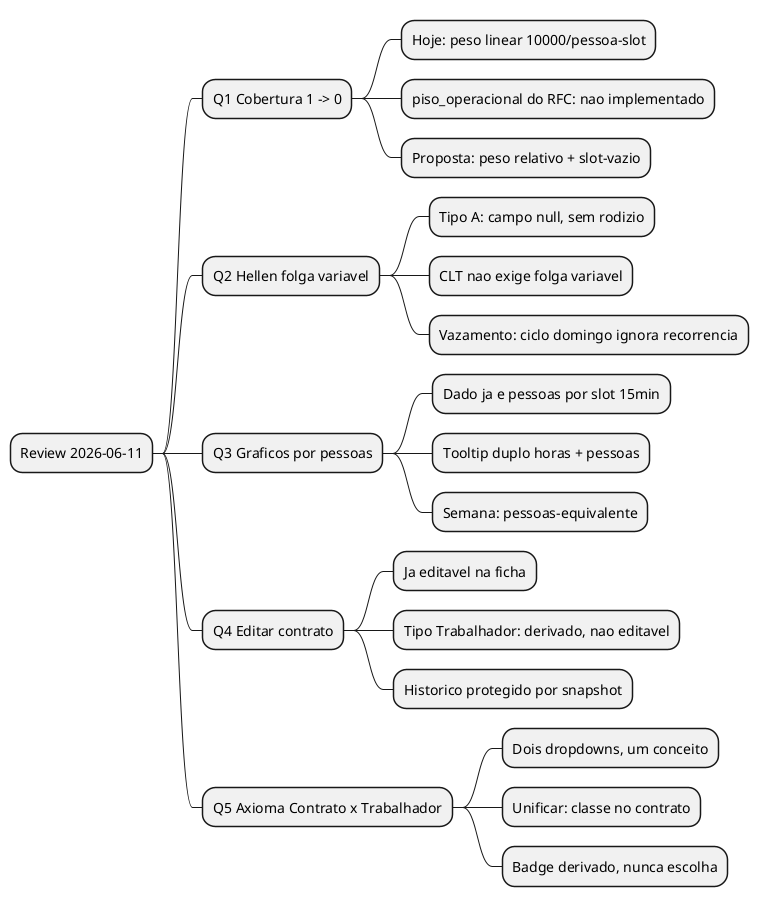
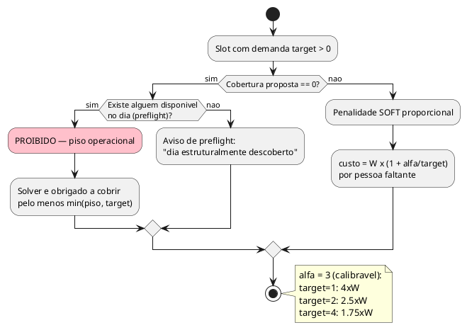
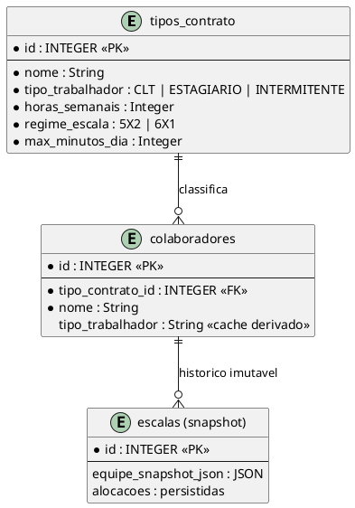

# ANALYST REVIEW — Cobertura, Piso Operacional, Hellen, Gráficos e o Axioma Contrato×Trabalhador

> **Data:** 2026-06-11 · **Método:** grounding em código real (arquivo:linha citados) + dados reais da escala #37 (PADARIA ATENDIMENTO, 15/06–12/07)
> **Origem:** 5 questões do operador após a geração da primeira escala 6x1 com intermitente quinzenal.

---

## TL;DR EXECUTIVO

1. **A quarta 07:00 ficou vazia porque o solver cobra o MESMO preço por qualquer pessoa faltante** — déficit 4→3 custa igual a 1→0. A tua intuição do "piso" já existe especificada no RFC do motor (`piso_operacional`, Nível 2 da cadeia) e **nunca foi implementada** (zero ocorrências no código). Proposta: penalidade proporcional ao target + slot-vazio proibido em duas camadas (soft agora, hard depois).
2. **A Hellen NÃO tem e NÃO precisa de folga variável** — a arquitetura atual já resolve sem custo pros demais. O único vazamento real é o cálculo do ciclo de domingo contar a garantia dela em semanas que ela está OFF.
3. **Visão por pessoas nos gráficos é 100% viável** — o dado já É pessoas por slot de 15min; tooltip duplo (horas + pessoas) dá em todas as granularidades, com semântica exata no dia e "pessoas-equivalente" na semana.
4. **Trocar contrato já é possível na ficha hoje** (campo "Tipo de Contrato" no ColaboradorDetalhe). O que não dá pra trocar é o "Tipo Trabalhador" — e a resposta certa não é torná-lo editável: é **eliminá-lo como escolha**.
5. **O axioma está quebrado mesmo**: dois dropdowns para um conceito só. A unificação certa: contrato é a única escolha do usuário; o "tipo de trabalhador" vira **classe do contrato** (coluna em `tipos_contrato`), derivado sempre, exibido como badge.



---

## Q1 — Por que a quarta-feira 07:00 ficou sem ninguém (e a matemática do "nunca zero")

### O fato, nos dados reais da escala #37

| Data (QUA) | 07:00 | 07:15 | 07:30 | 07:45 |
|---|---|---|---|---|
| 17/06 | **0/1** | **0/1** | **0/1** | 1/1 |
| 24/06 | 1/1 | 1/1 | 1/1 | 1/1 |
| 01/07 | **0/1** | **0/1** | 1/1 | 1/1 |
| 08/07 | **0/1** | **0/1** | 1/1 | 1/1 |

### Onde está a "lógica de porcentagens" que você procurou

Ela **não existe como porcentagem** — existe como **peso linear absoluto**. `solver/solver_ortools.py:70-80`:

```python
WEIGHTS = {
    "override_deficit": 40000,   # demanda marcada com override=true (quasi-hard)
    "demand_deficit": 10000,     # CADA pessoa-slot faltante custa isso
    "surplus": 5000,
    ...
}
```

A penalidade é `10000 × pessoas_faltantes × slots`. Consequência matemática direta da tua observação:

- Slot precisa **4**, tem **3** → custo 10000 (perdeu 25% da cobertura)
- Slot precisa **1**, tem **0** → custo 10000 (perdeu **100%** — a loja está VAZIA)

O solver é indiferente entre os dois. E tem um agravante de produto: a "cobertura efetiva" (`validacao-compartilhada.ts`, `calcularIndicadoresV3`) **perdoa explicitamente** déficit de 1 pessoa nas faixas 07:00–07:30, 11:00–12:00 e 19:00–19:30 ("faixas de transição"). Ou seja: o indicador foi desenhado para tratar a abertura como tolerável — o solver deixa o buraco exatamente onde o indicador não dói.

### O que o RFC já previu e nunca foi construído

`docs/motor-regras.md` §2 define a cadeia de precedência com o **NÍVEL 2 — PISO OPERACIONAL**: *"Violação = abaixo do mínimo estrutural do setor. Campo: `setor.piso_operacional` (hard). Exemplo: Açougue precisa de min 1 pessoa pra funcionar."*

`grep -rn piso_operacional src/ solver/` → **zero resultados**. O conceito está aprovado em RFC desde fevereiro e não existe uma linha de código. Tua pergunta redescobriu o próprio backlog.

### A matemática proposta (em duas camadas)



**Camada 1 — penalidade relativa (sem risco, entrega já):** trocar o custo fixo de `demand_deficit` por custo ponderado pelo target do slot. Fórmula inteira (CP-SAT não aceita float): `peso_slot = 10000 + (30000 // target)`. O déficit no slot de target 1 passa a custar 4× o do slot de target 4 — o solver passa a preferir tirar do pico e nunca da abertura. Implementação: `add_demand_soft` em `constraints.py` já itera slot a slot com o target em mãos; é trocar o coeficiente no termo do objetivo.

**Camada 1.5 — "última pessoa" (slot vazio):** BoolVar `slot_vazio[d,s]` ativada quando `coverage == 0 ∧ target > 0`, penalizada com peso próprio (ex. 50000 — acima do override). É o "jamais zero" em forma soft: não cria INFEASIBLE quando é fisicamente impossível (todo mundo de atestado), mas torna o zero a ÚLTIMA escolha do otimizador, não uma indiferente.

**Camada 2 — piso operacional HARD (o RFC completo):** coluna `setores.piso_operacional` (default 1) + constraint `coverage[d,s] >= min(piso, target, disponiveis_no_slot)` que **não relaxa em pass nenhum** (entra no clube do H2/H4) + check de preflight que avisa quando o piso é estruturalmente impossível. É a resposta definitiva, mas exige migração, UI no setor, preflight e specs — por isso em camada própria.

### A "porcentagem de adequação" formalizada (o caso 500→420)

O exemplo que você deu (500 pode virar 420; 4 pode virar 3; 1 **jamais** vira 0) é uma função de adequação **relativa com floor absoluto**. Formalização executável, por slot:

```
deficit_maximo(target)   = floor( target × tol )
cobertura_minima(target) = max( piso, target − deficit_maximo(target) )

piso = setores.piso_operacional (default 1)
tol  = tolerância relativa configurável na empresa (default 25%)
```

| target | deficit_max (tol 25%) | cobertura mínima | leitura |
|---|---|---|---|
| 1 | floor(0,25) = 0 | **1** | jamais zero ✓ (e o piso segura mesmo se tol crescer) |
| 3 | floor(0,75) = 0 | **3** | slot pequeno não tolera perda com tol 25% |
| 4 | floor(1,00) = 1 | **3** | 4→3 ✓ |
| 500 | floor(125) = 125 | **375** | em massa, tolerância proporcional ✓ (com tol 16%: 500→**420**, teu exemplo exato) |

Duas notas honestas dessa matemática: (a) **uma tolerância única não reproduz simultaneamente "4→3" (25%) e "500→420" (16%)** — se quiser as duas, a tolerância precisa ser escalonada (ex. degraus por faixa de target, ou função côncava `tol(target) = tol_base + k/target`); o doc recomenda começar com tolerância única + piso e só escalonar se o uso pedir. (b) Esse mínimo entra como **quasi-hard** (peso de override, 40000), não como HARD absoluto — HARD por slot sem guarda de capacidade é fábrica de INFEASIBLE; o piso (camada 2) é o único termo que merece promoção a HARD de verdade.

**Regra de validação (fecha matematicamente?):** com 4 CLTs disponíveis numa QUA (1 folgando), cobrir 07:00–07:45 custa antecipar a entrada de 1 pessoa — a capacidade existe (provamos: déficit estrutural da semana mora nos picos, não na abertura). A penalidade relativa redistribui exatamente isso.

---

## Q2 — Folga fixa e variável no 6x1, e o caso do intermitente quinzenal

### Como fixa e variável funcionam no 6x1 (o contexto que a pergunta pede)

No 6x1 a folga é **única por semana**, e os dois campos têm semântica própria (diferente do 5x2):

- **Folga variável** no 6x1 é a folga das semanas de *trabalho-domingo*: quem trabalha o DOM folga no dia variável da mesma semana (XOR, offsets negativos SEG=-6…SAB=-1); quem folga o DOM tem ali sua folga única. É o mecanismo que faz o rodízio de domingo girar.
- **Folga fixa** no 6x1 = dia forçado **toda** semana → rodízio de domingo desativado para a pessoa (se fixa=SEG, ela trabalha todos os domingos). É escolha forte, com efeito colateral que o RH precisa enxergar.
- A transição trabalho-DOM → folga-DOM pode exigir folga extra na semana (reparo do H1, máx 6 dias corridos) — o motor injeta sozinho.

Isso vale para a equipe CLT. A pergunta então vira: o intermitente entra nesse jogo?

### Resposta direta para o intermitente quinzenal

**Ela não recebe folga variável hoje, não deveria receber, e manter como está custa zero pros demais.** Não precisa de heurística nova.

O grounding:

- `colaborador_regra_horario` da Hellen: `folga_variavel_dia_semana = NULL` → ela é **Tipo A** (fora do pool rotativo de domingo). `solver-bridge.ts` pula explicitamente o XOR, o dom_max e o ciclo para Tipo A.
- `folga_fixa` é **forçada NULL** para intermitente no handler (`tipc.ts:2477-2483`) — dias sem regra já cumprem o papel de "não trabalha" (HARD, com belt-and-suspenders no solver).
- **A CLT não obriga "folga variável"** para intermitente. O contrato intermitente (Art. 452-A, Lei 13.467/2017) dilui o DSR no pagamento de cada convocação. "Folga variável" é um mecanismo do PRODUTO para rodízio de domingo de equipe fixa — não uma exigência legal. O descanso da Hellen é estrutural: ela trabalha 1 dia a cada 14.
- O custo computacional dela no modelo é mínimo: dias sem regra viram `work=0` fixo, semanas OFF viram bloqueio, H10 dela prorata a zero. Ela é quase pré-resolvida antes do solver começar.

### O único vazamento real (e vale o conserto)

`contarIntermitentesGarantidosNoDomingo` (`solver-bridge.ts:195-207`) conta a Hellen como **cobertura garantida de domingo em TODAS as semanas** — a função não conhece a recorrência. Efeito dominó: a demanda rotativa de DOM que sobra para as CLTs é subestimada → o ciclo calculado fica frouxo → exatamente o que os dados mostraram (DOM 28/06, semana OFF dela, ficou com 1 pessoa para demanda 3).

**Fix proposto (cirúrgico):** na contagem de garantidos, ponderar pela recorrência — ela só "garante" o domingo das semanas ON. Como a demanda rotativa precisa ser única para o período, usar o pior caso (semana OFF ⇒ ela não garante nada) ou a média ponderada. Toca apenas a bridge (esse cálculo de "garantidos" não é um dos 6 locais sincronizados do `N/gcd(N,K)` — é um ajuste de demanda na entrada dele).

**Sobre "a volta ser grande demais":** não é. É uma função de ~12 linhas com a regra padrão da pessoa já em mãos (a recorrência está na mesma linha da tabela). ROI alto: conserta os domingos OFF sem tocar no Python.

---

## Q3 — Cobertura por PESSOAS nos gráficos e tooltips duplos

### O que existe hoje (terreno)

- **Componente único:** `CoberturaChart.tsx` (usado em EscalaPagina, EscalasHub e SetorDetalhe ×2). AreaChart por dia + drill-down BarChart por hora, paginação semana/mês/tudo.
- **Dado fonte:** `escala_comparacao_demanda` → `SlotComparacao { data, hora_inicio, hora_fim, planejado, executado, delta }` por slot de 15min. **`planejado`/`executado` já SÃO pessoas** — a visão "por pessoas" não exige nenhum dado novo.
- **Tooltips:** `<ChartTooltipContent />` padrão shadcn, zero customização — mostra só "Necessario/Coberto" da agregação corrente (que hoje é soma de pessoas-slot, um número sem unidade intuitiva).

### A matemática por granularidade (o que dá exato e o que é derivado)

| Granularidade | Horas (necessário vs coberto) | Pessoas (necessário vs coberto) |
|---|---|---|
| **Slot 15min / hora** | exato: `pessoas × 0,25h` | **exato**: `planejado` vs `executado` |
| **Dia** | exato: `Σ pessoas-slot × 0,25h` | exato no **pico** (`max planejado` vs `max executado` simultâneos) + déficit-pico (`max |delta|` = "faltou até N pessoas ao mesmo tempo") |
| **Semana / mês / tudo** | exato: soma de horas | **pessoas-equivalente**: `déficit_horas ÷ jornada média semanal` (ex.: 8,75h ÷ 44h = "0,2 pessoa") + pior pico do período |

Ou seja: a tua condição ("dentro do que a matemática nos permitir") fecha assim — **pessoas exatas até o nível de dia (como pico simultâneo), pessoas-equivalente nos agregados**, sempre com as horas exatas ao lado. Nenhum toggle: o tooltip carrega as duas leituras.

**Mockup do tooltip (drill-down de hora):**

```
QUA 17/06 — 07:00-08:00
Necessário   1,00h   ·  1 pessoa (pico)
Coberto      0,25h   ·  máx 1 pessoa (07:45)
Déficit      0,75h   ·  3 slots vazios  ⚠ slot a ZERO
```

### Blueprint técnico

1. `CoberturaChart.tsx`: novo `useMemo` derivando por ponto `{horas_nec, horas_cob, pico_nec, pico_cob, deficit_pico, slots_zero}` a partir dos `SlotComparacao[]` já recebidos por prop (zero mudança de IPC/banco).
2. Tooltip custom (substitui `ChartTooltipContent`): recebe `payload[0].payload` enriquecido pelo memo. Padrão recharts/shadcn já suportado.
3. Marcar visualmente `slots_zero > 0` (o "1→0" da Q1) — badge vermelho no tooltip e ponto destacado no eixo. Sinergia direta com a Q1: o RH enxerga o zero antes mesmo do motor ser corrigido.
4. Agregação extra "por dia da semana" (todas as SEGs juntas etc.) é um terceiro memo barato — útil para enxergar padrão estrutural ("toda QUA abre descoberta").

---

## Q4 — Editar Tipo de Contrato / Tipo Trabalhador depois de criado

### Correção de premissa (verificado no código e importa)

**Trocar o contrato JÁ é possível hoje** na ficha: `ColaboradorDetalhe.tsx:967-990` tem o `FormField "Tipo de Contrato"` habilitado, e o save (`:576-589`) persiste `tipo_contrato_id` + horas do template. Se a tua experiência foi de impossibilidade, o que você viu provavelmente foi o **Tipo Trabalhador**: esse não tem campo na ficha — e pior, é **sobrescrito silenciosamente** pela derivação do contrato a cada save.

### Tua análise de banco está certa — e o sistema já a implementa

> "a escala criada é histórica e a escala a ser criada é dinâmica"

Exato, e a arquitetura já garante isso: escala oficializada carrega `equipe_snapshot_json` + alocações persistidas (snapshot estático); geração futura lê o cadastro vivo. Trocar contrato de um colaborador **não invalida retroativamente nada** — a resposta que a IA do app te deu sobre "trava de segurança do banco" era confabulação (não existe trava, CHECK ou FK histórica nesse campo).

### A regra do que pode e não pode

```
✅ PODE:  trocar tipo_contrato_id a qualquer momento (ficha) — afeta só gerações futuras
✅ PODE:  trocar setor, função, horas (idem)
🔄 SEMPRE: tipo_trabalhador segue o contrato (derivado, nunca escolhido)
🚫 NUNCA: editar tipo_trabalhador como campo solto — é isso que cria o estado
          divergente que faz intermitente vazar pra dia proibido no solver
          (bug provado e corrigido hoje na bridge; a fonte precisa ser única)
🔀 SE o usuário cadastrou errado → troca o CONTRATO; o tipo segue junto. Excluir
   funcionário para "consertar tipo" nunca mais.
```

---

## Q5 — O axioma Contrato × Trabalhador (a unificação)

### O problema, formalizado

Hoje o usuário escolhe DUAS coisas que são UMA:

- **Criação** (`ColaboradorLista.tsx:772`): dois selects independentes → permite "Contrato Intermitente + Trabalhador CLT" sem aviso (estado inválido que o motor não sabe interpretar).
- **Edição**: o segundo select não existe e o valor é recalculado do contrato — ou seja, **a escolha da criação é descartada na primeira edição**. Dois formulários, duas filosofias.
- A derivação atual é **por nome do contrato** (`nome.includes('intermit')`) — frágil: renomear um contrato muda a classe legal de todo mundo que o usa.

### O modelo certo



**Decisões:**

1. **`tipo_trabalhador` vira coluna de `tipos_contrato`** (a "classe legal" do contrato). Seed preenche os 6 de fábrica; contratos custom escolhem a classe ao criar o contrato — uma vez, por quem entende, e não a cada colaborador.
2. **Colaborador não escolhe mais nada além do contrato.** O select "Tipo Trabalhador" sai da criação; nos dois formulários entra um **badge read-only** ("Classe: Intermitente — definida pelo contrato"), atualizando ao vivo quando troca o contrato no dropdown.
3. A coluna `colaboradores.tipo_trabalhador` vira cache: preenchida server-side (tipc) na criação/edição a partir do contrato — cobre IA tools, import e lote. A heurística por nome fica apenas como fallback de migração/contrato legado, nunca como fonte preferencial.
4. **Dropdown único, agrupado e legível**: `CLT — 44h (6x1)`, `CLT — 36h (6x1)`, `Estagiário — 20h`, `Intermitente`. O usuário enxerga classe e carga numa escolha só — resolve o "CLT 44, CLT 36 e CLT apenas?" da tua pergunta: "CLT" sozinho deixa de existir como opção; só existem contratos concretos com classe visível.

**Migração:** `ALTER TABLE tipos_contrato ADD COLUMN tipo_trabalhador` + backfill pela heurística atual (uma única vez, auditável) + ajuste dos 3 pontos de escrita (criação, edição, tipc/IA). Snapshots históricos intocados.

**"E nas tabelas onde tem o contrato?"** — a tua pergunta tem as duas leituras, e as duas têm resposta:

- **Schema:** a coluna nova mora em `tipos_contrato` (decisão acima). Em `colaboradores` NÃO entra coluna nova — a existente vira cache derivado. Unificação, não duplicação.
- **UI (listagens):** nas tabelas de tela, a classe aparece como **coluna/badge ao lado do contrato** — `ColaboradorLista` ganha "Contrato" exibindo `CLT 44h · CLT` / `Intermitente · INT` (ou badge colorido de classe), e `ContratoLista` mostra a classe de cada contrato (é onde ela é definida). Nada de duas colunas editáveis: uma escolha (contrato), duas informações visíveis (nome + classe).

---

## ORDEM DE ATAQUE — v2 (revisada após parecer externo Codex, 2026-06-11)

> Parecer Codex: concordância em todos os itens, com ajustes incorporados abaixo.
> Claims dele verificadas no código antes de aceitar: validador.ts:238 lê coluna crua ✓;
> spread a 800/min ⇒ 15min de spread (12.000) custa mais que 1 pessoa-slot de déficit (10.000) ✓;
> tools.ts:602 permitia escrita livre de tipo_trabalhador no momento do parecer ✓; após o item 0, `tipo_trabalhador` saiu da whitelist de escrita de `colaboradores` e permanece só em consulta/contrato.

| # | Item | Esforço | Impacto |
|---|---|---|---|
| 0 | **Paridade do `tipo_trabalhador`** (novo, do parecer): resolver compartilhado em `src/shared/` aplicado em bridge, **validador** (:238), preflight, discovery e tools da IA (derivação server-side + saída da whitelist de escrita) | P/M | Fecha o fix da bridge que ficou incompleto — solver e validador julgando com o MESMO tipo |
| 1 | Q2 fix do ciclo×recorrência — **por PIOR CASO**: existindo qualquer DOM OFF do intermitente no período, `guaranteedSundayCoverage = 0` (média ponderada descartada — frágil para um ciclo único) | P | Conserta domingos OFF |
| 2 | Q1 camada 1 + 1.5 (peso relativo + slot-vazio) | P | Mata o "1→0" na prática |
| 3 | Q3 tooltips duplos + flag de slot-zero (pessoas = pico/equivalente, nunca soma crua) | P/M | RH enxerga o problema sozinho |
| 4 | Q5 unificação do axioma (inclui Q4) — backfill protegido: contratos de sistema pelo seed; custom por maioria dos colaboradores vinculados ou revisão explícita | M | Elimina classe inteira de erro de cadastro |
| 5 | Q1 camada 2 (piso_operacional HARD) — só com preflight forte e spec de falha honesta | M/G | O "jamais zero" vira lei |

**Riscos monitorados (do parecer, aceitos):**

- **Spread (peso 800/min)**: risco invertido — pode competir DEMAIS com cobertura (igualar totais > cobrir um slot). Dado empírico da escala #37: capacidade estava 100% esgotada (todas as CLTs no teto da banda H10), então o spread não roubou cobertura *neste* caso. Vigiar: se aparecer escala sacrificando slot para igualar 15min de total, baixar o peso ou tornar o spread critério secundário pós-déficit.
- **Sunday headcount removido do Pass 2**: resolvido na execução pós-v2 como **slack quasi-hard em todos os passes**. Como demanda é SOFT, o headcount derivado não pode ser HARD.
- **Pass 1 da Padaria continua genuinamente INFEASIBLE**: prova pós-fix em mini-SAT de dias, sem horarios/almoço/H10/pins. Com `piso_operacional=1`, H3 feminino, H1 e `DIAS_TRABALHO == 6`, o modelo já é INFEASIBLE. Razão: em 6x1 exato, trabalhar domingo na semana N exige uma folga antes do sábado seguinte para respeitar H1; se H3 feminino força folga no domingo N+1, a semana N+1 precisa de duas folgas. Logo o Pass 2 relaxando `DIAS_TRABALHO` não é migué, é o repair legal necessário.
- **Janela de almoço relógio-fixo 11:00-14:00**: corrigida para semântica relativa ao turno. H6 continua exigindo intervalo em jornada >6h, gap 1-2h, blocos mínimos e 2h antes/depois; 11:00-14:00 fica como preferência/antipattern diurno, não como constraint HARD para turno de tarde/noite.
- **Convenção de dias `horario_por_dia`**: auditada em 2026-06-11. Bridge envia chaves 0=DOM..6=SAB; Python usa `(date.weekday() + 1) % 7`, convertendo `weekday()` 0=SEG..6=DOM para a mesma convenção. Dump real: 2026-06-15 SEG -> chave 1; 2026-06-21 DOM -> chave 0. Sem bug encontrado.
- **`ESCALAFLOW_AI_DEVTOOLS=true` ainda força DevTools em app empacotado** — aceito como escape hatch de debug explícito.

## DISCLAIMERS CRÍTICOS

- 🚨 **Q1 camada 2 sem preflight é fábrica de INFEASIBLE**: piso HARD com equipe toda indisponível trava a geração. A ordem das camadas existe por isso — soft primeiro, hard com guarda de capacidade depois.
- 🚨 **Q5 exige rodar o teste de paridade** (`solver:test:parity`) após mudar a derivação — o `tipo_trabalhador` alimenta constraints do motor (intermitente/estagiário).
- 🚨 **Não calibrar α da Q1 sem rodar nos dados reais**: peso relativo alto demais faz o solver sacrificar pico de 4 pessoas para salvar abertura de 1 — o equilíbrio é empírico (sugestão: α=3, validar na Padaria).
- 🚨 A coluna-cache `colaboradores.tipo_trabalhador` só é segura com escrita **exclusivamente server-side**; se algum caminho gravar direto (IA tool com campo na whitelist), a divergência volta. Remover `tipo_trabalhador` da whitelist de `criar`/`atualizar`/`cadastrar_lote` em `tools.ts` faz parte do pacote.
