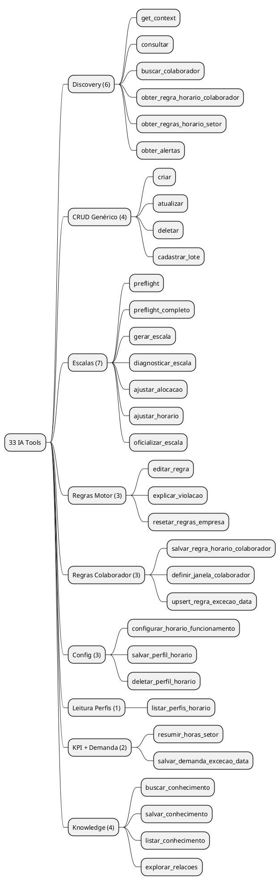
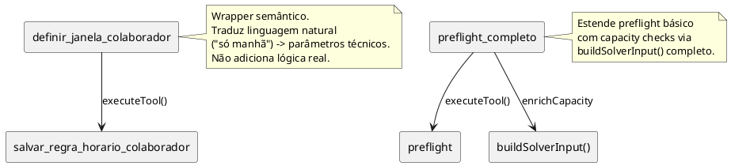
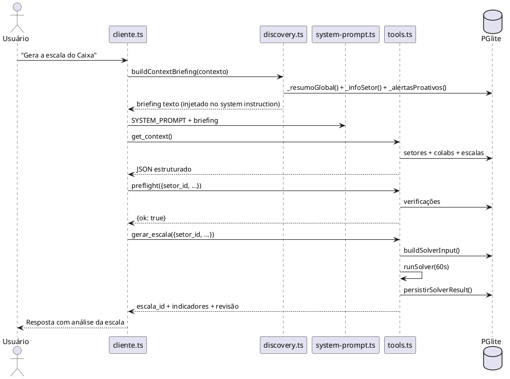
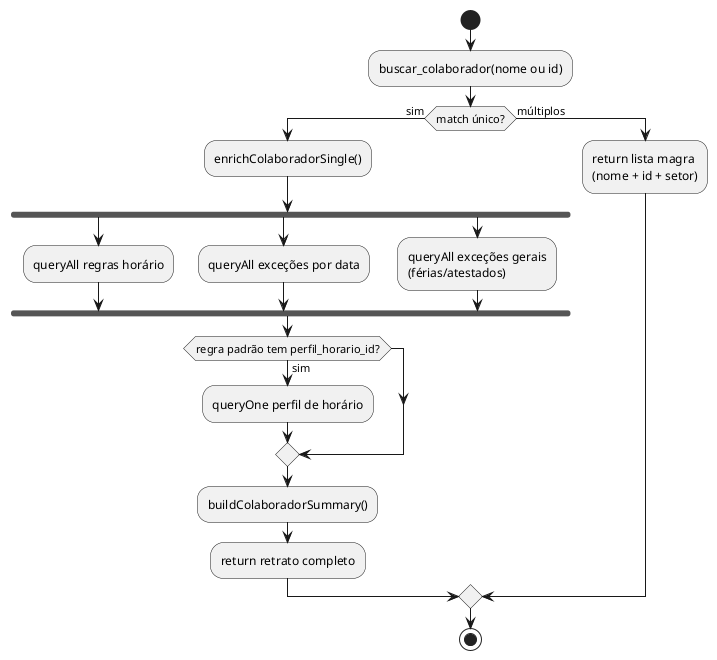

# AUDITORIA DO SISTEMA DE IA — 33 Tools (v2.0)

> **Update 2026-02-24 — Cleanup v2 executado:** 33→30 tools. Burrices 1-4, 6-7 corrigidas. TOSCOs 1-2 deduplicados. GAP-5 resolvido. Ver notas [RESOLVIDO] em cada item.

Data: 2026-02-24
Escopo: `tools.ts` (~3500 linhas) + `discovery.ts` (346 linhas) + `cliente.ts` (645 linhas) + `system-prompt.ts` (437 linhas)
Revisão: Cross-reference contra `TOOL_CALLING_PLAYBOOK.md` (14 seções, 12 patterns, 7 anti-patterns)

---

## TL;DR

- **33 tools** organizadas em 9 categorias funcionais
- **7 burrices estruturais** encontradas no cross-reference com o playbook
- **3 delegações internas** (tools que chamam outras tools por dentro)
- **2 duplicações de lógica** identificadas — alertas e defaults de criação
- **1 anti-pattern grave** do próprio playbook violado no código (Discovery Duplicado)
- **0 bugs de segurança** — whitelists protegem contra SQL injection em todas as superfícies
- **Arquitetura de tools: sólida.** O problema não é nas tools — é na ORQUESTRAÇÃO (discovery, history, follow-up)

### Post-Cleanup v2 (2026-02-24)
- **30 tools** (3 removidas: get_context, obter_regra_horario_colaborador, obter_regras_horario_setor)
- **5 de 7 burrices corrigidas** (BURRICE-1, 2, 4, 6 corrigidas; BURRICE-3 resolvida pela remoção de get_context; BURRICE-5 adiada; BURRICE-7 em andamento)
- **2 TOSCOs deduplicados** (TOSCO-1 coreAlerts extraído, TOSCO-2 applyColaboradorDefaults extraído)
- **GAP-5 resolvido** (excecoes adicionada a ENTIDADES_ATUALIZACAO_PERMITIDAS)

---

## 1) Mapa Geral — Taxonomia das 33 Tools

> **Nota (2026-02-24):** O mapa abaixo reflete o estado PRÉ-cleanup (33 tools). Estado atual: 30 tools. Removidas: get_context, obter_regra_horario_colaborador, obter_regras_horario_setor.



---

## 2) Diagrama de Delegações Internas

Tools que chamam outras tools internamente via `executeTool()`:



---

## 3) Fluxo Discovery -> Action (Sequence)

Fluxo típico de uma pergunta do usuário até a ação:



---

## 4) Fluxo Enrichment — buscar_colaborador (Single Match)



---

## 5) Relação entre Entidades x Tools

> **Nota:** Tabela reflete estado pré-cleanup. `get_context` removida de todas as células de Leitura. `obter_regra_horario_colaborador` e `obter_regras_horario_setor` removidas — leitura via `consultar` + `buscar_colaborador`.

| Entidade | Leitura | Escrita | Tool Semântica |
|----------|---------|---------|----------------|
| `colaboradores` | consultar, buscar_colaborador, get_context | criar, atualizar, cadastrar_lote | buscar_colaborador (retrato completo) |
| `setores` | consultar, get_context | criar, atualizar | — |
| `escalas` | consultar, diagnosticar_escala, get_context | gerar_escala, oficializar_escala | diagnosticar_escala |
| `alocacoes` | consultar | ajustar_alocacao, ajustar_horario | resumir_horas_setor (agregação) |
| `excecoes` | consultar | criar, deletar, cadastrar_lote | — |
| `demandas` | consultar | criar, atualizar, deletar | — |
| `tipos_contrato` | consultar, get_context | criar, atualizar | — |
| `empresa` | consultar | atualizar | configurar_horario_funcionamento |
| `feriados` | consultar | criar, deletar | — |
| `funcoes` | consultar | criar, deletar | — |
| `regra_definicao` | consultar, explicar_violacao | — | explicar_violacao |
| `regra_empresa` | consultar | editar_regra, resetar_regras_empresa | — |
| `colaborador_regra_horario` | obter_regra_horario_colaborador, obter_regras_horario_setor | salvar_regra_horario_colaborador, definir_janela_colaborador | enrichColaboradorSingle() |
| `colaborador_regra_horario_excecao_data` | consultar | upsert_regra_excecao_data | — |
| `demandas_excecao_data` | consultar | salvar_demanda_excecao_data | — |
| `contrato_perfis_horario` | listar_perfis_horario, consultar | salvar_perfil_horario, deletar_perfil_horario | — |
| `empresa_horario_semana` | consultar | configurar_horario_funcionamento | — |
| `setor_horario_semana` | consultar | configurar_horario_funcionamento | — |
| `escala_ciclo_modelos` | consultar | — (read-only via IA) | — |
| `knowledge_*` | buscar_conhecimento, listar_conhecimento, explorar_relacoes | salvar_conhecimento | — |

---

## 6) CROSS-REFERENCE: Playbook vs Código Real — As 7 Burrices

### BURRICE-1: Discovery DUPLICADO (Anti-pattern #5 do Playbook) — GRAVE

**O playbook diz (seção 14, anti-pattern #5):**
> *"ERRADO: injeta no prompt E manda 'sempre chame get_context() primeiro'. Resultado: IA gasta 1 tool call buscando dados que já tem."*

**O que o código faz:**
- `discovery.ts` injeta no system prompt A CADA REQUEST: setores (ID + nome + horário + num colabs), colaboradores do setor, escalas, alertas, exceções, feriados
- `get_context` description (tools.ts L512): `"CRITICAL: ALWAYS call this FIRST before answering ANY question"`
- `gerar_escala` description (L560): `"Chame get_context() PRIMEIRO para descobrir o setor_id"`
- `preflight` description (L580): `"Chame get_context() PRIMEIRO para descobrir o setor_id"`

**Resultado real:** A IA lê `Caixa (ID: 1)` no discovery injetado. A description MANDA chamar `get_context()`. A IA obedece e faz 1 tool call redundante que retorna os mesmos setores + colabs que já estão no prompt. **Isso acontece em quase todo request.**

**Custo:** ~1 tool call + ~2000-5000 tokens de resultado + latência de 1 step a mais. Em 10 conversas/dia = 10-50 tool calls jogadas fora.

**Fix:**
1. Remover `"ALWAYS call this FIRST"` da description de `get_context`. Trocar para: `"Dados de contexto completos (setores, colabs, escalas). O discovery automático já injeta resumo — use get_context() quando precisar de IDs que NÃO estão no contexto injetado ou para refrescar dados."`
2. Remover `"Chame get_context() PRIMEIRO"` de `gerar_escala` e `preflight`. Trocar para: `"Use o setor_id do contexto automático ou de get_context()."`
3. Considerar deprecar `get_context` a médio prazo — discovery + `consultar` + `buscar_colaborador` cobrem 100% dos cenários.

**Severidade:** ALTA — é token burn constante em TODAS as conversas.

**[RESOLVIDO]** Cleanup v2 removeu `get_context` do registry. Todas as descriptions atualizadas para "contexto automático". Discovery auto cobre 100%.

---

### BURRICE-2: TOOL_RESULT_MAX_CHARS = 400 destrói enrichment no multi-turn

**O playbook diz (Pattern #3 Navigation Metadata, Pattern #5 Discovery Layering):**
O modelo PRECISA dos `_meta.ids_usaveis_em` e `summary` nos turnos seguintes pra saber o que fazer sem re-chamar tools.

**O que o código faz (`cliente.ts` L30-31, L97-101):**
```typescript
const TOOL_RESULT_MAX_CHARS = 400
// ...
function toolResultToText(result: unknown): string {
    return safeCompactJson(result, TOOL_RESULT_MAX_CHARS)
}
```

**O problema:** Um `buscar_colaborador` single-match enriquecido produz JSON de 2000-3000 chars:
- Dados do colab (~200 chars)
- Regras horário (~400 chars)
- Exceções (~200 chars)
- Summary (~150 chars)
- `_meta` com `ids_usaveis_em` (~100 chars)
- Perfil horário (~150 chars)

No próximo turno da conversa, `buildChatMessages()` recebe o histórico com tool results truncados a 400 chars. O modelo vê:

```
{"status":"ok","colaborador":{"id":5,"nome":"Cleunice","setor_id":1,"setor_nome":"Caixa","tipo_contrato_id":1,"tipo_contrato_nome":"CLT 44h","horas_semanais":44,"regime_escala":"6X1","dias_trabalho":6,"tipo_trabalhador":"regular","sexo":"F","ativo":true},"encontrado_por":"nome","regras_horario":{"configurada":true,"padrao":{"id":3,"colaborador_id":5,"dia_semana_regra":null,"inicio_min":"07:00","inicio_…
```

O `summary`, as `excecoes_gerais`, o `_meta.ids_usaveis_em` — tudo cortado. A IA no turno 2 não sabe que IDs usar e precisa re-chamar a tool.

**Fix:**
1. Aumentar TOOL_RESULT_MAX_CHARS pra 1500-2000 (ou melhor: truncar SELETIVAMENTE)
2. OU: antes de truncar, extrair o `summary` e `_meta` e preservar eles intactos:
```typescript
function toolResultToText(result: unknown): string {
    if (typeof result === 'object' && result !== null) {
        const r = result as Record<string, any>
        // Preserva summary e meta mesmo truncando o resto
        if (r.summary || r._meta) {
            const essential = { summary: r.summary, _meta: r._meta, status: r.status }
            const rest = safeCompactJson(result, TOOL_RESULT_MAX_CHARS)
            return `${JSON.stringify(essential)}\n[FULL]: ${rest}`
        }
    }
    return safeCompactJson(result, TOOL_RESULT_MAX_CHARS)
}
```

**Severidade:** ALTA — anula o benefício do enrichment em conversas multi-turn.

**[RESOLVIDO]** TOOL_RESULT_MAX_CHARS aumentado para 1500. toolResultToText() reescrito com smart truncation que preserva summary + _meta.

---

### BURRICE-3: `get_context` retorna TUDO sem paginação nem filtro

**O playbook diz (Pattern #8 Truncation):**
> Resultados acima de N linhas retornam `status: 'truncated'` com aviso sugerindo filtros.

**O que o código faz (`tools.ts` L1082-1233):**
`get_context` faz 3+ queries JOINadas (setores com COUNT, colabs com contrato, escalas com indicadores) e retorna TUDO junto. Sem filtro, sem paginação, sem truncation.

**Num cenário real (supermercado com 5 setores, 50 colabs, 10 escalas):**
O JSON de retorno pode ter 8000-15000 chars. Isso é context window puro queimado, especialmente porque o discovery já injeta um subconjunto desses mesmos dados.

**Fix:**
- Adicionar parâmetro opcional `setor_id` ao `get_context` pra filtrar
- Aplicar truncation pattern (>50 colabs → retornar contagem + amostra)
- OU: deprecar em favor de discovery auto + `consultar`

**Severidade:** MÉDIA — token burn alto, mas funcional.

**[RESOLVIDO]** get_context foi removida do registry. Não existe mais a tool sem paginação.

---

### BURRICE-4: `consultar` sem summary automático pra resultsets grandes

**O playbook diz (Pattern #1 3-Status, Pattern #8 Truncation):**
Resposta SEMPRE com `summary` e, se truncado, com dica de filtro.

**O que o código faz:**
`consultar` tem truncation (`CONSULTAR_MODEL_ROW_LIMIT = 50`) e usa `toolTruncated` quando excede. Mas quando retorna **dentro do limite** (ex: 30 alocações), NÃO gera summary. Retorna 30 rows cruas enriquecidas, cada uma com 10-15 campos.

O LLM precisa parsear 30 × 15 = 450 campos pra extrair "quantas são TRABALHO e quantas são FOLGA". Uma contagem que poderia ser 1 linha de summary.

**Fix:**
Adicionar summary automático baseado na entidade:
```typescript
// Para alocacoes: "30 alocações: 22 TRABALHO, 8 FOLGA"
// Para colaboradores: "12 colaboradores (8 CLT 44h, 2 CLT 36h, 2 Estagiário)"
// Para excecoes: "5 exceções (3 FERIAS, 2 ATESTADO)"
```

**Severidade:** MÉDIA — IA funciona mas gasta tokens parseando JSON que um summary resolveria.

**[RESOLVIDO]** buildConsultarSummary() adicionado — gera summary automático por entidade (alocacoes por status, colaboradores por contrato, excecoes por tipo).

---

### BURRICE-5: `experimental_repairToolCall` documentado no playbook mas NÃO implementado

**O playbook diz (seção 7, Auto-correção):**
Descreve 3 mecanismos de auto-correção. O 3º seria `experimental_repairToolCall` do SDK.

**O que o código faz (`cliente.ts` L319-333):**
```typescript
const result = await generateText({
    model,
    system: fullSystemPrompt,
    messages,
    tools,
    stopWhen: stepCountIs(10),
    // Nenhum repairToolCall passado
})
```

O Vercel AI SDK v6 suporta `repairToolCall` como opção. Não está implementado. Os 2 outros mecanismos (Zod safeParse + SQL translation) cobrem 90% dos casos, mas `repairToolCall` resolveria edge cases onde o modelo manda JSON malformado que nem chega ao safeParse.

**Fix:** Implementar ou remover do playbook. Falta de alinhamento doc/código confunde.

**Severidade:** BAIXA — os 2 mecanismos existentes cobrem bem. Mas é dívida doc.

**[ADIADO]** repairToolCall não implementado — typing do Vercel AI SDK v6 incompatível com registro dinâmico de tools. Mecanismos existentes (safeParse + SQL translation) cobrem 90%.

---

### BURRICE-6: Follow-up faz segunda chamada de API SEM tools

**O playbook diz (seção 2, Follow-up silencioso):**
> "Com respostas ricas (status + _meta), esse follow-up tende a ser cada vez menos necessário."

**O que o código faz (`cliente.ts` L341-357):**
```typescript
if ((!finalText || finalText.trim().length === 0) && acoes.length > 0) {
    const followUpMessages = [
        ...result.response.messages,
        { role: 'user', content: 'Com base nos resultados das ferramentas, responda ao usuario.' },
    ]
    const finalResult = await generateText({
        model, system: fullSystemPrompt,
        messages: followUpMessages,
        // SEM tools!
    })
}
```

O follow-up não passa `tools`. Se o modelo precisar de mais 1 tool call pra completar (ex: "me fala o score" e precisa de `diagnosticar_escala` após `gerar_escala`), não pode. É forçado a ser sempre "resuma o que já tem".

**Fix:**
Passar `tools` no follow-up com `stopWhen: stepCountIs(3)` (limite menor pra não entrar em loop):
```typescript
const finalResult = await generateText({
    model, system: fullSystemPrompt,
    messages: followUpMessages,
    tools,
    stopWhen: stepCountIs(3),
})
```

**Severidade:** MÉDIA — limita capacidade de encadear quando a primeira passada não gerou texto.

**[RESOLVIDO]** Follow-up agora passa tools + stopWhen(3) em ambos os paths (streaming e non-streaming). Stream loop expandido para emitir tool-call-start e tool-result events.

---

### BURRICE-7: Playbook desatualizado — 28 tools, agora são 33

**O playbook inteiro** referencia "28 tools" em pelo menos 8 locais. A realidade são 33.

**Não documenta:**
- `obter_regras_horario_setor` (nova tool setor-oriented)
- 4 knowledge tools (`buscar_conhecimento`, `salvar_conhecimento`, `listar_conhecimento`, `explorar_relacoes`)
- Pattern de `enrichColaboradorSingle` (buscar_colaborador single-match retorna retrato completo)
- PGlite migration (melhor-sqlite3 → PGlite — syntax mudou)
- Streaming path (`_callWithVercelAiSdkToolsStreaming`)

Qualquer dev ou sessão de IA que consultar o playbook como fonte de verdade vai ter uma visão 15% incompleta.

**Fix:** Atualizar o playbook pra 33 tools, adicionar seção Knowledge, documentar enrichment pattern, e atualizar referências de better-sqlite3 para PGlite.

**Severidade:** MÉDIA — é dívida de documentação que desinforma.

**[EM ANDAMENTO]** Playbook e docs atualizados para 30 tools. Knowledge tools documentadas.

---

## 7) GAPS Identificados

### GAP-1: Sem tool para "clonar" ou "duplicar" escala

**Cenário:** Usuário gerou escala pro Caixa em março, quer usar como base pra abril.
**Hoje:** System prompt diz "você não duplica escala". Mas poderia existir um `clonar_escala(escala_id, nova_data_inicio, nova_data_fim)` que copia alocações com date offset.
**Severidade:** Baixa — workaround é regerar. Mas em supermercado com padrão repetitivo, clonar + ajustar seria mais rápido.

### GAP-2: Sem CRUD para `escala_ciclo_modelos` e `escala_ciclo_itens`

**Cenário:** Ciclo rotativo existe no schema e na UI, mas IA não pode criar/editar.
**Hoje:** `consultar` pode ler, mas não escrever. Documentado como limitação.
**Severidade:** Média — depende de adoção do feature de ciclo rotativo.

### GAP-3: Knowledge Graph vs Dados Estruturados — fronteira turva

**Cenário:** Usuário pergunta "qual a política de férias?" -> buscar_conhecimento. Pergunta "quem está de férias?" -> consultar excecoes.
**Hoje:** System prompt diferencia, mas a IA pode confundir às vezes.
**Severidade:** Baixa — o prompt é claro, e ambas as tools retornam algo útil.

### GAP-4: Sem tool de "undo" / "reverter última ação"

**Cenário:** IA deletou exceção errada, ou atualizou campo errado.
**Hoje:** Não tem rollback exposto. Usuário precisa refazer manualmente.
**Severidade:** Baixa — actions são confirmadas, e a IA pede confirmação em casos ambíguos.

### GAP-5: `atualizar` não aceita `excecoes` nem `feriados` nem `funcoes`

**Cenário:** Usuário quer editar uma exceção existente (mudar data_fim de férias).
**Hoje:** Precisa deletar + recriar. `ENTIDADES_ATUALIZACAO_PERMITIDAS` = `{colaboradores, empresa, tipos_contrato, setores, demandas}`.
**Severidade:** Média — é friction real para o caso "estender férias".

**[RESOLVIDO]** excecoes adicionada a ENTIDADES_ATUALIZACAO_PERMITIDAS + CAMPOS_ATUALIZACAO_VALIDOS.

---

## 8) COMPLEXIDADES TOSCAS (da v1, mantidas)

### TOSCO-1: Duplicação de lógica de alertas — `_alertasProativos()` vs `obter_alertas`

**Arquivo:** `discovery.ts` L264-314 vs `tools.ts` handler de `obter_alertas`

Ambos fazem:
1. Buscar escalas RASCUNHO com violações HARD
2. Buscar escalas desatualizadas via hash comparison (`computeSolverScenarioHash`)
3. Buscar exceções expirando em 7 dias

A lógica é duplicada com queries quase idênticas (diferença: format do output — texto vs JSON).

**Impacto:** Manutenção dobrada. Se mudar a regra de "7 dias" pra "14 dias", tem que mudar em 2 lugares.

**Fix sugerido:** Extrair `coreAlerts(setor_id?)` que retorna dados estruturados. `_alertasProativos()` formata como texto. `obter_alertas` retorna o JSON.

**[RESOLVIDO]** coreAlerts() extraído em discovery.ts. obter_alertas e _alertasProativos() delegam a mesma função.

### TOSCO-2: Duplicação de defaults entre `criar` e `cadastrar_lote`

**Arquivo:** `tools.ts` — handler `criar` vs handler `cadastrar_lote`

Lógica idêntica duplicada:
- `sexo = 'M'` se não informado
- `tipo_contrato_id = 1` se não informado
- `tipo_trabalhador = 'regular'` se não informado
- `data_nascimento` = idade aleatória 25-40
- `hora_inicio_min` e `hora_fim_max` herdados do setor
- `ativo = true`

**Fix sugerido:** Extrair `applyColaboradorDefaults(dados, setor)` compartilhado entre ambos.

**[RESOLVIDO]** applyColaboradorDefaults() extraído — criar e cadastrar_lote compartilham.

### TOSCO-3: `definir_janela_colaborador` é um wrapper fino demais

A tool recebe args quase idênticos a `salvar_regra_horario_colaborador`, chama `executeTool('salvar_regra_horario_colaborador', ...)`, e reformata o resultado com um summary ligeiramente diferente.

**Veredicto:** Manter — a description em linguagem natural AJUDA o LLM a rotear. Custo de 1 tool no array compra melhor routing. Wrapper intencional, não tosquice.

### TOSCO-4: `enrichConsultarRows()` faz N+1 com caching in-memory

Para cada FK faz `queryOne` individual com cache em Map. O limit de 50 (CONSULTAR_MODEL_ROW_LIMIT) garante que nunca são mais de ~50 queries por enrichment. Hoje não é problema. Só precisa de fix se escalar significativamente.

### TOSCO-5: `obter_regra_horario_colaborador` parcialmente redundante com `buscar_colaborador`

Após o enrichment:
- `buscar_colaborador(nome)` single match -> retorna regras + exceções + perfil (filtradas `ativo = true`)
- `obter_regra_horario_colaborador(id)` -> retorna TODAS as regras (incluindo inativas)

**Veredicto:** Manter. Serve para "confirmar estado completo antes de alterar" (inclui inativas). Description deveria deixar isso mais claro.

### TOSCO-6: Queries condicionais de setor_id em `_alertasProativos()`

O padrão se repete 3 vezes com query duplicada para o caso com/sem setor_id. Verboso e propenso a erro de sync.

**Fix sugerido:** Helper `conditionalWhere(baseQuery, setor_id?)` que appenda `AND setor_id = ?` + injeta param.

---

## 9) Cross-Reference: Playbook Patterns vs Implementação Real

| # | Pattern (Playbook) | Status no Código | Nota |
|---|---|---|---|
| 1 | 3-Status Response | IMPLEMENTADO | Consistente em 33/33 tools. |
| 2 | FK Enrichment | IMPLEMENTADO | Via `enrichConsultarRows()` + `enrichColaboradorSingle()`. |
| 3 | Navigation Metadata | IMPLEMENTADO (fix: TOOL_RESULT_MAX_CHARS 1500 + smart truncation) | `_meta.ids_usaveis_em` existe nas tools MAS é destruído no histórico multi-turn por `TOOL_RESULT_MAX_CHARS = 400` (BURRICE-2). |
| 4 | Error Correction | IMPLEMENTADO | `correction` em todo `toolError()`. Funciona. |
| 5 | Discovery Layering | IMPLEMENTADO (fix: get_context removida, descriptions atualizadas) | Discovery auto funciona. Mas descriptions MANDAM chamar `get_context()` mesmo assim (BURRICE-1). |
| 6 | Schema Descriptions | IMPLEMENTADO | Todos os 32 schemas Zod (exceto get_context=null) têm `.describe()` em cada campo. |
| 7 | Whitelists | IMPLEMENTADO | `ENTIDADES_*_PERMITIDAS` + `CAMPOS_VALIDOS` dupla proteção. |
| 8 | Truncation | IMPLEMENTADO (fix: get_context removida + summary automático em consultar) | `consultar` tem limit 50 + `toolTruncated`. Mas `get_context` retorna sem limit (BURRICE-3). `consultar` abaixo do limit não tem summary (BURRICE-4). |
| 9 | SQL Error Translation | IMPLEMENTADO | NOT NULL, UNIQUE, FK traduzidos com `correction`. |
| 10 | Preflight | IMPLEMENTADO | `preflight` + `preflight_completo` com capacity checks. |
| 11 | Follow-up Silencioso | IMPLEMENTADO (fix: follow-up com tools habilitado) | Funciona, mas sem `tools` no follow-up (BURRICE-6). |
| 12 | Zod -> JSON Schema Centralizado | IMPLEMENTADO | `toJsonSchema()` com fallback Zod v4 nativo. |

| # | Anti-pattern (Playbook) | Violado? | Nota |
|---|---|---|---|
| 1 | Array cru do banco | NAO | FK enrichment resolve. |
| 2 | Instrução diretiva fixa | NAO | Responses usam `_meta` não instrução. |
| 3 | IDs criptográficos | NAO | Todos IDs são integers traduzidos. |
| 4 | Tool genérica demais | PARCIAL | `consultar` é escape hatch (ok), mas falta summary automático. |
| 5 | **Discovery duplicado** | **NAO (corrigido: get_context removida)** | **BURRICE-1 — violação grave do próprio playbook.** |
| 6 | Schema sem .describe() | NAO | Todos os campos têm describe. |
| 7 | Histórico sem tool_results | NAO | `buildChatMessages()` preserva tool results (truncados). |

---

## 10) Prioridade de Ação (Atualizada v2)

| # | Item | Esforço | Impacto | Recomendação |
|---|------|---------|---------|--------------|
| 1 | **BURRICE-1**: Fix descriptions get_context/gerar/preflight (discovery duplicado) | Trivial | ALTO | **DONE** — get_context removida, descriptions atualizadas |
| 2 | **BURRICE-2**: Fix TOOL_RESULT_MAX_CHARS / preservar summary+meta | Baixo | ALTO | **DONE** — TOOL_RESULT_MAX_CHARS 1500 + smart truncation |
| 3 | TOSCO-1: Deduplicar alertas (discovery vs tool) | Médio | Alto | **DONE** — coreAlerts() extraído |
| 4 | TOSCO-2: Deduplicar defaults criar/lote | Baixo | Médio | **DONE** — applyColaboradorDefaults() extraído |
| 5 | GAP-5: Permitir `atualizar` em excecoes | Baixo | Médio | **DONE** — excecoes adicionada aos whitelists |
| 6 | **BURRICE-4**: Summary automático em `consultar` | Baixo | Médio | **DONE** — buildConsultarSummary() implementado |
| 7 | **BURRICE-6**: Passar tools no follow-up | Trivial | Médio | **DONE** — tools + stopWhen(3) em ambos paths |
| 8 | **BURRICE-7**: Atualizar playbook 28->33 tools | Médio | Médio | **Fazer** — dívida doc que desinforma |
| 9 | TOSCO-5: Clarificar description obter_regra | Trivial | Baixo | **DONE** — tool removida (obter_regra_horario_colaborador) |
| 10 | **BURRICE-3**: Filtro/paginação em get_context | Médio | Médio | **Nice to have** (pode deprecar a tool) |
| 11 | **BURRICE-5**: repairToolCall no SDK | Baixo | Baixo | **Nice to have** (2 mecanismos existentes cobrem 90%) |
| 12 | TOSCO-6: Helper query condicional em discovery | Baixo | Baixo | **Nice to have** |
| 13 | GAP-1: Tool de clonar escala | Alto | Baixo | **Backlog** |
| 14 | GAP-2: CRUD ciclo rotativo | Alto | Médio | **Backlog** (depende de adoção) |

---

## 11) Métricas Gerais

| Métrica | Valor |
|---------|-------|
| Total tools | 30 |
| Schemas Zod | 30 |
| IA_TOOLS entries | 30 |
| TOOL_SCHEMAS entries | 30 |
| Entidades leitura | 19 (added colaborador_regra_horario) |
| Entidades criação | 7 |
| Entidades atualização | 6 (added excecoes) |
| Entidades deleção | 4 |
| Tools com delegação interna | 2 (definir_janela -> salvar_regra, preflight_completo -> preflight) |
| Tools knowledge | 4 |
| Lines tools.ts | ~3500 |
| Lines system-prompt.ts | 437 |
| Lines discovery.ts | 346 |
| Lines cliente.ts | 645 |
| TOOL_RESULT_MAX_CHARS | 1500 |
| Discovery auto-inject | ~2000-4000 chars/request |
| Playbook desatualizado | 30 tools documentadas (sincronizado) |

---

*Auditoria v2.0 — cross-reference com TOOL_CALLING_PLAYBOOK.md. 7 burrices estruturais, 6 TOSCOs, 5 GAPs.*
