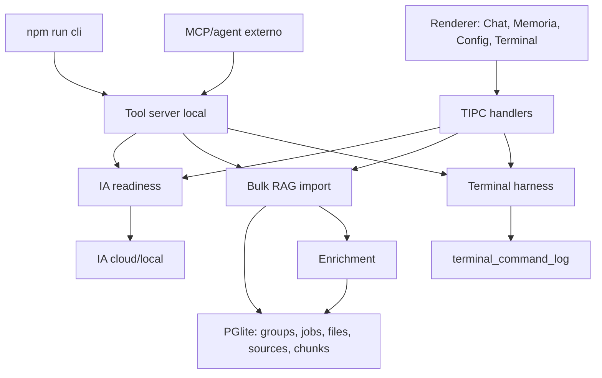

# IA, RAG, CLI e Terminal — Fluxo Operacional

Este documento descreve o fluxo vivo do EscalaFlow para IA local/cloud, RAG em massa,
enrichment, CLI e Terminal Harness.

Ele existe para evitar um erro especifico: declarar sucesso porque a tela abriu,
sem provar que a IA respondeu, que o RAG importou, que o enrichment gravou no
banco ou que o terminal executou de verdade.

## Componentes



| Camada | Arquivos | Papel |
|--------|----------|-------|
| IA config | `src/main/ia/config.ts` | provider/modelo/token |
| Readiness | `src/main/ia/readiness.ts` | decide se chat/CLI pode rodar |
| IA local | `src/main/ia/local-llm.ts` | catalogo, download, status, validacao |
| Runtime local | `src/main/ia/llama-server-runtime.ts` | sidecar `llama-server` para Gemma 4 |
| Tools | `src/main/ia/tools.ts` | 30 handlers internos |
| Familias | `src/main/ia/tool-families.ts` | 3 tools publicas do LLM |
| RAG bulk | `src/main/knowledge/bulk-import.ts` | scan/importacao em massa |
| RAG jobs | `src/main/knowledge/bulk-persistence.ts` | grupos, runs, arquivos |
| Enrichment config | `src/main/knowledge/enrichment-config.ts` | modelo/provider do enrichment |
| Enrichment | `src/main/knowledge/enrichment.ts` | resumo/tags/graph + re-embedding |
| Terminal | `src/main/terminal/harness.ts` | exec/read/write/open-cli + auditoria |
| Terminal sessions | `src/main/terminal/sessions.ts` | shell vivo na UI |
| CLI | `src/cli/index.ts` | cliente HTTP para app aberto |
| Tool server | `src/main/tool-server.ts` | HTTP local `127.0.0.1:17380` |

## IA local

Modelo local padrao:

| Campo | Valor |
|-------|-------|
| ID | `gemma-4-e2b-it-q4` |
| Label | Gemma 4 E2B IT |
| Arquivo | `gemma-4-E2B-it-Q4_K_M.gguf` |
| Tamanho esperado | ~3.11 GB |
| RAM minima | 4GB+ |
| Uso | chat, tools e enrichment |

O EscalaFlow usa `llama-server` recente para Gemma 4, porque o `node-llama-cpp`
instalado ainda nao carrega arquitetura `gemma4`.

Ordem de descoberta do binario:

1. `ESCALAFLOW_LLAMA_SERVER_BIN`
2. `~/Library/Application Support/EscalaFlow/runtimes/llama.cpp/<platform>-<arch>/llama-server`
3. `runtimes/llama.cpp/<platform>-<arch>/llama-server`
4. `tmp/llama-gemma4-build/bin/llama-server`
5. `process.resourcesPath/llama.cpp/...` no app empacotado

Parametros atuais:

- host: `127.0.0.1`
- porta: livre, escolhida em runtime
- contexto: `8192`
- flags: `--jinja --reasoning off`
- chat endpoint: `/v1/chat/completions`

## Readiness

`baixado` nao significa `pronto`. O gate de chat fica em `ia/readiness.ts`.

| Reason | Pode conversar? | Mensagem esperada |
|--------|-----------------|-------------------|
| `configure_provider` | nao | configurar provider |
| `configure_cloud_token` | nao | informar API key/token |
| `download_local_model` | nao | baixar modelo local |
| `validate_local_model` | nao | testar conexao antes de usar |
| `local_model_error` | nao | remover/baixar novamente ou trocar provider |
| `ready` | sim | provider/modelo pronto |

O CLI e o chat app devem passar por readiness antes de aceitar mensagem. O
`/health` tambem expõe esse estado para scripts e smoke tests.

## RAG bulk import

### UI

O modal de conhecimento aceita importacao de arquivo/pasta. Para massa:

1. Usuario escolhe pasta ou arquivo.
2. Usuario informa apenas o nome do grupo.
3. EscalaFlow cria `knowledge_groups`.
4. EscalaFlow cria `knowledge_import_jobs`.
5. Cada arquivo vira linha em `knowledge_import_files`.
6. Cada arquivo valido passa por ingestao e cria `knowledge_sources` +
   `knowledge_chunks`.
7. O job mostra progresso, pausa, retomada e cancelamento.

### CLI

```bash
npm run cli -- rag import ~/Documents/minha-pasta --group "Meu Grupo" --wait
```

Com enrichment forcado:

```bash
npm run cli -- rag import ~/Documents/minha-pasta --group "Meu Grupo" --enrich --wait
```

Inspecionar jobs:

```bash
npm run cli -- rag jobs
npm run cli -- rag job <id>
npm run cli -- rag pause <id>
npm run cli -- rag resume <id>
npm run cli -- rag cancel <id>
```

## Enrichment

Config global:

| Campo | Default | Significado |
|-------|---------|-------------|
| `auto_enrich_after_import` | `false` | se import dispara enrichment automaticamente |
| `provider` | `auto` | `auto`, `local`, `gemini`, `openrouter` |
| `modelo` | `auto` | modelo especifico ou auto |
| `force_all_default` | `false` | reprocessar chunks ja enriquecidos |

Resolucao `auto`:

1. Prefere modelo local disponivel e validado.
2. Se local nao estiver disponivel, usa provider cloud ativo com chave.
3. Se provider ativo nao servir, usa qualquer cloud configurado.
4. Se nada estiver disponivel, nao roda.

Comando manual:

```bash
npm run cli -- rag enrich --group <id> --provider local --model gemma-4-e2b-it-q4 --force-all
```

Resultado esperado:

```json
{
  "status": "ok",
  "result": {
    "chunks_enriquecidos": 1,
    "entities_count": 3,
    "relations_count": 2,
    "batches_processados": 1,
    "batches_failed": 0,
    "provider": "local",
    "modelo": "gemma-4-e2b-it-q4"
  }
}
```

Prova no banco:

```sql
SELECT id, source_id, enriched_at, enrichment_json
FROM knowledge_chunks
WHERE source_id = $1
ORDER BY id;
```

O enrichment so conta como feito se `enriched_at` e `enrichment_json` foram
gravados, e se a busca encontra o conteudo importado.

## CLI

O CLI exige app aberto porque fala com o tool-server HTTP local.

Health:

```bash
curl -s http://127.0.0.1:17380/health
```

Chat:

```bash
npm run cli -- chat "Me conta uma piada de padeiro."
```

Tool direta:

```bash
npm run cli -- tool consultar --json '{"entidade":"setores","limite":5}'
```

RAG:

```bash
npm run cli -- search "termo unico"
```

Terminal:

```bash
npm run cli -- terminal exec --wait --cwd "$HOME" pwd
npm run cli -- terminal read ~/arquivo.txt
printf 'conteudo' | npm run cli -- terminal write ~/arquivo.txt --stdin
```

## Terminal Harness

Existem tres conceitos separados:

| Conceito | O que e |
|----------|---------|
| `terminal_exec` | comando shell pontual, auditado |
| Terminal session | shell local vivo na UI |
| `open-cli` | abre o CLI oficial no Terminal do sistema |

`terminal_exec` roda com as permissoes do usuario local. Ele aplica:

- `cwd`
- timeout maximo
- limite de saida
- captura de stdout/stderr
- auditoria em `terminal_command_log`

Campos de auditoria:

- `source`
- `command`
- `cwd`
- `status`
- `exit_code`
- `timed_out`
- `output_preview`
- `started_at`
- `finished_at`

Quando o LLM usa terminal, `source` deve ser `ia_tool`.

## Terminal nao e chat

A pagina Terminal embutida e shell (`zsh` no macOS), nao chat. Se o usuario
digita `e ai mano` num shell, o shell tenta executar comando. A UI deve deixar
isso explicito e direcionar conversa para `Abrir chat CLI`.

Abrir chat no Terminal:

```bash
npm run cli -- terminal open-cli --command 'npm run cli -- chat --attach'
```

Capturar uma chamada fechada:

```bash
npm run cli -- terminal open-cli \
  --cwd /Users/marcoantonio/escalaflow-cli-core-api \
  --command 'npm run cli -- chat "Me conta uma piada de padeiro." | tee /tmp/escalaflow-terminal-padeiro.txt'
```

## Prova real obrigatoria

Fluxos de IA/RAG/CLI/Terminal nao podem ser validados so com screenshot ou E2E
que abre pagina.

| Fluxo | Prova minima |
|-------|--------------|
| IA chat | mensagem enviada + resposta literal |
| RAG import | job `done` + source/chunks + busca por token unico |
| Enrichment | provider/modelo + contadores + `enriched_at`/`enrichment_json` |
| Terminal tool | linha em `terminal_command_log` + efeito no disco/saida |
| Terminal CLI | `opened: true` + resposta capturada do Terminal |

Exemplo de resposta que deve ser copiada no log:

```text
Mensagem enviada:
Me conta uma piada de padeiro.

Resposta recebida:
Claro! Aqui está uma piada de padeiro:
Por que o padeiro foi ao médico?
... Porque ele estava com fermento!
```

## Comandos de validacao

Antes de declarar pronto:

```bash
npm run typecheck
npm run test
npm run build
npm run test:e2e
```

Se `npm run test` falhar por app dev ocupando `127.0.0.1:17380`, pare o app,
confirme a porta livre e rode de novo. Nao conte a primeira falha como verde.

```bash
lsof -nP -iTCP:17380 -sTCP:LISTEN || true
```

## Warlog local

O incidente que originou este contrato pode ter warlog local em
`docs/superpowers/warlogs/`, mas essa pasta e ignorada para novos artefatos de
agente. A fonte versionada e este documento.
