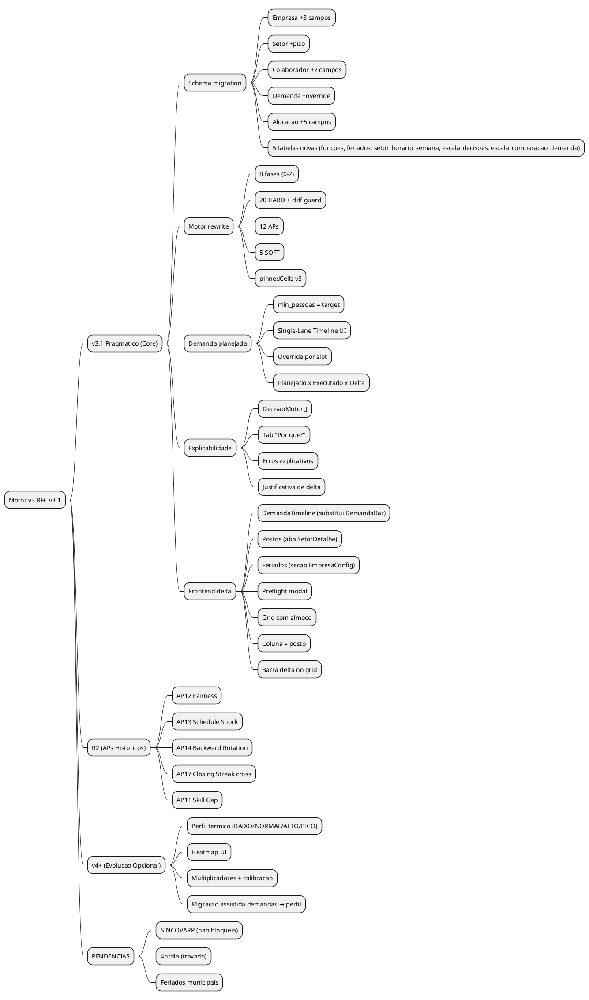

# MOTOR v3 — RFC CANONICO

> **Status:** APROVADO para implementacao
> **Data:** 2026-02-18
> **Versao:** 3.1 (patch pragmatico — demanda simplificada, sem perfil termico no R1)
> **Principio:** O SISTEMA propoe. O RH aprova. Ninguem monta na mao.

> **ESTE E O UNICO DOCUMENTO DE REFERENCIA PARA IMPLEMENTACAO.**
> Os documentos abaixo sao APENDICES CONGELADOS (pesquisa historica):
> - `MOTOR_V3_SPEC.md` — Detalhes das 20 regras HARD e modelo de dados
> - `MOTOR_V3_ENTRADAS_UI.md` — Mapa de entradas, camadas e UX
> - `MOTOR_V3_ANTIPATTERNS.md` — 17 antipatterns com exemplos e fontes
> - `MOTOR_V3_DEMANDA_INTELIGENTE.md` — Analise do problema de demanda
> - `MOTOR_V3_CALENDARIO_CICLO_SOLICITACOES.md` — Calendario operacional, ciclo rolling e solicitacoes

---

## TL;DR

Motor v3 e um constraint solver com 42 regras de qualidade, demanda planejada simplificada
(RH define target por slot via single-lane timeline), piso operacional hard, e explicabilidade nativa.
Saida compara Planejado x Executado x Delta com justificativa obrigatoria.
Implementado em v3.1 pragmatico (core) e v4+ (evolucao opcional com perfil termico avancado).

---

## 1. DECISOES TRAVADAS

Estas decisoes foram debatidas e FECHADAS. Nao reabrir sem razao forte.

| # | Decisao | Resolucao | Razao |
|---|---------|-----------|-------|
| D1 | Fonte de verdade | **Este RFC** e canonico. Demais docs sao apendices. | Evitar ambiguidade entre docs |
| D2 | Contrato de demanda | **Demanda planejada simplificada** — `demandas` e a base do v3.1. `min_pessoas` = target planejado. Perfil termico (`BAIXO/NORMAL/ALTO/PICO`) → v4+ opcional. | Input simples pro RH, motor decide |
| D3 | Funcao objetivo | **Cadeia de 5 niveis** (secao 2) | Sem ambiguidade de prioridade |
| D4 | Pontos legais pendentes | **CLT padrao como DEFAULT**, flag `fonte` pra trocar quando confirmar CCT | Nao bloqueia implementacao |
| D5 | Demanda UI | **Single-Lane Segmented Timeline** — uma trilha por dia, sem sobreposicao, sem empilhamento. Grid snap 30min. Dados diretos na tabela `demandas`. | Visual intuitivo, zero migracao |
| D6 | Schema de demanda | **Sem migracao obrigatoria no v3.1** — `demandas` e a tabela primaria, nao "legado deprecado". Campo `min_pessoas` = target planejado. | Simplicidade, usar o que ja existe |
| D7 | APs por release | **v3.1: 12 APs** (dados disponiveis) / **R2: 5 APs** (precisam historico) | Evitar over-engineering |
| D8 | Explicabilidade | **DecisaoMotor[]** no retorno + **Planejado x Executado x Delta** obrigatorio | RH precisa saber POR QUE |
| D9 | Performance | **Timing por fase**, benchmark com dados reais, timeout 30s | Sem promessa sem evidencia |
| D10 | Minimo por dia | **4h (240min)** — decisao de produto, nao CLT | Abaixo nao justifica deslocamento |
| D11 | Override por slot | **Sim, modo avancado.** Campo `override` na demanda. Quasi-hard, nao bloqueia CLT. EXCECAO, nao regra. | Flexibilidade sem sacrificar simplicidade |

---

## 2. CADEIA DE PRECEDENCIA

Quando duas regras conflitam, a de NIVEL MAIS ALTO vence. Sem excecao.

```
NIVEL 1 — HARD LEGAL (H1-H20)
│  Violacao = escala invalida. Motor nao gera.
│  Fundamento: CLT, TST, CCT, leis federais.
│
├─ NIVEL 2 — PISO OPERACIONAL
│  │  Violacao = abaixo do minimo estrutural do setor.
│  │  Campo: setor.piso_operacional (hard).
│  │  Exemplo: Acougue precisa de min 1 pessoa pra funcionar.
│  │
│  ├─ NIVEL 3 — DEMANDA PLANEJADA (target soft)
│  │  │  RH definiu quantas pessoas quer por slot (single-lane timeline).
│  │  │  Motor tenta atingir o target. Se nao der: explica o delta.
│  │  │  Tabela: demandas.min_pessoas = pessoas_planejadas.
│  │  │
│  │  ├─ NIVEL 4 — ANTIPATTERNS / QUALIDADE
│  │  │  │  Tier 1: 6 APs graves (aviso pro RH se nao evitou).
│  │  │  │  Tier 2: APs moderados (otimizacao silenciosa).
│  │  │  │
│  │  │  └─ NIVEL 5 — SOFT (preferencias)
│  │  │     S1-S5. Bonus/penalidade leve.
│  │  │     Se nao der, ninguem morre.
```

**Regra de conflito:** Se satisfazer nivel N impede satisfazer nivel N+1, nivel N vence.
Exemplo: Se reduzir de 4 para 3 evita clopening (nivel 4), mas nao existe conflito HARD/PISO,
o motor MANTEM 4 (nivel 3) e registra warning de qualidade.

**Ferramentas de ajuste manual (operam DENTRO da hierarquia):**

- **pinnedCells:** RH fixa celula apos geracao. Motor respeita, exceto se viola HARD ou PISO
  (pin rejeitado com aviso). Ver secao 6.1.
- **Override por slot:** RH marca demanda com `override = true`. Motor trata como quasi-hard (acima de demanda normal, abaixo de piso). Ver secao 3.5.

---

## 3. MODELO DE DADOS v3

### 3.1 Entidades e campos novos

```
ENTIDADES EXISTENTES (com campos novos):
├── Empresa
│   ├── ... (mantem tudo)
│   ├── min_intervalo_almoco_min: INTEGER (NOVO — default 60)
│   ├── usa_cct_intervalo_reduzido: BOOLEAN (NOVO — default true)
│   └── grid_minutos: INTEGER (NOVO — default 30, fixo)
│
├── Setor
│   ├── ... (mantem tudo)
│   └── piso_operacional: INTEGER (NOVO — default 1)
│
├── Colaborador
│   ├── ... (mantem tudo)
│   ├── tipo_trabalhador: 'CLT' | 'ESTAGIARIO' | 'APRENDIZ' (NOVO)
│   └── funcao_id: INTEGER | null (NOVO — FK pra funcoes)
│
├── Demanda (tabela existente, semantica atualizada)
│   ├── ... (mantem campos atuais: setor_id, dia_semana, hora_inicio, hora_fim, min_pessoas)
│   ├── min_pessoas → semantica v3.1: pessoas_planejadas (TARGET, nao minimum)
│   └── override: BOOLEAN (NOVO — default false. Se true: quasi-hard.)
│
└── Alocacao
    ├── ... (mantem tudo)
    ├── hora_almoco_inicio: TEXT | null (NOVO)
    ├── hora_almoco_fim: TEXT | null (NOVO)
    ├── minutos_almoco: INTEGER | null (NOVO)
    ├── intervalo_15min: BOOLEAN (NOVO)
    ├── funcao_id: INTEGER | null (NOVO)
    └── minutos renomeado → minutos_trabalho

ENTIDADES NOVAS:
├── Funcao (postos)
│   ├── id, setor_id, apelido, tipo_contrato_id, ativo, ordem
│
└── Feriado
    ├── id, data, nome, tipo, proibido_trabalhar, cct_autoriza
```

### 3.2 Contrato de demanda (v3.1 pragmatico)

```
TABELA demandas (BASE DO v3.1):
  id, setor_id, dia_semana, hora_inicio, hora_fim, min_pessoas, override

  Semantica v3.1:
    min_pessoas = pessoas_planejadas (target).
    NAO e hard block de escala. NAO e "minimo obrigatorio".
    E o que o RH QUER. Motor TENTA. Se nao conseguir: justifica delta.

  Override (campo novo):
    override = false → target soft (nivel 3 na cadeia)
    override = true  → quasi-hard (motor tenta com prioridade maxima,
                        acima de APs, abaixo de piso/HARD)

CAMPO setor.piso_operacional (NOVO — hard):
  Minimo de pessoas em qualquer horario aberto.
  Exemplo: Acougue = 1, Caixa = 2.
  Muda RARO. E estrutural.

PRECEDENCIA DO MOTOR:
  0. Dia inativo em setor_horario_semana? → sem slots (setor fechado no dia)
  1. Tem demanda pro setor? → Usa min_pessoas como target
  2. Slot dentro da janela sem demanda? → Usa piso_operacional como fallback
  3. Nem demanda nem piso? → Distribuicao uniforme (1 pessoa)

EVOLUCAO v4+ (opcional, NAO bloqueia v3.1):
  Perfil termico avancado (BAIXO/NORMAL/ALTO/PICO)
  com multiplicadores e calibracao automatica.
  Se implementado, convive com demandas como camada de refinamento.
```

### 3.3 Demanda como target (Planejado x Executado)

```
CONCEITO CENTRAL DO v3.1:
  RH informa PLANEJADO (demandas.min_pessoas).
  Motor produz EXECUTADO (alocacoes reais por slot).
  Output compara os dois e justifica toda DIFERENCA.

FLUXO:
  1. RH edita demanda no Single-Lane Timeline (secao 11)
  2. Motor le min_pessoas como target pra cada slot de 30min
  3. Motor aloca respeitando HARD > PISO > TARGET > AP > SOFT
  4. Se target nao atingido: registra delta + justificativa

EXEMPLO:
  - Planejado: 4 pessoas no slot 11:00-13:00 (sabado)
  - Executado: 3 pessoas
  - Delta: -1
  - Justificativa: "reduzido de 4 para 3 pra evitar clopening
    (Jessica trabalharia <11h descanso) e respeitar interjornada"

  - Planejado: 2 pessoas no slot 15:00-17:00
  - Executado: 2 pessoas
  - Delta: 0
  - Justificativa: (vazio — target atingido)
```

### 3.4 Logica de intervalos (arvore de decisao)

O motor usa esta arvore pra decidir intervalo de CADA alocacao:

```
SE minutos_trabalho > 360 (> 6h):
  → Almoco OBRIGATORIO
  → Duracao: min = empresa.min_intervalo_almoco_min (30 ou 60), max = 120min
  → Posicao: entre os 2 blocos de trabalho (nunca 1a/ultima hora, H20)
  → Min 2h de trabalho ANTES e 2h DEPOIS do almoco (TST consolidado)
  → Horarios em grid de 30min
  → Funcionario SAI do local (almoco e tempo livre)
  → NAO conta como hora trabalhada (Art. 71 ss2)

SE minutos_trabalho > 240 E <= 360 (> 4h e <= 6h):
  → Intervalo de 15min OBRIGATORIO (Art. 71 ss1 CLT)
  → NAO conta como hora trabalhada (Art. 71 ss2)
  → Funcionario NAO sai do local (pausa no posto)
  → Alocacao tem 1 bloco continuo (hora_inicio → hora_fim)
  → Flag: intervalo_15min = true
  → SEM almoco formal (hora_almoco = null)

SE minutos_trabalho <= 240 (<= 4h):
  → SEM intervalo nenhum (Art. 71 ss1, contrario)
  → Bloco continuo puro
  → intervalo_15min = false, almoco = null
```

**ATENCAO — Sumula 437 IV TST (efeito cliff):**
Se o funcionario habitualmente trabalha 1 MINUTO alem de 6h, ACIONA o almoco completo.
O limiar de 6h e um CORTE DURO: 6h00 = intervalo 15min. 6h01 = almoco 30/60min.
O motor NUNCA deve gerar jornada entre 6h01 e 6h29 — ou e 6h (com 15min) ou 6h30+ (com almoco).
Com grid de 30min isso ja e naturalmente respeitado (6h00 ou 6h30, nunca 6h10).

**Exemplos concretos:**

| Tipo de dia | hora_inicio | almoco_ini | almoco_fim | hora_fim | trab. | alm. | perm. | int.15min |
|---|---|---|---|---|---|---|---|---|
| Normal 8h | 08:00 | 12:00 | 13:00 | 17:00 | 480 | 60 | 540 | false |
| Normal 8h (CCT 30min) | 08:00 | 12:00 | 12:30 | 16:30 | 480 | 30 | 510 | false |
| Dia 6h (15min obrig.) | 08:00 | null | null | 14:00 | 360 | 0 | 360 | true |
| Dia 5h (15min obrig.) | 08:00 | null | null | 13:00 | 300 | 0 | 300 | true |
| Dia curto 4h (sab) | 08:00 | null | null | 12:00 | 240 | 0 | 240 | false |
| Dia longo 9h | 07:00 | 12:00 | 13:00 | 17:00 | 540 | 60 | 600 | false |
| FOLGA | null | null | null | null | null | null | null | false |

**Posicionamento do almoco (Fase 5):**

```
GERAR CANDIDATOS de posicao do almoco (grid 30min):
  1. hora_almoco_inicio >= hora_inicio + 120min (min 2h antes)
  2. hora_almoco_inicio <= hora_fim - almoco_duracao - 120min (min 2h depois)
  3. Exemplo: turno 08:00-17:00, almoco 1h → almoco entre 10:00 e 14:00

SCORING:
  - Preferir meio da jornada (natural)
  - Maximizar cobertura: se slot 12:00-14:00 precisa gente,
    alocar almoco ANTES (11:00-11:30 CCT) ou DEPOIS (14:00-15:00)
  - Escalonar: max 50% do setor almocando simultaneamente (AP3)
```

### 3.5 Override por slot (modo avancado)

```
Pra RH que PRECISA de controle num slot especifico:

"No sabado de 11 as 13, EU QUERO 4 pessoas. Nao discuta."

Como funciona no v3.1:
  - RH marca o segmento com override = true (toggle na timeline)
  - Motor trata como quasi-hard (entre piso e AP na cadeia)
  - Tenta satisfazer com prioridade maxima
  - Se nao conseguir sem violar CLT → avisa com justificativa no delta
  - Mas nao bloqueia (diferente de HARD que impede geracao)

Override e a EXCECAO, nao a regra.
A maioria dos segmentos usa o target normal.

Schema (v3.1):
  Campo na demandas:
    override: BOOLEAN DEFAULT 0
  Se false → motor trata min_pessoas como target soft (nivel 3)
  Se true → motor trata como quasi-hard (acima de APs)
```

---

## 4. REGRAS HARD (H1-H20)

| # | Regra | Descricao curta | Fundamento |
|---|-------|-----------------|------------|
| H1 | MAX_DIAS_CONSECUTIVOS | Max 6 dias seguidos | Art. 67 CLT + OJ 410 TST |
| H2 | DESCANSO_ENTRE_JORNADAS | Min 11h entre jornadas | Art. 66 CLT (inegociavel) |
| H2b | DSR_INTERJORNADA | Min 35h quando DSR | Sumula 110 TST |
| H3 | RODIZIO_DOMINGO_MULHER | Mulher: max 1 dom consecutivo | CLT Art. 386 |
| H3b | RODIZIO_DOMINGO_HOMEM | Homem: max 2 dom consecutivos | Lei 10.101/2000 |
| H4 | MAX_JORNADA_DIARIA | Max contrato.max_minutos_dia | Art. 58 + 59 CLT |
| H5 | EXCECOES_RESPEITADAS | Ferias/atestado = indisponivel | CLT |
| H6 | ALMOCO_OBRIGATORIO | >6h → almoco 30-120min (ver cliff) | Art. 71 CLT + CCT |
| H7 | INTERVALO_CURTO | >4h e <=6h → 15min | Art. 71 ss1 CLT |
| H7b | SEM_INTERVALO_4H | <=4h → sem intervalo | Art. 71 ss1 (contrario) |
| H8 | GRID_HORARIOS | Multiplos de 30min | Produto |
| H9 | MAX_SAIDA_VOLTA | Max 2 blocos trabalho/dia | Art. 71 CLT |
| H10 | META_SEMANAL | Soma semanal +-tolerancia | Art. 58 CLT |
| H11 | APRENDIZ_DOMINGO | Aprendiz nunca domingo | Art. 432 CLT |
| H12 | APRENDIZ_FERIADO | Aprendiz nunca feriado | Art. 432 CLT |
| H13 | APRENDIZ_NOTURNO | Aprendiz nunca 22h-5h | Art. 404 CLT |
| H14 | APRENDIZ_HORA_EXTRA | Aprendiz nunca HE | Art. 432 CLT |
| H15 | ESTAGIARIO_JORNADA | Max 6h/dia 30h/sem | Lei 11.788 Art. 10 |
| H16 | ESTAGIARIO_HORA_EXTRA | Estagiario nunca HE | Lei 11.788 |
| H17 | FERIADO_PROIBIDO | 25/12 e 01/01 proibidos | CCT FecomercioSP |
| H18 | FERIADO_SEM_CCT | Feriado sem CCT proibido | Portaria MTE 3.665 |
| H19 | FOLGA_COMP_DOM | Folga dom dentro de 7 dias | Lei 605/1949 |
| H20 | ALMOCO_POSICAO | Almoco nunca 1a/ultima hora | TST 5a Turma |

**Nota H6 — Cliff da Sumula 437:** Motor NUNCA gera jornada entre 361min e 389min (6h01-6h29). Com grid 30min = impossivel (360 ou 390). Guard no codigo mesmo assim.

**Nota H10 — META_SEMANAL:**
- Colab disponivel a semana inteira: DEVE fechar meta +/- tolerancia
- Com excecao (ferias, atestado): meta proporcional aos dias disponiveis
- Semanas parciais (inicio/fim do periodo): meta proporcional

---

## 5. ANTIPATTERNS — CLASSIFICACAO POR RELEASE

### v3.1: 12 APs implementaveis com dados existentes

| Tier | ID | Nome | Peso | Dado necessario | Disponivel? |
|------|-----|------|------|-----------------|-------------|
| 1 | AP1 | Clopening | -15 | hora_fim + hora_inicio dia seguinte | SIM (alocacoes) |
| 1 | AP3 | Lunch Collision | -20 | horarios almoco | SIM (alocacoes v3) |
| 1 | AP4 | Workload Imbalance | -8/h | horas semanais | SIM (contrato) |
| 1 | AP7 | Weekend Starvation | -8 | dias trabalhados + folgas | SIM (alocacoes) |
| 1 | AP15 | Peak Day Clustering | -6 | dia_semana + demanda planejada | SIM (demandas) |
| 1 | AP16 | Unsupervised Junior | -12 | rank do colaborador | SIM (campo rank) |
| 2 | AP2 | Schedule Instability | -10/-5 | hora_inicio por dia | SIM (alocacoes) |
| 2 | AP5 | Isolated Day Off | -5 | padrao de folgas | SIM (alocacoes) |
| 2 | AP6 | Shift Inequity | -3 | aberturas/fechamentos | SIM (hora_abertura setor) |
| 2 | AP8 | Meal Time Deviation | -3/-8 | hora_almoco | SIM (alocacoes v3) |
| 2 | AP9 | Commute-to-Work Ratio | -2 | duracao do dia | SIM (alocacoes) |
| 2 | AP10 | Overstaffing Cost | -3/exc | alocados vs demanda | SIM (demandas) |

### R2: 5 APs que precisam de dados historicos ou campos novos

| Tier | ID | Nome | Peso | Dado necessario | O que falta |
|------|-----|------|------|-----------------|-------------|
| 2 | AP18 | Holiday Overload | -4 | feriados modelados | Tabela feriados (vem no v3.1 schema, AP implementa R2) |
| 2 | AP12 | Fairness Drift | -4 | historico multi-semana cumulativo | Funcao de indice cumulativo + storage |
| 2 | AP13 | Schedule Shock | -6 | escala semana anterior | Lookup da escala anterior |
| 2 | AP14 | Backward Rotation | -3 | hora_inicio semana atual vs anterior | Lookup da escala anterior |
| 2 | AP17 | Closing Streak | -4 | fechamentos consecutivos cross-semana | Lookup parcial (dentro da semana = v3.1) |
| F | AP11 | Skill Coverage Gap | -5 | distribuicao geral de rank | Pode ir no R2 ou manter futuro |

**NOTA sobre AP17:** Dentro de 1 semana detecta no v3.1. Cross-semana (seg fecha + dom anterior fechou) precisa de lookup = R2.

### Totais por release

```
v3.1: 20 HARD + 12 APs (6 Tier 1 + 6 Tier 2) + 5 SOFT = 37 regras
R2:   +5 APs (4 Tier 2 + 1 Futuro) = 42 regras
```

---

## 6. FASES DO MOTOR v3

```
FASE 0 — PREFLIGHT
  Valida se e possivel gerar.
  Checks: setor ativo, colabs existem, capacidade >= demanda total,
          feriados marcados, tipos especiais validados.
  Se falha → erro explicativo com sugestao (ver secao 7.3).

FASE 1 — MONTAR GRID DE SLOTS
  Gera grid de 30min por DIA, usando janela operacional diaria:
    1) setor_horario_semana[dia].ativo=1  -> usa abertura/fechamento do dia
    2) sem registro per-day               -> fallback setor.hora_abertura/hora_fechamento
    3) setor_horario_semana[dia].ativo=0  -> dia fechado (sem slots)
  Para cada slot: busca demandas.min_pessoas como target planejado.
  Slots dentro da janela sem demanda definida: usa piso_operacional como fallback.
  Slots fora da janela diaria: NAO entram no solver (piso nao incide).
  Slots com override = true: marca como quasi-hard.
  Marca feriados proibidos (H17/H18).

FASE 2 — DISTRIBUIR FOLGAS
  1 folga/semana (CLT 44h) ou 2 (CLT 36h, estagiario).
  Rodizio domingo (H3/H3b). Aprendiz nunca domingo (H11).
  Max 6 consecutivos (H1). Folga compensatoria dom 7 dias (H19).
  Prioriza folga em dia de menor demanda.

FASE 3 — DISTRIBUIR HORAS POR DIA
  Livre: 8h seg, 6h ter, 4h sab...
  Soma = meta +- tolerancia (H10).
  Min 4h/dia (produto). Max contrato.max_minutos_dia (H4).
  >6h → almoco (H6). >4h <=6h → 15min (H7). <=4h → nada (H7b).
  GUARD: nunca gerar 361-389min (cliff Sumula 437).
  Prioriza mais horas em dias de maior demanda.

FASE 4 — ALOCAR HORARIOS
  Grid 30min. Descanso entre jornadas >= 11h (H2).
  DSR + interjornada >= 35h (H2b). Aprendiz fora do noturno (H13).
  Score por candidato: cobertura de slots deficitarios vs demanda planejada.

FASE 5 — POSICIONAR ALMOCO
  Jornada >6h → almoco obrigatorio (H6).
  Min: 30min (CCT) ou 60min (CLT). Max: 120min.
  Nunca 1a/ultima hora (H20). Min 2h antes e 2h depois.
  Escalonar almocos: max 50% simultaneos (AP3).
  Grid 30min.

FASE 6 — VALIDAR
  Roda TODAS H1-H20.
  Se falha → backtrack (troca folga, redistribui horas, troca horario).
  Se esgotou tentativas → erro explicativo (ver secao 7.3).

FASE 7 — PONTUAR E EXPLICAR
  7.1: Tier 1 check (AP1,AP3,AP4,AP7,AP15,AP16). Se score < 60 → reotimiza.
  7.2: Tier 2 check (AP2,AP5,AP6,AP8,AP9,AP10 + R2 quando disponivel).
  7.3: Tier 3 check (S1-S5 preferencias).
  7.4: Gerar DecisaoMotor[] (explicabilidade).
  7.5: Comparacao Planejado x Executado x Delta por slot (ver secao 8.1).

RETORNA: EscalaCompleta com 0 violacoes HARD, score SOFT, decisoes[], comparacao[].
```

### 6.1 pinnedCells no v3

O motor v2 tem conceito de pinnedCells (celulas fixadas pelo usuario no drag-drop).
O v3 MANTEM e EXPANDE:

```
HIERARQUIA DE PINS:

1. Pin viola HARD (ex: pin coloca aprendiz no domingo)?
   → AVISA: "Celula fixada viola regra H11 (aprendiz nunca domingo)."
   → REMOVE o pin automaticamente. HARD sempre vence.

2. Pin viola PISO (ex: pin remove a unica pessoa de um slot)?
   → AVISA: "Celula fixada deixa slot 14:00-14:30 abaixo do piso (0 < 1)."
   → REJEITA o pin. Piso operacional sempre vence.

3. Pin viola AP Tier 1 (ex: pin causa clopening)?
   → AVISA: "Celula fixada causa clopening pra Jose (12h descanso)."
   → MANTEM o pin. Mostra warning amarelo na celula.

4. Pin viola AP Tier 2 ou SOFT?
   → NAO avisa. Penaliza score silenciosamente.

FORMATO DO PIN:
  { colaborador_id, data, hora_inicio?, hora_fim? }
  Se hora_inicio/hora_fim preenchidos → fixa horario especifico.
  Se null → fixa apenas presenca no dia (motor decide horario).
```

---

## 7. INTERFACE MOTOR ← UI

### 7.1 Input — o que o motor RECEBE

```typescript
interface GerarEscalaInput {
  // Contexto
  setor_id: number
  data_inicio: string          // "2026-03-02"
  data_fim: string             // "2026-03-08" (1 semana)

  // O motor busca SOZINHO do DB:
  // - empresa (almoco config, tolerancia, corte_semanal)
  // - setor (hora_abertura, hora_fechamento, piso_operacional)
  // - setor_horario_semana[] (janela diaria + ativo/usa_padrao)
  // - demandas[] do setor (target planejado por slot, com flag override)
  // - colaboradores[] do setor (com tipo_trabalhador, funcao_id, rank)
  // - excecoes[] ativas no periodo
  // - feriados[] no periodo
  // - funcoes[] do setor (postos)
  // - escalas anteriores (pra lookback — rodizio domingo, dias consecutivos)

  // Opcoes
  pinned_cells?: PinnedCell[]  // celulas fixadas pelo RH (ajuste manual)
}
```

**O RH NAO monta esse input.** Ele so clica "Gerar" no setor X pro periodo Y.
O motor busca TUDO que precisa do banco. Zero input manual de regras.

### 7.2 Output — o que o motor RETORNA

```typescript
interface GerarEscalaOutput {
  // Sucesso
  sucesso: boolean

  // Se sucesso = true:
  escala?: EscalaCompletaV3    // ver secao 17

  // Se sucesso = false:
  erro?: {
    tipo: 'PREFLIGHT' | 'CONSTRAINT'
    regra: string               // ex: "H1_MAX_DIAS_CONSECUTIVOS"
    mensagem: string            // linguagem humana, pro RH ler
    sugestoes: string[]         // o que o RH pode fazer
    colaborador_id?: number     // quem ta causando o conflito
    data?: string               // em que dia
  }
}
```

### 7.3 Erros explicativos — formato e exemplos

Quando o motor NAO CONSEGUE gerar, retorna erro UTIL em linguagem RH:

```
PREFLIGHT — antes de tentar gerar:

  "Setor ACOUGUE tem 5 colaboradores mas demanda pede minimo 3 pessoas
   das 15:00-17:00. Com 1 folga/dia, sobram 4. Mas 2 precisam estar
   no turno da manha pra cobrir faixa 08:00-10:00. Sobram 2 pra faixa
   15:00-17:00. Impossivel cobrir 3.
   → Sugestao: adicionar 1 colaborador OU reduzir demanda 15:00-17:00 para 2."

CONSTRAINT — durante a geracao:

  "Colaborador Jessica nao pode trabalhar mais que 6 dias seguidos (H1),
   mas o rodizio de domingo exige que ela trabalhe DOM 08/03 e DOM 15/03
   com apenas 5 dias de intervalo.
   → Sugestao: trocar rodizio de Jessica com Robert nessa semana."

FERIADO:

  "25/12/2026 (Natal) e PROIBIDO trabalhar por CCT.
   Todos os colaboradores foram marcados como INDISPONIVEL nessa data.
   Semana com feriado: meta semanal proporcional (37.7h ao inves de 44h)."

APRENDIZ:

  "Menor aprendiz Carlos esta escalado pra domingo 15/03.
   Aprendizes NAO podem trabalhar domingo (CLT Art. 432).
   → Sugestao: trocar Carlos com colaborador CLT nesse dia."
```

**Na UI:** Modal com mensagem + sugestoes (ver secao 10, EscalaPagina).

### 7.4 Traducao motor → RH (o que APARECE na tela)

O RH nao ve "H6 ALMOCO_OBRIGATORIO". Ele ve linguagem humana:

| Motor retorna | RH ve na tela |
|---|---|
| `violacoes_hard: 0` | Nada (tudo OK, nao mostra) |
| `violacoes_soft: 3` | "3 sugestoes de melhoria" (colapsavel) |
| `erro.tipo = PREFLIGHT` | Modal com mensagem + sugestoes |
| `erro.tipo = CONSTRAINT` | Modal com "nao foi possivel" + o que ajustar |
| `pontuacao: 92` | Badge "Excelente" (verde) |
| `pontuacao: 78` | Badge "Boa" (verde claro) |
| `pontuacao: 65` | Badge "Regular" (amarelo) |
| `pontuacao: 45` | Badge "Ruim" (laranja) |
| `intervalo_15min: true` | Sub-texto na celula: "pausa 15min" |
| `hora_almoco: 12:00-12:30` | Sub-texto: "Alm 12:00-12:30" |
| `funcao_id → apelido` | Coluna principal: "Acougueiro A (Jose Luiz)" |
| antipattern tier 1 detectado | Badge warning + mensagem em linguagem RH |
| antipattern tier 2 detectado | Nao mostra (otimizacao silenciosa) |
| `delta: -1 no slot 11:00-13:00` | Barra: "Planejado: 4 → Executado: 3 (-1)" + justificativa |

### 7.5 Persistencia de explicabilidade (obrigatoria)

Na geracao e no ajuste manual, o sistema persiste snapshot por `escala_id`:
- `escala_decisoes` (razoes do solver)
- `escala_comparacao_demanda` (planejado/executado/delta por slot)

Regra de escrita:
1. abrir transacao
2. inserir/atualizar `escalas` e `alocacoes`
3. apagar snapshot anterior de explicabilidade da escala (se houver)
4. inserir `escala_decisoes` + `escala_comparacao_demanda`
5. commit

Regra de leitura:
- `escalas.buscar` retorna sempre os dados persistidos da escala,
  nunca "recalcula no fetch".

---

## 8. EXPLICABILIDADE — DecisaoMotor + Planejado x Executado x Delta

### 8.1 DecisaoMotor

O motor DEVE explicar por que fez cada escolha significativa.

```typescript
interface DecisaoMotor {
  colaborador_id: number
  colaborador_nome: string
  data: string
  acao: 'ALOCADO' | 'FOLGA' | 'MOVIDO' | 'REMOVIDO'
  razao: string
  // Exemplos:
  // "Alocado 08:00-16:30 para cobrir slot 11:00-13:00 (demanda: 4 pessoas)"
  // "Folga quinta — dia de menor demanda, equilibra carga semanal"
  // "Movido de 07:00 pra 08:00 para evitar clopening (13h descanso)"
  // "Almoco 12:30-13:00 (e nao 12:00) para manter cobertura no slot de maior demanda"
  alternativas_tentadas: number
  // Quantas opcoes o motor avaliou antes de escolher esta
}
```

**Na UI:** Tab "Por que?" na pagina da escala. RH clica numa alocacao e ve a justificativa.

**Granularidade v3.1:** Gerar decisoes apenas para:
- Folgas (por que neste dia?)
- Clopenings evitados (por que mudou o horario?)
- Cobertura reduzida (por que menos gente que o target?)
- Antipatterns tier 1 nao evitados (o que tentou e nao conseguiu?)

**Granularidade R2:** Expandir pra todas as alocacoes.

### 8.2 Planejado x Executado x Delta (OBRIGATORIO no v3.1)

Toda geracao de escala DEVE comparar demanda planejada vs alocacao real.

```typescript
interface SlotComparacao {
  data: string              // "2026-03-07" (sabado)
  hora_inicio: string       // "11:00"
  hora_fim: string          // "13:00"
  planejado: number         // min_pessoas do demandas (target)
  executado: number         // contagem real de alocacoes no slot
  delta: number             // executado - planejado (negativo = abaixo)
  override: boolean         // slot marcado como quasi-hard?
  justificativa?: string    // obrigatorio quando delta != 0
}
```

**Regras de justificativa:**
- `delta == 0` → sem justificativa (target atingido)
- `delta < 0` → OBRIGATORIO justificar (o que impediu?)
- `delta > 0` → opcional (motor redistribuiu capacidade ociosa)

**Exemplos de justificativa:**
- "reduzido de 4 para 3 para evitar clopening e respeitar interjornada"
- "abaixo do planejado por limitacao de capacidade do setor (5 colabs, 1 de ferias)"
- "nao atingido: slot override marcado mas estagiario nao pode cobrir (H15)"

**Na UI:** Barra de comparacao no rodape do grid de escala (ver secao 10).

---

## 9. RELEASES

### v3.1 Pragmatico — Motor v3 Core

**Escopo:** Schema + motor reescrito + demanda planejada simplificada + explicabilidade com delta.

```
BACKEND:
  1.1  Schema migration
       ├── Empresa: +min_intervalo_almoco_min, +usa_cct_intervalo_reduzido, +grid_minutos
       ├── Setor: +piso_operacional
       ├── SetorHorarioSemana: tabela por dia (ativo/abertura/fechamento/usa_padrao)
       ├── Colaborador: +tipo_trabalhador, +funcao_id
       ├── Demanda: +override (BOOLEAN DEFAULT 0)
       ├── Alocacao: +hora_almoco_*, +minutos_almoco, +intervalo_15min, +funcao_id
       │              renomear minutos → minutos_trabalho
       ├── Nova tabela: funcoes
       ├── Nova tabela: feriados (seed nacionais 2026 + gerador por ano)
       ├── Nova tabela: escala_decisoes
       └── Nova tabela: escala_comparacao_demanda

  1.2  constants.ts v3 (CLT object + ANTIPATTERNS object)

  1.3  types.ts v3 (interfaces novas: AlocacaoV3, Funcao, Feriado,
       DecisaoMotor, AntipatternViolacao, SlotComparacao,
       GerarEscalaInput, GerarEscalaOutput)

  1.4  Motor v3 — gerador.ts (rewrite completo)
       ├── Fase 0: Preflight
       ├── Fase 1: Grid (le demandas como target, piso como fallback)
       ├── Fase 2: Folgas
       ├── Fase 3: Horas por dia (com guard cliff 437)
       ├── Fase 4: Horarios
       ├── Fase 5: Almoco (com escalonamento AP3)
       ├── Fase 6: Validacao (20 HARD + pinnedCells)
       └── Fase 7: Pontuacao (12 APs + 5 SOFT + DecisaoMotor + Delta)
           + persistencia atomica de decisoes/comparacao por escala

  1.5  Motor v3 — validador.ts (rewrite — revalidacao apos ajuste manual)

  1.6  Testes: 1 arquivo por regra HARD (h1-h20) + preflight + integracao
       + distribuicao-livre + 12 testes de antipattern + delta

  1.7  Benchmark: performance.now() em cada fase, log de timing

IPC:
  2.1  Handlers: funcoes (CRUD)
  2.2  Handlers: feriados (CRUD + seed)
  2.3  Handlers: setorHorarioSemana (upsert/listar)
  2.4  Atualizar: demandas (add campo override + save transacional por dia)
  2.5  Atualizar: empresaAtualizar (novos campos)
  2.6  Atualizar: colaboradoresCriar/Atualizar (novos campos)
  2.7  Atualizar: escalasGerar (motor v3 + persist explicabilidade)
  2.8  Atualizar: escalasAjustar (validador v3 + regravar explicabilidade)

FRONTEND (ver secao 10 pra detalhes UX):
  3.1  EmpresaConfig: toggle CCT + display almoco + secao feriados
  3.2  ColaboradorLista/Detalhe: tipo_trabalhador + funcao_id (posto)
  3.3  SetorDetalhe: aba Postos (CRUD funcoes)
  3.4  SetorDetalhe: Single-Lane Segmented Timeline (substitui DemandaBar)
  3.5  EscalaPagina: preflight modal + grid com almoco + coluna posto
  3.6  EscalaPagina: Planejado x Executado x Delta (barra comparativa)
  3.7  EscalaPagina: tab "Por que?" (DecisaoMotor basico)
  3.8  EscalasHub: avisos HARD/SOFT separados + resumo almoco
  3.9  Exportacao: HTML/PDF/CSV com posto + almoco + comparacao delta + justificativas
```

### R2 — Motor v3 Advanced

**Escopo:** APs historicos + feriados avancados.

```
BACKEND:
  4.1  AP12 Fairness Drift: funcao de indice cumulativo + storage
  4.2  AP13 Schedule Shock: lookup escala anterior
  4.3  AP14 Backward Rotation: lookup escala anterior
  4.4  AP17 Closing Streak cross-semana: lookup parcial
  4.5  AP11 Skill Coverage Gap (opcional)

FRONTEND:
  5.1  Dashboard de fairness por colaborador
  5.2  Decision log completo (todas alocacoes)
  5.3  Historico de score por setor
```

### v4+ Evolucao Opcional — Perfil Termico Avancado

**Escopo:** Camada de refinamento por cima do v3.1. NAO bloqueia nada.

```
  6.1  Tabela perfil_intensidade (BAIXO/NORMAL/ALTO/PICO)
  6.2  Heatmap UI (grid 2h × 7 dias, com expansao 2h→30min)
  6.3  Multiplicadores de intensidade → headcount
  6.4  Calibracao automatica com dados reais
  6.5  Migracao assistida: demandas → perfil (com confirmacao humana)
  6.6  Convivencia: perfil refina target de demandas, nao substitui
```

---

## 10. MAPA DE UI — DELTA DAS PAGINAS

### 10.1 Paginas NOVAS (2 conceitos, 0 paginas separadas)

#### A) Postos (Funcoes) — ABA dentro de SetorDetalhe

NAO e uma pagina separada. E uma aba dentro de `SetorDetalhe.tsx`.
O RH pensa: "Vou no Acougue → vejo os postos". Contexto e rei.

```
┌──────────────────────────────────────────────────────────┐
│ SETOR: ACOUGUE                                           │
│                                                          │
│ [Dados]  [Demandas]  [>>Postos<<]  [Colaboradores]       │
│                                                          │
│ ┌──────────────────────────────────────────────────────┐ │
│ │ Postos do setor                           [+ Novo]   │ │
│ │                                                      │ │
│ │  ≡ Acougueiro A    CLT 44h    Jose Luiz       [...]  │ │
│ │  ≡ Acougueiro B    CLT 44h    Robert          [...]  │ │
│ │  ≡ Balconista 1    CLT 44h    Jessica         [...]  │ │
│ │  ≡ Balconista 2    CLT 44h    Alex            [...]  │ │
│ │  ≡ Balconista 3    CLT 44h    — (vago) —      [...]  │ │
│ │                                                      │ │
│ │  ≡ = drag pra reordenar                             │ │
│ │  [...] = editar apelido, trocar pessoa, remover      │ │
│ └──────────────────────────────────────────────────────┘ │
└──────────────────────────────────────────────────────────┘
```

**Dialog "Novo Posto":**
- Apelido: texto livre
- Contrato: select (CLT 44h, etc.)
- Pessoa: select com colabs do setor + "Sem posto (reserva)" — opcional

#### B) Feriados — SECAO dentro de EmpresaConfig

Feriados mudam 1x por ano. Nao justifica pagina separada.

```
┌──────────────────────────────────────────────────────────┐
│ FERIADOS 2026                                  [+ Novo]  │
│                                                          │
│  01/01  Confraternizacao Universal   FECHADO  (travado)  │
│  16/02  Carnaval (ponto facultativo) ABERTO              │
│  21/04  Tiradentes                   ABERTO              │
│  01/05  Dia do Trabalho              ABERTO              │
│  ...                                                     │
│  25/12  Natal                        FECHADO  (travado)  │
│                                                          │
│  (travado) = CCT proibe. Nao pode alterar.               │
│  ABERTO = CCT autoriza. RH pode mudar.                   │
└──────────────────────────────────────────────────────────┘
```

Seed automatico ao criar: pre-preencher feriados nacionais do ano.
RH so confirma quais o comercio abre e adiciona municipais se houver.

### 10.2 Paginas MODIFICADAS (4 paginas)

#### A) EmpresaConfig.tsx

Adicionar:
- Toggle CCT intervalo reduzido:
  ```
  [x] Usar regra da Convencao Coletiva (CCT)
      Almoco minimo: 30 minutos
  [ ] Usar regra padrao CLT
      Almoco minimo: 1 hora
  ```
- Secao de feriados (ver acima)
- NAO precisa campo grid_minutos (e hardcoded 30min, nao aparece)

#### B) ColaboradorLista.tsx + ColaboradorDetalhe.tsx

Adicionar no form:
- Campo `tipo_trabalhador`: select (CLT / Estagiario / Aprendiz). Default: CLT
- Campo `funcao_id`: select "Posto" com postos do setor + "Sem posto (reserva)"

Comportamento inteligente:
- Tipo = Estagiario → contrato auto-seleciona "Estagiario 30h"
- Tipo = Aprendiz → idem "Aprendiz 30h"
- Setor muda → lista de postos atualiza

#### C) EscalaPagina.tsx

Mudancas:
1. **Preflight modal** — antes de gerar, mostra viabilidade (ver §7.3)
2. **Grid mostra almoco** — celula tem sub-info "Trab: 8h | Alm: 30min"
3. **Coluna principal = POSTO** — "Acougueiro A (Jose Luiz)" em vez de so "Jose Luiz"
4. **Barra Planejado x Executado x Delta** — rodape do grid por slot
5. **Tab "Por que?"** — DecisaoMotor basico
6. **Erros explicativos** — modal quando motor nao consegue gerar

#### D) EscalasHub.tsx

Mudancas:
- Tab "Avisos" diferencia: 0 HARD (garantido), N SOFT (sugestoes)
- Resumo mostra info de almoco (permanencia vs trabalho)

### 10.3 Paginas INTACTAS (nao precisa mexer)

| Pagina | Por que nao muda |
|---|---|
| Dashboard.tsx | Ja mostra resumo. Dados novos vem do backend. |
| ContratoLista.tsx | Contratos nao mudam. Seed pode add Estagiario/Aprendiz. |
| SetorLista.tsx | Lista de setores nao muda. |
| NaoEncontrado.tsx | 404 e 404. |

---

## 11. SINGLE-LANE SEGMENTED TIMELINE — UX DE DEMANDA

### Conceito

Substitui o antigo DemandaBar por um editor visual de uma trilha por dia.
RH ve diretamente QUANTAS PESSOAS quer em cada trecho do dia.
Sem sobreposicao por construcao. Sem empilhamento. Sem DnD de blocos empilhados.

### Layout

```
┌──────────────────────────────────────────────────────────────┐
│  Acougue — Demanda Planejada                        [Salvar] │
│──────────────────────────────────────────────────────────────│
│  Piso operacional: [1] pessoa  (minimo pra funcionar)       │
│                                                              │
│  Padrao semanal:                                            │
│                                                              │
│  SEG [x] ativo  [x] usa padrao                              │
│  ┌──┬──────────────┬──────────────┬──────────────┬──┐       │
│  │07│     2p       │      3p      │     2p       │18│       │
│  └──┴───────┬──────┴──────┬───────┴──────┬───────┴──┘       │
│        07:00│        11:00│         15:00│        18:00      │
│                                                              │
│  TER [x] ativo  [x] usa padrao                              │
│  ┌──┬──────────────┬──────────────┬──────────────┬──┐       │
│  │07│     2p       │      3p      │     2p       │18│       │
│  └──┴───────┬──────┴──────┬───────┴──────┬───────┴──┘       │
│                                                              │
│  ... (QUA-SEX similar ao padrao)                             │
│                                                              │
│  SAB [x] ativo  [ ] usa padrao  (excecao: 07:00-12:00)      │
│  ┌──┬────────────────────────────┬──┐                       │
│  │07│           3p               │12│                        │
│  └──┴────────────────────────────┴──┘                       │
│                                                              │
│  DOM [ ] inativo                                            │
│                                                              │
│  ┌─────────────────────────────────────────────────────┐     │
│  │ Preview: Com 5 CLT 44h, o motor pode:               │     │
│  │   - Cobrir 100% dos slots de 3p (seg-sex almoco)    │     │
│  │   - Cobrir 95% dos slots de 2p (resto)              │     │
│  │   - Manter piso (1p) em todos os slots              │     │
│  │   - Capacidade: ~220h/sem vs demanda ~180h/sem      │     │
│  └─────────────────────────────────────────────────────┘     │
│                                                              │
│  [Resetar padrao]  [Copiar de outro setor]                   │
└──────────────────────────────────────────────────────────────┘
```

### Interacoes

| Acao | Como | Resultado |
|---|---|---|
| Dividir segmento | Duplo-clique na barra ou botao de divisao | Cria novo divisor no ponto; snap 30min |
| Editar pessoas | Click no numero (ex: "2p") | Popover com stepper `- / +` |
| Mover divisor | Arrastar o separador | Redimensiona segmentos vizinhos; snap 30min |
| Remover segmento | Delete ou botao X | Merge com vizinho (herda min_pessoas do maior) |
| Marcar override | Toggle no popover do segmento | Destaca segmento com borda (quasi-hard) |

### Invariantes (enforced by UI + validated on save)

1. Sem gap — cobertura continua entre abertura/fechamento do setor
2. Sem overlap — segmentos nunca se sobrepoe
3. Dia inativo = timeline fechada (sem segmentos)
4. Todos os horarios em multiplos de 30min
5. Min 1 pessoa por segmento (abaixo = deletar segmento)

### Modelo semanal + excecao por dia

```
PADRAO SEMANAL:
  Editavel. Serve de template pra todos os dias da semana.
  Dados salvos na tabela demandas com dia_semana = 'SEG', 'TER', etc.
  Janela (abertura/fechamento + ativo) salva em setor_horario_semana.

POR DIA:
  Toggle 'Ativo': se OFF, dia fechado (sem timeline).
  Toggle 'Usa padrao': se ON, herda do padrao semanal.
  Se 'Usa padrao' OFF → copy-on-write (clona padrao, edita local).
```

### 11.1 Contrato de save transacional (Single-Lane)

Nao salva segmento isolado com CRUD solto.
O backend recebe o estado inteiro do dia e valida tudo em transacao unica.

```typescript
interface SalvarTimelineDiaInput {
  setor_id: number
  dia_semana: 'SEG' | 'TER' | 'QUA' | 'QUI' | 'SEX' | 'SAB' | 'DOM'
  ativo: boolean
  usa_padrao: boolean
  hora_abertura: string
  hora_fechamento: string
  segmentos: Array<{
    hora_inicio: string
    hora_fim: string
    min_pessoas: number
    override: boolean
  }>
}
```

Validacao server-side obrigatoria (antes de commit):
- segmentos ordenados por hora_inicio
- primeiro segmento comeca em hora_abertura (se ativo)
- ultimo segmento termina em hora_fechamento (se ativo)
- sem gap e sem overlap
- todos horarios em multiplo de 30min
- min_pessoas >= 1

Persistencia em transacao:
1. upsert em `setor_horario_semana` (ativo/abertura/fechamento/usa_padrao)
2. delete demandas antigas do dia
3. insert demandas novas do dia
4. commit

### Preview de capacidade

ESSENCIAL. Sem isso o RH define demanda sem saber se e possivel.
Preview mostra em tempo real:
- "Com N colaboradores de Xh/sem, o motor pode cobrir Y% dos slots."
- "Slots criticos: SAB 11:00-13:00 (3p pedidas, max possivel: 2p)."
Calcula conforme RH edita a timeline.

---

## 12. MIGRACAO

### 12.1 Schema migration (automatica)

```sql
-- Empresa
ALTER TABLE empresa ADD COLUMN min_intervalo_almoco_min INTEGER NOT NULL DEFAULT 60;
ALTER TABLE empresa ADD COLUMN usa_cct_intervalo_reduzido BOOLEAN NOT NULL DEFAULT 1;
ALTER TABLE empresa ADD COLUMN grid_minutos INTEGER NOT NULL DEFAULT 30;

-- Setor
ALTER TABLE setores ADD COLUMN piso_operacional INTEGER NOT NULL DEFAULT 1;

-- Horario semanal por dia (v3.1)
CREATE TABLE IF NOT EXISTS setor_horario_semana (
    id INTEGER PRIMARY KEY AUTOINCREMENT,
    setor_id INTEGER NOT NULL REFERENCES setores(id),
    dia_semana TEXT NOT NULL CHECK (dia_semana IN ('SEG','TER','QUA','QUI','SEX','SAB','DOM')),
    ativo BOOLEAN NOT NULL DEFAULT 1,
    usa_padrao BOOLEAN NOT NULL DEFAULT 1,
    hora_abertura TEXT NOT NULL,
    hora_fechamento TEXT NOT NULL,
    UNIQUE(setor_id, dia_semana)
);

-- Colaborador
ALTER TABLE colaboradores ADD COLUMN tipo_trabalhador TEXT NOT NULL DEFAULT 'CLT'
  CHECK (tipo_trabalhador IN ('CLT', 'ESTAGIARIO', 'APRENDIZ'));
ALTER TABLE colaboradores ADD COLUMN funcao_id INTEGER REFERENCES funcoes(id);

-- Demanda (campo novo)
ALTER TABLE demandas ADD COLUMN override BOOLEAN NOT NULL DEFAULT 0;

-- Alocacao
ALTER TABLE alocacoes ADD COLUMN hora_almoco_inicio TEXT;
ALTER TABLE alocacoes ADD COLUMN hora_almoco_fim TEXT;
ALTER TABLE alocacoes ADD COLUMN minutos_almoco INTEGER;
ALTER TABLE alocacoes ADD COLUMN intervalo_15min BOOLEAN NOT NULL DEFAULT 0;
ALTER TABLE alocacoes ADD COLUMN funcao_id INTEGER REFERENCES funcoes(id);
-- Renomear: ALTER TABLE alocacoes RENAME COLUMN minutos TO minutos_trabalho;
-- (SQLite nao suporta RENAME COLUMN < 3.25 — verificar versao, senao recriar tabela)

-- Novas tabelas
CREATE TABLE IF NOT EXISTS funcoes (
    id INTEGER PRIMARY KEY AUTOINCREMENT,
    setor_id INTEGER NOT NULL REFERENCES setores(id),
    apelido TEXT NOT NULL,
    tipo_contrato_id INTEGER NOT NULL REFERENCES tipos_contrato(id),
    ativo BOOLEAN NOT NULL DEFAULT 1,
    ordem INTEGER NOT NULL DEFAULT 0
);

CREATE TABLE IF NOT EXISTS feriados (
    id INTEGER PRIMARY KEY AUTOINCREMENT,
    data TEXT NOT NULL,
    nome TEXT NOT NULL,
    tipo TEXT NOT NULL CHECK (tipo IN ('NACIONAL', 'ESTADUAL', 'MUNICIPAL')),
    proibido_trabalhar BOOLEAN NOT NULL DEFAULT 0,
    cct_autoriza BOOLEAN NOT NULL DEFAULT 1
);

-- Explicabilidade persistida por escala
CREATE TABLE IF NOT EXISTS escala_decisoes (
    id INTEGER PRIMARY KEY AUTOINCREMENT,
    escala_id INTEGER NOT NULL REFERENCES escalas(id) ON DELETE CASCADE,
    colaborador_id INTEGER,
    data TEXT NOT NULL,
    acao TEXT NOT NULL CHECK (acao IN ('ALOCADO', 'FOLGA', 'MOVIDO', 'REMOVIDO')),
    razao TEXT NOT NULL,
    alternativas_tentadas INTEGER NOT NULL DEFAULT 0
);

CREATE TABLE IF NOT EXISTS escala_comparacao_demanda (
    id INTEGER PRIMARY KEY AUTOINCREMENT,
    escala_id INTEGER NOT NULL REFERENCES escalas(id) ON DELETE CASCADE,
    data TEXT NOT NULL,
    hora_inicio TEXT NOT NULL,
    hora_fim TEXT NOT NULL,
    planejado INTEGER NOT NULL,
    executado INTEGER NOT NULL,
    delta INTEGER NOT NULL,
    override BOOLEAN NOT NULL DEFAULT 0,
    justificativa TEXT
);
```

### 12.2 Seed de feriados

```
Seed deve ser gerado por ano (ano vigente + proximo ano), sem hardcode eterno.
Lista abaixo e EXEMPLO de referencia para 2026:

Feriados nacionais 2026 (pre-preenchidos):
  01/01 Confraternizacao Universal    — FECHADO (CCT proibe)
  16/02 Carnaval (ponto fac.)         — ABERTO (CCT autoriza)
  03/04 Sexta-feira Santa             — ABERTO
  21/04 Tiradentes                    — ABERTO
  01/05 Dia do Trabalho               — ABERTO
  04/06 Corpus Christi                — ABERTO
  07/09 Independencia                 — ABERTO
  12/10 N.S. Aparecida                — ABERTO
  02/11 Finados                       — ABERTO
  15/11 Proclamacao da Republica      — ABERTO
  25/12 Natal                         — FECHADO (CCT proibe)

  01/01 e 25/12: proibido_trabalhar = true, cct_autoriza = false (travados)
  Demais: proibido_trabalhar = false, cct_autoriza = true (editaveis)
```

---

## 13. CALENDARIO, CICLO E SOLICITACOES

Documento de referencia: `docs/MOTOR_V3_CALENDARIO_CICLO_SOLICITACOES.md`

### Alinhamento com o motor v3.1

O doc de calendario define funcionalidades de PRODUTO que convivem com o motor:

| Conceito | O que define | Impacto no motor |
|---|---|---|
| Calendario operacional empresa | Feriados e datas aberta/fechada | Motor le tabela `feriados` (ja no v3.1 schema) |
| Horario semanal do setor | Abertura/fechamento + ativo por dia da semana | Motor usa `setor_horario_semana` (v3.1), com fallback pro horario global do setor |
| Excecao por data no setor | Horario diferente num dia especifico | Evolucao futura (tabela `setor_horario_excecao`) |
| Ciclo rolling (6 semanas) | Janelas de planejamento/congelamento | App-level workflow. Motor gera quando chamado. |
| Ajuste no meio do ciclo | Passado trava, futuro reotimiza | Motor respeita: so gera/revalida dias futuros |
| Solicitacoes | Folga, troca, cobertura, eventos legais | App-level workflow. Viram excecoes ou ajustes manuais antes de chamar motor |
| Cobertura urgente | Ranking de candidatos + revalidacao | Motor revalida com pinnedCells/ajustes |

### O que entra no v3.1 (ja coberto pelo schema acima)

- Tabela `feriados` com seed nacional
- Feriados proibidos (H17/H18 no motor)
- Motor recebe periodo e respeita feriados automaticamente
- Tabela `setor_horario_semana` (ativo + abertura/fechamento por dia)

### O que fica para evolucao futura (nao bloqueia v3.1)

- `setor_horario_excecao` — excecao por data
- `solicitacoes_escala` — fluxo formal de pedidos
- Ciclo rolling com estados (RASCUNHO → PUBLICADA → CONGELADA → EM_EXECUCAO → FECHADA)
- Cobertura urgente com ranking automatico

**Importante:** Nenhum desses itens bloqueia o motor v3.1. O motor gera escalas para qualquer periodo, independente de workflow de ciclo.

---

## 14. PERFORMANCE

### Estrategia

```
1. Timeout de 30s no worker thread (mantem)
2. performance.now() no inicio e fim de CADA fase do motor
3. Log de timing no retorno:
   { fase0_ms, fase1_ms, ..., fase7_ms, total_ms }
4. Primeiro benchmark: dados do seed (5 setores, ~30 colabs)
5. Se alguma fase > 5s → identificar gargalo e otimizar
6. Se total > 30s → heuristicas de poda no backtracking
```

### Expectativa (nao promessa)

```
Setor pequeno (5 colabs, 1 semana): < 5s
Setor medio (15 colabs, 1 semana): < 15s
Setor grande (30 colabs, 1 semana): < 30s (pode precisar otimizacao)
```

**NAO prometer tempos ao usuario ate ter benchmark real.**

---

## 15. PENDENCIAS EXTERNAS

| # | Pendencia | Impacto | Acao |
|---|-----------|---------|------|
| P1 | SINCOVARP: confirmar CCT base inorganizada | Valores de almoco, pisos | Marco liga. Default = CLT padrao |
| P2 | PDF MR066541/2025: pisos salariais interior | Nao impacta motor | Informativo |
| P3 | Camara Municipal: lei de horario comercio | Pode ter feriado municipal | Marco verifica. Motor tem campo `tipo: MUNICIPAL` |
| P4 | Minimo 4h por dia | Decisao de produto, nao CLT | **TRAVADO: 4h no v3.1.** Reavaliar apenas em v3.2+ |

**Nenhuma pendencia bloqueia a implementacao.** Todas tem defaults seguros.

---

## 16. CONSTANTS.TS v3 — REFERENCIA RAPIDA

```typescript
export const CLT = {
  MAX_JORNADA_NORMAL_MIN: 480,
  MAX_JORNADA_COM_EXTRA_MIN: 600,
  MIN_DESCANSO_ENTRE_JORNADAS_MIN: 660,
  DSR_INTERJORNADA_MIN: 2100,
  MAX_DIAS_CONSECUTIVOS: 6,
  ALMOCO_MIN_CLT_MIN: 60,
  ALMOCO_MIN_CCT_MIN: 30,
  ALMOCO_MAX_MIN: 120,
  INTERVALO_CURTO_MIN: 15,
  LIMIAR_ALMOCO_MIN: 360,
  LIMIAR_INTERVALO_CURTO_MIN: 240,
  MIN_JORNADA_DIA_MIN: 240,     // 4h, produto
  MAX_DOMINGOS_CONSECUTIVOS: { M: 2, F: 1 },
  FOLGA_COMPENSATORIA_DOM_DIAS: 7,
  ESTAGIARIO_MAX_JORNADA_MIN: 360,
  ESTAGIARIO_MAX_SEMANAL_MIN: 1800,
  APRENDIZ_MAX_JORNADA_MIN: 360,
  APRENDIZ_MAX_SEMANAL_MIN: 1800,
  APRENDIZ_HORARIO_NOTURNO_INICIO: '22:00',
  APRENDIZ_HORARIO_NOTURNO_FIM: '05:00',
  GRID_MINUTOS: 30,
} as const

export const ANTIPATTERNS = {
  // Tier 1
  CLOPENING_MIN_DESCANSO_CONFORTAVEL_MIN: 780,
  ALMOCO_MAX_SIMULTANEO_PERCENT: 50,
  HORA_EXTRA_MARGEM_REDISTRIBUICAO_MIN: 60,
  MARATONA_PICO_MAX_CONSECUTIVOS: 2,
  JUNIOR_SOZINHO_RANK_MINIMO: 3,
  FIM_SEMANA_MAX_SEMANAS_SEM: 5,

  // Tier 2
  HORARIO_VARIACAO_MAX_IDEAL_MIN: 60,
  HORARIO_VARIACAO_MAX_ACEITAVEL_MIN: 120,
  ALMOCO_HORARIO_IDEAL_INICIO: '11:00',
  ALMOCO_HORARIO_IDEAL_FIM: '13:30',
  DIA_CURTO_MINIMO_PREFERIDO_MIN: 300,
  FAIRNESS_INDICE_MINIMO: 40,
  SCHEDULE_SHOCK_MAX_DIFF_MIN: 120,
  BACKWARD_ROTATION_THRESHOLD_MIN: 60,
  FECHAMENTO_MAX_CONSECUTIVO: 3,

  // Pesos Tier 1
  PESO_CLOPENING: -15,
  PESO_ALMOCO_SIMULTANEO: -20,
  PESO_HORA_EXTRA_EVITAVEL: -8,
  PESO_SEM_FIM_DE_SEMANA: -8,
  PESO_MARATONA_PICO: -6,
  PESO_JUNIOR_SOZINHO: -12,

  // Pesos Tier 2
  PESO_IOIO_GRAVE: -10,
  PESO_IOIO_MODERADO: -5,
  PESO_FOLGA_ISOLADA: -5,
  PESO_TURNOS_INJUSTOS: -3,
  PESO_ALMOCO_FORA_IDEAL: -3,
  PESO_ALMOCO_FORA_ACEITAVEL: -8,
  PESO_DIA_CURTO: -2,
  PESO_HORA_MORTA: -3,
  PESO_FAIRNESS_DRIFT: -4,
  PESO_SCHEDULE_SHOCK: -6,
  PESO_BACKWARD_ROTATION: -3,
  PESO_FECHAMENTO_SEQUENCIA: -4,
} as const

export const FERIADOS_CCT_PROIBIDOS = ['12-25', '01-01'] as const
export const TIPOS_TRABALHADOR = ['CLT', 'ESTAGIARIO', 'APRENDIZ'] as const
```

---

## 17. INTERFACES TYPESCRIPT v3 — REFERENCIA RAPIDA

```typescript
type TipoTrabalhador = 'CLT' | 'ESTAGIARIO' | 'APRENDIZ'
type StatusAlocacao = 'TRABALHO' | 'FOLGA' | 'INDISPONIVEL'

interface Funcao {
  id: number
  setor_id: number
  apelido: string
  tipo_contrato_id: number
  ativo: boolean
  ordem: number
}

interface Feriado {
  id: number
  data: string
  nome: string
  tipo: 'NACIONAL' | 'ESTADUAL' | 'MUNICIPAL'
  proibido_trabalhar: boolean
  cct_autoriza: boolean
}

interface AlocacaoV3 {
  id: number
  escala_id: number
  colaborador_id: number
  funcao_id: number | null
  data: string
  status: StatusAlocacao
  hora_inicio: string | null
  hora_fim: string | null
  minutos_trabalho: number | null
  hora_almoco_inicio: string | null
  hora_almoco_fim: string | null
  minutos_almoco: number | null
  intervalo_15min: boolean
}

interface PinnedCell {
  colaborador_id: number
  data: string
  hora_inicio?: string | null   // null = motor decide horario
  hora_fim?: string | null
}

interface GerarEscalaInput {
  setor_id: number
  data_inicio: string
  data_fim: string
  pinned_cells?: PinnedCell[]
}

interface GerarEscalaOutput {
  sucesso: boolean
  escala?: EscalaCompletaV3
  erro?: {
    tipo: 'PREFLIGHT' | 'CONSTRAINT'
    regra: string
    mensagem: string
    sugestoes: string[]
    colaborador_id?: number
    data?: string
  }
}

interface SlotComparacao {
  data: string
  hora_inicio: string
  hora_fim: string
  planejado: number
  executado: number
  delta: number
  override: boolean
  justificativa?: string
}

interface DecisaoMotor {
  colaborador_id: number
  colaborador_nome: string
  data: string
  acao: 'ALOCADO' | 'FOLGA' | 'MOVIDO' | 'REMOVIDO'
  razao: string
  alternativas_tentadas: number
}

interface AntipatternViolacao {
  tier: 1 | 2 | 3
  antipattern: string
  nome_industria: string
  peso: number
  colaborador_id: number
  data?: string
  semana?: number
  mensagem_rh: string
  sugestao?: string
}

interface EscalaCompletaV3 {
  escala: Escala
  alocacoes: AlocacaoV3[]
  indicadores: Indicadores
  violacoes: Violacao[]
  antipatterns: AntipatternViolacao[]
  decisoes: DecisaoMotor[]
  comparacao_demanda: SlotComparacao[]
  timing?: {
    fase0_ms: number
    fase1_ms: number
    fase2_ms: number
    fase3_ms: number
    fase4_ms: number
    fase5_ms: number
    fase6_ms: number
    fase7_ms: number
    total_ms: number
  }
}
```

---

## 18. SCORE — LABELS PRO RH

| Score | Label | Cor | Significado |
|-------|-------|-----|-------------|
| 90-100 | Excelente | Verde | Escala limpa, sem antipatterns |
| 75-89 | Boa | Verde claro | Alguns trade-offs aceitaveis |
| 60-74 | Regular | Amarelo | Tem antipatterns. Vale revisar. |
| 40-59 | Ruim | Laranja | Antipatterns graves. Revisar obrigatorio. |
| 0-39 | Critica | Vermelho | Muitos problemas. Considerar add pessoal. |

---

## 19. Q&A — DECISOES DE IMPLEMENTACAO

Perguntas que surgiram durante a especificacao e foram RESPONDIDAS.

| # | Pergunta | Resposta | Fonte |
|---|---|---|---|
| 1 | Minimo de horas por dia trabalhado? | **NAO existe na CLT.** Decisao de produto: 4h (240min). | Silencio legislativo |
| 2 | Maximo de almoco? | **2h (120min).** Acima precisa acordo escrito/CCT. | Art. 71 CLT |
| 3 | Almoco sempre >= 2h apos inicio da jornada? | **CLT nao especifica.** Boa pratica: min 2h antes e 2h depois. TST consolidou. | Jurisprudencia |
| 4 | Grid diferente de 30min? | **30min fixo.** Decisao de produto. | Art. 58 ss1 CLT (tolerancia ponto, nao grid) |
| 5 | Se preflight falha, mostra modal com sugestoes? | **Sim** — decisao de produto. | — |
| 6 | Manter campo `minutos` como alias? | **Nao, renomear pra `minutos_trabalho`.** | — |
| 7 | Export mostra horario de almoco? | **Sim, coluna separada** + posto + comparacao delta + justificativa quando houver. | — |
| 8 | Colaborador pode ocupar mais de 1 posto? | **Nao, 1:1** (versao atual). Futuro: cobertura de ferias. | — |
| 9 | Pode existir posto sem ninguem? | **Sim, motor avisa** "Posto X sem colaborador alocado". | — |
| 10 | Escala por POSTO ou por PESSOA? | **Por POSTO** (coluna principal = posto). | — |
| 11 | Colab sem funcao_id pode ser reserva? | **Sim, banco de reservas.** | — |
| 12 | Motor gera por funcao ou vincula antes? | **Gera ja com pessoa.** Funcao e contexto, nao unidade de geracao. | — |
| 13 | Intervalo de 15min pra jornada de 6h? | **OBRIGATORIO.** Art. 71 ss1 CLT. NAO conta como hora. | Art. 71 ss1 CLT |
| 14 | Almoco pode ser reduzido pra 30min? | **SIM, com CCT.** FecomercioSP interior autoriza. | CCT + Art. 611-A, III |
| 15 | Tolerancia semanal existe na CLT? | **NAO.** Ultrapassou 44h = hora extra. Campo e margem operacional. | — |
| 16 | Intervalo almoco conta como hora? | **NAO.** Art. 71 ss2 CLT. | Art. 71 ss2 CLT |
| 17 | Estagiario pode trabalhar domingo? | **Pode,** se consta no TCE. Silencio legislativo. | Silencio legislativo |
| 18 | Menor aprendiz pode trabalhar domingo? | **NUNCA.** CLT Art. 432 + IN MTE 146. | CLT Art. 432 |
| 19 | Feriados a partir de 01/03/2026? | **So com CCT autorizando.** Portaria MTE 3.665/2023. | Portaria 3.665/2023 |
| 20 | 25/12 e 01/01? | **PROIBIDO** trabalhar. CCT FecomercioSP interior. | CCT |
| 21 | Banco de horas tiers? | **3 niveis:** 12 meses (CCT), 6 meses (individual escrito), mesmo mes (tacito). | Art. 59 ss2, ss5, ss6 |
| 22 | Estagiario em periodo de provas? | **Reduz pela METADE** (3h/dia, 15h/sem). Art. 10 ss2 Lei 11.788. | Lei 11.788 Art. 10 ss2 |
| 23 | Almoco na 1a/ultima hora? | **PROIBIDO.** TST 5a Turma: equivale a nao ter almoco. | TST RR-1003698 |
| 24 | Tolerancia de ponto ultrapassa 10min? | **TODO o excesso vira HE** (efeito cliff, nao gradual). CCT nao pode ampliar. | Sumula 366 + 449 TST |
| 25 | DecisaoMotor e comparacao de demanda ficam so em memoria? | **Nao.** Persistir por `escala_id` (snapshot imutavel para auditoria). | Decisao de produto v3.1 |
| 26 | Save da timeline e por faixa individual? | **Nao.** Save transacional por dia, validando invariantes antes de commit. | Decisao de produto v3.1 |

---

## 20. MAPA DE ARQUIVOS — CAMINHOS REAIS

```
ARQUIVOS QUE SERAO REESCRITOS (v3 = rewrite completo):
├── src/main/motor/gerador.ts                    ← Motor v3 (rewrite)
├── src/main/motor/validador.ts                  ← Validador v3 (rewrite)
├── src/main/motor/validacao-compartilhada.ts    ← Regras compartilhadas (rewrite)
└── src/main/motor/test-motor.ts                 ← Expandir pra 25+ testes

ARQUIVOS QUE SERAO MODIFICADOS (add campos/handlers):
├── src/main/db/schema.ts                        ← +5 tabelas, +campos, +override demanda (ver §12.1)
├── src/main/db/seed.ts                          ← +seed feriados (ano vigente + proximo)
├── src/shared/types.ts                          ← +interfaces v3 (ver §17)
├── src/shared/constants.ts                      ← +CLT object +ANTIPATTERNS (ver §16)
├── src/main/tipc.ts                             ← +handlers funcoes, feriados, setorHorarioSemana, demandas transacionais
├── src/main/motor/worker.ts                     ← Atualizar chamada motor v3
│
├── src/renderer/src/paginas/EmpresaConfig.tsx    ← +toggle CCT +feriados
├── src/renderer/src/paginas/ColaboradorLista.tsx ← +tipo_trabalhador
├── src/renderer/src/paginas/ColaboradorDetalhe.tsx ← +tipo_trabalhador +funcao_id
├── src/renderer/src/paginas/SetorDetalhe.tsx     ← +aba Postos +timeline demanda
├── src/renderer/src/paginas/EscalaPagina.tsx     ← +preflight +almoco +posto +delta +tab "Por que?"
├── src/renderer/src/paginas/EscalasHub.tsx       ← +avisos HARD/SOFT separados
├── src/renderer/src/componentes/ExportarEscala.tsx ← +posto +almoco +comparacao delta +justificativas
├── src/renderer/src/lib/gerarCSV.ts              ← +colunas v3 (posto, minutos_trabalho, almoco, delta)
├── src/renderer/src/lib/gerarHTMLFuncionario.ts  ← +campos v3 (posto, almoco, explicabilidade)
│
├── src/renderer/src/componentes/EscalaGrid.tsx   ← +celula com almoco +barra delta
├── src/renderer/src/componentes/DemandaBar.tsx   ← Deprecado em favor de DemandaTimeline
└── src/renderer/src/App.tsx                      ← (provavelmente sem mudanca — sem rota nova)

ARQUIVOS NOVOS (criar):
├── src/main/motor/__tests__/                    ← Diretorio de testes (1 por regra HARD)
│   ├── h1-max-dias-consecutivos.test.ts
│   ├── h2-descanso-entre-jornadas.test.ts
│   ├── ... (h3 a h20)
│   ├── preflight-capacidade.test.ts
│   ├── integracao-escala-completa.test.ts
│   ├── delta-planejado-executado.test.ts
│   └── distribuicao-livre.test.ts
│
├── src/renderer/src/componentes/DemandaTimeline.tsx    ← Single-Lane Segmented Timeline
├── src/renderer/src/componentes/PreflightModal.tsx     ← Novo componente
├── src/renderer/src/componentes/PostosTab.tsx          ← Novo componente (aba em SetorDetalhe)
├── src/renderer/src/componentes/FeriadosSection.tsx    ← Novo componente (secao em EmpresaConfig)
└── src/renderer/src/componentes/DecisaoMotorTab.tsx    ← Novo componente (tab "Por que?")

ARQUIVOS QUE NAO MUDAM:
├── src/main/index.ts                            ← Entry point Electron (sem mudanca)
├── src/preload/index.ts                         ← Bridge (sem mudanca)
├── src/renderer/src/paginas/Dashboard.tsx       ← Sem mudanca direta
├── src/renderer/src/paginas/ContratoLista.tsx   ← Sem mudanca
├── src/renderer/src/paginas/SetorLista.tsx      ← Sem mudanca
└── src/renderer/src/paginas/NaoEncontrado.tsx   ← Sem mudanca
```

---

## 21. CHECKLIST PRE-IMPLEMENTACAO

```
ANTES DE COMECAR A CODAR:

[x] RFC canonico aprovado (este documento, v3.1)
[x] Cadeia de precedencia definida (5 niveis)
[x] APs classificados v3.1 vs R2 (12 + 5)
[x] Contrato de demanda decidido (demandas = base, min_pessoas = target)
[x] Sem migracao obrigatoria (demandas nao e "legado deprecado")
[x] DecisaoMotor no retorno (explicabilidade)
[x] Planejado x Executado x Delta com justificativa obrigatoria
[x] Performance: timing por fase (sem promessa)
[x] Minimo 4h/dia confirmado (produto)
[x] Logica de intervalos documentada (arvore + cliff)
[x] Interface motor (input + output + erros + delta)
[x] Mapa de UI (delta das paginas)
[x] Single-Lane Segmented Timeline UX (substitui heatmap)
[x] pinnedCells no v3 (hierarquia de conflitos)
[x] Override por slot (modo avancado, campo na demandas)
[x] Save transacional da timeline por dia (sem gap/overlap)
[x] Explicabilidade persistida por escala (decisoes + comparacao)
[x] Export v3.1 alinhado (posto + almoco + delta + justificativas)
[x] Q&A das 26 decisoes
[x] Mapa de arquivos (caminhos reais)
[x] Roadmap: v3.1 pragmatico vs v4+ opcional
[x] Calendario/ciclo/solicitacoes referenciado
[ ] Marco liga SINCOVARP (nao bloqueia, usa default CLT)
```

---



---

*MOTOR v3 RFC CANONICO — v3.1 — 18/02/2026*
*Patch pragmatico: demanda simplificada, sem perfil termico no R1*
*EscalaFlow*
