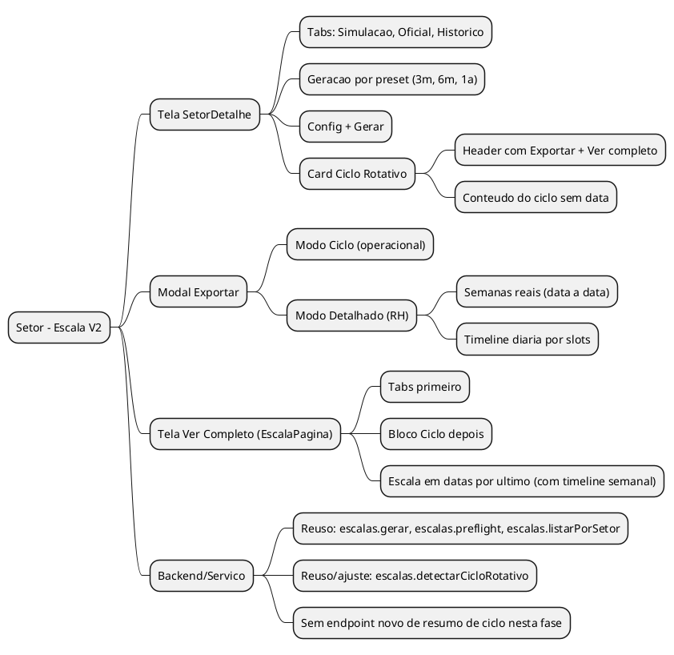
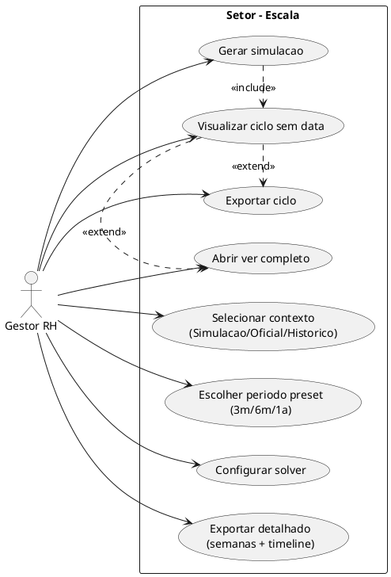
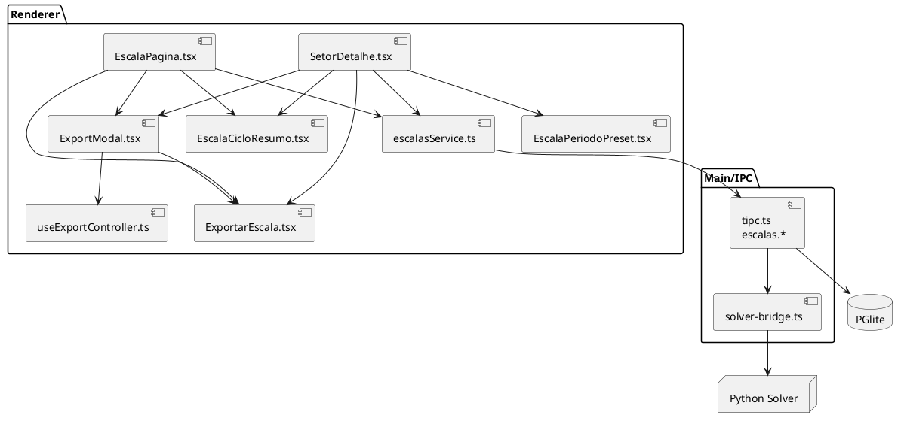
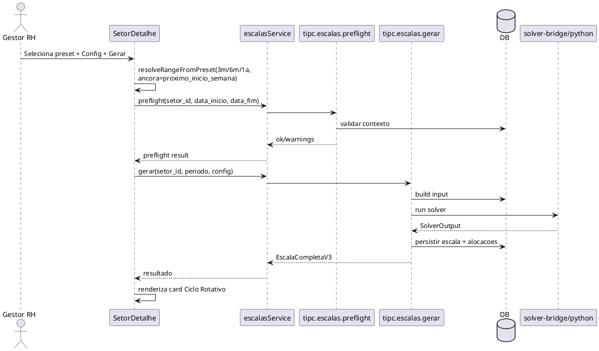
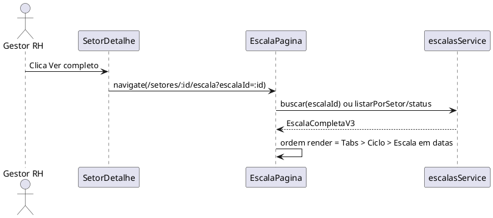
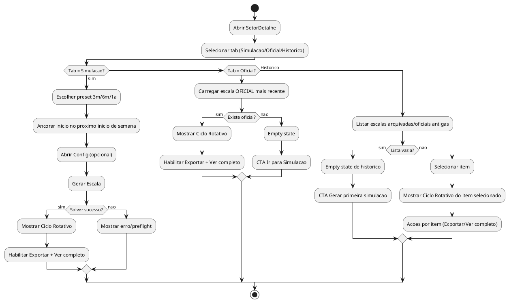
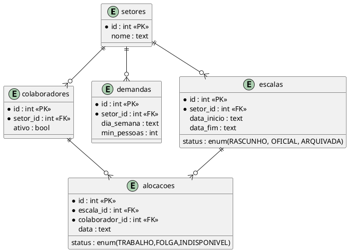
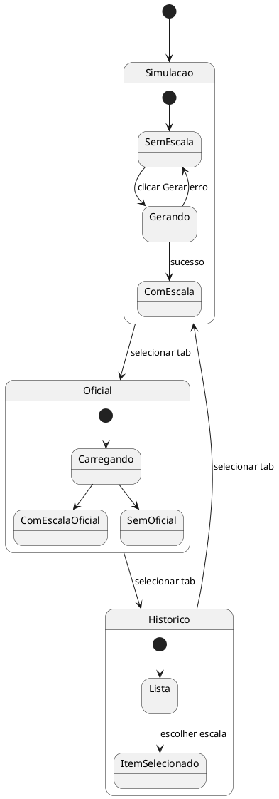

# BUILD - SETOR/ESCALA CICLO V2

> Data: 2026-02-28  
> Input: pedido de UX para Setor com 3 tabs (`Simulacao`, `Oficial`, `Historico`), geracao por preset de periodo, foco em ciclo no Setor e preservacao de semanas + timeline no export/ver completo.  
> Referencia matematica: `docs/ANALISE_MATEMATICA_CICLOS.md`.

---

## 1) Visao geral

### 1.1 Escopo (Mind Map)



### 1.2 Casos de uso



### 1.3 Componentes



### 1.4 Baseline de referencia (Git ontem)

- `7e628ae` (2026-02-27 19:46): remove tabs do SetorDetalhe (regressao de organizacao visual do bloco Escala).
- `f1873f0` (2026-02-27 17:42): consolida `ExportarEscala` com dois modos e inclui timeline diaria no detalhado.
- Diretriz deste BUILD: nao dar rollback cego; manter ganhos recentes e restaurar UX alvo (tabs no Setor + export detalhado util).

---

## 2) Fluxos principais

### 2.1 Fluxo de geracao na aba Simulacao



### 2.2 Fluxo "Ver completo"



### 2.3 Activity da nova tela de setor (bloco Escala)



---

## 3) Dados e estados

### 3.1 ER focado no fluxo



### 3.2 Estado da escala e estado de UI



---

## 4) Layout alvo (ASCII)

### 4.1 SetorDetalhe - bloco Escala

```text
┌─ Escala ───────────────────────────────────────────────────────────────────────────────────┐
│ [ Simulacao ] [ Oficial ] [ Historico ]                                                     │
│                                                                                             │
│ Periodo: [ 3 meses ▼ ]   [Config ⚙]   [Gerar Escala]                                        │
│ Janela calculada: 09/03/2026 - 07/06/2026                                                   │
│ Regra: inicio sempre no PROXIMO inicio de semana (nunca hoje)                               │
│                                                                                             │
│ ┌─ Ciclo Rotativo ───────────────────────────────────────────── [Exportar ▾] [Ver completo]┐ │
│ │ S1 | S2 | S3 | S4 | S5                                                                    │ │
│ │ Matriz por POSTO x dia_semana (sem datas no header)                                      │ │
│ │ [F] fixa / (V) variavel / T domingo / . trabalho                                          │ │
│ └────────────────────────────────────────────────────────────────────────────────────────────┘ │
└──────────────────────────────────────────────────────────────────────────────────────────────┘
```

### 4.2 Estrutura visual do ciclo (posto -> pessoa)

```text
┌─ Ciclo Rotativo ─────────────────────────────────────────────────────────────────────────────┐
│ Semana S1                                                                                    │
│                                                                                              │
│ Posto      | Titular      | SEG | TER | QUA | QUI | SEX | SAB | DOM                        │
│ AC1        | Alex         |  T  |  T  |  F  |  T  |  T  |  F  |  T                         │
│ AC2        | Mateus       |  T  |  F  |  T  |  T  |  T  |  F  |  .                         │
│ AC3        | Jose Luiz    |  T  |  T  |  T  |  F  |  T  |  T  |  .                         │
│ AC4        | Jessica      |  F  |  T  |  F  |  T  |  T  |  T  |  T                         │
│ AC5        | Robert       |  T  |  T  |  T  |  T  |  F  |  T  |  T                         │
│                                                                                              │
│ Regras de exibicao:                                                                          │
│ - Sempre mostrar nome do posto + titular na frente                                           │
│ - Sem DnD                                                                                    │
│ - Sem colunas de sexo/contrato/rank/hierarquia                                               │
│ - Se posto sem titular: "ACX | (sem titular)"                                                │
└──────────────────────────────────────────────────────────────────────────────────────────────┘
```

### 4.3 Ver completo (EscalaPagina)

```text
┌─ Escala Completa ───────────────────────────────────────────────────────────────────────────┐
│ [ Escala ] [ Avisos ]                                                                       │
│                                                                                             │
│ (1) CICLO ROTATIVO (primeiro)                                                               │
│                                                                                             │
│ (2) ESCALA EM DATAS (depois do ciclo)                                                       │
│     Semana 01..07, Semana 08..14, ...                                                       │
│     View principal: TIMELINE (grade opcional)                                               │
└──────────────────────────────────────────────────────────────────────────────────────────────┘
```

### 4.4 Modal de exportar (semanas + timeline)

```text
┌─ Exportar Escala ────────────────────────────────────────────────────────────────────────────┐
│ Formato: (•) Ciclo operacional   ( ) Detalhado RH   ( ) Funcionario   ( ) CSV               │
│ Avisos: [x] Incluir todos os avisos (tudo ou nada)                                           │
│                                                                                               │
│ PREVIEW                                                                                       │
│ ┌─ Semana 1 — 09/03/2026 a 15/03/2026 ────────────────────────────────────────────────────┐ │
│ │ Posto | Titular | DOM | SEG | TER | QUA | QUI | SEX | SAB                               │ │
│ │ AC1   | Alex    | ...                                                                     │ │
│ └───────────────────────────────────────────────────────────────────────────────────────────┘ │
│                                                                                               │
│ ┌─ Timeline diaria de postos (detalhado) ──────────────────────────────────────────────────┐ │
│ │ Quinta 12/03/2026                                                                          │ │
│ │ Colaborador/Pessoa | 07:00 | 08:00 | ... | 18:00                                          │ │
│ │ AC1 Alex           | TRAB  | ALM   | ...                                                  │ │
│ │ AC2 Mateus         | FOLGA | FOLGA | ...                                                  │ │
│ │ Cobertura          | 0/2   | 2/2   | ...                                                  │ │
│ └───────────────────────────────────────────────────────────────────────────────────────────┘ │
│                                                                                               │
│ [Cancelar] [Baixar HTML] [Imprimir]                                                          │
└───────────────────────────────────────────────────────────────────────────────────────────────┘
```

### 4.5 Empty states (Oficial/Historico)

```text
OFICIAL (sem escala oficial)
┌───────────────────────────────────────────────────────────────────────────────────────────────┐
│ Nenhuma escala oficial encontrada                                                            │
│ Gere uma simulacao e oficialize para aparecer aqui.                                          │
│ [Ir para Simulacao]                                                                          │
└───────────────────────────────────────────────────────────────────────────────────────────────┘

HISTORICO (sem itens)
┌───────────────────────────────────────────────────────────────────────────────────────────────┐
│ Historico vazio                                                                              │
│ Ainda nao existem escalas arquivadas para este setor.                                        │
│ [Gerar primeira simulacao]                                                                   │
└───────────────────────────────────────────────────────────────────────────────────────────────┘
```

Regras:
- No Setor: manter apenas ciclo (sem timeline).
- No Exportar/Ver completo: detalhado obrigatoriamente com semanas reais + timeline diaria.
- Avisos no modal de exportacao: controle unico `incluir tudo` ou `incluir nada`.
- Sem opcao de `Horas (Real vs Meta)` no modal.
- Nao e rollback de commit: e reaproveitar o que ja existia e adequar ao desenho novo.

---

## 5) Estrutura de codigo e mudancas

### 5.1 Arquivos impactados

```text
src/renderer/src/
├── paginas/
│   ├── SetorDetalhe.tsx                  # refatorar bloco Escala (tabs + preset + ciclo-only)
│   └── EscalaPagina.tsx                  # reordenar: tabs -> ciclo -> datas (timeline)
├── servicos/
│   └── escalas.ts                        # wrappers de ciclo (detectar/listar) se forem usados
├── componentes/
│   ├── EscalaResultBanner.tsx            # retirar do fluxo principal de setor (ou adaptar)
│   ├── ExportarEscala.tsx                # manter semanas + timeline no modo detalhado
│   ├── ExportModal.tsx                   # organizar opcoes de formato/preview no modal
│   └── (novo) EscalaCicloResumo.tsx      # visual de ciclo sem data
├── hooks/
│   └── useExportController.ts            # orquestrar modal e acoes de export
├── lib/
│   └── (novo) escala-periodo-preset.ts   # resolver 3m/6m/1a -> data_inicio/data_fim
└── App.tsx                               # sem mudanca de rota (apenas confirmacao)

src/main/
└── ...                                   # sem mudancas obrigatorias no solver/IPC nesta etapa
```

### 5.2 O que precisa mudar (objetivo -> alteracao)

| Objetivo | Arquivo(s) | Alteracao |
|---|---|---|
| Tabs no topo do bloco Escala (`Simulacao`, `Oficial`, `Historico`) | `SetorDetalhe.tsx` | Introduzir estado de tab e pipelines de carga por contexto |
| Periodo por dropdown (`3 meses`, `6 meses`, `1 ano`) | `SetorDetalhe.tsx`, novo util em `lib/` | Remover input date do fluxo primario, calculando janela com inicio no proximo inicio de semana |
| `Exportar` + `Ver completo` no header do card Ciclo | `SetorDetalhe.tsx` | Mover acoes do banner para header de Ciclo |
| Mostrar apenas ciclo no setor (sem timeline/grid) | `SetorDetalhe.tsx`, novo `EscalaCicloResumo.tsx` | Render ciclo-only apos gerar/carregar |
| Mostrar ciclo por `posto -> titular` | `SetorDetalhe.tsx`, `EscalaCicloResumo.tsx` | Base de linhas por postos ordenados e titular atual; remover metadados de pessoa da grade |
| Ver completo com ordem correta | `EscalaPagina.tsx` | Reordenar rendering para `Tabs -> Ciclo -> Escala em datas`, mantendo timeline semanal no bloco de datas |
| Historico por item com acoes proprias | `SetorDetalhe.tsx` | Lista de escalas historicas com `Exportar`/`Ver completo` por item |
| Empty state de Oficial/Historico com CTA claro | `SetorDetalhe.tsx` | Quando nao houver dados, mostrar estado vazio e acao primaria |
| Ciclo sem data (S1..SP) | `EscalaCicloResumo.tsx` | Normalizar exibicao por semana do ciclo sem usar datas no header |
| Modal de export com preview util | `ExportModal.tsx`, `useExportController.ts`, `SetorDetalhe.tsx`, `EscalaPagina.tsx` | Garantir preview do modo selecionado e um unico controle de avisos (tudo/nada) |
| Export detalhado com semanas + timeline | `ExportarEscala.tsx` | Preservar blocos de Semana e Timeline diaria no modo detalhado, com cobertura por slot |

---

## 6) Contrato funcional do ciclo (sem data)

### 6.1 Regra de negocio

- O componente de ciclo **nao usa data no header**.
- Ele usa indices de ciclo: `S1..SP`.
- Datas existem apenas na projecao/exportacao, nao na leitura do padrao.
- Referencia matematica: `P = N / gcd(N, D_dom)` (base), com validacao sobre alocacoes reais quando possivel.

### 6.2 Fonte de `P` (periodo do ciclo)

Ordem definida para esta fase (sem endpoint novo):
1. Derivar do conjunto de alocacoes da escala carregada (padrao observado no ciclo exibido).
2. Se nao houver dados suficientes, fallback para formula (`N/gcd(N,D_dom)`).

### 6.3 Status de implementacao atual (diagnostico)

- Existe `escalas.detectarCicloRotativo` em `tipc.ts`, mas hoje ele e simplista (nao representa ciclo real emergente).
- Decisao desta fase: nao criar `escalas.resumoCiclo`; fechar no frontend com contrato explicito + testes.

### 6.4 Contrato de projecao temporal (export/ver completo)

- A projecao temporal usa datas reais do periodo gerado/exportado.
- O modo detalhado precisa mostrar:
1. Semanas reais (`Semana X — data_inicio a data_fim`).
2. Timeline diaria por slots.
3. Cobertura por slot (linha de fluxo/cobertura).
- Avisos no export seguem contrato binario: inclui todos ou nao inclui nenhum.
- Esse bloco e separado do ciclo base e nao altera `P`.

### 6.5 Regra de ancoragem do preset (data de inicio)

- A data de inicio da geracao e sempre o **proximo inicio de semana de escala**.
- Nunca inicia "hoje", mesmo que hoje seja dia de corte.
- Se o corte for `SEG_DOM`:
1. Hoje = segunda-feira `2026-03-02` -> inicio = segunda-feira `2026-03-09`.
2. Hoje = sabado `2026-02-28` -> inicio = segunda-feira `2026-03-02`.
- A data final e calculada pelo preset selecionado (`3m`, `6m`, `1a`) a partir desse inicio.

---

## 7) Checklist de implementacao

| # | Item | Tipo | Dependencia |
|---|---|---|---|
| 1 | Criar util de preset (`3m/6m/1a`) | Frontend | - |
| 2 | Refatorar `SetorDetalhe` para tabs de contexto (`Simulacao/Oficial/Historico`) | Frontend | 1 |
| 3 | Implementar UI de geracao com preset + config + gerar | Frontend | 2 |
| 4 | Criar `EscalaCicloResumo` (ciclo sem data) | Frontend | 2 |
| 5 | Mover `Exportar/Ver completo` para header do card de ciclo | Frontend | 4 |
| 6 | Ajustar `EscalaPagina` para ordem `Tabs -> Ciclo -> Datas` | Frontend | 4 |
| 7 | Implementar empty states de Oficial/Historico com CTA | Frontend | 2 |
| 8 | Reforcar `ExportModal` para preview fiel por formato + aviso tudo/nada | Frontend | 5 |
| 9 | Preservar `ExportarEscala` detalhado com semanas + timeline | Frontend | 8 |
| 10 | Testar fluxos: Simulacao, Oficial, Historico, Ver completo, Exportar | QA | 2-9 |

---

## 8) Riscos e mitigacao

| Risco | Impacto | Mitigacao |
|---|---|---|
| Detectar ciclo errado em cenarios de alta variacao | Alto | Regras deterministicas no FE + fallback matematico + testes com fixtures reais |
| Regressao no fluxo de export atual | Medio | Manter `ExportarEscala` como fonte unica de HTML e adaptar apenas ponto de entrada |
| Modal mostrar preview desconectado do formato | Alto | Amarrar preview ao `formato` selecionado (ciclo vs detalhado) com testes de snapshot |
| Historico pesado com muitas escalas | Medio | Paginar/listar por resumo, carregar detalhe sob demanda |
| Ambiguidade entre "ciclo base" e "periodo projetado" | Alto | Rotulos explicitos na UI: `Ciclo base` vs `Escala em datas` |

---

## 9) Consolidacao

### TL;DR

- `SetorDetalhe` vira cockpit de contexto (`Simulacao`, `Oficial`, `Historico`) com foco em ciclo.
- Geracao sai de data manual e passa para preset (`3m`, `6m`, `1a`) com inicio no proximo inicio de semana.
- Card de ciclo passa a concentrar as acoes (`Exportar`, `Ver completo`).
- `EscalaPagina` vira leitura completa em ordem fixa: tabs, ciclo, datas (timeline semanal).
- Exportacao detalhada continua com `Semanas reais + Timeline diaria` (nao remover).
- Sem endpoint novo de resumo de ciclo nesta fase.

### Dependencias externas

- Nenhuma migracao obrigatoria de banco para esta etapa de layout.
- Nenhuma mudanca obrigatoria de IPC nesta fase.
