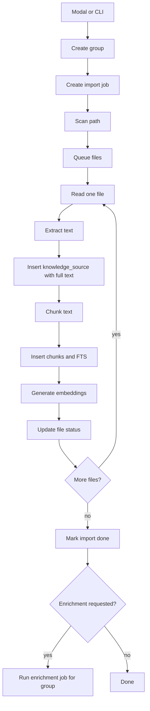

# Bulk RAG Import Design

> Status: design spec. Implementation plan comes later through `superpowers:writing-plans`.

## Goal

Let a user import a folder or large file set into RAG with one group name, store the full extracted text, create chunks and embeddings, and optionally enrich the collection with a chosen IA provider or local model.

## Decision

The product should not optimize for storage savings. If the user imports 3 GB, the app stores the extracted text and chunks. The app must still process incrementally so it does not load 3 GB into RAM or freeze the UI.

FlowKit is the pilot because its product identity is knowledge/RAG. EscalaFlow receives the same bulk importer after FlowKit passes tests, then labels imported material as RH/CLT/user knowledge.

## Product Contract

The modal asks for:

- Group name.
- Files or folder.
- Include subfolders.
- File type filters.
- Enrichment mode.
- IA/model used for enrichment.
- Start import.

The user can also run:

```bash
flowkit rag import ~/Documents/base --group "Base pessoal" --recursive
escalaflow rag import ~/Documents/acordos --group "Acordos coletivos" --recursive
```

The user accepts disk usage by starting the job. The app may show estimated size; it must not block the import because the folder is large.

## Current State

Both apps already have a single-document import path that reads a selected file, extracts text, and calls `ingestKnowledge`.

Current limitations:

- The modal handles one file.
- The main process uses sync file reads in the simple path.
- No group entity exists.
- No import job table exists.
- No resumable queue exists.
- Auto-enrichment assumes a broad "run all pending chunks" workflow.

## Data Model

Add these tables to each app.

### `knowledge_groups`

Stores the user-facing collection.

| Column | Type | Meaning |
| --- | --- | --- |
| `id` | serial | Group id. |
| `nome` | text | User-facing group name. |
| `descricao` | text nullable | Optional note. |
| `origem` | text | `usuario`, `sistema`, or product-specific value. |
| `metadata` | jsonb | Import settings and UI metadata. |
| `criada_em` | timestamptz | Created timestamp. |
| `atualizada_em` | timestamptz | Updated timestamp. |

### `knowledge_import_jobs`

Stores one import run.

| Column | Type | Meaning |
| --- | --- | --- |
| `id` | serial | Job id. |
| `group_id` | integer | Target group. |
| `root_path` | text | Selected folder or file. |
| `recursive` | boolean | Whether subfolders were included. |
| `status` | text | `pending`, `scanning`, `importing`, `embedding`, `enriching`, `paused`, `done`, `failed`, `cancelled`. |
| `total_files` | integer | Files discovered. |
| `processed_files` | integer | Files processed. |
| `failed_files` | integer | Files that failed. |
| `total_bytes` | bigint | Total bytes discovered. |
| `processed_bytes` | bigint | Bytes processed. |
| `chunks_created` | integer | Chunks inserted. |
| `error_message` | text nullable | Fatal job error. |
| `started_at` | timestamptz nullable | Start timestamp. |
| `finished_at` | timestamptz nullable | Finish timestamp. |

### `knowledge_import_files`

Stores each file in the queue.

| Column | Type | Meaning |
| --- | --- | --- |
| `id` | serial | File queue id. |
| `job_id` | integer | Parent job. |
| `source_id` | integer nullable | Created source. |
| `path` | text | Absolute path. |
| `relative_path` | text | Path inside imported root. |
| `size_bytes` | bigint | File size. |
| `mtime_ms` | bigint | Last modified time. |
| `sha256` | text nullable | Content hash after read. |
| `mime_type` | text nullable | Detected type. |
| `status` | text | `pending`, `reading`, `chunking`, `embedding`, `done`, `failed`, `skipped`. |
| `error_message` | text nullable | Per-file error. |

Add `group_id` to `knowledge_sources`.

## Import Pipeline



The job processor reads one file at a time. It can process embeddings in small batches. It updates job progress after every file.

## File Handling

Supported initial file types:

- `.txt`
- `.md`
- `.markdown`
- `.json`
- `.csv`
- `.pdf`

Unsupported files become `skipped` with a reason. Binary files do not crash the job.

PDF extraction uses the existing `pdf-parse` path. If a PDF fails, the file row stores the error and the job continues.

## Storage Policy

The app stores:

- Original extracted text in `knowledge_sources.conteudo_original`.
- File path, hash, size, and parser metadata.
- Every chunk in `knowledge_chunks`.
- Embeddings when the local embedding model is available.

The app does not deduplicate by default. A future UI can add "skip duplicates", but the first version follows the user rule: import the whole thing.

## Enrichment Policy

Enrichment is optional and user-triggered.

The user chooses:

- No enrichment.
- Enrich after import.
- Enrich later from the group page.

The user chooses the model:

- Active cloud provider.
- OpenRouter model.
- Gemini model.
- Local model.

Local IA is allowed for enrichment. It may be slow. The UI must show progress and allow cancel.

The enrichment runner must operate by group:

```text
enrichGroup(group_id, provider_config, options)
```

It must not blindly enrich every pending chunk in the database unless the user chooses "all groups".

## UI Contract

The modal has two states.

### Setup

Fields:

- Group name.
- Folder/file selector.
- Include subfolders toggle.
- File type summary.
- Enrichment toggle.
- Provider/model selector.

Primary action:

- `Importar tudo`

### Progress

Shows:

- Current status.
- Files processed / total.
- Bytes processed / total.
- Chunks created.
- Errors count.
- Current file relative path.

Actions:

- Pause.
- Resume.
- Cancel.
- Open group.
- View errors.

The modal can close while the job continues. The Memory/RAG page shows active jobs.

## CLI Contract

Commands:

```bash
flowkit rag import <path> --group <name> --recursive
flowkit rag jobs
flowkit rag job <id>
flowkit rag cancel <id>
flowkit rag enrich --group <name-or-id> --provider local --model gemma-4-e2b
```

EscalaFlow uses the same commands:

```bash
escalaflow rag import <path> --group "Acordo coletivo 2026" --recursive
escalaflow rag enrich --group "Acordo coletivo 2026" --provider local
```

## Local API Contract

Bulk RAG adds these endpoints to the Core API:

| Method | Path | Purpose |
| --- | --- | --- |
| `POST` | `/rag/import` | Create group/job and start import. |
| `GET` | `/rag/jobs` | List active and recent jobs. |
| `GET` | `/rag/jobs/:id` | Read job progress and errors. |
| `POST` | `/rag/jobs/:id/pause` | Pause processing after current file. |
| `POST` | `/rag/jobs/:id/resume` | Resume processing. |
| `POST` | `/rag/jobs/:id/cancel` | Cancel processing after current file. |
| `POST` | `/rag/groups/:id/enrich` | Enrich one group with selected model. |

## Error Handling

The importer must continue after file-level errors.

Fatal errors:

- Database unavailable.
- Selected path no longer exists during scan.
- User cancels.
- App is shutting down.

File errors:

- Unsupported type.
- Read permission denied.
- PDF extraction failed.
- Empty extracted text.

The UI reports fatal errors as job failure. It reports file errors in an error list.

## Testing Contract

Unit tests:

- Scanner finds nested files when recursive is true.
- Scanner ignores nested files when recursive is false.
- Unsupported files become skipped.
- A file extraction error does not fail the job.
- `knowledge_sources.group_id` links sources to group.
- Job progress increments after each file.

Integration tests:

- Import a temp folder with `.md`, `.txt`, `.json`, and a bad binary file.
- Verify one group, one job, three sources, chunks, and one skipped file.
- Verify search returns imported text.
- Verify cancel stops after current file.

CLI tests:

- `rag import` creates a job.
- `rag jobs` lists the job.
- `rag job <id>` shows progress.

## Rollout

1. Implement group/job schema in FlowKit.
2. Implement scanner and import worker in FlowKit.
3. Implement modal and CLI commands in FlowKit.
4. Add group-level enrichment selection in FlowKit.
5. Port schema, worker, modal, and CLI to EscalaFlow.
6. Add EscalaFlow labels and RH defaults.

## Non-Goals

- No remote sync.
- No cloud storage.
- No automatic dedupe.
- No OCR in the first version.
- No ZIP import in the first version.
- No graph rebuild by default for huge imports.

## Open Decisions Resolved

- Storage: store full extracted text and chunks.
- Large folders: allowed.
- Memory safety: process incrementally.
- Enrichment: optional and user-selected.
- Model choice: cloud or local.
- Pilot product: FlowKit.
- Port target: EscalaFlow.
