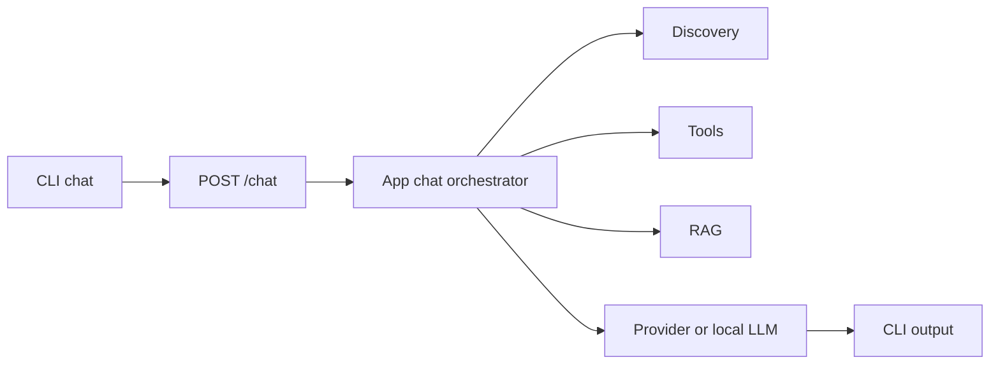

# EscalaFlow and FlowKit CLI Core API Design

> Status: design spec. Implementation plan comes later through `superpowers:writing-plans`.

## Goal

Build an official local CLI and local Core API contract that let a terminal user talk to the app, call app tools, run domain actions, inspect status, and connect external harnesses through MCP without duplicating app logic.

## Decision

FlowKit is the pilot for the shared CLI/API contract because it already has `src/cli/index.ts`, `src/main/tool-server.ts`, and `src/mcp/*`. EscalaFlow receives the same contract after the FlowKit path passes tests, then adds RH-specific commands such as solver generation, scale inspection, sector context, and CLT tools.

The CLI must call the running desktop app by default. The running app owns the database, model config, local LLM lifecycle, tool registry, discovery, RAG, and app-specific state. The CLI is a control surface, not a second backend.

## Current State

FlowKit already has:

- `src/cli/index.ts`: basic `flowkit chat`, `search`, `import`, `status`, and `tools` commands.
- `src/main/tool-server.ts`: local HTTP bridge on `127.0.0.1:17380`.
- `src/mcp/server.ts` and `src/mcp/index.ts`: MCP server that proxies selected tools and resources.
- Knowledge/RAG modules under `src/main/knowledge/*`.

EscalaFlow already has:

- `src/main/tool-server.ts`: local HTTP bridge on `127.0.0.1:17380`.
- `mcp-server/index.ts`: MCP stdio proxy to the local HTTP bridge.
- `scripts/solver-cli.ts`: dev CLI for `buildSolverInput` and `runSolver`.
- `tests/ia/live/ia-chat-cli.ts`: experimental chat CLI with AI SDK tools.

## Product Contract

The user should be able to open a terminal and type commands that control the app:

```bash
flowkit status
flowkit chat
flowkit tool buscar_conhecimento --json '{"consulta":"contrato intermitente"}'
flowkit rag import ~/Documents/base --group "Base pessoal"

escalaflow status
escalaflow chat --setor 2
escalaflow tool gerar_escala --json '{"setor_id":2,"data_inicio":"2026-07-01","data_fim":"2026-09-30"}'
escalaflow solver generate --setor 2 --inicio 2026-07-01 --fim 2026-09-30
```

The CLI should also expose an attach mode:

```bash
flowkit chat --attach
escalaflow chat --attach
```

Attach mode requires the desktop app to be open. If the app is closed, the CLI prints a direct message with the command or button needed to open it. It must not silently initialize another database in a different path.

## Local API Contract

Both apps expose the same base endpoints on a local loopback server:

| Method | Path | Purpose |
| --- | --- | --- |
| `GET` | `/health` | App name, version, tool count, db status, active provider, local model status. |
| `GET` | `/tools` | Tool catalog with JSON schema. |
| `POST` | `/tool` | Execute one registered app tool. |
| `POST` | `/chat` | Run one chat turn through the app's normal AI stack. |
| `GET` | `/discovery` | Return context briefing for CLI/MCP use. |
| `GET` | `/instructions` | Return app-specific MCP/system instructions. |
| `GET` | `/jobs/:id` | Read status of long-running jobs. |
| `POST` | `/jobs/:id/cancel` | Cancel a long-running job. |

EscalaFlow adds domain endpoints:

| Method | Path | Purpose |
| --- | --- | --- |
| `POST` | `/solver/generate` | Build input, run solver, and return summary or full output. |
| `POST` | `/solver/preflight` | Run the same preflight used by the UI. |

Bulk RAG endpoints live in the second spec. Terminal harness endpoints live in the third spec.

## Chat Flow

The CLI chat path must reuse the app's real chat orchestration. It must not keep a separate prompt, separate tool registry, or separate provider config.



The `/chat` request accepts:

```json
{
  "message": "gere a escala do setor 2 para julho",
  "context": {
    "page": "cli",
    "route": "/cli",
    "setor_id": 2
  },
  "conversation_id": 12,
  "stream": false
}
```

The first implementation may return a full response after completion. Streaming is a second slice if it complicates tests.

## CLI Commands

Common commands:

| Command | Behavior |
| --- | --- |
| `status` | Calls `/health` and app-specific stats tool. |
| `tools` | Lists local tools with descriptions. |
| `tool <name>` | Calls `/tool` with JSON args. |
| `chat [message]` | Sends one message or opens REPL mode. |
| `mcp config` | Prints MCP config snippet for Codex, Claude, or other clients. |
| `jobs list` | Lists active and recent jobs. |
| `jobs cancel <id>` | Cancels a job. |

FlowKit commands:

| Command | Behavior |
| --- | --- |
| `rag search <query>` | Calls knowledge search. |
| `rag import <path>` | Delegates to bulk RAG job API. |

EscalaFlow commands:

| Command | Behavior |
| --- | --- |
| `solver list-setores` | Lists active sectors. |
| `solver preflight --setor <id>` | Runs generation preflight. |
| `solver generate --setor <id>` | Runs solver and returns summary by default. |
| `escala inspect <id>` | Returns schedule summary and diagnostics. |

## MCP Contract

MCP remains the bridge for external agents. The MCP server should not reimplement business logic. It should proxy the local API and expose app tools/resources with friendly errors when the desktop app is closed.

Both products expose:

- `consultar_contexto`
- `editar_ficha`
- `executar_acao`
- `knowledge://sources`
- `knowledge://stats`
- `app://health`

EscalaFlow adds:

- `solver://setores`
- `solver://last-run`
- `escala://diagnostics/<id>`

## Error Handling

The CLI must fail loudly and plainly:

- App closed: `FlowKit nao esta rodando. Abra o app primeiro.`
- Tool missing: `Tool "x" nao existe neste app. Rode "tools" para listar.`
- Bad JSON: `JSON invalido em --json.`
- Job failed: print job id, failed file or action, and error message.
- Solver timeout: print partial solver logs and timeout value.

No command may swallow errors to look green.

## Security Boundary

The CLI talks to `127.0.0.1` only. The local API must reject non-loopback hosts. The first version does not expose remote networking.

The CLI may execute app tools that mutate data because the user explicitly runs local commands. Dangerous terminal execution is not part of this spec; it belongs to the terminal harness spec.

## Testing Contract

Shared tests:

- CLI exits with a useful error when the app is closed.
- `/health` returns app name, version, and tool count.
- `/tools` returns schemas.
- `/tool` rejects an unknown tool.
- `status` succeeds against a running dev app.
- `chat` can complete one non-mutating turn.

FlowKit tests:

- `rag search` returns known seeded knowledge.
- `rag import` creates a job when the bulk RAG feature exists.

EscalaFlow tests:

- `solver list-setores` returns seeded sectors.
- `solver preflight` returns blockers/warnings for a known sector.
- `solver generate --summary` returns solver status and indicators.

## Rollout

1. Implement the shared contract in FlowKit.
2. Test FlowKit CLI, local API, and MCP against the running app.
3. Port the shared contract to EscalaFlow.
4. Add EscalaFlow solver commands.
5. Keep command names parallel where possible.

## Non-Goals

- No remote server.
- No SaaS auth.
- No shell execution.
- No automatic startup daemon.
- No duplicate database runtime for normal CLI use.

## Open Decisions Resolved

- Pilot product: FlowKit.
- Second product: EscalaFlow.
- API owner: running desktop app.
- CLI role: control surface.
- MCP role: external agent bridge.
- Terminal total access: separate spec.
