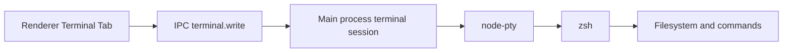

# Terminal Harness Design

> Status: design spec. Implementation plan comes later through `superpowers:writing-plans`.

## Goal

Add a terminal control surface that lets the user open a real shell, talk to the app's IA from the terminal, and optionally grant an agent full local command execution through a clear, explicit mode.

## Decision

The terminal harness comes after the CLI/Core API and Bulk RAG specs. A shell with full access is powerful only when the app already exposes clean tools for safe app actions. Without the Core API, terminal mode would become a generic shell agent with weak product context.

The first internal implementation should use `node-pty` plus `xterm.js` for an in-app terminal and a narrow `terminal.exec` tool. External harnesses such as Open Interpreter, Pi, or OpenCode can run on top of the app's CLI/MCP contract later.

## Product Contract

The user can open:

- `Abrir CLI`: launches the system terminal with the app CLI.
- `Terminal no app`: opens an embedded terminal tab.
- `Modo agente`: lets the app IA execute terminal commands after explicit enablement.

The UI must make the permission obvious. Full terminal access means the agent can read, write, and delete anything the OS user can access.

## Current State

FlowKit already has:

- CLI entry under `src/cli/index.ts`.
- Local HTTP tool server.
- MCP server.

EscalaFlow already has:

- Local HTTP tool server.
- MCP proxy.
- Solver CLI.
- Experimental IA chat CLI.

Neither app should start with a full shell agent. Both apps need the Core API first.

## Modes

### Mode 1: Open External CLI

The app opens Terminal.app with a command:

```bash
flowkit chat --attach
escalaflow chat --attach
```

This mode has no extra shell permissions beyond the user's terminal. It is the safest first user-facing mode.

### Mode 2: Embedded Terminal

The app renders a terminal using `xterm.js` and runs a shell through `node-pty`.



The main process owns the pty session. The renderer sends keystrokes and receives output events.

### Mode 3: Agent Terminal Tool

The app IA can call a terminal tool:

```json
{
  "command": "ls -la ~/Documents",
  "cwd": "/Users/marcoantonio",
  "timeout_ms": 30000
}
```

The first version should require explicit enablement per session. A later version can add allowlists, denylists, and per-command approval.

## Permission Levels

Use three explicit levels.

| Level | Name | Behavior |
| --- | --- | --- |
| 0 | Off | IA cannot execute shell commands. |
| 1 | Ask | IA proposes commands; user approves each command. |
| 2 | Full | IA can execute commands until the session ends or user disables it. |

Marco's desired mode maps to Level 2. The product still keeps Level 0 and Level 1 because normal users need a safer path.

## Tool Contract

Add one internal tool family for terminal control:

### `terminal.exec`

Input:

```json
{
  "command": "pwd && ls",
  "cwd": "/Users/marcoantonio",
  "timeout_ms": 30000,
  "max_output_chars": 20000
}
```

Output:

```json
{
  "exit_code": 0,
  "stdout": "...",
  "stderr": "",
  "duration_ms": 124,
  "cwd": "/Users/marcoantonio"
}
```

The tool returns truncated output when output exceeds `max_output_chars`. It must report truncation explicitly.

### `terminal.open_cli`

Input:

```json
{
  "command": "flowkit chat --attach",
  "cwd": "/Users/marcoantonio/flowkit"
}
```

Output:

```json
{
  "opened": true
}
```

This tool opens the OS terminal. It does not execute hidden commands inside the app.

## Local API Contract

Terminal harness adds these endpoints:

| Method | Path | Purpose |
| --- | --- | --- |
| `POST` | `/terminal/exec` | Execute one command with configured permission checks. |
| `POST` | `/terminal/open-cli` | Open Terminal.app with app CLI. |
| `GET` | `/terminal/sessions` | List embedded terminal sessions. |
| `POST` | `/terminal/sessions` | Start embedded terminal session. |
| `POST` | `/terminal/sessions/:id/write` | Write input to pty. |
| `POST` | `/terminal/sessions/:id/resize` | Resize pty. |
| `POST` | `/terminal/sessions/:id/kill` | Kill pty. |

For interactive pty output, IPC events are better than polling HTTP. The API exists for control; renderer output should flow through Electron IPC.

## External Harness Strategy

External harnesses are optional wrappers.

### Open Interpreter

Good fit for a user who wants a general local computer assistant. It can run commands and use MCP. It should connect through the app's MCP server instead of touching the database directly.

### Pi

Good fit for a small, explicit agent harness. It is useful if the user wants a minimal shell-capable agent that runs with the process user's permissions.

### OpenCode

Good fit for coding-agent workflows. It is less product-specific than the app CLI but useful when the user wants repo work from terminal.

The app should not embed any of these as the foundation. The app should expose CLI, API, and MCP first. External harnesses then become replaceable clients.

## Security Boundary

The app must speak plainly:

```text
Modo terminal total permite que a IA execute comandos com as permissoes do seu usuario do macOS.
Ela pode ler, alterar ou apagar arquivos acessiveis por voce.
```

The app records:

- Command.
- Cwd.
- Start/end timestamp.
- Exit code.
- Truncated output preview.
- Whether the command came from user typing or IA tool call.

The app does not hide command execution.

## UI Contract

Settings page:

- Terminal mode: Off, Ask, Full.
- Default cwd.
- Max command timeout.
- Max output chars.
- Button: Open CLI.

Terminal page/tab:

- Embedded terminal viewport.
- Current cwd.
- Permission badge.
- Kill session button.
- Copy output button.

IA chat:

- Shows terminal tool calls as visible tool cards.
- Shows command, cwd, exit code, and output summary.
- In Ask mode, renders Approve and Deny buttons before execution.

## Testing Contract

Unit tests:

- `terminal.exec` refuses when mode is Off.
- `terminal.exec` returns pending approval when mode is Ask.
- `terminal.exec` runs command when mode is Full.
- Output truncation is explicit.
- Timeout kills the process and returns timeout status.

Integration tests:

- Open CLI command builds the right command string for FlowKit.
- Open CLI command builds the right command string for EscalaFlow.
- Embedded terminal starts, receives `pwd`, returns output, and kills cleanly.

E2E tests:

- User enables Ask mode, IA proposes command, user approves, output appears in chat.
- User enables Full mode, IA runs a harmless command, tool card shows result.

## Rollout

1. Finish CLI/Core API in FlowKit.
2. Finish CLI/Core API in EscalaFlow.
3. Add Open CLI button in FlowKit.
4. Add Open CLI button in EscalaFlow.
5. Add embedded terminal in FlowKit.
6. Port embedded terminal to EscalaFlow.
7. Add `terminal.exec` with Off and Ask modes.
8. Add Full mode behind explicit session opt-in.
9. Document Open Interpreter, Pi, and OpenCode as external clients.

## Non-Goals

- No invisible command execution.
- No remote terminal.
- No background daemon with shell access.
- No direct database mutation through shell as a product feature.
- No dependency on Open Interpreter, Pi, or OpenCode for the core app.

## Open Decisions Resolved

- Full access is allowed as an explicit mode.
- Default mode is Off.
- Safer Ask mode exists for normal users.
- Core API and CLI come first.
- External harnesses remain clients, not foundations.
