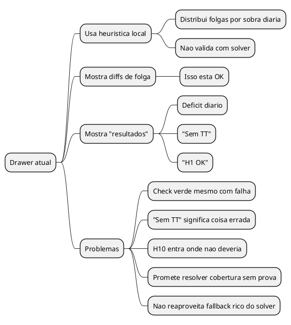
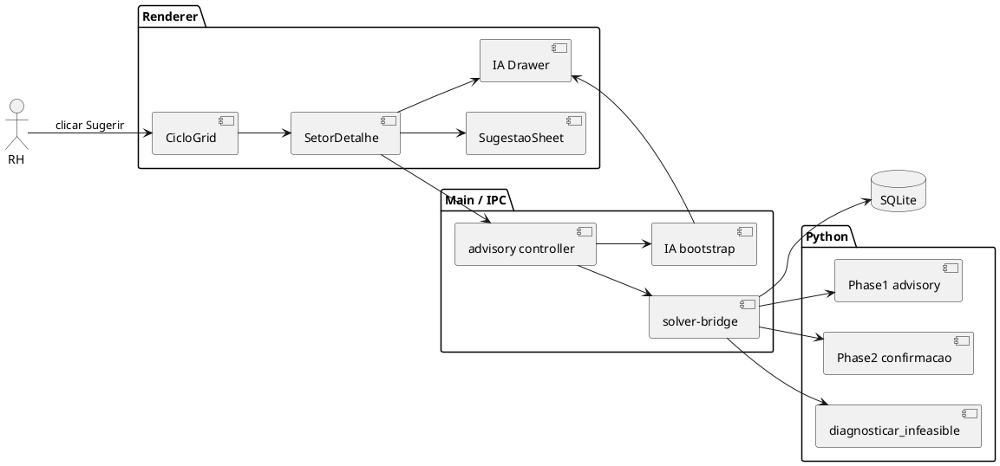
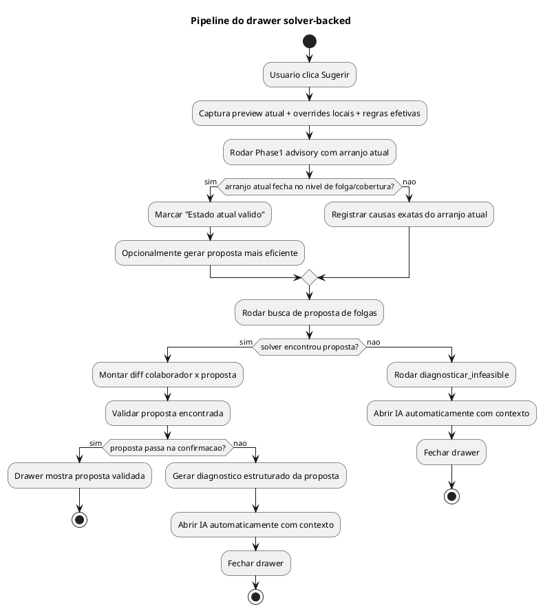
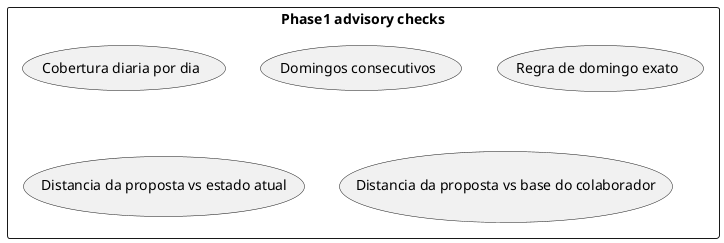
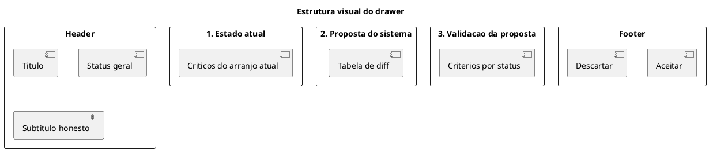
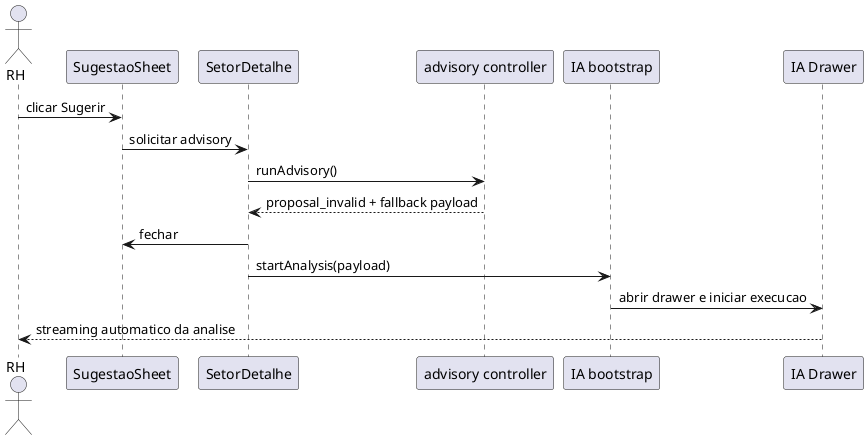
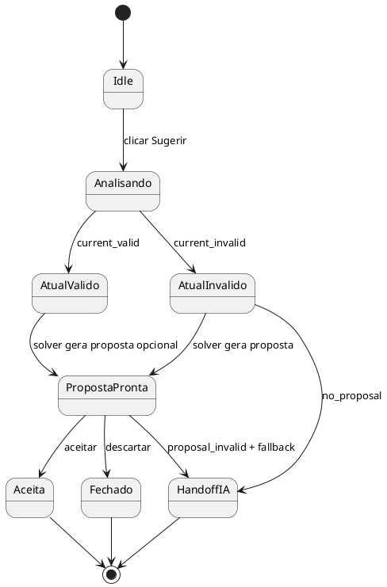

# BUILD — Drawer de Sugestao com Solver + Fallback IA

> Data: 2026-03-15
> Origem: decisao Marco x Codex sobre o drawer "Sugestao do Sistema"
> Escopo: arquitetura do drawer, validacao solver-backed, sugestao de folgas, e handoff automatico para IA

---

## TL;DR

O drawer atual mente por dois motivos:

1. chama de "ok" coisas que ainda falham;
2. exibe metricas que ele nao calcula de verdade.

O ajuste correto nao e cosmetico. O drawer precisa mudar de natureza:

- sair de **heuristica muda de folga**;
- virar **advisory solver-backed**;
- validar o estado atual;
- tentar gerar uma proposta real;
- se a proposta for aceita, aplicar na **simulacao** e rodar uma analise mais profunda;
- explicar por que ainda nao fecha, se nao fechar;
- e, quando nem a proposta do solver resolve sozinha, abrir a IA ja trabalhando com o diagnostico em contexto.

---

## Decisoes de Produto

### 1. O drawer nao pode mais usar "Sem TT"

O texto correto nao e "Nao houve semana com trabalho em todos os dias para a mesma pessoa".

O que interessa ao RH aqui e:

- `Domingos consecutivos: OK`
- ou
- `Domingos consecutivos: Robert entraria em 3 domingos seguidos`

`TT` como sigla interna nao deve aparecer.

### 2. H10 sai do drawer de sugestao

H10 depende da escala completa com horarios, horas reais e validacao mais pesada.

No drawer de sugestao de folgas, H10:

- nao deve aparecer;
- nao deve ser fingido;
- nao deve ser resumido como "ok" sem solve completo.

### 3. O preview TS continua existindo

O preview automatico segue como camada instantanea da pagina:

- domingos;
- folgas;
- cobertura diaria;
- bloqueios matematicos obvios.

Mas o drawer deixa de confiar so nisso.

### 4. O drawer deve rodar solver

A acao `Sugerir` deixa de chamar apenas heuristica local e passa a disparar uma pipeline de analise:

1. validar o arranjo atual com o solver;
2. se nao fecha, pedir ao solver uma proposta de folgas;
3. validar a proposta sugerida;
4. se ainda falhar, abrir a IA automaticamente com o fallback do solver.

### 5. Nao usar "melhora mas nao resolve" como frase vaga

Se o solver rodou, ele precisa devolver causa exata.

Exemplos:

- `Cobertura diaria ainda insuficiente em SEG`
- `Robert excederia o maximo de domingos consecutivos`
- `Nao existe distribuicao de folgas que preserve as escolhas manuais com a demanda atual`

Ou seja: nada de status fofo genérico quando existe diagnostico real.

### 6. Aceitar sugestao salva na simulacao e enriquece Avisos

Quando o usuario clica `Aceitar sugestao`, o comportamento correto nao e parar no diff de folgas.

Ele passa a ser:

1. aplicar os novos `overrides_locais` na simulacao;
2. rodar uma analise profunda com solver em cima desse novo estado;
3. salvar o resultado dessa analise **na propria simulacao**;
4. alimentar o painel de `Avisos` com esse retorno mais rico.

Isso **nao**:

- oficializa escala;
- sobrescreve regra do colaborador;
- cria tabela nova;
- salva proposta descartada.

Isso **sim**:

- melhora a tentativa atual;
- deixa a tela com mensagens mais profundas antes da geracao real;
- reaproveita a mesma infraestrutura de avisos do preview TS.

### 7. Avisos do advisory usam o mesmo formato do TS

Os avisos vindos da analise profunda **nao podem** criar um segundo contrato de UI.

Regra de arquitetura:

- preview TS continua produzindo `PreviewDiagnostic[]`;
- advisory/solver deve ser normalizado para **o mesmo shape** `PreviewDiagnostic[]`;
- `AvisosSection` recebe uma lista unificada;
- o usuario nao precisa saber se o aviso veio do TS ou do solver para conseguir ler.

O que muda e apenas o `source` em `preview-diagnostics.ts:14`, que hoje aceita:
`'capacity' | 'domingo_ciclo' | 'domingo_consecutivo' | 'preview'`

Passa a aceitar tambem:

- `'advisory_current'`
- `'advisory_proposal'`

So 2 consumers existem (`SetorDetalhe.tsx:1888` e `preview-diagnostics.ts`), conversao explicita — risco zero.

Mas o formato visual e o mesmo:

- `severity`
- `gate`
- `title`
- `detail`
- `source`
- `overridableBy` quando existir

Ou seja: advisory rico, sim; contrato paralelo de aviso, nao.

---

## O problema do drawer atual

### Mentiras exatas no codigo (verificado 2026-03-15)

| Mentira | Arquivo | Linha | O que faz |
|---------|---------|-------|-----------|
| `"Sem TT"` | `src/shared/sugestao-folgas.ts` | 94 | Hardcoded `resultados.push('Sem TT')` — nunca valida ciclo/K |
| `"H1 OK"` | `src/shared/sugestao-folgas.ts` | 95 | Hardcoded `resultados.push('H1 OK')` — nunca valida interjornada |
| Check sempre verde | `SugestaoSheet.tsx` | 119 | `<Check className="size-4 text-success" />` em todo resultado, sem distinção PASS/FAIL |
| Traducao que esconde | `SetorDetalhe.tsx` | 350-364 | `traduzirResultadoSugestao` transforma mentira em frase elaborada |

A heuristica em `calcularSugestaoFolgas()` (`sugestao-folgas.ts:33-98`) e um greedy `pickBestDay()` que so olha `N - folgas >= demanda`. Nao chama solver, nao valida constraints, nao verifica domingos.



---

## Arquitetura alvo

### Componentes



### Regra de ouro

O drawer passa a trabalhar em 3 camadas:

1. **Estado atual**
   valida o que o usuario montou agora;

2. **Proposta do sistema**
   mostra o diff de folgas sugerido;

3. **Resultado da proposta**
   mostra se a proposta fecha ou nao fecha, com causa exata.

---

## Pipeline de analise



---

## O que o solver deve fazer aqui

### Mapeamento para codigo existente

O solver Python ja possui **Phase 1** (`solve_folga_pattern()`, `solver_ortools.py:343-511`) — um modelo CP-SAT leve que decide apenas banda de turno (OFF/MANHA/TARDE/INTEGRAL) sem horarios. Roda em ~10s e valida:

| Constraint | Funcao | Arquivo |
|-----------|--------|---------|
| H1 max 6 consecutivos | `add_h1_max_dias_consecutivos` | constraints.py:916+ |
| Folga fixa 5x2 | `add_folga_fixa_5x2` | constraints.py:916-941 |
| Folga variavel XOR | `add_folga_variavel_condicional` | constraints.py:942-1010 |
| Min headcount/dia | `add_min_headcount_per_day` | constraints.py:425+ |
| Domingo ciclo exato | `add_domingo_ciclo_hard` | constraints.py:1099-1150 |
| Domingo max consec (H3) | `add_dom_max_consecutivo` | constraints.py:1016-1073 |
| Band demand coverage | `add_band_demand_coverage` | constraints.py:440+ |

**Mecanismo de implementacao:** Adicionar `config.advisory_only = true` no JSON de input. Quando ativo, o Python roda `solve_folga_pattern()` e retorna imediatamente sem entrar no Phase 2 (`build_model`). Isso e uma extracao — zero logica nova de constraint.

**`pinned_folga_externo`** esta **100% implementado** em todas as camadas (`solver_ortools.py:1721`, `solver-bridge.ts:661`, `tipc.ts:1375`, `SetorDetalhe.tsx:1765`, `simula-ciclo.ts:734`). O advisory pode usar como input para validar o arranjo atual.

## Lane A — Validacao do estado atual

Input:

- preview atual do setor;
- `pinned_folga_externo` atual;
- regras efetivas;
- periodo atual;
- demanda;
- excecoes;
- participantes reais.

Output:

- `CURRENT_VALID`
- ou `CURRENT_INVALID`
- com diagnosticos estruturados.

Essa lane responde:

- a configuracao atual fecha no nivel de folga/cobertura?
- quais dias continuam falhando?
- quem quebra domingo consecutivo?
- existe conflito estrutural com as escolhas manuais?

## Lane B — Busca de proposta

Se o estado atual nao fecha, o solver procura uma proposta de folgas.

Objetivo da busca:

1. resolver cobertura diaria;
2. respeitar regras de domingo;
3. minimizar alteracoes nas escolhas atuais;
4. preservar o maximo possivel do que veio dos colaboradores;
5. so depois disso otimizar "boniteza" de distribuicao.

## Lane C — Confirmacao

Se a proposta foi encontrada, roda confirmacao.

Aqui existem 2 opcoes de arquitetura:

### Opcao recomendada

- `Phase1 advisory` sempre
- `Phase2 confirmacao` quando a proposta parece valida

Motivo:

- resposta rapida quando a proposta e obviamente ruim;
- resposta autoritativa quando a proposta parece boa;
- evita gastar solve pesado em toda tentativa boba.

### Opcao extrema

- full solver em toda abertura de drawer

Isso da mais autoridade, mas pode matar a fluidez se o RH ficar clicando toda hora.

### Decisao recomendada

Manter:

- preview TS instantaneo;
- drawer com solver em duas etapas: `Phase1 advisory -> Phase2 confirmacao`.

Assim o sistema nao vira uma carroca teatral.

---

## O que a Phase1 advisory precisa validar

Ela precisa substituir as frases falsas do drawer atual por resultado estruturado.



Nao entram aqui:

- H10
- cobertura por faixa horaria de 15 min
- almoco
- interjornada real com horario

Essas coisas sao da confirmacao ou da escala completa.

---

## Decisao explicita de BD

### V1: sem migration, persistencia apenas dentro da simulacao

Para esta etapa, a decisao e:

- **nao persistir advisory em tabela nova**
- **nao criar historico de sugestoes nesta fase**
- **salvar apenas o advisory aceito dentro do `setores.simulacao_config_json`**

Nota: existem DOIS campos `simulacao_config_json` no banco:
- `setores.simulacao_config_json` (`SetorSimulacaoConfig`) — simulacao do setor, migration v25. **Este e o alvo.**
- `escalas.simulacao_config_json` (`EscalaSimulacaoConfig`) — config de geracao por escala. NAO usar aqui.

A extensao e apenas no tipo TS (`SetorSimulacaoConfig`), sem migration.

Motivo:

1. o objetivo agora e suporte operacional imediato, nao auditoria pesada;
2. o advisory depende muito de estado transiente do preview;
3. a simulacao ja e o lugar correto para guardar tentativa viva;
4. persistir cedo demais em tabela dedicada empurra schema e lifecycle sem necessidade.

### O banco continua sendo usado para

- ler setor, colaboradores, regras, demanda, excecoes, feriados;
- montar o `SolverInput`;
- ler a base real dos colaboradores para calcular diff;
- reaproveitar o diagnostico do solver;
- persistir no `simulacao_config_json` a ultima analise profunda aceita na simulacao.

### O que NAO vai para o banco em V1

- proposta de folgas nao aceita;
- autostart da IA;
- diagnostico transitório do fallback.

### O que vai para a simulacao em V1

Quando o usuario aceita a sugestao, salvar no mesmo payload da simulacao algo nessa linha:

```ts
interface SimulacaoAdvisorySnapshot {
  input_hash: string
  generated_at: string
  origin: 'accepted_suggestion'
  diagnostics: PreviewDiagnostic[]
  advisory_status: AdvisoryStatus
}
```

Isto serve para:

- preencher `Avisos` com mensagens profundas;
- invalidar o advisory quando o usuario mexer de novo;
- manter a tentativa atual enriquecida sem virar rascunho oficial.

### Mecanismo de invalidacao

O `input_hash` e um hash deterministico dos inputs que geraram o advisory:
- `overrides_locais` (estado das folgas no momento)
- `participantes` (ids + contratos)
- `demanda` (padrao ou draft)
- `periodo`

Quando qualquer desses muda, `SetorDetalhe` compara o hash atual com `advisory.input_hash`. Se divergir, descarta o advisory salvo e limpa os avisos enriquecidos. Isso acontece via `useMemo` — sem listener extra.

### Opcional futuro

Se depois quisermos auditoria/replay, ai sim entra tabela dedicada:

```text
escala_advisory_runs
├── id
├── setor_id
├── data_inicio
├── data_fim
├── input_snapshot_json
├── advisory_output_json
├── created_at
└── accepted_at (nullable)
```

Mas isso esta **fora do V1**.

---

## Contrato IPC fechado

### Novo endpoint

Criar:

- `escalas.advisory`

Ele e chamado pelo renderer quando o usuario clica `Sugerir`.

### Input do IPC

```ts
interface EscalaAdvisoryInput {
  setor_id: number
  data_inicio: string
  data_fim: string
  solve_mode?: 'rapido' | 'balanceado' | 'otimizado' | 'maximo'
  max_time_seconds?: number
  rules_override?: Record<string, string>
  pinned_folga_externo: Array<{ c: number; d: number; band: number }>
  current_folgas: Array<{
    colaborador_id: number
    fixa: DiaSemana | null
    variavel: DiaSemana | null
    origem_fixa: 'COLABORADOR' | 'OVERRIDE_LOCAL'
    origem_variavel: 'COLABORADOR' | 'OVERRIDE_LOCAL'
  }>
  demanda_preview?: SemanaDraftAdvisory | null
}
```

### Decisao sobre demanda ainda nao salva

Este era um gap real. Fica resolvido assim:

- se `DemandaEditor` estiver limpo, advisory usa banco;
- se houver draft local, renderer envia `demanda_preview`;
- main monta `SolverInput` com override em memória, sem persistir.

### Forma do draft para advisory

Nao usar tipo renderer-only cru. Criar tipo compartilhado minimalista:

```ts
interface SemanaDraftAdvisory {
  padrao: {
    hora_abertura: string
    hora_fechamento: string
    segmentos: Array<{
      hora_inicio: string
      hora_fim: string
      min_pessoas: number
      override: boolean
    }>
  }
  dias: Record<DiaSemana, {
    ativo: boolean
    usa_padrao: boolean
    hora_abertura: string
    hora_fechamento: string
    segmentos: Array<{
      hora_inicio: string
      hora_fim: string
      min_pessoas: number
      override: boolean
    }>
  }>
}
```

### Output do IPC

```ts
type AdvisoryStatus =
  | 'CURRENT_VALID'
  | 'CURRENT_INVALID'
  | 'PROPOSAL_VALID'
  | 'PROPOSAL_INVALID'
  | 'NO_PROPOSAL'

type AdvisoryCriterionStatus = 'PASS' | 'FAIL' | 'NOT_EVALUATED'

interface AdvisoryCriterion {
  code:
    | 'COBERTURA_DIA'
    | 'DOMINGOS_CONSECUTIVOS'
    | 'DOMINGO_EXATO'
    | 'COBERTURA_FAIXA'
    | 'DESCANSO_JORNADA'
  status: AdvisoryCriterionStatus
  title: string
  detail: string
  source: 'PHASE1' | 'PHASE2' | 'DIAGNOSTIC'
}

interface AdvisoryDiffItem {
  colaborador_id: number
  nome: string
  posto_apelido: string
  fixa_atual: DiaSemana | null
  fixa_proposta: DiaSemana | null
  variavel_atual: DiaSemana | null
  variavel_proposta: DiaSemana | null
}

interface EscalaAdvisoryOutput {
  status: AdvisoryStatus
  normalized_diagnostics: PreviewDiagnostic[]
  current: {
    criteria: AdvisoryCriterion[]
  }
  proposal?: {
    diff: AdvisoryDiffItem[]
    criteria: AdvisoryCriterion[]
  }
  fallback?: {
    should_open_ia: boolean
    reason: string
    diagnosis_payload: unknown
  }
}
```

### Regra obrigatoria do contrato

`AdvisoryCriterion[]` existe para o drawer detalhado.

Mas o painel principal de `Avisos` **nao** deve consumir `AdvisoryCriterion[]` direto.

Ele consome:

- `PreviewDiagnostic[]` do preview TS;
- `normalized_diagnostics: PreviewDiagnostic[]` do advisory solver-backed.

Se a proposta for aceita, esse `normalized_diagnostics` e o payload que vai para a simulacao.

---

## Fechamento dos gaps criticos

### Gap 1: demanda nao salva

Resolvido com `demanda_preview` no IPC.

### Gap 2: autostart da IA

Hoje o envio da IA mora dentro de [`IaChatView.tsx`](/Users/marcofernandes/escalaflow/src/renderer/src/componentes/IaChatView.tsx), o que impede disparo programatico limpo.

Decisao:

- extrair o envio para uma action de store;
- `IaChatView` passa a usar essa action;
- `SetorDetalhe` tambem pode usar a mesma action no fallback.

### Gap 3: corrida de cliques

Decisao:

- 1 advisory ativo por vez no drawer;
- clique repetido enquanto roda = ignorado ou substitui request anterior;
- status visual `Analisando...`.

### Gap 4: timeout

Decisao:

- advisory rapido: timeout curto, ex. 10-20s;
- confirmacao Phase2: respeita solve mode, mas com teto menor que geracao completa;
- se expirar, drawer mostra falha tecnica + CTA `Analisar com IA`.

### Gap 5: cancelamento

Decisao V1:

- sem botao de cancelar dedicado no drawer;
- fechar drawer cancela apenas UI local;
- solver pode continuar ate terminar;
- se isso ficar irritante, botao de cancelar entra no V1.1.

---

## Modelo de resposta do advisory

O drawer nao deve mais receber `resultados: string[]`.

O contrato canonico passa a ser **o mesmo fechado na secao `Contrato IPC fechado`**.

Regra:

- nao duplicar schema em outro ponto do documento;
- `H10` permanece fora;
- `fallback.should_open_ia` e o nome valido do campo.
- `normalized_diagnostics` deve seguir o mesmo contrato visual/logico do preview TS.

---

## Regras de UI do drawer

### O drawer precisa separar 3 blocos



### Semantica visual

- `PASS`: verde
- `FAIL`: vermelho
- `NOT_EVALUATED`: cinza

Logo:

- nunca usar check verde para um item com deficit;
- nunca chamar de "ok" algo que nao foi medido;
- nunca renderizar criterio textual sem `status`.

### Texto correto dos criterios

Trocar:

- `Sem TT`

Por:

- `Domingos consecutivos: OK`
- ou `Domingos consecutivos: Robert entraria em 3 domingos seguidos`

Trocar:

- `H1 OK`

Por:

- `Descanso entre jornadas: nao avaliado neste drawer`

ou, se Phase2 tiver rodado:

- `Descanso entre jornadas: OK`
- `Descanso entre jornadas: conflito em Jessica na semana S2`

Remover:

- H10 do drawer.

---

## Handoff automatico para IA

Quando a proposta nao fecha, o sistema nao deve deixar o usuario num beco sem placa.

### Comportamento desejado

1. solver conclui que:
   - o estado atual nao fecha; e
   - a proposta automatica tambem nao fecha; ou
   - nao existe proposta;
2. UI mostra um toast curto:
   - `Abrindo IA com o diagnostico do solver...`
3. drawer fecha;
4. chat da IA abre automaticamente;
5. o prompt ja foi enviado por baixo dos panos;
6. o usuario ja ve a IA trabalhando.

### Sequencia



### Contrato do bootstrap de IA

Criar uma entrada dedicada, em vez de simular colagem no input.

Algo como:

```ts
interface IaAutoStartPayload {
  origem: 'solver_suggestion_fallback'
  setorId: number
  periodo: { inicio: string; fim: string }
  preview: unknown
  advisory: AdvisoryResponse
  solverDiagnostic: unknown
}
```

---

## Estados do drawer



---

## Estrutura de codigo definitiva

### Required

```text
/Users/marcofernandes/escalaflow
├── src/
│   ├── shared/
│   │   ├── advisory-types.ts                  [novo]
│   │   ├── preview-diagnostics.ts            [editar: expandir source/normalizacao comum]
│   │   └── setor-simulacao.ts                [editar: persistir advisory aceito na simulacao]
│   ├── renderer/src/
│   │   ├── servicos/
│   │   │   └── escalas.ts                     [editar: client escalas.advisory]
│   │   ├── store/
│   │   │   └── iaStore.ts                     [editar: envio programatico/autostart]
│   │   ├── componentes/
│   │   │   ├── IaChatView.tsx                 [editar: usar action centralizada]
│   │   │   └── SugestaoSheet.tsx              [editar forte: 3 blocos + severidade]
│   │   └── paginas/
│   │       └── SetorDetalhe.tsx               [editar: chama advisory + fallback IA]
│   ├── main/
│   │   ├── tipc.ts                            [editar: novo IPC escalas.advisory]
│   │   └── motor/
│   │       ├── advisory-controller.ts         [novo]
│   │       └── solver-bridge.ts               [editar: build input com demanda preview]
├── solver/
│   └── solver_ortools.py                      [editar: advisory/confirm reuse]
└── tests/
    ├── main/
    │   └── solver-advisory.spec.ts            [novo]
    └── renderer/
        └── sugestao-sheet.spec.tsx            [novo]
```

### Optional

```text
/Users/marcofernandes/escalaflow
├── src/
│   ├── main/
│   │   ├── tipc/
│   │   │   └── escalas-utils.ts               [opcional: extrair normalizers/builders]
│   │   └── ia/
│   │       ├── tools.ts                       [opcional: expor advisory para a IA]
│   │       └── discovery.ts                   [opcional: enriquecer contexto do fallback]
│   ├── renderer/src/
│   │   ├── lib/
│   │   │   └── toast-escala.ts                [opcional: toast dedicado do advisory]
│   │   └── servicos/
│   │       └── iaLocal.ts                     [opcional: helper se precisarmos unificar provider local]
└── database-schema/                           [nao entra no V1]
```

### Arquivos explicitamente fora do escopo do V1

- `src/main/ia/session-processor.ts`
- `src/main/ia/system-prompt.ts`
- `src/main/ia/cliente.ts`
- qualquer migration de banco

---

## Arquitetura por camada

### UI / Renderer

- `SetorDetalhe` dispara `escalas.advisory`
- `SetorDetalhe` salva advisory aceito na simulacao
- `SugestaoSheet` deixa de renderizar string solta
- `iaStore` ganha action de envio automatico
- `IaChatView` para de ser dono exclusivo do send

### Main / IPC

- `tipc.ts` recebe `escalas.advisory`
- `tipc.ts` persiste advisory aceito no `simulacao_config_json`
- `advisory-controller.ts` orquestra:
  - validate current
  - propose
  - confirm
  - diagnose

### Solver bridge

- monta `SolverInput` a partir do banco
- aplica `demanda_preview` em memoria quando vier do renderer
- injeta `pinned_folga_externo`
- reaproveita paths de diagnostico existentes

### Python

- roda `solve_folga_pattern()` (Phase 1, `solver_ortools.py:343-511`) como advisory standalone
- mecanismo: `config.advisory_only = true` → early return apos Phase 1, sem Phase 2
- roda confirmacao da proposta (Phase 2 parcial ou Phase 1 com pinned diferente)
- devolve criterios estruturados (pattern + diagnostico Phase 1)
- reaproveita `diagnosticar_infeasible` para fallback

### Banco

- leitura geral + escrita apenas no `setores.simulacao_config_json` existente
- nenhuma tabela nova
- nenhuma coluna nova

---

## Contrato Python — advisory mode

### Input

Mesmo `SolverInput` JSON do solver normal, com um campo extra no `config`:

```python
config = {
    "advisory_only": True,       # ← NOVO: para apos Phase 1
    "solve_mode": "rapido",
    "generation_mode": "OFFICIAL",
    "rules": { ... },
    "pinned_folga_externo": [...]  # opcional: arranjo atual a validar
}
```

### Output (advisory_only = True)

```python
{
    "sucesso": True,
    "status": "ADVISORY_OK",       # ou "ADVISORY_INFEASIBLE"
    "advisory": {
        "pattern": {               # dict (c, d) → band
            "0,0": 0,              # colab 0, dia 0 = OFF
            "0,1": 3,              # colab 0, dia 1 = INTEGRAL
        },
        "phase1_status": "OK",     # "OK" | "INFEASIBLE" | "EXTERNAL"
        "phase1_solve_time_ms": 234,
        "phase1_cycle_days": 42,
        "phase1_bands_pinned": {
            "off": 105,
            "manha": 50,
            "tarde": 48,
            "integral": 12
        }
    },
    "diagnostico": {
        "generation_mode": "ADVISORY",
        "capacidade_vs_demanda": { ... },
        "regras_ativas": { ... },
        "tempo_total_s": 0.3
    }
}
```

### Comportamento

1. Se `advisory_only = True` E `pinned_folga_externo` presente:
   - Valida o arranjo externo com as constraints de Phase 1
   - Retorna `ADVISORY_OK` se o arranjo fecha, `ADVISORY_INFEASIBLE` se nao

2. Se `advisory_only = True` E `pinned_folga_externo` ausente:
   - Roda `solve_folga_pattern()` normalmente pra ENCONTRAR uma proposta
   - Retorna o pattern encontrado + diagnostico

3. Se INFEASIBLE: retorna `diagnostico` com causa exata (mesmo formato do solver normal)

### Nao muda

- Phase 2 (`build_model`) — intocado
- Solver normal (`advisory_only` ausente ou false) — comportamento identico ao atual
- `diagnosticar_infeasible` — continua sendo chamado separadamente pelo advisory-controller

---

## Gaps de implementacao (descobertos na leitura profunda do codigo)

### GAP A: Phase 1 nao retorna diagnostico por criterio

O spec espera `AdvisoryCriterion[]` com PASS/FAIL individual. Mas `solve_folga_pattern()` retorna binario: `{pattern, status: "OK"}` ou `None`. Nao diz POR QUE falhou.

**Solucao:** Nao mexer no Python. O advisory-controller roda Phase 1, e se OK, analisa o `pattern` retornado com o **mesmo `buildPreviewDiagnostics()` do TS** que ja valida cobertura diaria, dom ciclo exato e dom max consecutivo. Fluxo:

1. Phase 1 retorna pattern (ou None)
2. Controller converte pattern → formato compativel com `buildPreviewDiagnostics()`
3. Extrai `AdvisoryCriterion[]` do array de `PreviewDiagnostic[]`
4. Se Phase 1 deu None: marcar todos criterios como FAIL + rodar `diagnosticar_infeasible`

Reuso maximo, zero logica nova de validacao.

### GAP B: Converter pattern (c,d)→band para fixa/variavel

Phase 1 diz "pessoa 0 folga nos dias 1, 8, 15, 22". O drawer mostra "fixa=SEG, variavel=QUA". Extrair folga fixa/variavel de um padrao de OFFs por semana e logica **que nao existe** no codebase.

**Solucao:** Criar `extractFolgaFromPattern()` no advisory-controller:

```ts
function extractFolgaFromPattern(
  pattern: Map<string, number>,  // "(c,d)" → band
  days: string[],                // array de datas ISO
  C: number,
): Array<{ colaborador_index: number; fixa: DiaSemana | null; variavel: DiaSemana | null }> {
  // Para cada colaborador:
  // 1. Coletar dias OFF agrupados por semana
  // 2. Dia que aparece em TODAS as semanas → fixa
  // 3. Dia que aparece em ~50% (semanas com domingo trabalhado) → variavel
  // 4. Retorna o par fixa/variavel por colaborador
}
```

Isso ja e informacao suficiente pro `AdvisoryDiffItem[]`.

### GAP C: Indice c ≠ colaborador_id

Phase 1 retorna `pattern[(c, d)]` onde `c` e o **indice no array de input**, nao o ID do colaborador. O advisory-controller precisa do mapa `c → colaborador_id`.

**Solucao:** `buildSolverInput()` ja retorna `colaboradores[]` na ordem. O controller guarda esse array e usa `solverInput.colaboradores[c].id` para converter indice → ID. Nenhuma mudanca no builder.

### GAP D: enviar() da IA e closure local, nao esta no store

O `enviar()` em `IaChatView.tsx:187` e funcao local que depende de `texto`, `contexto` (hook de navegacao), `mensagens`, `conversa_ativa_id` e stream management. Nao e acessivel de fora do componente.

O spec diz "extrair o envio para action de store". Isso e invasivo e arriscado.

**Solucao mais limpa: `pendingAutoMessage` no iaStore:**

```ts
// iaStore.ts — campos novos
pendingAutoMessage: string | null
setPendingAutoMessage: (msg: string | null) => void
```

Fluxo:
1. `SetorDetalhe` seta `pendingAutoMessage` com o prompt do fallback
2. `SetorDetalhe` chama `useIaStore.getState().setAberto(true)`
3. `IaChatView` detecta `pendingAutoMessage` via `useEffect`
4. `IaChatView` chama `enviar(pendingAutoMessage)` internamente
5. `IaChatView` limpa `setPendingAutoMessage(null)`

Zero refatoracao do envio. Zero risco de quebrar o chat. O `enviar()` continua sendo closure local com acesso a contexto, anexos e stream.

### GAP E: demanda_preview precisa de override in-memory no SolverInput

`buildSolverInput()` (`solver-bridge.ts:624`) le demanda do banco. Se DemandaEditor tem draft nao salvo, o advisory precisa substituir a demanda no input montado.

**Solucao:** O advisory-controller chama `buildSolverInput()` normal, depois faz patch in-memory:

```ts
const solverInput = await buildSolverInput(setor_id, data_inicio, data_fim, options)
if (demanda_preview) {
  solverInput.demanda = convertSemanaDraftToDemanda(demanda_preview, solverInput.empresa)
}
```

Funcao pura `convertSemanaDraftToDemanda()` vive em `advisory-controller.ts`. Nao toca no builder existente.

### GAP F: Race condition advisory + geracao simultanea

Se o user clica "Sugerir" (advisory roda Python ~10s) e depois "Gerar" (full solve), dois processos Python spawnam. O resultado do advisory pode chegar depois e confundir a UI.

**Solucao:**
- Flag `advisoryEmAndamento` no state do SetorDetalhe
- Botao "Gerar Escala" fica disabled enquanto advisory roda
- Se "Gerar" for chamado com advisory em andamento: cancela advisory primeiro (kill Python process)
- Advisory controller retorna `AbortController` para permitir cancelamento

---

## Pacote de testes por camada

### Shared

- `advisory-types` compila e serializa corretamente
- `SemanaDraftAdvisory` aceita draft vindo do `DemandaEditor`

### Renderer

- `SugestaoSheet` nao mostra verde quando criterio = `FAIL`
- `SugestaoSheet` mostra cinza em `NOT_EVALUATED`
- `SetorDetalhe` chama advisory com `demanda_preview` quando houver draft sujo
- fallback de advisory abre IA sem exigir input manual
- aceitar sugestao salva advisory normalizado na simulacao
- `AvisosSection` renderiza advisory aceito no mesmo formato dos avisos TS

### Main / IPC

- `escalas.advisory` rejeita input inconsistente
- `escalas.advisory` retorna `normalized_diagnostics` no formato de `PreviewDiagnostic[]`
- `escalas.advisory` repassa `demanda_preview` corretamente ao builder

### Solver bridge

- build com banco puro
- build com `demanda_preview`
- build com `pinned_folga_externo`
- advisory usa apenas participantes reais

### Python / solver

- estado atual valido
- estado atual invalido por cobertura diaria
- proposta encontrada e confirmada
- proposta encontrada mas invalida
- nenhuma proposta encontrada
- diagnostico de domingos consecutivos correto

### Advisory controller (gaps A-C)

- `extractFolgaFromPattern` extrai fixa correta quando OFF aparece em todas as semanas
- `extractFolgaFromPattern` extrai variavel correta quando OFF aparece em ~50% das semanas
- indice c do pattern mapeia corretamente para colaborador_id via `solverInput.colaboradores[c].id`
- Phase 1 OK gera `AdvisoryCriterion[]` via `buildPreviewDiagnostics()` TS
- Phase 1 None gera todos criterios FAIL + dispara `diagnosticar_infeasible`
- `convertSemanaDraftToDemanda` converte draft do DemandaEditor em formato solver

### IA autostart (gap D)

- `setPendingAutoMessage` no iaStore aceita string e limpa corretamente
- `IaChatView` detecta pendingAutoMessage e chama enviar automaticamente
- `IaChatView` limpa pendingAutoMessage apos envio
- pendingAutoMessage nulo nao dispara envio

### Integracao

- clicar `Sugerir` com demanda nao salva usa o draft atual
- clicar `Sugerir` com proposta invalida fecha drawer e abre IA com prompt pre-preenchido
- aceitar proposta aplica apenas na simulacao
- aceitar proposta persiste advisory aceito no `setores.simulacao_config_json`
- mexer de novo na simulacao invalida o advisory salvo (hash diverge)
- descartar proposta nao altera overrides
- botao "Gerar" fica disabled enquanto advisory roda (gap F)
- advisory cancela se "Gerar" for chamado durante execucao

---

## Criterio de pronto (Definition of Done)

O V1 so esta pronto quando:

1. o drawer nao exibe mais `Sem TT`
2. o drawer nao fala mais de H10
3. todo criterio exibido tem status real (PASS/FAIL/NOT_EVALUATED com cor correta)
4. `Sugerir` roda advisory solver-backed (Phase 1 via `advisory_only`)
5. demanda nao salva ainda entra na analise (via `demanda_preview` in-memory)
6. fallback para IA abre automatico e ja com prompt em execucao (via `pendingAutoMessage`)
7. pattern do solver converte corretamente para fixa/variavel no diff (gap B)
8. indices c do solver mapeiam para colaborador_id correto (gap C)
7. advisory aceito salva na simulacao e reaparece em `Avisos`
8. os avisos do advisory usam o mesmo formato dos avisos TS
9. nenhuma migration de banco foi necessaria
10. testes de main + renderer + integracao passam

---

## Status de gaps

Com as decisoes acima, o plano fica **fechado para o V1**.

O que continua fora do escopo, mas nao e gap:

- persistencia historica do advisory;
- cancelar solve no meio pelo drawer;
- expor advisory como tool da IA;
- auditoria de propostas rejeitadas.

---

## Ordem recomendada de implementacao

1. corrigir semantica do drawer atual sem esperar solver:
   - matar `Sem TT`
   - remover H10
   - parar de usar check verde falso

2. criar contrato `AdvisoryResponse`

3. criar IPC `escalas.advisory`

4. criar lane `validate current` no solver-bridge

5. criar lane `propose folgas`

6. criar `Phase2 confirmacao` da proposta

7. refatorar `SugestaoSheet` para 3 blocos:
   - estado atual
   - proposta
   - validacao da proposta

8. criar `IA bootstrap` automatico

9. conectar fallback:
   - fecha drawer
   - abre IA
   - prompt ja enviado

---

## Guardrails

### Nao fazer

- nao chamar H10 onde H10 nao foi calculado;
- nao usar check verde em item que ainda falha;
- nao usar string solta como contrato do drawer;
- nao abrir IA exigindo que o usuario cole prompt manualmente;
- nao transformar toda digitacao da tela em full solve pesado.

### Obrigatorio

- preview TS continua instantaneo;
- drawer e solver-backed;
- diagnostico com status estruturado;
- semantica de domingo corrigida;
- fallback automatico para IA quando o solver nao fecha sozinho.

---

## Sintese final

A tua intuicao esta certa.

O drawer atual e um brinquedo simpatico com legenda elegante. Para virar ferramenta de decisao, ele precisa:

- falar a verdade;
- rodar solver;
- separar o que sabe do que nao sabe;
- e, quando nao resolver sozinho, passar o bastao para a IA sem empurrar trabalho manual para o RH.

Se fizer isso, o drawer deixa de ser um "talvez" e vira um posto avancado de diagnostico do motor.
