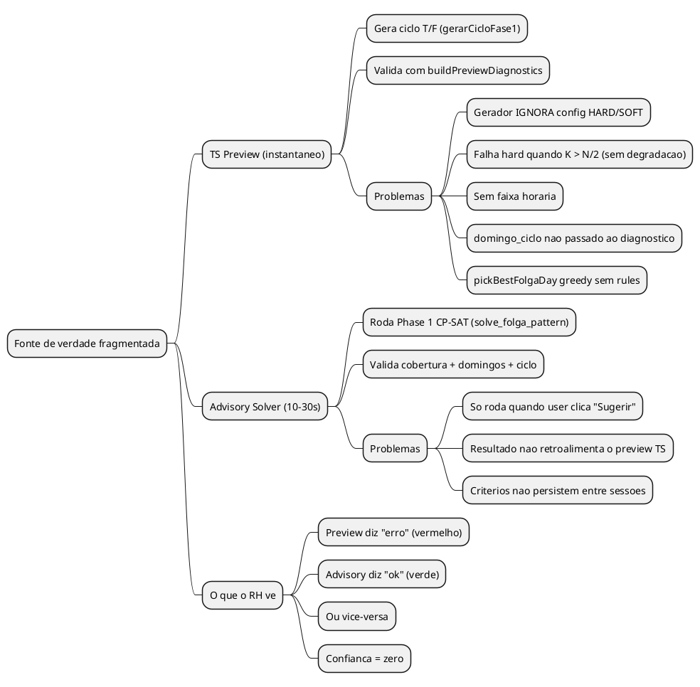
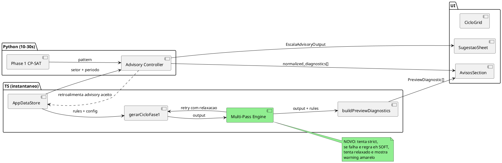
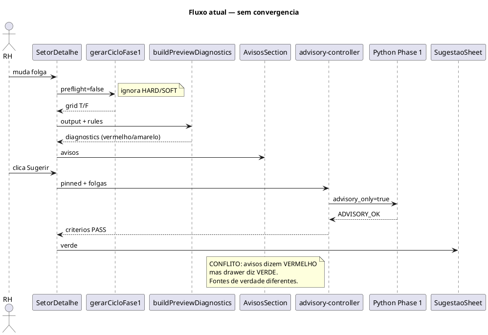
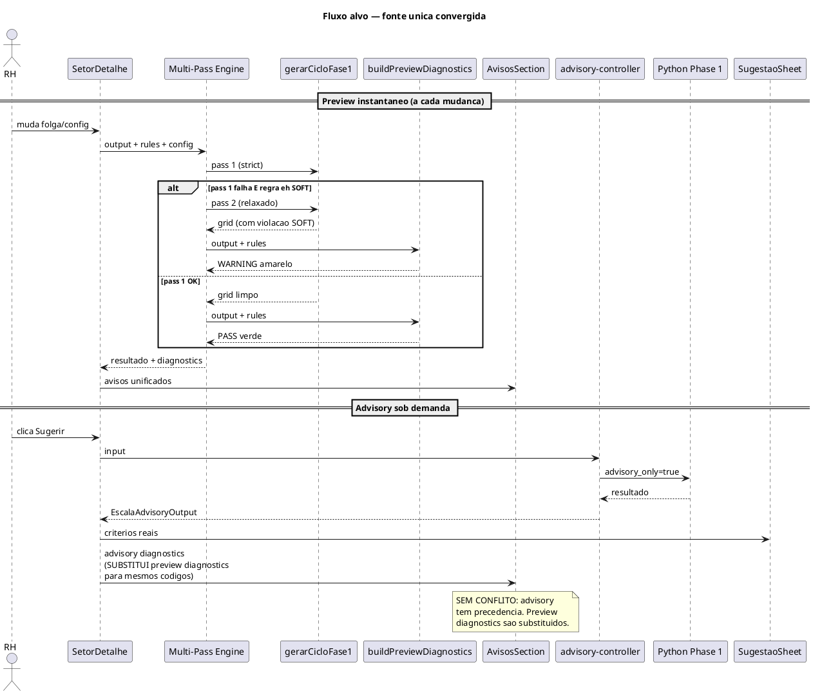
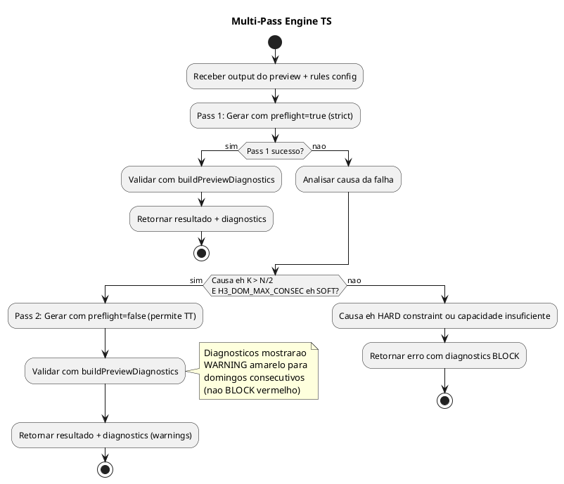
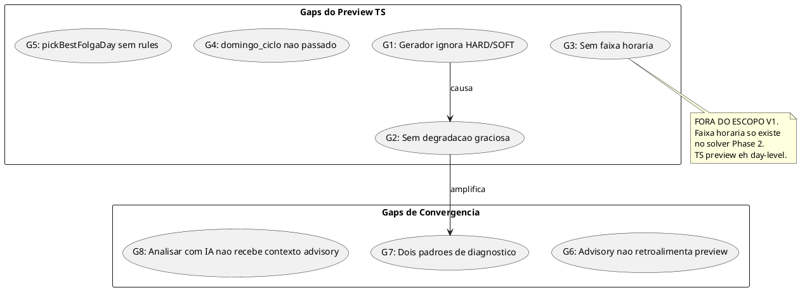
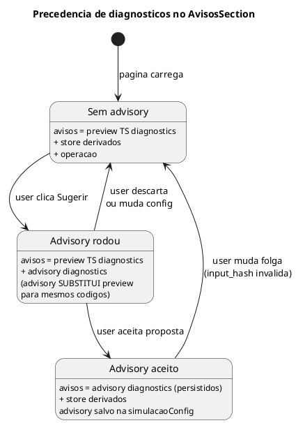

# BUILD — Fonte Unica: Preview TS + Advisory Solver

> Data: 2026-03-15
> Input: Investigacao profunda do simula-ciclo.ts, preview-diagnostics.ts, advisory-controller.ts, solver Phase 1
> Problema: Dois sistemas de verdade que nao conversam. TS preview gera/valida com regras parciais. Solver gera/valida com CP-SAT completo. RH fica perdido quando discordam.

---

## 1. Visao Geral

### 1.1 O problema real



### 1.2 A solucao: convergencia sem SAT no TS

O insight chave: Phase 1 do solver usa CP-SAT para ENCONTRAR a solucao otima. Mas VALIDAR uma solucao dada eh aritmetica pura. Nao precisa de SAT solver.

O que PRECISA de SAT (fica no Python):
- Encontrar distribuicao otima de folgas
- Minimizar spread entre colaboradores
- Balancear bandas MANHA/TARDE/INTEGRAL

O que NAO precisa de SAT (pode ir pro TS):
- H1: contar dias consecutivos (ja existe)
- H3 dom max consec: contar domingos seguidos (ja existe no diagnostico)
- H3 ciclo exato: formula N/gcd(N,K) (ja existe)
- Cobertura diaria: N - folgas >= demanda (ja existe)
- Multi-pass com relaxacao: tentar strict, relaxar se falhar (NAO EXISTE)



### 1.3 Principio de convergencia

```
TS preview = feedback instantaneo (melhor esforco, rule-aware)
Advisory solver = validacao autoritativa (CP-SAT, sob demanda)
AppDataStore = fonte unica de estado
AvisosSection = painel unico de mensagens (ambas fontes)

Regra: quando advisory roda, seus diagnosticos TEM PRECEDENCIA
sobre os do preview TS para os mesmos criterios.
```

---

## 2. Fluxos

### 2.1 Fluxo atual (QUEBRADO)



### 2.2 Fluxo alvo (CONVERGIDO)



---

## 3. Arquitetura do Multi-Pass Engine

### 3.1 O que eh

O Multi-Pass Engine nao eh um solver. Eh um **wrapper** em volta do `gerarCicloFase1` que tenta multiplas configuracoes e escolhe o melhor resultado que o RH pode ver com warnings corretos.

### 3.2 Activity — como funciona



### 3.3 Logica de relaxacao

```
Pass 1: preflight=true (strict — sem TT garantido)
  ↓ se falha E causa == K > kMaxSemTT
  ↓ E H3_DOM_MAX_CONSEC_M == SOFT ou H3_DOM_MAX_CONSEC_F == SOFT
  ↓
Pass 2: preflight=false (round-robin — TT pode acontecer)
  → diagnosticos detectam TT e mostram WARNING (amarelo)
  → RH pode prosseguir sabendo do risco
  ↓ se falha (impossivel — N=0 ou K>N)
  ↓
ERRO: retorna diagnostics BLOCK
```

Isso eh equivalente ao que o solver faz no Pass 1 → Pass 1b, mas sem SAT. O TS tenta strict, relaxa pra round-robin, e deixa os diagnosticos mostrarem o que relaxou.

---

## 4. Gaps a fechar

### 4.1 Gap por gap



### 4.2 Solucoes por gap

| Gap | Solucao | Onde | Esforco |
|-----|---------|------|---------|
| G1 | Multi-Pass Engine passa `preflight` baseado em rules | `simula-ciclo.ts` ou novo wrapper | Baixo |
| G2 | Multi-Pass Engine: try strict → fallback relaxed com warnings | Novo `preview-multi-pass.ts` | Medio |
| G3 | FORA DO ESCOPO V1 — faixa horaria so no solver | - | - |
| G4 | Passar `domingo_ciclo_trabalho/folga` de previewSetorRows ao diagnostico | `SetorDetalhe.tsx:1262-1267` | Baixo |
| G5 | FORA DO ESCOPO V1 — pickBestFolgaDay funciona bem enough | - | - |
| G6 | Quando advisory roda, salvar diagnostics no state; buildPreviewAvisos substitui | `SetorDetalhe.tsx` | Baixo (ja parcial) |
| G7 | Advisory diagnostics com `advisory_` prefix substituem `diagnostic_` com mesmo codigo base | `build-avisos.ts` | Baixo |
| G8 | `abrirAnaliseIa` passa contexto_ia do advisory aceito como prompt | `SetorDetalhe.tsx` | Baixo |

---

## 5. Estrutura de codigo

### 5.1 Arquivo novo

```
src/shared/preview-multi-pass.ts     [NOVO — ~80 linhas]
```

### 5.2 Arquivos modificados

```
src/shared/simula-ciclo.ts           [sem mudanca — wrapper usa como esta]
src/shared/preview-diagnostics.ts    [sem mudanca — ja tem HARD/SOFT]
src/renderer/src/paginas/SetorDetalhe.tsx    [4 edits focados]
src/renderer/src/lib/build-avisos.ts        [1 edit — dedup advisory > preview]
```

### 5.3 Responsabilidades

| Arquivo | Papel | Muda? |
|---------|-------|-------|
| `preview-multi-pass.ts` | Wrapper que tenta strict → relaxed | **NOVO** |
| `simula-ciclo.ts` | Gerador puro (sem rules) | Nao |
| `preview-diagnostics.ts` | Validador rule-aware | Nao |
| `SetorDetalhe.tsx` | Orquestrador — usa multi-pass + wiring | Sim |
| `build-avisos.ts` | Merge avisos — advisory substitui preview | Sim |

---

## 6. Contrato do Multi-Pass Engine

```ts
// src/shared/preview-multi-pass.ts

import type { SimulaCicloFase1Input, SimulaCicloOutput } from './simula-ciclo'
import type { PreviewDiagnostic } from './preview-diagnostics'
import type { RuleConfig } from './types'

interface MultiPassInput {
  fase1Input: SimulaCicloFase1Input
  diagnosticsInput: {
    participants: Array<{
      id: number
      nome: string
      sexo: 'M' | 'F'
      domingo_ciclo_trabalho?: number
      domingo_ciclo_folga?: number
      folga_fixa_dom?: boolean
    }>
    demandaPorDia: number[]
    trabalhamDomingo: number
  }
  rules: RuleConfig
}

interface MultiPassResult {
  output: SimulaCicloOutput
  diagnostics: PreviewDiagnostic[]
  pass_usado: 1 | 2
  relaxed: boolean
}

export function runPreviewMultiPass(input: MultiPassInput): MultiPassResult
```

Logica interna:

```
1. Chamar gerarCicloFase1({ ...fase1Input, preflight: true })
2. Se sucesso:
   - Chamar buildPreviewDiagnostics(output, diagnosticsInput, rules)
   - Retornar { output, diagnostics, pass_usado: 1, relaxed: false }
3. Se falha E causa eh K > kMaxSemTT:
   - Checar se H3_DOM_MAX_CONSEC_M ou H3_DOM_MAX_CONSEC_F eh SOFT
   - Se sim: chamar gerarCicloFase1({ ...fase1Input, preflight: false })
   - Chamar buildPreviewDiagnostics(output, diagnosticsInput, rules)
   - Diagnosticos vao naturalmente mostrar WARNING (amarelo) para dom consec
   - Retornar { output, diagnostics, pass_usado: 2, relaxed: true }
4. Se nenhum pass funciona:
   - Retornar { output: erro, diagnostics: [BLOCK], pass_usado: 1, relaxed: false }
```

---

## 7. Wiring — como SetorDetalhe muda

### 7.1 Usar multi-pass em vez de gerarCicloFase1 direto

**Antes** (SetorDetalhe:1153):
```ts
const resultado = gerarCicloFase1({ ..., preflight: false })
```

**Depois:**
```ts
const multiPassResult = runPreviewMultiPass({
  fase1Input: { ..., preflight: true }, // multi-pass decide
  diagnosticsInput: { participants, demandaPorDia, trabalhamDomingo },
  rules: previewRuleConfig,
})
const resultado = multiPassResult.output
```

### 7.2 Passar domingo_ciclo ao diagnostico (Gap G4)

**Antes** (SetorDetalhe:1262-1267):
```ts
participants: simulacaoPreview.previewRows.map((row) => ({
  id: row.titular.id,
  nome: row.titular.nome,
  sexo: row.titular.sexo,
  folga_fixa_dom: row.folgaFixaDom,
})),
```

**Depois** (dentro do multi-pass, que ja recebe participants completo):
```ts
participants: simulacaoPreview.previewRows.map((row) => ({
  id: row.titular.id,
  nome: row.titular.nome,
  sexo: row.titular.sexo,
  folga_fixa_dom: row.folgaFixaDom,
  domingo_ciclo_trabalho: row.titular.domingo_ciclo_trabalho,
  domingo_ciclo_folga: row.titular.domingo_ciclo_folga,
})),
```

Nota: verificar se `previewSetorRows` tem acesso a `domingo_ciclo_trabalho/folga` do colaborador. Se nao tiver, buscar do `colaboradores` array que o AppDataStore ja carrega.

### 7.3 Advisory substitui preview diagnostics (Gap G7)

**Em `build-avisos.ts`** — quando advisory diagnostics existem, remover preview diagnostics com o mesmo codigo base:

```ts
// Antes de push advisory diagnostics, filtrar conflitos:
if (advisoryDiagnostics && advisoryDiagnostics.length > 0) {
  const advisoryCodes = new Set(advisoryDiagnostics.map(d => d.code))
  // Remove preview diagnostics que o advisory substituiu
  entries = entries.filter(e =>
    !e.id.startsWith('diagnostic_') ||
    !advisoryCodes.has(e.id.replace('diagnostic_', 'ADVISORY_'))
  )
}
```

### 7.4 "Analisar com IA" recebe contexto advisory (Gap G8)

**Em SetorDetalhe**, `abrirAnaliseIa` hoje so abre o painel:
```ts
const abrirAnaliseIa = useCallback(() => {
  useIaStore.getState().setAberto(true)
}, [])
```

**Mudar para:**
```ts
const abrirAnaliseIa = useCallback(() => {
  const advisoryContext = advisoryResult
    ? `Diagnostico do solver advisory: ${JSON.stringify(advisoryResult.current.criteria.filter(c => c.status === 'FAIL').map(c => c.title))}`
    : previewDiagnostics.length > 0
      ? `Diagnosticos do preview: ${previewDiagnostics.map(d => d.title).join('; ')}`
      : undefined

  if (advisoryContext) {
    const prompt = `Analise os problemas da escala do setor ${setor?.nome}: ${advisoryContext}`
    useIaStore.getState().setPendingAutoMessage(prompt)
  }
  useIaStore.getState().setAberto(true)
}, [advisoryResult, previewDiagnostics, setor?.nome])
```

---

## 8. State Diagram — como diagnosticos convergem



---

## 9. O que NAO fazer (decisoes explicitas)

| Tentacao | Por que nao | Alternativa |
|----------|-------------|-------------|
| Portar SAT solver pra TS | Complexidade insana, peso do bundle, reinventar OR-Tools | Multi-pass com greedy + diagnosticos |
| Faixa horaria no preview TS | Requer horarios completos que TS nao tem | Deixar pro solver Phase 2 |
| Remover preview TS em favor de so advisory | Advisory leva 10-30s, RH quer feedback instantaneo | Manter ambos, convergir diagnosticos |
| Guardar advisory no banco em tabela nova | Premature — simula config JSON basta | advisory no SetorSimulacaoConfig |
| pickBestFolgaDay rule-aware | Complexidade alta, ganho baixo, solver faz melhor | Manter greedy simples |

---

## 10. Consolidacao

### TL;DR

- Criar `preview-multi-pass.ts` (~80 linhas) que tenta strict → relaxed baseado em HARD/SOFT config
- Passar `domingo_ciclo_trabalho/folga` ao diagnostico (1 edit)
- Advisory diagnostics substituem preview para mesmos codigos (1 edit)
- "Analisar com IA" envia contexto do advisory/preview como prompt (1 edit)
- Nao tocar no gerador nem no solver — so wiring

### Checklist de implementacao

| # | Item | Tipo | Dep | Esforco |
|---|------|------|-----|---------|
| 1 | Criar `preview-multi-pass.ts` com testes | Shared | - | Medio |
| 2 | SetorDetalhe usa multi-pass em vez de gerarCicloFase1 direto | Wiring | 1 | Baixo |
| 3 | Passar domingo_ciclo ao diagnostico | Fix | - | Baixo |
| 4 | Advisory substitui preview diagnostics em build-avisos | Fix | - | Baixo |
| 5 | "Analisar com IA" envia contexto advisory | Feature | - | Baixo |
| 6 | Testes de convergencia (TS warning == solver warning) | Teste | 1,2,3 | Medio |

### Riscos

| Risco | Impacto | Mitigacao |
|-------|---------|-----------|
| Multi-pass relaxed gera grid com TT que assusta RH | Medio | Warning amarelo explicito: "Domingos consecutivos permitidos (regra SOFT)" |
| domingo_ciclo_trabalho nao disponivel em previewSetorRows | Baixo | Buscar do colaboradores array no AppDataStore |
| Advisory diagnostics substituem preview que era mais recente | Baixo | Invalidar advisory quando preview muda (ja existe) |
