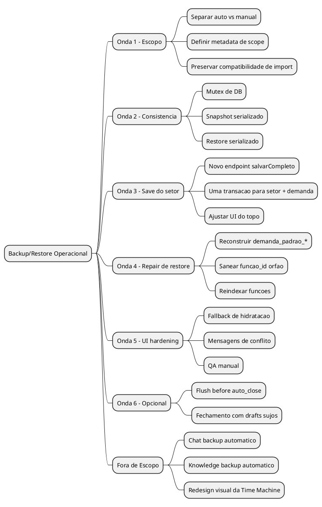
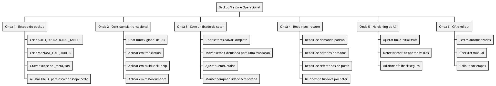
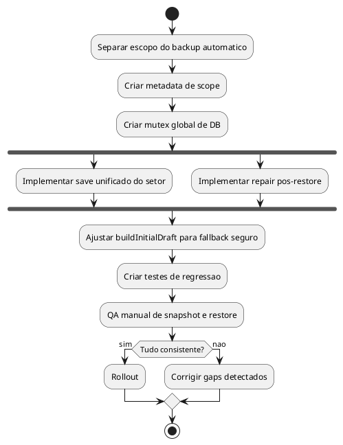
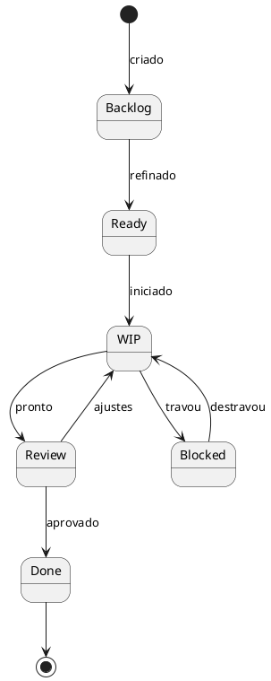

# WARLOG - Backup / Restore Operacional de Setor, Postos e Demanda

## TL;DR

O problema nao e um bug isolado no restore. O sistema atual permite que a Maquina do Tempo capture estado parcial do banco e depois restaure esse estado cru sem reconciliar as fontes de verdade. Isso afeta:

- `postos` / `funcoes`
- `setores.demanda_padrao_*`
- `setor_horario_semana`
- `demandas` por dia

O plano correto e:

1. separar `auto backup operacional` de `backup completo manual`
2. serializar snapshot/save/restore no nivel do banco
3. unificar o save do topo do setor em uma transacao unica
4. reparar o estado operacional imediatamente apos restore
5. endurecer a hidratacao da UI para conflito entre `padrao` e `dias`
6. opcional depois: flush de drafts antes do `auto_close`

---

## Missao

Fazer a Maquina do Tempo restaurar com confiabilidade o estado operacional do sistema, com foco em:

- dados do setor
- postos
- demanda por faixa horaria
- horarios por dia
- excecoes operacionais

Sem depender de chat, memorias IA, knowledge base ou outras tabelas nao essenciais no backup automatico.

---

## Objetivo de Negocio

Quando o usuario criar um snapshot automatico ou restaurar um snapshot automatico, o sistema deve voltar exatamente com:

- mesmos postos e titulares validos
- mesmo `padrao` de demanda do setor
- mesmos dias herdando ou sobrescrevendo o `padrao`
- mesmas faixas e quantidades por faixa

### Metrica de sucesso

- restaurar um snapshot e abrir `SetorDetalhe` deve mostrar a mesma composicao visual e de banco do momento em que o snapshot foi criado
- nenhum snapshot automatico deve sair com `setores` novos e `demandas` velhas, ou vice-versa
- restore nao pode deixar `colaboradores.funcao_id` apontando para `funcoes` inexistentes

---

## Escopo

### Faz parte

- `src/main/tipc.ts`
- `src/main/backup.ts`
- `src/main/db/query.ts`
- `src/main/db/schema.ts`
- `src/main/funcoes-service.ts`
- `src/renderer/src/paginas/SetorDetalhe.tsx`
- `src/renderer/src/componentes/DemandaEditor.tsx`
- testes `main` e `renderer` relacionados

### Nao faz parte nesta onda

- backup automatico de:
  - `ia_conversas`
  - `ia_mensagens`
  - `ia_memorias`
  - `knowledge_sources`
  - `knowledge_chunks`
  - `knowledge_entities`
  - `knowledge_relations`
  - `configuracao_ia`
- redesign da UI da Maquina do Tempo
- autosave completo de todos os formulários
- sync remoto / cloud backup

---

## Diagnostico Forense

## Sintoma observado

- restore nao recupera corretamente `postos`
- restore pode trazer `padrao do setor` errado
- restore pode trazer `faixas por dia` erradas ou divergentes do `padrao`
- edicao manual salva corretamente agora, mas o backup automatico ainda pode fotografar estado inconsistente

## Causa raiz 1 - snapshot sem isolamento

Hoje `createSnapshot()` chama `buildBackupZip()` em `src/main/backup.ts`, e `buildBackupZip()` faz `SELECT *` tabela por tabela, em sequencia, sem snapshot transacional do banco.

Arquivos relevantes:

- `src/main/backup.ts`
- `src/main/db/query.ts`
- `src/main/db/pglite.ts`

Problema:

- `PGlite` e singleton global
- `transaction()` usa `BEGIN/COMMIT` na mesma conexao global
- uma `SELECT` fora da transacao consegue ver estado intermediario

Consequencia:

- o ZIP pode capturar:
  - `setores.demanda_padrao_*` novo
  - `demandas` velha ou parcial
  - `setor_horario_semana` velho
- o mesmo risco existe para `funcoes` e `colaboradores`

## Causa raiz 2 - save do topo do setor e fragmentado

Hoje o topo da tela salva em duas chamadas separadas:

1. `setores.atualizar()`
2. `setores.salvarTimelineSemana()`

Mesmo que cada parte esteja certa internamente, entre as duas existe janela de inconsistência para snapshot e invalidação.

Arquivo relevante:

- `src/renderer/src/paginas/SetorDetalhe.tsx`

## Causa raiz 3 - restore importa dado cru e nao reconcilia

`importFromData()` atualmente:

- apaga tabelas
- reinsere tudo
- desliga FK com `session_replication_role = 'replica'`
- nao reconstrói `setores.demanda_padrao_*` a partir de `demandas` por dia
- nao limpa referencias orfas de `postos`

Arquivo relevante:

- `src/main/backup.ts`

Consequencia:

- um backup inconsistente pode ser restaurado com sucesso aparente
- a UI depois apenas expõe a divergencia

## Causa raiz 4 - buildInitialDraft prioriza o campo do setor

`DemandaEditor.buildInitialDraft()` prioriza:

1. `setor.demanda_padrao_hora_abertura`
2. `setor.demanda_padrao_hora_fechamento`
3. `setor.demanda_padrao_segmentos_json`
4. depois cai para dias

Isso esta certo quando o banco esta consistente.
Isso fica perigoso quando restore devolve `setores` e `dias` de instantes diferentes.

Arquivo relevante:

- `src/renderer/src/componentes/DemandaEditor.tsx`

---

## Estado Atual do Fluxo

### Save manual do topo

```text
SetorDetalhe.handleSalvarTudo
  -> setores.atualizar
  -> setores.salvarTimelineSemana
       -> UPDATE setores.demanda_padrao_*
       -> DELETE demandas legado null
       -> UPSERT setor_horario_semana
       -> DELETE/INSERT demandas por dia
```

### Snapshot automatico

```text
createSnapshot
  -> buildBackupZip
       -> SELECT * FROM empresa
       -> SELECT * FROM tipos_contrato
       -> SELECT * FROM setores
       -> SELECT * FROM demandas
       -> SELECT * FROM funcoes
       -> ...
```

### Restore

```text
restoreSnapshot
  -> parseBackupFile
  -> importFromData
       -> DELETE tabelas em ordem reversa
       -> INSERT tabelas em ordem de import
       -> sem reconciliacao semantica
```

### Hidratacao do editor

```text
buildInitialDraft
  -> usa setor.demanda_padrao_*
  -> senao legado null
  -> senao dias herdados
  -> senao primeiro dia com segmentos
```

---

## Estado Alvo

### Backup automatico

- capturar apenas o estado operacional
- nunca capturar estado parcial
- sempre gerar snapshot consistente

### Backup manual completo

- continuar existindo
- incluir IA e conhecimento
- ser explicitamente separado do automatico

### Restore

- restaurar
- reconciliar
- sanear referencias
- invalidar caches depois

### UI

- refletir estado restaurado corretamente
- priorizar `padrao` consistente
- nao mascarar corrupcao silenciosa

---

## Principios de Implementacao

1. uma unica fonte de verdade por fase do fluxo
2. snapshot nunca pode correr junto com save/restore
3. restore operacional precisa ser semantico, nao so relacional
4. backup automatico deve ser menor, mais rapido e mais previsivel
5. migracao precisa preservar compatibilidade com snapshots antigos

---

## Mapeando a Guerra

### Mind Map



### Missoes

- **Missao:** tornar backup/restore automatico operacionalmente confiavel
- **Objetivo:** restaurar setor exatamente como estava no instante persistido
- **Prazo recomendado:** executar em 5 ondas pequenas, com merge parcial por etapa

---

## Dump Categorizado

### Bugs

- snapshot pode ler banco no meio de uma transacao
- restore pode deixar `setor.demanda_padrao_*` divergente dos dias
- restore pode deixar `colaboradores.funcao_id` orfao
- save do topo do setor ainda e fragmentado

### Features

- scope de backup automatico operacional
- endpoint `setores.salvarCompleto`
- repair pos-restore
- metadata de backup por tipo

### Refactors

- centralizar seções criticas de DB
- centralizar repair de demanda padrao
- reduzir duplicidade de persistencia entre setor e dias

### Docs

- este warlog
- changelog interno da Time Machine
- doc curta de contrato de snapshot

### Research

- comportamento ideal de `PGlite` com transacao e leitura concorrente
- impacto de serializacao no main process

### Chores

- adicionar testes de regressao
- revisar IPC de restore
- revisar invalidações de store apos restore

---

## Quebrando em Partes

### WBS



### Prioridades

#### Nucleo

- Onda 1
- Onda 2
- Onda 3
- Onda 4

#### Importante

- Onda 5
- suite de regressao

#### Nice-to-have

- Onda 6 `flushBeforeSnapshot`

---

## Mapeando o que bloqueia o que

### Matriz de dependencias

| Task | Depende de | Bloqueia | Pode paralelo? |
|------|------------|----------|----------------|
| O1.1 separar scope de backup | - | O1.2, O6 QA auto | sim |
| O2.1 mutex global de DB | - | O2.2, O2.3, O4 QA | nao |
| O3.1 endpoint salvarCompleto | O2.1 recomendado | O3.2 | nao |
| O4.1 repair pos-restore | O1.1, O2.1 | O5.1, QA restore | parcial |
| O5.1 hardening UI | O4.1 recomendado | QA final | sim |
| O6.1 flush before auto_close | O2.1, O3.1 | melhoria futura | sim |

### Activity



---

## Backlog de Guerra

| ID | Tipo | Titulo | Status | Arquivos principais | Done |
|----|------|--------|--------|---------------------|------|
| O1.1 | Refactor | Separar tabelas do backup automatico | ✅ Done | `src/main/backup.ts` | FULL_ONLY_TABLES exclui IA/knowledge do auto |
| O1.2 | Feature | Gravar `scope` no `_meta.json` | ✅ Done | `src/main/backup.ts`, `types.ts` | scope: 'operational' ou 'full' no meta |
| O1.3 | Feature | Garantir import compativel com snapshots antigos | ✅ Done | `src/main/backup.ts` | scope? optional — backups antigos sem scope importam normalmente |
| O2.1 | Refactor | Criar lock de secao critica de DB | ✅ Done | `src/main/backup.ts` | withDbCriticalSection(label, fn) — mutex de processo |
| O2.2 | Bug | Aplicar lock em snapshot/export | ✅ Done | `src/main/backup.ts` | buildBackupZip roda dentro do CS |
| O2.3 | Bug | Aplicar lock em restore/import | ✅ Done | `src/main/backup.ts` | importFromData roda dentro do CS |
| O3.1 | Feature | Criar `setores.salvarCompleto` | ✅ Done | `src/main/tipc.ts` | setor + demanda em uma transacao dentro do CS |
| O3.2 | Refactor | Mover UI do topo para `salvarCompleto` | ✅ Done | `SetorDetalhe.tsx`, `servicos/setores.ts` | handleSalvarTudo usa endpoint unificado |
| O4.1 | Bug | Repair de `demanda_padrao_*` pos-restore | ✅ Done | `src/main/backup.ts` | repairRestoredOperationalState reconstroi padrao |
| O4.2 | Bug | Repair de `funcao_id` orfao pos-restore | ✅ Done | `src/main/backup.ts` | UPDATE colaboradores SET funcao_id = NULL onde orfao |
| O4.3 | Refactor | Reindexar `funcoes.ordem` por setor pos-restore | ✅ Done | `src/main/backup.ts` | reindexacao por setor dentro do repair |
| O4.4 | Bug | Criar `setor_horario_semana` ausente pos-restore | ✅ Done | `src/main/backup.ts` | compara segmentos do dia com padrao, infere usa_padrao, cria linha |
| O5.1 | Bug | Hardening de `buildInitialDraft` | ✅ Done | `DemandaEditor.tsx` | fallback pra dia herdado quando padrao fica vazio apos clipping |
| O5.2 | Docs/UI | Sinalizar conflito restaurado quando detectado | Backlog | `DemandaEditor.tsx` | conflito visivel em ambiente de debug |
| O6.1 | Feature | Flush before auto_close | Backlog | renderer + main | snapshot ao fechar tenta salvar drafts |

---

## Plano de Implementacao por Onda

## Onda 1 - Separar backup automatico do backup completo

### Objetivo

Fazer o automatico cuidar apenas do que importa para operacao.

### Mudancas

- substituir o conceito atual de categorias por dois perfis:
  - `AUTO_OPERATIONAL_TABLES`
  - `MANUAL_FULL_TABLES`
- manter `parseBackupFile()` e `importFromData()` aceitando backups antigos
- gravar no `_meta.json`:
  - `scope`
  - `light` opcionalmente deprecado ou removido

### Tabelas propostas para `AUTO_OPERATIONAL_TABLES`

- `empresa`
- `tipos_contrato`
- `setores`
- `funcoes`
- `colaboradores`
- `demandas`
- `setor_horario_semana`
- `empresa_horario_semana`
- `excecoes`
- `demandas_excecao_data`
- `contrato_perfis_horario`
- `colaborador_regra_horario`
- `colaborador_regra_horario_excecao_data`
- `feriados`
- `regra_empresa`
- `escalas`
- `alocacoes`
- `escala_decisoes`
- `escala_comparacao_demanda`
- `escala_ciclo_modelos`
- `escala_ciclo_itens`
- `configuracao_backup`

### Tabelas para `MANUAL_FULL_TABLES`

- tudo do automatico
- `configuracao_ia`
- `ia_conversas`
- `ia_mensagens`
- `ia_memorias`
- `knowledge_sources`
- `knowledge_chunks`
- `knowledge_entities`
- `knowledge_relations`

### Critério de aceite

- backup automatico nao gera ZIP com tabelas IA/knowledge
- backup manual completo continua disponivel
- restore aceita tanto automatico novo quanto backup antigo

---

## Onda 2 - Consistencia transacional do snapshot/restore

### Objetivo

Impedir que snapshot ou restore corram no meio de save operacional.

### Mudancas

- criar mutex global simples no main process, por exemplo:
  - `withDbCriticalSection(label, fn)`
- envolver:
  - `transaction()`
  - `buildBackupZip()`
  - `createExportZip()`
  - `restoreSnapshot()`
  - `importFromData()`

### Observacao importante

Mesmo que `transaction()` continue usando a mesma conexao do `PGlite`, o lock de processo ja elimina a janela onde um snapshot le estado intermediario.

### Critério de aceite

- nao e possivel iniciar backup no meio de `salvarTimelineSemana`
- nao e possivel restaurar snapshot enquanto save esta em andamento
- suite de teste consegue provar ausencia de estado misto

---

## Onda 3 - Save unificado do setor

### Objetivo

Parar de salvar setor e demanda em duas chamadas separadas.

### Mudancas

- criar `setores.salvarCompleto`
- input:
  - dados basicos do setor
  - `padrao`
  - `dias`
- implementar em transacao unica
- no renderer, `handleSalvarTudo()` passa a chamar apenas este endpoint

### Contrato desejado

```ts
type SalvarSetorCompletoInput = {
  setor_id: number
  setor: {
    nome: string
    icone: string | null
    hora_abertura: string
    hora_fechamento: string
    regime_escala: '5X2' | '6X1'
  }
  timeline: {
    padrao: {
      hora_abertura: string
      hora_fechamento: string
      segmentos: SegmentoPersistivel[]
    }
    dias: DiaPersistivel[]
  }
}
```

### Beneficios

- reduz janela de inconsistência
- reduz invalidação quebrada
- simplifica contrato do topo

### Critério de aceite

- um click em `Salvar` gera um commit unico no banco
- snapshot depois do save sempre pega o pacote completo

---

## Onda 4 - Repair pos-restore

### Objetivo

Depois de importar, transformar dado restaurado em estado operacional coerente.

### Nova rotina

`repairRestoredOperationalState()`

### Subtarefas

#### O4.1 Repair de demanda padrao

Para cada setor:

1. ler `setor.demanda_padrao_*`
2. ler `setor_horario_semana`
3. ler `demandas`
4. validar consistencia

### Regra de reconstrução proposta

Se `demanda_padrao_segmentos_json` estiver vazio, invalido ou contraditorio:

1. procurar primeiro dia com `usa_padrao = true` e com segmentos
2. usar esse dia como base do `padrao`
3. se nao houver, usar primeiro dia com segmentos
4. preencher:
  - `demanda_padrao_hora_abertura`
  - `demanda_padrao_hora_fechamento`
  - `demanda_padrao_segmentos_json`

Se existir `padrao` no setor mas ele conflitar com todos os dias herdados:

- considerar os dias herdados como mais confiaveis no contexto de restore
- regravar o `padrao` do setor alinhado com esses dias

#### O4.2 Repair de postos

Depois do import:

- limpar `colaboradores.funcao_id` cujo `funcoes.id` nao exista
- opcionalmente logar quantidade de reparos

#### O4.3 Reindex de ordem

Para cada setor:

- reordenar `funcoes.ordem` para evitar buracos e duplicidade

### Critério de aceite

- restore de backup parcialmente inconsistente nao deixa `padrao` quebrado
- restore nao deixa `funcao_id` orfao

---

## Onda 5 - Hardening da UI

### Objetivo

Evitar que a UI confie cegamente num `padrao` restaurado inconsistente.

### Mudancas

- extrair validacao/fallback da logica de `buildInitialDraft()`
- se `padrao` do setor conflitar com um dia `usa_padrao = true` com segmentos validos:
  - preferir o dia herdado como fallback
- manter prioridade atual quando tudo estiver consistente

### Regra sugerida

1. se `setor.demanda_padrao_segmentos_json` for valido e houver pelo menos um dia `usa_padrao=true` compativel, usar setor
2. se `setor.demanda_padrao_segmentos_json` estiver vazio/invalido, usar dia herdado
3. se nenhum dia herdado tiver segmentos, usar primeiro dia com segmentos
4. so usar full-window default como ultimo fallback

### Critério de aceite

- abrir `SetorDetalhe` apos restore mostra `padrao` coerente com os dias
- a UI nao “ressuscita” `07:00` ou outro `padrao` falso quando os dias contam outra historia

---

## Onda 6 - Flush before auto_close

### Objetivo

Melhorar a expectativa do usuario ao fechar o app com draft sujo.

### Importante

Isto nao e pre-requisito para corrigir o bug atual.
Isto resolve um gap conceitual: snapshot automatico hoje salva o ultimo estado persistido, nao o draft local.

### Estrategia

- no `before-quit`, pedir ao renderer um `flushBeforeSnapshot`
- cada pagina com dirty state pode:
  - salvar
  - recusar
  - falhar
- se falhar, registrar no log e seguir com ultimo estado persistido

### Critério de aceite

- fechar app com tela de setor suja tenta salvar antes de gerar snapshot

---

## Regras de Implementacao

### Regra 1

Nenhum snapshot automatico pode usar o conjunto completo de tabelas por default.

### Regra 2

Nenhum restore pode encerrar sem rodar o repair operacional.

### Regra 3

Nenhum save do topo do setor pode continuar fragmentado depois da Onda 3.

### Regra 4

Nao confiar em `session_replication_role = 'replica'` como se fosse “restore correto”. Isso so facilita importar. Nao valida consistencia.

---

## Suite de Testes de Regressao

## T1 - Snapshot consistente durante save semanal

### Objetivo

Garantir que backup nao captura `setores` novo com `demandas` velha.

### Cenário

- iniciar save do setor com delays controlados
- disparar snapshot no meio
- validar que snapshot reflete estado anterior completo ou posterior completo

### Esperado

- nunca estado misto

---

## T2 - Restore com `padrao` vazio e dias preenchidos

### Objetivo

Garantir backfill/repair do `padrao`.

### Cenário

- importar snapshot sem `demanda_padrao_segmentos_json`
- com `setor_horario_semana` + `demandas` por dia

### Esperado

- `padrao` reconstruido corretamente

---

## T3 - Restore com `padrao` contraditorio aos dias herdados

### Objetivo

Garantir que repair escolhe a fonte certa.

### Cenário

- `setores.demanda_padrao_*` aponta para faixas A
- dias `usa_padrao=true` tem faixas B

### Esperado

- restore final alinha `padrao` com B

---

## T4 - Restore com `funcao_id` orfao

### Objetivo

Garantir sanidade dos postos.

### Cenário

- colaborador aponta para `funcao_id` inexistente

### Esperado

- `funcao_id` fica `NULL`
- restore nao quebra

---

## T5 - Escopo do backup automatico

### Objetivo

Garantir que automatico nao leva IA/knowledge.

### Esperado

- ZIP automatico nao contem `ia_*`, `knowledge_*`, `configuracao_ia`

---

## T6 - Hidratacao da UI pos-restore

### Objetivo

Garantir que a aba `Padrao` abre coerente.

### Esperado

- `buildInitialDraft()` cai para a fonte consistente definida nas regras

---

## QA Manual

### Caso 1 - Snapshot automatico apos salvar setor

1. alterar `padrao`
2. salvar
3. criar snapshot automatico/manual operacional
4. alterar tudo de novo
5. restaurar snapshot
6. abrir setor

Esperado:

- `padrao` volta igual ao snapshot
- dias herdados continuam herdando
- dias customizados continuam customizados

### Caso 2 - Postos

1. criar/editar posto
2. trocar titular
3. criar snapshot
4. alterar posto de novo
5. restaurar

Esperado:

- posto e titular voltam coerentes
- sem colaborador apontando para posto inexistente

### Caso 3 - Conflito de restore legado

1. restaurar backup antigo
2. abrir setor com dias preenchidos

Esperado:

- `padrao` do setor e reconstruido quando necessario

---

## Rollout

### Fase A - Infra

- Onda 1
- Onda 2

### Fase B - Save

- Onda 3

### Fase C - Restore

- Onda 4
- Onda 5

### Fase D - Opcional

- Onda 6

### Estrategia

- merge por onda
- cada onda com testes e QA proprio
- nao acumular tudo num PR monolitico

---

## Gantt sugerido

```plantuml
@startgantt
Project starts 2026-03-19
[Onda 1 - Escopo backup] lasts 2 days
[Onda 2 - Mutex DB] lasts 2 days
[Onda 2 - Mutex DB] starts at [Onda 1 - Escopo backup]'s end
[Onda 3 - Save unificado] lasts 2 days
[Onda 3 - Save unificado] starts at [Onda 2 - Mutex DB]'s end
[Onda 4 - Repair pos-restore] lasts 3 days
[Onda 4 - Repair pos-restore] starts at [Onda 2 - Mutex DB]'s end
[Onda 5 - Hardening UI] lasts 2 days
[Onda 5 - Hardening UI] starts at [Onda 4 - Repair pos-restore]'s end
[QA + Rollout] lasts 2 days
[QA + Rollout] starts at [Onda 3 - Save unificado]'s end
@endgantt
```



---

## Estado das Tasks



---

## Ordem Recomendada de Execucao

1. Onda 1 - escopo de backup automatico
2. Onda 2 - mutex de DB
3. Onda 4 - repair pos-restore
4. Onda 3 - save unificado do setor
5. Onda 5 - hardening UI
6. Onda 6 - flush before auto_close

### Por que essa ordem

- Onda 1 reduz custo e superficie do automatico logo de cara
- Onda 2 elimina a causa mais grave de snapshot parcial
- Onda 4 protege restore mesmo para snapshots antigos ou tortos
- Onda 3 fecha a janela de inconsistência do fluxo do setor
- Onda 5 vira cinto de seguranca, nao muleta

---

## Perguntas em Aberto (FECHADAS)

| # | Pergunta | Decisao |
|---|----------|---------|
| 1 | Manual backup full por default? | Sim. Time Machine "Criar backup" = scope full. Botao rapido em Config = scope operational. |
| 2 | configuracao_ia fora do auto? | Sim. E config de IA, nao operacional. FULL_ONLY_TABLES exclui. |
| 3 | Log de repairs? | Sim. `repairRestoredOperationalState` ja loga via `log()` cada repair aplicado + total. |
| 4 | Banner debug de conflito? | Descartado. Se repair funciona, conflito nunca chega na UI. Hardening O5.1 e safety net silenciosa. |

---

## Definicao de Done Global

O trabalho so esta concluido quando:

- snapshot automatico usa apenas escopo operacional
- snapshot nao captura estado parcial
- restore roda repair operacional
- restore de `postos` nao deixa referencia orfa
- restore de `padrao` e `dias` abre correto na UI
- existe teste cobrindo os cenarios principais
- QA manual do setor passa ponta a ponta

---

## Nota final

Se tentar resolver isso so ajustando `buildInitialDraft()`, vai ficar bonito e falso.

O problema real e sistêmico:

- como salva
- como fotografa
- como restaura
- como reconcilia

Este warlog existe para impedir que a gente passe batom numa race condition vestida de feature.
