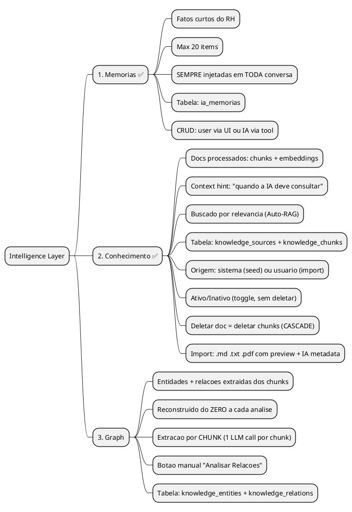
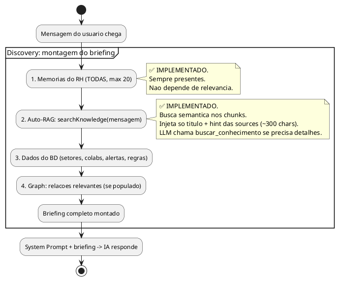

# SPEC: Intelligence Layer — Redesign Completo

> **Status:** Fases 1-3 IMPLEMENTADAS | Fase 4 próxima | Fase 5 backlog | Fase 6 P3
> **Data:** 2026-02-24 (v7 — pós-implementação Fase 3 Importação + UI)
> **Autor:** Marco + Monday (ANALYST Mode)

---

## TL;DR Executivo

O Intelligence Layer tem **3 conceitos** separados por propósito: **Memórias** (fatos curtos, sempre presentes), **Conhecimento** (docs processados com context hints, buscados por relevância), e **Graph** (relações entre entidades, reconstruído do zero a cada análise). A página de Memória tem 2 tabs: Sistema (read-only) e Usuário (CRUD completo). Docs importados aceitam PDF/.txt/.md, são extraídos e formatados pela IA com preview antes de salvar. O graph é extraído por chunk (não por doc inteiro) e deletar um doc limpa tudo em cascata.

---

## O Que Já Foi Feito

### Auditoria v1 — Bug Fixes (sessão anterior)

| Bug | Fix | Status |
|-----|-----|--------|
| BUG 1 — `intencao` fantasma no workflow | Workflow corrigido com campos reais | ✅ |
| BUG 2/9 — `explorar_relacoes` não registrada | Schema + IA_TOOLS + TOOL_SCHEMAS + handler adicionados | ✅ |
| BUG 3 — discovery mostrava entidades 0 | Removido entities count do `_statsKnowledge()` | ✅ |
| BUG 7 — doc regras-colaborador ausente | Criado `knowledge/sistema/regras-colaborador.md` (174 linhas) | ✅ |
| BUG 8 — describe do campo consulta | Limpo (sem prompt negativo) | ✅ |
| Refactor dia_semana_regra (10 arquivos) | Implementado por outro chat | ✅ (outro chat) |

### Fase 1 — Memórias ✅ IMPLEMENTADA (tsc 0 erros, 33 tools)

| # | Ação | Arquivo | Detalhe | Status |
|---|------|---------|---------|--------|
| 1 | DDL `ia_memorias` | `schema.ts` | +`DDL_V8_MEMORIAS` (id SERIAL, conteudo TEXT, criada_em, atualizada_em) | ✅ |
| 2 | Type `IaMemoria` | `types.ts` | Interface: id, conteudo, criada_em, atualizada_em | ✅ |
| 3 | 4 IPC handlers | `tipc.ts` | `ia.memorias.listar/salvar/remover/contar` (soft limit 20, upsert via id) | ✅ |
| 4 | 3 IA tools | `tools.ts` | `salvar_memoria` + `listar_memorias` + `remover_memoria` (schemas, IA_TOOLS, TOOL_SCHEMAS, handlers) | ✅ |
| 5 | Discovery injection | `discovery.ts` | `_memorias()` → injeta TODAS no INÍCIO do briefing, antes de tudo | ✅ |
| 6 | System prompt | `system-prompt.ts` | Seção 8 reescrita: Memórias (quando salvar, quando não, tools) + RAG (separado) | ✅ |
| 7 | Serviço renderer | `servicos/memorias.ts` | Novo: listar, salvar, remover, contar | ✅ |

**Decisões de implementação vs spec original:**

| Decisão | Spec dizia | Implementação real | Motivo |
|---------|-----------|-------------------|--------|
| Campo `titulo` | `titulo TEXT NOT NULL` | Removido — só `conteudo` | Memórias são fatos curtos ("Cleunice entra 08:00"), título separado é overhead |
| IPC `atualizar` | Handler separado | Merged com `salvar` (se `id` presente = update) | Upsert é mais simples, 1 handler em vez de 2 |
| IPC `contar` | Não previsto | Adicionado | UI vai precisar pra mostrar badge "X/20" |
| Tool handlers | Não detalhados na spec | 3 handlers com error codes: `LIMITE_MEMORIAS`, `NOT_FOUND`, `*_FALHOU` | Padrão 3-status (toolOk/toolError) existente |
| Posição no discovery | "INÍCIO do briefing" | Após header "CONTEXTO AUTOMÁTICO", antes de resumo global | Primeira informação que a IA vê |

**Contagem final:** 33 tools no IA_TOOLS / 33 entries no TOOL_SCHEMAS (era 30 → +explorar_relacoes da auditoria → +3 memórias)

### Fase 2 — Auto-RAG no Discovery + Context Hints ✅ COMPLETA (tsc 0 erros)

| # | Ação | Arquivo | Status |
|---|------|---------|--------|
| 8 | Param `mensagemUsuario` em `buildContextBriefing()` | `discovery.ts` | ✅ |
| 9 | `_autoRag()`: search nos chunks → injeta título+hint das sources | `discovery.ts` | ✅ |
| 10 | Passa `currentMsg` em ambos call sites (streaming + non-streaming) | `cliente.ts` | ✅ |
| 11 | `<!-- quando_usar: ... -->` nos 9 docs de `knowledge/` | `knowledge/*.md` | ✅ |
| 12 | `extractAndPrependHint()`: extrai hint → prepend + salva em metadata | `ingest.ts` | ✅ |
| 13 | Filtro `ativo = true` via JOIN em 4 CTEs (hybrid + keyword) | `search.ts` | ✅ |
| 14 | `buildContextForLlm()`: trunca chunks em 500 chars | `search.ts` | ✅ |
| 15 | Tool `buscar_conhecimento`: retorna só `context_for_llm` (sem chunks duplicados) | `tools.ts` | ✅ |
| 16 | Migration v11: cleanup knowledge sem hints → força re-seed | `schema.ts` | ✅ |

**Decisões de implementação (divergências da spec original):**

| Decisão | Spec original | Implementação real | Motivo |
|---------|--------------|-------------------|--------|
| Onde rodar Auto-RAG | AI SDK Middleware (`transformParams`) | `buildContextBriefing()` | Middleware dispara a cada step do loop multi-turn (até 10x). Discovery dispara 1x por mensagem |
| O que injeta no prompt | `context_for_llm` (chunks inteiros ~4500 chars) | Título + context_hint por source (~300 chars) | Chunks inteiros são caros em tokens e ruidosos. LLM sabe QUAIS docs existem, chama tool se precisa de detalhes |
| `maybeGenerateContextHint()` via LLM | Gerar hint via IA automaticamente | Hints manuais via `<!-- quando_usar -->` no .md | Docs são curados (9 no seed). IA só gera hint no fluxo de importação (Fase 3) |
| Campo `ativo` | Migration na Fase 3 | Antecipado — já existia via migration v10 | Campo `ativo` adicionado como `addColumnIfMissing` na migration existente |

#### Arquitetura de RAG — 3 Camadas de Acesso ao Conhecimento

```
CAMADA 1: Auto-RAG (automático, a cada mensagem)
  ┌──────────────────────────────────────────────────────────────┐
  │ Usuário manda msg                                            │
  │         ↓                                                    │
  │ embedding LOCAL (ONNX, offline) → search PGlite (vector+FTS) │
  │         ↓                                                    │
  │ Encontra chunks relevantes → sobe pro nível da SOURCE        │
  │         ↓                                                    │
  │ Injeta no prompt: título + context_hint (~300 chars total)   │
  │         ↓                                                    │
  │ LLM sabe: "existem docs sobre X, Y, Z"                      │
  │   → Se já sabe responder: responde ✓                         │
  │   → Se precisa detalhes: chama buscar_conhecimento ↓         │
  └──────────────────────────────────────────────────────────────┘

CAMADA 2: Tool buscar_conhecimento (sob demanda, LLM decide)
  ┌──────────────────────────────────────────────────────────────┐
  │ LLM chama buscar_conhecimento("intervalo de almoço")         │
  │         ↓                                                    │
  │ Mesmo search (vector + FTS), limite 5-10 chunks              │
  │         ↓                                                    │
  │ context_for_llm: chunks truncados em 500 chars cada          │
  │         ↓                                                    │
  │ LLM recebe: ~2500 chars com trechos relevantes               │
  └──────────────────────────────────────────────────────────────┘

CAMADA 3: Histórico (turnos anteriores, auto-truncado)
  ┌──────────────────────────────────────────────────────────────┐
  │ TOOL_RESULT_MAX_CHARS = 1500                                 │
  │ Tool results de turnos anteriores são truncados a 1500 chars │
  │ Evita que histórico longo estoure contexto                   │
  └──────────────────────────────────────────────────────────────┘
```

### Fase 3 — Importação de Conhecimento + UI ✅ COMPLETA (tsc 0 erros)

| # | Ação | Arquivo | Status |
|---|------|---------|--------|
| 17 | Fix `KnowledgeSource` (ativo, tipo union) | `types.ts` | ✅ |
| 18 | Extrair helpers IA (`resolveProviderApiKey`, `resolveModel`) | `ia/config.ts` (NOVO) | ✅ |
| 19 | Import helpers extraídos, remover duplicados | `ia/cliente.ts` | ✅ |
| 20 | +`pdf-parse@1.1.1` | `package.json` | ✅ |
| 21 | Update `knowledgeStats` (+ativo) | `tipc.ts` | ✅ |
| 22 | Update `knowledgeEscolherArquivo` (+pdf) | `tipc.ts` | ✅ |
| 23 | NOVO `knowledgeToggleAtivo` | `tipc.ts` | ✅ |
| 24 | NOVO `knowledgeObterTextoOriginal` | `tipc.ts` | ✅ |
| 25 | NOVO `knowledgeExtrairTexto` (.md/.txt/.pdf) | `tipc.ts` | ✅ |
| 26 | NOVO `knowledgeGerarMetadataIa` (titulo/quando/texto) | `tipc.ts` | ✅ |
| 27 | NOVO `knowledgeImportarCompleto` (com context hint) | `tipc.ts` | ✅ |
| 28 | +5 métodos serviço renderer | `servicos/conhecimento.ts` | ✅ |
| 29 | `VerConhecimentoDialog` (texto original + hint) | `componentes/VerConhecimentoDialog.tsx` (NOVO) | ✅ |
| 30 | `AdicionarConhecimentoDialog` (drop zone, preview, sparkle IA, PDF) | `componentes/AdicionarConhecimentoDialog.tsx` (NOVO) | ✅ |
| 31 | `MemoriaPagina`: toggle ativo (Switch), ver (Eye), dialog import | `paginas/MemoriaPagina.tsx` | ✅ |

**Decisões de implementação:**

| Decisão | Spec dizia | Implementação real | Motivo |
|---------|-----------|-------------------|--------|
| PDF lib | "pdf-parse ou @pdfjs-dist" | `pdf-parse@1.1.1` (v1 estável) | v2 mudou API (class PDFParse), v1 é estável e leve |
| Helpers IA | "funcoes privadas no cliente.ts" | Extraídos pra `ia/config.ts` (NOVO) | Reuso em `knowledgeGerarMetadataIa` sem duplicar |
| 2 tabs (Sistema/Usuário) | Fase 4 do spec | **Adiado pra Fase 4** — toggle + view + import estão na flat list | Prioridade era import funcional, tabs vêm no refactor |
| Drop zone | Spec genérico | `onDragOver/Drop` com `file.path` (Electron) + fallback `file.text()` | Cobre tanto drag real quanto Electron path |
| Auto-generate metadata | "3 campos auto" | `Promise.allSettled` pra titulo + quando em paralelo; texto só manual | titulo+quando são rápidos; formatação de texto é operação grande, user decide |

---

## Arquitetura: 3 Conceitos



### Diferença entre os 3

| Aspecto | Memórias | Conhecimento | Graph |
|---------|----------|-------------|-------|
| **O que é** | Fatos curtos | Docs processados com chunks | Rede de entidades |
| **Exemplo** | "Rita não troca turno" | Política de férias (2 págs) | Pedro --[trabalha_em]--> Açougue |
| **Quem cria** | IA (tool) ou user (UI) | User (importação) ou seed | Botão "Analisar Relações" |
| **Quando injeta** | SEMPRE (todas) | Auto-RAG por relevância | Se populado, por relevância |
| **Quantidade** | Max 20 | Sem limite rígido | Depende dos chunks |
| **Pode desativar** | Remover | Toggle ativo/inativo | Rebuild do zero |
| **Deletar** | Remove da tabela | Deleta source + chunks CASCADE | Rebuild exclui automaticamente |
| **Backend** | ✅ Pronto | ✅ Pronto (Auto-RAG, import, toggle, PDF, IA metadata) | Parcial (tabelas existem, falta rebuild por chunk) |
| **Frontend** | ✅ Serviço pronto, falta UI cards editáveis | ✅ Pronto (toggle, view, import dialog) | Falta botão + lista |

---

## Fluxo de Injeção no Discovery



---

## Plano de Implementação

### Fase 1 — Memórias Backend ✅ COMPLETA
### Fase 2 — Auto-RAG + Context Hints ✅ COMPLETA
### Fase 3 — Importação de Conhecimento + UI ✅ COMPLETA

(Detalhes acima na seção "O Que Já Foi Feito")

---

### Fase 4 — Refatorar MemoriaPagina (⏳ PRÓXIMA)

> **Objetivo:** Separar a página em 2 tabs, adicionar seção visual de Memórias com CRUD inline, e organizar Conhecimento por origem (Sistema vs Usuário). Os handlers e serviços já existem — é 100% frontend.

**O que já existe (implementado na Fase 3):**
- Toggle ativo (Switch) em cada doc ✅
- Botão ver conteúdo (Eye → `VerConhecimentoDialog`) ✅
- Botão importar → `AdicionarConhecimentoDialog` ✅
- `servicoMemorias.listar/salvar/remover/contar` ✅

**O que falta:**

| # | Ação | Detalhe |
|---|------|---------|
| 4.1 | **2 tabs: Usuário e Sistema** | `Tabs` shadcn no topo. Tab Usuário = memórias + docs do usuário. Tab Sistema = docs do seed (read-only). |
| 4.2 | **Seção Memórias** (tab Usuário) | Cards com conteúdo editável inline, botão salvar/cancelar. Badge "X/20" no header. Botão "+ Nova Memória" (inline, não dialog). Botão remover com confirmação. |
| 4.3 | **Separação Sistema vs Usuário** nos docs | Tab Sistema mostra `tipo='sistema'` read-only (sem toggle, sem remover). Tab Usuário mostra `tipo != 'sistema'` com controles completos. |
| 4.4 | **Seção Graph** (placeholder) | Ambas as tabs: status "Não analisado" ou "X entidades, Y relações". Botão "Analisar Relações" desabilitado (Fase 5). Lista de entidades expandível se populado. |
| 4.5 | **Stats cards por tab** | Tab Usuário: total memórias + total docs usuário + chunks. Tab Sistema: total docs sistema + chunks. |

**Wireframe atualizado:**

```
MemoriaPagina
│
├── [Tab: Usuario]  [Tab: Sistema]
│
├── Se tab USUARIO:
│   │
│   ├── SECAO: Memorias do RH
│   │   ├── Badge: "2/20"
│   │   ├── Card inline: "Cleunice entra 08:00" [✏️ Editar] [🗑 Remover]
│   │   ├── Card inline: "Black Friday = 8 no Caixa" [✏️ Editar] [🗑 Remover]
│   │   └── [+ Nova Memoria]  ← abre inline (input + salvar)
│   │
│   ├── SECAO: Conhecimento
│   │   ├── Item: "Politica de Ferias" | ● Ativo | 3 chunks | [Ver] [Toggle] [Remover]
│   │   ├── Item: "Acordo Coletivo" | ○ Inativo | 5 chunks | [Ver] [Toggle] [Remover]
│   │   └── [+ Adicionar Conhecimento]  ← abre AdicionarConhecimentoDialog
│   │
│   └── SECAO: Relacoes (Graph) — placeholder
│       ├── Status: "Nao analisado"
│       └── [Analisar Relacoes] (disabled — Fase 5)
│
└── Se tab SISTEMA:
    │
    ├── SECAO: Conhecimento do Sistema (read-only)
    │   ├── Item: "Regras de Jornada CLT" | 8 chunks | [Ver]
    │   ├── Item: "Visao Geral do Sistema" | 4 chunks | [Ver]
    │   └── ... (sem toggle, sem remover)
    │
    └── SECAO: Relacoes do Sistema — placeholder
        └── Status: "Nao analisado"
```

**Componentes necessários:**

| Componente | Status | Notas |
|------------|--------|-------|
| `Tabs` (shadcn) | Verificar se instalado | `npx shadcn@latest add tabs` se não |
| `VerConhecimentoDialog` | ✅ Existe | Fase 3 |
| `AdicionarConhecimentoDialog` | ✅ Existe | Fase 3 |
| `FonteItem` (interno) | ✅ Existe | Já tem toggle + ver + remover |
| `MemoriaItem` (NOVO, interno) | ❌ Precisa criar | Card editável inline com estado normal/editando |

**Estimativa:** ~200 linhas de mudança em MemoriaPagina + ~80 linhas MemoriaItem (componente interno).

---

### Fase 5 — Session Indexing + Smart Extraction + Compaction (⏳ P2)

> **Objetivo:** IA "lembra" de conversas passadas. Inteligência de longo prazo.

| # | Ação | Arquivo | Detalhe |
|---|------|---------|--------|
| 5.1 | Session Indexing ao mudar chat | `tipc.ts` ou `cliente.ts` | Transcrição sanitizada → ingestKnowledge tipo "session" |
| 5.2 | Smart Extraction ao mudar chat | `cliente.ts` | LLM extrai fatos → merge com existentes (cosine > 0.85) |
| 5.3 | Remover `maybeAutoCapture()` | `cliente.ts` | Substituído por Smart Extraction |
| 5.4 | History Compaction | `cliente.ts` | Summary Buffer: resume msgs antigas quando > ~30K tokens |
| 5.5 | Campo `resumo_compactado` | `schema.ts` (migration) | `ALTER TABLE ia_conversas ADD COLUMN IF NOT EXISTS resumo_compactado TEXT` |
| 5.6 | Toggle "Memória Automática" na UI | `MemoriaPagina.tsx` | Switch ON/OFF controla Session Indexing + Smart Extraction |
| 5.7 | Respeitar limites | `knowledge/ingest.ts` | Max 100 dinâmicas, max 50 transcripts |

---

### Fase 6 — Graph por Chunk (⏳ P3/Backlog)

> **Objetivo:** Extrair relações entre entidades dos docs. Caro (LLM por chunk). Manual.

| # | Ação | Arquivo | Detalhe |
|---|------|---------|--------|
| 6.1 | `extractEntitiesFromChunk()` | `knowledge/graph.ts` (NOVO) | generateObject + Zod schema |
| 6.2 | `rebuildGraph()` | `knowledge/graph.ts` | DELETE ALL → lê chunks ativos → extrai → merge → insere |
| 6.3 | IPC `knowledge.analisarRelacoes` | `tipc.ts` | Chama rebuildGraph, retorna stats |
| 6.4 | UI: botão + lista entidades | `MemoriaPagina.tsx` | Ativar botão "Analisar Relações" + loading + resultado expandível |

---

## Prioridades Atualizadas (pós Fase 3)

```
PROXIMO (100% frontend, backend pronto):
├── Fase 4: MemoriaPagina refactor (2 tabs, CRUD memorias, separar sistema/usuario)
│
P2 (requer backend novo, LLM calls):
├── Fase 5: Session Indexing + Smart Extraction + Compaction
│
P3 (backlog):
└── Fase 6: Graph por Chunk
```

---

## Schema do Banco (Estado Atual)

```
MEMORIAS ✅ (tabela — DDL_V8_MEMORIAS)
┌─────────────────────────────────────────────┐
│ ia_memorias                                 │
├─────────────────────────────────────────────┤
│ id            SERIAL PK                     │
│ conteudo      TEXT NOT NULL                 │
│ criada_em     TIMESTAMPTZ DEFAULT NOW()     │
│ atualizada_em TIMESTAMPTZ DEFAULT NOW()     │
└─────────────────────────────────────────────┘
Soft limit: 20 via app (IPC + tool handler)

CONHECIMENTO ✅ (campo ativo implementado, import completo)
┌─────────────────────────────────────────────┐
│ knowledge_sources                           │
├─────────────────────────────────────────────┤
│ id                SERIAL PK                 │
│ tipo              manual/auto_capture/sistema/importacao_usuario │
│ titulo            TEXT NOT NULL              │
│ conteudo_original TEXT NOT NULL              │
│ metadata          JSONB {context_hint, ...}  │
│ importance        high/low                  │
│ ativo             BOOLEAN DEFAULT true ✅    │
│ criada_em         TIMESTAMPTZ               │
│ atualizada_em     TIMESTAMPTZ               │
└─────────────────────────────────────────────┘
         │ 1:N CASCADE
┌─────────────────────────────────────────────┐
│ knowledge_chunks                            │
├─────────────────────────────────────────────┤
│ id            SERIAL PK                     │
│ source_id     FK → knowledge_sources        │
│ conteudo      TEXT (context hint + texto)    │
│ embedding     vector(768)                   │
│ search_tsv    TSVECTOR                      │
│ importance    high/low                      │
│ access_count  INTEGER DEFAULT 0             │
└─────────────────────────────────────────────┘

GRAPH (tabelas existem, populadas por botao — Fase 6)
┌────────────────────────┐    ┌────────────────────────┐
│ knowledge_entities     │    │ knowledge_relations    │
├────────────────────────┤    ├────────────────────────┤
│ id, nome, tipo         │←──→│ entity_from_id FK      │
│ embedding              │    │ entity_to_id FK        │
│ valid_from, valid_to   │    │ tipo_relacao, peso     │
└────────────────────────┘    └────────────────────────┘
Rebuild do zero a cada "Analisar Relacoes"
```

---

## Arquivos Implementados (Resumo Completo)

### Auditoria (bug fixes)

| Arquivo | Mudança |
|---------|---------|
| `src/main/ia/system-prompt.ts` | Workflow "Funcionário só pode de manhã" corrigido (campos reais) |
| `src/main/ia/tools.ts` | +`explorar_relacoes` (schema, IA_TOOLS, TOOL_SCHEMAS, handler) |
| `src/main/ia/discovery.ts` | Removido entities count do `_statsKnowledge()` |
| `knowledge/sistema/regras-colaborador.md` | Novo doc (174 linhas) — regras individuais de colaborador |

### Fase 1 (memórias)

| Arquivo | Mudança |
|---------|---------|
| `src/main/db/schema.ts` | +`DDL_V8_MEMORIAS`, registrado no `createTables()` |
| `src/shared/types.ts` | +`IaMemoria` interface |
| `src/main/tipc.ts` | +4 IPC handlers (`ia.memorias.*`), registrados no router |
| `src/main/ia/tools.ts` | +3 schemas, +3 IA_TOOLS, +3 TOOL_SCHEMAS, +3 executeTool handlers |
| `src/main/ia/discovery.ts` | +`_memorias()` helper, injeção no briefing |
| `src/main/ia/system-prompt.ts` | Seção 8 reescrita (Memórias + RAG separados) |
| `src/renderer/src/servicos/memorias.ts` | Novo arquivo (serviço IPC renderer) |

### Fase 2 (Auto-RAG)

| Arquivo | Mudança |
|---------|---------|
| `src/main/ia/discovery.ts` | +`_autoRag()`, param `mensagemUsuario` |
| `src/main/ia/cliente.ts` | Passa `currentMsg` pra `buildContextBriefing()` |
| `knowledge/**/*.md` (9 arquivos) | +`<!-- quando_usar: ... -->` header |
| `src/main/knowledge/ingest.ts` | `extractAndPrependHint()` |
| `src/main/knowledge/search.ts` | JOIN `ks.ativo = true` em 4 CTEs |
| `src/main/ia/tools.ts` | `buscar_conhecimento` retorna `context_for_llm` |
| `src/main/db/schema.ts` | Migration v11 (cleanup + re-seed) |

### Fase 3 (importação + UI)

| Arquivo | Mudança |
|---------|---------|
| `src/shared/types.ts` | Fix `KnowledgeSource`: +`ativo`, tipo union expandido |
| `src/main/ia/config.ts` | **NOVO** — `resolveProviderApiKey`, `resolveModel`, `PROVIDER_DEFAULTS` extraídos |
| `src/main/ia/cliente.ts` | Import de `config.ts`, funções duplicadas removidas |
| `package.json` | +`pdf-parse@1.1.1` |
| `src/main/tipc.ts` | +5 handlers (`toggleAtivo`, `obterTextoOriginal`, `extrairTexto`, `gerarMetadataIa`, `importarCompleto`), 2 updates (`stats` +ativo, `escolherArquivo` +pdf), router +5 entries |
| `src/renderer/src/servicos/conhecimento.ts` | +5 métodos, fix tipo stats |
| `src/renderer/src/componentes/VerConhecimentoDialog.tsx` | **NOVO** (~65 linhas) |
| `src/renderer/src/componentes/AdicionarConhecimentoDialog.tsx` | **NOVO** (~230 linhas) |
| `src/renderer/src/paginas/MemoriaPagina.tsx` | Toggle ativo (Switch), ver (Eye), dialog import, check IA disponível |

---

## Anti-Patterns (NÃO FAZER)

| Tentação | Por que não |
|----------|-----------|
| Aceitar .docx/.xlsx | Conversão complexa, user copia texto de Word |
| Modos "sempre/nunca" no doc | "IA decide" via context hint é suficiente. Toggle ativo/inativo cobre o resto |
| Mostrar chunks/scores pro user | Infra invisível — user quer "conhecimento", não "vetores" |
| Memórias com embedding/search | São max 20 e SEMPRE injetadas — busca semântica é overkill |
| Graph automático no ingest | Precisa visão global, caro por doc. Botão manual resolve |
| Guardar arquivo original | Sempre o texto processado. Arquivo é descartável |
| RAG separado pra docs | Chunking + embedding JÁ É o RAG. Delete cascata limpa tudo |
| Campo `titulo` na ia_memorias | Memórias são fatos curtos, título é overhead — só `conteudo` |

---

## Decisões Pendentes

- **`maybeAutoCapture`** (cliente.ts): Salva respostas com CLT como LOW em knowledge_sources. Com memórias separadas, avaliar se mantém ou remove na Fase 5 (substituir por Smart Extraction).
- **Tabs component**: Verificar se `Tabs` do shadcn já está instalado antes da Fase 4.
